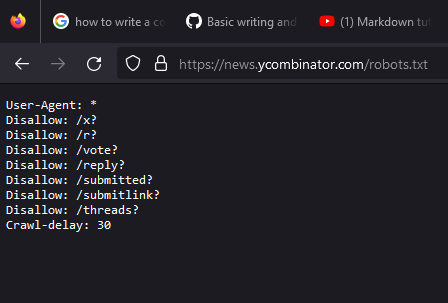

### 397 Day 45 Goals_ what you will make by the end of the day

We will be learning how to scrape websites for data, using modules like beautiful soup. 

By the end of the day, we will be collecting data from the empire website about 100 movies to watch.


We are gonna collect the data and present them ranked in the prescribed order.


### 398 Parsing HTML and Making Soup

Parsing an html file is the first step in getting the data in a website.

Get the starting code for today's lesson. It contains an html file that we will work with.

You can see that it is a simplified version of a cv website.

**Challenge - Get hold of the html file in your main.py file, store them in a variable named contents**

```python
with open(r'website.html', encoding="utf8") as website:
    contents = website.read()
    print(contents)
```

_The encoding="utf8" part is important here, otherwise the code throws a unicode error_

Now we are ready to make soup.

Create a new soup object.
We need to provide the contents and the parser in the object.
A parser is a software component that takes input data (frequently text) and builds a data structure.
This is going to help beautiful soup understand the html file's contents.

```python
soup = BeautifulSoup(contents, 'html.parser')
```

***For some websites, the html parser does not work. You need to use the lxml parser in those cases.***

```python
import lxml
soup = BeautifulSoup(contents, 'lxml')
```

Parsing is done.
Now we can extract the data from the website.

Let's say I want the title from the website

```python
print(soup.title)
```
Output - 
```
<title>Angela's Personal Site</title>
```
Also,
```python
print(soup.title)
print(soup.title.name)
print(soup.title.string)
```

```
<title>Angela's Personal Site</title>
title
Angela's Personal Site
```

The entire soup object now represents the html code.

If you print soup now, it will show the entire html code.

Also, if you want, there is a method called prettify, which will pretty print your soup, with proper html indentation.

```python
print(soup.prettify())
```
```
<!DOCTYPE html>
<html>
 <head>
  <meta charset="utf-8"/>
  <title>
   Angela's Personal Site
  </title>
 </head>
 <body>
  <h1 id="name">
   Angela Yu
  </h1>
  <p>
   <em>
    Founder of
    <strong>
     <a href="https://www.appbrewery.co/">
      The App Brewery
     </a>
    </strong>
    .
   </em>
  </p>
  <p>
   I am an iOS and Web Developer. I ❤️ coffee and motorcycles.
  </p>
  <hr/>
  <h3 class="heading">
   Books and Teaching
  </h3>
  <ul>
   <li>
    The Complete iOS App Development Bootcamp
   </li>
   <li>
    The Complete Web Development Bootcamp
   </li>
   <li>
    100 Days of Code - The Complete Python Bootcamp
   </li>
  </ul>
  <hr/>
  <h3 class="heading">
   Other Pages
  </h3>
  <a href="https://angelabauer.github.io/cv/hobbies.html">
   My Hobbies
  </a>
  <a href="https://angelabauer.github.io/cv/contact-me.html">
   Contact Me
  </a>
 </body>
</html>
```

We can also find elements using this soup.

```python
print(soup.a)
print(soup.p)
```
You get the first instances of the a tag and the p tag

```
<a href="https://www.appbrewery.co/">The App Brewery</a>
<p><em>Founder of <strong><a href="https://www.appbrewery.co/">The App Brewery</a></strong>.</em></p>
```

How do we get all the a tags or all the p tags?

Next lesson.

### 399 Finding and Selecting Particular Elements with BeautifulSoup

You do it with the built in find_all method

```python
print(soup.find_all("a"))
print(soup.find_all("p"))
```

```
[<a href="https://www.appbrewery.co/">The App Brewery</a>, <a href="https://angelabauer.github.io/cv/hobbies.html">My Hobbies</a>, <a href="https://angelabauer.github.io/cv/contact-me.html">Contact Me</a>]
[<p><em>Founder of <strong><a href="https://www.appbrewery.co/">The App Brewery</a></strong>.</em></p>, <p>I am an iOS and Web Developer. I ❤️ coffee and motorcycles.</p>]
```

What if we wanted to get the text portion of the tags?

```python
anchor_tags = soup.find_all("a")
for i in anchor_tags:
    print(i.getText())
```

```
The App Brewery
My Hobbies
Contact Me
```

What if we wanted to get the attribute, meaning the link?

```python
p_tags = soup.find_all("a")
for j in p_tags:
    print(j.get('href'))
```

```
https://www.appbrewery.co/
https://angelabauer.github.io/cv/hobbies.html
https://angelabauer.github.io/cv/contact-me.html
```

What if you wanted to find one specific tag? Maybe one that has a distinguishing element, like id?

```python
soup.find(name='h1', id='name')
```
```
<h1 id="name">Angela Yu</h1>
```

What if I wanted to get via class? Same method.
find methods gets one.
find-all method gets them all, since there can be multiple instances of class.
Note: do not use 'class' as an argument because 'class' refers of object classes in python.
use 'class_' instead

```python
soup.find(name='h3', class_='heading')
```
```
<h3 class="heading">Books and Teaching</h3>
```
```python
soup.find_all(name='h3', class_='heading')
```
```
[<h3 class="heading">Books and Teaching</h3>, <h3 class="heading">Other Pages</h3>]
```

Let's say you have a website with thousands of links/hrefs.
And you want just one from them.
'find' finds the first instance. 'find-all' finds all of them.
How do you get that specific one?
Using select-one functions and selector argument.

```python
soup.select_one(selector='p em')
soup.select_one(selector='p a')
print(soup.select_one(selector='p a').getText())
```
Here I am telling python to select one that has -

i. an em tag inside a p tag

ii. a tag inside a p tag

iii. from the one in (ii), find the text

```
<em>Founder of <strong><a href="https://www.appbrewery.co/">The App Brewery</a></strong>.</em>
<a href="https://www.appbrewery.co/">The App Brewery</a>
The App Brewery
```

The trick here is to smply narrow down on the element you are trying to find.
You can also use basic css selectors for the narrowing down.

```python
soup.select_one('#name')
soup.select_one('.heading')
soup.select('.heading')
```
```
<h1 id="name">Angela Yu</h1>
<h3 class="heading">Books and Teaching</h3>
[<h3 class="heading">Books and Teaching</h3>, <h3 class="heading">Other Pages</h3>]
```


### 400 [quiz] Beautiful Soup Exercises

### 400 Scraping a Live Website

Up until now, we scraped data from an html inside our pc.
Now we will pull data that is live on the internet.

```python
from bs4 import BeautifulSoup
import requests

response = requests.get('https://news.ycombinator.com/news')
print(response.status_code)
```
```
200
```

From here, we can use response.text to get the html of the website

Goal - 
The website, much like reddit, posts news articles related to tech.
The articles are arranged on the website based on an algo.
The also considers the recentness and the upvotes of the post in the algorithm.
However, we want to get only the highest upvoted posts, maybe the top highest upvoted posts.
Get the corresponding elements in html for the links and the upvote scores.

Timestamp 04:20

Create a soup object

```python
soup = BeautifulSoup(response.text, 'html.parser')
```

Now our soup is ready

Let's try to get the titles. All the article titles have the class 'titleline'

```python
print(soup.select('.titleline'))
```
Gives us a list of all the titles

```python
for i in soup.select('.titleline'):
    print(i.getText())
```

```
Griffin - A fully-regulated, API-driven bank, with Clojure (juxt.pro)
How far can you jump from a swing? (alexmolas.com)
Keystroke timing obfuscation added to ssh(1) (undeadly.org)
DOS/4GW made Windows 95 game compatibility easier, but with higher stakes (microsoft.com)
Webstudio: Open-source WYSIWYG adds Radix UI elements (webstudio.is)
MapReduce, TensorFlow, Vertex: Google's bet to avoid repeating history in AI (supervised.news)
Drumscript: A simple MIDI drum machine scripting language (github.com/tepreece)
MagicEdit: High-fidelity temporally coherent video editing (magic-edit.github.io)
A cheap radio hack disrupted Poland's railway system (wired.com)
The first observation of neutrinos at CERN's Large Hadron Collider (phys.org)
Show HN: Langfuse – Open-source observability and analytics for LLM apps (github.com/langfuse)
Ask HN: Why did Python win?
Accessible Palette: stop using HSL for color systems (2021) (wildbit.com)
FBI, partners dismantle Qakbot infrastructure (fbi.gov)
Starlink's User Terminal Firmware (quarkslab.com)
OneSignal (YC S11), email/SMS push notification platform, is hiring engineers (onesignal.com)
ISPs Should Not Police Online Speech – No Matter How Awful It Is (eff.org)
Hacking GTA V RP Servers Using Web Exploitation Techniques (nullpt.rs)
Grave flaws in BGP Error handling (benjojo.co.uk)
C.R. Rao: A Life in Statistics (2020) (bhavana.org.in)
iFixit Petitions Government for Right to Hack McDonald's Ice Cream Machine (404media.co)
Analysis of Obfuscation Techniques Found in Apple FairPlay (nicolo.dev)
FDA schedules meeting to establish regulatory rules for artificial womb trials (fda.gov)
Abandoned and little-known airfields (airfields-freeman.com)
Bobbi Gibb: The Boston Marathon pioneer who raced a lie (bbc.co.uk)
I chose the ThinkPad Z13 Gen1 as my Linux laptop (wimpysworld.com)
Why does the USA use 110V and UK use 230-240V? (2014) (electronics.stackexchange.com)
I don’t buy “duplication is cheaper than the wrong abstraction” (2021) (codewithjason.com)
China's Talismanic Tigers (britishmuseum.org)
Neutrons prove ‘Bond villain’ did not cause Arecibo telescope collapse (ornl.gov)
```

Got all the titles

Now for each title, let's get the link and score

```python
for k in soup.select(selector='.titleline a'):
    if k.get('href').startswith('https'):
        print(k.get('href'))
```
the startswith() function isolates only the url of the news, not other meaningless urls

```python
for l in soup.select(selector= '.score'):
    print(int(l.getText()[:-7]))
```
what the getText()[:-7] does is it gets rid of the string " points", which leaves us with just the number


Now get themm all into lists

```python
title_list = [i.getText() for i in soup.select(selector='.titleline')]
link_list = [k.get('href') for k in soup.select(selector='.titleline a') if k.get('href').startswith('https')]
score_list = [int(l.getText()[:-7]) for l in soup.select(selector= '.score')]
```

The idea is to loop through the sorted score list, for each score get the index number it represents, 
use that index number to get the corresponding news and link

```python
for i in sorted(score_list, reverse=True)[0:10]:
    index_num = score_list.index(i)
    print(title_list[index_num])
    print(link_list[index_num])
```


### 401 Is Web Scraping Legal_

You can see what the website allows you to scrape - 
Just type robot.txt at the end of the url and hit enter




### 402 100 Movies that You Must Watch

Basically empire's website contains a list of 100 best movies to watch.
The goal is to scrape that list.
Issues - 

i. The list is in reverse order, i.e. starts from 100.

ii. The list needs to be populated in a text file.


Create Soup

```python
from bs4 import BeautifulSoup
import requests

response = requests.get('https://www.empireonline.com/movies/features/best-movies-2/')

soup = BeautifulSoup(response.text, 'html.parser')
```

Create an empty dict, this is where the movie ranks and names will be put as keys and values
```python
movies_dict = {}
```

Populate the dict
```python
for i in soup.select(selector='.listicleItem_listicle-item__title__hW_Kn'):
    temp_list = i.getText().split(') ')
    movies_dict[int(temp_list[0])] = temp_list[1]
```

Now this dict contains the list in reverse order
```python
print(movies_dict)
```
```
{100: 'Reservoir Dogs', 99: 'Groundhog Day', 98: 'Paddington 2', 97: 'Amelie', 96: 'Brokeback Mountain', 95: 'Donnie Darko', 94: 'Scott Pilgrim Vs. The World', 93: 'Portrait Of A Lady On Fire', 92: 'Léon', 91: 'Logan', 90: 'The Terminator', 89: 'No Country For Old Men', 88: 'Titanic', 87: 'The Exorcist', 86: 'Black Panther', 85: 'Shaun Of The Dead', 84: 'Lost In Translation', 83: 'Thor: Ragnarok', 82: 'The Usual Suspects', 81: 'Psycho', 80: 'L.A. Confidential', 79: 'E.T. – The Extra Terrestrial', 78: 'In The Mood For Love', 77: 'Star Wars: Return Of The Jedi', 76: 'Arrival', 75: 'A Quiet Place', 74: 'Trainspotting', 73: 'Mulholland Drive', 72: 'Rear Window', 71: 'Up', 70: 'Spider-Man: Into The Spider-Verse', 69: 'Inglourious Basterds', 68: 'Lady Bird', 67: "Singin' In The Rain", 66: "One Flew Over The Cuckoo's Nest", 65: 'Seven Samurai', 64: 'La La Land', 63: 'Get Out', 62: 'Lawrence Of Arabia', 61: "Pan's Labyrinth", 60: 'Hot Fuzz', 59: 'Moonlight', 58: 'Guardians Of The Galaxy', 57: 'Blade Runner 2049', 56: 'The Social Network', 55: 'Taxi Driver', 54: 'Saving Private Ryan', 53: 'Forrest Gump', 52: ' Point Break', 51: 'Whiplash', 50: 'Vertigo', 49: 'Spirited Away', 48: 'Ghostbusters', 47: 'Do The Right Thing', 46: "Schindler's List", 45: 'The Big Lebowski', 44: "It's A Wonderful Life", 43: 'There Will Be Blood', 42: '12 Angry Men', 41: 'The Silence Of The Lambs', 40: ' Citizen Kane', 39: 'Gladiator', 38: 'The Good, The Bad And The Ugly', 37: 'Se7en', 36: 'Eternal Sunshine Of The Spotless Mind', 35: 'The Shining', 34: 'The Lord Of The Rings: The Two Towers', 33: 'Casablanca', 32: 'The Thing', 31: 'Interstellar', 30: 'Heat', 29: 'Apocalypse Now', 28: 'Indiana Jones And The Last Crusade', 27: 'The Lord Of The Rings The Return Of The King', 26: 'Die Hard', 25: 'Fight Club', 24: 'Terminator 2 Judgment Day', 23: '2001: A Space Odyssey', 22: 'Avengers: Endgame', 21: 'Alien', 20: 'The Matrix', 19: 'Inception', 18: 'Parasite', 17: 'Aliens', 16: 'Blade Runner', 15: 'Jurassic Park', 14: 'The Godfather Part II', 13: 'Back To The Future', 12: 'Mad Max: Fury Road', 11: 'Star Wars', 10: 'Goodfellas', 9: 'Raiders Of The Lost Ark', 8: 'Avengers: Infinity War', 7: 'Pulp Fiction', 6: 'Jaws', 5: 'The Shawshank Redemption', 4: 'The Dark Knight', 3: 'The Godfather', 2: 'Star Wars: The Empire Strikes Back', 1: 'The Lord Of The Rings: The Fellowship Of The Ring'}
```

We need sorted dict

```python
movies_dict_sorted = dict(sorted(movies_dict.items()))
print(movies_dict_sorted)
```
```
{1: 'The Lord Of The Rings: The Fellowship Of The Ring', 2: 'Star Wars: The Empire Strikes Back', 3: 'The Godfather', 4: 'The Dark Knight', 5: 'The Shawshank Redemption', 6: 'Jaws', 7: 'Pulp Fiction', 8: 'Avengers: Infinity War', 9: 'Raiders Of The Lost Ark', 10: 'Goodfellas', 11: 'Star Wars', 12: 'Mad Max: Fury Road', 13: 'Back To The Future', 14: 'The Godfather Part II', 15: 'Jurassic Park', 16: 'Blade Runner', 17: 'Aliens', 18: 'Parasite', 19: 'Inception', 20: 'The Matrix', 21: 'Alien', 22: 'Avengers: Endgame', 23: '2001: A Space Odyssey', 24: 'Terminator 2 Judgment Day', 25: 'Fight Club', 26: 'Die Hard', 27: 'The Lord Of The Rings The Return Of The King', 28: 'Indiana Jones And The Last Crusade', 29: 'Apocalypse Now', 30: 'Heat', 31: 'Interstellar', 32: 'The Thing', 33: 'Casablanca', 34: 'The Lord Of The Rings: The Two Towers', 35: 'The Shining', 36: 'Eternal Sunshine Of The Spotless Mind', 37: 'Se7en', 38: 'The Good, The Bad And The Ugly', 39: 'Gladiator', 40: ' Citizen Kane', 41: 'The Silence Of The Lambs', 42: '12 Angry Men', 43: 'There Will Be Blood', 44: "It's A Wonderful Life", 45: 'The Big Lebowski', 46: "Schindler's List", 47: 'Do The Right Thing', 48: 'Ghostbusters', 49: 'Spirited Away', 50: 'Vertigo', 51: 'Whiplash', 52: ' Point Break', 53: 'Forrest Gump', 54: 'Saving Private Ryan', 55: 'Taxi Driver', 56: 'The Social Network', 57: 'Blade Runner 2049', 58: 'Guardians Of The Galaxy', 59: 'Moonlight', 60: 'Hot Fuzz', 61: "Pan's Labyrinth", 62: 'Lawrence Of Arabia', 63: 'Get Out', 64: 'La La Land', 65: 'Seven Samurai', 66: "One Flew Over The Cuckoo's Nest", 67: "Singin' In The Rain", 68: 'Lady Bird', 69: 'Inglourious Basterds', 70: 'Spider-Man: Into The Spider-Verse', 71: 'Up', 72: 'Rear Window', 73: 'Mulholland Drive', 74: 'Trainspotting', 75: 'A Quiet Place', 76: 'Arrival', 77: 'Star Wars: Return Of The Jedi', 78: 'In The Mood For Love', 79: 'E.T. – The Extra Terrestrial', 80: 'L.A. Confidential', 81: 'Psycho', 82: 'The Usual Suspects', 83: 'Thor: Ragnarok', 84: 'Lost In Translation', 85: 'Shaun Of The Dead', 86: 'Black Panther', 87: 'The Exorcist', 88: 'Titanic', 89: 'No Country For Old Men', 90: 'The Terminator', 91: 'Logan', 92: 'Léon', 93: 'Portrait Of A Lady On Fire', 94: 'Scott Pilgrim Vs. The World', 95: 'Donnie Darko', 96: 'Brokeback Mountain', 97: 'Amelie', 98: 'Paddington 2', 99: 'Groundhog Day', 100: 'Reservoir Dogs'}
```

Notes from Day 24 - 

*WHEN YOU OPEN A FILE IN WRITE MODE, AND THE FILE DOES NOT EXIST, THEN IT WILL ACTUALLY CREATE THE FILE FOR YOU*
```python
with open('new_file.txt', mode='w') as file:
    file.write('Nice to meet you')
```
*You can see that a new file has been created with the text - 'Nice to meet you'*

*REMEMBER, THIS ONLY WORKS IN THE WRITE AND IF THE FILE DOES NOT CURRENTLY EXIST*

Now,
```python
for i,j in movies_dict_sorted.items():
    print(f'{i}) {j}')
```
```
1) The Lord Of The Rings: The Fellowship Of The Ring
2) Star Wars: The Empire Strikes Back
3) The Godfather
4) The Dark Knight
5) The Shawshank Redemption
6) Jaws
7) Pulp Fiction
8) Avengers: Infinity War
9) Raiders Of The Lost Ark
10) Goodfellas
11) Star Wars
12) Mad Max: Fury Road
13) Back To The Future
14) The Godfather Part II
15) Jurassic Park
16) Blade Runner
17) Aliens
18) Parasite
19) Inception
20) The Matrix
21) Alien
22) Avengers: Endgame
23) 2001: A Space Odyssey
24) Terminator 2 Judgment Day
25) Fight Club
26) Die Hard
27) The Lord Of The Rings The Return Of The King
28) Indiana Jones And The Last Crusade
29) Apocalypse Now
30) Heat
31) Interstellar
32) The Thing
33) Casablanca
34) The Lord Of The Rings: The Two Towers
35) The Shining
36) Eternal Sunshine Of The Spotless Mind
37) Se7en
38) The Good, The Bad And The Ugly
39) Gladiator
40)  Citizen Kane
41) The Silence Of The Lambs
42) 12 Angry Men
43) There Will Be Blood
44) It's A Wonderful Life
45) The Big Lebowski
46) Schindler's List
47) Do The Right Thing
48) Ghostbusters
49) Spirited Away
50) Vertigo
51) Whiplash
52)  Point Break
53) Forrest Gump
54) Saving Private Ryan
55) Taxi Driver
56) The Social Network
57) Blade Runner 2049
58) Guardians Of The Galaxy
59) Moonlight
60) Hot Fuzz
61) Pan's Labyrinth
62) Lawrence Of Arabia
63) Get Out
64) La La Land
65) Seven Samurai
66) One Flew Over The Cuckoo's Nest
67) Singin' In The Rain
68) Lady Bird
69) Inglourious Basterds
70) Spider-Man: Into The Spider-Verse
71) Up
72) Rear Window
73) Mulholland Drive
74) Trainspotting
75) A Quiet Place
76) Arrival
77) Star Wars: Return Of The Jedi
78) In The Mood For Love
79) E.T. – The Extra Terrestrial
80) L.A. Confidential
81) Psycho
82) The Usual Suspects
83) Thor: Ragnarok
84) Lost In Translation
85) Shaun Of The Dead
86) Black Panther
87) The Exorcist
88) Titanic
89) No Country For Old Men
90) The Terminator
91) Logan
92) Léon
93) Portrait Of A Lady On Fire
94) Scott Pilgrim Vs. The World
95) Donnie Darko
96) Brokeback Mountain
97) Amelie
98) Paddington 2
99) Groundhog Day
100) Reservoir Dogs
```

So, now writing to file in the correct format

```python
with open('100_movies.txt', mode='w') as file:
    for i,j in movies_dict_sorted.items():
            file.write(f'{i}) {j} \n')
```

Note - the lesson used list comprehension to get the titles in a list and then reversed it using slicing

```python
movies_list = [i.getText() for i in soup.select(selector='.listicleItem_listicle-item__title__hW_Kn')]
print(movies_list[::-1])
```

```
['1) The Lord Of The Rings: The Fellowship Of The Ring', '2) Star Wars: The Empire Strikes Back', '3) The Godfather', '4) The Dark Knight', '5) The Shawshank Redemption', '6) Jaws', '7) Pulp Fiction', '8) Avengers: Infinity War', '9) Raiders Of The Lost Ark', '10) Goodfellas', '11) Star Wars', '12) Mad Max: Fury Road', '13) Back To The Future', '14) The Godfather Part II', '15) Jurassic Park', '16) Blade Runner', '17) Aliens', '18) Parasite', '19) Inception', '20) The Matrix', '21) Alien', '22) Avengers: Endgame', '23) 2001: A Space Odyssey', '24) Terminator 2 Judgment Day', '25) Fight Club', '26) Die Hard', '27) The Lord Of The Rings The Return Of The King', '28) Indiana Jones And The Last Crusade', '29) Apocalypse Now', '30) Heat', '31) Interstellar', '32) The Thing', '33) Casablanca', '34) The Lord Of The Rings: The Two Towers', '35) The Shining', '36) Eternal Sunshine Of The Spotless Mind', '37) Se7en', '38) The Good, The Bad And The Ugly', '39) Gladiator', '40)  Citizen Kane', '41) The Silence Of The Lambs', '42) 12 Angry Men', '43) There Will Be Blood', "44) It's A Wonderful Life", '45) The Big Lebowski', "46) Schindler's List", '47) Do The Right Thing', '48) Ghostbusters', '49) Spirited Away', '50) Vertigo', '51) Whiplash', '52)  Point Break', '53) Forrest Gump', '54) Saving Private Ryan', '55) Taxi Driver', '56) The Social Network', '57) Blade Runner 2049', '58) Guardians Of The Galaxy', '59) Moonlight', '60) Hot Fuzz', "61) Pan's Labyrinth", '62) Lawrence Of Arabia', '63) Get Out', '64) La La Land', '65) Seven Samurai', "66) One Flew Over The Cuckoo's Nest", "67) Singin' In The Rain", '68) Lady Bird', '69) Inglourious Basterds', '70) Spider-Man: Into The Spider-Verse', '71) Up', '72) Rear Window', '73) Mulholland Drive', '74) Trainspotting', '75) A Quiet Place', '76) Arrival', '77) Star Wars: Return Of The Jedi', '78) In The Mood For Love', '79) E.T. – The Extra Terrestrial', '80) L.A. Confidential', '81) Psycho', '82) The Usual Suspects', '83) Thor: Ragnarok', '84) Lost In Translation', '85) Shaun Of The Dead', '86) Black Panther', '87) The Exorcist', '88) Titanic', '89) No Country For Old Men', '90) The Terminator', '91) Logan', '92) Léon', '93) Portrait Of A Lady On Fire', '94) Scott Pilgrim Vs. The World', '95) Donnie Darko', '96) Brokeback Mountain', '97) Amelie', '98) Paddington 2', '99) Groundhog Day', '100) Reservoir Dogs']
```


### fin