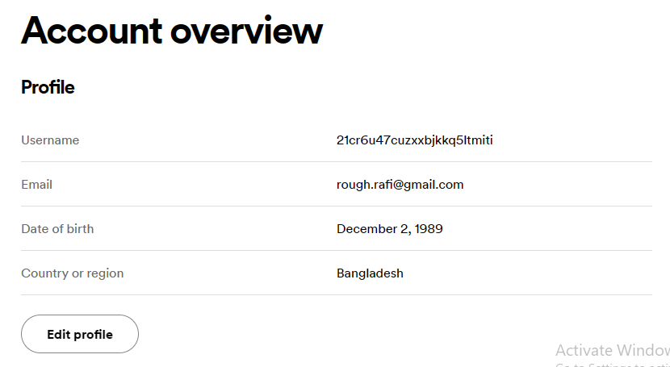

### 403 Day 46 Goals_ what you will make by the end of the day

We are going to be making a playlist of old songs.
 
We will use beautiful soup to scrape the names of the songs.

And use the spotify API to create a new playlist for that list.


### 404 Step 1 - Scraping the Billboard Hot 100

***Step 1 - Scrape the top 100 song titles on that date into a Python List.***

### 405 Step 2 - Authentication with Spotify

In order to create a playlist in Spotify you must have an account with Spotify.
Go to the developer dashboard and create a new Spotify App:
[https://developer.spotify.com/dashboard/](https://developer.spotify.com/dashboard/)

Once you've created a Spotify app, copy the Client ID and Client Secret into your Python project.

Authenticating with Spotify is quite complicated, especially when you want to access a user's account. 
So instead, we're going to use one of the most popular Python Spotify modules - Spotipy to make things easier.

Using the Spotipy documentation, figure out how to authenticate your Python project with Spotify using your unique 
Client ID/ Client Secret.

When creating the app, the redirect uri needs to be provided.

From the spotipy documentation - 
> The redirect_uri argument or SPOTIPY_REDIRECT_URI environment variable must match the redirect URI added to 
> your application in your Dashboard. The redirect URI can be any valid URI (it does not need to be accessible) 
> such as http://example.com, http://localhost or http://127.0.0.1:9090.

```
redirect_uri = http://localhost:3000
```

From github  -

```python
import spotipy
from spotipy.oauth2 import SpotifyOAuth

client_id = '41a2a7c4cbfc40598838afb53126caf5'
client_secret = '16353ab03aba4b28a947536d49e93d83'
redirect_uri = 'http://localhost:3000'

sp = spotipy.Spotify(auth_manager=SpotifyOAuth(client_id=client_id,
                                               client_secret=client_secret,
                                               redirect_uri=redirect_uri,
                                               scope="playlist-modify-private"))
```

Authentication done, hopefully


### 406 Step 3 - Search Spotify for the Songs from Step 1

From the spotify website, find your user id (username)



```python
import pprint
import musical_playlist_creator

track_uri = []
for i in musical_playlist_creator.song_titles:
    track_id = sp.search(q='year:' + str(2020) + ' track:' + i, type='track')
    try:
        uri = track_id['tracks']['items'][0]['id']
    except IndexError:
       pprint.pprint(track_id) 
       continue
    track_uri.append(uri)

print(track_uri)
```

This provides a list of all the song URIs


### 407 Step 4 - Creating and Adding to Spotify Playlist

Using the Spotipy documentation, create a new private playlist with the name "YYYY-MM-DD Billboard 100", 
where the date is the date you inputted in step 1. 

So now you have the song_titles, year and the track_uris
You need to - 
1. Create a playlist
   1. Create a playlist in your account
   2. Name the playlist "YYYY-MM-DD Billboard Top 100"
   3. Get the playlist id
2. For every title in the track_uris, add it to the playlist

```python
my_playlist = sp.user_playlist_create(user=user_id,
                                      name=f'{musical_playlist_creator.year} Billboard Top 100',
                                      public=False,
                                      description=f'What the world loved in {musical_playlist_creator.year}')
my_playlist_id = (my_playlist['id'])

sp.playlist_add_items(playlist_id=my_playlist_id, items=track_uri)
```

> Throwing a TypeError initially, then figured that one of the URIs in the track_uri is None, made required adjustments.

### Done
