### 451 Day 55 Goals_ what you will make by the end of the day

We will parse html using flask.
Also we will dive deeper into decorators, i.e. decorators that take arguments.

Using all of that, we will create a "Guesss The Number" website.

### 452 Working Flask URL Paths and the Flask Debugger

This is a sample webpage created using Flask

```python
from flask import Flask

app = Flask(__name__)

@app.route("/")
def hello_world():
    return "<p>Hello, World!</p>"
```

Here, the .route means routing the website.
So '/' means routing the website to the Homepage.
Anything else means some other page, i.e. -

```python
@app.route('/')
def index():
    return 'Index Page'

@app.route('/hello')
def hello():
    return 'Hello, World'
```

This means the app will look for the url. 
The last part of the url, if different from the homepage, will lead somewhere else.
And all of this behavior is declared using the decorator function.

Now, when you run this app - 


And, when you modify the url and add '/hello' to it - 


Now, what if I wanted to add a variable to the webpage?
Meaning, let's say the webpage asks the user his/her name, and then prints out f"Hello {name}"

Well one way could be  - 

```python
@app.route(f'/{name}')
def hello():
    return f'Hello, {name}'
```
```
NameError: name 'name' is not defined
```

Nope, does not work.

Well, for this purpose, there are variable rules. In the Flask doc - 


Now, based on this, correcting the code above -

```python
@app.route('/name/<name>')
# this means that Flask is going to convert anything that comes between "<" and ">" into a variable for us to tap into 
def hello(name):
    return f'Hello, {name}'
```

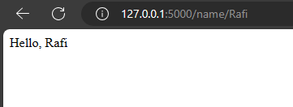

Now suppose your code is already running, meaning the server is live.
And you have made some modifications into your code.
To see the changes reflected, you have to stop the app and rerun it everytime you make changes in your code.

Cumbersome.

A way to make this convenient is to run the app in debug mode.

```python
if __name__ == "__main__":
    app.run(debug=True)
```

So when you run the app in debug mode, you can make the changes in your code real time and can see them rendered right away.

It can also help you identify mistakes.

```python
@app.route("/name/<username>")
def hello(name):
    return f"Hello, {name}"
```

Mistake - Stating the variable to be "username" in the decorator but declaring the variable to be "name"

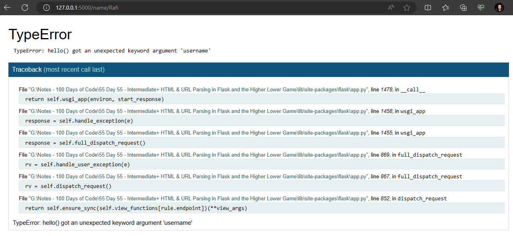

In the last line, you can see that the TypeError has been identified.

You can also access the terminal from this window.

Suppose you made a mistake like this - 

```python
@app.route("/name/<name>")
def hello(name):
    return f"Hello, {name + 12}"
```
When you run it - 

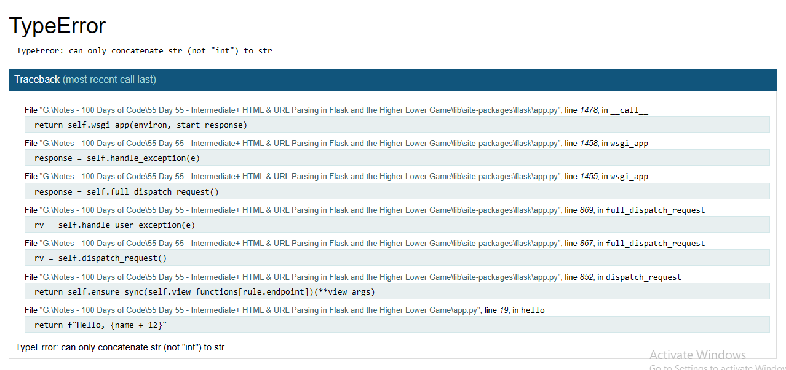

Now when you hover the mouse above the error (last line), you can access the terminal.

But it is locked.

That is where the PIN comes in. You have to enter the PIN provided in the terminal when you run the app.
In the terminal, you can test codes to find out where you made the mistake.

You could also add url parts after the variable - 

```python
@app.route("/name/<name>/1")
def hello(name):
    return f"Hello, {name + 12}"
```

The path has been changed, but only the middle part, the name, remains as the variable.

Variable Converters

You can specify the type of the variable too.

_You can use a converter to specify the type of the argument like <converter:variable_name>._

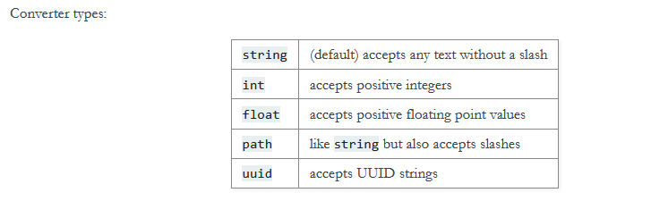

The default, string, takes any string except a slash.

Now let's say I want to declare a string with slash as my variable.

```python
@app.route("/name/<path:name>")
def hello(name):
    return f"Hello, {name}"
```

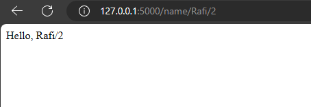

You can also have more than one variable.

```python
@app.route("/name/<name>/<int:number>")
def hello(name, number):
    return f"Hello, {name}. You are {number} years old"
```

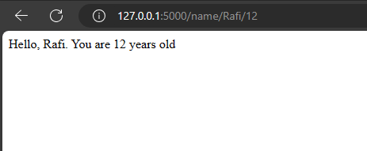


### 453 Rendering HTML Elements with Flask

Now we will see how to render HTML using Flask.

At the moment it is so that the website rendered has a very basic boilerplate structure, where all the text is inside a body tag.

Let's convert the text into a h1 tag.

```python
@app.route("/")
def hello_world():
    return "<h1>Hello, World!</h1>"
```

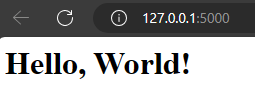

We can also use CSS 

```python
@app.route("/")
def hello_world():
    return "<h1 style='text-align: center'>Hello, World!</h1>"
```


Add another element

```python
@app.route("/")
def hello_world():
    return "<h1 style='text-align: center'>Hello, World!</h1>" \
           "<p>This is a para</p>"
```

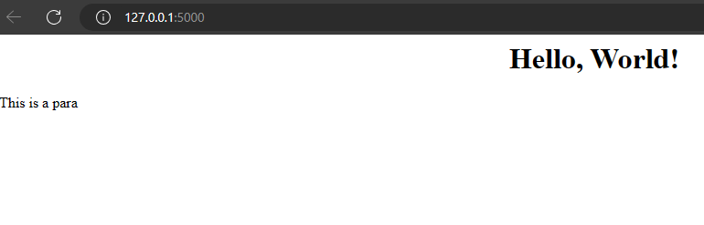

Add an image

```python
@app.route("/")
def hello_world():
    return "<h1 style='text-align: center'>Hello, World!</h1>" \
           "<p>This is a para</p>" \
           ""
```

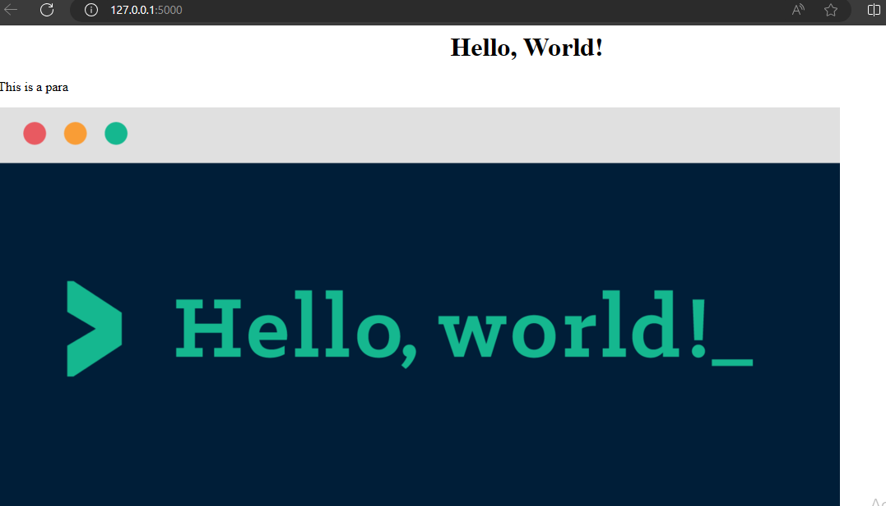


### 454 Challenge_ Use Python Decorators to Style HTML Tags

In the last lesson we added a paragraph like so - 

```python
@app.route("/")
def hello_world():
    return "<h1 style='text-align: center'>Hello, World!</h1>" \
           "<p>This is a para</p>"
```

Now let's say I want to make the paragraph bold, italic and underlined.
I can do this - 

```python
def hello_world():
    return "<h1 style='text-align: center'>Hello, World!</h1>" \
           "<u><em><b><p>This is a para</p></b></em></u>" \
           ""
```

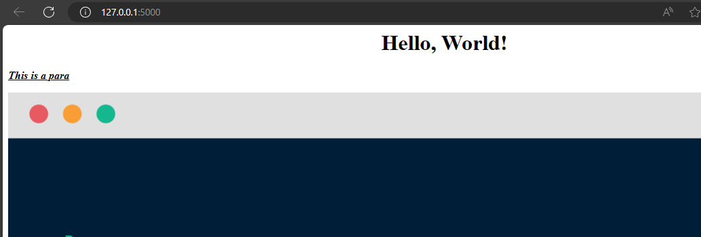

Now I want to do this based on decorators, so that there will be three decorators - 
@make_bold
@make_emphasis
@make_underlined

These decorators will change the font styling and spare me from writing the HTML syntax over and over.

```python
from flask import Flask

app = Flask(__name__)


def make_bold(function):
    def wrapper_function():
        return '<b>'+function()+'</b>'
    return wrapper_function


def make_italic(function):
    def wrapper_function():
        return '<em>'+function()+'</em>'
    return wrapper_function


def make_underlined(function):
    def wrapper_function():
        return '<u>'+function()+'</u>'
    return wrapper_function


@app.route("/")
@make_bold
@make_italic
@make_underlined
def hello_world():
    return "<h1 style='text-align: center'>Hello, World!</h1>" \
           "<p>This is a para</p>" \
           ""
```

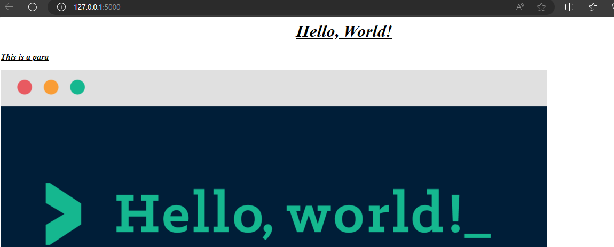

### 455 Advanced Decorators with _args and __kwargs

Up until now, we have only used simple decorator functions.
What if we needed to pass an input through the function, how do we get hold of that?

First, let's demonstrate how we can pass in an object created from a class as an input in a function.

```python
class User:
    def __init__(self, name):
        self.name = name
        self.is_logged_in = False

def create_blog_post(user):
    print(f"This is {user.name}'s new blog post.")
```

Before moving further, let's have a recap of args and kwargs.

```python
def add(n1, n2):
    return n1+n2


print(add(4,5))
# 9

# what if i want the function to be able to take unlimited values, for addition?
def add(*args):
    for n in args:
        # do this

# challenge - write the code such that you can add any number of inputs to the add() and it will return the summationo
def add(*args):
    summation = 0
    for n in args:
        summation += n
    return summation

print(add(1,2,3,4))
# 10
print(add(1,2,3,4,5,6,7,8,9,10))
# 55

# since we can loop through, we can also use indexing?
def add(*args):
    summation = 0
    for n in args[1:3]:
        summation += n
    return summation

print(add(1,2,3,4,5,6,7,8,9))
# it should add 2,3
# 5

# Yes!

# the single asterix operator generates a tuple, and we use indexing or loops to do things with them
def add(*args):
    print(args)
print(add(1,2,3,4,5,6,7,8,9))
# (1, 2, 3, 4, 5, 6, 7, 8, 9)
```

***args** are thus called positional arguments


But waht if i want to refer to my arguments by name, i.e text, size, font, align etc?
How will i incorporate unlimited arguments then?

****kwargs**

The single asterix operator in args generates a tuple, the double asterix operator in kwargs on the other hand generates a dictionary.

```python
def calculate(**kwargs):
    print(kwargs)
print(calculate(add=5, multiply=6))
# {'add': 5, 'multiply': 6}


# we can use this dictionary to do things we want

# example -
def calculate(n, **kwargs):
    # at this point, it creates a blank dict like this -
    # {"": "", "": ""}
    # when we add the keys and the values when calling the function, the dict gets created
    # and then we tell beforehand what to do with the keys and values to be received later
    n += kwargs['add']
    n *= kwargs['multiply']
    return n
print(calculate(10, add=5, multiply=6))
# this should essentially return 10+5*6
# 90
```

Now going back to our example - 

```python
class User:
    def __init__(self, name):
        self.name = name
        self.is_logged_in = False

def create_blog_post(user):
    print(f"This is {user.name}'s new blog post.")
```

We want to create a decorator function such that it will allow the create_blog_post() function to be called only when the user is logged in.

Without using *args, we can do it like this -

```python

class User:
    def __init__(self, name):
        self.name = name
        self.is_logged_in = False


def is_authenticated_decorator(function):
    # wrapper will take the user object
    def wrapper(user):
        # condition to check if the user is logged in
        if user.is_logged_in == True:
            # if true, then function() will be executed
            function(user)
    return wrapper


@is_authenticated_decorator
def create_blog_post(user):
    print(f"This is {user.name}'s new blog post.")


new_user = User("angela")
new_user.is_logged_in = True
create_blog_post(new_user)
```

With args - 

```python
class User:
    def __init__(self, name):
        self.name = name
        self.is_logged_in = False

def is_authenticated_decorator(function):
    # wrapper will take the user object, in this case declaring a tuple
    def wrapper(*args):
        # condition to check if the user(the first item in the tuple) is logged in
        if args[0].is_logged_in == True:
            # if true, then function() will be executed, with the user(the first item in the tuple) as an input
            function(args[0])
    return wrapper


@is_authenticated_decorator
def create_blog_post(user):
    print(f"This is {user.name}'s new blog post.")


new_user = User("angela")
new_user.is_logged_in = False
create_blog_post(new_user)
```

In both the cases - 

```python
new_user.is_logged_in = False
create_blog_post(new_user)
```
```

Process finished with exit code 0
```

```python
new_user.is_logged_in = True
create_blog_post(new_user)
```

```
This is angela's new blog post.

Process finished with exit code 0
```


### 456 [Interactive Coding Exercise] Advanced Decorators

Not Available

### 457 Final Project - Higher or Lower URLs

Steps - 

1. import 
2. generate a random number
3. using the Flask app, ask the user to generate a random number
4. detect the input
5. with the input, create a new route the Flask should redirect to in these cases
   1. The number is higher
   2. The number is lower
   3. The number is correct


1. import
```python
from flask import Flask
import random
```

2. generate a random number
```python
number = random.randint(1, 100)
```

3. using the Flask app, ask the user to generate a random number

```python
@app.route("/")
def enter_number():
    return "<h1>Enter a number between 1 and 100</h1>" \
           ""
```

4. detect the input

According to the directions, this will be done within the url. The user has to type in the url.

5. with the input, create a new route the Flask should redirect to in these cases
   1. The number is higher
   2. The number is lower
   3. The number is correct

```python
def guess_number(guess):
    if guess < number:
        return "<h1>Too Low</h1>" \
                ""
    elif guess > number:
        return "<h1>Too High</h1>" \
               ""
    else:
        return "<h1>Perfect</h1>" \
               ""
```

Putting it all together - 

```python
from flask import Flask
import random

app = Flask(__name__)

number = random.randint(1, 100)
# print(number)

# user_num = input('Enter a number between 1 and 100 - ')


@app.route("/")
def enter_number():
    return "<h1>Enter a number between 1 and 100</h1>" \
           ""


@app.route('/<int:guess>')
def guess_number(guess):
    if guess < number:
        return "<h1>Too Low</h1>" \
                ""
    elif guess > number:
        return "<h1>Too High</h1>" \
               ""
    else:
        return "<h1>Perfect</h1>" \
               ""


if __name__ == "__main__":
    app.run(debug=True)
```

