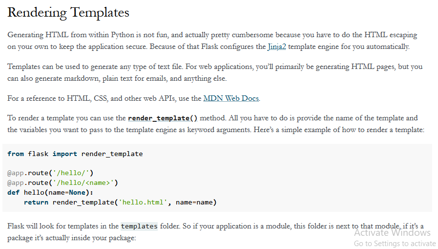
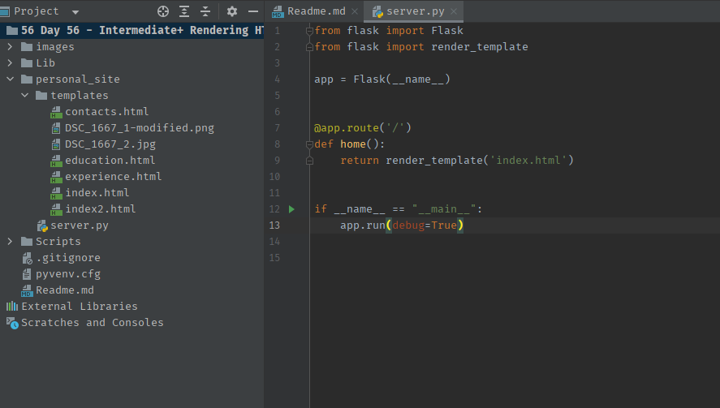
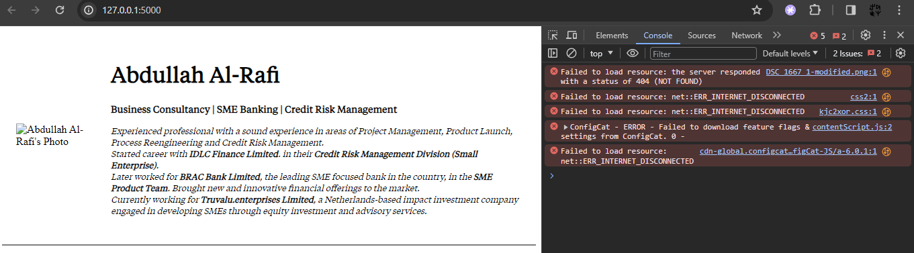
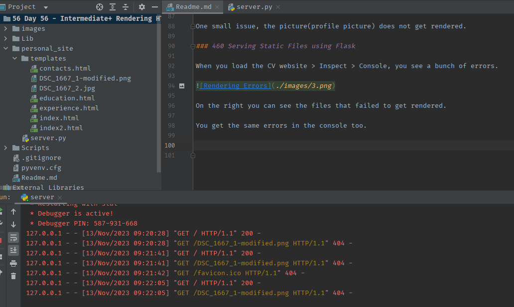
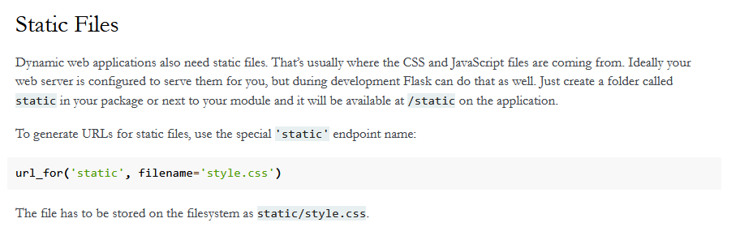
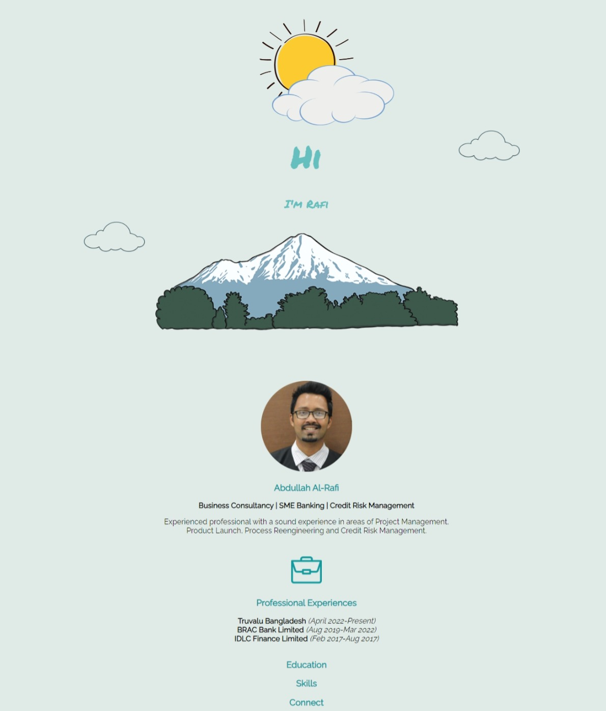
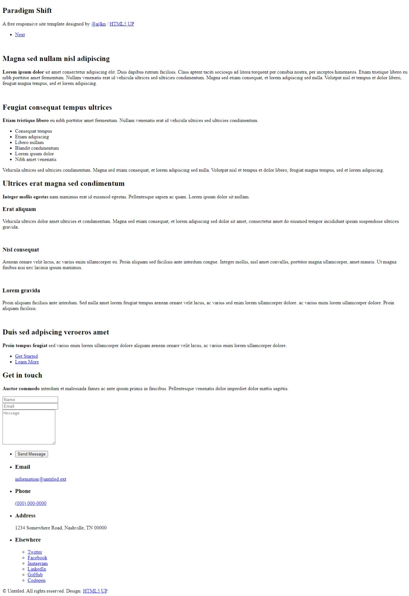
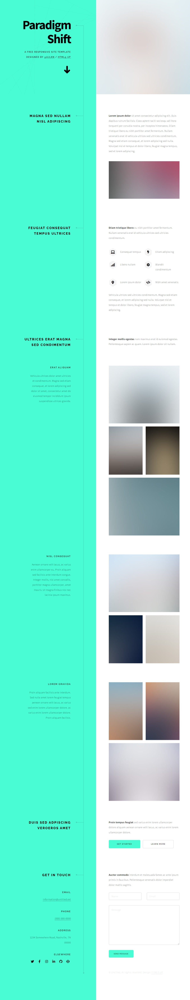
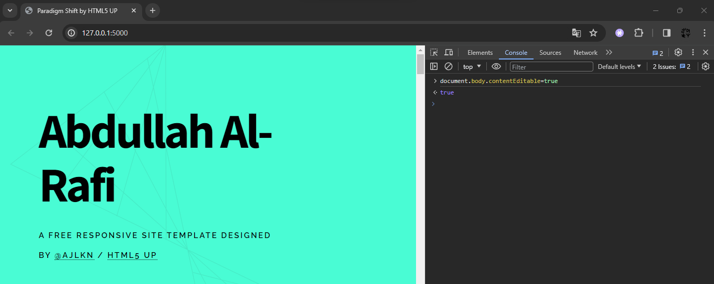
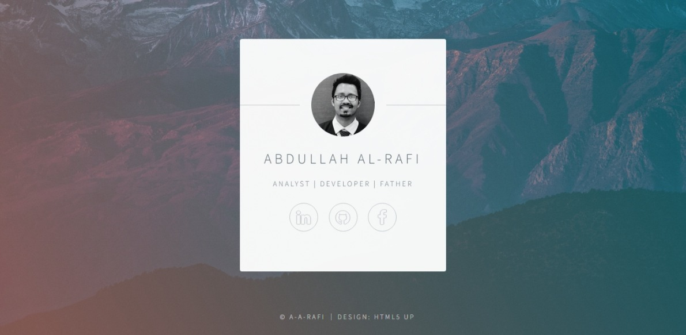

### 458 Day 56 Goals_ what you will make by the end of the day

We will learn how to integrate static files, like local videos and pictures, into your website.
Also how to render HTML and CSS files.

By the end of the day, we will be creating a beautiful name card, with the links to all your socials.

### 459 Rendering HTML Files with Flask

Create a new project.
Inside the project, create a new file named server.py.
Create a boilerplate simple Flask app.

```python
from flask import Flask

app = Flask(__name__)


@app.route('/')
def home():
    return "Hello World"


if __name__ == "__main__":
    app.run()
```

Now we have to figure out how to render HTML files instead of simple returns or simple HTML elements.

Let's create a new HTML file.

_**Go to the project folder > right click > New > html file.**_

This way the boilerplate code will be automatically added.

Add your name as the title of the page and an h1 tag saying "I'm Rafi".

```html
<!DOCTYPE html>
<html lang="en">
<head>
    <meta charset="UTF-8">
    <title>Rafi</title>
</head>
<body>
    <h1>I'm Rafi</h1>

</body>
</html>
```

How do we return this html page in our flask app?

Documentation - 



Now we need to put our html file inside that folder. 
We also need to import another module called render tamplate.
The way we import the index.html is shown below.

```python
from flask import Flask
from flask import render_template

app = Flask(__name__)


@app.route('/')
def home():
    return render_template('index.html')


if __name__ == "__main__":
    app.run(debug=True)
```
Remember, the "templates" folder needs to be inside the folder containing server.py

Challenge - Get the html file for your CV website and put it in the "templates" folder.
Then render it using Flask.

_Copied all the html files from the "Intermediate HTML" folder and and kept it in today's.
Changed the name of the previous index.html to index2.html_



One small issue, the picture(profile picture) does not get rendered.

### 460 Serving Static Files using Flask

When you load the CV website > Inspect > Console, you see a bunch of errors.



On the right you can see the files that failed to get rendered.

You get the same errors in the console too.



Well you'd think that the HTML file has a different file path for the profile image, and if you'd just change that it'll be okay.
Nope.

Well the images and the CSS files, basically the static files, have to be kept inside a folder called static.



So let's move all the image files into a new folder called static, and change the path accordingly in the HTML file.

Now we can see that the image has been rendered.


Now reset everything, so they end up just like before.

```python
from flask import Flask
from flask import render_template

app = Flask(__name__)


@app.route('/')
def home():
    # return render_template('index.html')
    return render_template('index2.html')


if __name__ == "__main__":
    app.run(debug=True)
```

Challenge - We have a boilerplate HTML file. Now create a simple css file that will make the background of this html purple,
and then render it with the Flask app.

1. create a css file
2. keep the css file in the static folder
3. link it with the html
4. in the flask app, modify the file path to render the html


Create a new css file.
```html
body {
    background-color: lightblue;
}
```
Keep the css file in the static folder - Done.

Link the .css file with the html.

```html
<!DOCTYPE html>
<html lang="en">
<head>
    <meta charset="UTF-8">
    <title>a-a-rafi</title>
    <link rel="stylesheet" href="./static/style.css">
</head>
<body>
    <h1>I'm Rafi</h1>

</body>
</html>
```

In the flask app, modify the file path to render the html.

```python
from flask import Flask
from flask import render_template

app = Flask(__name__)


@app.route('/')
def home():
    # return render_template('index.html')
    return render_template('index2.html')


if __name__ == "__main__":
    app.run(debug=True)
```

#### WORKS!

Issue - sometimes, when you update the color or any other style element in the css file, they do not get rendered.
Why?
Because chrome caches these large stylesheets or css files(stores them temporarily) because css files are unlikely to change frequently.
Also since these css files are large in size, it saves user's internet data.

To force chrome to take in the updated css, we need to do a hard reload in chrome (shift+reload button)


### 461 How to Use Website Templates to Speed Up Web Development

We will work with the html and css files created during the day on intermediate CSS.
We will create a separate folder called personal_site_2 and organize that folder according to the requirements of Flask.
We will also have to create a separate server_2.py file.
Basically another project.

Modify the server_2.py file first.

```python
from flask import Flask
from flask import render_template

app = Flask(__name__)


@app.route('/')
def home():
    # return render_template('index.html')
    return render_template('index.html')
    # this index.html refers to the index file at the project folder, in the templates subfolder


if __name__ == "__main__":
    app.run(debug=True)
```

Change the index file.

```html
<!doctype html>
<html lang="en">
<head>
    <meta charset="UTF-8">
    <meta name="viewport"
          content="width=device-width, user-scalable=no, initial-scale=1.0, maximum-scale=1.0, minimum-scale=1.0">
    <meta http-equiv="X-UA-Compatible" content="ie=edge">
    <title>Abdullah Al-Rafi</title>
    <link rel="stylesheet" href="./static/design.css">
    <link rel="icon" href="./static/profession_professions_job_suit_businessman_jobs_icon_255749.ico">
    <link rel="preconnect" href="https://fonts.googleapis.com">
    <link rel="preconnect" href="https://fonts.gstatic.com" crossorigin>
    <link href="https://fonts.googleapis.com/css2?family=Permanent+Marker&family=Raleway&display=swap" rel="stylesheet">
</head>
<body>
    <div id="picture">
        
        
        <h1>
            Hi
        </h1>
        <h2>
            I'm Rafi
        </h2>
        
        
        
    </div>
    <div id="intro">
        
        <h3 id="name">
            Abdullah Al-Rafi
        </h3>
        <b>
            Business Consultancy | SME Banking | Credit Risk Management
        </b>
        <p id="intro-text">
            Experienced professional with a sound experience in areas of Project Management,
            Product Launch, Process Reengineering and Credit Risk Management.
        </p>
    </div>
    <div id="experience">
        
        <h3 id="exp-title">
            Professional Experiences
        </h3>
        <p id="exp-text">
            <strong>Truvalu Bangladesh</strong><em> (April 2022-Present)</em>
            <br>
            <strong>BRAC Bank Limited</strong><em> (Aug 2019-Mar 2022)</em>
            <br>
            <strong>IDLC Finance Limited</strong><em> (Feb 2017-Aug 2017)</em>
        </p>
    </div>
    <div id="education" class="padding">
        <h3>
            Education
        </h3>
    </div>
    <div id="skills" class="padding">
        <h3>
            Skills
        </h3>
    </div>
    <div id="contact" class="padding">
        <h3>
            Connect
        </h3>
    </div>
    <div id="bottom-container">

    </div>

</body>
</html>
```

No change needs to be made to the css file.

The css file does not need to be changed.

Now when you run the server_2 app - 



The static folder may contain subfolders, you just need to incorporate that in the file path in the html file.

#### WORKS !!

Now imagine you have a beautiful website and you can download all the necessary files for it.
You can just do that, change the names and voila, you have your own website.

One source where you can download these beautiful templates from is squarespace.

But it is paid.

html5up.com provides similar service for free (with attribution).

So let's do that.

Download all the assets into another project folder named personal_site_3

Same as before, put the server.py file, the index.html file and the css and js files in their required folders.

The images and assets folders also get moved to the static folder.

Now that we have moved the files into their required folders, let's run this in the server.



We can see that the pictures haven't loaded, probably because the file path in the index is not right.


Do a simple Find and Replace in the index file to change all the images/ to static/images and all the assets/ to static/assets/

Now rerun the server.



Now you just have to change the texts to your preferred texts and you have your refurbished CV website.

One way to do that is to just change the contents in the index file.

Another nifty way requires the chrome developer tools and some basic javascript.

Go the chrome developer tools > console > type = 
document.body.contentEditable=true
Press Enter
Now you can edit all the contents right from the webpage.



What if you want to delete an element? You can do that by - 
1. Opening the chrome developer tools
2. Click on the small button with an arrow, at the corner of the developer tools
3. Now you can select individual elements, and delete them.

But one caveat, when you hit refresh, all of your changes reverts back.
Because the index.html has not been edited.
Solution to this is you can download the edited webpage's html and replace the old heavy html with the new one.


### 462 Final Project - Name Card Website Template

Use the "Identity" template from html5up.net. Using the template, create a personal name card for yourself.

So basically we will use a pre-made template to create a personal name card.
The template materials are provided in the course folder. It is the template "Identity" from HTML5UP.

Steps

1. Create a new folder named - name_card, this is your project folder.
2. Create subfolders named templates and static.
3. Copy the template materials in the project folder, i.e. name_card.
4. Copy the index file into the templates folder and the assets materials into the static folder.
5. Use "Find and Replace" to change the paths of the pictures and icons.
6. Rerun the server_4.py flask app to see if all the assets have loaded.
7. Replace the picture with your own.
8. Replace the links/urls with your own.


**8. Replace the links/urls with your own.**

Initially the index was like this - 
```html
<footer>
    <ul class="icons">
        <li><a href="#" class="fa-linkedin">LinkedIn</a></li>
        <li><a href="#" class="fa-github">GitHub</a></li>
        <li><a href="#" class="fa-facebook">Facebook</a></li>
    </ul>
</footer>
```

Upon clicking each of the icons, it would go to http://127.0.0.1:5000/#

Therefore need a new function to tell what to do when the app goes to this link.

```python
from flask import redirect

@app.route('/#')
def link1():
    # return render_template('index.html')
    return redirect("https://www.linkedin.com/in/a-a-rafi", code=302)
```

This redirects to LinkedIn.

But each of the icons should redirect to different links, not the same http://127.0.0.1:5000/#

Did a few changes - 

```html
<footer>
    <ul class="icons">
        <li><a href="1" class="fa-linkedin">LinkedIn</a></li>
        <li><a href="2" class="fa-github">GitHub</a></li>
        <li><a href="3" class="fa-facebook">Facebook</a></li>
    </ul>
</footer>
```

```python
from flask import redirect

@app.route('/1')
def link1():
    # return render_template('index.html')
    return redirect("https://www.linkedin.com/in/a-a-rafi", code=302)


@app.route('/2')
def link2():
    # return render_template('index.html')
    return redirect("https://github.com/a-a-rafi", code=302)


@app.route('/3')
def link3():
    # return render_template('index.html')
    return redirect("https://www.facebook.com/rough.rafi/", code=302)
```

**Changing the background image**

The css related to body is currently like this - 
```html
body {
    height: 100%;
    background-color: #ffffff;
    background-image: url("images/overlay.png"), -moz-linear-gradient(60deg, rgba(255, 165, 150, 0.5) 5%, rgba(0, 228, 255, 0.35)), url("../../images/bg.jpg");
    background-image: url("images/overlay.png"), -webkit-linear-gradient(60deg, rgba(255, 165, 150, 0.5) 5%, rgba(0, 228, 255, 0.35)), url("../../images/bg.jpg");
    background-image: url("images/overlay.png"), -ms-linear-gradient(60deg, rgba(255, 165, 150, 0.5) 5%, rgba(0, 228, 255, 0.35)), url("../../images/bg.jpg");
    background-image: url("images/overlay.png"), linear-gradient(60deg, rgba(255, 165, 150, 0.5) 5%, rgba(0, 228, 255, 0.35)), url("../../images/bg.jpg");
    background-repeat: repeat,			no-repeat,			no-repeat;
    background-size: 100px 100px, cover,				cover;
    background-position: top left,		center center,		bottom center;
    background-attachment: fixed,			fixed,				fixed;
}
```

We can see that there is a gradient being implemented. At the end of each line we can see that the gradient is being
implemented on a background image named bg.png.

So we can add a background image from unsplash and rename it to bg.png to render it in the website.
The previous bg.png we can rename to something else so that it no longer gets rendered.

So the new site will have the image collected from unsplash and the gradient on top.



done.
