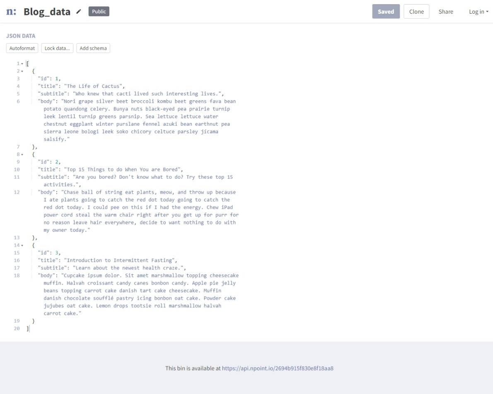
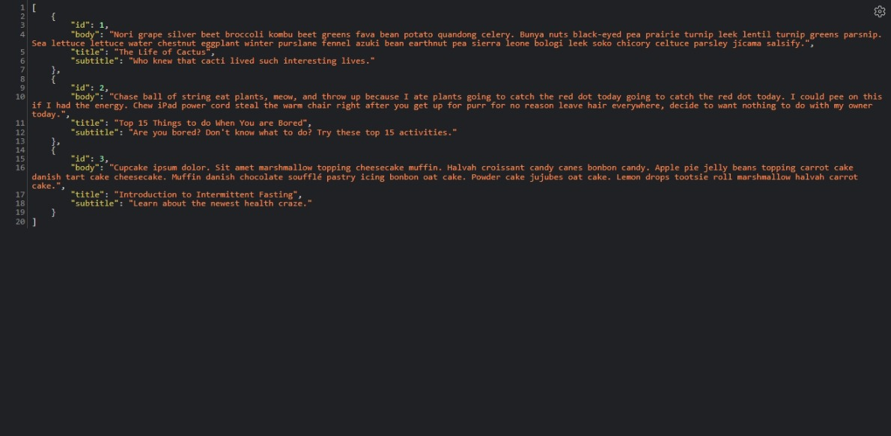
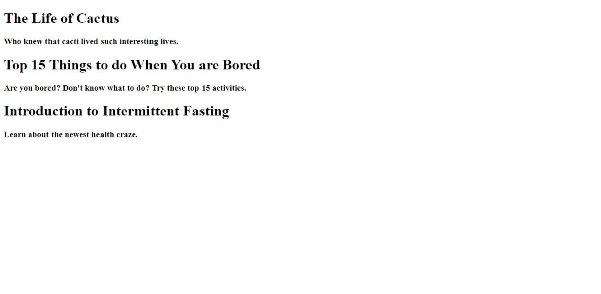
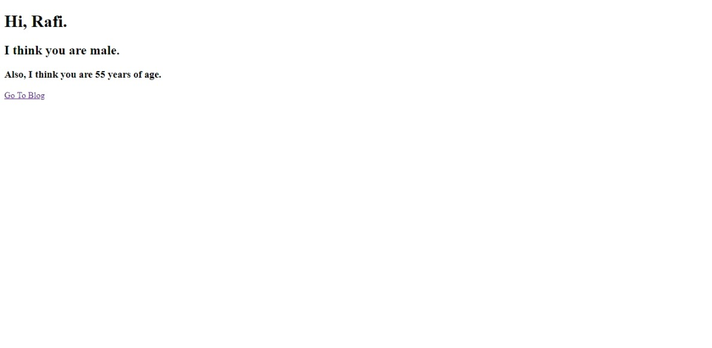
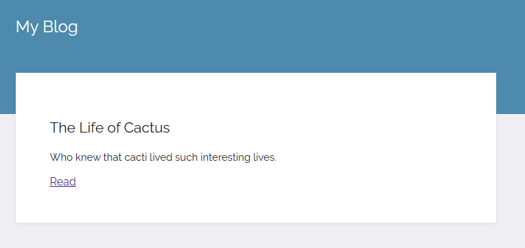
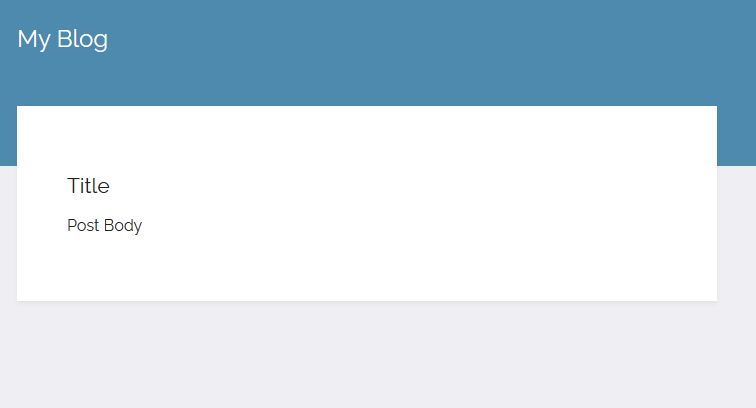

### 464 Day 57 Goals_ what you will make by the end of the day

Sometimes when you are creating a website, you do not want to create the entire website from scratch.

For example, let's say you have a blog, and you want to create several different posts for the blog.

You do not want to create a separate HTML for each blog post.

That is where Jinja comes in, it is templating language built for Python.
It allows us to create a general layout of the website, for example the styling and the structure,
and then to replace the content with dynamic content.

By the end of the day, we will have created a blog that will have separate blog posts.
And for each blog post, we will not create separate HTML sections, 
upon clicking the blog heading the page will redirect to the entire blog post dynamically.


### 465 Using Jinja to Produce Dynamic HTML Pages

First and foremost, we need a simple Flask application.

```python
from flask import Flask

app = Flask(__name__)


@app.route("/")
def hello_world():
    return "<p>Hello, World!</p>"


if __name__ == '__main__':
    app.run(debug=True)
```

Now we need a simple website HTML template.

```html
<!DOCTYPE html>
<html lang="en">
<head>
    <meta charset="UTF-8">
    <title>My Website</title>
</head>
<body>
    <h1>Hello World</h1>
</body>
</html>
```

Now render this using the Flask app.

First we need to move the index.html file into the folder "templates".

```python
from flask import Flask, render_template

app = Flask(__name__)


@app.route("/")
def hello_world():
    return render_template('index.html')


if __name__ == '__main__':
    app.run(debug=True)
```

In the code above the index.html file is being treated as a template by the Flask app.
The templating language being used here in called Jinja.

Jinja comes preinstalled with Flask, no need to download it separately.

With Jinja, we can use some specific syntax, e.g. curly braces to specify what parts inside the html 
are actually python codes and should be interpreted as such.

For example, when I change my html to this - 

```html
<body>
    <h1>5 * 6</h1>
</body>
```

It just shows me 5 * 6 when I run this html in the Flask app.

However, when I put it inside the curly braces - 

```html
<body>
    <h1>{{5 * 6}}</h1>
</body>
```

It now renders 30 as h1 when run in Flask.

Now let's say I want to generate a random number instead of 30 everytime the website loads.

So there needs to be some python coding.
Understandably, this python code will not go in the html file with html codes right?
So we will have to add the code in the server.py file.

```python
import random

random_number = random.randint(1, 10)
```

```python
from flask import Flask, render_template
import random

app = Flask(__name__)


@app.route("/")
def hello_world():
    random_number = random.randint(1, 10)
    return render_template('index.html', num=random_number)


if __name__ == '__main__':
    app.run(debug=True)
```

and we tell the index.html file to generate this "num" everytime by - 

```html
<!DOCTYPE html>
<html lang="en">
<head>
    <meta charset="UTF-8">
    <title>My Website</title>
</head>
<body>
    <h1>{{num}}</h1>
</body>
</html>
```

Now everytime you hit refresh, the number changes.

Challenge, add a footer in the html, the footer can contain any random text followed by the current year.

Let's change the html first - 
```html
<!DOCTYPE html>
<html lang="en">
<head>
    <meta charset="UTF-8">
    <title>My Website</title>
</head>
<body>
    <h1>{{num}}</h1>
</body>
<footer>
    <p>The footer containing the current year {{yyyy}}</p>
</footer>
</html>
```

Now let's create this yyyy variable inside server.py - 
```python
from flask import Flask, render_template
import random
from datetime import datetime


app = Flask(__name__)


@app.route("/")
def hello_world():
    random_number = random.randint(1, 10)
    today = datetime.now()
    return render_template('index.html', num=random_number, yyyy=today.year)


if __name__ == '__main__':
    app.run(debug=True)
```

### 466 Challenge_ Combining Jinja Templating with APIs

Your task is to pull the gender of name using the API genderize and the age of the name from the API agify.
Then use those gender and age to show in the website rendered by your Flask app.

1. Get the gender of a name from the API genderize
2. Get the age of a name from the API agify
3. Change them into classes
4. Import the two modules in your Flask app
5. Make changes to the Flask app code so that it takes the url suffix as a variable
6. Import the gender from genderize and the age from agify into the Flask app
7. Make the relevant changes in the HTML so that the gender and the age gets printed in the website generated

#### 1. Get the gender of a name from the API genderize

```python
import requests

name = 'Rafi'

response = requests.get(f'https://api.genderize.io?name={name}')
data = response.json()
print(data)
print(data['gender'])
```

#### 2. Get the age of a name from the API agify

```python
import requests

name = 'Teetly'

response = requests.get(f'https://api.agify.io?name={name}')
data = response.json()
print(data)
print(data['age'])
```

#### 3. Change them into classes

```python
import requests

# name = 'Rafi'


class gender:
    def __init__(self, name):
        self.response = requests.get(f'https://api.genderize.io?name={name}')

    def get_gender(self):
        data = self.response.json()
        return data['gender']
```

```python
import requests

# name = 'Teetly'


class age:
    def __init__(self, name):
        self.response = requests.get(f'https://api.agify.io?name={name}')

    def get_age(self):
        data = self.response.json()
        return data['age']
```

#### 4. Import the two modules in your Flask app

```python
import genderize
import agify
```

#### 5. Make changes to the Flask app code so that it takes the url suffix as a variable
#### 6. Import the gender from genderize and the age from agify into the Flask app

```python
@app.route("/<string:name>")
def gender_age(name):
    sex = genderize.gender(name)
    old = agify.age(name)
    return render_template('index.html', person_name=name, gender=sex.get_gender(), how_old = old.get_age())
```
#### 7. Make the relevant changes in the HTML so that the gender and the age gets printed in the website generated

```html
<body>
    <h1>Hi, {{person_name}}.</h1>
    <h2>I think you are {{gender}}.</h2>
    <h3>Also, I think you are {{how_old}} years of age.</h3>
</body>
```

#### Final Code - 

```python
from flask import Flask, render_template
import genderize
import agify

app = Flask(__name__)


@app.route("/")
def welcome():
    return '<h1>Welcome to the gender and age identifier.</h1>'


@app.route("/<string:name>")
def gender_age(name):
    sex = genderize.gender(name)
    old = agify.age(name)
    return render_template('index.html', person_name=name, gender=sex.get_gender(), how_old = old.get_age())


if __name__ == '__main__':
    app.run(debug=True)
```

### 467 Multiline Statements with Jinja

So far we have only written single line python codes in Jinja.
What if we need to write multi line codes - 

```python
for i in range(1, 6):
    print(i)
```

How to write it then?

The syntax is like this - 

```html
    
        <li><a href="{{ item.href }}">{{ item.caption }}</a></li>
    
```
```html
<div>
    
        yay
    
</div>
```

Challenge - 

Now in the same gender_age_identifier, create another route '/blog' so that blog posts get shown in that page.

Tasks - 

1. Get the blog posts from the course resources.
2. Using the npoint.io service, create your own simple API.
3. Create the route '/blog' with the function to pull the API data
4. The server can take multiple separate HTMLs for separate routes, create an HTML to render the blog posts.

#### 4. The server can take multiple separate HTMLs for separate routes, create an HTML to render the blog posts.

```html
<!DOCTYPE html>
<html lang="en">
<head>
    <meta charset="UTF-8">
    <title>Blog</title>
</head>
<body>
    
        <h1>{{ i["title"] }}</h1>
        <h3>{{ i["subtitle"] }}</h3>
    
</body>
</html>
```

#### 1. Get the blog posts from the course resources.

Done.

#### 2. Using the npoint.io service, create your own simple API.






#### 3. Create the route '/blog' with the function to pull the API data

```python
import requests

@app.route("/blog")
def get_blog():
    url = 'https://api.npoint.io/2694b915f830e8f18aa8'
    response = requests.get(url)
    data = response.json()
    return render_template('blog.html', blog_data=data)
```

Done.



Now let's modify the html so that only the blog post with id = 2 gets displayed.

```html
<!DOCTYPE html>
<html lang="en">
<head>
    <meta charset="UTF-8">
    <title>Blog</title>
</head>
<body>
    
        
            <h1>{{ i["title"] }}</h1>
            <h3>{{ i["subtitle"] }}</h3>
        
    
</body>
</html>
```

### 468 URL Building with Flask

This is a way to sort of redirect the user to another webpage.
So previously, we have learned that we can do this by creating an anchor tag in the mother html with the href to the child html.
How do we do this using Jinja?

Currently, we do not have index file for the homepage with route "/".
We have index files for the pages with routes "/<string:name>" and "/blog".
We will use the first one as the mother html and the second one as the child, for this demonstration.

So first, we create a link to the page in the mother html ("/<string:name>"). This is where the link will be shown.

```html
<body>
    <h1>Hi, {{person_name}}.</h1>
    <h2>I think you are {{gender}}.</h2>
    <h3>Also, I think you are {{how_old}} years of age.</h3>
    <a href="">Go To Blog</a>
</body>
```

In href, we use the Jinja template, to connect with the Flask app.
We use the method "url_for" that takes the decorator function name as a parameter.
This decorator function renders a different html(blog.html) that displays the blog posts, not index.html.

```html
<body>
    <h1>Hi, {{person_name}}.</h1>
    <h2>I think you are {{gender}}.</h2>
    <h3>Also, I think you are {{how_old}} years of age.</h3>
    <a href="{{ url_for('get_blog') }}">Go To Blog</a>
</body>
```
```python
@app.route("/blog")
def get_blog(num):
    url = 'https://api.npoint.io/2694b915f830e8f18aa8'
    response = requests.get(url)
    data = response.json()
    return render_template('blog.html', blog_data=data)
```
This creates the link in the html ("/<string:name>") - 



Upon clicking, it takes the user to the blog page.

We can also add parameters with these url_for methods.

Let's add one parameter - 

```html
<body>
    <h1>Hi, {{person_name}}.</h1>
    <h2>I think you are {{gender}}.</h2>
    <h3>Also, I think you are {{how_old}} years of age.</h3>
    <a href="{{ url_for('get_blog', num=3) }}">Go To Blog</a>
</body>
```

Now this href is connected with the Flask app, so that needs to be changed too, so the get_blog() can detect num.

```python
@app.route("/blog/<num>")
def get_blog(num):
    url = 'https://api.npoint.io/2694b915f830e8f18aa8'
    response = requests.get(url)
    data = response.json()
    return render_template('blog.html', blog_data=data)
```

Now when I run the app again.
The link gets shown in the gender_age_identifier page.
Upon clicking that link, it takes the user to the blog page, with the parameter added in the url.


Now imagine this situation - 

We have a list of html file names.
We have a home page index.
We have a flask app.

We could, in the home page index, create a link that connects to the flask app method.
The flask app method could take the parameter provided in the url_for method.
The flask app method could use that parameter to render different pages based on the parameter, which it will consider as the index number.


### 469 Blog Capstone Project Part 1 - Templating

Steps

1. Create a new folder for this project
2. Download the starting html and css
3. Create a new server file, main.py
4. Render the index file in the templates folder
5. Render the blog posts created on npoint on the website 
6. Each blog post should have a button called read, clicking which it should redirect to the blog post.

#### 1. Create a new folder for this project
#### 2. Download the starting html and css
#### 3. Create a new server file, main.py
#### 4. Render the index file in the templates folder

Done.

#### 5. Render the blog posts created on npoint on the website 

##### First, get the blog posts from the API

```python
import requests


class Post:
    def __init__(self):
        self.response = requests.get('https://api.npoint.io/c790b4d5cab58020d391')

    def get_posts(self):
        data = self.response.json()
        return data
```

##### Second, plug in the API data into the Flask app

```python
from flask import Flask, render_template
import post

app = Flask(__name__)


@app.route('/')
def home():
    blog = post.Post()
    # using the variable blog_data to store the blog_posts
    return render_template("index.html", blog_data=blog.get_posts())


if __name__ == "__main__":
    app.run(debug=True)
```

##### Third, change the html so that it captures the variable blog_data

```html
<!DOCTYPE html>
<html lang="en">
<head>
    <meta charset="UTF-8">
    <title>Title</title>
    <link href="https://fonts.googleapis.com/css2?family=Raleway" rel="stylesheet">
    <link rel="stylesheet" href="../static/css/styles.css">
</head>
<body>
<div class="wrapper">
    <div class="top">
        <div class="title"><h1>My Blog</h1></div>
    </div>
    
    <div class="content">
        <div class="card">
            <h2>{{ i["title"] }}</h2>
            <p class="text">{{ i["subtitle"] }}</p>
            <a href="#">Read</a>
        </div>
    </div>
    
</div>
</body>
<footer>
    <p>Made with ♥️ in Bangladesh.</p>
</footer>
</html>
```

#### 6. Each blog post should have a button called read, clicking which it should redirect to the blog post.

##### First create the hyperlink in the home page.

```html
<a href="{{ url_for('read_post', num=i['id']) }}">Read</a>
```
This refers to the "read_post" function in Flask and the "num=i['id']" from the data generated by "blog_data", 

##### Second, create a function named "read_post" that renders the detailed post page. 
The individual blog posts should live at the path: URL/post/blog_id.

```python
@app.route('/post/blog_id')
def read_post():
    return render_template("post.html")
```

Now, when we run this file, this should just simply redirect to the pre-made boilerplate post.html.





##### Third, change the post.html so it contains the detailed blog posts.

```html
<!DOCTYPE html>
<html lang="en">
<head>
    <meta charset="UTF-8">
    <title>Title</title>
    <link href="https://fonts.googleapis.com/css2?family=Raleway" rel="stylesheet">
    <link rel="stylesheet" href="../static/css/styles.css">
</head>
<body>
<div class="wrapper">
    <div class="top">
        
            
        <div class="title">
            <h1>{{ i["title"] }}</h1>
        </div>

   </div>
    <div class="content">
        <div class="card">
            <h2>{{ i["subtitle"] }}</h2>
            <p>{{ i["body"] }}</p>
        </div>
    </div>
    
    

</div>
</body>
<footer>
    <p>Made with ♥️ in London.</p>
</footer>
</html>
```
This html has two variables/parameters it works with, "blog_id" and "number".

##### Change the Flask app function so it redirects to the actual blog id instead of '/post/blog_id'.
##### Also the "blog_id" and "number" variables need to be provided as a parameter

```python
@app.route('/post/<int:num>')
def read_post(num):
    # this num it takes from the index.html
    blog = post.Post()
    return render_template("post.html", blog_data=blog.get_posts(), number=num)
```

So now when you run it - 

The index.html file first gets displayed.

Upon clicking the href, the index file redirects to the "read_post" function in Flask, with the parameter "num".

Flask takes the "num" and displays the post.html file, giving it two parameters to work with, "blog_data" and "number".

The post.html file takes the "blog_data" and "number" and displays blog posts according to their id, as specified.

For example, when you click the second article, the id is 2. So the index file generates 2 as num and sends it to Flask.
Flask takes the 2 and sends the post.html the blog_data and 2.
The file post.html takes the blog_data and 2 and displays the details of the 2nd article.


##### fin

