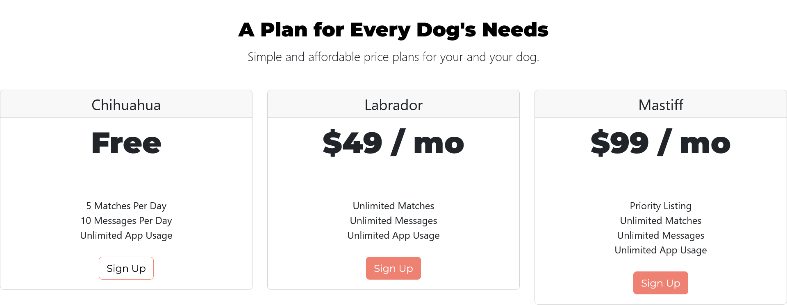
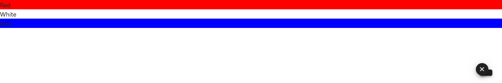

### 470 Day 58 Goals_ What You'll Learn By the End of Today

Bootstrap is a frontend toolkit.

It'll allow us to layout and format our websites with ease and cut down on the amount of CSS code we have to write.

Although not strictly Python programming, it's essential knowledge for any budding web developer.


### 471 What is Bootstrap_

Bootstrap is a frontend library.

Frontend is what the users see, the beautiful interface.
Backend is the code that works in the background. It usually resides on the server.

The frontend uses languages like HTML, CSS and Javascript.
The backend uses .NET, Ruby, PHP, NodeJS, Java, SQL. 
These give your website/app things like functionality, business logic and data storage.

Bootstrap, is very strictly frontend.
It is a bunch of code that is written to be reusable that you can drop into your site.
It makes designing the website much easier for you.

Bootstrap was originally developed by Twitter, to ensure consistency across websites that they design.
Since then they have made it free and open source.
The full source code is on GitHub.

Bootstrap is the most popular front end library as of now.

Nowadays as apps are getting more popular, every website needs to be supar responsive.
This means that depending on where it is being displayed, e.g. mobile, pad, computer, 
it should be able to utilize the screen real estate efficiently and change the layout accordingly.
Another term used to explain this is called adaptability to the viewport.

Bootstrap makes doing this super easy.

Bootstrap also comes with a bunch of pre styled elements that you can drop into your website with minimal effort.

Remember the website css button generator, where we could style our buttons however we liked?


In this website we could style the button however we want and then just drop the code generated in our CSS.

In bootstrap we do not have to write our own CSS code, or generate it with websites like cssbuttongenerator.com.

Let's see how bootstrap works.

For this demonstration we will use codeply.com.
It lets you play with various frameworks.

First, we will turn off the bootstrap in codeply, and use the css generated using cssbuttongenerator.


After turning on the framework bootstrap 4, we can use simple code to generate beautifully styled buttons.


How does it work?

First, go ahead and download Bootstrap 4.
Once downloaded, open dist > css > bootstrap.css

You will find a plethora of pre-made css codes, classes and ids, you can use to style your website.

Now using the premade class css in the bootstrap, I can decorate my website.


### 472 Installing Bootstrap

In your project, open a new folder titled Bootstrap-installation.

Create a new file in there, called index.html

After the tile, we can refer to the bootstrap stylesheet, like so - 

```html
<!DOCTYPE html>
<html lang="en">
<head>
    <meta charset="UTF-8">
    <title>Bootstrap Installation</title>
    <link href="https://cdn.jsdelivr.net/npm/bootstrap@5.3.2/dist/css/bootstrap.min.css" rel="stylesheet" integrity="sha384-T3c6CoIi6uLrA9TneNEoa7RxnatzjcDSCmG1MXxSR1GAsXEV/Dwwykc2MPK8M2HN" crossorigin="anonymous">
</head>
<body>
    <h1>Hello World</h1>
</body>
</html>
```

Another way is to just copy the starter template from the bootstrap website.

A third way is to just download the css and js files, store them in the project folder and link them in the html.


### 473 Web Design 101 - Wireframing

We need to understand how a professional web developer's work process looks like.

This is what the activities look like - 

1. Look at other popular website designs
2. Create a wireframe, basically a sketch of how the website will look
3. Create a mockup
4. (Optional) Create a design using Photoshop or Illustrator
5. (Optional) Create a prototype

For wire-framing the basic way to do it is to just use a simple pencil and paper.

There are also templates you can find on sneakpeekit.com.
But the tried and tested method of wire-framing is to use a website called Balsamiq.

For design inspirations, go to [Design Patterns](https://ui-patterns.com/patterns)

Let's design a website using Balsemiq.


### 474 The Bootstrap Navigation Bar

Now that we have created a wireframe, Let's design the real website.

We will be able to create a lot of the components in our wireframe using bootstrap templates.

Go to bootstrap docs > Components > navbar

In that page, we get the code we can use to get a navigation bar similar to the example given.

First off, we gotta test it using codeply.


This is the dashboard in codeply, create a new ply.

In the new ply, create a html element. Like div, it will not have any dimension unless you put something inside.
Put an unordered list, with the list item "Contacts" in there.

```html
<nav>
    <ul>
        <li>
            Contact
        </li>
    </ul>
</nav>
```

How to absorb the styling and the structure of the bootstrap? Just use the class(es) as the bootstrap.

Note - You need to apply bootstrap classes to all the elements/tags in your code, so the bootstrap design gets gully replicated.
For example, do not just apply the class to the nav element, apply relevant classes to the child elements too.
You can get them from the documentation.


```html
<nav class= "navbar">
    <ul class= "navbar-nav">
        <li class="nav-item">
            <a class="nav-link" href="#">
                Contact
            </a>
        </li>
    </ul>
</nav>
```


Let's add more list items.

```html
<nav class= "navbar">
    <ul class= "navbar-nav">
        <li class="nav-item">
            <a class="nav-link" href="#">
                Contact
            </a>
        </li>
        <li class="nav-item">
            <a class="nav-link" href="#">
                Pricing
            </a>
        </li>
                <li class="nav-item">
            <a class="nav-link" href="#">
                Download
            </a>
        </li>
    </ul>
</nav>
```


From the documentation -

```
 How it works
 
 Here’s what you need to know before getting started with the navbar:

    1. Navbars require a wrapping .navbar with .navbar-expand{-sm|-md|-lg|-xl|-xxl} for responsive collapsing and color scheme classes.
    2. Navbars and their contents are fluid by default. Change the container to limit their horizontal width in different ways.
    3. Use our spacing and flex utility classes for controlling spacing and alignment within navbars.
    4. Navbars are responsive by default, but you can easily modify them to change that. Responsive behavior depends on our Collapse JavaScript plugin.
    5. Ensure accessibility by using a <nav> element or, if using a more generic element such as a <div>, add a role="navigation" to every navbar to explicitly identify it as a landmark region for users of assistive technologies.
    6. Indicate the current item by using aria-current="page" for the current page or aria-current="true" for the current item in a set.
    7. New in v5.2.0: Navbars can be themed with CSS variables that are scoped to the .navbar base class. .navbar-light has been deprecated and .navbar-dark has been rewritten to override CSS variables instead of adding additional styles.

```

For the items to get horizontally positioned, just use the class .navbar-expand

```html
<nav class= "navbar navbar-expand-sm">
</nav>
```

This arranges the items horizontally on larger screens and vertically on smaller screens.

Similarly, we can add a background using the bg-class. 
All possible classes related to navbar are given in the docs.

```html
<nav class= "navbar navbar-expand-lg bg-body-tertiary">
    
</nav>
```

When you also consult the main css file, i.e. bootstrap.css and search the classes in the docs, you get other choices too.
Based on those you can adjust the look further.

```html
<nav class= "navbar navbar-expand-sm bg-primary-subtle">
    <ul class= "navbar-nav">
        <li class="nav-item">
            <a class="nav-link" href="#">
                Contact
            </a>
        </li>
        <li class="nav-item">
            <a class="nav-link" href="#">
                Pricing
            </a>
        </li>
                <li class="nav-item">
            <a class="nav-link" href="#">
                Download
            </a>
        </li>
    </ul>
</nav>
```


You can also add the brand in the navbar.

In the documentation - 

```
Brand - 

The .navbar-brand can be applied to most elements, but an anchor works best, as some elements might require utility classes or custom styles.
```

Let's implement that - 

```html
<nav class= "navbar navbar-expand-sm navbar-dark bg-dark bg-gradient">
    <a class="navbar-brand" href="#">
        tindog
    </a>
    <ul class= "navbar-nav">
        <li class="nav-item">
            <a class="nav-link" href="#">
                Contact
            </a>
        </li>
        <li class="nav-item">
            <a class="nav-link" href="#">
                Pricing
            </a>
        </li>
                <li class="nav-item">
            <a class="nav-link" href="#">
                Download
            </a>
        </li>
    </ul>
</nav>
```


But the word tindog is at the edge of the screen.

From Google - 

```
To insert blank spaces in text in HTML, type either &nbsp; or &#160; for each space to add.
```

So adding "tindog" like "&nbsp;tindog" gives a little bit space before the word.

**So just by adding the classes in the bootstrap you get all the styling of the bootstrap**

Challenge, now move all the navbar links to the right, so only the brand name is on the left.

So basically I just want a margin on the left of the "<ul class="navbar-nav>"

Searched the bootstrap.css file with the keyword "margin-left"

Came up with "offset-{1-12}" depending on what percentage of spacing you want. "offset-9" looks right.

```html
<nav class="navbar navbar-expand-sm navbar-dark bg-dark bg-gradient">
    <a class="navbar-brand" href="#"> &nbsp;tindog </a>
    <ul class="navbar-nav offset-9">
        <li class="nav-item">
            <a class="nav-link" href="#"> Contact </a>
        </li>
        <li class="nav-item">
            <a class="nav-link" href="#"> Pricing </a>
        </li>
        <li class="nav-item">
            <a class="nav-link" href="#"> Download </a>
        </li>
    </ul>
</nav>
```


There is one problem though.
These navbar links converts to a vertical list, when viewed on a smaller screen.

Challenge, convert these links into a dropdown when viewed on a smaller screen.

We can do this with the use of togglers.


In the code, you can see that there is a button, for when the screen gets small.
Then there is a div, to enclose all the desired collapsible elements inside.

Let's replicate this in my code - 

```html
<nav class="navbar navbar-expand-sm navbar-dark bg-dark bg-gradient">
    <button class="navbar-toggler" type="button" data-bs-toggle="collapse" data-bs-target="#navbarTogglerDemo01" aria-controls="navbarTogglerDemo01" aria-expanded="false" aria-label="Toggle navigation">
        <span class="navbar-toggler-icon"></span>
    </button>
    <a class="navbar-brand" href="#"> &nbsp;tindog </a>
    <div class="collapse navbar-collapse" id="navbarTogglerDemo01">
        <ul class="navbar-nav ml-auto">
            <li class="nav-item">
                <a class="nav-link" href="#"> Contact </a>
            </li>
            <li class="nav-item">
                <a class="nav-link" href="#"> Pricing </a>
            </li>
            <li class="nav-item">
                <a class="nav-link" href="#"> Download </a>
            </li>
        </ul>
    </div>
</nav>
```


Positioning matters here, like in here the nutton is placed before the brand name.
So when the window gets smaller, the button shows up on the left and then the brand name.
You want to put the button after the brand name.

```html
<nav class="navbar navbar-expand-sm navbar-dark bg-dark bg-gradient">
     <a class="navbar-brand" href="#"> &nbsp;tindog </a>
    <button class="navbar-toggler" type="button" data-bs-toggle="collapse" data-bs-target="#navbarTogglerDemo01" aria-controls="navbarTogglerDemo01" aria-expanded="false" aria-label="Toggle navigation">
        <span class="navbar-toggler-icon"></span>
    </button>
    <div class="collapse navbar-collapse" id="navbarTogglerDemo01">
        <ul class="navbar-nav ms-xl-auto">
            <li class="nav-item">
                <a class="nav-link" href="#"> Contact </a>
            </li>
            <li class="nav-item">
                <a class="nav-link" href="#"> Pricing </a>
            </li>
            <li class="nav-item">
                <a class="nav-link" href="#"> Download </a>
            </li>
        </ul>
    </div>
</nav>
```


Note - ms-xl-auto works best to align the links on the right edge of the screen.


### 475 What We'll Make - Tindog

By the end of the day, we will have made a tinder like website for dogs, called tindog.

### 476 Download the Starting Files

Downloaded

### 477 Setting Up Our New Project

We have the starting index file where we have the html boilerplate for the entire tindog website premade.
We will just use that.

Also in that index file, we have sections where we will work. 
For example, there is a section called navbar, let's paste our navbar code there.

__Challenge - Add Bootstrap to your project.__

```html
<!DOCTYPE html>
<html>

<head>
  <meta charset="utf-8">
  <title>TinDog</title>
  <link href="https://cdn.jsdelivr.net/npm/bootstrap@5.3.2/dist/css/bootstrap.min.css" rel="stylesheet" integrity="sha384-T3c6CoIi6uLrA9TneNEoa7RxnatzjcDSCmG1MXxSR1GAsXEV/Dwwykc2MPK8M2HN" crossorigin="anonymous">
</head>

<body>
```

But in this window, once shrunk to a mobile size, the navbar link button do not show anything upon clicking.
This is because Codeply, where we did the navbar, also had some starting javascript.
We can get this starting javascript in the bootstrap website.


It seems that even the installation now is provided remotely via jsdelivr.
So adding these lines of code into our index file instead - 

```html
<!DOCTYPE html>
<html>

<head>
  <meta charset="utf-8">
  <title>TinDog</title>
  <link href="https://cdn.jsdelivr.net/npm/bootstrap@5.3.2/dist/css/bootstrap.min.css" rel="stylesheet" integrity="sha384-T3c6CoIi6uLrA9TneNEoa7RxnatzjcDSCmG1MXxSR1GAsXEV/Dwwykc2MPK8M2HN" crossorigin="anonymous">
  <script src="https://cdn.jsdelivr.net/npm/bootstrap@5.3.2/dist/js/bootstrap.bundle.min.js" integrity="sha384-C6RzsynM9kWDrMNeT87bh95OGNyZPhcTNXj1NW7RuBCsyN/o0jlpcV8Qyq46cDfL" crossorigin="anonymous"></script>
</head>
```
Now it works perfectly.

### 478 The Bootstrap Grid Layout System

A small tidbit, a responsive website does not mean fast. 
It just means that the website responds to the size of the viewport and adjusts accordingly.

So in this lesson we will learn about bootstrap grids.
Let's consider the AirBnb website. It arranges all the properties into a grid system.
If we reduce the screen size, the items per row reduces.

We will try to implement something like that into our website too.

In the documentation, there is a boilerplate code for creating grids.
I just added the colors and the container widths(so the row fills up the entire length of the screen).

```html
<div class="container-xxl">
  <div class="row">
    <div class="col" style="background-color: red">
      Column
    </div>
    <div class="col" style="background-color: green">
      Column
    </div>
    <div class="col" style="background-color: blue">
      Column
    </div>
  </div>
</div>
```


Let's create another row at the bottom.

```html
<div class="container-xxl">
    <div class="row">
        <div class="col" style="background-color: red"> Column </div>
        <div class="col" style="background-color: green"> Column </div>
        <div class="col" style="background-color: blue"> Column </div>
    </div>
</div>

<div class="container-xxl">
    <div class="row">
        <div class="col" style="background-color: cyan"> Column </div>
        <div class="col" style="background-color: magenta"> Column </div>
    </div>
</div>
```


You can see that whatever I add, takes up the full screen, right?
What if I wanted a column and took up half the length of the screen?

__Control the width using col-{1-12}__
The greater the number after "col-", the greater the width.

```html
<div class="container-xxl">
    <div class="row">
        <div class="col" style="background-color: red"> Column </div>
        <div class="col" style="background-color: green"> Column </div>
        <div class="col" style="background-color: blue"> Column </div>
    </div>
</div>

<div class="container-xxl">
    <div class="row">
        <div class="col-1" style="background-color: cyan"> Column </div>
        <div class="col" style="background-color: magenta"> Column </div>
    </div>
</div>
```


The problem is that the widths do not change with the change in viewport.


Let's add another row at the bottom with a different class - 

```html
<div class="container-xxl">
    <div class="row">
        <div class="col" style="background-color: red"> Column </div>
        <div class="col" style="background-color: green"> Column </div>
        <div class="col" style="background-color: blue"> Column </div>
    </div>
</div>

<div class="container-xxl">
    <div class="row">
        <div class="col-1" style="background-color: cyan"> Column </div>
        <div class="col" style="background-color: magenta"> Column </div>
    </div>
</div>

<div class="container-xxl">
    <div class="row">
        <div class="col-md-6" style="background-color: yellow"> Column </div>
        <div class="col-md-6" style="background-color: grey"> Column </div>
    </div>
</div>
```

This 'col-md-6' means __for medium sized screen and up, the column width should be 6 and horizontal at the medium breakpoint__


Medium is the breakpoint. 
When the screen width reaches medium and more, the columns will be stacked horizontally and each columns will have a length of 6.
Other than that, i.e. screen width reaches less than medium, the columns will be stacked vertically, each taking the full width of the screen.

Now what if you wanted to make a row just like Airbnb's?
4 columns on PC, 3 on Laptop and 2 on mobile.
How to do that?

```html
<div class="container-xxl">
    <div class="row">
        <div class="col" style="background-color: red"> Column </div>
        <div class="col" style="background-color: green"> Column </div>
        <div class="col" style="background-color: blue"> Column </div>
    </div>
</div>

<div class="container-xxl">
    <div class="row">
        <div class="col-1" style="background-color: cyan"> Column </div>
        <div class="col" style="background-color: magenta"> Column </div>
    </div>
</div>

<div class="container-xxl">
    <div class="row">
        <div class="col-lg-3 col-md-4 col-sm-6" style="background-color: red"> col-lg-3 col-md-4 col-sm-6 </div>
        <div class="col-lg-3 col-md-4 col-sm-6" style="background-color: yellow"> col-lg-3 col-md-4 col-sm-6 </div>
        <div class="col-lg-3 col-md-4 col-sm-6" style="background-color: blue"> col-lg-3 col-md-4 col-sm-6 </div>
        <div class="col-lg-3 col-md-4 col-sm-6" style="background-color: green"> col-lg-3 col-md-4 col-sm-6 </div>
    </div>
</div>
```


Challenge - Add another row to the existing codeply so that it has 6 columns in PC, 4 on tablets and 2 on mobiles.

Solution - Add this div - 

```html
<div class="row">
    <div class="col-lg-2 col-md-3 col-sm-12" style="background-color: yellow; border: 1px solid"> col-lg-2 col-md-3 col-sm-6 </div>
    <div class="col-lg-2 col-md-3 col-sm-12" style="background-color: yellow; border: 1px solid"> col-lg-2 col-md-3 col-sm-6 </div>
    <div class="col-lg-2 col-md-3 col-sm-12" style="background-color: yellow; border: 1px solid"> col-lg-2 col-md-3 col-sm-6 </div>
    <div class="col-lg-2 col-md-3 col-sm-12" style="background-color: yellow; border: 1px solid"> col-lg-2 col-md-3 col-sm-6 </div>
    <div class="col-lg-2 col-md-3 col-sm-12" style="background-color: yellow; border: 1px solid"> col-lg-2 col-md-3 col-sm-6 </div>
    <div class="col-lg-2 col-md-3 col-sm-12" style="background-color: yellow; border: 1px solid"> col-lg-2 col-md-3 col-sm-6 </div>
</div>
```

If we didn't specify the width for small screens, it would have worked still.
Anything unspecified takes 100% of the screen real estate.


### 479 Getting Custom Fonts and Montserrat Black to Work

Go to google fonts.
Select Monteserrat Black.
So when you are on the font page, make sure you select the 100, 400 and 900 font weights.

Get the embed link - 


So the final code should look like this - 

```html
<link href="https://fonts.googleapis.com/css2?family=Montserrat:wght@100;300;400;500;900&family=Ubuntu:wght@300;400;700&display=swap" rel="stylesheet">
```

```
h1 {  
font-family: 'Montserrat, sans-serif';  
font-size: 3rem;  
line-height: 1.5;  
font-weight: 900;
}
```

### 480 Adding Grid Layouts to Our Website

So now let's start working with the index of the tindog website.

This is how the website looks right now - 


We will make the "Meet new dogs newarby" in one column, Column 1.
And the picture in another, Column 2.

Column 1 and Column 2 will take 50% of the screen each.
When viewed on a smaller screen, Column 1 will be at the top and Column 2 will be at the bottom.

```html
<!-- Title -->

<div class="container-xxl">
  <div class="row">
    <div class="col-lg-6" style="background-color: #FF5733">
      <h1>Meet new and interesting dogs nearby.</h1>
      <button type="button">Download</button>
      <button type="button">Download</button>
    </div>
    <div class="col-lg-6" >
      
    </div>
  </div>
</div>
```

Now the website looks like this - 


What if I want to make the entire section with id = title, have this background color?
That too in css.

```
#title {
    background-color: #FF5733
}
```


Now I do not want the navbar to have its own color.

Change this bootstrap property - 

```html
<nav class="navbar navbar-expand-sm navbar-dark bg-dark bg-gradient">
    
</nav>
```

to this - 

```html
<nav class="navbar navbar-expand-sm">
    
</nav>
```


Change the font of the h1 tag.

Go to google fonts and select the fonts you prefer.
Google will give you a piece of code to be copied and pasted into the head section.

```html
<head>
  <link rel="preconnect" href="https://fonts.googleapis.com">
  <link rel="preconnect" href="https://fonts.gstatic.com" crossorigin>
  <link href="https://fonts.googleapis.com/css2?family=Montserrat:wght@100;400;900&family=Ubuntu&display=swap" rel="stylesheet">
</head>
```

And then in css, add the properties.

```html
/**********************************Tag Selectors****************************************/

h1 {
    font-family: 'Montserrat', sans-serif;
}

/**********************************Class Selectors****************************************/


/**********************************Id Selectors****************************************/

#title {
    background-color: #E74C3C;
}
```


### 481 A Note About CSS Link Order

If you find that your custom styles are not working, make sure that you change the order of link tags in the header.

CSS styles are applied in the order they are linked in your HTML code.

So if you had two stylesheets e.g. styles1.css and styles2.css which both target the same element e.g.

styles1.css
```html
body {background-color: red;}
```
styles2.css
```html
body {background-color: blue;}
```
If inside the head section if your HTML, you list your links as this:
```html
<link rel="stylesheet" href="styles1.css">
<link rel="stylesheet" href="styles2.css">
```
The resulting page will be blue.

But if you listed your links like this:
```html
<link rel="stylesheet" href="styles2.css">
<link rel="stylesheet" href="styles1.css">
```
The resulting page will be red.

Essentially both styles are being applied, but the one that's visible at the end is the one applied last.


So following that logic, if your custom styles are not overriding the bootstrap styles, all you need to do is move the link to your custom stylesheet to a line after the bootstrap CDN link:
```html
<link href="https://stackpath.bootstrapcdn.com/bootstrap/4.1.3/css/bootstrap.min.css" rel="stylesheet">
<link rel="stylesheet" href="css/styles.css">
```
This means that you first load the default bootstrap styles, then you can override some of those components with your own custom CSS.

Unlike CSS and JavaScript, HTML code is executed from top to bottom so the order of your code matters.

####SO THIS IS WHY MY FONT SPECIFIC CSS CODES WERE NOT WORKING< BOOTSTRAP WAS OVERRIDING MY CUSTOM STYLE.

Putting the link to my css after bootstrap link, solves the problem.

### 482 Bootstrap Containers

Let's talk about another class called container.
In the codeply, create a new codeply to demonstrate this.

Write this code in the codeply -
```html
<div class="container" style="background-color: red;">
    Lorem Ipsum is simply dummy text of the printing and typesetting industry. Lorem Ipsum has been the industry's standard dummy text ever since the 1500s, when an unknown printer took a galley of type and scrambled it to make a type specimen book. It has survived not only five centuries, but also the leap into electronic typesetting, remaining essentially unchanged. It was popularised in the 1960s with the release of Letraset sheets containing Lorem Ipsum passages, and more recently with desktop publishing software like Aldus PageMaker including versions of Lorem Ipsum.
</div>
```


Now this container is automatically responsive. It auto adjusts to the size of the viewport.

This one, however, does not stretch to the full width of the viewport.
There is another class called container-fluid which stretches to the entire width of the screen.

```html
<div class="container" style="background-color: red;">
    Lorem Ipsum is simply dummy text of the printing and typesetting industry. Lorem Ipsum has been the industry's standard dummy text ever since the 1500s, when an unknown printer took a galley of type and scrambled it to make a type specimen book. It has survived not only five centuries, but also the leap into electronic typesetting, remaining essentially unchanged. It was popularised in the 1960s with the release of Letraset sheets containing Lorem Ipsum passages, and more recently with desktop publishing software like Aldus PageMaker including versions of Lorem Ipsum.
</div>

<div class="container-fluid" style="background-color: yellow;">
    Lorem Ipsum is simply dummy text of the printing and typesetting industry. Lorem Ipsum has been the industry's standard dummy text ever since the 1500s, when an unknown printer took a galley of type and scrambled it to make a type specimen book. It has survived not only five centuries, but also the leap into electronic typesetting, remaining essentially unchanged. It was popularised in the 1960s with the release of Letraset sheets containing Lorem Ipsum passages, and more recently with desktop publishing software like Aldus PageMaker including versions of Lorem Ipsum.
</div>
```


Now I want the entire navbar + title section in a fluid container.
Then add some padding so the materials inside are a bit apart from the screen edges.

Wrap the entire section under this div - 

```html
<div class="container-fluid">
    
</div>
```

and in css, style this -

```html
.container-fluid {
    padding: 3% 15%
}
```


### 483 Bootstrap Buttons and Font Awesome

We will style the download buttons now.

So the buttons are currently like this - 

```html
<button type="button">Download</button>
<button type="button">Download</button>
```

Let's change them, using bootstrap styling.
There are some pre-made styling in the documentation, I am using those.

```html
<button type="button" class="btn btn-dark">Download</button>
<button type="button" class="btn btn-outline-light">Download</button>
```


Make them larger.

Just copy the class specified in the doc to make buttons larger.

```html
<button type="button" class="btn btn-dark btn-lg">Download</button>
<button type="button" class="btn btn-outline-light btn-lg">Download</button>
```

Now to use icons, we can use a website called font awesome.
And just like bootstrap, it has its own CDN which we can add to the head section, to use the materials.

```html
<head>
    <!--    Font Awesome-->
    <script src="https://kit.fontawesome.com/f6f48d254a.js" crossorigin="anonymous"></script>
</head>
```

We can use these icons by using the icon specific code pre-made by font awesome.

Just like in bootstrap.

For example the code snippet for the Google play icon is - 
```html
<i class="fa-brands fa-google-play">
```

So the new html for the buttons are - 

```html
<button type="button" class="btn btn-dark btn-lg"><i class="fa-brands fa-apple"></i> Download</button>
<button type="button" class="btn btn-outline-light btn-lg"><i class="fa-brands fa-google-play"></i> Download</button> 
```


### 484 Styling Our Website Challenges and Solutions

Change the font of the brand name, tindog.

```html
<a class="navbar-brand" href="#"> &nbsp;tindog </a>
```

```html
.navbar-brand {
    font-family: 'Ubuntu', sans-serif;
    font-size: 2rem;
    color: white;
}
```


What if I want to change the text of the links too?

In html - 

```html
<li class="nav-item">
<a class="nav-link" href="#"> Contact </a>
</li>
<li class="nav-item">
<a class="nav-link" href="#"> Pricing </a>
</li>
<li class="nav-item">
```

In css - 

```html
.nav-link {
    font-family: 'Ubuntu', sans-serif;
    color: white;
}
```

Some other modifications - 

Change the button font - 

```html
.btn {
    font-family: 'Montserrat', sans-serif;
}
```

Make the navbar and the contents below a bit further apart - 

```html
.navbar {
    padding-bottom: 4.5rem
}
```

Make each of the nav items on the right a bit more spaced - 

```html
.nav-item {
    padding: 0 18px 0 18px ;
}
```

Customize each of the nav items on the right - 

```html
.nav-link {
    font-family: 'Montserrat', sans-serif;
    color: white;
    font-size: 1.20rem;
    font-weight: 100;
}
```

_**Tips - 
Download the pesticide extension on the browser, helps to identify the elements on the page.
Also first determine what property you would like to change, for example margin-right, then search for that
property in the documentation/css code.
You will find the relevant class id there, that you can implement.**_

Move the navbar links a bit to the left so that they align with the graphic below - 

```html
.navbar-nav {
    padding-right: 50px;
}
```

At this moment, it looks like this - 


Elements assume some default padding/margin/placement from the bootstrap classes.

It is always better to refine and customize the layout using your own css afterwards.

Now the buttons are too close to the tite text.

Search margin/padding in the boostrap css code, if you find a relevant class you can just add it in the index, 
otherwise add custom margins/paddings in the css.

Since there is only one instance of h1, I think I will change the css.

```html

h1 {
    font-family: 'Montserrat', sans-serif;
    font-size: 3rem;
    line-height: 1;
    font-weight: 900;
    color: white;
    padding-bottom: 50px
}
```

**_Tip - One way you can find out what is messing up the design is by clicking on the element and going to 'inspect'.
After that, go to the styles section and the box model to figure out what you need to change._**

Now, customize the image.

Change the width of the image.

First, give the image element a class, eg. title-image.

Then in css - 

```html
.title-image {
    width: 60%
}
```


Now rotate the image.

There is a function is css called rotate(). You call it by tapping into the transform property.

```html
.title-image {
    width: 60%;
    transform: rotate(25deg);
}
```


### 485 Bootstrap Challenge 1


**Note - To enforce hover on a font awesome icon, we first have to set the initial color, by targeting the icon class.
After that we can use classname:hover to enforce a hover color.**

```html
<section id="features">
    <div class="container-fluid">
        <div class="row">
            <div class="col-md-4">
                <i class="fa-solid fa-circle-check fa-2xl"></i>
                <h3 class="feature-head">Easy to use.</h3>
                <p class="feature-text">So easy to use, even your dog could do it.</p>
            </div>
            <div class="col-md-4">
                <i class="fa-solid fa-bullseye fa-2xl"></i>
                <h3 class="feature-head">Elite Clientele</h3>
                <p class="feature-text">We have all the dogs, the greatest dogs.</p>
            </div>
            <div class="col-md-4">
                <i class="fa-solid fa-heart fa-2xl"></i>
                <h3 class="feature-head">Guaranteed to work.</h3>
                <p class="feature-text">Find the love of your dog's life or your money back.</p>
            </div>
        </div>
    </div>


</section>
```

In css - 

```html
.feature-head {
    font-family: 'Montserrat', sans-serif;
    font-weight: 900;
    font-size: 1.50rem;
    padding-top: 15px;
}

.feature-text {
    font-family: 'Montserrat', sans-serif;
    color: #8f8f8f
}

.fa-solid {
    color: #e74c3c;
}

.fa-solid:hover {
    color: #ff4c68;
}


#features {
    text-align: center;
}
```

### 486 Solution to Bootstrap Challenge 1

One mistake, the col-md-4 is wrong, we do not want 1/3rd of the screen on medium sized screens and above.

That means that even on an ipad, the elements will be horizontal, but in an ipad we want them vertical.

It should be **_col-lg-4_**

### 487 The Bootstrap Carousel Part 1

First, some changes - 

```html
#testimonials {
    text-align: center;
    padding: 7% 15%
    background-color: #E74C3C;
}
```


The background color is not changing.

It is not an issue with the arrangement of bootstrap and css at the top.

If it were, other changes like text-align and padding would have taken would have also not taken effect.

What is the issue then?

**Changed the order of the parameters a bit.**

```html
#testimonials {
    background-color: #ef8172;
    text-align: center;
    padding: 7% 15%
}
```


Changed the press section below as well.

Final changes - 

```html
<!-- Testimonials -->

<section id="testimonials">

    <h2 id="testimonials-text">I no longer have to sniff other dogs for love. I've found the hottest Corgi on TinDog. Woof.</h2>
    
    <br>
    <em>Pebbles, New York</em>

    <!-- <h2 class="testimonial-text">My dog used to be so lonely, but with TinDog's help, they've found the love of their life. I think.</h2>
    
    <em>Beverly, Illinois</em> -->

</section>


<!-- Press -->

<section id="press">
    
    
    
    

</section>
```

```
.press-image {
    width: 20%;
    padding: 2% 2% 2% 2%;
}


#testimonials {
    background-color: #ef8172;
    color: white;
    text-align: center;
    padding: 3% 12% 3% 12%;
}

#testimonials-text {
    font-family: 'Montserrat', sans-serif;
    font-weight: 600;
    font-style: italic;
    padding: 0% 10% 0% 10%;
}

#testimonials-image {
    width: 10%;
    border-radius: 100%;
    padding: 2% 0% 2% 0%;
}

#press {
    background-color: #ef8172;
    text-align: center;
}
```

### 488 The Bootstrap Carousel Part 2

Timestamp 07:50

There is a thing called aria-hidden.

'aria' refers to the accessibility of the website whenever a visually impaired person comes across the website.

Usually this happens by the website speaking out what each section is, whenever the mouse hovers over it.

Now for buttons we don't really need that because buttons are self explanatory as is.

Which is why we want the special accessibility disabled for this.

**Now let's do this -** 

We want a autoplaying carousel, that stops when the mouse hovers over it, and also has the buttons.

So we same up with this code using codeply - 

```html
<div id="testimonial_slide" class="carousel slide" data-bs-ride="carousel" data-bs-interval=3000>
<!--    data-bs-ride/data-bs-intervals are options among others you can tweak-->
  <div class="carousel-inner">
    <div class="carousel-item active">
      
<!--        put a random image link here-->
    </div>
    <div class="carousel-item">
      
    </div>
    <div class="carousel-item">
      
    </div>
  </div>
  <button class="carousel-control-prev" type="button" data-bs-target="#testimonial_slide" data-bs-slide="prev">
<!--      make sure that the values for data-bs-target and id at the top are the same-->
    <span class="carousel-control-prev-icon" aria-hidden="true"></span>
  </button>
  <button class="carousel-control-next" type="button" data-bs-target="#testimonial_slide" data-bs-slide="next">
    <span class="carousel-control-next-icon" aria-hidden="true"></span>
  </button>
</div>
```


**Now, plug it in the website.**

```html
<!-- Testimonials -->

<section id="testimonials">

    <div id="testimonial_slide" class="carousel slide" data-bs-ride="carousel" data-bs-interval=3000>
        <div class="carousel-inner">
            <div class="carousel-item active">
                <h2 id="testimonials-text">I no longer have to sniff other dogs for love. I've found the hottest Corgi
                    on TinDog. Woof.</h2>
                
                <br>
                <em>Pebbles, New York</em>
            </div>
            <div class="carousel-item">
                <h2 id="testimonials-text">My dog used to be so lonely, but with TinDog's help, they've found the
                    love of their life. I think.</h2>
                
                <br>
                <em>Beverly, Illinois</em>
            </div>

            <button class="carousel-control-prev" type="button" data-bs-target="#testimonial_slide"
                    data-bs-slide="prev">
                <span class="carousel-control-prev-icon" aria-hidden="true"></span>
            </button>
            <button class="carousel-control-next" type="button" data-bs-target="#testimonial_slide"
                    data-bs-slide="next">
                <span class="carousel-control-next-icon" aria-hidden="true"></span>
            </button>
        </div>
</section>
```

For beautification purpose, changed the padding for the testimonials in the css a bit.

```
#testimonials {
    background-color: #ef8172;
    color: white;
    text-align: center;
    padding: 3% 3% 3% 3%;
}
```


One other way you could move the buttons from the testimonial text is by applying the padding
not only in the testimonial section in total but on the carousel item, leaving the carousel buttons out of the padding.
This would also squeeze the carousel item, i.e. the texts and the pictures but not the buttons, 
which would be a bit further apart.


### 489 Bootstrap Cards

Now one nifty trick you can do is - 

1. Go to a website (preferably one that has a pricing section).
2. Go to developer tools.
3. Find the section of the code responsible for the cards.
4. Right click, copy.
5. Paste it in your code.

This will copy the entire code section responsible for the pricing cards into your website.
And then you can customize it to your liking.

There is a website called bootsnipp.com that showcases a lot of examples made using bootstrap.
You can use the code for those examples there.

Timestamp - 09:00

Challenge - In codeply, create three cards such that - 

1. They are each 4 units in width at the largest screen size
2. In the medium screen size, the first two each are of 6 units, and the last one is 12
3. In the small screen, all the cards have a width of 12

```html
<section id="pricing">

    <h2>A Plan for Every Dog's Needs</h2>
    <p>Simple and affordable price plans for your and your dog.</p>


    <div class="row">
        <div class="col-lg-4 col-md-6">
<!--            for large screens, 4 units and for medium screens, 6 units-->
            <div class="card card text-center">
                <div class="card-header">
                    <h4 class="my-0 font-weight-normal">Chihuahua</h4>
                </div>
                <div class="card-body">
                    <h1 class="card-title">Free</h1>
                    <ul class="list-unstyled mt-3 mb-4">
                        <li>5 Matches Per Day</li>
                        <li>10 Messages Per Day</li>
                        <li>Unlimited App Usage</li>
                    </ul>
                    <a href="#" class="btn btn-md btn-block btn-outline-primary">Sign Up</a>
                </div>
            </div>
        </div>
        <div class="col-lg-4 col-md-6">
<!--            for large screens, 4 units and for medium screens, 6 units-->
            <div class="card card text-center">
                <div class="card-header">
                    <h4 class="my-0 font-weight-normal">Labrador</h4>
                </div>
                <div class="card-body">
                    <h1 class="card-title">$49 / mo</h1>
                    <ul class="list-unstyled mt-3 mb-4">
                        <li>Unlimited Matches</li>
                        <li>Unlimited Messages</li>
                        <li>Unlimited App Usage</li>
                    </ul>
                    <a href="#" class="btn btn-md btn-block btn-primary">Sign Up</a>
                </div>
            </div>
        </div>
        <div class="col-lg-4">
<!--            for large screens, 4 units and since not specified, 12 units for all other screens-->
            <div class="card card text-center">
                <div class="card-header">
                    <h4 class="my-0 font-weight-normal">Mastiff</h4>
                </div>
                <div class="card-body">
                    <h1 class="card-title">$99 / mo</h1>
                    <ul class="list-unstyled mt-3 mb-4">
                        <li>Priority Listing</li>
                        <li>Unlimited Matches</li>
                        <li>Unlimited Messages</li>
                        <li>Unlimited App Usage</li>
                    </ul>
                    <a href="#" class="btn btn-md btn-primary">Sign Up</a>
                </div>
            </div>
        </div>
    </div>

</section>
```

Now style the buttons - 

Basically looked up the classes used in the premade template for buttons, in the bootstrap.css github file,
and then made the necessary changes.

```html
.btn-outline-primary {
  --bs-btn-color: black;
  --bs-btn-border-color: #ef8172;
  --bs-btn-hover-color: #fff;
  --bs-btn-hover-bg: #ef8172;
  --bs-btn-hover-border-color: #ff4c68;
}

.btn-primary {
  --bs-btn-color: #fff;
  --bs-btn-bg: #ef8172;
  --bs-btn-border-color: #ef8172;
  --bs-btn-hover-color: #fff;
  --bs-btn-hover-bg: #ff4c68;
  --bs-btn-hover-border-color: #ff4c68;
}
```

Take care of the header text, right not it is like this - 


Just copied the code from the bootstrap example and replaced the text.

```html
<div class="pricing-header px-3 py-3 pt-md-5 pb-md-4 mx-auto text-center">
    <h1 class="display-4">A Plan for Every Dog's Needs</h1>
    <p class="lead">Simple and affordable price plans for your and your dog.</p>
</div>
```

But h1 already had its preordained styling, for example font color was set to white.
To mitigate, added more parameters to the class 'display-4'

```html
.display-4 {
  font-family: 'Montserrat', sans-serif;
  font-size: 2rem;
  line-height: 0;
  font-weight: 600;
  color: black;
  padding-bottom: 20px
}
```

Now it looks like this - 



Add some padding on the pricing section, from both sides, currently the cards bleed to the edge.

```html
#pricing {
    padding: 0px 100px 0px 100px;
}
```

Done


_**Note - added the id="last-card-price" and relevant css to make all the pricing cards of the same height.**_

```html
<h1 class="card-title" id="last-card-price">$99 / mo</h1>
```
```html
#last-card-price {
    margin-bottom: -1.5rem;
}
```


### 490 CSS Z-index and Stacking Order

So now we will tackle the top image.

Currently the full image is visible.


We want to make it look like this - 


This is where the concept of z-index comes in.

A website, as you know, has an x and an y index. It has also got a z index, as if residing in a 3D plane.

A positive z-index means moving towards the viewer (away from the screen, outward), negative means moving away (into the screen, inward).

In order to achieve the structure in our goal (see image), we need to assign negative z-index to the image and it will stack below the other section (into the screen, inward).

For example, let's create three divs in codeply.

```html
<div id='red'> Red </div>
<div id='white'> White </div>
<div id='blue'> Blue </div>
```

```html
#red {
    background-color: red;
}

#yellow {
    background-color: white;
}

#blue {
    background-color: blue;
}
```



Important Note - There are some inherent distinctions between the first element and the last element in html.

First element - 
1. Is at the top of the page
2. Is closest to the screen, in terms of z coordinates.

Last element - 

1. Is at the bottom of the screen
2. Is furthest away from the screen, in terms of z coordinates, positively, meaning it is closest to the viewer on a 3D plane.

And all the other elements in between are arranged in the same order, 
meaning the 2nd element is a bit more towards the viewer, the third a bit more.


To demonstrate this in the code we have written in codeply, let's make all divs positioning absolute.

```html
div {
    position: absolute;
}
```


As you can see, the blue div, which was closest to the viewer is only visible, 
because the other ones away from the viewer and closer to the screen are now behind the blue one.

To make all the divs visible, let's add some margins, and borders too.

```html
div {
    position: absolute;
    border-style: solid;
    border-width: 2px;
}
#red {
    background-color: red;
}

#white {
    background-color: white;
    left: 20px;
    top: 20px;
}

#blue {
    background-color: blue;
    left: 40px;
    top: 40px;
}
```


Now you can see more clearly how the elements are arranged.

**THIS IS THE NATURAL STACKING ORDER OF THE HTML CODE**

Now if we want to change the stacking order, one way to do it is to change the element order in the html.
For example, moving the white div later in the html will bring the white div closer to the viewer.

So is that it? Do we need to change the order of the html elements in order to change the stacking?

ENTER Z-INDEX.

By using z-index, we can also change an element's stacking order.

Let's assign the z-index 1 to the top and the behind-most red div.

```html
#red {
    background-color: red;
    z-index: 1;
}
```


The red div has come to the front, above all other elements.

Let's change the z-index of the blue div to -1.

```html
#blue {
    background-color: blue;
    left: 40px;
    top: 40px;
    z-index: -1;
}
```


You can see that the blue div has moved in the behind-most position.

**_Explanation - 
By default, the z-index of all the elements of the html is 0. 
So when you change an element's z-index to 1, it comes in front of all the elements with the z-index of 0.
In this case, that is all the other elements, so it comes to the front-most position.
And when you change the z-index of an element to -1, it gets to a position behind the element with the z-index of 0.
Therefore, in this case, the blue div gets to the behind-most position.
Also. when you set the z-index for every element into the same number, they align back to the default position._**

**Important Note- This z-index position only works when you have set the positioning of the elements.**

So it works in your codeply because we have already set the position of all the divs to absolute before.

Timestamp - 08:35

To understand better how to do this repositioning of elements using the z-index, use this flowchart.


Now, using this knowledge adjust the top section of the website behind the second-top section.

So instead of messing with the sensitive html code in the website, let's try to achieve something similar in codeply.
This is the code I came up with - 

```html
<div id='red'> Red </div>
<div id='everything-else'>
    <div id='white'> White </div>
    <div id='blue'> Blue </div>
</div>
```

```html
div {
    border-style: solid;
    border-width: 2px;
}

#red {
    background-color: red;
    position: absolute;
    z-index: -1;
}

#white {
    background-color: white;
}

#blue {
    background-color: blue;
}

#everything-else {
    position: absolute;
    top: 20px;
}
```

Explanation - 

Changing every div's positioning to absolute(in the main html) did not work, it really messed up the entire structure of the website.
So I have to change individual div's positioning.

So essentially, the top div is one div and eveything else can be packaged inside another div (everything-else).

That is exactly what I did. In this way I only need to change the positioning of two divs.
The divs inside everything-else do not change because their positions haven't been tampered with.

Now, replicating this strategy into the tindog website html - 
```html
<section id="title">
    
</section>

<div id="everything-else">
    
</div>
```

and then - 

```html
#title {
    background-color: #ef8172;
    position: absolute;
    z-index: -1;
}

#everything-else {
    position: absolute;
    top: 660px;
}
```

Gives this - 


**_However, Angela did this by changing the title image's position to absolute, 
then changing the feature section's position to relative with a z-index of 1.
So the position, if changed to relative instead of absolute, retains the initial html flow.
So once the positions were set, the feature section was assigned a z-index of 1, which brought it above everything else.
Lastly, the image was adjusted using top: or bottom:_**

### 491 Advanced CSS - Media Query Breakpoints

There are still some lingering problems. For example, when we view the website from mobile - 


So this problem can be fixed by using media queries.

So why do we care about the mobile view anyways?
Because since October 2016, the number of views on websites from phone overtook the number of website views from PC.
Therefore, we need to keep in mind what medium people are gonna use to visit the website.

How do we do that? By making the website responsive.
We do this by using a native css property called media query breakpoints.

Let's learn this by codeply.
We will create another codeply, and leave out bootstrap this time, because media query is a pure CSS functionality.

In codeply, write a simple block of code - 

```html
<h1>
    Hello World
</h1>
```

```html
h1 {
    color: red;
}
```


Now what if I want the text to be red only under certain conditions? For example, only when it gets printed?

We just have to add the following in the existing css - 

```html
@media print {

h1 {
    color: red;
}

}
```

Now when we hit run - 


We see that the text havent changed.
However, when we print it. - 


There are other media queries.
For example, **@media screen** will alter the element based on screen size and resolution,
**@media speech** will alter the element if the website is being read to.

This is how all the media queries are structured - 

**@media <type> <feature>**

So with this knowledge, let's alter the text color based on screen size.
I want to change the color of the text only when the screen is viewed on a laptop or a mobile.

We can see from codeply that a laptop is usually with a screen size of 764px.


So let's alter the css so that the color changes only when the screen size is less than 900px.

```html
@media (max-width: 900px) {

h1 {
    color: red;
}

}
```

So when the code is run, on the regular screen the color does not change.
However, on the smaller screens, the color changes.


The syntax to change the style depending on the screen size are - 

```html
@media (max-width: 900px)
```
```html
@media (min-width: 900px)
```
```html
@media (min-width: 900px) and (max-width: 1200px)
```

So, based on what we have learned so far, change the following on the Tindog website for smaller screens.

1. The image position to static
2. The image to straight and not tilted.

So these are the changes I made - 

1. title-image - reapplied the rotation to 0 deg and changed position to static.
2. title - aligned center and changed the position to static (explaining in a bit).
3. everything-else - changed the position to static (this changes both the title section and this section's position, 
bringing them out of the stacking order.)
4. testimonials-text - reduced font size, looks a bit better.

**_If I did not bring the two sections out of the stacking order the title-image would still be hidden behind the 
second section (everything-else)._**

```html
@media (max-width: 900px) {

.title-image {
    transform: rotate(0deg);
    position: static;
}

#title{
    text-align: center;
    position: static;
}

#everything-else {
    position: static;
}

.testimonials-text {
    font-size: 1rem;
}

}
```


You can see from the picture that the heading in the pricing section is all jumbled up.
Let's fix that.

```html
@media (max-width: 900px) {

.display-4 {
    line-height: 1;
}

}
```

### 492 Bootstrap Challenge 2


### 493 Solution to Bootstrap Challenge 2

**My Solution**

```html
<footer id="footer">
    <i class="fa-brands fa-twitter footer-icon"></i>
    <i class="fa-brands fa-facebook footer-icon"></i>
    <i class="fa-brands fa-instagram footer-icon"></i>
    <i class="fa-regular fa-message footer-icon"></i>

    <p id="footer-text">© Copyright 2018 TinDog</p>

</footer>
```

```html
.footer-icon {
    padding-left: 5px;
    padding-right: 5px;
    padding-bottom: 10px;
}


#footer {
    text-align:center;
    padding: 3% 0% 2% 0%;
}

#footer-text {
    font-family: 'Montserrat', sans-serif;
    color: #EDEADE;
    font-size: 0.80rem;
}
```


Additional Feature - The top navbar buttons can redirect the user, upon clicking, to respective sections.
For example, upon clicking contact the page can redirect to the footer section, where the user can connect using socials.

SO, added the respective section ids in the href, so that the button click redirects to the relevant section in the page.

```html
<div class="collapse navbar-collapse" id="navbarTogglerDemo01">
    <ul class="navbar-nav ms-xl-auto">
        <li class="nav-item">
            <a class="nav-link" href="#footer"> Contact </a>
        </li>
        <li class="nav-item">
            <a class="nav-link" href="#pricing"> Pricing </a>
        </li>
        <li class="nav-item">
            <a class="nav-link" href="#cta"> Download </a>
        </li>
    </ul>
</div>
```

Now, the pricing section and the cta (call to action) section needs some gap in between.

Let's add margin in the cta section.

```html
#cta {
    background-color: #ef8172;
    text-align: center;
    margin-top: 2%;
}
```

### 494 Code Refactoring

Always, as a programmer, aspire to be DRY.
D (Don't) R (Repeat) Y (Yourself).

The opposite of this is W (We) E (Enjoy) T (Typing). 

Code Refactoring has four principles (arranged in order of importance).

1. Readability
2. Modularity
3. Efficiency - how fast does your code run?
4. Length - How long is your code? (Less important actually)

There's actually a sport called Code Golf, 
where fellow programmers try to achieve some output using the least lines of code.

Essentially, this is not a good practice.
Your code should be as clean and readable, and if that takes more lines, so be it.

### 495 Refactor Our Website Part 1

The principle is to avoid making repititions while writing code.
So the elements that used the Montserrat-Bold font could be clubber under one class.

For example, look at this - 

```html
.feature-head {
    font-family: 'Montserrat', sans-serif;
    font-weight: 900;
    font-size: 1.50rem;
    padding-top: 15px;
}

.feature-text {
    font-family: 'Montserrat', sans-serif;
    color: #8f8f8f
}
```

I can, instead of assigning Montserrat to the feature-head and feature-text separately,
assign Montserrat to the section id="features" in general.

```html
#features {
    font-family: 'Montserrat', sans-serif;
    text-align: center;
    background-color: white;
}
```

The website actually uses Montserrat font throughout, except maybe for the brand name tindog.
Also in every section, "text-align:center" has been separately added.
So we can assign those in the body section.

```html
body {
    font-family: 'Montserrat', sans-serif;
    text-align: center;
}
```

And remove the same from wherever they're included, because now we have implemented this on a global level.

So this, essentially is refactoring code, or cleaning code.
**_Always keep your code DRY._**

Now let's say there is a class that renders a styling website wide, almost all the elements have that class.
In that case, how do I make so one element has styling that overrides the global class's styles?

**_Combining Selectors_**

Let's say, in the lesson, the **container-fluid** class, that has been applied to almost all the elements, 
sets a specific padding to the elements. Now I want to **override the container-fluid padding in the title section only**.

**container-fluid** is a class (it has been used multiple times in the html).
**title** is an id, used only once.

If I want modify the **.container-fluid** padding, only in the **#title**, I write the css like so - 
```html
#title .container-fuild {
    padding: 3% 15% 7%;
}
```

### 496 Advanced CSS - Combining Selectors

There are tactics you can implement to combine multiple selectors in css, sparing yourself the trouble to type multiple times.

For example - 

```html
h1, h2, h3, h4, h5, h6 {
    text-align: center;
}
```

The convention is to write like this - 

```html
selector1, selector2 {

}
```

When we are dealing with hierarchical elements (i.e. classes and ids), it gets a little technical.

Let's go to codeply.

```html
<div class="container-fluid">
    <h1 id="title">
        Hello World
    </h1>
</div>

<div class="container-fluid">
    <h1>
        This is an example for combining selectors
    </h1>
</div>
```


Now let's say I want to change the color of all the h1s inside the divs.
I would write it like this, in the css - 

```html
div h1 {
    color: blue;
}
```


Now if I want to target just the #title inside the .container-fluid?

```html
.container-fluid #title {
    color: blue;
}
```

**REMEMBER THE SPACING WHILE COMBINING SELECTORS. IT IS CRUCIAL.**


Now, ideally you would not write this code. 
**#title** is an id meaning it occurs only once in the html code. Therefore you would target it directly - 

```html
#title {
    color: blue;
}
```

Let's change the code a little bit - 

```html
<div class="container-fluid">
    <h1 id="title">
        Hello World
    </h1>
</div>

<div class="not-container-fluid">
    <h1>
        This is an example for combining selectors
    </h1>
</div>
```
Let's say I want to target only the h1s of the html that are the childs of an element with the class container-fluid - 

```html
.container-fluid h1 {
    color: blue;
}
```


The syntax formula to remember - 
```
parent_element child_element {

}
```
Now based on this principle, remove the "text-align: center" from #title - 

Before - 
```html
#title {
    text-align:center;
    background-color: #ef8172;
    position: absolute;
    z-index: -1;
}
```

After - 

```html
#title {
    background-color: #ef8172;
    position: absolute;
    z-index: -1;
}
```


Now since all the body elements have the text aligned to the center,

```html
body {
    font-family: 'Montserrat', sans-serif;
    text-align: center;
}
```

The title text also aligns to the center. 
Let's target the #title inside the body for the alignment rectification - 

```html
body #title {
    text-align: left;
}
```


**_The formula -_** 
```
parent_element child_element {

}
```
**_must be maintained, if the two elements are on a single level, this will not work._**

So this was how you can combine selectors on two separate levels or two separate lines.

**How to combine selectors on the same level? (for example the section that has the id of title?)**

You combine them without the space.

Example - 

```html
#title {
    background-color: #ef8172;
    position: absolute;
    z-index: -1;
}
```

If i remove the line 'background-color: #ef8172;', then it will look like this - 


Let's add it back, but by combining selectors on the same level.
**So I want to target the section that has the id of 'title'.**

```html
section#title {
    background-color: #ef8172;
}
```

There will be no spaces when you combine selectors on the same level.

I could also have done this by targeting the child with id 'title' inside the parent 'body'. Then it would be - 

```html
body #title {
    text-align: left;
    background-color: #ef8172;
}
```

In both the cases we combined html element (body/section) with id (title).
You can do this between classes and ids as well, just fyi.

**_So you can also combine two classes in the child parent arrangement or in the same line. Same for ids.
Same for the combination of two._**

### 497 Refactoring Our Website Part 2

So there are colored sections and white sections repeatedly in our website.
We can give the colored sectons the class of 'colored-section' and the white section the class of 'white-section',
and then set the background color for the colored-section and the white-section.

This saves us from writing 'background-color: #ef8172;'/'background-color: white;' repeatedly.

**IMPORTANT NOTE**
1. ID styling takes priority over classes
2. Classes take priority over elements
3. Elements are the least prior when it comes to styling with CSS

We can, also, take all the styling done inside the #title and paste them inside one of the combined selectors.
section#title/body #title, and remove the styling under the solo #title altogether.
This is because they all target the same section in the website.

### 498 Advanced CSS - Selector Priority

Let's create a new ply in codeply - 

```html
<h1 id="heading" class="title">
    HELLO WORLD
</h1>
```
```html
h1 {
    color: red;
}
```


```html
h1 {
    color: red;
}

.title {
    color: yellow;
}
```


**The class styling get preference.**

```html
h1 {
    color: red;
}

.title {
    color: yellow;
}

#heading {
    color: blue;
}
```


**The id styling get preference.**

Let's add an inline styling - 
```html
<h1 id="heading" class="title" style='color: black;'>
    HELLO WORLD
</h1>
```
```html
h1 {
    color: red;
}

.title {
    color: yellow;
}

#heading {
    color: blue;
}
```


**The inline styling get preference.**

So in order of importance - 

1. Inline styling
2. ID styling
3. CLASS styling
4. Element Styling

The inline styling actually overrides all internal or external css styling. 
**_It is good practice to not use inline styling at all._**

### 499 Completing the Website

Take care of any other minor details left.


#### _fin_
