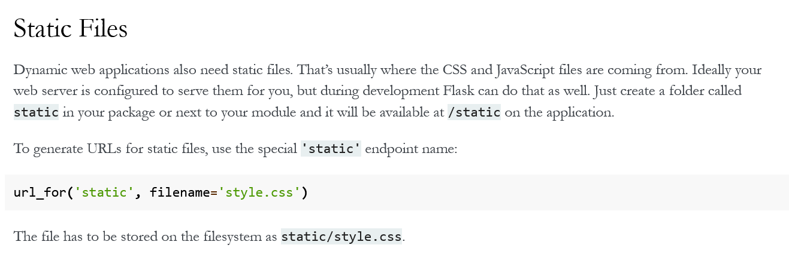
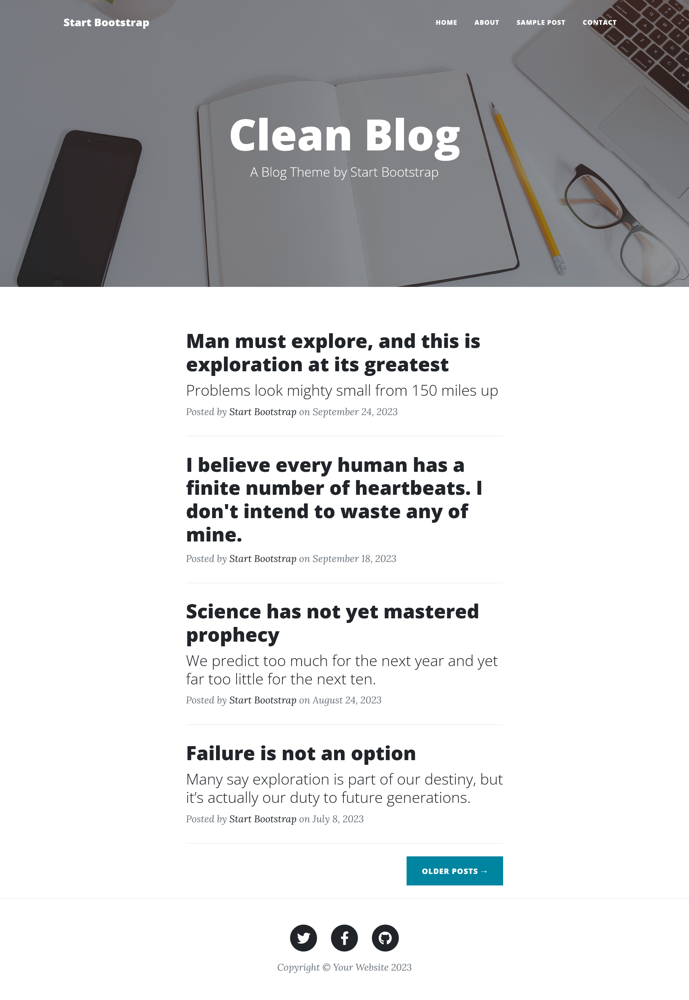
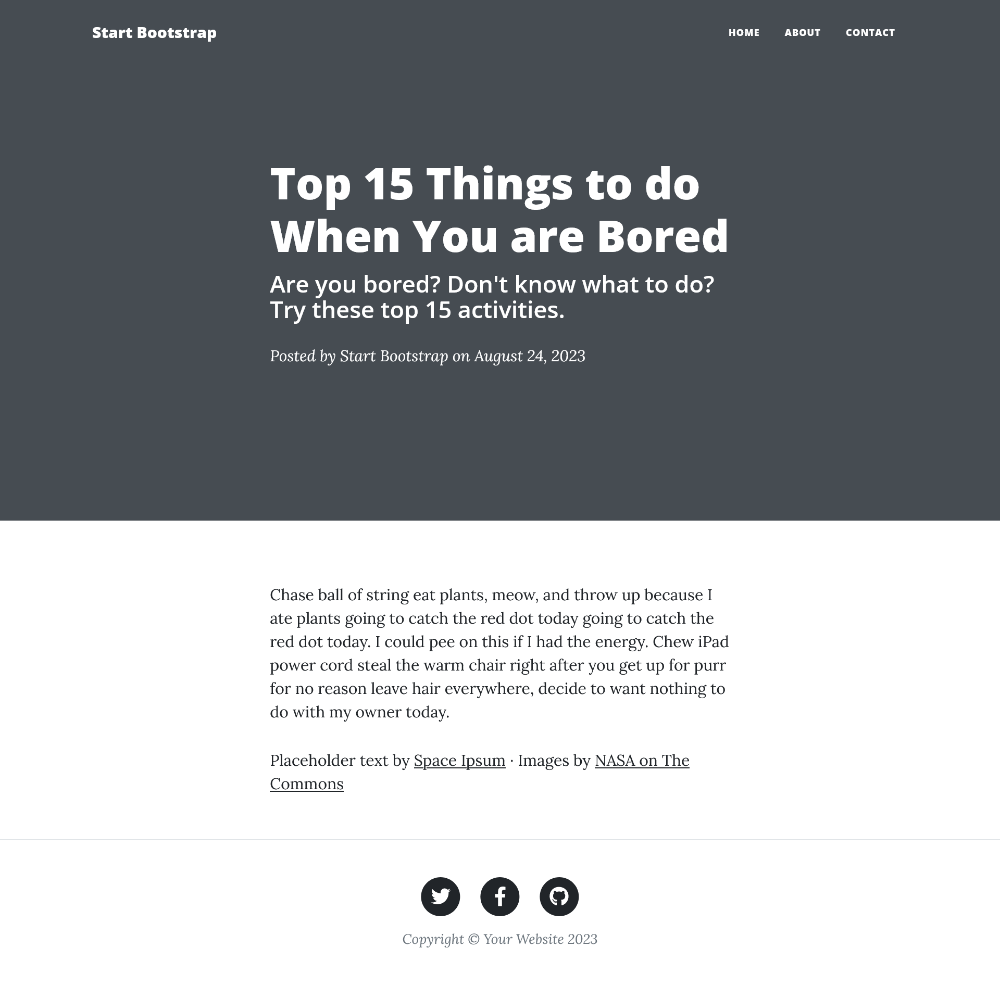

### 500 Day 59 Goals_ What you'll make by the end of today

Previously we've built a simple blog with simple CSS styling. 
It had no fancy animations and was not mobile responsive. Now that we've learnt all about Bootstrap and how much time it can save us, we're going to upgrade our blog with the power of Bootstrap.

The best part? We don't even have to write the Bootstrap code.

**Bootstrap Templates**

On the internet, there are hundreds of thousands of free Bootstrap templates. Beautifully designed websites using Bootstrap that are ready to go. All we need is to understand how Bootstrap works (Day 58) and then we can simply customise these beautiful websites for our own purposes.

e.g.

https://bootstrapmade.com/

https://getbootstrap.com/docs/4.0/examples/

https://www.creative-tim.com/bootstrap-themes/free

**What you Will Build**

By the end of today, you will build a blog website with these features:

1. Multi-page website with an interactive navigation bar:


2. Dynamically generated blog post pages with full screen titles:


3. Fully mobile responsive with an adaptive navigation bar:


### 501 Step 1 - Download the starting project

So previously, when working with Flask, we have seen that - 

* There is a main.py, which has the Flask application code.
* There are html files.
* The html files are stored in a folder called templates.
* The css files are stored in a folder called static.
* To write any code inside the html, we have to wrap it inside a {{ }}
* Loops in html start with  and ends with  / 

1. Head over to Start Bootstrap's website and download the Clean Blog Template:

https://startbootstrap.com/previews/clean-blog/

2. Unzip the downloaded file and rename the folder to "upgraded blog"


3. Open the project folder in PyCharm and:

    A. Create the static and templates folders.

    B. Move the files in the project to the correct folders (HTML files to templates and all folders to static).
    
    C. Delete the mail folder. We're going to be coding up the functionality from scratch.
    
    D. Create a header.html and footer.html file and the all important main.py.
    
    E. Check that your file structure now looks like this:


### 502 Step 2 - Get the home page to work

Use what you have learnt about Flask, get the home page to render when you go to

http://localhost:5000

in your browser.

e.g.


Steps

1. Create the Flask App 
   * Import/install the package
   * The boilerplate code
   * The render template code (because the boilerplate code does not connect to pre-made htmls)
2. Review the html
3. Connect the html with the Flask App

```python
from flask import Flask, render_template

app = Flask(__name__)


@app.route('/')
def home():
    return render_template("index.html")


if __name__ == "__main__":
    app.run(debug=True)
```

A simple google search gave this - 

```
On many computers, localhost is an alias for the IP address 127.0. 0.1. 
When a computer pings this IP address, it is communicating with itself. 
Localhost is useful for software testing and security purposes independent of a larger network.
```

### 503 Step 3 - Fix the header and footer

Notice that at the moment the styling is completely missing. 
This is because the static files (CSS/JS/images etc.) are served up by our server and they are no longer at the locations specified in the header. 

1. Fix the header in index.html so that the styling and bootstrap all appear. When you reload the website, it should look like this - 


Note: it's usually a good idea to build a dynamic url for the static resources instead of just pointing to the static folder. 
See the documentation here:

https://flask.palletsprojects.com/en/1.1.x/quickstart/#static-files



Changed the html code accordingly (last line) -
```html
 <head>
     <meta charset="utf-8" />
     <meta name="viewport" content="width=device-width, initial-scale=1, shrink-to-fit=no" />
     <meta name="description" content="" />
     <meta name="author" content="" />
     <title>Clean Blog - Start Bootstrap Theme</title>
     <link rel="icon" type="image/x-icon" href="../static/favicon.ico" />
     <!-- Font Awesome icons (free version)-->
     <script src="https://use.fontawesome.com/releases/v6.3.0/js/all.js" crossorigin="anonymous"></script>
     <!-- Google fonts-->
     <link href="https://fonts.googleapis.com/css?family=Lora:400,700,400italic,700italic" rel="stylesheet" type="text/css" />
     <link href="https://fonts.googleapis.com/css?family=Open+Sans:300italic,400italic,600italic,700italic,800italic,400,300,600,700,800" rel="stylesheet" type="text/css" />
     <!-- Core theme CSS (includes Bootstrap)-->
     <link href="{{ url_for('static', filename='style.css') }}" rel="stylesheet" />
 </head>
```

2. Fix the footer resources so that the Javascript works. 
You can verify this by checking that when you scroll the navigation bar becomes sticky at the top and changes background color e.g.:


Changes made in the html -

```html
<head>
   <!--Javascript-->
   <script> src="{{ url_for('static', filename='scripts.js') }}" </script>
   
   <!-- Core theme CSS (includes Bootstrap)-->
   <link href="{{ url_for('static', filename='style.css') }}" rel="stylesheet" />
</head>

<footer>
   <!-- Core theme JS-->
   <script src="{{ url_for('static', filename='scripts.js') }}"></script>
</footer>

```

The website now looks like this - 



### 504 Step 4 - Using Jinja Include fo Render Templates

The reason why Jinja Templates are called templates is because it makes it easier to create HTML pages by templating. Instead of re-writing the same header/navigation bar/footer you can just create a header and footer template which can then be applied to all web pages in your website.

e.g.

```html

```

Changeable part of your webpage. e.g. the body of the page.

```html

```

Then when the website is rendered, the header.html and footer.html gets inserted where the  specifies.

Using the documentation from Jinja: https://jinja.palletsprojects.com/en/2.11.x/templates/#include

1. Remove the <head> & navigation code from index.html and place it in the header.html file.
2. Remove the <footer> from index.html and place it in the footer.html file.
3. Using the above documentation, use include to make the website still function exactly the same as before.

**header.html**

```html
<!--<!DOCTYPE html>-->
<!--<html lang="en">-->
<head>
    <meta charset="utf-8" />
    <meta name="viewport" content="width=device-width, initial-scale=1, shrink-to-fit=no" />
    <meta name="description" content="" />
    <meta name="author" content="" />
    <title>Clean Blog - Start Bootstrap Theme</title>
    <link rel="icon" type="image/x-icon" href="../static/favicon.ico" />
    <!-- Font Awesome icons (free version)-->
    <script src="https://use.fontawesome.com/releases/v6.3.0/js/all.js" crossorigin="anonymous"></script>
    <!--Javascript-->
    <script> src="{{ url_for('static', filename='scripts.js') }}" </script>
    <!-- Google fonts-->
    <link href="https://fonts.googleapis.com/css?family=Lora:400,700,400italic,700italic" rel="stylesheet" type="text/css" />
    <link href="https://fonts.googleapis.com/css?family=Open+Sans:300italic,400italic,600italic,700italic,800italic,400,300,600,700,800" rel="stylesheet" type="text/css" />
    <!-- Core theme CSS (includes Bootstrap)-->
    <link href="{{ url_for('static', filename='style.css') }}" rel="stylesheet" />
</head>
<!--<body>-->

<!--</body>-->
<!--</html>-->
```

**footer.html**

```html
<!DOCTYPE html>
<html lang="en">
<!--<head>-->
<!--    <meta charset="UTF-8">-->
<!--    <title>Title</title>-->
<!--</head>-->
<body>
<footer class="border-top">
    <div class="container px-4 px-lg-5">
        <div class="row gx-4 gx-lg-5 justify-content-center">
            <div class="col-md-10 col-lg-8 col-xl-7">
                <ul class="list-inline text-center">
                    <li class="list-inline-item">
                        <a href="#!">
                                <span class="fa-stack fa-lg">
                                    <i class="fas fa-circle fa-stack-2x"></i>
                                    <i class="fab fa-twitter fa-stack-1x fa-inverse"></i>
                                </span>
                        </a>
                    </li>
                    <li class="list-inline-item">
                        <a href="#!">
                                <span class="fa-stack fa-lg">
                                    <i class="fas fa-circle fa-stack-2x"></i>
                                    <i class="fab fa-facebook-f fa-stack-1x fa-inverse"></i>
                                </span>
                        </a>
                    </li>
                    <li class="list-inline-item">
                        <a href="#!">
                                <span class="fa-stack fa-lg">
                                    <i class="fas fa-circle fa-stack-2x"></i>
                                    <i class="fab fa-github fa-stack-1x fa-inverse"></i>
                                </span>
                        </a>
                    </li>
                </ul>
                <div class="small text-center text-muted fst-italic">Copyright &copy; Your Website 2023</div>
            </div>
        </div>
    </div>

</footer>

</body>
</html>
```

**index.html**

```html
<!DOCTYPE html>
<html lang="en">
    <head>
        
    </head>
    <body>
    
    <footer>
       
    </footer>
   <!-- Bootstrap core JS-->
   <script src="https://cdn.jsdelivr.net/npm/bootstrap@5.2.3/dist/js/bootstrap.bundle.min.js"></script>
   <!-- Core theme JS-->
   <script src="{{ url_for('static', filename='scripts.js') }}"></script>
    </body>
```

### 505 Step 5 - Make the About and Contact Pages Work

Now that you've seen how you can replace the repeatable parts of your website (header/footer), we're going to make the rest of the pages work.

1. Delete the navigation bar item that points to the "Sample Post":


2. Update main.py and the about.html and contact.html files so that when you click on the About link in the navigation bar it goes to the About page and likewise with the Contact page. e.g.


HINT: Make sure that the anchor tags in the header.html are correctly pointing to the relevant routes in your server.

3. See if you can make the static images work on the About and Contact pages.

e.g.


HINT: Look at the <header> style attribute. Remember that the images are static files located in the img folder.

Steps - 

1. Delete the "sample post" in the navbar.

This - 

```html
<div class="collapse navbar-collapse" id="navbarResponsive">
  <ul class="navbar-nav ms-auto py-4 py-lg-0">
      <li class="nav-item"><a class="nav-link px-lg-3 py-3 py-lg-4" href="index.html">Home</a></li>
      <li class="nav-item"><a class="nav-link px-lg-3 py-3 py-lg-4" href="about.html">About</a></li>
      <li class="nav-item"><a class="nav-link px-lg-3 py-3 py-lg-4" href="post.html">Sample Post</a></li>
      <li class="nav-item"><a class="nav-link px-lg-3 py-3 py-lg-4" href="contact.html">Contact</a></li>
  </ul>
</div>
```
Becomes this - 

```html
<div class="collapse navbar-collapse" id="navbarResponsive">
  <ul class="navbar-nav ms-auto py-4 py-lg-0">
      <li class="nav-item"><a class="nav-link px-lg-3 py-3 py-lg-4" href="index.html">Home</a></li>
      <li class="nav-item"><a class="nav-link px-lg-3 py-3 py-lg-4" href="about.html">About</a></li>
      <li class="nav-item"><a class="nav-link px-lg-3 py-3 py-lg-4" href="contact.html">Contact</a></li>
  </ul>
</div>
```

2. Link the "About" and "Contact" buttons with the pages.

First, we create, in Flask, these 'about' and 'contact' pages.

```python
@app.route('/about')
def about():
    return render_template("about.html")


@app.route('/contact')
def contact():
    return render_template("contact.html")
```

So, when you click the 'about' and 'contact' buttons, in the html, the html looks (or should look) at Flask, to know what to do.
So we gotta tell the html to look at Flask when these buttons are clicked.

```html
<div class="collapse navbar-collapse" id="navbarResponsive">
  <ul class="navbar-nav ms-auto py-4 py-lg-0">
      <li class="nav-item"><a class="nav-link px-lg-3 py-3 py-lg-4" href="{{ url_for('home') }}">Home</a></li>
      <li class="nav-item"><a class="nav-link px-lg-3 py-3 py-lg-4" href="{{ url_for('about') }}">About</a></li>
      <li class="nav-item"><a class="nav-link px-lg-3 py-3 py-lg-4" href="{{ url_for('contact') }}">Contact</a></li>
  </ul>
</div>
```

N.B. Deleted the 'sample post' from the navbars of the 'about' and 'html' pages as well.

N.B. Changed the hrefs in the 'about' and 'contact' pages too (because every page contains the same navbar).

3. Take care of the static images in the "About" and "Contact" page.

i. Go to the page
ii. Inspect element
iii. Find out where the element for the img tag lies
iv. Find it in the html
v. Update the path.

### 506 Step 6 - Fetch and render the blog posts from an API

Just like our last blog website, we're going to save you the hassle of writing all your blog posts. Instead, you're going to get the posts from our API on npoint.

1. Create your own JSON bin with npoint.io.


Use the attached example blog data to create your own endpoint using npoint.io.


Your endpoint should be formatted something like this: https://api.npoint.io/c790b4d5cab58020d391

2. In main.py get hold of the JSON data at the above API endpoint.

3. Use the data from the API to render the home page, replacing the title, subtitle, author and dates of each blog post with the data from the API.

HINT 1: Instead of using a custom class, you can simply use Jinja variables to use the dot notation instead of square brackets. See: https://jinja.palletsprojects.com/en/2.11.x/templates/#variables

HINT 2: You'll need to use a for loop in the Jinja template, which we've done before. See the documentation here:

https://jinja.palletsprojects.com/en/2.11.x/templates/#for

This is what you're aiming for:


NOTE: The background image behind the header is this image that I found from Unsplash, feel free to go to the website to find your own.

https://unsplash.com/

Steps - 

1. Create own JSON bin
   1.  npoint.io
   2.  feed the example blog data to create the endpoint
   3. Get the endpoint
   ```
   https://api.npoint.io/d23a33f9566fcb4c30e0
   ```
2. In main.py get hold of the JSON data at the above API endpoint.

```python
import requests
# Get Blog Data
blog_data_url = 'https://api.npoint.io/d23a33f9566fcb4c30e0'

response = requests.get(url=blog_data_url)
print(response.status_code)
data = response.json()
```

3. Use the data from the API to render the home page

So you want to look for repeating elements in the original html.

And the repetition, you want to replace with a for loop.

So in the original index.html, the posts were presented like this - 

```html
<!-- Main Content-->

<div class="container px-4 px-lg-5">
   <div class="row gx-4 gx-lg-5 justify-content-center">
       <div class="col-md-10 col-lg-8 col-xl-7">
           <!-- Post preview-->
           <div class="post-preview">
               <a href="post.html"><h2 class="post-title">I believe every human has a finite number of heartbeats. I don't intend to waste any of mine.</h2></a>
               <p class="post-meta">
                   Posted by
                   <a href="#!">Start Bootstrap</a>
                   on September 18, 2023
               </p>
           </div>
           <!-- Divider-->
           <hr class="my-4" />
           <!-- Post preview-->
           <div class="post-preview">
               <a href="post.html">
                   <h2 class="post-title">Science has not yet mastered prophecy</h2>
                   <h3 class="post-subtitle">We predict too much for the next year and yet far too little for the next ten.</h3>
               </a>
               <p class="post-meta">
                   Posted by
                   <a href="#!">Start Bootstrap</a>
                   on August 24, 2023
               </p>
           </div>
           <!-- Divider-->
           <hr class="my-4" />
           <!-- Post preview-->
           <div class="post-preview">
               <a href="post.html">
                   <h2 class="post-title">Failure is not an option</h2>
                   <h3 class="post-subtitle">Many say exploration is part of our destiny, but it’s actually our duty to future generations.</h3>
               </a>
               <p class="post-meta">
                   Posted by
                   <a href="#!">Start Bootstrap</a>
                   on July 8, 2023
               </p>
           </div>
           <!-- Divider-->
           <hr class="my-4" />

```

You can see that every post starts with a post preview, then the post details and then a divider.

Instead of this repetition, I want to write the post generation code once, with a for loop.
So for every iteration a new post preview, post details and divider will be created, saving me from having to write them as many times as there are posts.
And these post details will be taken from my own blog data.

First I tell flask to render the home page, but this time with a data to go along with it, so the html can use the data.

```python
@app.route('/')
def home():
    return render_template(template_name_or_list="index.html", data_to_use=data)
```

The html file wil use this 'data_to_use' to render the page.

And I replace the repetitive blog post sections in the original html with a for loop that uses the 'data_to_use' to generate relevant divs for every iteration.
So if there are five posts in the 'data_to_use', there will be five iterations in the for loop, thus five divs will be created in the html, saving us the hassle of writing repetitive code.

```html
<div class="container px-4 px-lg-5">
   <div class="row gx-4 gx-lg-5 justify-content-center">
       <div class="col-md-10 col-lg-8 col-xl-7">
           <!-- Post preview-->
           
           <div class="post-preview">
               <a href="post.html">
                   <h2 class="post-title">{{ blog_post['title'] }}</h2>
                   <h3 class="post-subtitle">{{ blog_post['subtitle'] }}</h3>
               </a>
               <p class="post-meta">
                   Posted by
                   <a href="#!">Start Bootstrap</a>
                   on September 24, 2023
               </p>
           </div>
           <!-- Divider-->
           <hr class="my-4" />
           
```

### 507 Step 7 - Rendering Individual Posts

The final step is to render each individual post in the post.html page. When a user clicks on a particular post title on the home page (index.html), we should take them to the post.html page where the title/subtitle/image/date/author/body of the post is shown.

You've done this in the previous blog website. See if you can remember how to do it. If you can't remember, look back at the code from Day 55 and see if you can adapt it to this project. After all, programming is just tinkering, it's not an exam, you don't have to memorise everything.

This is what you're aiming for, (this is when I clicked on the cactus post on the home page):


Tasks -

1. Make the home page so that when you click a post, it redirects to the Flask function, with the post ID along with it.

This is the line that redirects to Flask, along with a post ID
```html
<a href="{{ url_for('post', post_id=blog_post['id']) }}">
```

```html
<!-- Post preview-->

<div class="post-preview">
   <a href="{{ url_for('post', post_id=blog_post['id']) }}">
       <h2 class="post-title">{{ blog_post['title'] }}</h2>
       <h3 class="post-subtitle">{{ blog_post['subtitle'] }}</h3>
   </a>
   <p class="post-meta">
       Posted by
       <a href="#!">Start Bootstrap</a>
       on September 24, 2023
   </p>
</div>
<!-- Divider-->
<hr class="my-4" />

```
2. Create a Flask generation of the posts page, using the data_to_use and the post ID 

```python
@app.route('/post/<int:post_id>')
# this is what the url will look like
def post(post_id):
# this is the function with the parameter 'post_id' collected from the signal the html sent to the Flask
    return render_template(template_name_or_list="post.html", data_to_use=data, id_to_use=post_id)
    # this is what the function does, with "data" (declared above globally) and "post_id"
```

3. Design the posts page to render webpage with different content for every post, depending on the post ID

Changes made to the post.html - 

```html
<link href="{{ url_for('static', filename='style.css') }}" rel="stylesheet" />
```
So I did not do a for loop and then an id check - 

```
for blog_post in data_to_use:
    if blog_post['id']==id_to_use:
```

Instead, I directly plugged in the title of my post from the data_to_use, based on the id_to_use - 

So when you click on the blog title in the home page, it redirects to Flask, Flask renders the post page with data_to_use and id_to_use.
```html
<!--used the id_to_use to find the index number of the post in the data_to_use list-->
<h1>{{ data_to_use[id_to_use-1]['title'] }}</h1>
<h2 class="subheading">{{ data_to_use[id_to_use-1]['subtitle'] }}</h2>
```

And finally, I changed the content of the blog with the body of the relevant post.

```html
<p>{{ data_to_use[id_to_use-1]['body'] }}</p>
```

Finally finally, I took care of the navbar hrefs and removed the sample post href line from the navbar - 

```html
<li class="nav-item"><a class="nav-link px-lg-3 py-3 py-lg-4" href="post.html">Sample Post</a></li>
```

That's it -




**_fin_**
