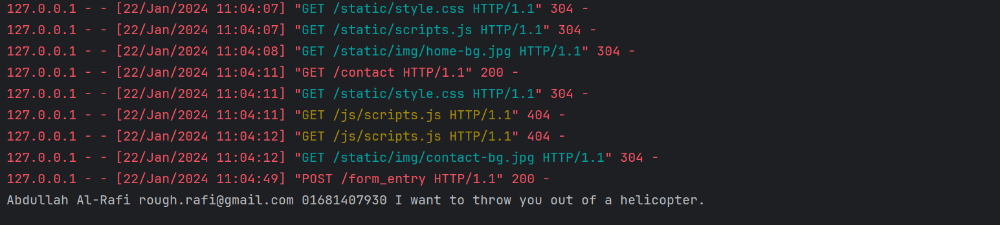

### 508 Day 60 goals - Make the Contact Form Work

**Contact Form**


Yesterday, we built an upgraded version of our blog website that uses Bootstrap for styling. The only part of the website that doesn't work is the contact form on the Contact Page. This is because we need to learn about submitting HTML forms and catching the submitted data in our Flask server.

**HTML Forms in Flask**

So the goal for today is to understand how HTML forms are submitted and how to use the data from the form to actually send an email to ourselves with the data submitted by the user.


Result:


### 509 HTML Forms Revision - Creating a Form from Scratch

1. Create a new PyCharm Project called html-forms. It should contain a main.py and index.html.


2. Create a new Flask application and serve the index.html page. Add an h1 to the index.html so that you can tell if it's working.


```python
from flask import Flask, render_template

app = Flask(__name__)


@app.route('/')
def home():
    return render_template(template_name_or_list="index.html")


if __name__ == "__main__":
    app.run(debug=True)
```

```html
<!DOCTYPE html>
<html lang="en">
<head>
    <meta charset="UTF-8">
    <title>Title</title>
</head>
<body>
    <h1>
        Hi
    </h1>
</body>
</html>
```

3. CHALLENGE: Create a HTML Form in index.html so that when rendered as a webpage, this is what you see:


```html
<form>
    <label>
        Name
    </label>
    <input type="text" id="fname" name="fname">
    <label>
        Password
    </label>
    <input type="text" id="pass" name="pass"><br>
    <button type="submit">Ok</button>
</form>
```

### 510 Handle POST Requests with Flask Servers

Now that we've created our form, the next step is to get it to work. We need our Flask server to be able to receive the data entered by the user.


At the moment when you fill out the form and press "Ok", nothing happens.

In order for it to send the form data, we have to change our HTML form. It needs to have an action and method.

1. CHALLENGE: See if you can use the documentation below to figure out how to make our HTML form submit a "POST" request to the path "/login".

https://www.w3schools.com/tags/att_form_method.asp

https://www.w3schools.com/tags/att_form_action.asp

2. Once the form is submitted, we also need to catch this POST request in our server. To do this we first need to give each input in our form a name attribute.


3. Now we can create a decorator in our main.py that will trigger a method when it receives a POST request:


Notice that the methods parameter accepts a dictionary, so you can have multiple methods targeted by one route. e.g.

@app.route("/contact", methods=["GET", "POST"]

More on this in the documentation here: https://flask.palletsprojects.com/en/1.1.x/quickstart/#http-methods

4. Flask has a method called request (don't confuse this with the requests module) which allows us to tap into the parameters of the request that was made to our server.

💪 DIFFICULT CHALLENGE: See if you can use the Flask documentation below to figure out how to get hold of the name and password that was entered into the form and send it back to the client as a h1. e.g.:


Documentation:

https://flask.palletsprojects.com/en/1.1.x/quickstart/#the-request-object

HINT:

https://stackoverflow.com/questions/11556958/sending-data-from-html-form-to-a-python-script-in-flask

Steps - 

1. Make form signal flask with the data

HTML form 'action' Attribute
On submit, send the form-data to an action named "/login" (to process the input).
You can submit the form using two methods, "get" and "post".
```html
<form action="/login" method="post">
    <label>
        Name
    </label>
    <input type="text" id="fname" name="fname">
    <label>
        Password
    </label>
    <input type="text" id="pass" name="pass"><br>
    <button type="submit">Ok</button>
</form>
```

```
Notes on GET:

    Appends form-data into the URL in name/value pairs
    The length of a URL is limited (about 3000 characters)
    Never use GET to send sensitive data! (will be visible in the URL)
    Useful for form submissions where a user wants to bookmark the result
    GET is better for non-secure data, like query strings in Google

Notes on POST:

    Appends form-data inside the body of the HTTP request (data is not shown in URL)
    Has no size limitations
    Form submissions with POST cannot be bookmarked
```

2. Make Flask capture the data to render the final webpage


From Stack Overflow - 


Following the syntax and instructions - 

```html
<form action="/login" method="post">
<!--we could also use "{{ url_for('login') }}", instead of "/login"-->
    <label>
        Name
    </label>
    <input type="text" id="fname" name="fname">
    <label>
        Password
    </label>
    <input type="text" id="pass" name="fpass"><br>
    <button type="submit">Ok</button>
</form>
```
On submit, The info is sent to an action named "/login" (to process the input).
The '/login' route in Flask thus captures it (the data, the fname and the fpass).
Flask then uses these variables to generate another webpage.

```python
@app.route('/login', methods=['POST'])
def login():
    name_to_use = request.form['fname']
    pass_to_use = request.form['fpass']
    return f"<h1>Username = {name_to_use}, Password = {pass_to_use}</h1>"
```

### 511 POST Requests in Flask Solution

#### The Flask Request Object
To complete the challenge, we had to tap into the request object. The Flask documentation was key in solving this challenge.

SOLUTION Code:

https://gist.github.com/angelabauer/045264ca6ad168b986f6687ee1368078

SOLUTION Walkthrough:


NOTE: The action attribute of the form can be set to "/login" e.g.
```
<form action="/login" method="post">
```

or it can be dynamically generated with url_for e.g.
```
<form action="{‌{ url_for('receive_data') }}" method="post">
```

Depending on where your server is hosted, the "/login" path may change. So it's usually a better idea to use "url_for" to dynamically generate the url for a particular function in your Flask server.

### 512 Getting the Contact Form to Work

[Instructions](./instructions/512 Getting the Contact Form to Work.html)

Steps

1. Get a fresh copy of the previous blog_post project.

Copied the entire New_Blog folder.

2. Change the content in contact.html to send the information to Flask.

```html
<form id="contactForm" data-sb-form-api-token="API_TOKEN" action="/contact" method="post">
```

3. Receive the data in Flask.

```python
from flask import request

@app.route(rule='/contact', methods=['GET', 'POST'])
def contact():
    if request.method == 'POST':
        name_to_use = request.form['name_entered']
        email_to_use = request.form['email_entered']
        phone_to_use = request.form['phone_entered']
        message_to_use = request.form['message_entered']
        return f"<h1>Username = {name_to_use}, Email = {email_to_use}, Phone = {phone_to_use}, Message = {message_to_use}</h1>"
```

Note: Flask only detects a list of name:value pairs

[Stack Overflow thread about this](https://stackoverflow.com/questions/52090187/retrieve-the-id-or-name-from-the-html-tag-using-python-flask)

4. In Flask, return a h1 that says "Successfully sent your message".

First, let's see if the capturing worked.
Let's run the app and provide some info.

Additional Steps - 

```
1. Activate the form
    a. Sign Up on Start Bootstrap
    b. Use the API key for your account and put it in the contact.html
    c. Add the JS script at the top of the contact.html (as per the documentation)
    d. Remove the "disabled" class from the "SEND" key (as per one Stack Overflow thread), so that it works now.
    e. Commented out the html codes that triggered when the form was submitted, so that the redirection to "http://127.0.0.1:5000/form_entry" happens.
```


5. Print the information the user has entered, in the console

```python
@app.route(rule='/form_entry', methods=['GET', 'POST'])
def receive_data():
    if request.method == 'POST':
        name_to_use = request.form['name_entered']
        email_to_use = request.form['email_entered']
        phone_to_use = request.form['phone_entered']
        message_to_use = request.form['message_entered']
        print(name_to_use, email_to_use, phone_to_use, message_to_use)
        return f"<h1>Username = {name_to_use}, Email = {email_to_use}, Phone = {phone_to_use}, Message = {message_to_use}</h1>"
```



6. CHALLENGE: Combine the "/contact" route with "/form-entry" so that they are both under the route "/contact". Depending on which method (GET/POST) that triggered the route, handle it appropriately.

```python
@app.route(rule='/contact', methods=['GET', 'POST'])
def contact():
    if request.method == 'POST':
        name_to_use = request.form['name_entered']
        email_to_use = request.form['email_entered']
        phone_to_use = request.form['phone_entered']
        message_to_use = request.form['message_entered']
        print(name_to_use, email_to_use, phone_to_use, message_to_use)
        return f"<h1>Username = {name_to_use}, Email = {email_to_use}, Phone = {phone_to_use}, Message = {message_to_use}</h1>"
    else:
        return render_template("contact.html")
```

So this way when it is the POST method, i.e. when the form info needs to be handled, the new webpage opens with the form info, but with the /contact endpoint.
And when it is not the POST method, i.e. when the form info does not need to be handed, the generic contact webpage is opened, also undet the /contact endpoint.

7. CHALLENGE: Instead of returning a h1 that says "Successfully sent message", update the contact.html file so that the h1 on the contact.html file becomes "Successfully sent message".

So instead of the boilerplate html with h1 containing the info on the form. I can, just create another copy of the contact.html.

I can replace the "Contact" text with "Successfully sent your message".

I can save it as contact2.html.

I can make so that when the 'POST' method gets triggered, the function should return the contact2.html.

```python
@app.route(rule='/contact', methods=['GET', 'POST'])
def contact():
    if request.method == 'POST':
        name_to_use = request.form['name_entered']
        email_to_use = request.form['email_entered']
        phone_to_use = request.form['phone_entered']
        message_to_use = request.form['message_entered']
        print(name_to_use, email_to_use, phone_to_use, message_to_use)
        return render_template("contact2.html")
    else:
        return render_template("contact.html")
```

Or, I can use the 'if' method.


Let's revisit what happens when individual post gets created in index.html and rendered as a separate post in post.html, in Flask.

```
1. So, when the posts are created in index.html, every post gets assigned a post_id when clicked on, and it is sent to the Flask function for rendering the post.html.

2. Flask gets the post_id from index.html, puts it in the function, i.e. post(post_id), and renders the post.html with the post_id to go along with it, in a variable called id_to_use.

3. The post.html uses the id_to_use to design the html.
```

SO FLASK CAN RENDER TEMPLATES WITH A VARIABLE TO GO ALONG AND THE VARIABLE CAN BE USED AT THE OUTPUT HTML LEVEL TO DESIGN ITSELF.

Similarly, I can use a variable based on status of request.method ("GET", "POST"), to render the contact.html.

The contact.html will then be designed based on the variable.

```python
@app.route(rule='/contact', methods=['GET', 'POST'])
def contact():
    if request.method == 'POST':
        return render_template(template_name_or_list="contact.html", post_status=True)
        # rendering the contact.html with the variable post_status
    else:
        return render_template(template_name_or_list="contact.html")
```

So the contact.html will use this "post_status" to design itself.

```html
<div class="page-heading">
    
        <h1>Sent Message</h1>
    
        <h1>Contact Me</h1>
    
    <span class="subheading">Have questions? I have answers.</span>
</div>
```

### 513 Sending Email with smtplib

[Instructions](./instructions/513 Sending Email with smtplib.html)

New file named mailer.py - 

```python
import smtplib


class Gmailer:
    def __init__(self):
        self.my_email = 'rough.rafi@gmail.com'
        self.my_password = 'fotkabazz1123581321'
        self.app_password = 'uzdalqmxwenwmvmy'
        self.connection = smtplib.SMTP('smtp.gmail.com')
        self.message = None
        self.connection.starttls()

    def draft_msg(self, name, email, phone, msg):
        self.message = f'Subject: New Form!!!\n\nName: {name}\nEmail: {email}\nPhone: {phone}\nMessage: {msg}\n\n'

    def send(self):
        self.connection.login(user=self.my_email, password=self.app_password)
        self.connection.sendmail(from_addr=self.my_email,
                            to_addrs="rafi.abdullah.112358@gmail.com",
                            msg=self.message)
        # self.connection.close()
```

```python
new_mail = mailer.Gmailer()

@app.route(rule='/contact', methods=['GET', 'POST'])
def contact():
    if request.method == 'POST':
        name_to_use = request.form['name_entered']
        email_to_use = request.form['email_entered']
        phone_to_use = request.form['phone_entered']
        message_to_use = request.form['message_entered']
        new_mail.draft_msg(name_to_use, email_to_use, phone_to_use, message_to_use)
        new_mail.send()
        return render_template(template_name_or_list="contact.html", post_status=True)
```

 


