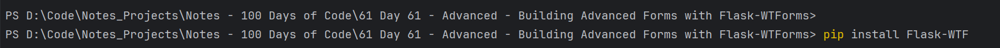
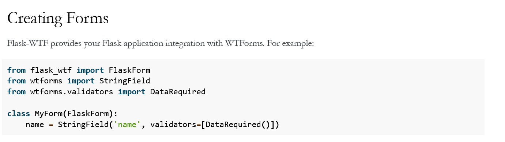
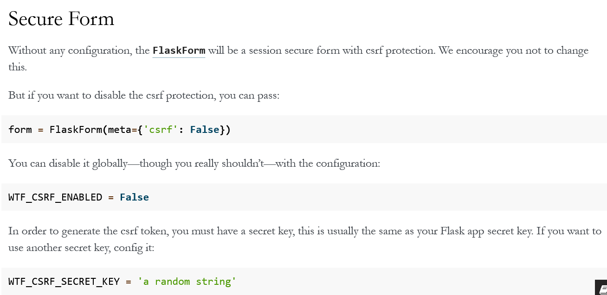
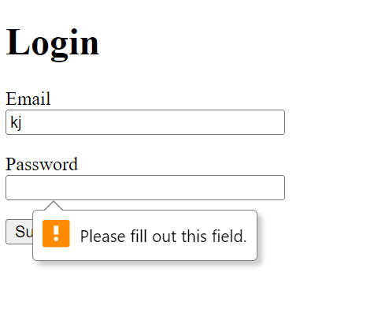
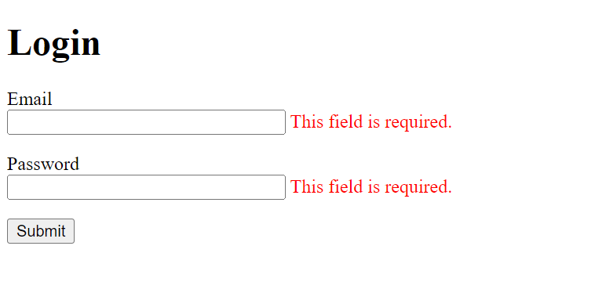
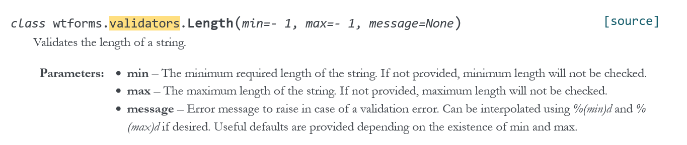
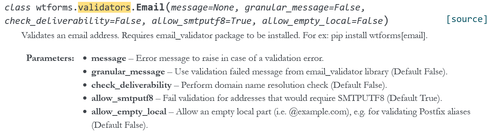
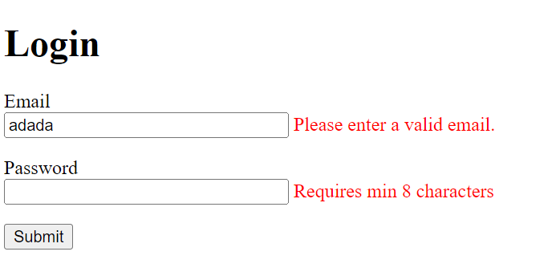
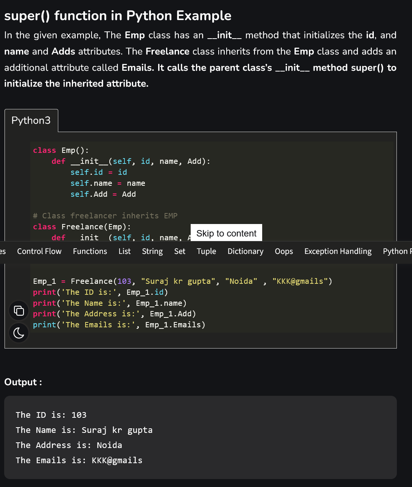
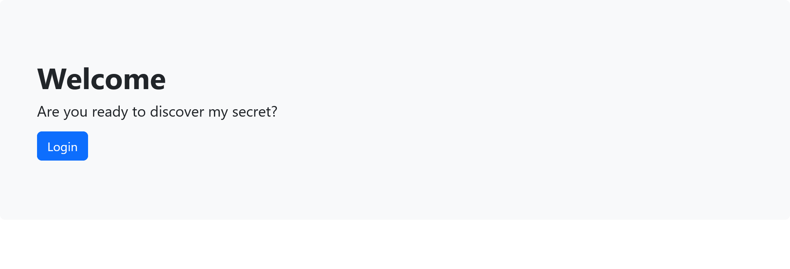

### 514 Day 61 Goals_ Building Advanced Forms

[Instructions](./instructions/514%20Day%2061%20Goals_%20Building%20Advanced%20Forms.html)

Today, we're going to build forms using a Flask extension called Flask-WTF.

It has a number of benefits over the simple HTML Form. e.g.

```
Easy Form Validation - Makes sure the user is entering data in the required format in all the required fields. e.g. checking that the user's email entry has a "@" and a "." at the end. All without having to write your own validation code.

Less Code - If you have a number of forms in your website, using WTForm can dramatically reduce the amount of code you have to write (or copy & paste).

Built in CSRF Protection - CSRF stands for Cross Site Request Forgery, it's an attack that can be made on website forms which forces your users to do unintended actions (e.g. transfer money to a stranger) or compromise your website's security if it's an admin.
```

Goal - By the end of today, we will build a website that holds some secrets. Only with the right username and password can you access the page with our secrets.

### 515 Installing Flask-WTF

[Instructions](./instructions/515%20Installing%20Flask-WTF.html)

Steps - 

1. Download the starting files (see lesson resources) and unzip the folder. Open the unzipped folder in PyCharm. You might see a warning like the one in the screenshot below, click on "Install Requirement" to install Flask.
2. Create the login route which renders the login.html file.

```python
from flask import Flask, render_template
app = Flask(__name__)

@app.route("/login")
def home():
    return render_template('login.html')
```

>The requirements.txt file is a file where you can specify all the dependencies (the installed packages that your project depends on) and their versions. This means that you can share your project without all the installed packages, making it a lot more lightweight. When someone downloads your project (like you have done here), the requirements.txt file tells their code editor which packages need to be installed.

[Read more on this here](https://docs.google.com/document/d/e/2PACX-1vRIW_TuZ6z0ASjAoxgJgmzjGYLCDx019tKvphaTwK_Za7fnMKywUuXI0-s5wr0nQI_gprm6J6y7L9rL/pub)

3. Use the Terminal to install Flask-WTF.



### 516 Creating Forms with Flask-WTF

[Instructions](./instructions/516%20Creating%20Forms%20with%20Flask-WTF.html)

Read https://flask-wtf.readthedocs.io/en/1.0.x/form/ and use it to figure out how to create a simple login form.

```text
SPECIFICATIONS:

It must have an email and password field.

They can both be StringFields.

You don't have to worry about validators.

Both email and password inputs should be size 30. (This describes the width of the input).

You should not need to create any <label> or <input> elements manually using HTML.
```

From ChatGPT - 

To create a form using WTForms, you can follow these steps:

1. Install Flask-WTF and WTForms libraries using pip.
2. Import the required classes from the libraries.
3. Create a class that inherits from FlaskForm.
4. Define the fields of the form as class variables.
5. Add validators to the fields if required.
6. Create an instance of the form class in your Flask view function.
7. Render the form in your HTML template using the form object.
8. Add CSRF protection to the form by adding a secret key to your Flask app.

Here is an example of how to create a contact us form using WTForms in Flask 

```python
from flask_wtf import FlaskForm
from wtforms import StringField, validators, PasswordField, SubmitField
from wtforms.validators import DataRequired, Email, Length

class ContactForm(FlaskForm):
    name = StringField('Name', validators=[DataRequired(), Length(min=2, max=50)])
    email = StringField('Email', validators=[DataRequired(), Email()])
    message = StringField('Message', validators=[DataRequired(), Length(min=10, max=500)])
    submit = SubmitField('Submit')
```

In the above example, we have created a ContactForm class that inherits from FlaskForm. 
The class has three fields: name, email, and message. 
Each field is an instance of a StringField class. 
We have also added validators to each field using the validators parameter. 
The submit field is an instance of the SubmitField class.

To render the form in an HTML template, we can use the following code:

```html
<form method="POST" action="{{ url_for('contact') }}">
    {{ form.hidden_tag() }}
    <div class="form-group">
        {{ form.name.label }} {{ form.name }}
    </div>
    <div class="form-group">
        {{ form.email.label }} {{ form.email }}
    </div>
    <div class="form-group">
        {{ form.message.label }} {{ form.message }}
    </div>
    <button type="submit" class="btn btn-primary">Submit</button>
</form>
```



```python
from flask import Flask, render_template, request

from flask_wtf import FlaskForm
from wtforms import StringField
from wtforms.validators import DataRequired

# So you first design your form using the MyForm class
class MyForm(FlaskForm):
    # 1.  It must have an email and password field.
    # 2. They can both be StringFields.
    # 3. You don't have to worry about validators.
    email = StringField(label='email', validators=[DataRequired()])
    password = StringField(label='password', validators=[DataRequired()])


@app.route(rule="/login", methods=['GET', 'POST'])
def login():
    form = MyForm()
    # create a form object from the class you created above.
    if request.method == 'POST':
        return 'Message Captured'
        # this is to check if the info collected in the form has been captured by Flask
        # this is the webpage returned when the form is filled, the data is captured using 'POST' and a separate webpage is returned ('Message Captured') indicating message has been received
    return render_template(template_name_or_list='login.html', form=form)
    # this is the webpage rendered originally, this is the generic login webpage that gets rendered when 'login' button is pressed in the index.html
```

```html
<div class="container">
<h1>Login</h1>
<!-- This is where our form will go. -->
    <form method="POST" action="{{ url_for('login') }}">
        <!--Both email and password inputs should be size 30. (This describes the width of the input).-->
        {{ form.email.label }} {{ form.email(size=30) }}
        {{ form.password.label }} {{ form.password(size=30) }}
        <input type="submit" value="Go">
    </form>
</div>
```

Now, when I run this, and click the login button to generate the login.html, this error pops up - 

```
RuntimeError: A secret key is required to use CSRF.
```

The documentation talks about this - 



Added this line in the main.py - 

```python
app = Flask(__name__)
app.config['SECRET_KEY'] = 'somethingrandom'
```

### 517 Code Improvements for Our WTForms

[Instructions](./instructions/517%20Code%20Improvements%20for%20Our%20WTForms.html)

1. Change the password stringfield to password field. This way the text inputs will be converted to asterix.
2. Change the label of the passwordfield to password, in the class.
```python
from wtforms import PasswordField

class MyForm(FlaskForm):
    password = PasswordField(label='Password', validators=[DataRequired()])
```

3. Use url_for in the html, to direct to the login() function.

```html
<form method="post" action="{{ url_for('login') }}">
    
</form>
```

4. Format the html a bit, so that the Email and Password fields are vertical.

```html
<p>
    {{ form.email.label }} <br> {{ form.email(size=30) }}
</p>
<p>
    {{ form.password.label }} <br> {{ form.password(size=30) }}
</p>
```

5. Instead of input tag, use SubmitField for the submit button.

```html
<form method="post" action="{{ url_for('login') }}">
    <p>
        {{ form.email.label }} <br> {{ form.email(size=30) }}
    </p>
    <p>
        {{ form.password.label }} <br> {{ form.password(size=30) }}
    </p>
    {{ form.submit }}
</form>
```

### 518 Adding Validation to Forms with Flask-WTF

[Instructions](./instructions/518%20Adding%20Validation%20to%20Forms%20with%20Flask-WTF.html)

> One of the biggest reasons why we would choose WTForms over HTML Forms is the built-in validation. Instead of us having to write our own validation code e.g. emails should contain a "@" and a "." to be valid or make sure that passwords are minimum of 8 characters, we can use all these validation rules straight out of the box from WTForms.

1. Add validators

```python
from wtforms.validators import DataRequired

class MyForm(FlaskForm):
    email = StringField(label='Email', validators=[DataRequired()])
    password = PasswordField(label='Password', validators=[DataRequired()])
    submit = SubmitField(label='Submit')
```

>The validators parameter accepts a List of validator Objects. DataRequired makes the two fields required fields, so the user must type something, otherwise an error will be generated.

> When a form is submitted, there may be a number of errors, so a List of errors can be generated and passed over to our form HTML as a property on the field which generated the error, e.g.

2. Tap into these errors and loop through them to show some text when an error appears.

```html
<form method="post" action="{{ url_for('login') }}">
    {{ form.csrf_token }}
    <!--initially I put {{ form.csrf.token }} here-->
    <!--an error went off saying form object does not contain any attribute csrf-->
    <!--went to google, found that the usage of this line here was like this - form.csrf_token-->
    <!--replaced it, and it worked-->
    <p>
        {{ form.email.label }} <br> {{ form.email(size=30) }}
        
        <span style="color: red">{{ error }}</span>
        
    </p>
    <p>
        {{ form.password.label }} <br> {{ form.password(size=30) }}
        
        <span style="color: red">{{ error }}</span>
        
    </p>
    {{ form.submit }}
</form>
```

> The final step is to tell our form to validate the user's entry when they hit submit. so we have to edit our route and make sure it is able to respond to POST requests and then to validate_on_submit().

```python
@app.route(rule="/login", methods=['GET', 'POST'])
def login():
    form = MyForm()
    if request.method == 'POST':
        # return 'Message Captured'
        form.validate_on_submit()
    return render_template(template_name_or_list='login.html', form=form)
```

Now when I do not fill out a field, this error auto pops up, in chrome - 



This is a browser specific feature and only available in chrome.
This behaviour is not from our validator, in fact it's a built-in mechanism that varies from browser to browser. You'll see something different on Firefox or Safari. But If your user is running Internet Explorer, they won't see any validation.

I want it so that similar errors also pop up in other browsers too.

First, we gotta switch off the default validation from the browser.

```html
<form method="post" action="{{ url_for('login') }}" novalidate>
# add 'novalidate' to turn off browser level validation
    {{ form.csrf_token }}
    <p>
        {{ form.email.label }} <br> {{ form.email(size=30) }}
        
        <span style="color: red">{{ error }}</span>
        
    </p>
    <p>
        {{ form.password.label }} <br> {{ form.password(size=30) }}
        
        <span style="color: red">{{ error }}</span>
        
    </p>
    {{ form.submit }}
</form>
```

Now test your validation, it should give you a warning in red if you leave any field empty and click "Log In". e.g.



#### CHALLENGE: Using the documentation on WTForm validators, add Email validation to the email field so that you must type a valid email (with "@" and ".") otherwise you get an error. Also add Length validation to the password, so you must type at least 8 characters.

From the doc - 



Following that into our code - 

```python
from wtforms import StringField, PasswordField, SubmitField
from wtforms.validators import DataRequired, Length

password = PasswordField(label='Password', validators=[DataRequired("Please enter password"), Length(min=8, max=20, message='Requires min 8 characters')])
```

That's password validation done.

Now for the email validation.

From the doc - 



Following that into our code - 

```python
from flask_wtf import FlaskForm
from wtforms import StringField, PasswordField, SubmitField
from wtforms.validators import DataRequired, Length, Email

class MyForm(FlaskForm):
    email = StringField(label='Email', validators=[DataRequired("Please enter your email"),
                                                   Email(message='Please enter a valid email.')])
    password = PasswordField(label='Password', validators=[DataRequired("Please enter password"),
                                                           Length(min=8, max=20, message='Requires min 8 characters')])

```

Does not work. Throws this error - 

```text
Install 'email_validator' for email validation support
```

Therefore - 

```commandline
pip install email_validator
```

Runs now.




### 519 Receiving Form Data with WTForms

[Instructions](./instructions/519%20Receiving%20Form%20Data%20with%20WTForms.html)

Without WTForms, we would have to get the data entered like this - 

```python
email_to_use = request.form['email_entered']
# where 'email_entered' is the name field of the element in the form html
```

With WTForms, it's even easier to get hold of the form data. All you have to do is to tap into the

```python
<form_object>.<form_field>.data
```
For example -

```python
user.username = form.username.data
```

```text
Previously we used

if request.method == "POST"

Now, we're simply going to check the return value of validate_on_submit() which will be True if validation was successful after the user submitted the form, or False if it failed.
```

```python
@app.route(rule="/login", methods=['GET', 'POST'])
def login():
    form = MyForm()
    # if request.method == 'POST':
    #     # return 'Message Captured'
    if form.validate_on_submit():
        print(form.email.data)
        print(form.password.data)
    return render_template(template_name_or_list='login.html', form=form)
```

When the data get entered, they get promptly printed on the console.

```text
rough.rafi@gmail.com
1123581321
```

#### CHALLENGE: Update the /login route in main.py so that if the form was submitted and validated and their credentials matched the following:

```text
email: admin@email.com

password: 12345678
```

then show them the success.html page.

Otherwise show them the denied.html page

```python
@app.route(rule="/login", methods=['GET', 'POST'])
def login():
    form = MyForm()
    email_entered = form.email.data
    # whatever is entered in the email field, store that in this variable
    password_entered = form.password.data
    # whatever is entered in the password field, store that in this variable
    if form.validate_on_submit():
        # if the form fields have been filled up fulfilling all directions, then
        if email_entered == 'admin@email.com' and password_entered == '12345678':
            return render_template(template_name_or_list='success.html')
            # if the email and pass match, return this template
        else:
            return render_template(template_name_or_list='denied.html')
            # if they do not match, return that template
    return render_template(template_name_or_list='login.html', form=form)
```

This is how WTForms are so much better than generic forms.
In WTForms you only have to place the form in the html once -

```html
<form method="post" action="{{ url_for('login') }}" novalidate>
    {{ form.csrf_token }}
    <p>
        {{ form.email.label }} <br> {{ form.email(size=30) }}
        
        <span style="color: red">{{ error }}</span>
        
    </p>
    <p>
        {{ form.password.label }} <br> {{ form.password(size=30) }}
        
        <span style="color: red">{{ error }}</span>
        
    </p>
    {{ form.submit }}
</form>
```

The configurations are all done from the Flask.

```python
class MyForm(FlaskForm):
    email = StringField(label='Email', validators=[DataRequired("Please enter your email"),
                                                   Email(message='Please enter a valid email.')])
    password = PasswordField(label='Password', validators=[DataRequired("Please enter password"),
                                                           Length(min=8, max=20, message='Requires min 8 characters')])
    submit = SubmitField(label='Submit')
```

### 520 Inheriting Templates Using Jinja2

[Instructions](./instructions/520%20Inheriting%20Templates%20Using%20Jinja2.html)

Previously, we saw that we can inject a header.html and footer.html using Jinja and the code might look something like this:

```html

Web page content

```

This is a really flexible way of using Jinja to Template a website. It means that if your header and footer stay the same then you can just insert them into all your webpages.

However, often you'll find that you actually want to use the same design template for your entire website, but you might need to change some code in your header or footer. In these cases, it's better to use Template Inheritance instead.

Template inheritance is similar to Class inheritance, you can take a parent template and extend its styling in your child web pages.


For example, if we create a base.html file that has the following code:

```html
<!DOCTYPE html>
<html lang="en">
<head>
    <meta charset="UTF-8">
    <title></title>
</head>
<body>
    
</body>
</html>
```

It has predefined areas (or blocks) where new content can be inserted by a child webpage inheriting from this template.

We could re-write the success.html page to inherit from this base.html template:

```html
#1.

#2.
Success
#3.

   <div class="container">
      <h1>Top Secret </h1>
      <iframe src="https://giphy.com/embed/Ju7l5y9osyymQ" width="480" height="360" frameBorder="0" class="giphy-embed" allowFullScreen></iframe>
      <p><a href="https://giphy.com/gifs/rick-astley-Ju7l5y9osyymQ">via GIPHY</a></p>
   </div>

```

```text
#1. This line of code tells the templating engine (Jinja) to use "base.html" as the template for this page.

#2. This block inserts a custom title into the header of the template.

#3. This block provides the content of the website. The part that is going to vary between webpages.
```

#### CHALLENGE: Try doing the same thing for denied.html, making sure that it uses the base.html as the template and it has a custom title and content.

```html
<!--#1.-->

<!--#2.-->
Denied
<!--#3.-->

	<div class="container">
		<h1>Access Denied </h1>
		<iframe src="https://giphy.com/embed/1xeVd1vr43nHO" width="480" height="271" frameBorder="0" class="giphy-embed" allowFullScreen></iframe>
		<p><a href="https://giphy.com/gifs/cheezburger-funny-dog-fails-1xeVd1vr43nHO">via GIPHY</a></p>
	</div>

```

#### Recap - the super.init() method



>The super keyword refers to the parent that the child is inheriting from. e.g If Simba inherits from Mufasa, then Mufassa is the super.

>When we are inheriting templates. Sometimes, there's some part of the template that we want to keep, but we also want to add to it. So we can use super blocks in this case.

Let's add the following code to the base html -

```html
<style>

body{
    background: purple;
}

</style>
```

```html
<!DOCTYPE html>
<html lang="en">
<head>
    <meta charset="UTF-8">
    <title></title>
    <style>
    
    body{
        background: purple;
    }
    
    </style>
</head>
<body>
    
</body>
</html>
```

```text
I named this block "styling" but you can call it anything you want.

Just make sure that you close all blocks with 
```

##### Now if you reload your website, you should see that both the success page and the denied page will have a purple background.


Therefore, if we use the same template is all our pages, it is really easy to modify them.
Just change the base.html and the change will take effect on all of the webpages.

On the denied.html page, add a super block using {{ super() }}, this will inject all the code in the styling block to this child page. Then afterwards before the , we can add some more styling to change the colour of the h1

```html
<!--#1.-->

<!--#2.-->
Denied
<!--#3-->
<!--Add a separate block styling section-->

   {{ super() }}
    <!--this indicates that it inherits all styling from the base.html-->
    <!--then add your styling-->
   h1 {
      color:red;
   }

<!--#4.-->

	<div class="container">
		<h1>Access Denied </h1>
		<iframe src="https://giphy.com/embed/1xeVd1vr43nHO" width="480" height="271" frameBorder="0" class="giphy-embed" allowFullScreen></iframe>
		<p><a href="https://giphy.com/gifs/cheezburger-funny-dog-fails-1xeVd1vr43nHO">via GIPHY</a></p>
	</div>

```

That was all about inheriting templates using jinja.

### 521 Using Flask-Bootstrap as an Inherited Template

[Instructions](./instructions/521%20Using%20Flask-Bootstrap%20as%20an%20Inherited%20Template.html)

The website, as it is now, looks like it was born in the 90s.

#### Flask-Bootstrap

Previously we saw that we could simply include a link to the Bootstrap CSS code in the header of our website. 

But there's an even easier way. 

**We can use the Flask-Bootstrap Python extension.**

```shell
pip install Flask-Bootstrap
```

> CHALLENGE: Delete the super block in your denied.html file and use the Flask-Bootstrap documentation to convert our denied.html, success.html, login.html and index.html to use Bootstrap as the template.

Steps
1. Change the index.html
```html
<!DOCTYPE HTML>
<html>
<head>
    <meta charset="UTF-8">
    <meta name="viewport" content="width=device-width, initial-scale=1">
    <title>Secrets</title>
    <link href="https://cdn.jsdelivr.net/npm/bootstrap@5.2.3/dist/css/bootstrap.min.css" rel="stylesheet" integrity="sha384-rbsA2VBKQhggwzxH7pPCaAqO46MgnOM80zW1RWuH61DGLwZJEdK2Kadq2F9CUG65" crossorigin="anonymous">
</head>
<body>
<div class="p-5 mb-4 bg-light rounded-3">
    <div class="container-fluid py-5">
        <h1 class="display-5 fw-bold">Welcome</h1>
        <p class="col-md-8 fs-4">Are you ready to discover my secret?</p>
        <button class="btn btn-primary btn-lg" onclick="window.location.href='{{ url_for('login') }}';">Login</button>
    </div>
</div>
</body>
</html>
```


2. Change the login.html

No change required in login.html it seems, except for adding bootstrap in the head section.

```html
<head>
    <meta charset="UTF-8">
    <meta name="viewport" content="width=device-width, initial-scale=1">
    <title>Login</title>
    <link href="https://cdn.jsdelivr.net/npm/bootstrap@5.2.3/dist/css/bootstrap.min.css" rel="stylesheet" integrity="sha384-rbsA2VBKQhggwzxH7pPCaAqO46MgnOM80zW1RWuH61DGLwZJEdK2Kadq2F9CUG65" crossorigin="anonymous">
</head>
```

3. Change the success.html

```html
<!--#1.-->

<!--the base.html, the html that is inherited, contains bootstrap-->
<!--#2.-->
Success
<!--#3.-->

   <div class="container">
      <h1 class="display-6">Top Secret </h1>
       <!--added bootstrap class here to change the font-->
      <iframe src="https://giphy.com/embed/Ju7l5y9osyymQ" width="480" height="360" frameBorder="0" class="giphy-embed" allowFullScreen></iframe>
      <p><a href="https://giphy.com/gifs/rick-astley-Ju7l5y9osyymQ">via GIPHY</a></p>
   </div>

```

4. Change the denied.html

```html
<!--#1.-->

<!--#2.-->
Denied
<!--#3-->
<!--Deleted the super block-->
<!--#4.-->

	<div class="container">
		<h1 class="display-6">Access Denied </h1>
		<iframe src="https://giphy.com/embed/1xeVd1vr43nHO" width="480" height="271" frameBorder="0" class="giphy-embed" allowFullScreen></iframe>
		<p><a href="https://giphy.com/gifs/cheezburger-funny-dog-fails-1xeVd1vr43nHO">via GIPHY</a></p>
	</div>

```

### 522 Flask-Bootstrap Supports WTForms

[Instructions](./instructions/522%20Flask-Bootstrap%20Supports%20WTForms.html)

Before, we did forms directly on the html.

Today we learned that we can generate forms and their actions directly from Flask.

Now, there is a way to add bootstrap styling to the Flask generated forms.

First, we have to add the functionality to Flask - 

```python
from flask_bootstrap import Bootstrap

app = Flask(__name__)
app.config['SECRET_KEY'] = 'somethingrandom'
Bootstrap(app)
```

Now, our form lies in the login.html page, so the changes will have to be made there.

Initially, this is what the login.html held - 

```html
<!DOCTYPE HTML>

<html>
	<head>
		<meta charset="UTF-8">
    	<meta name="viewport" content="width=device-width, initial-scale=1">
		<title>Login</title>
		<link href="https://cdn.jsdelivr.net/npm/bootstrap@5.2.3/dist/css/bootstrap.min.css" rel="stylesheet" integrity="sha384-rbsA2VBKQhggwzxH7pPCaAqO46MgnOM80zW1RWuH61DGLwZJEdK2Kadq2F9CUG65" crossorigin="anonymous">
	</head>
	<body>
        <div class="container">
		<h1>Login</h1>
        <!-- This is where our form will go. -->
			<form method="post" action="{{ url_for('login') }}" novalidate>
				{{ form.csrf_token }}
				<p>
					{{ form.email.label }} <br> {{ form.email(size=30) }}
					
					<span style="color: red">{{ error }}</span>
					
				</p>
				<p>
					{{ form.password.label }} <br> {{ form.password(size=30) }}
					
					<span style="color: red">{{ error }}</span>
					
				</p>
				{{ form.submit }}
			</form>
        </div>
	</body>
</html>
```

Adding bootstrap styling to Flask generated forms is really simple, and cuts down the lines of code too.

Just like the success.html and denied.html inherited from the base.html, so will the login.html inherit from a bootstrap base html file.

So the login.html becomes - 

```html
<!--#1.-->

<!--inherits the bootstrap/base.html-->
<!--#2-->

<!--import the desired html template-->
<!--#3-->
<!--put the title in a block-->

<title>Login</title>

<!--#4-->
<!--now for the form, put the form in the block just like the title-->

<div class="container">
<h1>Login</h1>
<!-- This is where our form will go. -->
    <form method="post" action="{{ url_for('login') }}" novalidate>
        {{ form.csrf_token }}
<!--        after this, instead of writing lines of code outlining the form, we just have to add one line and the entire form will be populated-->
        {{ wtf.quick_form(form, novalidate=True) }}
    </form>
</div>

```

##### fin
