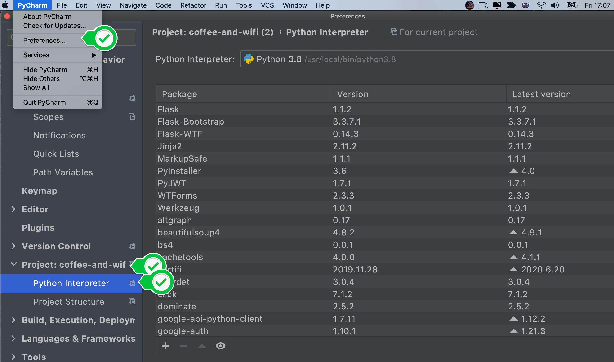
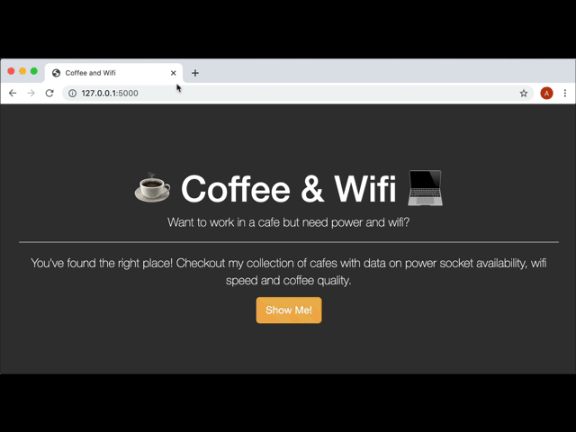
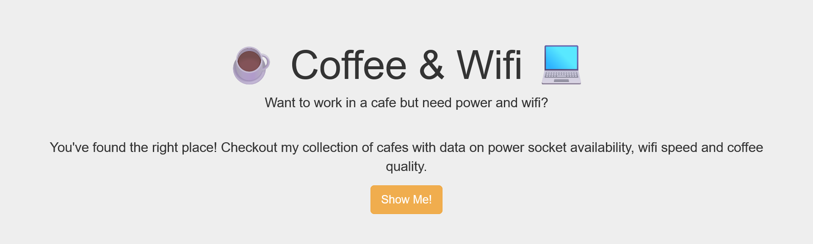
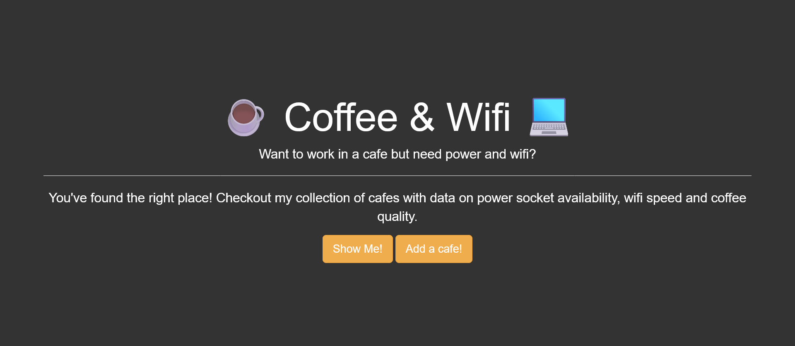
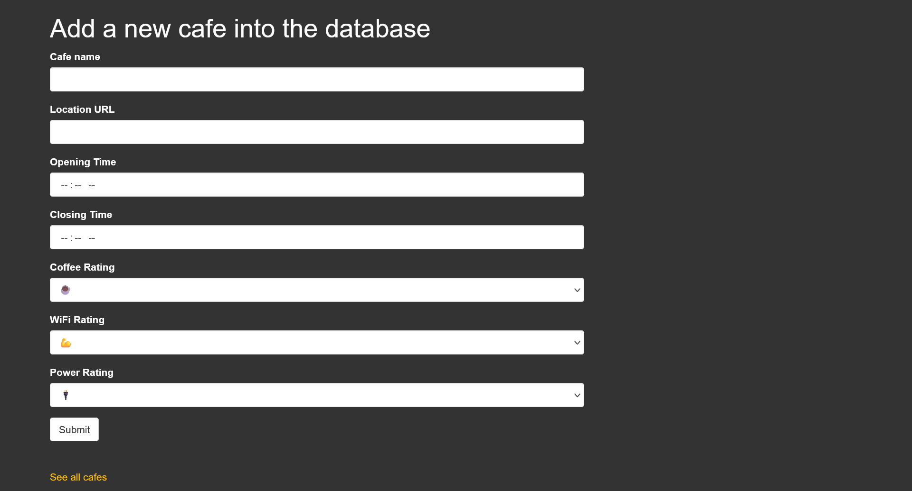
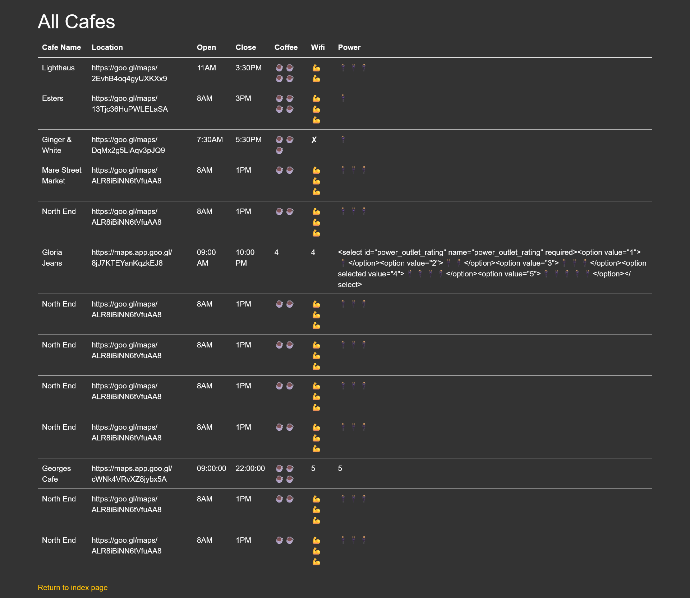

### 523 Download the Starting Project

1. Download and unzip the starting project from the lesson resources (Starting Files - coffee-and-wifi.zip).

2. Open the project in PyCharm and make sure that all required packages are installed.



### 524 Look at the Desired Final Product



So we need - 

1. A landing page
2. A form
3. A data display page

These pages are already there in the templates folder.

Let's run it.

```python
@app.route("/")
def home():
    return render_template("index.html")
```



So, we have the landing page. Let's link the form page with the button.

```html
<!--using url_for method-->
<a class="btn btn-warning btn-lg" href="{{ url_for('cafes') }}" role="button">Show Me!</a>
```

#### 1. Add the other fields in the form.

```python
class CafeForm(FlaskForm):
    cafe = StringField(label='Cafe name', validators=[DataRequired()])
    url = StringField(label='Location URL', validators=[DataRequired('Provide Location URL'),
                                                        URL(message='Please enter a map location')])
    open_time = TimeField(label='Opening Time', validators=[DataRequired()])
    closing_time = TimeField(label='Closing Time', validators=[DataRequired()])
    coffee_rating = SelectField(label='Coffee Rating',
                                choices=[
                                    ('1', '☕️'),
                                    ('2', '☕️☕️'),
                                    ('3', '☕️☕️☕️'),
                                    ('4', '☕️☕️☕️☕️'),
                                    ('5', '☕️☕️☕️☕️☕️')
                                ], validators=[DataRequired()])
    wifi_rating = SelectField(label='WiFi Rating',
                                choices=[
                                    ('1', '💪'),
                                    ('2', '💪💪'),
                                    ('3', '💪💪💪'),
                                    ('4', '💪💪💪💪'),
                                    ('5', '💪💪💪💪💪')
                                ], validators=[DataRequired()])
    power_outlet_rating = SelectField(label='Power Rating',
                                choices=[
                                    ('1', '🔌'),
                                    ('2', '🔌🔌'),
                                    ('3', '🔌🔌🔌'),
                                    ('4', '🔌🔌🔌🔌'),
                                    ('5', '🔌🔌🔌🔌🔌')
                                ],validators=[DataRequired()])
    submit = SubmitField('Submit')

```

#### 2. Link the form with the index and the cafes page.

Index Page - 
```html


Coffee and Wifi


<div class="jumbotron text-center">
    <div class="container">
  <h1 class="display-4">☕️ Coffee & Wifi 💻</h1>
  <p class="lead">Want to work in a cafe but need power and wifi?</p>
  <hr class="my-4">
  <p>You've found the right place! Checkout my collection of cafes with data on power socket availability, wifi speed and coffee quality.</p>
  <!--this is where the links are made-->
  <a class="btn btn-warning btn-lg" href="{{ url_for('cafes') }}" role="button">Show Me!</a>
  <a class="btn btn-warning btn-lg" href="{{ url_for('add_cafe') }}" role="button">Add a cafe!</a>
</div>
    </div>


```

Add Page - 

```html
<div class="col-sm-12 col-md-8">

  <h1>Add a new cafe into the database</h1>

  <!-- This is where your WTForm will go -->
  <form method="post" action="{{ url_for('add_cafe') }}" novalidate>
  <!--this means that the form data gets sent to the url "add_cafe", for now-->
    {{ form.csrf_token }}
    {{ wtf.quick_form(form, novalidate=True) }}
  </form>
  <p class="space-above"><a href="{{ url_for('cafes') }}">See all cafes</a></p>

</div>
```

In Flask, the add_cafe() method gets the data and prints them - 

```python
@app.route('/add', methods=['GET', 'POST'])
def add_cafe():
    form = CafeForm()
    if form.validate_on_submit():
        print("True")
        print(form.url.data)
    # Exercise:
    # Make the form write a new row into cafe-data.csv
    # with   if form.validate_on_submit()
    return render_template(template_name_or_list='add.html', form=form)
```


#### 3. Functionality of the form, so that data provided gets populated in the csv file.

i. capture all the data collected in form in variables = 

```python
if form.validate_on_submit():
    cafe_name = form.cafe.data
    location = form.url.data
    open = form.open_time.data
    close = form.closing_time.data
    coffee = form.coffee_rating.data
    wifi = form.wifi_rating.data
    power = form.power_outlet_rating
```

ii. insert the data into the csv - 

**_How to write to a csv_**

```python
import csv
import os
print(os.getcwd())
with open('./coffee-and-wifi/cafe-data.csv', mode='r', encoding='UTF-8') as csv_file:
    csv_view = csv.reader(csv_file, delimiter=',')
    for line in csv_view:
        print(line)
```

```text
D:\Code\Notes_Projects\Notes - 100 Days of Code\62 Day 62 - Advanced - Flask, WTForms, Bootstrap and CSV - Coffee & Wifi Project
['Cafe Name', 'Location', 'Open', 'Close', 'Coffee', 'Wifi', 'Power']
['Lighthaus', 'https://goo.gl/maps/2EvhB4oq4gyUXKXx9', '11AM', ' 3:30PM', '☕☕☕☕️', '💪💪', '🔌🔌🔌']
['Esters', 'https://goo.gl/maps/13Tjc36HuPWLELaSA', '8AM', '3PM', '☕☕☕☕', '💪💪💪', '🔌']
['Ginger & White', 'https://goo.gl/maps/DqMx2g5LiAqv3pJQ9', '7:30AM', '5:30PM', '☕☕☕', '✘', '🔌']
['Mare Street Market', 'https://goo.gl/maps/ALR8iBiNN6tVfuAA8', '8AM', '1PM', '☕☕', '💪💪💪', '🔌🔌🔌']
```

Now let's add a new row, we do this not by 'writing' but by 'appending' - 

```python
with open('./coffee-and-wifi/cafe-data.csv', mode='a', encoding='UTF-8') as csv_file:
    csv_edit = csv.writer(csv_file, delimiter=',')
    line = ["North End", 'https://goo.gl/maps/ALR8iBiNN6tVfuAA8', '8AM', '1PM', '☕☕', '💪💪💪', '🔌🔌🔌']
    csv_edit.writerow(line)
with open('./coffee-and-wifi/cafe-data.csv', mode='r', encoding='UTF-8') as csv_file:
    csv_view = csv.reader(csv_file, delimiter=',')
    for line in csv_view:
        print(line)
```

```text
['Cafe Name', 'Location', 'Open', 'Close', 'Coffee', 'Wifi', 'Power']
['Lighthaus', 'https://goo.gl/maps/2EvhB4oq4gyUXKXx9', '11AM', ' 3:30PM', '☕☕☕☕️', '💪💪', '🔌🔌🔌']
['Esters', 'https://goo.gl/maps/13Tjc36HuPWLELaSA', '8AM', '3PM', '☕☕☕☕', '💪💪💪', '🔌']
['Ginger & White', 'https://goo.gl/maps/DqMx2g5LiAqv3pJQ9', '7:30AM', '5:30PM', '☕☕☕', '✘', '🔌']
['Mare Street Market', 'https://goo.gl/maps/ALR8iBiNN6tVfuAA8', '8AM', '1PM', '☕☕', '💪💪💪', '🔌🔌🔌']
['North End', 'https://goo.gl/maps/ALR8iBiNN6tVfuAA8', '8AM', '1PM', '☕☕', '💪💪💪', '🔌🔌🔌']
```

Doing this same thing with our code - 

```python
@app.route('/add', methods=['GET', 'POST'])
def add_cafe():
    form = CafeForm()
    if form.validate_on_submit():
        cafe_name = form.cafe.data
        location = form.url.data
        open_time = form.open_time.data
        close_time = form.closing_time.data
        coffee = form.coffee_rating.data
        wifi = form.wifi_rating.data
        power = form.power_outlet_rating
        with open('cafe-data.csv', mode='a', encoding='UTF-8') as csv_file:
            csv_edit = csv.writer(csv_file, delimiter=',')
            new_data = [cafe_name, location, open_time, close_time, coffee, wifi, power]
            csv_edit.writerow(new_data)
```

In the csv - 

```text
Cafe Name,Location,Open,Close,Coffee,Wifi,Power
Lighthaus,https://goo.gl/maps/2EvhB4oq4gyUXKXx9,11AM, 3:30PM,☕☕☕☕️,💪💪,🔌🔌🔌
Esters,https://goo.gl/maps/13Tjc36HuPWLELaSA,8AM,3PM,☕☕☕☕,💪💪💪,🔌
Ginger & White,https://goo.gl/maps/DqMx2g5LiAqv3pJQ9,7:30AM,5:30PM,☕☕☕,✘,🔌
Mare Street Market,https://goo.gl/maps/ALR8iBiNN6tVfuAA8,8AM,1PM,☕☕,💪💪💪,🔌🔌🔌
North End,https://goo.gl/maps/ALR8iBiNN6tVfuAA8,8AM,1PM,☕☕,💪💪💪,🔌🔌🔌


Gloria Jeans,https://maps.app.goo.gl/8jJ7KTEYanKqzkEJ8,09:00 AM,10:00 PM,4,4,"<select id=""power_outlet_rating"" name=""power_outlet_rating"" required><option value=""1"">🔌</option><option value=""2"">🔌🔌</option><option value=""3"">🔌🔌🔌</option><option selected value=""4"">🔌🔌🔌🔌</option><option value=""5"">🔌🔌🔌🔌🔌</option></select>"

```

**Issue - Additional Newline**

[This Stack Overflow thread](https://stackoverflow.com/questions/3348460/csv-file-written-with-python-has-blank-lines-between-each-row) explains this.

>The csv.writer module directly controls line endings and writes \r\n into the file directly. In Python 3 the file must be opened in untranslated text mode with the parameters 'w', newline='' (empty string) or it will write \r\r\n on Windows, where the default text mode will translate each \n into \r\n.

**Issue - The power outlet rating is just the SelectField object.**

The problem was here - 

```python
if form.validate_on_submit():
        power = form.power_outlet_rating
```

It should be - 

```python
if form.validate_on_submit():
        power = form.power_outlet_rating.data
```

**Issue - How to get value (not key) data from SelectField in WTForms?**

See [this Stack Overflow thread](https://stackoverflow.com/questions/43071278/how-to-get-value-not-key-data-from-selectfield-in-wtforms)

We have to convert the choices set in the SelectField into a dict - 

```python
if form.validate_on_submit():
    coffee = dict(form.coffee_rating.choices).get(form.coffee_rating.data)
    wifi = dict(form.wifi_rating.choices).get(form.wifi_rating.data)
    power = dict(form.power_outlet_rating.choices).get(form.power_outlet_rating.data)
```

Putting this all together - 

```python
@app.route('/add', methods=['GET', 'POST'])
def add_cafe():
    form = CafeForm()
    if form.validate_on_submit():
        cafe_name = form.cafe.data
        location = form.url.data
        open_time = form.open_time.data
        close_time = form.closing_time.data
        coffee = dict(form.coffee_rating.choices).get(form.coffee_rating.data)
        wifi = dict(form.wifi_rating.choices).get(form.wifi_rating.data)
        power = dict(form.power_outlet_rating.choices).get(form.power_outlet_rating.data)
        with open('cafe-data.csv', mode='a', encoding='UTF-8', newline='') as csv_file:
            csv_edit = csv.writer(csv_file, delimiter=',')
            new_data = [cafe_name, location, open_time, close_time, coffee, wifi, power]
            csv_edit.writerow(new_data)
```

#### 4. In the cafes page, make it so that all the cafes mentioned in the csv file gets rendered.

a. Add the styling of the styles.css files to the index page

[This Stack Overflow thread](https://stackoverflow.com/questions/34664156/flask-bootstrap-custom-theme) tells you how to do it.

It also has a link to the official doc.

```html



{{super()}}
  <link rel="stylesheet" href="{{url_for('.static', filename='styles.css')}}">


Coffee and Wifi


<div class="jumbotron text-center">
    <div class="container">
  <h1 class="display-4">☕️ Coffee & Wifi 💻</h1>
  <p class="lead">Want to work in a cafe but need power and wifi?</p>
  <hr class="my-4">
  <p>You've found the right place! Checkout my collection of cafes with data on power socket availability, wifi speed and coffee quality.</p>
  <a class="btn btn-warning btn-lg" href="{{ url_for('cafes') }}" role="button">Show Me!</a>
  <a class="btn btn-warning btn-lg" href="{{ url_for('add_cafe') }}" role="button">Add a cafe!</a>
</div>
    </div>


```

b. Add the same styling to the /add page as well.

```html




{{super()}}
  <link rel="stylesheet" href="{{url_for('.static', filename='styles.css')}}">


Add A New Cafe


<div class="container">
  <div class="row">
    <div class="col-sm-12 col-md-8">

      <h1>Add a new cafe into the database</h1>

      <!-- This is where your WTForm will go -->
      <form method="post" action="{{ url_for('add_cafe') }}" novalidate>
        {{ form.csrf_token }}
        {{ wtf.quick_form(form, novalidate=True) }}
      </form>
	  <p class="space-above"><a href="{{ url_for('cafes') }}">See all cafes</a></p>

    </div>
  </div>
</div>


```

c. Make a table on the cafes page

i. Get the boilerplate code from bootstrap doc

This is the boilerplate code - 

```html
<table class="table">
  <thead>
    <tr>
      <th scope="col">#</th>
      <th scope="col">First</th>
      <th scope="col">Last</th>
      <th scope="col">Handle</th>
    </tr>
  </thead>
  <tbody>
    <tr>
      <th scope="row">1</th>
      <td>Mark</td>
      <td>Otto</td>
      <td>@mdo</td>
    </tr>
    <tr>
      <th scope="row">2</th>
      <td>Jacob</td>
      <td>Thornton</td>
      <td>@fat</td>
    </tr>
    <tr>
      <th scope="row">3</th>
      <td colspan="2">Larry the Bird</td>
      <td>@twitter</td>
    </tr>
  </tbody>
</table>
```

ii. Identify the repetitions, customize it to your own data

We can see that the table head, th, gets repeated, to generate the headers.

In the flask app - 

```python
@app.route('/cafes')
def cafes():
    with open('cafe-data.csv', newline='', encoding='UTF-8') as csv_file:
        csv_data = csv.reader(csv_file, delimiter=',')
        list_of_rows = []
        for row in csv_data:
            list_of_rows.append(row)
    return render_template('cafes.html', cafes=list_of_rows)
```

We also know that our table headers, is the list at index 0 of cafes data.

Therefore, we can replace the boilerplate code like so - 

```html
<thead>
    <tr>
      
        <th scope="col">{{ header_item }}</th>
      
    </tr>
</thead>
```

Similarly we can see that the table body has repetitions - 

```html
<tr>
  <th scope="row">1</th>
  <td>Mark</td>
  <td>Otto</td>
  <td>@mdo</td>
</tr>
```

For every row, the tr element gets repeated, and for every detail inside the row, the td element gets repeated.

Based on that, we can replace our code to - 

```html
<tbody>
    
    <tr>
      
        <td>{{ detail }}</td>
      
    </tr>
    
</tbody>
```

Finally, we will add the same styling to this page too - 

```html



{{super()}}
  <link rel="stylesheet" href="{{url_for('.static', filename='styles.css')}}">


Restaurants
```








##### Take a final look at main.py, index.html, add.html, cafe-data.csv and cafes.html to get the full idea.


**_fin_**
