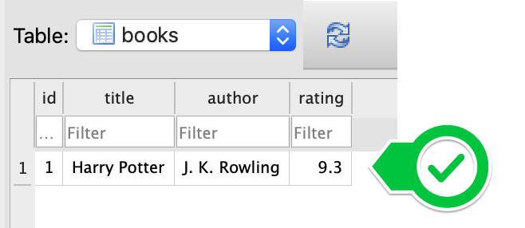

### 526 Day 63 Goals_ Creating a Virtual Bookshelf

Have you ever wanted to keep track of the books you have read and give each book a rating?

This is not a new concept and there are plenty of companies that have built something for exactly this purpose.

e.g. https://www.librarything.com/

But in order to do this, we will need to learn how to use a database. By the end of today, you will have learnt how to create an SQLite database and how to create, read, update and delete data in the database.

We'll also be hooking up our database with a Flask application to serve data whenever needed.


### 527 Download the Starting Project

### 528 Make the Website Work

**CHALLENGE 1**

```text
When you head over to http://locahost:5000 (or whatever shows up as your URL when you run main.py), you should have a <h1> that says My Library and link <a> to Add New Book.
```

Pretty simple, ain't?

```python
@app.route('/')
def home():
    return render_template('index.html')
```

```html
<head>
    <meta charset="UTF-8">
    <title>Library</title>
</head>
<body>
<h1>My Library</h1>
    <ul>
        <li></li>
    </ul>
    
<a href="{{ url_for('add') }}">Add New Book</a>
</body>
```

**CHALLENGE 2**

```text
When you head over to the /add path, e.g. http://locahost:5000/add you should see a form like the one below:
```


Again, simple enough.

```python
@app.route("/add")
def add():
    return render_template('add.html')
```

```html
<head>
    <meta charset="UTF-8">
    <title>Add Book</title>
</head>
<body>
    <form action="" method="POST">
        <label>Book Name</label>
        <input type="text">
        <label>Book Author</label>
        <input type="text">
        <label>Rating</label>
        <input type="text">
        <button type="submit">Add Book</button>
    </form>
</body>
```

**CHALLENGE 3**

```text
Make the form on the /add path work so that when you click "Add Book" the book details gets added as a dictionary to the list called all_books in main.py.
```

1. Capture the data in the form
2. Make a dict
3. Store the dict in the list all_books

```html
<body>
    <form action="{{ url_for('add') }}" method="post">
        <label>Book Name</label>
        <input type="text" name="fname">
        <label>Book Author</label>
        <input type="text" name= 'fauthor'>
        <label>Rating</label>
        <input type="text" name="frating">
        <button type="submit">Add Book</button>
    </form>
</body>
```
```python
@app.route("/add", methods=['GET', 'POST'])
def add():
    if request.method == 'POST':
        book_dict = {
            'book_name': request.form['fname'],
            'author_name': request.form['fauthor'],
            'book_rating': request.form['frating']
        }
        all_books.append(book_dict)
    print(all_books)
    return render_template('add.html')
```

**CHALLENGE 4**

```text
Make the home page show each of the books in all_books as a list item <li> in an unordered list <ul> e.g.
```

```html
<ul>
    
        <li>{{ item['book_name'] }} - {{ item['author_name'] }} - {{ item['book_rating'] }}</li>
    
</ul>
```

**CHALLENGE 5**

```text
Make the home page show <p>Library is empty.</p> if there are no books. Also, make sure the "Add New Book" link works and takes the user to the /add page.

Hint: If there are no books then all_books = []
```

```html
<body>
<h1>My Library</h1>

    <ul>
        
            <li>{{ item['book_name'] }} - {{ item['author_name'] }} - {{ item['book_rating'] }}</li>
        
    </ul>

    <p>Your Library is empty</p>


<a href="{{ url_for('add') }}">Add New Book</a>
</body>
```

### 529 What Happens When You Refresh the Server_

Let's run the server.


Let's add some books.


Now let's get back to the home page.


Now let's refresh the server.


Database gets a reset everytime we rerun the server.

We need to store the data somewhere.

### 530 SQLite Databases

First, let's create a database. 
The most used database in the world is SQLite. 
It's so popular that it's included by default in all Python installations, so if you're creating a Python project, you've already got it installed. 
We're going to create an SQLite database to store our book data.

1. Create a new project and inside the main.py file import the sqlite3 module.

```python
import sqlite3
```

2. Now create a connection to a new database (if the database does not exist then it will be created).

```python
db = sqlite3.connect("books-collection.db")
```

3. Run main.py and you should see a new file appear in PyCharm called books-collection.db

> NOTE: Don't try to open the .db file in PyCharm, it won't work, I'll show you how to download the software to open these files a little later.

4. Next we need to create a cursor which will control our database.

```python
cursor = db.cursor()
```
So a cursor is also known as the mouse or pointer. 
If we were working in Excel or Google Sheet, we would be using the cursor to add rows of data or edit/delete data, we also need a cursor to modify our SQLite database.

**Creating Tables in our Database**

Coming back to the Excel analogy, a single Excel file can contain many tables (sheets), each tab is a different table.

Similarly, our database can contain many tables.

5. Let's create one. Add this code below all the previous lines.

```python
cursor.execute("CREATE TABLE books (id INTEGER PRIMARY KEY, title varchar(250) NOT NULL UNIQUE, author varchar(250) NOT NULL, rating FLOAT NOT NULL)")
```
Let's break this down.

> cursor - We created this in step 4 and this is the mouse pointer in our database that is going to do all the work.

> .execute() - This method will tell the cursor to execute an action. All actions in SQLite databases are expressed as SQL (Structured Query Language) commands. These are almost like English sentences with keywords written in ALL-CAPS. There are quite a few SQL commands. But don't worry, you don't have to memorise them.

> CREATE TABLE -  This will create a new table in the database. The name of the table comes after this keyword.

Docs: https://www.w3schools.com/sql/sql_ref_create_table.asp

> books -  This is the name that we've given the new table we're creating.

> () -  The parts that come inside the parenthesis after CREATE TABLE books ( ) are going to be the fields in this table. Or you can imagine it as the Column headings in an Excel sheet.

> id INTEGER PRIMARY KEY -  This is the first field, it's a field called "id" which is of data type INTEGER and it will be the PRIMARY KEY for this table. The primary key is the one piece of data that will uniquely identify this record in the table. e.g. The primary key of humans might be their passport number because no two people in the same country has the same passport number.

> title varchar(250) NOT NULL UNIQUE -  This is the second field, it's called "title" and it accepts a variable-length string composed of characters. The 250 in brackets is the maximum length of the text. NOT NULL means it must have a value and cannot be left empty. UNIQUE means no two records in this table can have the same title.

> author varchar(250) NOT NULL -  A field that accepts variable-length Strings up to 250 characters called author that cannot be left empty.

> rating FLOAT NOT NULL -  A field that accepts FLOAT data type numbers, cannot be empty and the field is called rating.

6. Run the code from step 5 and there will be no noticeable changes. 
In order to view our database we need to download some specialised software.

Head over to the link below and download DB Browser for your operating system. (If you are on Windows go for the Standard Installer).

https://sqlitebrowser.org/dl/

7. Once you've downloaded and installed DB Browser, open it and click on "Open Database".


8. Navigate to your project location (it should in a folder called PyCharm Projects) and open the books-collection.db


Now you should see a table called books that contains 4 fields:


This is our database.

9. To add data to our table we can head back to main.py and write the following code:

```python
cursor.execute("INSERT INTO books VALUES(1, 'Harry Potter', 'J. K. Rowling', '9.3')")
db.commit()
```

This will create a new entry in our books table for the Harry Potter book and commit the changes to our database.

10. Now comment out the previous line of code where you are created the table called books. Otherwise, you'll get sqlite3.OperationalError: table books already exists.

11. Then close down the database in DB Browser by clicking Close Database. Otherwise, you'll get a warning about database locked when you work with the database in PyCharm.


12. Now run the code in main.py and re-open the database in DB Browser to see the updated books table. it should look like this:



SQL queries are very sensitive to typos. If instead of writing:

```python
cursor.execute("INSERT INTO books VALUES(1, 'Harry Potter', 'J. K. Rowling', '9.3')")
db.commit()
```

You wrote:

```python
cursor.execute("INSERT INTO books VALUE(1, 'Harry Potter', 'J. K. Rowling', '9.3')")
db.commit()
```

Then it won't work at all (can you even spot the difference in the code?)

Luckily, there are much better ways of working with SQLite in Python projects, we can use a tool called SQLAlchemy to write Python code instead of all these error-prone SQL commands. That's what we'll do next.


### 531 SQLAlchemy

As you've seen, writing SQL commands are complicated and error-prone. 
It would be much better if we could just write Python code and get the compiler to help us spot typos and errors in our code. 
That's why SQLAlchemy was created.

SQLAlchemy is defined as an ORM Object Relational Mapping library.
Tables can be defined as separate Classes and each row of data is a new Object.
Fields become Object properties. 

> CHALLENGE: Use the SQLAlchemy documentation to figure out how to do everything we did in the commented out code but this time using SQLAlchemy.

1. Create an SQLite database called new-books-collection.db

```python
from flask import Flask
from flask_sqlalchemy import SQLAlchemy


# create the app
app = Flask(__name__)
# configure the SQLite database, relative to the app instance folder
app.config["SQLALCHEMY_DATABASE_URI"] = "sqlite:///new-books-collection.db"

# create an instance of SQLAlchemy
db = SQLAlchemy(app)
```

2. Create a table in this database called books_read.

3. The books table should contain 4 fields: id, title, author and rating. 
_The fields should have the same limitations as before e.g. INTEGER/FLOAT/VARCHAR/UNIQUE/NOT NULL etc._


```python
# define the class table
class books_read(db.Model):
   id = db.Column(db.Integer, primary_key = True)
   # primary_key=True means the value will be unique
   title = db.Column(db.String(100), unique=True, nullable=False)
   # db.String(20) means the max length of the string will be 20 characters.
   # The primary key will not accept NULL values whereas the Unique key can accept NULL values.
   # A table can have only one primary key whereas there can be multiple unique keys on a table.
   author = db.Column(db.String(50), nullable=False)
   review = db.Column(db.Float(3))
```

4. Create a new entry in the books table that consists of the following data:
```text
id: 1

title: "Harry Potter"

author: "J. K. Rowling"

review: 9.3
```

```python
# launch the app
with app.app_context():
    # create the columns
    db.create_all()
    # set up an instance of the books_read class
    harry_potter = books_read(title='Harry Potter', author='J. K. Rowling', review=4.5)
    # add the book
    db.session.add(harry_potter)
    # commit the changes into the database, you can add a number of books before committing
    db.session.commit()
```

### 532 CRUD Operations with SQLAlchemy

Here's a summary of some of the things we did

**Create a New Database**
```python
from flask import Flask
from flask_sqlalchemy import SQLAlchemy
app = Flask(__name__)
app.config['SQLALCHEMY_DATABASE_URI'] = "sqlite:///<name of database>.db"
db = SQLAlchemy(app)
```

**Create a New Table**
```python
class Book(db.Model):
    id = db.Column(db.Integer, primary_key=True)
    title = db.Column(db.String(250), unique=True, nullable=False)
    author = db.Column(db.String(250), nullable=False)
    rating = db.Column(db.Float, nullable=False
db.create_all()
```

In addition to these things, the most crucial thing to figure out when working with any new database technology is how to CRUD data records.

```text
Create

Read

Update

Delete
```

**_Create_** A New Record

```python
new_book = Book(id=1, title="Harry Potter", author="J. K. Rowling", rating=9.3)
db.session.add(new_book)
db.session.commit()
```
```text
NOTE: When creating new records, the primary key fields is optional. you can also write:

new_book = Book(title="Harry Potter", author="J. K. Rowling", rating=9.3)

the id field will be auto-generated.
```

**_Read_** All Records

```python
all_books = session.query(Book).all()
```

**_Read_** A Particular Record By Query

```python
book = Book.query.filter_by(title="Harry Potter").first()
```

**_Update_** A Particular Record By Query

```python
book_to_update = Book.query.filter_by(title="Harry Potter").first()
book_to_update.title = "Harry Potter and the Chamber of Secrets"
db.session.commit()
```

**_Update_** A Record By PRIMARY KEY

```python
book_id = 1
book_to_update = Book.query.get(book_id)
book_to_update.title = "Harry Potter and the Goblet of Fire"
db.session.commit() 
```

**_Delete_** A Particular Record By PRIMARY KEY

```python
book_id = 1
book_to_delete = Book.query.get(book_id)
db.session.delete(book_to_delete)
db.session.commit()
```

> You can also delete by querying for a particular value e.g. by title or one of the other properties.


### 533 Build a SQLite Database into the Flask Website

Task - add new books via the /add route, once a book is successfully added to the database, it should redirect to the home page.


1. When new book is added, it should go to the sqlite database, instead of append to the list

```python
from flask import Flask, render_template, request, redirect, url_for
from flask_sqlalchemy import SQLAlchemy


class books_read(db.Model):
   id = db.Column(db.Integer, primary_key = True)
   title = db.Column(db.String(100), unique=True, nullable=False)
   author = db.Column(db.String(50), nullable=False)
   review = db.Column(db.Float(3))

with app.app_context():
    db.create_all()

@app.route("/add", methods=['GET', 'POST'])
def add():
    if request.method == 'POST':
        book_name = request.form['fname'],
        author_name = request.form['fauthor'],
        book_rating = request.form['frating']
        with app.app_context():
            new_book = books_read(title=book_name[0], author=author_name[0], review=book_rating[0])
            # using index 0 because the form stores the every input as a single element tuple
            db.session.add(new_book)
            db.session.commit()
    return render_template('add.html')
```

2. When you click 'Add Book', it should go to the home page with all the books listed.

**How to print the data in the sqlite database?**

```python
with app.app_context():
    all_books = db.session.query(books_read).all()
    for book in all_books:
        print(book.title, book.author, book.review)
```
```text
Harry Potter J. K. Rowling 4.5
Harry Potter 2 J. K. Rowling 4.5
Harry Potter 3 J. K. Rowling 4.5

Process finished with exit code 0
```

Therefore - 

Define a function to fetch books:

```python
def get_all_books():
    with app.app_context():
        books = db.session.query(books_read).all()
        return books
```

Modify the home route:

```python
@app.route('/')
def home():
    all_books = get_all_books()
    return render_template(template_name_or_list='index.html', book_data=all_books)
```

> all_books contains a list of book objects - 
> [<books_read 1>, <books_read 2>, <books_read 3>, <books_read 4>, <books_read 5>]
> for each object, you can find the details by iterating

Update the index.html template:

```html
<h1>My Library</h1>

    <ul>
        
            <li>{{ item.title }} - {{ item.author }} - {{ item.review }}</li>
        
    </ul>

    <p>Your Library is empty</p>

```

> Add an Edit Rating Anchor Tag to each book (i.e. li). 
> When the button is pressed, it should take the user to an Edit Rating page where you can enter a new rating for that book. 
> Then when you click "Change Rating" it should take you back to the home page and the new rating should be displayed next to the book.

> 1. Add the edit rating anchor in the homepage
> 2. The anchor should redirect to the edit page, it should be a simple page with only one form input.
> 3. The form input should be collected and the previous rating updated

**Edit rating anchor in homepage, send the item.id as a variable during redirection -** 
In the index.html
```html
<ul>
    
        <li>{{ item.title }} - {{ item.author }} - {{ item.review }} <a href="{{ url_for('edit', book_id=item.id) }}">Edit</a> </li>
    
</ul>
```

**Redirection to the edit page =** 

First, create the Flask route, and using the id variable, send the relevant variables to edit.html - 

```python
@app.route("/edit/id:<int:book_id>")
def edit(book_id):
    with app.app_context():
        book_to_edit = books_read.query.get(book_id)
        name_of_book_to_edit = book_to_edit.title
        rating_of_book_to_edit = book_to_edit.review
    return render_template('edit.html',
                           nameofthebook=name_of_book_to_edit,
                           ratingofthebook=rating_of_book_to_edit,
                           idofthebook=book_id)
```

Second, create the edit.html, using the variable -
In the edit.html - 
```html
<body>
    <h4>Book: {{ nameofthebook }}</h4>
    <h5>Current Rating: {{ ratingofthebook }}</h5>
    <form action="{{ url_for('edit', book_id=idofthebook) }}" method="post">
        <label>New Rating</label>
        <input type="text" name="newfrating">
        <button type="submit">Update Rating</button>
    </form>
</body>
```

**Redirection to the home page, once a new book is added**

Just add a 'return redirect' in the /add route, when the submit button is clicked.

In the main.py -

```python
@app.route("/add", methods=['GET', 'POST'])
def add():
    if request.method == 'POST':
        book_name = request.form['fname'],
        author_name = request.form['fauthor'],
        book_rating = request.form['frating']
        # update the database
        with app.app_context():
            new_book = books_read(title=book_name[0], author=author_name[0], review=book_rating[0])
            db.session.add(new_book)
            db.session.commit()
        # go to the homepage
        return redirect(url_for('home'))
    return render_template('add.html')
```
The index.html takes the updated data and shows all books - 

```python
@app.route('/')
def home():
    all_books = get_all_books()
    return render_template(template_name_or_list='index.html', book_data=all_books)
```
```html
<h1>My Library</h1>

    <ul>
        
            <li>{{ item.title }} - {{ item.author }} - {{ item.review }}</li>
        
    </ul>

    <p>Your Library is empty</p>

```

**Updating the Rating**

One, capture the input in the form in the edit.html

Two, update the database with the new rating

```python
@app.route("/edit/id:<int:book_id>")
def edit(book_id):
    with app.app_context():
        book_to_edit = books_read.query.get(book_id)
        name_of_book_to_edit = book_to_edit.title
        rating_of_book_to_edit = book_to_edit.review
    if request.method == 'POST':
        rating_of_book_to_edit = request.form["newfrating"]
    return render_template('edit.html',
                           nameofthebook=name_of_book_to_edit,
                           ratingofthebook=rating_of_book_to_edit,
                           idofthebook=book_id)
```

Three, redirect to the homepage once the submit button is clicked

```python
if request.method == 'POST':
    return redirect(url_for('home'))
```

Final Result:

```python
from flask import Flask, render_template, request, redirect, url_for
from flask_sqlalchemy import SQLAlchemy

app = Flask(__name__)
app.config['SECRET_KEY'] = '8BYkEfBA6O6donzWlSihBXox7C0sKR6b'
app.config["SQLALCHEMY_DATABASE_URI"] = "sqlite:///new-books-collection.db"


# create an instance of SQLAlchemy
db = SQLAlchemy(app)


# define the class table
class books_read(db.Model):
   id = db.Column(db.Integer, primary_key = True)
   title = db.Column(db.String(100), unique=True, nullable=False)
   author = db.Column(db.String(50), nullable=False)
   review = db.Column(db.Float(3))


# launch the app
with app.app_context():
    # create the columns
    db.create_all()


def get_all_books():
    with app.app_context():
        books = db.session.query(books_read).all()
        return books


@app.route('/')
def home():
    all_books = get_all_books()
    return render_template(template_name_or_list='index.html', book_data=all_books)


@app.route("/add", methods=['GET', 'POST'])
def add():
    if request.method == 'POST':
        book_name = request.form['fname'],
        author_name = request.form['fauthor'],
        book_rating = request.form['frating']
        # print(book_name[0])
        with app.app_context():
            new_book = books_read(title=book_name[0], author=author_name[0], review=book_rating[0])
            db.session.add(new_book)
            db.session.commit()
        return redirect(url_for('home'))
    return render_template('add.html')


@app.route("/edit/id:<int:book_id>", methods=['GET', 'POST'])
def edit(book_id):
    with app.app_context():
        book_to_edit = books_read.query.get(book_id)
        name_of_book_to_edit = book_to_edit.title
        rating_of_book_to_edit = book_to_edit.review
    if request.method == 'POST':
        print(request.form["newfrating"])
        with app.app_context():
            book_to_edit = books_read.query.get(book_id)
            book_to_edit.review = request.form["newfrating"]
            print(book_to_edit.review)
            db.session.commit()
        return redirect(url_for('home'))
    return render_template('edit.html',
                           nameofthebook=name_of_book_to_edit,
                           ratingofthebook=rating_of_book_to_edit,
                           idofthebook=book_id)


if __name__ == "__main__":
    app.run(debug=True)
```

index.html:

```html
<!DOCTYPE html>
<html lang="en">
<head>
    <meta charset="UTF-8">
    <title>Library</title>
</head>
<body>
<h1>My Library</h1>

    <ul>
        
            <li>{{ item.title }} - {{ item.author }} - {{ item.review }} <a href="{{ url_for('edit', book_id=item.id) }}">Edit</a> </li>
        
    </ul>

    <p>Your Library is empty</p>


<a href="{{ url_for('add') }}">Add New Book</a>
</body>
</html>
```

add.html

```html
<!DOCTYPE html>
<html lang="en">
<head>
    <meta charset="UTF-8">
    <title>Add Book</title>
</head>
<body>
    <form action="{{ url_for('add') }}" method="post">
        <label>Book Name</label>
        <input type="text" name="fname">
        <label>Book Author</label>
        <input type="text" name= 'fauthor'>
        <label>Rating</label>
        <input type="text" name="frating">
        <button type="submit">Add Book</button>
    </form>
</body>
</html>
```

```html
<!DOCTYPE html>
<html lang="en">
<head>
    <meta charset="UTF-8">
    <title>Edit Rating</title>
</head>
<body>
    <h4>Book: {{ nameofthebook }}</h4>
    <h5>Current Rating: {{ ratingofthebook }}</h5>
    <form action="{{ url_for('edit', book_id=idofthebook) }}" method="post">
        <label>New Rating</label>
        <input type="text" name="newfrating">
        <button type="submit">Update Rating</button>
    </form>
</body>
</html>
```

### fin
