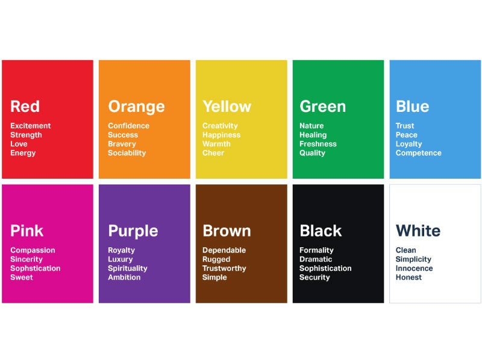
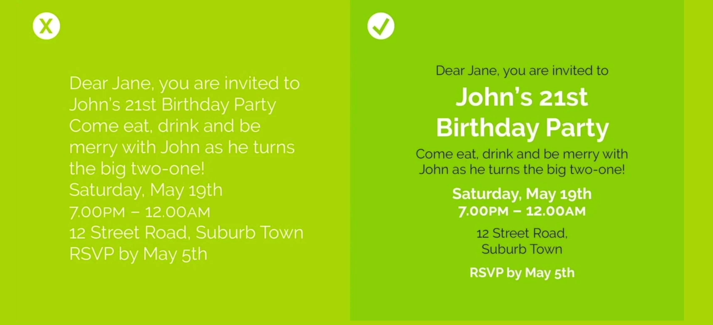
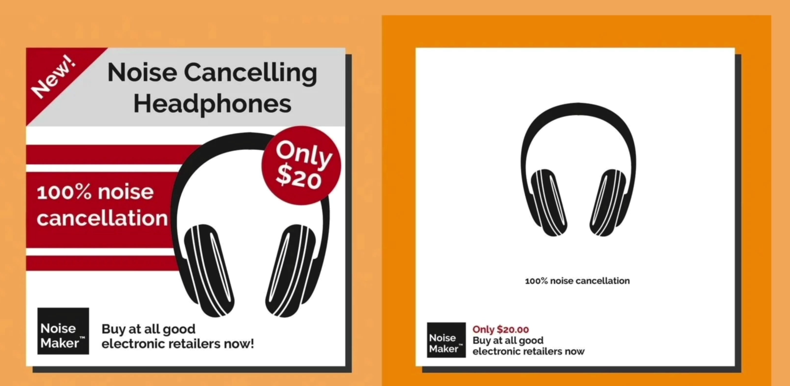
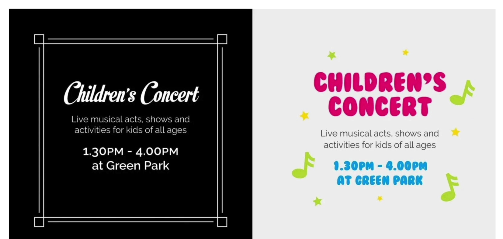
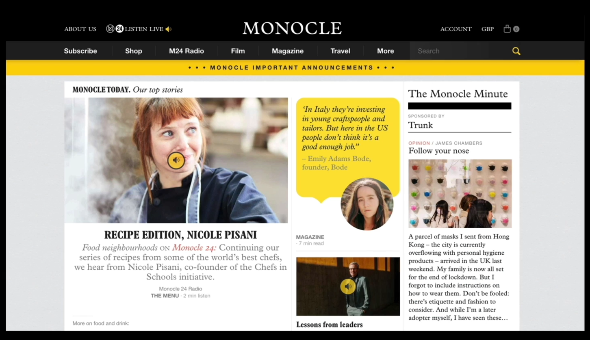
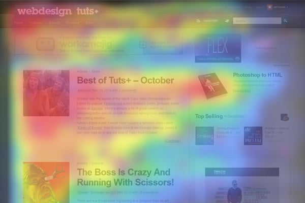
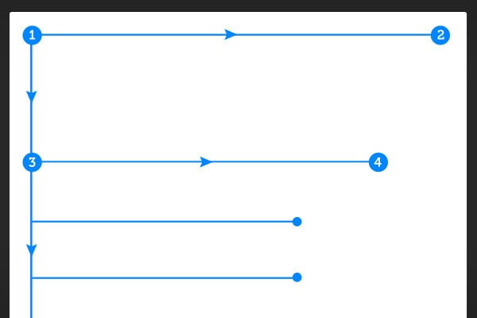
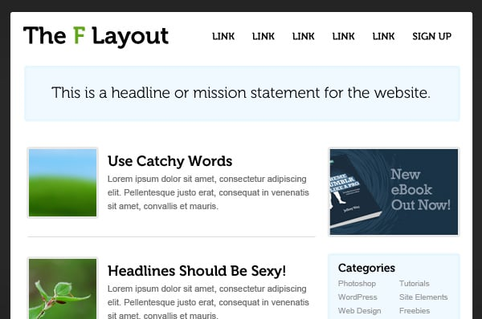
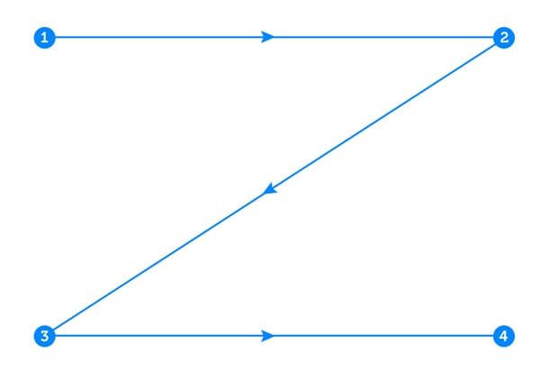
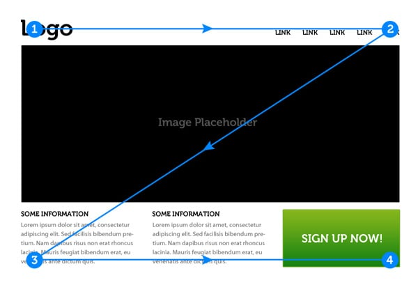

### 541 Introduction to Web Design

Up until now we only focused on websites that'd have great functionalities.

It is time to look at the design aspect as well and start making websites that'd look beautiful too.

No one ever says, 'That website had a lot of cool functionalities.'
Therefore, a good chunk of your efforts into making a website should go into designing it too.

A well-designed website can also convince the customers pay more for your product.

So we are going to go through some of the principles of web design.

1. Color Theory
2. Typography
3. User Interface Design
4. User Experience Design

These are the four pillars of good web design.

### 542 Understanding Color Theory

There are different colors that should be used based on the mood you are trying to capture.

Most of the time though, you are not going to use a singular color for your website.
You are probably going to use two or three.

Now based on the first color that you have chosen, how do you choose the second color?

**Taking the color adjoined in the color wheel.**

These two colors are called analogous colors. These two colors go together really well.
But they do not create a contrast, so that one color would pop.

So if you want contrasting colors, you'd do well to pick colors opposite to each other in the color wheel.
These are called complementary colors.

There is a website called Adobe Color that let's you pick a color and choose color palettes for you.

Another one is called [colorhunt.co](https://colorhunt.co/)

### 543 Understanding Typography and How to Choose Fonts

At this juncture I think we can all agree that fonts are important too to capture the mood and convey the emotion.

Timestamp 01:10

Almost all the fonts in the world have two distinct styles, the Serif and the Sans Serif.

**Serif**

- More authoritative, serious, traditional, respectable
- Little feet at the base of the pillar of the letter
- There are subclasses of Serif, from old style to more modern ones
  - The modern ones have prominent difference between the thickest and the thinnest part of the letter
  - The old style ones, not so much

Different fonts also have different moods and emotions.

**Sans Serif**

- Friendly, approachable, novel and contemporary
- Most preferred for body texts

Do not use multiple fonts, use, at max, two.

Pointers - 
- Use fonts that have a similar mood to each other and also a similar time era.
- Use weight differences between heading and text

### 544 Manage ATTENTION with effective User Interface (UI) Design

Now that we have talked about color theory and typography, the next thing we are gonna talk about is UI design.

Our eyes are naturally drawn to the bigger and bolder square of things.

Pointers - 
- Hierarchy
- Layout
- 6 words per line is ideal
- Match the alignments for the heading and the body text and all other components of the webpage
- Inject white in between elements and space things out for elegance

- Design for your audience

### 545 User Experience (UX) Design

So far we have gone through color theory, typography and user interface design.

Now we will explore user experience.
This is the last pillar of web design actually.

User experience is meant to be invisible.
If you are having a good experience with a website it is meant to be unobtrusive and will just let you do your thing.

Pointers - 
- Keep things simple.

Just take a look at these two news websites, which do you think is more simple and offers a better UX?

- Consistency. Always keep the functionality of your product consistent.

For example, take the xfinity website. The website has differently styled navbars for different pages.
Meaning that users would need to learn and relearn the functionalities at different pages.
Not a good user experience.

- Reading Patterns

There are some known and accepted patterns readers have while browsing a website.

F-pattern. Therefore, design everything important according to that pattern.

 

There is also the Z pattern which can be followed.

 

- All platform design

Make the design for the mobile screen too as well as for the PC creen.
There can be websites that are rendered well on the mobile but on the pc the real estate is not used efficiently.

- Test, test, test. Give it to other users and gather feedback.

- Do not use your knowledge of human psyche and design for evil things.

Some designers use the "hair on screen" trick to force the user to slide on the screen. 
Upon which it gets redirected to another website and the designer makes money off of every click.

Good design is all about helping people get what they want and have a good overall experience while they're at it.

### 546 Web Design in Practice - Let's apply what we've learnt!

There is a website called dailyui.com, which gives you a task to design for 100 days.

There is another site called collectui.com which gathers all of the submissions of dailyui.com

You can always take inspiration from collectui.com and create your own website design.

You can design a website using canva.com for a start.

