### 547 Day 66 Goals_ Build Your Own REST API Service

On day 33, we learnt about APIs and since then, we've used a number of public APIs. e.g ISS location, Trivia Questions and Twilio. 
In a lot of cases, the API allows us to tap into a particular website's data or service.

Many companies have collected valuable data e.g. Bitcoin prices, Restaurant reviews and provide an API for developers to access this data for a price. 
Depending on how valuable the data/service is behind the API, these APIs can charge anywhere from $9 to $99 per month for access. 
Some even charge per API call.

What if you have access to some information that other people might want to use? 
E.g. You collected data on all the cafes in a particular city and figured out which ones were suitable for remote-work? 
Then you could create an API and charge people to access your data.

But how do you create an API?

That's what we'll tackle in today's lessons. 
Building a full REST API from scratch using Flask.


### 548 What is REST_

In this lesson we are going to learn about how to build your own RESTful API.

REST - REpresentational State Transfer

To understand this, we are going to have to go back to the architecture pretty much all of internet is based on.


1. The client makes a request to the server.

Think of it like the system at a restaurant.
The customer(client) makes a request to the waiter(server).
The waiter(server) will check if the item is available. If it is, then the waiter will server the item(data).
However, if the item is not available, then the waiter(server) lets the customer(client) know (error 404).

Now when this request is made to the server, on the internet this is done via an HTTP request.
And the analogy for this is it's kind of like the language that you're using to make the request.

The server would be able to understand your request and give you back the correct result.

Now, the thing you have to remember is that HTTP, this hypertext transfer protocol, 
is not the only language that servers can speak, right?

Another one that you might have heard of is, for example, the FTP request, which is the file transfer protocol request.

So if you use the wrong language, you might not get back the result that you're looking for.

So, for example, if a server speaks French in France and you try to speak to him in Italian, that probably won't work.
So we have to make sure we've got the right language for making our request.

Now, at this point, some students might say, well, what about that other thing that HTTPs request?

What does that s stand for, and is it a different language?

Well, HTTPs stands for HTTP secure request.

So remember that all your requests and responses are going across the Internet and can be potentially
tapped in by lots of people.

So if you wanted to make it secure so you don't want to be on a website entering your card details and 
it's just going through, you know, a bog-standard HTTP request because somebody might hijack that
along the way and that's not very secure.

Now, this is kind of equivalent to having like a secret code language.

If everything is alright, then the server should serve up the request.

The server does this in a number of ways - 
- It might do some computation, run some code to generate the data.
- It might contact a database, in order to get the data.
- It can do both of those things.

The server does all this with the help of an API.

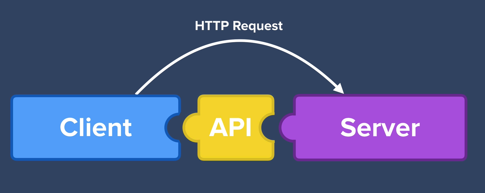

The API is kind of like a menu at the restaurant. The restaurant will not serve anything that is not on the menu.
Similarly the API delineates the services/data/actions the API will fetch from the server.

Just like a restaurant can have different menus, like one for starters, one for drinks etc., a server can have multiple APIs too.


What does it mean for an API to be RESTful?

Well it is basically an architectural style. Just like buildings have different architectural styles so does APIs.

There are other architectural styles other than REST, like SOAP, GraphQL, FALCOR etc.
REST is like the gold standard style of APIs.

And REST actually came about really quite recently as a part of Roy Fielding's Ph.D.
And as a part of his doctorate, he researched and came up with this architectural style that we now call REST.

And it proposes a set of rules that web developers could follow when they're building their APIs.
And he came up with this idea that all websites across the web would use the same structure for building their APIs.

If every Web API was built using the same common guiding principles, then it would be so easy for everybody to work together and be able to use different APIs quickly, easily, and efficiently.

So how exactly do we make our API RESTful?

Well, there's a lot of rules that an API has to follow to be RESTful.

But the two most important ones are -
- using the HTTP request verbs, 
- to use a specific pattern of routes and endpoint URLs.

So first, what exactly are the HTTP verbs?
Well, you've already seen some of them.

First is GET, then is POST, PUT, and PATCH. PATCH came relatively recently in 2010 and it was added to the HTTP request language essentially very recently.
But it's kind of a neat twist on how we update data and we're going to look at that in a little bit as well.

And finally, you've got DELETE.

And you might realize that they have a lot of similarities to something that we covered previously in the database
module, which is when we looked into CRUD, right? Create, read, update and delete.

So now that we've looked at the HTTP request verbs and we can see how they're used, the next thing
to talk about is the specific pattern of routes and endpoints that you have to use in order to make
your API RESTful.

In our server we can specify specific routes or URL's in order to access certain resources.
So you might have, you know, www.google.com/elephants, then that would bring up all
of the elephants and /camels would be for the camels and hippos.

So these are routes and we've already used routes before in our server code.

So, for example, if our API was the Wikipedia API, right?

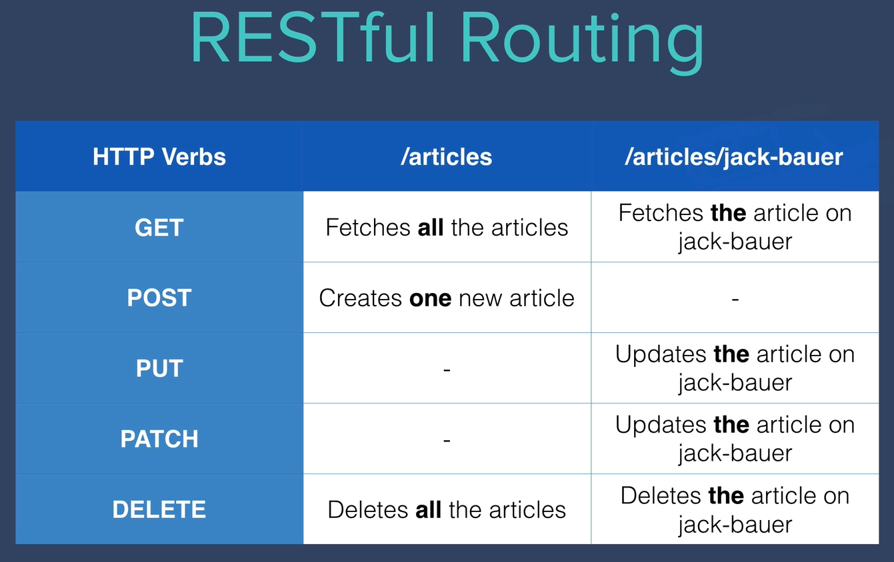

Now the route for /articles applies to all of the articles.
Now, if we created a route for articles, then when a client makes a get request to /articles,
it should fetch all of the articles.

And when they make a post request to the /articles route, then it should create a single
new article and add it to our database of articles. And when we make a delete request to /articles, then it
would delete all the articles in our database.

But RESTful routing also has rules for individual resources. So within all of the articles, we will have specific articles,
right?

Say we had an article on Jack Bauer, then if the client was targeting /articles/Jack-Bauer, then if they made a get request,
that would fetch the specific article on Jack Bauer from our database.
And you can also use put and patch to update that specific article on Jack Bauer
and you can delete the specific article as well.

### 549 Download the Starting Project

The starting files consists of an SQLite database called `cafes.db`, I created this in the same way we created databases before. 
I added a bunch of records consisting of cafes around London. 
These are some of my favourite places to work from. 

- Take a look a the database using DB Viewer and familiarise yourself with the fields in the database.

### 550 HTTP GET - a Random Cafe

Given our database consists of a bunch of cafes to remote-work from, 
one of the likely use cases of our API is a developer who wants to serve up a random cafe for their user to go to. 
So let's create a `/random` route that serves up a random cafe.

1. Create a `/random` route in main.py that allows GET requests to be made to it.
2. When someone makes a GET request to the /random route, our Flask server should fetch a random cafe from our database.

```python
## HTTP GET - Read Record
@app.route("/random", methods=['GET'])
def random():
    ## Tap into the existing db
    ## was able to do this by moving the cafes.db into the instance folder
    all_cafes = Cafe.query.all()
    print(all_cafes)
    ## Get a random record
    random_cafe = r.choice(all_cafes)
    ## Print out the fields
    print(random_cafe)
    print(random_cafe.name)
    return redirect(url_for('home'))
    ## did redirect to home route just to see if the function works
```

```text
[<Cafe 1>, <Cafe 2>, <Cafe 3>, <Cafe 4>, <Cafe 5>, <Cafe 6>, <Cafe 7>, <Cafe 8>, <Cafe 9>, <Cafe 10>, <Cafe 11>, <Cafe 12>, <Cafe 13>, <Cafe 14>, <Cafe 15>, <Cafe 16>, <Cafe 17>, <Cafe 18>, <Cafe 19>, <Cafe 20>, <Cafe 21>]
<Cafe 18>
The Peckham Pelican
```

Normally, we've been returning HTML templates using `render_template()`, 
but this time, because our server is now acting as an API, 
we want to return a JSON containing the necessary data. Just like real public APIs.

In order to do this, we have to turn our `random_cafe` SQLAlchemy Object into a JSON. 
This process is called serialization.

Flask has a serialisation helper method built-in called `jsonify()` . 
But we have to provide the structure of the JSON to return.

See if you can use the documentation on `jsonify()` to figure out how to get the `/random` route to work. 
If successful, this is what you should see when you run main.py and go to `localhost:5000/random`

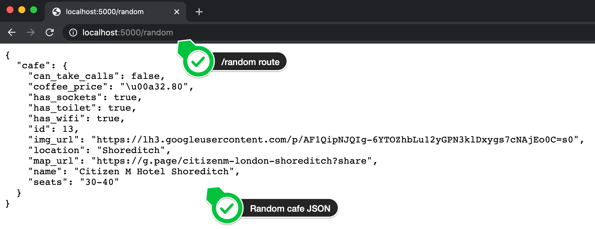

3. The `/random` route should return a json containing cafe details.

```python
## HTTP GET - Read Record
@app.route("/random", methods=['GET'])
def random():
    ## Tap into the existing db
    ## was able to do this by moving the cafes.db into the instance folder
    all_cafes = Cafe.query.all()
    ## Get a random record
    random_cafe = r.choice(all_cafes)
    ## Print out the fields
    print(random_cafe)
    print(random_cafe.name)
    return jsonify(can_take_calls=random_cafe.can_take_calls,
                   coffee_price=random_cafe.coffee_price,
                   has_sockets=random_cafe.has_sockets,
                   has_toilet=random_cafe.has_toilet,
                   has_wifi=random_cafe.has_wifi,
                   id=random_cafe.id,
                   img_url=random_cafe.img_url,
                   location=random_cafe.location,
                   map_url=random_cafe.map_url,
                   name=random_cafe.name,
                   seats=random_cafe.seats)
```

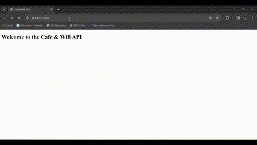

The method described in the docs has maximum flexibility. 
It allows you to have perfect control over the JSON response. 
e.g. You could also structure the response by omitting some properties like id. 
You could also group the Boolean properties into a subsection called amenities.

But in most cases, you might just want to return all the data you have on a particular record and it would drive 
you crazy if you had to write out all that code for every route.

So another method of serialising our database row Object to JSON is by first converting it to a 
dictionary and then using jsonify() to convert the dictionary (which is very similar in structure to JSON) 
to a JSON.

```python
##Cafe TABLE Configuration
class Cafe(db.Model):
    id = db.Column(db.Integer, primary_key=True)
    name = db.Column(db.String(250), unique=True, nullable=False)
    map_url = db.Column(db.String(500), nullable=False)
    img_url = db.Column(db.String(500), nullable=False)
    location = db.Column(db.String(250), nullable=False)
    has_sockets = db.Column(db.Boolean, nullable=False)
    has_toilet = db.Column(db.Boolean, nullable=False)
    has_wifi = db.Column(db.Boolean, nullable=False)
    can_take_calls = db.Column(db.Boolean, nullable=False)
    seats = db.Column(db.String(250), nullable=False)
    coffee_price = db.Column(db.String(250), nullable=True)

    def to_dict(self):
        #Method 1.
        dictionary = {}
        # Loop through each column in the data record
        for column in self.__table__.columns:
            #Create a new dictionary entry;
            # where the key is the name of the column
            # and the value is the value of the column
            dictionary[column.name] = getattr(self, column.name)
        return dictionary
```

```python
## HTTP GET - Read Record
@app.route("/random", methods=['GET'])
def random():
    ## Tap into the existing db
    ## was able to do this by moving the cafes.db into the instance folder
    all_cafes = Cafe.query.all()
    ## Get a random record
    random_cafe = r.choice(all_cafes)
    return jsonify(cafe=random_cafe.to_dict())
```

### 551 HTTP GET - All the Cafes

If someone was creating a website that lists all the cafes, 
then they would need to fetch all the cafes in our database.


CHALLENGE:

1. Create another GET route that's called /all

2. When a GET request is made to this /all route, your server should return all the cafes in your database 
as a JSON.

e.g.
https://gist.github.com/angelabauer/889a0e57359ede23e7b09a7902a45a6e

---

1. Create another GET route that's called /all

```python
@app.route(rule="/all", methods=['GET'])
```

2. When a GET request is made to this /all route, your server should return all the cafes in your database 
as a JSON.

```python
@app.route(rule="/all", methods=['GET'])
def all_records():
    cafes = []
    all_cafes = Cafe.query.all()
    for cafe in all_cafes:
        cafes.append(cafe.to_dict())
    all_records_dict = {"cafes": cafes}
    return jsonify(all_records_dict)
```


### 552 HTTP GET - Find a Cafe

1. Create a `/search` route to search for cafes at a particular location.

e.g. If you look in the cafes.db, you can see the field location, 
this is the rough area where the cafe is located.

Make our API return all the cafes in a particular area.

The user will make a GET request to your /search route and pass the location as a parameter.

HINT: Parameters are passed in the URL with a ?

e.g. Passing a lat and lon parameter to the ISS Tracking API:

http://api.open-notify.org/iss-pass.json?lat=50&lon=-0.1

If successful, this is what you should be able to do:

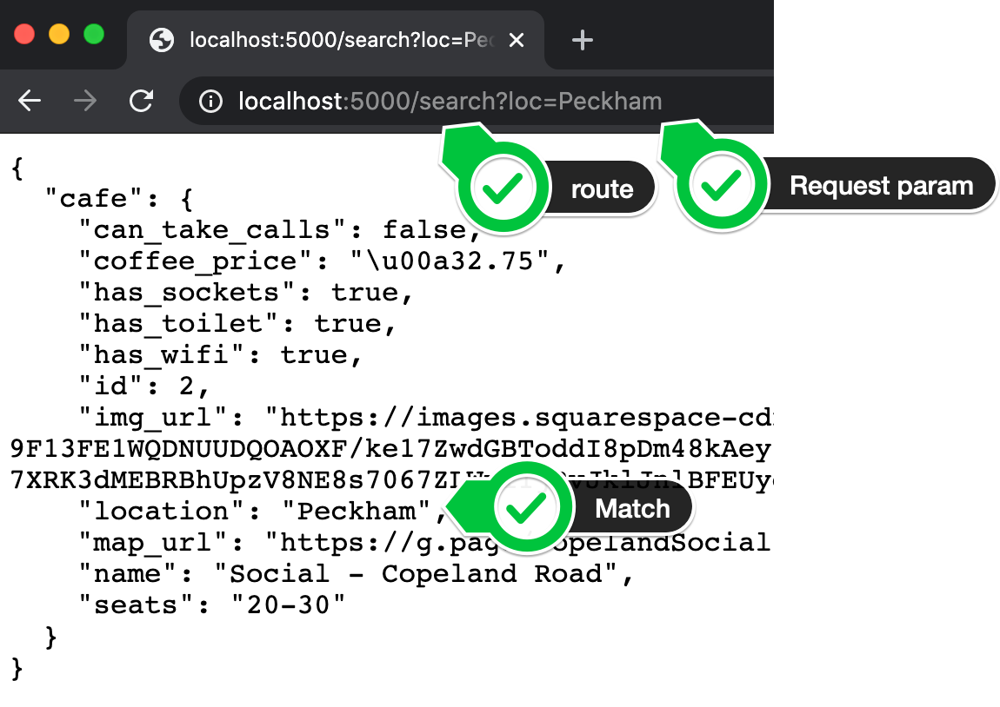

And if the location the user passed as the parameter doesn't exist then this is what you should see:

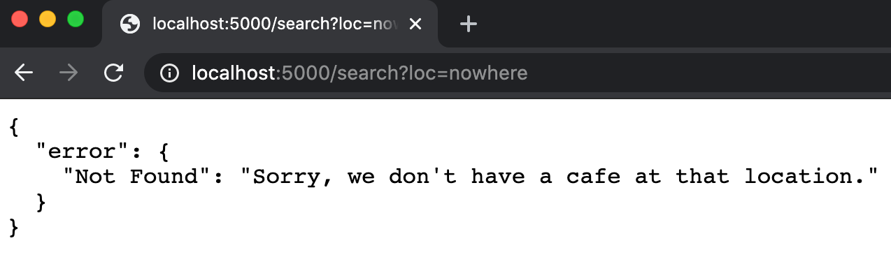

---

1. The function will take the search area name.

```python
@app.route(rule="/search?loc=<str:location_name>", methods=['GET'])
def search(location_name):
    pass
```

2. The function will filter the db using the search area.

```python
@app.route(rule="/search?loc=<str:location_name>", methods=['GET'])
def search(location_name):
    all_cafes_in_the_location = Cafe.query.filter_by(location=location_name)
    print(all_cafes_in_the_location)
```

3. The function will return the filtered results in the form of a json.

N.B. You can't put "?" in the route. "?" means there is a parameter that the route takes to structure the function.

```python
@app.route(rule="/search", methods=['GET'])
def search():
    loc = request.args.get('loc')
    # this here means that the search route will take an argument in the form of "search?loc="
    print(loc)
    # print the loc value, in this case the location name string
    all_cafes_in_the_location = Cafe.query.filter_by(location=loc)
    # filter the database based on the location string provided
    print(all_cafes_in_the_location)
    # print all the cafes filtered by the location, should return a list of cafe objects
    cafes_in_the_location = [cafe.to_dict() for cafe in all_cafes_in_the_location]
    # convert the cafe data for each cafe into a dictionary and store in the list
    cafes_in_the_location_dict = {"cafe": cafes_in_the_location}
    return jsonify(cafes_in_the_location_dict)
```

One small error, `all_cafes_in_the_location = Cafe.query.filter_by(location=loc)` does not generate a list.

Upon searching in Google, it was found that it should be `all_cafes_in_the_location = Cafe.query.filter_by(location=loc).all()`

Final code - 

```python
@app.route(rule="/search", methods=['GET'])
def search():
    loc = request.args.get('loc')
    print(loc)
    all_cafes_in_the_location = Cafe.query.filter_by(location=loc).all()
    print(all_cafes_in_the_location)
    cafes_in_the_location = [cafe.to_dict() for cafe in all_cafes_in_the_location]
    cafes_in_the_location_dict = {"cafe": cafes_in_the_location}
    return jsonify(cafes_in_the_location_dict)
```

4. If the location does not exist, the function should provide a response accordingly.

For example - 

```python
sample_list = []
if sample_list:
    print('yes')
else:
    print('nope')
```

```text
nope
```

By the same logic, we can modify the previous `/search` route - 

```python
@app.route(rule="/search", methods=['GET'])
def search():
    loc = request.args.get('loc')
    print(loc)
    all_cafes_in_the_location = Cafe.query.filter_by(location=loc).all()
    if all_cafes_in_the_location:
        print(all_cafes_in_the_location)
        cafes_in_the_location = [cafe.to_dict() for cafe in all_cafes_in_the_location]
        cafes_in_the_location_dict = {"cafe": cafes_in_the_location}
        return jsonify(cafes_in_the_location_dict)
    else:
        error_dict = {"error": {"Not Found": "Sorry, we do not have a cafe at that location"}
                      }
        return jsonify(error_dict)
```

Final Result - 


### 553 Postman - The all in one API Testing Tool

As you can imagine, if you need to test your API with a bunch of parameters, 
it can quickly get tiring typing them all out in the URL bar of your browser. 
It's also super error-prone.

So how do developers test their APIs? One of the best tools is Postman.

It allows you to add key-value pairs for your request parameters and it will automatically format your URL:

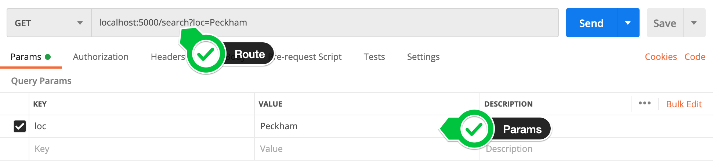

1. Download Postman

2. Create a new workspace, then create a new collection in Postman

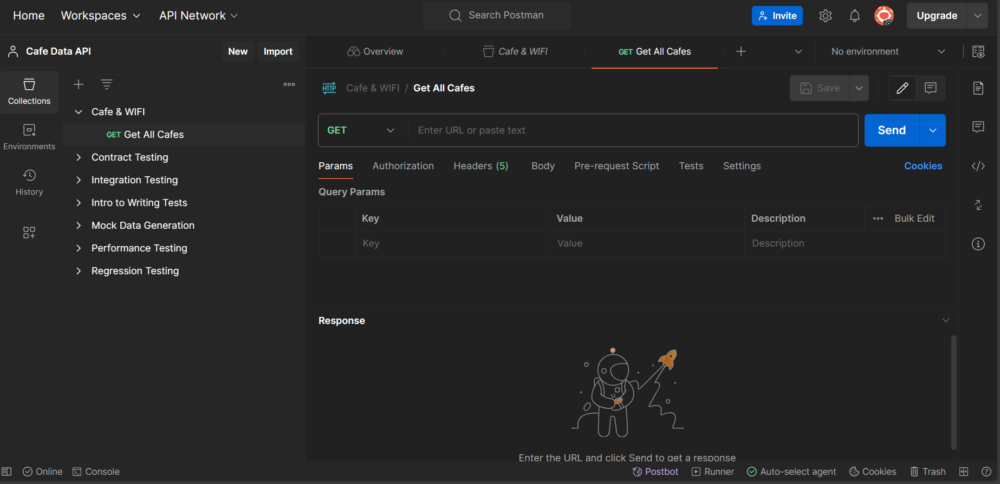

After you have successfully tested your API route, 
try creating a new collection called Cafe & Wifi and adding all the existing routes to the collection.

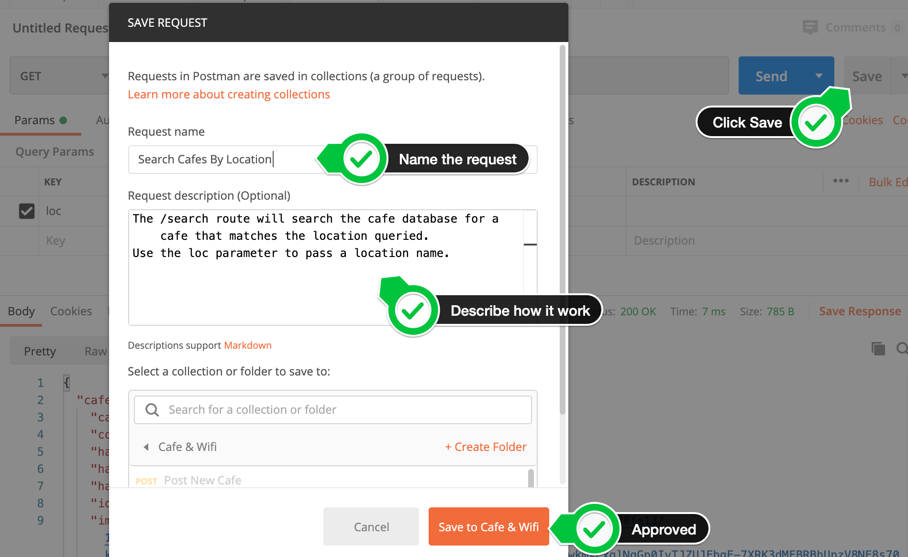

You should end up with all 3 routes saved in your collection. 
This is important if you want to generate documentation for your API later.

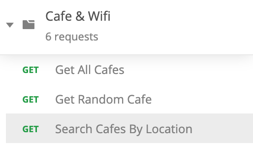

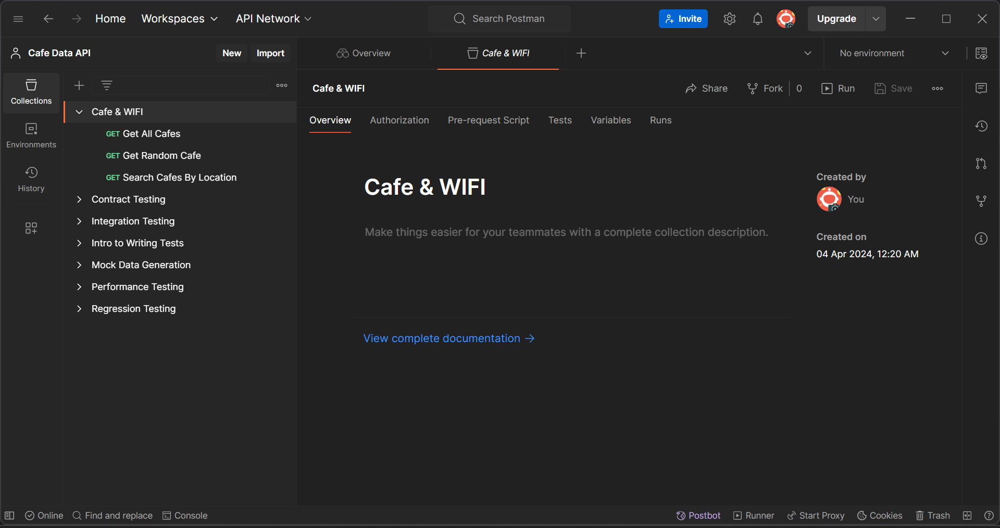

Basically you do not have to open the browser everytime to check the API output from now.
You can start the app/server.
And test the API outputs from postman.


### 554 HTTP POST - A New Cafe

What if we wanted to add a new cafe to the database?

How would you test your API without building out a WTForm or HTML Form? 
Because that's likely where the POST request is going to come from.

Luckily Postman makes this easy.

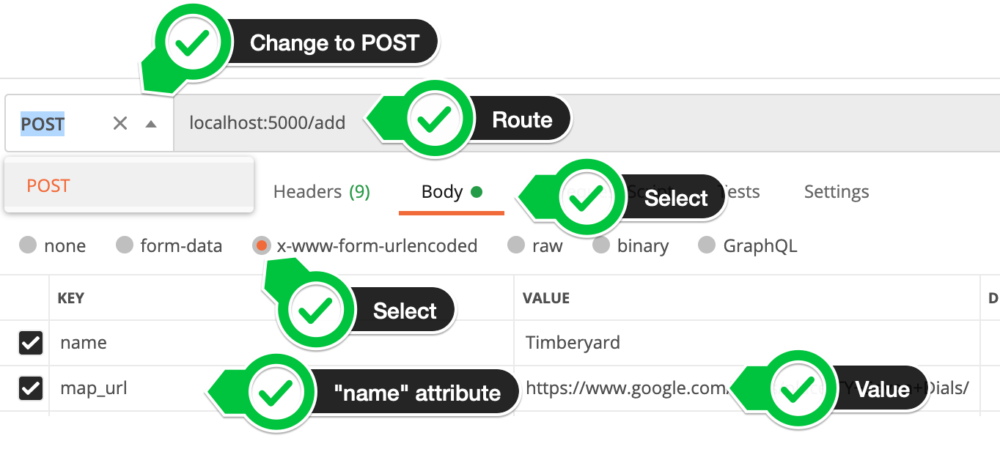

The Key-Value pairs you enter into the Body tab in Postman is equivalent to `<input>` elements.

```html
<label>Name of Cafe</label>
<input name="name">
<label>Google Map URL Link</label>
<input name="map_url">
```

It's so good at making POST requests that some call it the "POSTman". 😜

This is what you're aiming to get in Postman:

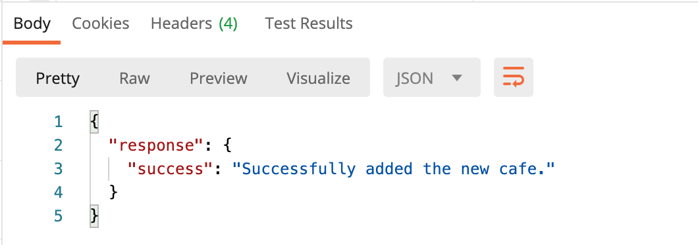

But the route has to be created in the main.py

The user of the API will send some data while making the request, 
that is what will be used to prepare the json response.

In day 63, we saw that - 

```html
<form action="{{ url_for('add') }}" method="post">
    <label>Book Name</label>
    <input type="text" name="fname">
    <label>Book Author</label>
    <input type="text" name= 'fauthor'>
    <label>Rating</label>
    <input type="text" name="frating">
    <button type="submit">Add Book</button>
</form>
```

the above html's data was captured by flask by - 

```python
@app.route("/add", methods=['GET', 'POST'])
def add():
    if request.method == 'POST':
        book_name = request.form['fname'],
        author_name = request.form['fauthor'],
        book_rating = request.form['frating']
        # print(book_name[0])
        with app.app_context():
            new_book = books_read(title=book_name[0], author=author_name[0], review=book_rating[0])
            db.session.add(new_book)
            db.session.commit()
        return redirect(url_for('home'))
    return render_template('add.html')
```

The data was captured by `request.form['name]` of the field

And here, the data provided in postman is equivalent to -

```html
<label>Name of Cafe</label>
<input name="name">
<label>Google Map URL Link</label>
<input name="map_url">
```

So we can use the names of the fields here too - 

```python
@app.route(rule="/add", methods=['POST'])
def add():
    with app.app_context():
        new_cafe = Cafe(
            # the form data are all captured as string, change the data type wherever necessary
            can_take_calls=bool(request.form['can_take_calls']),
            coffee_price=request.form['coffee_price'],
            has_sockets=bool(request.form['has_sockets']),
            has_toilet=bool(request.form['has_toilet']),
            has_wifi=bool(request.form['has_wifi']),
            img_url=request.form['img_url'],
            location=request.form['location'],
            map_url=request.form['map_url'],
            name=request.form['name'],
            seats=int(request.form['seats'])
        )
```

Add the cafe to the database - 

```python
db.session.add(new_cafe)
db.session.commit()
```

Lastly, return the json response - 

```python
add_response = {"response": {"success": "Successfully added a new cafe"}}
return jsonify(add_response)
```

Final code - 

```python
## HTTP POST - Create Record
@app.route(rule="/add", methods=['POST'])
def add():
    with app.app_context():
        print(type(bool(request.form['can_take_calls'])))
        new_cafe = Cafe(
            can_take_calls=bool(request.form['can_take_calls']),
            coffee_price=request.form['coffee_price'],
            has_sockets=bool(request.form['has_sockets']),
            has_toilet=bool(request.form['has_toilet']),
            has_wifi=bool(request.form['has_wifi']),
            img_url=request.form['img_url'],
            location=request.form['location'],
            map_url=request.form['map_url'],
            name=request.form['name'],
            seats=request.form['seats']
        )
        db.session.add(new_cafe)
        db.session.commit()
    add_response = {"response": {"success": "Successfully added a new cafe"}}
    return jsonify(add_response)
```


### 555 HTTP PUT vs. PATCH

When we say PUT, we are updating the database by sending an entire entry to replace the previous one.
Kind of like `file.write`.

When we say PATCH, we update our database just by modifying specific entries.
We do not replace the entire database with a new entry.
Kind of like `file.append`.

We are only sending a piece of data that needs to be updated.


### 556 HTTP PATCH - A Cafe's Coffee Price

So here, we will update a specific piece of data in our database.

One of the fields in our cafe database is the price of a single black coffee. 
It's a good way for users to gauge how expensive is the coffee shop. 
But cafes often change their prices. 
What if a user wanted to submit a change in price at one of the cafes?

If they knew the id of the cafe (which they can get by making a GET request to fetch data on all the cafes), 
then they can update the `coffee_price` field of the cafe.

In this situation, a PATCH request is probably more efficient, 
as we don't need to change any of the rest of the cafe's data.

1. Create a PATCH request route in main.py to handle PATCH requests to our API. 
In order for our API to be RESTful, ideally, the route should be something like this:

`/update-price/<cafe_id>`

HINT 1: https://flask.palletsprojects.com/en/1.1.x/quickstart/#variable-rules

So the user might go to `localhost:5000/update-price/22` and that would update the cafe with an id of 22.

HINT 2: The user will also need to provide the updated price of a single black coffee 
by passing it with the request as a parameter.

This is what should happen if you've done this correctly, 
you should be able to test the API in Postman and get a successful response:

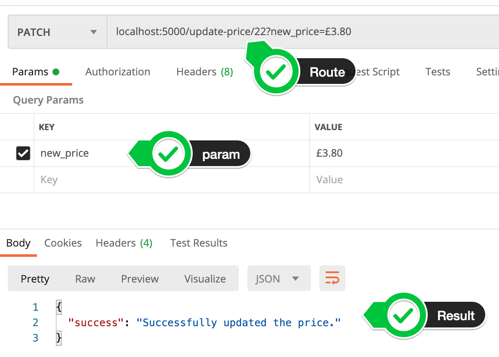

NOTE: There might be a chance that the id in the route doesn't exist. 
In this case, make sure you give the user the correct feedback:

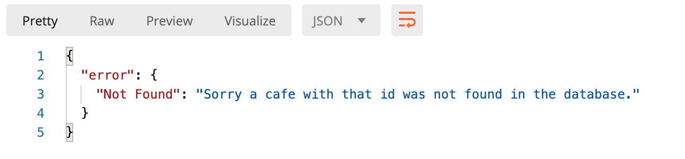

NOTE: Notice that even when the resource is not found and we get an error the correct HTTP code is not being returned. 
It should be 404 for "resource not found" but instead we're getting 200 for "a ok".

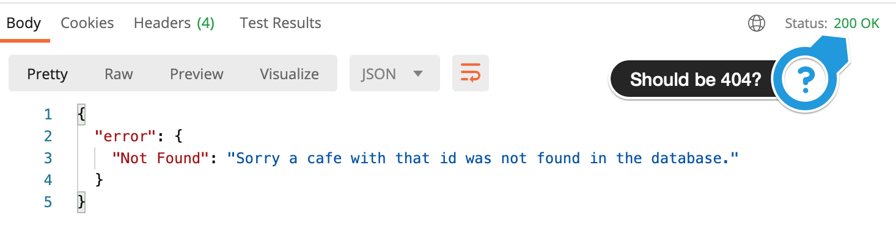

This is how you can pass an HTTP code with your response.


**I am thinking that I will not update just the price, but also other parameters.**

How to do this?

1. Create the route. The route will contain the `cafe_id`

```python
@app.route(rule="/update/<int: cafe_id>", methods=['PATCH'])
```

2. The 'cafe_id' will be captured and the parameter will be sent via a json or a form
- The 'cafe_id' will be captured
```python
def update(cafe_id):
    with app.app_context():
        cafe_to_be_updated = Cafe.query.filter_by(id=cafe_id).first()
        print(cafe_to_be_updated.name)
```

```text
The Tate Modern Cafe
```

- the parameter will be sent via a json or a form

```python
if cafe_to_be_updated:
    parameter_to_be_updated = request.json["parameter"]
```

3. The parameter will be changed in the database

```python
if cafe_to_be_updated:
    parameter_to_be_updated = request.json["parameter"]
    new_value = request.json["updated_value"]
    print(parameter_to_be_updated)
    print(new_value)
    cafe_to_be_updated.coffee_price = new_value
    db.session.commit()
```

4. The route will return a 'success' or an 'error' message

```python
if cafe_to_be_updated:
    parameter_to_be_updated = request.json["parameter"]
    new_value = request.json["updated_value"]
    print(parameter_to_be_updated)
    print(new_value)
    cafe_to_be_updated.coffee_price = new_value
    db.session.commit()
    update_response = {"response": {"success": f"Successfully updated the {parameter_to_be_updated}"}}
    return jsonify(update_response)
else:
    error_dict = {"error": {"Not Found": "Sorry, a cafe with that id was not found in the database"}
              }
    return jsonify(error_dict)
```

Final Code - 

```python
## HTTP PUT/PATCH - Update Record
#PATCH
@app.route(rule="/update/<int:cafe_id>", methods=['PATCH'])
def update(cafe_id):
    with app.app_context():
        cafe_to_be_updated = Cafe.query.filter_by(id=cafe_id).first()
        print(cafe_to_be_updated.name)
        if cafe_to_be_updated:
            parameter_to_be_updated = request.json["parameter"]
            new_value = request.json["updated_value"]
            print(parameter_to_be_updated)
            print(new_value)
            cafe_to_be_updated.coffee_price = new_value
            db.session.commit()
            update_response = {"response": {"success": f"Successfully updated the {parameter_to_be_updated}"}}
            return jsonify(update_response)
        else:
            error_dict = {"error": {"Not Found": "Sorry, a cafe with that id was not found in the database"}
                      }
            return jsonify(error_dict)
```

One issue, `cafe_to_be_updated.parameter_to_be_updated` just does not work.

A specific name of the parameter must be given.

Without making things more complicated, let's stick to the simpler process.
Let's just use this route only to update the price, which will be passed in via the url.

```python
## HTTP PUT/PATCH - Update Record
#PATCH
@app.route(rule="/update/<int:cafe_id>", methods=['PATCH'])
def update(cafe_id):
    with app.app_context():
        cafe_to_be_updated = Cafe.query.filter_by(id=cafe_id).first()
        print(cafe_to_be_updated.name)
        new_price = request.args.get('coffee_price')
        if cafe_to_be_updated:
            cafe_to_be_updated.coffee_price = new_price
            db.session.commit()
            update_response = {"response": {"success": "Successfully updated the coffee_price"}}
            return jsonify(update_response)
        else:
            error_dict = {"error": {"Not Found": "Sorry, a cafe with that id was not found in the database"}
                      }
            return jsonify(error_dict)
```


NOTE: Notice that even when the resource is not found and we get an error the correct HTTP code is not being returned. 
It should be 404 for "resource not found" but instead we're getting 200 for "a ok".


Just add the code after the jsonify method. `200 = Ok`

```python
if cafe_to_be_updated:
    db.session.commit()
    return jsonify(response={"success": "Successfully updated the price."}), 200
else:
    #404 = Resource not found
    return jsonify(error={"Not Found": "Sorry a cafe with that id was not found in the database."}), 404
```
    
Incorporating the same in our code fixes the problem.


### 557 HTTP DELETE - A Cafe that's Closed

One of the saddest things is when your favourite cafe/workplace closes. 
But we have to just accept and move on. 
Also, make a DELETE request to our server and update the database.

But we can't let just anyone delete things in our database. 
We might soon end up with someone accidentally deleting everything.

We can add a security feature by requiring an `api-key` . 
If they have the api-key "TopSecretAPIKey" then they're allowed to make the delete request, otherwise, we tell them they are not authorized to make that request. 
A 403 in HTTP speak.

Check out all the HTTP Codes: https://httpstatuses.com/

1. Complete this challenge by adding the DELETE route to /report-closed/<cafe_id>

_e.g. The request via Postman might look like this:_

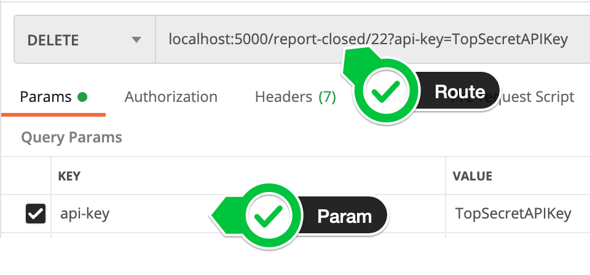

```python
## HTTP DELETE - Delete Record
@app.route(rule="/delete/<int:cafe_id>", methods=['DELETE'])
def delete(cafe_id):
    API_Key = request.args.get('api_key')
    if API_Key == "TopSecretAPIKey":
        # print('correct key')
        with app.app_context():
            cafe_to_be_deleted = Cafe.query.filter_by(id=cafe_id).first()
            # print(cafe_to_be_deleted)
            # print(cafe_to_be_deleted.name)
            if cafe_to_be_deleted:
                db.session.delete(cafe_to_be_deleted)
                db.session.commit()
                success = {
                    "Success": "Cafe Deleted"
                }
                return jsonify(success)
            else:
                no_cafe_found = {
                    "error": "Sorry, that cafe was not found in the database"
                }
                return jsonify(no_cafe_found)
    else:
        wrong_key = {
            "error": "Sorry, wrong API Key"
        }
        return jsonify(wrong_key)
```


### 558 Build Documentation for Your API

If we want other people to use our API, then we have to document how to use it. 
People can't see the code on our servers, so we have to tell them how to interact with our servers via the API constraints.

e.g. What are the routes, what are the required parameters etc.

Luckily for us, if you made all your requests in Postman and you gave each request a name and description then Postman will generate the documentation automatically for you.

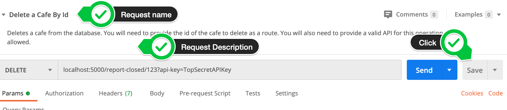

There are simple steps you can follow to publish your docs on a website.
You just have to provide descriptions and definitions.


_fin_
