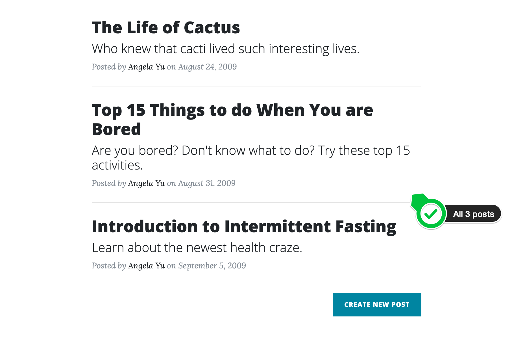
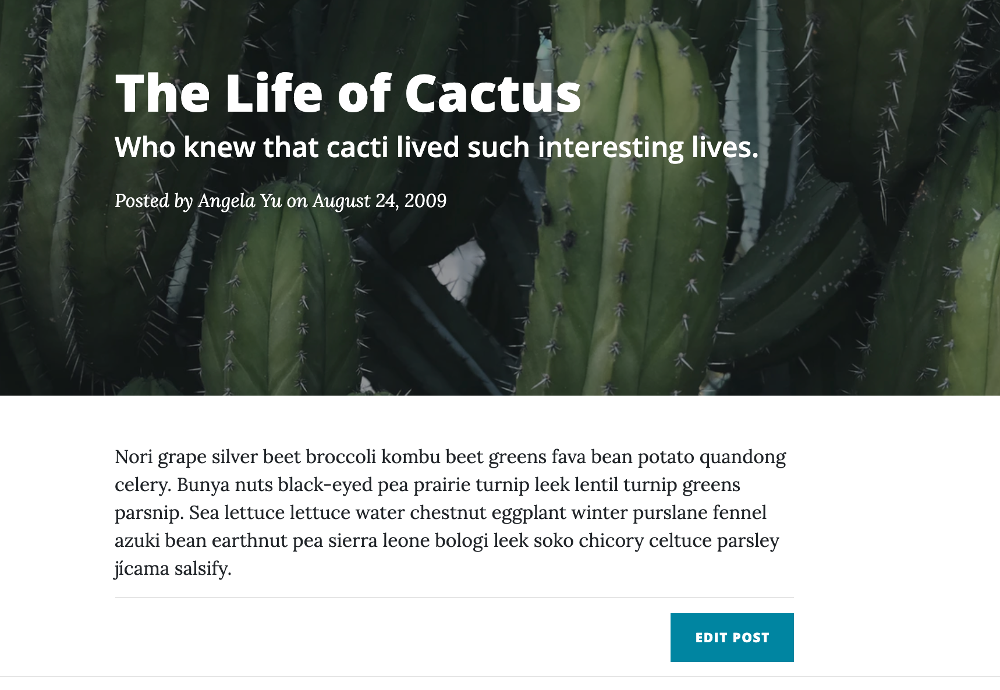
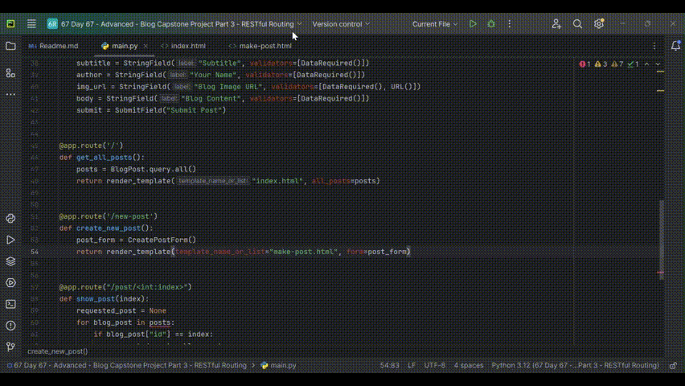
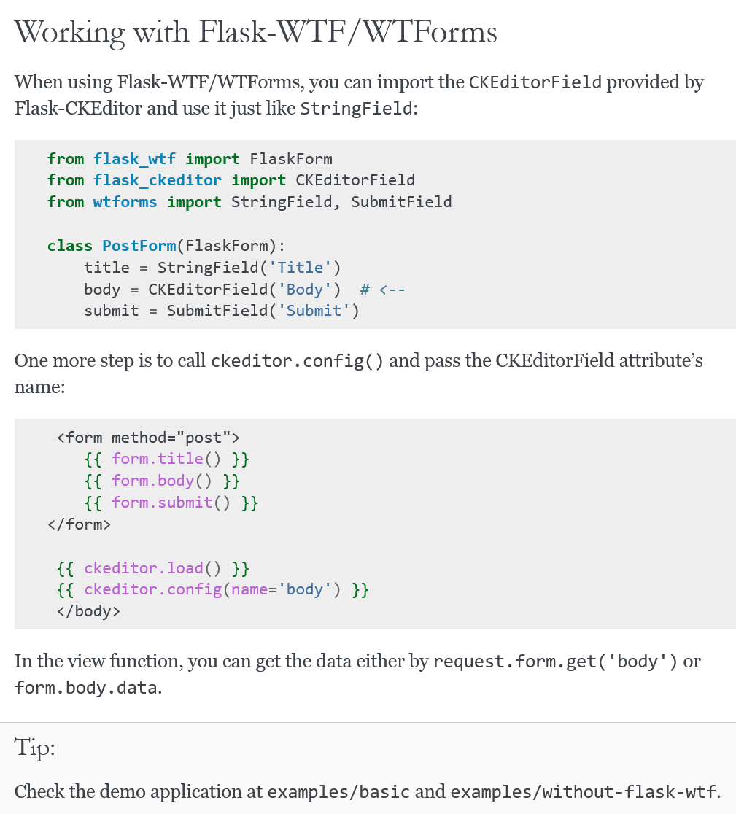
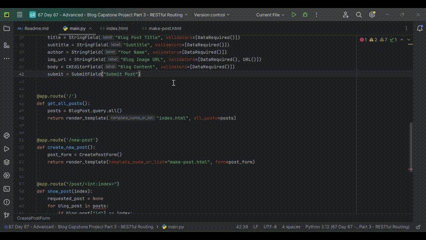
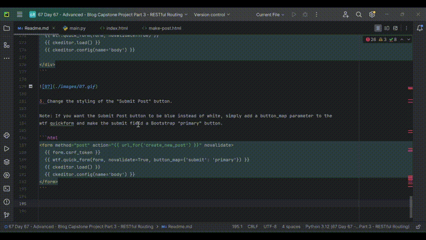
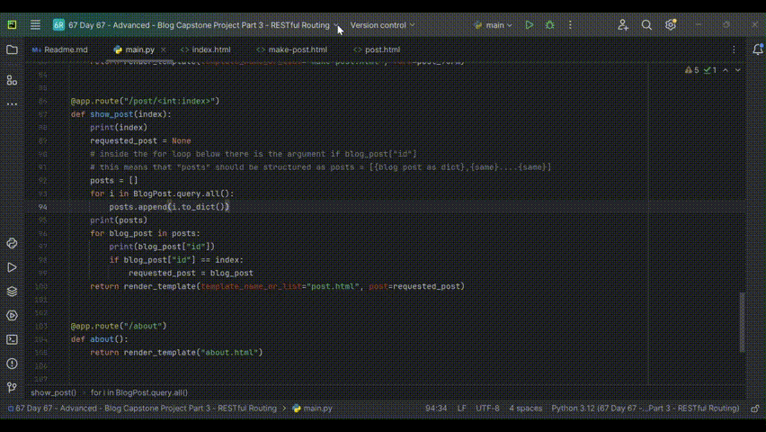

### 559 Day 67 Goals_ Building a RESTful Blog with Editing!

Using the knowledge we've gained, we're going to take our blog even further. 
We'll add more HTTP routes so that you can create new blog posts, edit posts and delete posts. 
All inside your blog website.

This is what your blog will be able to do after today:


Objectives - 
1. GET - When you click on "New Post" a new window opens with a fully-featured form.
2. POST - Fill up the form with the blog contents. Once done, the new blog appears on the homepage.
3. PUT - There will an "Edit Post" button at the bottom of every blog, which will allow the user to edit the post.
4. DELETE - Finally there will be a delete button beside every blog name, which will allow the user to delete posts.


### 560 Download the Starting Project

1. Download the starting .zip files from this lessons resources (Starting Files - RESTful-blog-start.zip).
2. Unzip and open the project in PyCharm.
3. Make sure that the required packages (imports) are all installed and there are no red underlines.

The starting files consists of an SQLite database called posts.db, 
I created this in the same way we created databases before. 
I added all the posts that were previously stored on our npoint JSON bucket.

4. Take a look a the database using DB Viewer and familiarise yourself with the fields in the database.


### 561 Requirement 1 - Be Able to GET Blog Post Items

Instead of getting hold of blog posts from the npoint JSON bin, 
grab the posts from the posts.db SQLite database that's included in the starting project.

This is what you should see when you are reading the blog posts from the posts.db:



And this is what you should see when you click on one of the individual posts:



1. Load all posts from the database.
- Move the posts.db to the instance folder.
- Make the home route so that it pulls the data from the database.

```python
##CONNECT TO DB
app.config['SQLALCHEMY_DATABASE_URI'] = 'sqlite:///posts.db'
app.config['SQLALCHEMY_TRACK_MODIFICATIONS'] = False
db = SQLAlchemy(app)

##CONFIGURE TABLE
class BlogPost(db.Model):
    id = db.Column(db.Integer, primary_key=True)
    title = db.Column(db.String(250), unique=True, nullable=False)
    subtitle = db.Column(db.String(250), nullable=False)
    date = db.Column(db.String(250), nullable=False)
    body = db.Column(db.Text, nullable=False)
    author = db.Column(db.String(250), nullable=False)
    img_url = db.Column(db.String(250), nullable=False)
    
@app.route('/')
def get_all_posts():
    posts = BlogPost.query.all()
    return render_template("index.html", all_posts=posts)
```

- And configure the index.html file - 

```html
<!-- Main Content -->

<div class="post-preview">
  <a href="{{ url_for('show_post', index=post.id) }}">
    <h2 class="post-title">
      {{post.title}}
    </h2>
    <h3 class="post-subtitle">
      {{post.subtitle}}
    </h3>
  </a>
  <p class="post-meta">Posted by
    <a href="#">{{post.author}}</a>
    on {{post.date}}</p>
</div>
<hr>

```

### 562 Requirement 2 - Be Able to POST a New Blog Post

Create a new POST route called /new-post in your Flask server.

1. It should render the make-post.html page when you click on the "Create New Post" button.

```python
@app.route('/new-post')
def create_new_post():
    return render_template(template_name_or_list="make-post.html")
```

```html
<!-- New Post -->
<div class="clearfix">
  <a class="btn btn-primary float-right" href="{{ url_for('create_new_post') }}">Create New Post</a>
</div>
```


You will need to figure out how to use the Flask CKEditor package to make the Blog Content (body) input in the WTForm 
into a full CKEditor.

1. Render the wtform in the make-post.html

```python
@app.route('/new-post')
def create_new_post():
    post_form = CreatePostForm()
    return render_template(template_name_or_list="make-post.html", form=post_form)
```

```html



<div class="col-lg-8 col-md-10 mx-auto">

  <!-- This is where the form will go -->
<form method="post" action="{{ url_for('create_new_post') }}" novalidate>
  {{ form.csrf_token }}
  {{ wtf.quick_form(form, novalidate=True) }}
</div>
```



2. Transform the wtform into a full-blown editable form using ckeditor

According to the ckeditor doc - 



Applying the same to the code - 

main.py - 
```python
from flask_ckeditor import CKEditor, CKEditorField

app = Flask(__name__)
ckeditor = CKEditor(app)

class CreatePostForm(FlaskForm):
    title = StringField("Blog Post Title", validators=[DataRequired()])
    subtitle = StringField("Subtitle", validators=[DataRequired()])
    author = StringField("Your Name", validators=[DataRequired()])
    img_url = StringField("Blog Image URL", validators=[DataRequired(), URL()])
    body = CKEditorField("Blog Content", validators=[DataRequired()])
    # changed StringField to CKEditorField
    submit = SubmitField("Submit Post")
    
@app.route('/new-post')
def create_new_post():
    post_form = CreatePostForm()
    return render_template(template_name_or_list="make-post.html", form=post_form)
```

make-post.html - 
```html
<div class="col-lg-8 col-md-10 mx-auto">

  <!-- This is where the form will go -->
<form method="post" action="{{ url_for('create_new_post') }}" novalidate>
  {{ form.csrf_token }}
  {{ wtf.quick_form(form, novalidate=True) }}
  {{ ckeditor.load() }}
  {{ ckeditor.config(name='body') }}

</div>
```



3. Change the styling of the "Submit Post" button.

Note: If you want the Submit Post button to be blue instead of white, simply add a button_map parameter to the 
wtf quickform and make the submit field a Bootstrap "primary" button.

```html
<form method="post" action="{{ url_for('create_new_post') }}" novalidate>
  {{ form.csrf_token }}
  {{ wtf.quick_form(form, novalidate=True, button_map={'submit': 'primary'}) }}
  {{ ckeditor.load() }}
  {{ ckeditor.config(name='body') }}
</form>
```



4. When the user is done typing out entries to all the fields, the data in the form should be saved as a BlogPost Object into the posts.db
- capture the data from the form

```python
@app.route('/new-post', methods=['GET', 'POST'])
# need to provide both methods, 'GET' is for redirection from the index page, 'POST' is for data capture from the form
def create_new_post():
    post_form = CreatePostForm()
    if post_form.validate_on_submit():
        print(post_form.title.data)
        print(post_form.author.data)
        print(post_form.body.data)
        return redirect(url_for('get_all_posts'))
    return render_template(template_name_or_list="make-post.html", form=post_form)
```


- insert the captured data into the database, the date should be auto generated using the datetime module.

```python
@app.route('/new-post', methods=['GET', 'POST'])
# need to provide both methods, 'GET' is for redirection from the index page, 'POST' is for data capture from the form
def create_new_post():
    post_form = CreatePostForm()
    if post_form.validate_on_submit():
        # print(post_form.title.data)
        # print(post_form.author.data)
        # print(post_form.body.data)
        today = datetime.datetime.today()
        current_month = today.strftime("%B")
        current_day = today.day
        current_year = today.year
        with (app.app_context()):
            new_blog_entry = BlogPost(
                # id=db.Column(db.Integer, primary_key=True)
                title=post_form.title.data,
                subtitle=post_form.subtitle.data,
                date=f"{current_month} {current_day}, {current_year}",
                body=post_form.body.data,
                author=post_form.author.data,
                img_url=post_form.img_url.data
            )
            db.session.add(new_blog_entry)
            db.session.commit()
        return redirect(url_for('get_all_posts'))
    return render_template(template_name_or_list="make-post.html", form=post_form)
```


- Now that a new blog post has been added, clicking on it should display the bolg contents.

NOTE: The data from the CKEditorField is saved as HTML. 
It contains all the structure and styling of the blog post. 
In order for this structure to be reflected when you go to the post.html page for the blog post, 
you need to add a Jinja safe() filter.

This makes sure that when Jinja renders the post.html template, it doesn't treat the HTML as text.

To apply a Jinja filter, you need the pipe symbol "|" and this goes between the Jinja expression and Jinja filter.

e.g. **{{ Jinja expression | Jinja filter }}**

main.py - 
```python
@app.route('/')
def get_all_posts():
    posts = BlogPost.query.all()
    return render_template("index.html", all_posts=posts)
```

index.html - 
```html
        
        <div class="post-preview">
          <a href="{{ url_for('show_post', index=post.id) }}">
            <h2 class="post-title">
              {{post.title}}
            </h2>
            <h3 class="post-subtitle">
              {{post.subtitle}}
            </h3>
          </a>
          <p class="post-meta">Posted by
            <a href="#">{{post.author}}</a>
            on {{post.date}}</p>
        </div>
        <hr>
        
```

main.py - 
```python
@app.route("/post/<int:index>")
def show_post(index):
    print(index)
    requested_post = None
    # inside the for loop below there is the argument if blog_post["id"]
    # this means that "posts" should be structured as posts = [{blog post as dict},{same}....{same}]
    posts = []
    for i in BlogPost.query.all():
        posts.append(i.to_dict())
    print(posts)
    for blog_post in posts:
        print(blog_post["id"])
        if blog_post["id"] == index:
            requested_post = blog_post
    return render_template(template_name_or_list="post.html", post=requested_post)
```

post.html (without the safe filter) - 
```html
<header class="masthead" style="background-image: url('{{post.img_url}}')">
    <div class="overlay"></div>
    <div class="container">
        <div class="row">
            <div class="col-lg-8 col-md-10 mx-auto">
                <div class="post-heading">
                    <h1>{{post.title}}</h1>
                    <h2 class="subheading">{{post.subtitle}}</h2>
                    <span class="meta">Posted by
              <a href="#">{{post.author}}</a>
              on {{post.date}}</span>
                </div>
            </div>
        </div>
    </div>
</header>

<!-- Post Content -->
<article>
    <div class="container">
        <div class="row">
            <div class="col-lg-8 col-md-10 mx-auto">
                <p>
                    {{post.body}}
                </p>
                <hr>
                <div class="clearfix">
                    <a class="btn btn-primary float-right" href="#">Edit Post</a>
                </div>
            </div>
        </div>
    </div>
</article>
```


post.html (without the safe filter) - 
```html
<!-- Page Header -->
<header class="masthead" style="background-image: url('{{post.img_url}}')">
    <div class="overlay"></div>
    <div class="container">
        <div class="row">
            <div class="col-lg-8 col-md-10 mx-auto">
                <div class="post-heading">
                    <h1>{{post.title}}</h1>
                    <h2 class="subheading">{{post.subtitle}}</h2>
                    <span class="meta">Posted by
              <a href="#">{{post.author}}</a>
              on {{post.date}}</span>
                </div>
            </div>
        </div>
    </div>
</header>

<!-- Post Content -->
<article>
    <div class="container">
        <div class="row">
            <div class="col-lg-8 col-md-10 mx-auto">
                <p>
                    {{post.body|safe}}
                    <!--this is where teh change has been made-->
                </p>
                <hr>
                <div class="clearfix">
                    <a class="btn btn-primary float-right" href="#">Edit Post</a>
                </div>
            </div>
        </div>
    </div>
</article>
```




### 563 Requirement 3 - Be Able to Edit Existing Blog Posts

1. When the user clicks "Edit Post" it should reroute to the edit page (make-post.html).

- Make the redirection in the html
```html
<a class="btn btn-primary float-right" href="{{url_for('edit_post', post_id=post.id)}}">Edit Post</a>
```

- Create a new route `/edit-post/<post_id>`
```python
@app.route("/edit-post/<post_id>")
def edit_post():
    return render_template(template_name_or_list="make-post.html", form=post_form)
```
- The form rendered when you come edit a new post should be pre-populated.
```python
@app.route("/edit-post/<post_id>")
def edit_post(post_id):
    post_to_be_edited = BlogPost.query.filter_by(id=post_id)
    post_form = CreatePostForm(
        title=post_to_be_edited.title,
        subtitle=post_to_be_edited.subtitle,
        img_url=post_to_be_edited.img_url,
        author=post_to_be_edited.author,
        body=post_to_be_edited.body,
        date=post_to_be_edited.date,
    )
    return render_template(template_name_or_list="make-post.html", form=post_form)
```

- If the user came from "Create New Post" the `<h1>` should read "New Post", but if the user came to edit a particular blog post, it should read "Edit Post".

2. When you head over to make-post.html it should auto-populate the fields in the WTForm with the blog post's data. 
This way the user doesn't have to type out their blog post again.
3. When the user is done editing in the WTForm, they click "Submit Post", the post should now be updated in the database. 
And the user redirected to the post.html page for that blog post.

_User clicks edit post._

post.html - 
```html
<a class="btn btn-primary float-right" href="{{url_for('edit_post', post_id=post.id)}}">Edit Post</a>
```

_The "edit" button in the post page redirects him to the same make-post page, but this time it is prefilled._

main.py-
```python
@app.route("/edit-post/<post_id>", methods=['GET', 'POST'])
def edit_post(post_id):
    post_to_be_edited = BlogPost.query.filter_by(id=post_id).first()
    post_form = CreatePostForm(
        title=post_to_be_edited.title,
        subtitle=post_to_be_edited.subtitle,
        img_url=post_to_be_edited.img_url,
        author=post_to_be_edited.author,
        body=post_to_be_edited.body
    )
    if post_form.validate_on_submit():
        print(post_form.body.data)
        with (app.app_context()):
            post_to_be_edited = BlogPost.query.get(post_id)
            post_to_be_edited.title = post_form.title.data
            post_to_be_edited.subtitle = post_form.subtitle.data
            post_to_be_edited.author = post_form.author.data
            post_to_be_edited.img_url = post_form.img_url.data
            post_to_be_edited.body = post_form.body.data
            db.session.commit()
        return redirect(url_for('show_post', index=post_id))
        # with the database now updated, the post.html page will show the updated post.
    # the endpoint tells the make-post page about the form to use (prefilled) and other variables
    return render_template(template_name_or_list="make-post.html", form=post_form, edit=True, post_id_num=post_id)
```

_The make-post page gets rendered accordingly._

make-post.html -
```html

<h1>Edit Post</h1>

<h1>New Post</h1>

```

make-post.html - 
```html
<!-- This is where the form will go -->

  <form method="post" action="{{ url_for('edit_post', post_id=post_id_num) }}" novalidate>
  {{ form.csrf_token }}
  {{ wtf.quick_form(form, novalidate=True, button_map={'submit': 'primary'}) }}
  {{ ckeditor.load() }}
  {{ ckeditor.config(name='body') }}
</form>

<form method="post" action="{{ url_for('create_new_post') }}" novalidate>
  {{ form.csrf_token }}
  {{ wtf.quick_form(form, novalidate=True, button_map={'submit': 'primary'}) }}
  {{ ckeditor.load() }}
  {{ ckeditor.config(name='body') }}
</form>

```

**_NOTE: HTML forms (WTForms included) do not accept PUT, PATCH or DELETE methods. 
So while this would normally be a PUT request (replacing existing data), 
because the request is coming from a HTML form, you should accept the edited post as a POST request._**


### 564 Requirement 4- Be Able DELETE Blog Posts

1. In index.html create an anchor tag that just shows a ✘ character next to each post.

When you click on it, it should delete the post from the database and redirect the user to the home page.
You will need to create a DELETE route at the path /delete/<post_id>

post.html - 
```html
<a class="btn btn-primary float-right" href="{{url_for('edit_post', post_id=post.id)}}">Edit Post</a>
<a class="btn btn-primary float-right" href="{{url_for('delete_post', post_id=post.id)}}">✘</a>
```

Revised the code in the post.html so it looks better.

```html
<a class="btn btn-primary float-left" href="{{url_for('edit_post', post_id=post.id)}}">Edit Post</a>
<a class="btn btn-danger float-right" href="{{url_for('delete_post', post_id=post.id)}}">✘</a>
```

The edit button is now on the left and the delete button is now on the right, red colored.

This redirects to the delete_post url.

main.py - 
```python
@app.route("/delete/<post_id>")
def delete_post(post_id):
    with (app.app_context()):
        post_to_be_deleted = BlogPost.query.filter_by(id=post_id).first()
        db.session.delete(post_to_be_deleted)
        db.session.commit()
    return redirect(url_for('get_all_posts'))
```

**That's it!!**

_fin_

