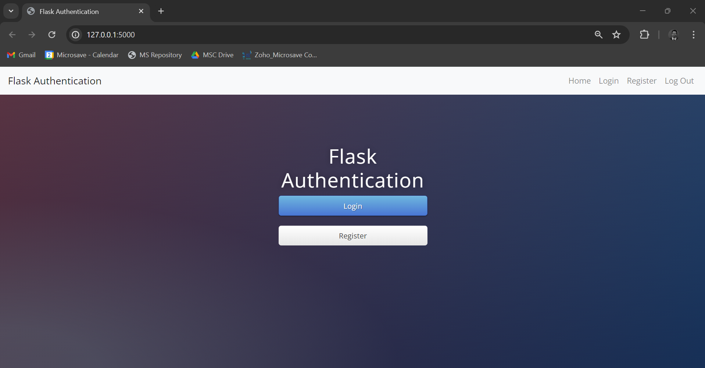
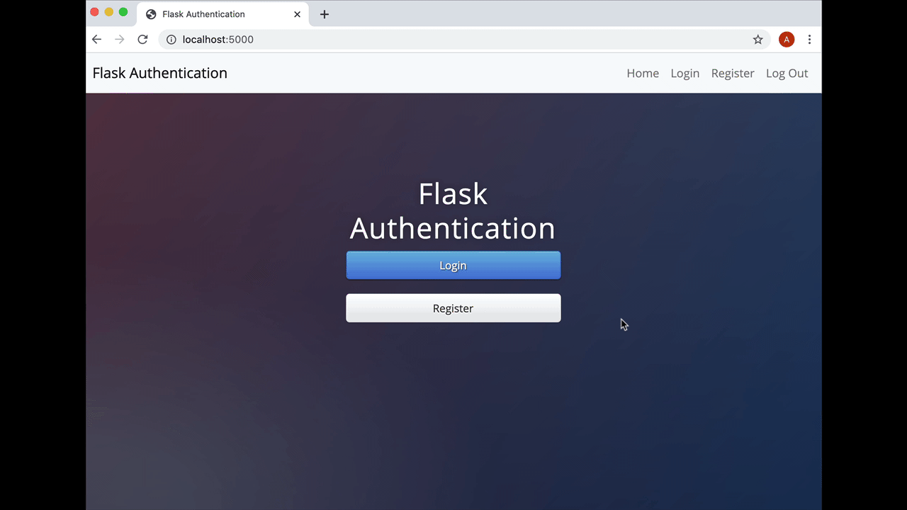
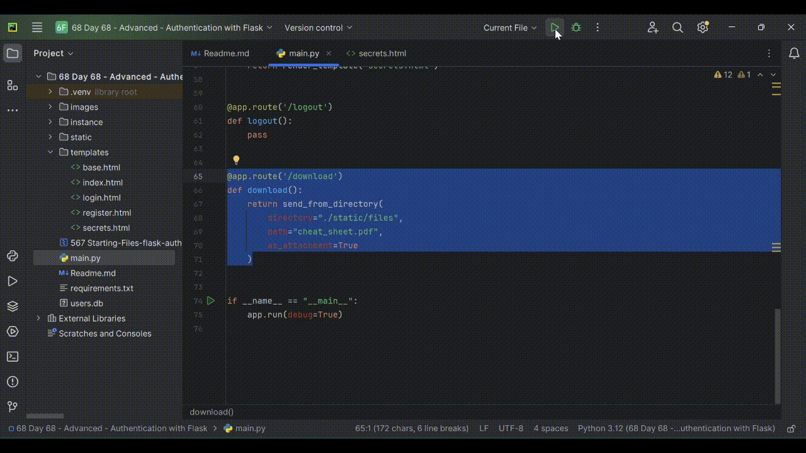

### 565 Day 68 Goals - Login and Registering Users with Authentication

So far we have created websites using Flask. We have created a blog website, a movie database, 
a coffee and wifi database etc.

The most important component of a website is having users. 
Real humans who can contribute to the website. 
If Facebook had no users then it would just be adverts. 
If blogs had no users then it would just be the ramblings of an author.

But in order to have users and associate data to user accounts, 
we need a way to register them and allow them to sign back into their accounts at a later date.

This means they will be giving us some information that we have to keep secure. 
This is what authentication is all about, how to figure out if a user really is who they say they are. 
And that is the goal of today; Figure out how to register, login and logout users with email and password. 
So they can access their own private profile pages.

Also, we're going to allow users to download a top-secret Flask Programming Cheat Sheet. 
But only when they have registered and signed up to our website.

Here's a demo of what we'll create by the end of the day:


### 566 What is Authentication_

In this module, we're going to tackle the topic of authentication.
And it's something that is often thought of as incredibly complicated, but it doesn't have to be.

So why do we need to authenticate?
Well, as we're creating our website or web app for users to use, then these users are going to start
generating data in the website.
They might like certain posts,
they might interact with other users,
there might be messages created or recipes created.
There's always going to be some user data created.

And in order to associate those pieces of data with individual users, we need to create an account
for each user. So that they would sign up to our website using a username and a password
and we would essentially create kind of like an ID card for them to uniquely identify them on our database
and to save all of the data that they generate onto that account.

Now, the other reason why you might want to add authentication to your website is to restrict access
to certain areas of the website depending on the status of the user.

Creating a website where we sign up and log in users seems simple enough, but the difficult part of
authentication comes from how secure you're going to make your website.

So we're going to learn how to progress from essentially a website that's basically secured with
a Cheeto to something that is a lot more serious and more consistent with industry standards of good
security on a website.

So the structure of our website is really, really simple.
It has a homepage which has two buttons that allows you to either go towards register or go towards
login.
And once the user has been registered or logged in and they have been authenticated, then they are
able to access the secrets page.


### 567 Download the Starting Project

1. Download the starting .zip files from this lesson (Starting Files - flask-auth-start.zip).
2. Unzip and open the project in PyCharm.
3. Make sure that the required packages (imports) are all installed and there are no red underlines.
The starting files consists of an SQLite database called users.db, I created this in the same way we created databases before.
4. Take a look a the database using DB Viewer and familiarise yourself with the fields in the database.
5. Run the app and navigate around using the buttons and navigation bar. 
All the HTML pages should already render correctly. 
The login/register forms won't work of course. 
Look through all the code and make sure that everything makes sense before you get started.

When we load up the website, this is the interface that we see - 



Also the database looks like this - 


### 568 Register New Users

In order to register new users, 
you will need to take the information they have inputted in register.html and create a new User object with email, 
name and password to save into the users.db.

Once they are registered, we will take them straight to the secrets.html page.

The secrets.html page should say "Hello <insert name>". Where the name they typed in the registration form is displayed.

This is what you are aiming for:



At this point, you should see a new entry in the database that corresponds to the data entered in the form:


1. Once the user types his/her name and credentials, capture the data.
```python
if request.method == 'POST':
    user_name = request.form['name']
    user_email = request.form['email']
    user_password = request.form['password']
```
2. Update the data in the database.
```python
with app.app_context():
    new_user = User(
        name=user_name, 
        email=user_email, 
        password=user_password)
    db.session.add(new_user)
    db.session.commit()
```
3. Upon clicking "Register", route to the Welcome page.

main.py - 
```python
return render_template("secrets.html", name_to_use=user_name)
```

secrets.html -
```html
<h1 class="title">Welcome, {{ name_to_use }}!</h1>
```

full code - 

```python
@app.route('/register', methods=['GET', 'POST'])
def register():
    if request.method == 'POST':
        user_name = request.form['name']
        user_email = request.form['email']
        user_password = request.form['password']
        # print(user_password)
        with app.app_context():
            new_user = User(
                name=user_name,
                email=user_email,
                password=user_password)
            db.session.add(new_user)
            db.session.commit()
        return render_template("secrets.html", name_to_use=user_name)
    return render_template("register.html")
```


### 569 Downloading Files

1. First go into the secrets.html page and make the anchor tag make a GET request to your server at the path /download


secrets.html - 

```html
<a href="{{ url_for('download') }}">Download Your File</a>
```

2. In the download route, use the documentation for send_from_directory() to download the cheat_sheet.pdf file when the user clicks on the "Download Your File" button.

main.py - 

```python
@app.route('/download')
def download():
    return send_from_directory(
        directory="./static/files",
        path="cheat_sheet.pdf",
        as_attachment=True
    )
```




### 570 Encryption and Hashing

So far we have only used Level 1 encryption of passwords.

This means the passwords were stored plain text in our database.
They are stored at the server level. Thus no one cannot really access them.

But that is not good enough.

Level 2 encryption will increase the security for our users on the website.
It is nothing but shifting the letters, and the number the shift will be happening by is called a key.

Well for level 2 encryption, if someone has the key, s/he can easily decode your pass.

For secure the pass even further we use a technique called hashing.

So in hashing, instead of a key there is a function that transforms the password.
And the hacker, even if he has the function and the trnasformed pass from the db, cannot retrieve the actual pass.

How does this work?

So if someone asked you to figure out two factors for the number 377, it would be a bit difficult.
However, if someone asked you to divide 377 by 13, then it would be easy.

So hashing is like this, i.e. random numbers multiplied to get the transformed pass.
But figuring out the actual pass from the transformed one, i.e. the factors from the number 377, would take some time.

That is how hashing works.


### 571 How to Hack Passwords 101

There is a website called plaintextoffenders.com

In there you will find the names of companies that are sending, when users are requesting for a pass reset,
a plaintext version of the pass. That means they are either encrypting the pass, and storing the key somewhere,
which they are using to get the actual pass, or they are simply storing the pass in the db.

Putting the user's security at risk.


### 572 Salting Passwords

We already know what hashing is. 
It's when we take a password, we run it through a hash function and we end up with a hash that we store on our database.

Passwords that are generated by humans are extremely insecure.
They tend to be very short and they tend to be dictionary words that are extremely easy to look up and create a hash table for.

In salting, in addition to the password, 
we also generate a random set of characters, and those characters along ith the user's password gets combined and 
then put through the hash function.

So the resulting hash is created from both the password as well as that random unique salt.

So that means no matter how simple the password of the user is, adding that salt increases its complexity,
increases the number of characters, and we make our user database a lot more secure.

So let's try and generate Emily's hash from her password. So we know that her password is qwerty and
we generate a random salt.

So then let's go ahead and put in her password,
qwerty, and then we append at the end that random salt that we generated and we end up with a hash.

Now this hash, however, is not the same as Tony's hash or Angela's hash because the salt is different
each time.

Now the salt is something that the user doesn't have to remember and instead, it's stored in the database with the hash.

When the user types in their password, when they try to log in, you combine their password with the salt and if you 
generate the same hash, then they must have had the same password.

Bscript is one of the industry-standard hashing algorithms that developers use to keep their users' passwords secure.

It has a concept of what's called salt rounds, how many rounds you're going to salt your password with.

So, what exactly are salt rounds?

Well, let's say that our original user password was qwerty, and we generate a random set of characters
as the salt.

So now we have qwerty and a random set of salt.
We pass it through our hash function, bcrypt, and we end up with a
hash. Now that one round of salting, if we wanted to have two rounds of salting, then we take the hash
that was generated in round one and we add the same salt from before.

And now we run it through, bcrypt, the hash function again, and we end up with a different hash.

And the number of times you do this is the number of salt rounds.


### 573 Hashing Passwords using Werkzeug

At the moment, the user's password is stored in our database as plaintext:


1. Delete the previous unhashed entry in the database.


Let's secure their password by hashing it before we store it.
To do this, we'll use the Werkzeug helper function generate_password_hash()

2. Use the documentation here and see if you can figure out how to hash and salt the user's password:

https://werkzeug.palletsprojects.com/en/1.0.x/utils/#module-werkzeug.security

Aim to hash the password using pbkdf2:sha256
And add a salt length of 8.

This is what you should end up with:


1. Delete the existing password
2. Secure the password
3. Store the hash

For convenience, I am going to make a new entry.


```python
from werkzeug.security import generate_password_hash

@app.route('/register', methods=['GET', 'POST'])
def register():
    if request.method == 'POST':
        user_name = request.form['name']
        user_email = request.form['email']
        user_password = request.form['password']
        hashed_password = generate_password_hash(
            password=user_password,
            method='pbkdf2:sha256',
            salt_length=8
        )
        print(hashed_password)
        # print(user_password)
        with app.app_context():
            new_user = User(
                name=user_name,
                email=user_email,
                password=hashed_password
            )
            db.session.add(new_user)
            db.session.commit()
        return render_template("secrets.html", name_to_use=user_name)
    return render_template("register.html")
```


### 574 Authenticating Users with Flask-Login

At the moment, if you simply navigate to /secrets you can see the secret page and the download link. 
There are no authentication barriers. 
How can we make sure that only registered/logged in users can see that page and download the file?

We'll need to secure certain routes in our server and make them only accessible if a user is authenticated.

To do this, most Flask developers will use the Flask_Login package.

HARD CHALLENGE:

Use the Flask_Login documentation to implement the /login route. 
The /secrets route should be secured so that it requires the user to be logged in.

This is what you're aiming for:


HINT 1: You will need to configure your Flask app to use Flask_Login.

```python
login_manager = LoginManager()
login_manager.init_app(app)
```

HINT 2: You will need to create a user_loader function.

```python
## CREATE TABLE IN DB
class User(UserMixin, db.Model):
    id = db.Column(db.Integer, primary_key=True)
    email = db.Column(db.String(100), unique=True)
    password = db.Column(db.String(100))
    name = db.Column(db.String(1000))


# Line below only required once, when creating DB.
# with app.app_context():
#     db.create_all()

@login_manager.user_loader
def load_user(user_id):
    return User.query.get(user_id)
```

HINT 3: Make sure you implement the UserMixin in your User class.

```text
Done Above in the User class
```

Note: A Mixin is simply a way to provide multiple inheritance to Python. This is how you add a Mixin:

class MyClass(MixinClassB, MixinClassA, BaseClass):

Further Reading on Mixins - https://www.thedigitalcatonline.com/blog/2020/03/27/mixin-classes-in-python/

HINT 4: You can check the user's password using the check_password_hash function.

```python
if check_password_hash(attempted_user.password, pass_entered):
```

HINT 5: You need to find the user by the email they entered in the login form.

```python
if request.method == 'POST':
    email_entered = request.form['email']
    # print(email_entered)
    pass_entered = request.form['password']
    # print(pass_entered)
    attempted_user = User.query.filter_by(email=email_entered).first()
```

HINT 6: If the user has successfully logged in or registered, you need to use the login_user() function to authenticate them.

```python
if check_password_hash(attempted_user.password, pass_entered):
    # print('pass checked')
    login_user(attempted_user)
```

HINT 7: Both the /secrets and /download route need to be secured so that only authenticated users can access them.

```python
@app.route('/secrets')
@login_required
def secrets():
    return render_template("secrets.html")


@app.route('/download')
@login_required
def download():
    return send_from_directory(
        directory="./static/files",
        path="cheat_sheet.pdf",
        as_attachment=True
    )
```

Putting it all together - 

```python
from flask_login import UserMixin, login_user, LoginManager, login_required

login_manager = LoginManager()
login_manager.init_app(app)

## CREATE TABLE IN DB
class User(UserMixin, db.Model):
    id = db.Column(db.Integer, primary_key=True)
    email = db.Column(db.String(100), unique=True)
    password = db.Column(db.String(100))
    name = db.Column(db.String(1000))


# Line below only required once, when creating DB.
# with app.app_context():
#     db.create_all()

@login_manager.user_loader
def load_user(user_id):
    return User.query.get(user_id)


@app.route(rule='/login', methods=['GET', 'POST'])
def login():
    if request.method == 'POST':
        email_entered = request.form['email']
        # print(email_entered)
        pass_entered = request.form['password']
        # print(pass_entered)
        attempted_user = User.query.filter_by(email=email_entered).first()
        # print('here')
        # print(attempted_user)
        # print(attempted_user.password)
        if check_password_hash(attempted_user.password, pass_entered):
            # print('pass checked')
            login_user(attempted_user)
            return render_template(
                template_name_or_list="secrets.html",
                name_to_use=attempted_user.name,
                # log_in_status=True
            )
    return render_template("login.html")
```


### 575 Flask Flash Messages

Sometimes, you will want to give the user some feedback on an action they took. 
e.g. Was there an issue with login in? 
Are they typing in the wrong password or does their email not exist? 
It would be a good user experience if, in these situations, we told them what was wrong, 
instead of just constantly redirecting them back to the login page.

The easiest way to do this is through Flask Flash messages. 
They are messages that get sent to the template to be rendered just once. 
And they disappear when the page is reloaded.

1. Update the login route so that if the user's email doesn't exist in the database, you send them a Flash message to let them know and redirect them back to the login route. e.g.


HINT: A <p> tag in the login page will show up as red text.

2. Update the login route so that if the check_password function returns False, you send a Flash message to the user when you redirect them back to the login page. e.g.


3. Update the /register route so that if the user enters an email that already exists in the database, you should redirect them to the login page and show a flash message to let them know they have already registered. e.g.


1. Update the login route, in case the email is not in the database - 

```python
attempted_user = User.query.filter_by(email=email_entered).first()
if not attempted_user:
    flash(message="That email does not exist in the db", category="info")
    return redirect(url_for('login'))
```

2. Update the login route, for incorrect password - 

```python
if check_password_hash(attempted_user.password, pass_entered):
    # print('pass checked')
    login_user(attempted_user)
    return render_template(
        template_name_or_list="secrets.html",
        name_to_use=attempted_user.name,
        # log_in_status=True
    )
else:
    flash('Wrong Password')
    return redirect(url_for('login'))
```

3.  Update the register route in case the email already exists

```python
if User.query.filter_by(email=user_email).first():
    flash(message="Email already exists in the DB", category="info")
    return redirect(url_for('login'))
```

4. Finally, since all the routes redirect to the login page, we need to put some boilerplate code in there so that the massages get displayed

```html
<div class="box">
    <h1>Login</h1>
    
    
    <ul class=flashes>
        
        <p>{{ message }}</p>
        
    </ul>
    
    
    <form action="{{ url_for('login') }}" method="post">
        <input type="text" name="email" placeholder="Email" required="required"/>
        <input type="password" name="password" placeholder="Password" required="required"/>
        <button type="submit" class="btn btn-primary btn-block btn-large">Let me in.</button>
    </form>
</div>
```


### 576 Passing Authentication Status to Templates

When a user is logged in, the home page should not show the login/register buttons. 
And the navigation bar should not show Register or Login either.

e.g.


See if you can make some changes to the code in base.html and index.html so this happens.

So basically we can access the logged-in user with the current_user proxy, 
which is available in every template:

```html

  Hi {{ current_user.name }}!

```

and this gets triggered when we log the user in - 

```python
login_user(user)
```

Keeping that in mind - 

base.html - 

```html
<ul class="navbar-nav ml-auto">
  <li class="nav-item">
    <a class="nav-link" href="{{ url_for('home') }}">Home</a>
  </li>
    
  <li class="nav-item">
    <a class="nav-link" href="{{ url_for('login') }}">Login</a>
  </li>
    <li class="nav-item">
    <a class="nav-link" href="{{ url_for('register') }}">Register</a>
  </li>
    
  <li class="nav-item">
    <a class="nav-link" href="{{ url_for('logout') }}">Log Out</a>
  </li>
</ul>
```

Similarly, we want the index.html to not show the "Login" and "Register" buttons when the user is logged in

index.html - 

```html



<div class="box">
	<h1>Flask Authentication</h1>
    
      <a href="{{ url_for('login') }}" class="btn btn-primary btn-block btn-large">Login</a>
      <a href="{{ url_for('register') }}" class="btn btn-secondary btn-block btn-large">Register</a>
    
</div>


```

Optimized the `/register` and the `/login` routes too - 

main.py - 

```python
@app.route('/register', methods=['GET', 'POST'])
def register():
    ## USER ENTERS CREDENTIALS
    if request.method == 'POST':
        user_name = request.form['name']
        user_email = request.form['email']
        user_password = request.form['password']
        hashed_password = generate_password_hash(
            password=user_password,
            method='pbkdf2:sha256',
            salt_length=8
        )
        # print(hashed_password)
        # print(user_password)
        ## USER EMAIL IS CHECKED IF IT IS ALREADY REGISTERED
        ## IF NOT, A NEW USER ENTRY IS CREATED IN THE DB
        if User.query.filter_by(email=user_email).first():
            flash(message="Email already exists in the DB", category="info")
            return redirect(url_for('login'))
        else:
            with app.app_context():
                new_user = User(
                    name=user_name,
                    email=user_email,
                    password=hashed_password
                )
                db.session.add(new_user)
                db.session.commit()
            ## THE RECENTLY REGISTERED USER IS OBTAINED FROM THE DB AND LOGGED IN    
            attempted_user = User.query.filter_by(email=user_email).first()
            login_user(attempted_user)
            ## THE SECRETS PAGE IS DISPLAYED, THE NAME IS SHOWED BASED ON THE AUTHENTICATION, SEE BELOW
            return render_template(
                template_name_or_list="secrets.html"
            )
    return render_template("register.html")
```

secrets.html - 

```html



<div class="container">
  
  <h1 class="title">Welcome, {{ current_user.name }}!</h1>
  <a href="{{ url_for('download') }}">Download Your File</a>
  
</div>

```

Now the `/login` route. 

main.py - 

```python
@app.route(rule='/login', methods=['GET', 'POST'])
def login():
    if request.method == 'POST':
        ## THE USER ENTERS HIS/HER LOGIN CREDENTIALS
        email_entered = request.form['email']
        # print(email_entered
        pass_entered = request.form['password']
        # print(pass_entered)
        ## THE CODE CHECKS THE USER CREDENTIALS IN THE DB
        attempted_user = User.query.filter_by(email=email_entered).first()
        ## IF THE EMAIL IS NOT FOUND, A FLASH MESSAGE IS DISPLAYED
        if not attempted_user:
            flash(message="That email does not exist in the db", category="info")
            return redirect(url_for('login'))
        # print('here')
        # print(attempted_user)
        # print(attempted_user.password)
        ## ELSE, MEANING IF THE EMAIL IS FOUND, THEN THE PASSWORD IS CHECKED
        else:
            ## IF THE PASS IS CORRECT, MEANING BOTH THE EMAIL AND PASS IS FOUND IN THE DB
            ## USER REDIRECTED TO THE SECRETS PAGE
            if check_password_hash(attempted_user.password, pass_entered):
                # print('pass checked')
                login_user(attempted_user)
                return render_template(
                    template_name_or_list="secrets.html"
                )
            ## IF PASS MISMATCHED, MEANING WRONG PASS, THEN A FLASH MESSAGE IS DISPLAYED
            ## USER REDIRECTED TO THE LOGIN PAGE
            else:
                flash('Wrong Password')
                return redirect(url_for('login'))
    return render_template("login.html")
```


## fin

