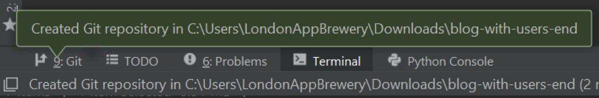
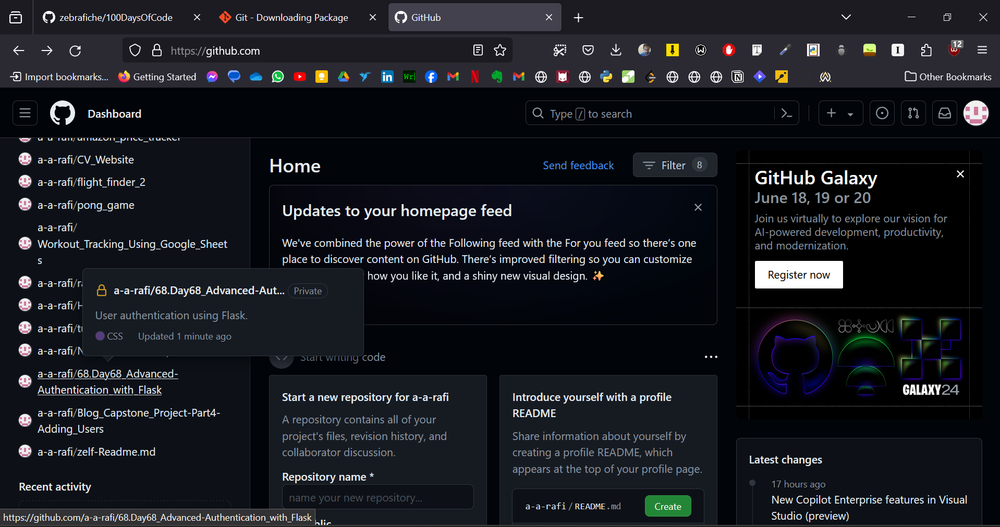
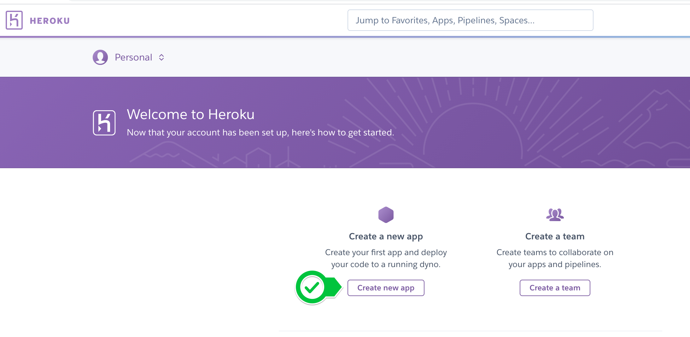
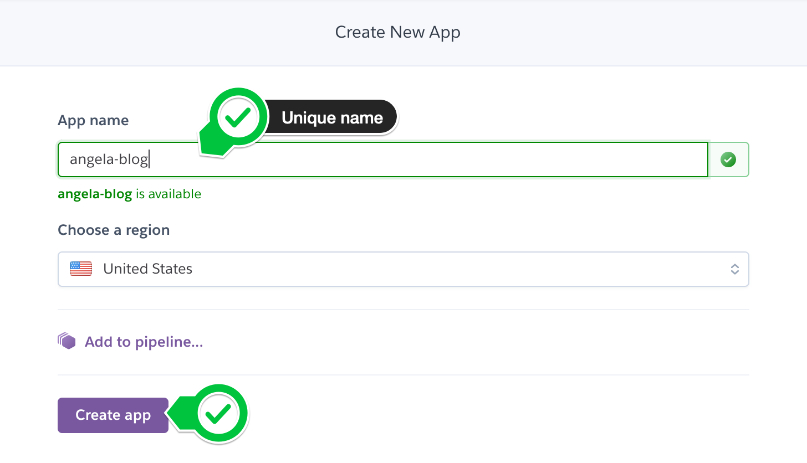
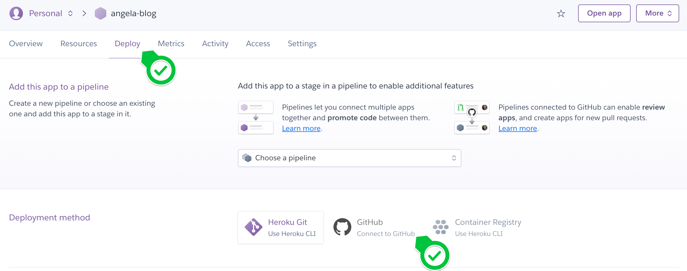

### 584 Day 70 Goals - Learn to Deploy Your Website

We will be publishing our website onto the internet.

We will learn along the way about git, github, version control, heroku, gunicorn, SQLite and PostgreSQL.


### 585 Version Control and Git

1. Download Git
2. Install in C:\Programm Files
   - Lots of settings, don't even know what means what
3. Go to C:\Programm Files\Git and open Git Bash
   - Go to the home directory by typing `$ cd ~`
   - You should see `MINGW64` as your location
   - This means that you are currently at C:\Users\User location
   - Type `$ ls` to see all the files in the directory
   - We are now ready to start working with Git
4. Open terminal/command prompt
5. Go to the desktop (cd Desktop)
   - Issue - `The system cannot find the path specified.`
     - In some systems the Desktop folder is inside the Onedrive folder
     - `C:\Users\User>cd Onedrive` and then `C:\Users\User\OneDrive>cd Desktop`
6. Create a new folder named Story
   - `C:\Users\User\OneDrive\Desktop>mkdir Story`
7. Go to the folder
   - cd Story
8. By typing `dir` you can see that the folder contains nth
9. Create a new text file in Story called chapter1.txt
   - `echo Welcome > chapter1.txt` the text file will contain the text "Welcome"
10. Open the file
    - `start chapter1.txt` 
    - write something and save the file
11. Create a local git repo and start tracking some of these file changes
    - `git init`
      - `Initialized empty Git repository in C:/Users/User/OneDrive/Desktop/Story/.git/`
12. To track the changes of the chapter1.txt file, we have to add the file inside a staging area.
13. Type `git status`
    - Output
       ```shell
       No commits yet
   
       Untracked files:
         (use "git add <file>..." to include in what will be committed)
               chapter1.txt
   
       nothing added to commit but untracked files present (use "git add" to track)
       ```
14. `git status`
      ```shell
      On branch master
      
      No commits yet
      
      Changes to be committed:
        (use "git rm --cached <file>..." to unstage)
              new file:   chapter1.txt
      ```
15. Make a commit
    - `>git commit -m "Initial Commit, written chapter1.txt"`
      ```shell
      C:\Users\User\OneDrive\Desktop\Story>git commit -m "Initial Commit, written chapter1.txt"
      [master (root-commit) efc2e63] Initial Commit, written chapter1.txt
       1 file changed, 1 insertion(+)
       create mode 100644 chapter1.txt
      ```
16. See the changes you have made
    - git log
      ```shell
      commit efc2e63c32a0efcd8165b973b373920a2b05e098 (HEAD -> master)
      Author: unknown <connect.rafiabdullah@gmail.com>
      Date:   Tue Jun 11 07:38:09 2024 +0600
      
          Initial Commit, written chapter1.txt
      ```
    - the hash in the output specifically identifies this particular commit.
17. Create some more files
   ```shell
   C:\Users\User\OneDrive\Desktop\Story>echo > chapter2.txt
   
   C:\Users\User\OneDrive\Desktop\Story>echo > chapter3.txt
   ```
   - to create empty files, type `type nul > chapter2.txt`
18. Open the files
   - chapter2
      ```shell
      C:\Users\User\OneDrive\Desktop\Story>chapter2.txt
      ```
   - chapter3
      ```shell
      C:\Users\User\OneDrive\Desktop\Story>chapter3.txt
      ```
19. Edit the contents and save them.
20. Add the two new files in the staging area
   ```shell
   >git add .
   ```
   - We could individually add them too, `git add chapter2.txt` and `git add chapter3.txt`
21. Commit the new files
   ```shell
   git commit -m "Added chapter2.txt and chapter3.txt"
   ```
   ```shell
   [master b76c5b1] Added chapter2.txt and chapter3.txt
    2 files changed, 2 insertions(+)
    create mode 100644 chapter2.txt
    create mode 100644 chapter3.txt
   ```
   ```shell
   git log
   ```
   ```shell
   commit b76c5b10b0849ed1f4b3e4b34143b858b210db2f (HEAD -> master)
   Author: unknown <connect.rafiabdullah@gmail.com>
   Date:   Tue Jun 11 09:58:13 2024 +0600
   
       Added chapter2.txt and chapter3.txt
   
   commit efc2e63c32a0efcd8165b973b373920a2b05e098
   Author: unknown <connect.rafiabdullah@gmail.com>
   Date:   Tue Jun 11 07:38:09 2024 +0600
   
       Initial Commit, written chapter1.txt
   ```
   - the `-m` syntax denotes that we are going to specify a message
22. Now let's assume we mistakenly changed the contents of chapter3.txt, we can use version control to revert back.
    - change chapter3 contents
    - check git status `git status`
      ```shell
      On branch master
      Changes not staged for commit:
        (use "git add <file>..." to update what will be committed)
        (use "git restore <file>..." to discard changes in working directory)
              modified:   chapter3.txt
      
      no changes added to commit (use "git add" and/or "git commit -a")
      ```
    - check difference `git diff chapter3.txt`
      ```shell
      diff --git a/chapter3.txt b/chapter3.txt
      index b74c2e7..439bcd0 100644
      --- a/chapter3.txt
      +++ b/chapter3.txt
      @@ -1 +1 @@
      -It was the spring of hope, it was the winter of despair.
      +ksjfhksdjfhskjdgfskjdfhgskjdfhskjdfhksjdhfksjdhfksdvbakdshffbsdjafhskjdhfvaskdjfhv
      
      C:\Users\User\OneDrive\Desktop\Story>git checkout
      M       chapter3.txt
      ```
    - if the differences are minor we can just copy from the cmd output and modify the changed file
    - but if we wanna completely roll back chapter3.txt to its previous version - `git checkout chapter3.txt`
      ```shell
      Updated 1 path from the index
      ```


### 586 What is GitHub_

Now suppose you want to commit your works to a remote repo

1. Create a repository in Github
2. Copy the link
3. You can create a new repo in your local machine or push an existing repo. We have an existing repo
4. Push the existing repo 
   - Link the local repo to the remote repo - `git remote add origin <link>`
   - Push the repo - `git push -u origin master`
     - We are going to push it to `origin`
     - And we are going to push it to the `master` branch of origin
Once you have a number of commits, it is called the master branch, the main branch of your commits or save points.

In this case, the local repo is the git file that we have inside our story repo.
The remote repo is the Github that stores our code and tracks the changes that we have made.


### 587 Step 1 - Upload Your Project to GitHub

It's time to put our blog project under version control.

**Local Version Control with PyCharm**

1. Let's put our project under version control. We can do this in PyCharm by simply going to VCS -> Enable Version Control Integration.

This is the same as what we did before with `git init`

If successful, you should now have a new Git Pane where you can see the Git Console and Git Logs.



2. All the files in our project will turn red because they are not yet added to the staging area to be tracked by git.


3. Add all the files in the project to the staging area by selecting the parent folder and going to VSC -> Git -> Add
   - In windows, select the parent directory > git > selected directory > add
   - all the files should now turn green
   - 

4. Make your initial commit by going to VCS ->  Commit
   - In windows
   - 
   - 
   - 

5. If successful, you should now be able to see your first commit in the Git Log pane


6. Push to Git Remote on GitHub

Up until now we have been working in the local machine. Now we will push (upload) the repo to the remote git.

Before we upload our code to GitHub, we should be careful that we are not uploading any secret information. e.g. personal emails or API keys.
It's quite painful to review all the code for these things, so by convention, developers tend to put the top-secret information in an environment .env file.

NOTE: Make sure that you don't have any sensitive information in your project, if you do, create a .env file and store them there. We covered environment variables on Day 35.
Then we can add a .gitignore file to tell our version control system to ignore those files when pushing to a remote.

    - Go to gitignore.io and search for a Flask gitignore template. 
    - Copy all the text in the resulting page and create a new file at the top level of your project with the name .gitignore notice the dot at the beginning of the name, this is important, it makes it a hidden file. 
    - Paste everything from the gitignore page to this file. 
    - See the walkthrough below if you're unsure.


8. Add your GitHub details to PyCharm by going to the Version Control settings.


9. Push the repo to github
    - Issue - _"cannot load information for github.com access to this site has been restricted"_
      - Update PyCharm
      - Installed JetBrains Toolbox and updted PyCharm to its latest version here.


Now, PyCharm will create a new remote repository on GitHub in your account and push all the local commits to the remote.

If successful, you should see a popup with a link to your new repository. But you can also go to your GitHub account and find the new repository:


### Practice - Upload another repo to Github

1. git init


2. Add to the staging area


3. Commit


4. Push





### 588 Step 2 - Use gunicorn and Heroku to host your website

Now that our project code is uploaded to GitHub we can use Heroku to host the code and deploy our website.

1. Sign up for a free account on www.heroku.com

2. Create a new application on Heroku:



Give your new app a unique name, I used angela-blog which means that no one else can use that name. 
It's just like a web address, it has to be unique. Leave the region as US and click Create App.

**Note - Recently, creating an app has been made available only for paying users.**



3. Connect Heroku to your GitHub project. Under the Deploy tab, select Connect to GitHub



4. Sign in to your GitHub account (the account where your blog project repository exists).

5. Search for the name of your blog project repository name (if in doubt check GitHub) and connect it to Heroku.


6. Scrolling further down the page on the deploy pane, click on Enable Automatic Deploys. 
This means that whenever you push a new commit to your remote GitHub repository, it will automatically re-deploy your server with the changes.


7. Finally, in Manual deploys, click on Deploy Branch to deploy for the first time.


NOTE: This step will take some time, but you can watch the logs for any errors and Google them if they prevent deployment. It might mean that you miss a step that we covered.

8. Once it's done, click View to see your web app, NOTE: it won't work just yet:


If everything went well, you should see the following:


It tells us to see the Heroku logs to see what went wrong.

9. Instead of using the command line as they suggested, we're going to view the logs on heroku.com

Make sure that you're in your app's dashboard page, go to More -> View Logs


In my case, it tells me that there are no web processes running:


### 589 Step 3 - Setup a WSGI server with gunicorn

[Setup a WSGI server with gunicorn.html](Setup%20a%20WSGI%20server%20with%20gunicorn.html)


### 590 Step 4 - Upgrade SQLite Database to PostgreSQL

[Upgrade SQLite Database to PostgreSQL.html](Upgrade%20SQLite%20Database%20to%20PostgreSQL.html)


