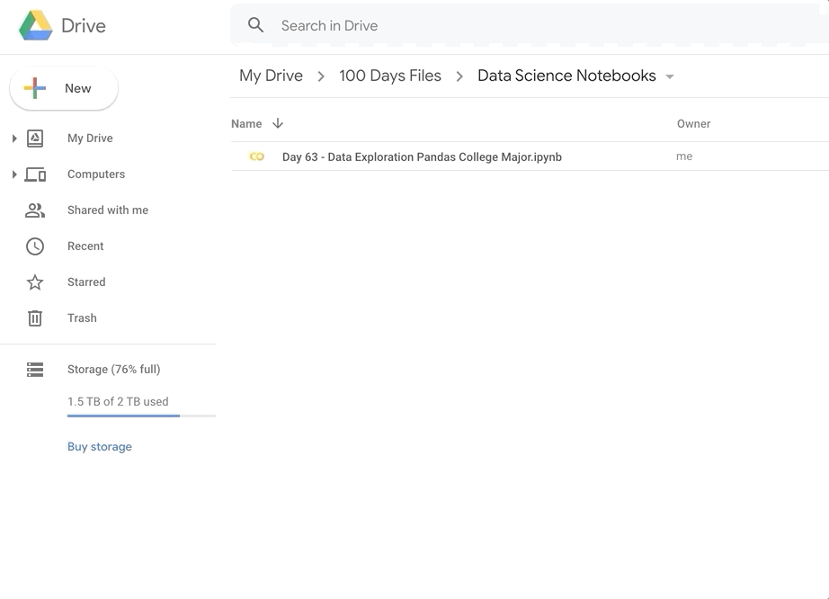

### 591 Day 71 Goals_ what you will make by the end of the day

College degrees are very expensive. 
But, do they pay you back? 
Choosing Philosophy or International Relations as a major may have worried your parents, 
but does the data back up their fears? 

PayScale Inc. did a year-long survey of 1.2 million Americans with only a bachelor's degree. 
We'll be digging into this data and use Pandas to answer these questions:

Which degrees have the highest starting salaries?
Which majors have the lowest earnings after college?
Which degrees have the highest earning potential?
What are the lowest risk college majors from an earnings standpoint?
Do business, STEM (Science, Technology, Engineering, Mathematics) or HASS (Humanities, Arts, Social Science) degrees earn more on average?


### 592 Getting Set Up for Data Science

**Introducing the Google Colab Notebook**

PyCharm is a fantastic IDE, but when we're exploring and visualising a dataset, 
you'll find the Python notebook format better suited.

Open your first Google Colab Notebook in through your Google Drive. 
You can find the Python Notebook under New → More → Google Colaboratory



Issue - Could not find colaboratory in Drive, went to google colabs and opened a new notebook instead.

If you cannot access the Google Colab Notebooks or would like to run everything locally on your computer, 
then I recommend installing Anaconda and using the bundled Jypyter Notebook instead. 
Either way works. Google Colab is essentially just an online version of Jupyter.

So these python notebook formats are offered by Jupyter and Google Colab.

Both are online services.

Depends on your preference as to which one to use.

### 593 Upload the Data and Read the .csv File

Download the salaries_by_college_major.csv file from the course resources and add this file to the notebook by dropping it into the sidebar with the little folder icon.


1. Import pandas
2. Create a dataframe
3. Take a look at the Pandas dataframe we've just created with .head(). This will show us the first 5 rows of our dataframe.

Once you hit shift + enter on your keyboard the cell will be evaluated and you should see the output automatically printed below the cell. 
This feature of automatically printing the output below in a pretty format is what makes the notebook format so lovely to work with.


### 594 Preliminary Data Exploration and Data Cleaning with Pandas

Now that we've got our data loaded into our dataframe, 
we need to take a closer look at it to help us understand what it is we are working with. 
This is always the first step with any data science project. 
Let's see if we can answer the following questions: 


1. How many rows does our dataframe have?
2. How many columns does it have?
3. What are the labels for the columns? Do the columns have names?
4. Are there any missing values in our dataframe? Does our dataframe contain any bad data?

For the rows and columns, we can use `df.shape`


For the column names, we can use `df.columns`


Missing Values and Junk Data


Before we can proceed with our analysis we should try and figure out if there are any missing or junk data in our dataframe. 
That way we can avoid problems later on. In this case, we're going to look for NaN (Not A Number) values in our dataframe. 
NAN values are blank cells or cells that contain strings instead of numbers. 
Use the .isna() method and see if you can spot if there's a problem somewhere.

Once we identify the presence of NaN values, we can use `head()` or `tail()` to get to them.


Delete the Last Row

We don't want this row in our dataframe. There's two ways you can go about removing this row. 
The first way is to manually remove the row at index 50. The second way is to simply use the .dropna() method from pandas. 
Let's create a new dataframe without the last row and examine the last 5 rows to make sure we removed the last row.


### 595 Accessing Columns and Individual Cells in a Dataframe

In pur previous lesson with pandas we have seen that

```python
import pandas
# the method you can read csv files with is read.csv
data = pandas.read_csv('./weather-data.csv')
print(data)

#         day  temp condition
# 0     Monday    12     Sunny
# 1    Tuesday    14      Rain
# 2  Wednesday    15      Rain
# 3   Thursday    14    Cloudy
# 4     Friday    21     Sunny
# 5   Saturday    22     Sunny
# 6     Sunday    24     Sunny

print(data['temp'])

# 0    12
# 1    14
# 2    15
# 3    14
# 4    21
# 5    22
# 6    24
```

To access a particular column from a data frame we can use the square bracket notation.

Find College Major with Highest Starting Salaries.


Now find the highest value in this column.


Now find which major earn this much.

In our previous lesson, we see that - 

```python
print(data[data.temp == data.temp.max()])

#       day  temp condition
# 6  Sunday    24     Sunny
```

So here the code should be -

```python
clean_df[clean_df['Starting Median Salary'] == clean_df['Starting Median Salary'].max()]
```


Also, the `.idxmax()` method will give us index for the row with the largest value.

```python
clean_df['Starting Median Salary'].idxmax()
```
```text
43
```

To see the name of the major that corresponds to that particular row, we can use the `.loc` (location) property.

```python
clean_df['Undergraduate Major'].loc[43]
```
```text
Physician Assistant
```

Here we are selecting both a column ('Undergraduate Major') and a row at index 43, so we are retrieving the value of a particular cell. 
You might see people using the double square brackets notation to achieve exactly the same thing: 

```python
clean_df['Undergraduate Major'][43]
```
```text
Physician Assistant
```

If you don't specify a particular column you can use the .loc property to retrieve an entire row:

```python
clean_df.loc[43]
```
```text
Undergraduate Major                  Physician Assistant
Starting Median Salary                           74300.0
Mid-Career Median Salary                         91700.0
Mid-Career 10th Percentile Salary                66400.0
Mid-Career 90th Percentile Salary               124000.0
Group                                               STEM
Name: 43, dtype: object
```


**Challenge**


Now that we've found the major with the highest starting salary, 
can you write the code to find the following:

What college major has the highest mid-career salary? 
How much do graduates with this major earn? (Mid-career is defined as having 10+ years of experience).

```python
clean_df.loc[clean_df['Mid-Career Median Salary'].idxmax()]
```
```text
Undergraduate Major                  Chemical Engineering
Starting Median Salary                            63200.0
Mid-Career Median Salary                         107000.0
Mid-Career 10th Percentile Salary                 71900.0
Mid-Career 90th Percentile Salary                194000.0
Group                                                STEM
Name: 8, dtype: object
```

Which college major has the lowest starting salary and how much do graduates earn after university?

```python
clean_df.loc[clean_df['Starting Median Salary'].idxmin()]
```
```text
Undergraduate Major                  Spanish
Starting Median Salary               34000.0
Mid-Career Median Salary             53100.0
Mid-Career 10th Percentile Salary    31000.0
Mid-Career 90th Percentile Salary    96400.0
Group                                   HASS
Name: 49, dtype: object
```

Which college major has the lowest mid-career salary and how much can people expect to earn with this degree? 

```python
clean_df['Mid-Career Median Salary'].min()
clean_df['Undergraduate Major'].loc[clean_df['Mid-Career Median Salary'].idxmin()]
```
```text
52000.0
Education
```

### 596 Solution_ Highest and Lowest Earning Degrees

### 597 Sorting Values & Adding Columns_ Majors with the Most Potential vs Lowest Risk

Lowest Risk Majors

A low-risk major is a degree where there is a small difference between the lowest and highest salaries. 
In other words, if the difference between the 10th percentile and the 90th percentile earnings of your major is small, 
then you can be more certain about your salary after you graduate.

How would we calculate the difference between the earnings of the 10th and 90th percentile? 
Well, Pandas allows us to do simple arithmetic with entire columns, 
so all we need to do is take the difference between the two columns:

```python
clean_df['Mid-Career 90th Percentile Salary'] - clean_df['Mid-Career 10th Percentile Salary']
```
Alternatively, you can also use the .subtract() method.

```python
clean_df['Mid-Career 90th Percentile Salary'].subtract(clean_df['Mid-Career 10th Percentile Salary'])
```

The output of this computation will be another Pandas dataframe column. 
We can add this to our existing dataframe with the `.insert()` method:

```python
spread_col = clean_df['Mid-Career 90th Percentile Salary'] - clean_df['Mid-Career 10th Percentile Salary']
clean_df.insert(1, 'Spread', spread_col)
clean_df.head()
```

The first argument is the position of where the column should be inserted. 
In our case, it's at position 1, so the second column.


Sorting by the Lowest Spread

To see which degrees have the smallest spread, we can use the .sort_values() method. 
And since we are interested in only seeing the name of the degree and the major, 
we can pass a list of these two column names to look at the `.head()` of these two columns exclusively.

```python
# we want the sort to be in an ascending order, values arranged from smallest to largest
low_risk = clean_df.sort_values('Spread', ascending=True)
low_risk[['Undergraduate Major', 'Spread']].head()
```


You can also bring up the quick documentation with `shift + tab` on your keyboard directly in the Python notebook.
Or you can just hover the cursor over `sort.values()` and it will show the quick doc.

Challenge


Using the `.sort_values()` method, can you find the degrees with the highest potential? 
Find the top 5 degrees with the highest values in the 90th percentile.

```python
clean_df.sort_values('Mid-Career 90th Percentile Salary', ascending=False).head()
```

Also, find the degrees with the greatest spread in salaries. 
Which majors have the largest difference between high and low earners after graduation.

```python
high_risk = clean_df.sort_values('Spread', ascending=False)
high_risk[['Undergraduate Major', 'Spread']].head()
```


### 598 Solution_ Degrees with the Highest Potential

Notice how 3 of the top 5 are present in both. 
This means that there are some very high earning Economics degree holders out there, but also some who are not earning as much. 
It's actually quite interesting to compare these two rankings versus the degrees where the median salary is very high.

```python
high_overall = clean_df.sort_values('Mid-Career Median Salary', ascending=False)
high_overall[['Undergraduate Major', 'Spread', 'Mid-Career Median Salary']].head()
```


### 599 Grouping and Pivoting Data with Pandas

Often times you will want to sum rows that belong to a particular category. 
For example, which category of degrees has the highest average salary? 
Is it STEM, Business or HASS (Humanities, Arts, and Social Science)? 

To answer this question we need to learn to use the `.groupby()` method. 
This allows us to manipulate data similar to a Microsoft Excel Pivot Table.

We have three categories in the 'Group' column: STEM, HASS and Business. 
Let's count how many majors we have in each category.

```python
clean_df.groupby('Group').count()
```


**Challenge**

Now can you use the .mean() method to find the average salary by group? 

```python
clean_df.groupby(['Group']).mean(numeric_only=True)
```


We can tell Pandas to print the numbers in our notebook to look like 1,012.45 with the following line:

```python
pd.options.display.float_format = '{:,.2f}'.format 
```


Extra Credit:

The PayScale dataset used in this lesson was from 2008 and looked at the prior 10 years. 
Notice how Finance ranked very high on post-degree earnings at the time. 
However, we all know there was a massive financial crash in that year. 
Perhaps things have changed. 
Can you use what you've learnt about web scraping in the prior lessons (e.g., Day 45) and share some updated information from PayScale's website in the comments below? 

```python
from bs4 import BeautifulSoup
import requests
import time
import pandas as pd


# Access the Website
url = 'https://www.payscale.com/college-salary-report/majors-that-pay-you-back/bachelors'
headers = {
    'User-Agent': 'Mozilla/5.0 (Windows NT 10.0; Win64; x64) AppleWebKit/537.36 (KHTML, like Gecko) Chrome/109.0.0.0 Safari/537.36',
}
response = requests.get(url, headers=headers)
time.sleep(3.0)
# print(response.text)
print(response.status_code)
soup = BeautifulSoup(response.text, features='html.parser')

# Get the Data
# print(soup.find(name='h1', class_='csr-gridpage__header'))
ranks = soup.find_all(name='td', class_='csr-col--rank')
ranks_list = []
for rank in ranks:
    ranks_list.append(rank.getText().split(":")[1])
print(ranks_list)  # this is column 1

majors = soup.find_all(name='td', class_='csr-col--school-name')
majors_list = []
for major in majors:
    majors_list.append(major.getText().split(':')[1])
print(majors_list)  # this is column 2

starting_salaries = soup.find_all(name='td', class_='csr-col--right')
starting_median_salary_list = []
mid_career_median_salary_list = []
for salary in starting_salaries:
    data_title = salary.getText().split(':')[0]
    if data_title == "Early Career Pay":
        starting_median_salary_list.append(salary.getText().split(':')[1])
    elif data_title == "Mid-Career Pay":
        mid_career_median_salary_list.append(salary.getText().split(':')[1])
print(starting_median_salary_list)  # this is column 3
print(mid_career_median_salary_list)  # this is column 4

# rows = soup.find_all(name='td')
# rows_list = []
# for row in rows:
#     rows_list.append(row.getText())
# print(rows_list)


# Save the data in an excel

data_dict = {
    "Rank": ranks_list,
    "Major": majors_list,
    "Starting Median Salary": starting_median_salary_list,
    "Mid-Career Median Salary": mid_career_median_salary_list
}

# print(data_dict)

dataframe = pd.DataFrame(data_dict)
print(dataframe)

csv_output = dataframe.to_csv('./salary_data.csv')
```

### 600 Learning Points & Summary

Today's Learning Points


Use .head(), .tail(), .shape and .columns to explore your DataFrame and find out the number of rows and columns as well as the column names.

Look for NaN (not a number) values with .findna() and consider using .dropna() to clean up your DataFrame.

You can access entire columns of a DataFrame using the square bracket notation: df['column name'] or df[['column name 1', 'column name 2', 'column name 3']]

You can access individual cells in a DataFrame by chaining square brackets df['column name'][index] or using df['column name'].loc[index]

The largest and smallest values, as well as their positions, can be found with methods like .max(), .min(), .idxmax() and .idxmin()

You can sort the DataFrame with .sort_values() and add new columns with .insert()

To create an Excel Style Pivot Table by grouping entries that belong to a particular category use the .groupby() method


