### 601 Day 72 Goals_ what you will make by the end of the day

**Analyse the Popularity of Different Programming Languages over Time**


The oldest programming language still in use today is FORTRAN, which was developed in 1957. 
Since then many other programming languages have been developed. 
But which programming language is the most popular? Which programming language is the Kim Kardashian of programming languages; the one people just can't stop talking about? 


StackOverflow will help us answer this burning question. 
Each post on Stack OverFlow comes with a Tag. And this Tag can be the name of a programming language.

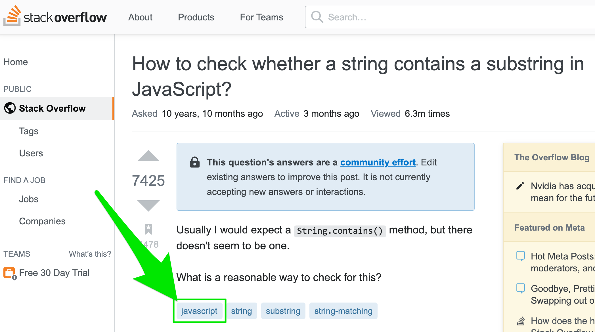

To figure out which language is the most popular, all we need to do is count the number of posts on Stack Overflow that are tagged with each language. 
The language with the most posts wins!


### 602 Download and Open the Starter Notebook

**Open the Template**

To help you with your Data Science journey I'll provide you with starter notebook which already has some of the sections and challenges laid out.

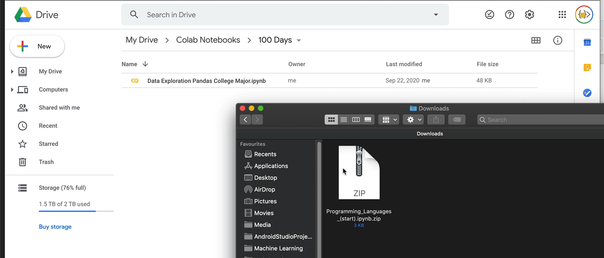

**Import the Data**

In this lesson, I've also included a QueryResults.csv file with the Stack Overflow data that we'll be using. 
Download this .csv and add it to your notebook.

**Challenge**

- Read the .csv file and store it in a Pandas DataFrame called df. Have a look at the read_csv() documentation and try to provide these column names: ['DATE', 'TAG', 'POSTS']

```python
import pandas as pd

data = pd.read_csv('./602 QueryResults.csv')
# print(data)

# column names: ['DATE', 'TAG', 'POSTS']
data.columns = ['DATE', 'TAG', 'POSTS']
print(data)
```
OR
```python
df = pd.read_csv('QueryResults.csv', names=['DATE', 'TAG', 'POSTS'], header=0)
# Setting the header row to 0 allows us to substitute our own column names.
```
```text
                     DATE         TAG  POSTS
0     2008-07-01 00:00:00          c#      3
1     2008-08-01 00:00:00    assembly      8
2     2008-08-01 00:00:00  javascript    162
3     2008-08-01 00:00:00           c     85
4     2008-08-01 00:00:00      python    124
...                   ...         ...    ...
1986  2020-07-01 00:00:00           r   5694
1987  2020-07-01 00:00:00          go    743
1988  2020-07-01 00:00:00        ruby    775
1989  2020-07-01 00:00:00        perl    182
1990  2020-07-01 00:00:00       swift   3607

[1991 rows x 3 columns]
```

- Look at the first and last 5 rows of the DataFrame.

```python
print(data.head(n=5))
print(data.tail(n=5))
```
```text
                  DATE         TAG  POSTS
0  2008-07-01 00:00:00          c#      3
1  2008-08-01 00:00:00    assembly      8
2  2008-08-01 00:00:00  javascript    162
3  2008-08-01 00:00:00           c     85
4  2008-08-01 00:00:00      python    124
                     DATE    TAG  POSTS
1986  2020-07-01 00:00:00      r   5694
1987  2020-07-01 00:00:00     go    743
1988  2020-07-01 00:00:00   ruby    775
1989  2020-07-01 00:00:00   perl    182
1990  2020-07-01 00:00:00  swift   3607
```
- How many rows and how many columns does it have?

```python
print(data.shape)
```
```text
(1991, 3)
```
- Count the number of entries in each column.

```python
print(data.count('index'))
```
OR
```python
print(data.count())
```
```text
DATE     1991
TAG      1991
POSTS    1991
dtype: int64
```
### 603 Solution_ Preliminary Data Exploration

Next Challenge


The TAG is the name of the programming language. 
So for example in July 2008, there were 3 posts tagged with the language C#. 
Given that the TAG serves as our category column, can you figure out how to count the number of posts per language? 
Which programming language had the most number of posts since the creation of Stack Overflow? 
(Hint: you may need to review one of yesterday's lessons).

- Total number of posts per language

```python
print(data.groupby('TAG').sum())
```
```text
                                                         DATE    POSTS
TAG                                                                   
assembly    2008-08-01 00:00:002008-09-01 00:00:002008-10-...    34852
c           2008-08-01 00:00:002008-09-01 00:00:002008-10-...   336042
c#          2008-07-01 00:00:002008-08-01 00:00:002008-09-...  1423530
c++         2008-08-01 00:00:002008-09-01 00:00:002008-10-...   684210
delphi      2008-08-01 00:00:002008-09-01 00:00:002008-10-...    46212
go          2009-11-01 00:00:002009-12-01 00:00:002010-01-...    47499
java        2008-08-01 00:00:002008-09-01 00:00:002008-10-...  1696403
javascript  2008-08-01 00:00:002008-09-01 00:00:002008-10-...  2056510
perl        2008-08-01 00:00:002008-09-01 00:00:002008-10-...    65286
php         2008-08-01 00:00:002008-09-01 00:00:002008-10-...  1361988
python      2008-08-01 00:00:002008-09-01 00:00:002008-10-...  1496210
r           2008-09-01 00:00:002008-11-01 00:00:002008-12-...   356799
ruby        2008-08-01 00:00:002008-09-01 00:00:002008-10-...   214582
swift       2009-01-01 00:00:002009-02-01 00:00:002009-03-...   273055
```
- Which programming language had the most number of posts since the creation of Stack Overflow? 

```python
print(data.groupby('TAG').sum()['POSTS'])
```
```text
TAG
assembly        34852
c              336042
c#            1423530
c++            684210
delphi          46212
go              47499
java          1696403
javascript    2056510
perl            65286
php           1361988
python        1496210
r              356799
ruby           214582
swift          273055
```
```python
print(data.groupby('TAG').sum()['POSTS'].idxmax())
```
```text
javascript
```
```python
print(data.groupby('TAG').sum()['POSTS'].loc['javascript'])
```
```text
2056510
```

Also, some languages are older like C and other languages are newer (like Swift). 
The dataset starts in July 2008, so some languages will not have any posts for every month. 
Can you count how many months of posts exist for each programming language?

- How many months of posts exist for each programming language?

For example, every month will have an entry titled "javascript".
Count the number of occurrences of the title "javascript" and you get how many months had 'javascript' entries.
In other words, how many months contain 'javascript' posts.

```python
print(data.groupby('TAG').count())
```
```text
            DATE  POSTS
TAG                    
assembly     144    144
c            144    144
c#           145    145
c++          144    144
delphi       144    144
go           129    129
java         144    144
javascript   144    144
perl         144    144
php          144    144
python       144    144
r            142    142
ruby         144    144
swift        135    135
```
```python
print(data.groupby('TAG').count()['DATE'])
```
```text
TAG
assembly      144
c             144
c#            145
c++           144
delphi        144
go            129
java          144
javascript    144
perl          144
php           144
python        144
r             142
ruby          144
swift         135
Name: DATE, dtype: int64
```
```python
print(data.groupby('TAG').count()['DATE'].idxmin())
```
```text
go
```

### 604 Solution_ Analysis by Programming Language

### 605 Data Cleaning_ Working with Time Stamps

Let's fix the date format to make it more readable. 
We need to use Pandas to change format from a string of "2008-07-01 00:00:00" to a datetime object with the format of "2008-07-01"

```python
print(data['DATE'][1])
print(type(data['DATE'][1]))
```

```text
2008-08-01 00:00:00
<class 'str'>
```

```python
data['DATE'] = pd.to_datetime(data['DATE'])
print(data.head(n=3))
```

```text
        DATE         TAG  POSTS
0 2008-07-01          c#      3
1 2008-08-01    assembly      8
2 2008-08-01  javascript    162
```

### 606 Data Manipulation_ Pivoting DataFrames

**The .pivot() method**

Sometimes you want to convert your DataFrame so that each category has its own column. 
For example, suppose you needed to take the table below and create a separate column for each actor, 
where each row is the Age of the actor:

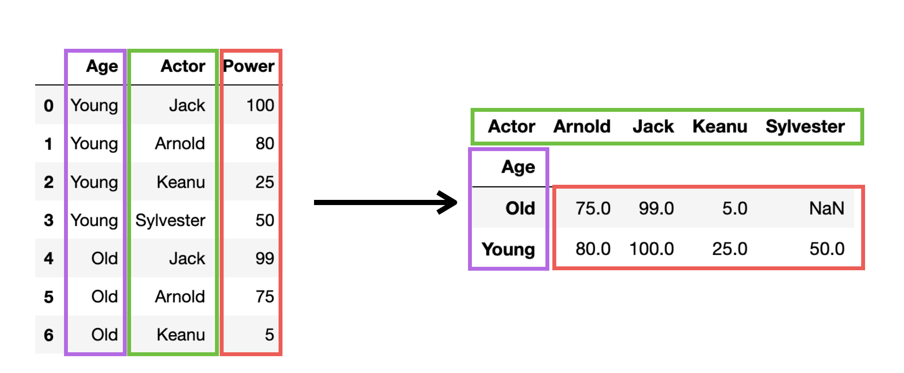

How would you do this with the DataFrame below? 

```text
test_df = pd.DataFrame({'Age': ['Young', 'Young', 'Young', 'Young', 'Old', 'Old', 'Old', 'Old'],
                        'Actor': ['Jack', 'Arnold', 'Keanu', 'Sylvester', 'Jack', 'Arnold', 'Keanu', 'Sylvester'],
                        'Power': [100, 80, 25, 50, 99, 75, 5, 30]})
test_df
```

The easiest way to accomplish this is by using the .pivot() method in Pandas. 
Try the example for yourself. 
The thing to understand is how to supply the correct arguments to get the desired outcome. 
The index are the categories for the rows. The columns are the categories for the columns. 
And the values are what you want in the new cells. 

```text
pivoted_df = test_df.pivot(index='Age', columns='Actor', values='Power')
pivoted_df
```

However, there's one very important thing to notice. What happens if a value is missing? 
In the example above there's no value for old Sylvester. 
In this case, the .pivot() method will insert a NaN value.

**Mini-Challenge**

- Can you pivot the df DataFrame so that each row is a date and each column is a programming language? Store the result under a variable called reshaped_df. 
```python
reshaped_df = data.pivot(index='DATE', columns='TAG', values='POSTS')
print(reshaped_df)
```
```text
TAG         assembly       c       c#     c++  ...   python       r   ruby   swift
DATE                                           ...                                
2008-07-01       NaN     NaN      3.0     NaN  ...      NaN     NaN    NaN     NaN
2008-08-01       8.0    85.0    511.0   164.0  ...    124.0     NaN   73.0     NaN
2008-09-01      28.0   321.0   1649.0   755.0  ...    542.0     6.0  290.0     NaN
2008-10-01      15.0   303.0   1989.0   811.0  ...    510.0     NaN  249.0     NaN
2008-11-01      17.0   259.0   1730.0   735.0  ...    452.0     1.0  160.0     NaN
...              ...     ...      ...     ...  ...      ...     ...    ...     ...
2020-03-01     317.0  2670.0   8954.0  5107.0  ...  26673.0  5761.0  780.0  3434.0
2020-04-01     406.0  3472.0  10042.0  6820.0  ...  32605.0  7047.0  860.0  4015.0
2020-05-01     386.0  3602.0   9923.0  7063.0  ...  34478.0  6833.0  774.0  4066.0
2020-06-01     363.0  2757.0   9064.0  6161.0  ...  31817.0  6249.0  670.0  3733.0
2020-07-01     298.0  2294.0   9145.0  5756.0  ...  31261.0  5694.0  775.0  3607.0

[145 rows x 14 columns]
```

- Examine the dimensions of the reshaped DataFrame. How many rows does it have? How many columns?

```python
print(reshaped_df.shape)
```

- Examine the head and the tail of the DataFrame. What does it look like?

```python
print(reshaped_df.head(n=5))
print(reshaped_df.head(n=5))
```

- Print out the column names.
```python
print(reshaped_df.columns.values)
```
```text
['assembly' 'c' 'c#' 'c++' 'delphi' 'go' 'java' 'javascript' 'perl' 'php'
 'python' 'r' 'ruby' 'swift']
```
- Count the number of entries per column.
```python
print(reshaped_df.count(axis='index'))
```
```text
TAG
assembly      144
c             144
c#            145
c++           144
delphi        144
go            129
java          144
javascript    144
perl          144
php           144
python        144
r             142
ruby          144
swift         135
dtype: int64
```

Change the Nan values to 0
```python
print(reshaped_df.fillna(0))

reshaped_df.fillna(0, inplace=True)
```

The `inplace` argument ensures that the original `reshaped_df` gets modified.

We can also check if there are any NaN values left in the entire DataFrame with this line:

```python
reshaped_df.isna().values.any()
```
```text
True
```

### 607 Data Visualisation with Matplotlib

**Matplotlib**

To create our first charts we're going to use a library called Matplotlib.

**Mini Challenge**

You can actually show a line chart for the popularity of a programming language using only a single line of code. 
Try and plot the popularity of the Java programming language.

So the x-axis can contain the year and the y-axis the number of posts.

```python
plt.plot(reshaped_df['java'])
plt.show()
```
OR
```python
plt.plot(reshaped_df.index, reshaped_df['java'])
plt.show
```

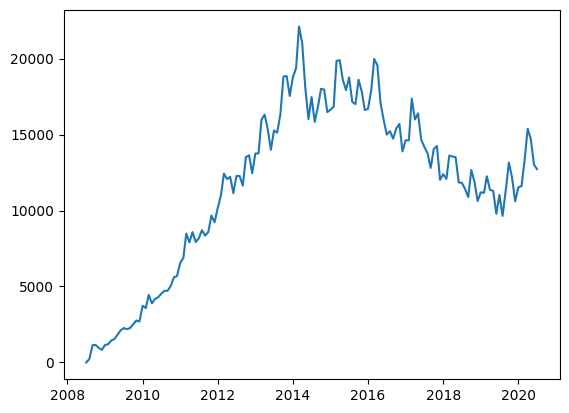

**Styling the Chart**

Let's look at a couple of methods that will help us style our chart:

`.figure()` - allows us to resize our chart
`.xticks()` - configures our x-axis
`.yticks()` - configures our y-axis
`.xlabel()` - add text to the x-axis
`.ylabel()` - add text to the y-axis
`.ylim()` - allows us to set a lower and upper bound

To make our chart larger we can provide a width (16) and a height (10) as the `figsize` of the figure.

```python
plt.figure(figsize =(16, 10))
```
```text
<Figure size 1600x1000 with 0 Axes>
<Figure size 1600x1000 with 0 Axes>
```

Now that the figure generation has been considered, draw the chart again.

```python
plt.figure(figsize =(16, 10))
plt.plot(reshaped_df.index, reshaped_df['java'])
```

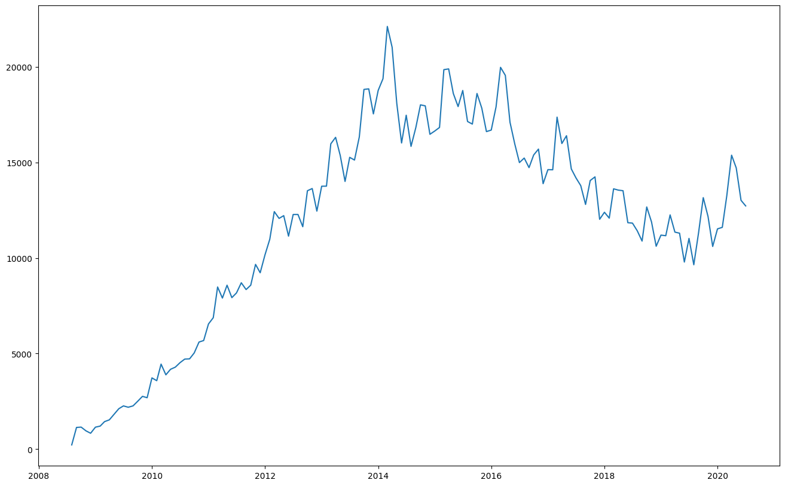

This will make our chart easier to see. But when we increase the size of the chart, 
we should also increase the `fontsize` of the ticks on our axes so that they remain easy to read:

```python
plt.figure(figsize =(16, 10))
plt.xticks(fontsize=14)
plt.yticks(fontsize=14)
plt.plot(reshaped_df.index, reshaped_df['java'])
```

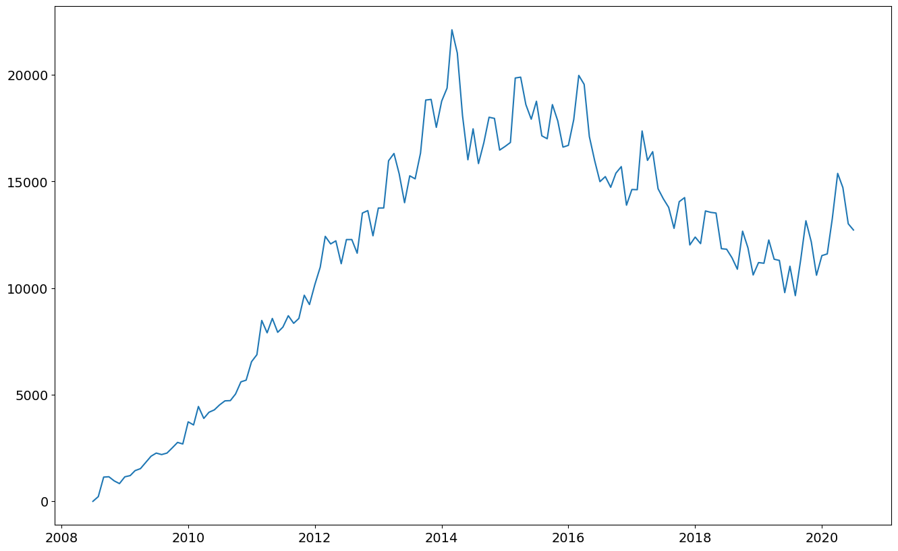

Now we can add labels. 
Also, we're never going to get less than 0 posts, so let's set a lower limit of 0 for the y-axis with .ylim().

```python
plt.figure(figsize =(16, 10))
plt.xticks(fontsize=14)
plt.yticks(fontsize=14)
plt.xlabel('Date', fontsize=14)
plt.ylabel('Number of Posts', fontsize=14)
plt.ylim(0, 35000)
plt.plot(reshaped_df.index, reshaped_df['java'])
```

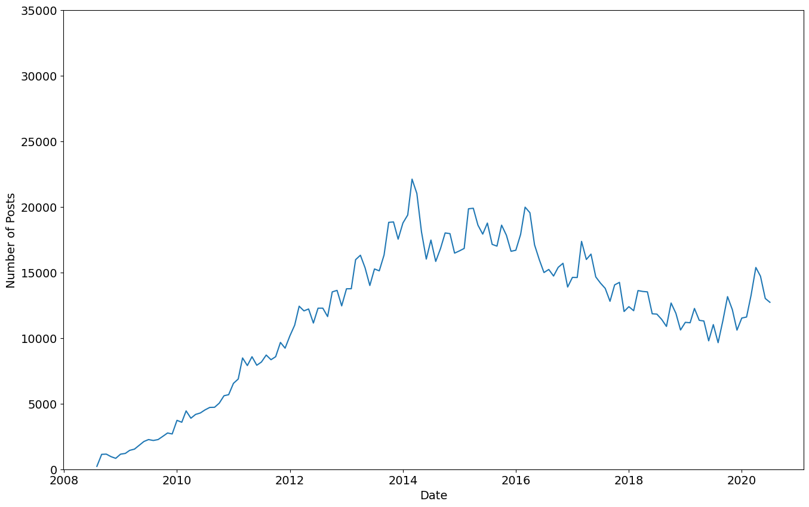

Now that you've successfully created and styled your chart, 
can you figure out how to plot both Java and Python next to each other?

**Challenge: Show two line (e.g. for Java and Python) on the same chart.**

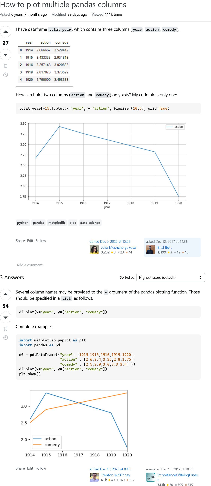

```python
plt.figure(figsize =(16, 10))
plt.xticks(fontsize=14)
plt.yticks(fontsize=14)
plt.xlabel('Date', fontsize=14)
plt.ylabel('Number of Posts', fontsize=14)
plt.ylim(0, 35000)
plt.plot(reshaped_df.index, reshaped_df['java'], reshaped_df['python'])
```

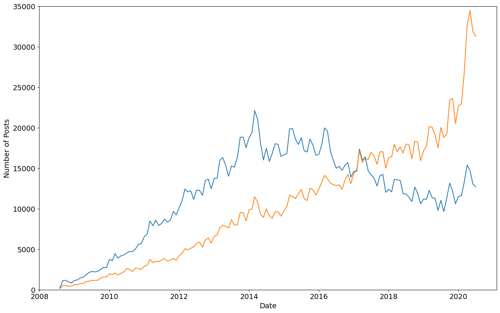


### 608 Multi-Line Charts with Matplotib

**Solution: Two Line Charts Next to Each Other**

The trick is simply calling the .plot() method twice. That's all there is to it! =)

```python
plt.figure(figsize =(16, 10))
plt.xticks(fontsize=14)
plt.yticks(fontsize=14)
plt.xlabel('Date', fontsize=14)
plt.ylabel('Number of Posts', fontsize=14)
plt.ylim(0, 35000)
plt.plot(reshaped_df.index, reshaped_df['java'])
plt.plot(reshaped_df.index, reshaped_df['python'])
```

But what if we wanted to plot all the programming languages on the same chart? 
We don't want to type out .plot() a million times, right? 
We can actually just use a for-loop:

```python
plt.figure(figsize =(16, 10))
plt.xticks(fontsize=14)
plt.yticks(fontsize=14)
plt.xlabel('Date', fontsize=14)
plt.ylabel('Number of Posts', fontsize=14)
plt.ylim(0, 35000)
for column in reshaped_df.columns:
  plt.plot(reshaped_df.index, reshaped_df[column])
```

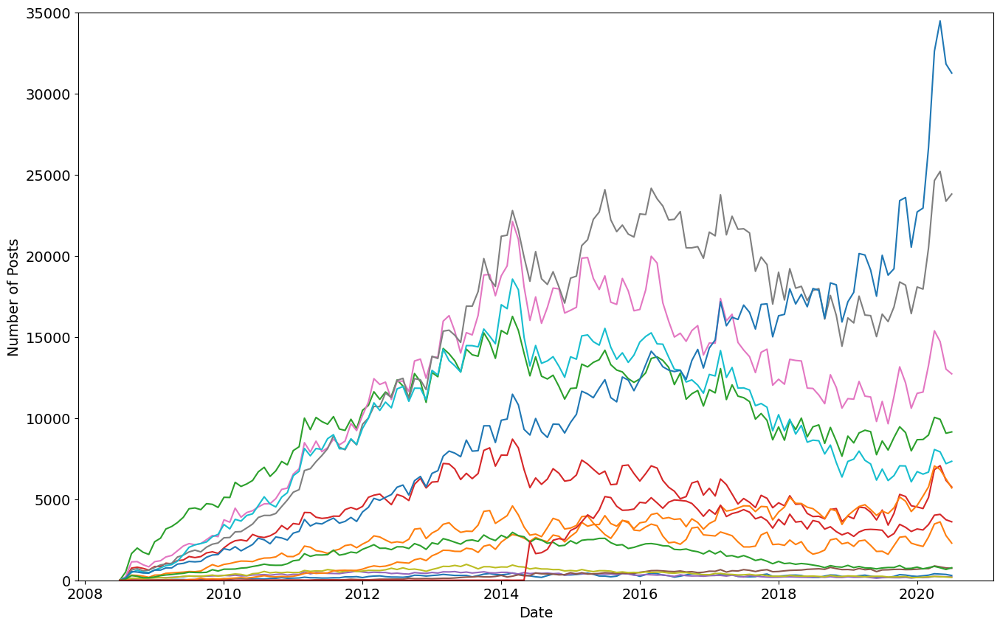

But wait, which language is which? 
It's really hard to make out without a legend that tells us which colour corresponds to each language. 
Let's modify the plotting code to add a label for each line based on the column name (and make the lines thicker at the same time using linewidth). 
Then let's add a legend to our chart:

```python
plt.figure(figsize=(16,10))
plt.xticks(fontsize=14)
plt.yticks(fontsize=14)
plt.xlabel('Date', fontsize=14)
plt.ylabel('Number of Posts', fontsize=14)
plt.ylim(0, 35000)
for column in reshaped_df.columns:
    plt.plot(reshaped_df.index, reshaped_df[column], 
             linewidth=3, label=reshaped_df[column].name)
plt.legend(fontsize=16) 
```

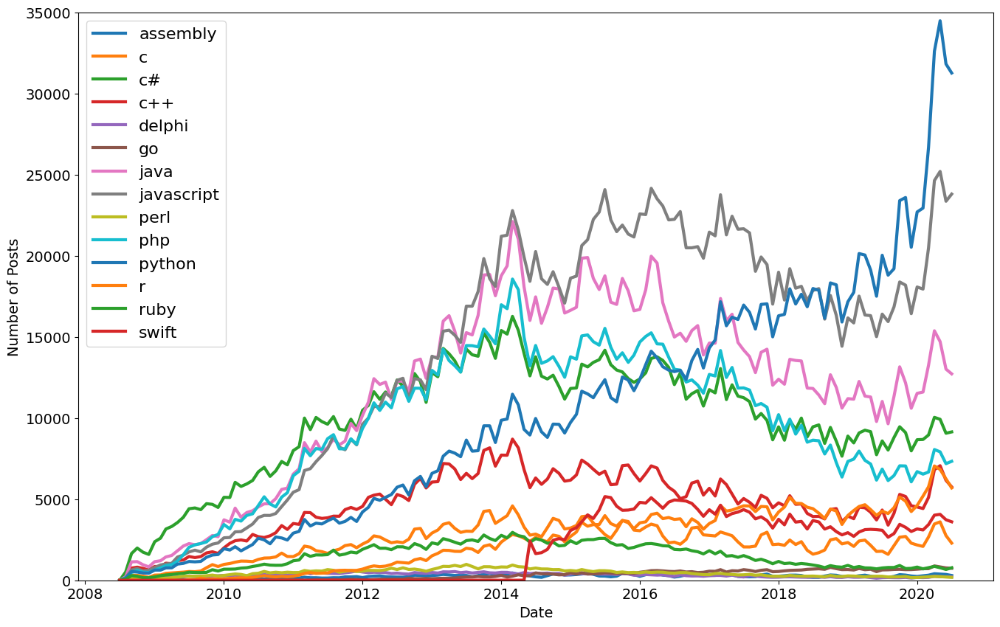

Looks like Python is the most popular programming language judging by the number of posts on Stack Overflow! 
Python for the win! =)


### 609 Smoothing out Time-Series Data

Looking at our chart we see that time-series data can be quite noisy, 
with a lot of up and down spikes. 
This can sometimes make it difficult to see what's going on.


A useful technique to make a trend apparent is to smooth out the observations by taking an average. 
By averaging say, 6 or 12 observations we can construct something called the rolling mean. 
Essentially we calculate the average in a window of time and move it forward by one observation at a time.

Since this is such a common technique, Pandas actually two handy methods already built-in: rolling() and mean(). 
We can chain these two methods up to create a DataFrame made up of the averaged observations.

```python
# The window is number of observations that are averaged
roll_df = reshaped_df.rolling(window=6).mean()
plt.figure(figsize=(16,10))
plt.xticks(fontsize=14)
plt.yticks(fontsize=14)
plt.xlabel('Date', fontsize=14)
plt.ylabel('Number of Posts', fontsize=14)
plt.ylim(0, 35000)
# plot the roll_df instead
for column in roll_df.columns:
    plt.plot(roll_df.index, roll_df[column], 
             linewidth=3, label=roll_df[column].name)
plt.legend(fontsize=16)
```

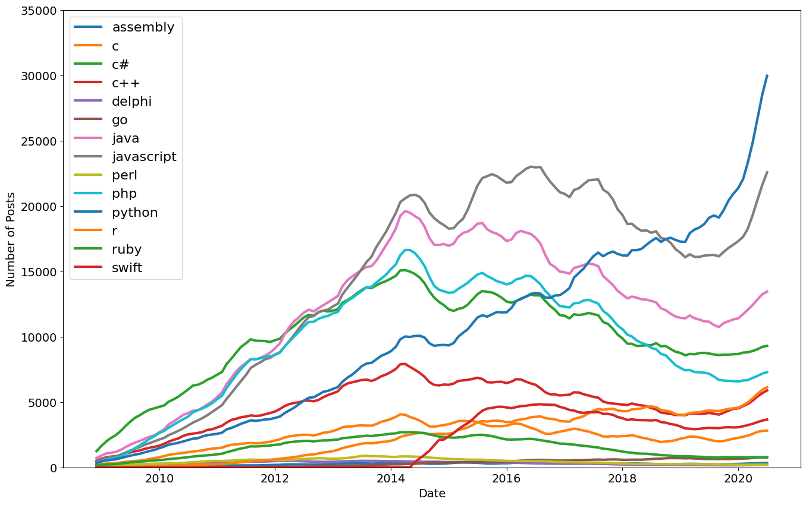

Play with the window argument (use 3 or 12) and see how the chart changes!

```python
# The window is number of observations that are averaged
roll_df = reshaped_df.rolling(window=12).mean()
plt.figure(figsize=(16,10))
plt.xticks(fontsize=14)
plt.yticks(fontsize=14)
plt.xlabel('Date', fontsize=14)
plt.ylabel('Number of Posts', fontsize=14)
plt.ylim(0, 35000)
# plot the roll_df instead
for column in roll_df.columns:
    plt.plot(roll_df.index, roll_df[column], 
             linewidth=3, label=roll_df[column].name)
plt.legend(fontsize=16)
```

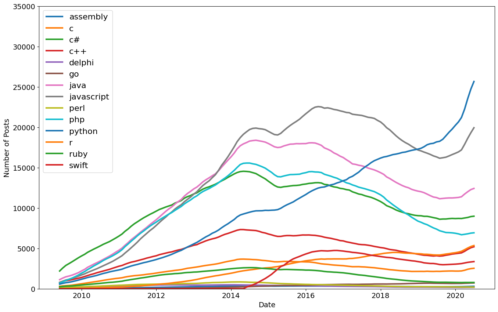


### 610 [quiz] Programming Language Data Analysis

```text
Looking at the data, what was the most popular programming language from 2008 to 2012 by the number of posts?

- Python
- Javascript
- Assembly
- C#
```

```text
What was the most popular programming language from 2015 to 2018?

- Python
- Java
- Javascript
- PHP
```

```text
What was the most popular programming language in 2020?

- Javascript
- Python
- Not Python
```

### 610 Learning Points & Summary

Congratulations on completing another challenging data science project! 
Today we've seen how to grab some raw data and create some interesting charts using Pandas and Matplotlib. - We've

- used `.groupby()` to explore the number of posts and entries per programming language

- converted strings to Datetime objects with `to_datetime()` for easier plotting

- reshaped our DataFrame by converting categories to columns using `.pivot()`

- used `.count()` and `isna().values.any()` to look for NaN values in our DataFrame, which we then replaced using `.fillna()`

- created (multiple) line charts using `.plot()` with a for-loop

- styled our charts by changing the size, the labels, and the upper and lower bounds of our axis.

- added a legend to tell apart which line is which by colour

- smoothed out our time-series observations with `.rolling().mean()` and plotted them to better identify trends over time.


#### fin
