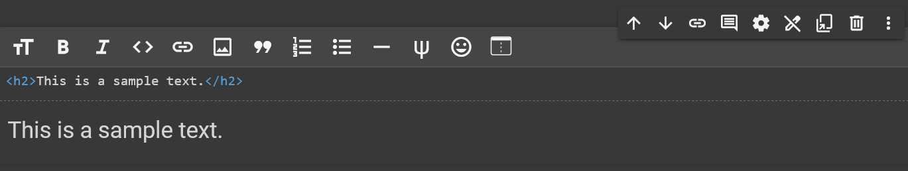
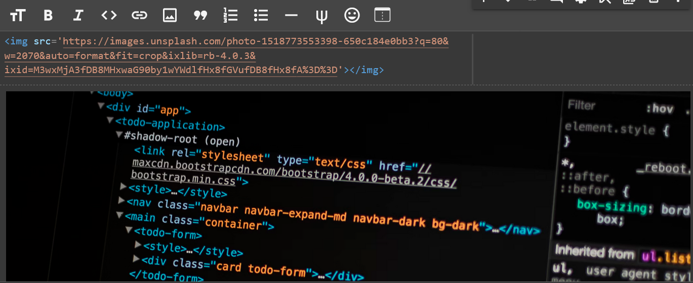

### 611 Day 73 Goals_ what you will make by the end of the day

What you'll learn today

- How to combine a Notebook with HTML Markup.
- Apply Python List slicing techniques to Pandas DataFrames.
- How to aggregate data using the .agg() function.
- How to create scatter plots, bar charts, and line charts with two axes in Matplotlib.
- Understand database schemas that are organised by primary and foreign keys.
- How to merge DataFrames that share a common key

### 612 Use HTML Markdown to Make Your Notebook Look Pretty

The cells inside the notebook can either be code cells for your Python code or Text (Markdown) cells. 
The starter notebook includes a few of these Text cells with section headings and challenge text. 
However, we can style these cells even more by using HTML (see Days 43 and 44).

**Insert a Markdown Cell**

Add a new Text cell below the Introduction.

**Adding Images**

Display an image in a Text cell, use an HTML  tag with the URL of the image.

**Section Headings**

You can add section headings using tags like <h1> or <h2>. 
However, the Notebook also has its own shorthand for common HTML tags. 
For example, you can use the # symbol as a shortcut.

**Challenge**

1. Find out how many different colour LEGO bricks are actually in production!
2. Figure out how many of the LEGO colours are transparent compared to how many colours are opaque.

### 613 Solution_ Exploring the LEGO Brick Colours

### 614 Find the Oldest and Largest LEGO Sets

### 615 Visualise the Number of Sets Published over Time
