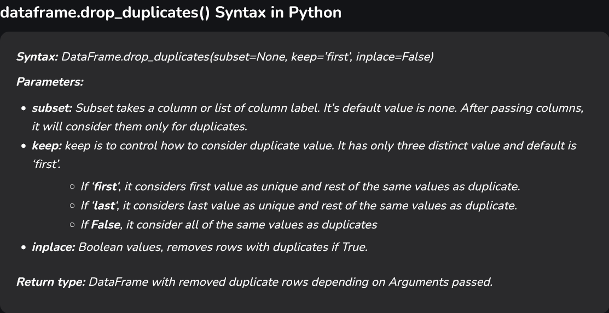
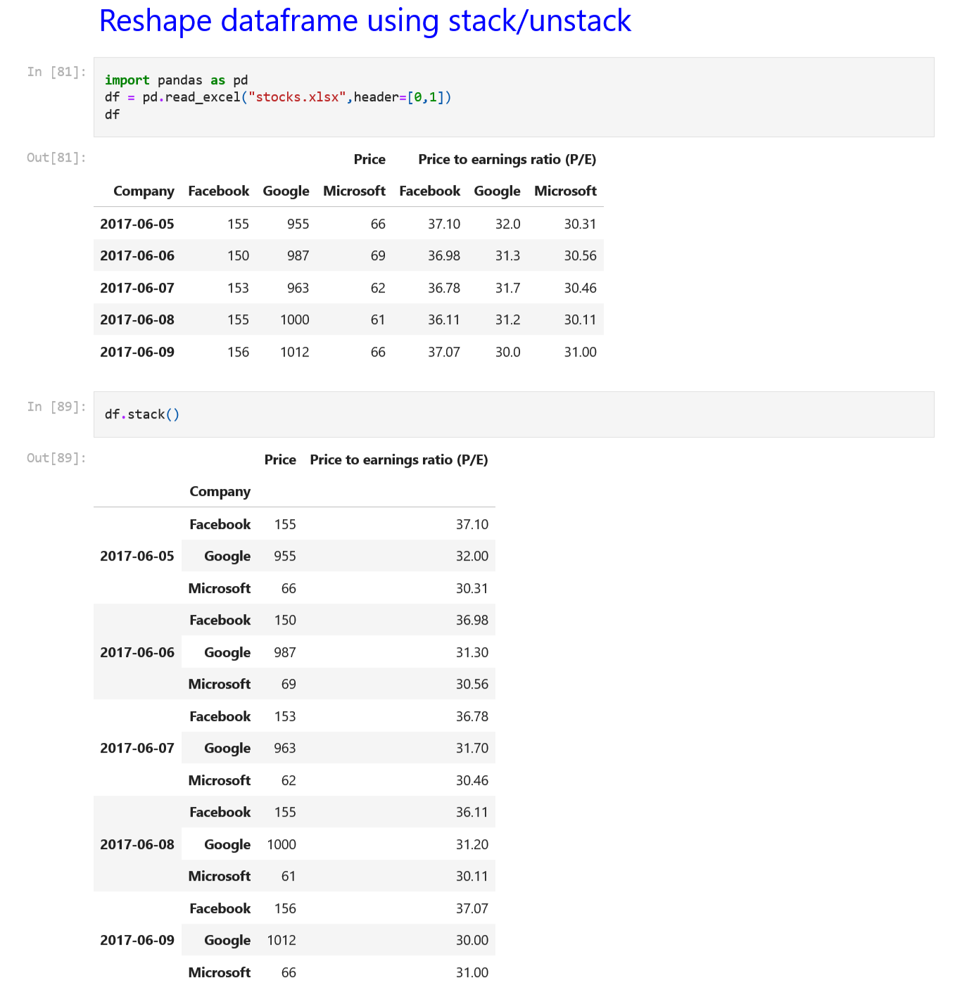

## 631 Day 75 Goals_ what you will make by the end of the day

**Wrestle the Android App Store Data into Beautiful Looking Charts with Plotly**


Have you ever thought about building your own an iOS or Android app? If so, then you probably have wondered about how things work in the app stores. Today we'll replicate some of the app store analytics provided by companies like App Annie or Sensor Tower that helps inform development and app marketing strategies for many companies. This stuff is BIG business!

In this module, we will compare thousands of apps in the Google Play Store so that we can gain insight into:

- How competitive different app categories (e.g., Games, Lifestyle, Weather) are
- Which app category offers compelling opportunities based on its popularity
- How many downloads you would give up by making your app paid vs. free
- How much you can reasonably charge for a paid app
- Which paid apps have had the highest revenue
- How many paid apps will recoup their development costs based on their sales revenue

Today you'll learn:

- How to quickly remove duplicates
- How to remove unwanted symbols and convert data into a numeric format
- How to wrangle columns containing nested data with Pandas
- How to create compelling data visualisations with the plotly library
- Create vertical, horizontal and grouped bar charts
- Create pie and donut charts for categorical data
- Use colour scales to make beautiful scatter plots

Download and add the Notebook to Google Drive

As usual, download the .zip file from this lesson and extract it. Add the .ipynb file into your Google Drive and open it as a Google Colaboratory notebook.

Add the Data to the Notebook

The .zip file also includes a .csv file. This is the data for the project. Add this your notebook.


```python
import pandas as pd
```


```python
df_apps = pd.read_csv('apps.csv')
```


```python
df_apps.head(n=5)
```


<div>
<style scoped>
    .dataframe tbody tr th:only-of-type {
        vertical-align: middle;
    }

    .dataframe tbody tr th {
        vertical-align: top;
    }

    .dataframe thead th {
        text-align: right;
    }
</style>
<table border="1" class="dataframe">
  <thead>
    <tr style="text-align: right;">
      <th></th>
      <th>App</th>
      <th>Category</th>
      <th>Rating</th>
      <th>Reviews</th>
      <th>Size_MBs</th>
      <th>Installs</th>
      <th>Type</th>
      <th>Price</th>
      <th>Content_Rating</th>
      <th>Genres</th>
      <th>Last_Updated</th>
      <th>Android_Ver</th>
    </tr>
  </thead>
  <tbody>
    <tr>
      <th>0</th>
      <td>Ak Parti Yardım Toplama</td>
      <td>SOCIAL</td>
      <td>NaN</td>
      <td>0</td>
      <td>8.7</td>
      <td>0</td>
      <td>Paid</td>
      <td>$13.99</td>
      <td>Teen</td>
      <td>Social</td>
      <td>July 28, 2017</td>
      <td>4.1 and up</td>
    </tr>
    <tr>
      <th>1</th>
      <td>Ain Arabic Kids Alif Ba ta</td>
      <td>FAMILY</td>
      <td>NaN</td>
      <td>0</td>
      <td>33.0</td>
      <td>0</td>
      <td>Paid</td>
      <td>$2.99</td>
      <td>Everyone</td>
      <td>Education</td>
      <td>April 15, 2016</td>
      <td>3.0 and up</td>
    </tr>
    <tr>
      <th>2</th>
      <td>Popsicle Launcher for Android P 9.0 launcher</td>
      <td>PERSONALIZATION</td>
      <td>NaN</td>
      <td>0</td>
      <td>5.5</td>
      <td>0</td>
      <td>Paid</td>
      <td>$1.49</td>
      <td>Everyone</td>
      <td>Personalization</td>
      <td>July 11, 2018</td>
      <td>4.2 and up</td>
    </tr>
    <tr>
      <th>3</th>
      <td>Command &amp; Conquer: Rivals</td>
      <td>FAMILY</td>
      <td>NaN</td>
      <td>0</td>
      <td>19.0</td>
      <td>0</td>
      <td>NaN</td>
      <td>0</td>
      <td>Everyone 10+</td>
      <td>Strategy</td>
      <td>June 28, 2018</td>
      <td>Varies with device</td>
    </tr>
    <tr>
      <th>4</th>
      <td>CX Network</td>
      <td>BUSINESS</td>
      <td>NaN</td>
      <td>0</td>
      <td>10.0</td>
      <td>0</td>
      <td>Free</td>
      <td>0</td>
      <td>Everyone</td>
      <td>Business</td>
      <td>August 6, 2018</td>
      <td>4.1 and up</td>
    </tr>
  </tbody>
</table>
</div>


## 632 Data Cleaning_ Removing NaN Values and Duplicates

The first step as always is getting a better idea about what we're dealing with.

**Preliminary Data Exploration**

#### Challenge: How many rows and columns does df_apps have? What are the column names? What does the data look like? Look at a random sample of 5 different rows with .sample()


```python
df_apps.shape
```


    (10841, 12)


```python
df_apps.info()
```

    <class 'pandas.core.frame.DataFrame'>
    RangeIndex: 10841 entries, 0 to 10840
    Data columns (total 12 columns):
     #   Column          Non-Null Count  Dtype  
    ---  ------          --------------  -----  
     0   App             10841 non-null  object 
     1   Category        10841 non-null  object 
     2   Rating          9367 non-null   float64
     3   Reviews         10841 non-null  int64  
     4   Size_MBs        10841 non-null  float64
     5   Installs        10841 non-null  object 
     6   Type            10840 non-null  object 
     7   Price           10841 non-null  object 
     8   Content_Rating  10841 non-null  object 
     9   Genres          10841 non-null  object 
     10  Last_Updated    10841 non-null  object 
     11  Android_Ver     10839 non-null  object 
    dtypes: float64(2), int64(1), object(9)
    memory usage: 1016.5+ KB
    


```python
df_apps.sample(n=5)
```


<div>
<style scoped>
    .dataframe tbody tr th:only-of-type {
        vertical-align: middle;
    }

    .dataframe tbody tr th {
        vertical-align: top;
    }

    .dataframe thead th {
        text-align: right;
    }
</style>
<table border="1" class="dataframe">
  <thead>
    <tr style="text-align: right;">
      <th></th>
      <th>App</th>
      <th>Category</th>
      <th>Rating</th>
      <th>Reviews</th>
      <th>Size_MBs</th>
      <th>Installs</th>
      <th>Type</th>
      <th>Price</th>
      <th>Content_Rating</th>
      <th>Genres</th>
      <th>Last_Updated</th>
      <th>Android_Ver</th>
    </tr>
  </thead>
  <tbody>
    <tr>
      <th>3761</th>
      <td>BL Kennedy Theme</td>
      <td>PERSONALIZATION</td>
      <td>4.2</td>
      <td>279</td>
      <td>1.1</td>
      <td>10,000</td>
      <td>Free</td>
      <td>0</td>
      <td>Everyone</td>
      <td>Personalization</td>
      <td>May 6, 2013</td>
      <td>2.1 and up</td>
    </tr>
    <tr>
      <th>5414</th>
      <td>ez Share Android app</td>
      <td>PHOTOGRAPHY</td>
      <td>3.3</td>
      <td>1461</td>
      <td>13.0</td>
      <td>100,000</td>
      <td>Free</td>
      <td>0</td>
      <td>Everyone</td>
      <td>Photography</td>
      <td>August 31, 2017</td>
      <td>2.3 and up</td>
    </tr>
    <tr>
      <th>73</th>
      <td>FP Boss</td>
      <td>FINANCE</td>
      <td>NaN</td>
      <td>1</td>
      <td>5.8</td>
      <td>1</td>
      <td>Free</td>
      <td>0</td>
      <td>Everyone</td>
      <td>Finance</td>
      <td>July 27, 2018</td>
      <td>5.0 and up</td>
    </tr>
    <tr>
      <th>1058</th>
      <td>BG MUSIC PLAYER - MUSIC PLAYER</td>
      <td>VIDEO_PLAYERS</td>
      <td>NaN</td>
      <td>0</td>
      <td>8.6</td>
      <td>100</td>
      <td>Free</td>
      <td>0</td>
      <td>Everyone</td>
      <td>Video Players &amp; Editors</td>
      <td>June 26, 2018</td>
      <td>4.1 and up</td>
    </tr>
    <tr>
      <th>5406</th>
      <td>autoricardo.ch – vehicles</td>
      <td>LIFESTYLE</td>
      <td>3.3</td>
      <td>1045</td>
      <td>13.0</td>
      <td>100,000</td>
      <td>Free</td>
      <td>0</td>
      <td>Everyone</td>
      <td>Lifestyle</td>
      <td>March 13, 2018</td>
      <td>4.0 and up</td>
    </tr>
  </tbody>
</table>
</div>


#### Challenge: Remove the columns called Last_Updated and Android_Version from the DataFrame. We will not use these columns.


How to adjust image size in markdown? The above one is too big.


Resized Image -


```python
# Remove the columns called Last_Updated and Android_Version from the DataFrame.
df_apps.drop(["Last_Updated", "Android_Ver"], axis=1, inplace=True)
```


```python
df_apps.info()
```

    <class 'pandas.core.frame.DataFrame'>
    RangeIndex: 10841 entries, 0 to 10840
    Data columns (total 10 columns):
     #   Column          Non-Null Count  Dtype  
    ---  ------          --------------  -----  
     0   App             10841 non-null  object 
     1   Category        10841 non-null  object 
     2   Rating          9367 non-null   float64
     3   Reviews         10841 non-null  int64  
     4   Size_MBs        10841 non-null  float64
     5   Installs        10841 non-null  object 
     6   Type            10840 non-null  object 
     7   Price           10841 non-null  object 
     8   Content_Rating  10841 non-null  object 
     9   Genres          10841 non-null  object 
    dtypes: float64(2), int64(1), object(7)
    memory usage: 847.1+ KB
    

10 columns remaining.

#### Challenge: How many rows have a NaN value (not-a-number) in the Rating column? Create DataFrame called df_apps_clean that does not include these rows.


```python
df_apps['Rating'].isnull().values.any()
```


    np.True_


```python
df_apps['Rating'].isnull().values.sum()
```


    np.int64(1474)


```python
df_apps.isna()
```


<div>
<style scoped>
    .dataframe tbody tr th:only-of-type {
        vertical-align: middle;
    }

    .dataframe tbody tr th {
        vertical-align: top;
    }

    .dataframe thead th {
        text-align: right;
    }
</style>
<table border="1" class="dataframe">
  <thead>
    <tr style="text-align: right;">
      <th></th>
      <th>App</th>
      <th>Category</th>
      <th>Rating</th>
      <th>Reviews</th>
      <th>Size_MBs</th>
      <th>Installs</th>
      <th>Type</th>
      <th>Price</th>
      <th>Content_Rating</th>
      <th>Genres</th>
    </tr>
  </thead>
  <tbody>
    <tr>
      <th>0</th>
      <td>False</td>
      <td>False</td>
      <td>True</td>
      <td>False</td>
      <td>False</td>
      <td>False</td>
      <td>False</td>
      <td>False</td>
      <td>False</td>
      <td>False</td>
    </tr>
    <tr>
      <th>1</th>
      <td>False</td>
      <td>False</td>
      <td>True</td>
      <td>False</td>
      <td>False</td>
      <td>False</td>
      <td>False</td>
      <td>False</td>
      <td>False</td>
      <td>False</td>
    </tr>
    <tr>
      <th>2</th>
      <td>False</td>
      <td>False</td>
      <td>True</td>
      <td>False</td>
      <td>False</td>
      <td>False</td>
      <td>False</td>
      <td>False</td>
      <td>False</td>
      <td>False</td>
    </tr>
    <tr>
      <th>3</th>
      <td>False</td>
      <td>False</td>
      <td>True</td>
      <td>False</td>
      <td>False</td>
      <td>False</td>
      <td>True</td>
      <td>False</td>
      <td>False</td>
      <td>False</td>
    </tr>
    <tr>
      <th>4</th>
      <td>False</td>
      <td>False</td>
      <td>True</td>
      <td>False</td>
      <td>False</td>
      <td>False</td>
      <td>False</td>
      <td>False</td>
      <td>False</td>
      <td>False</td>
    </tr>
    <tr>
      <th>...</th>
      <td>...</td>
      <td>...</td>
      <td>...</td>
      <td>...</td>
      <td>...</td>
      <td>...</td>
      <td>...</td>
      <td>...</td>
      <td>...</td>
      <td>...</td>
    </tr>
    <tr>
      <th>10836</th>
      <td>False</td>
      <td>False</td>
      <td>False</td>
      <td>False</td>
      <td>False</td>
      <td>False</td>
      <td>False</td>
      <td>False</td>
      <td>False</td>
      <td>False</td>
    </tr>
    <tr>
      <th>10837</th>
      <td>False</td>
      <td>False</td>
      <td>False</td>
      <td>False</td>
      <td>False</td>
      <td>False</td>
      <td>False</td>
      <td>False</td>
      <td>False</td>
      <td>False</td>
    </tr>
    <tr>
      <th>10838</th>
      <td>False</td>
      <td>False</td>
      <td>False</td>
      <td>False</td>
      <td>False</td>
      <td>False</td>
      <td>False</td>
      <td>False</td>
      <td>False</td>
      <td>False</td>
    </tr>
    <tr>
      <th>10839</th>
      <td>False</td>
      <td>False</td>
      <td>False</td>
      <td>False</td>
      <td>False</td>
      <td>False</td>
      <td>False</td>
      <td>False</td>
      <td>False</td>
      <td>False</td>
    </tr>
    <tr>
      <th>10840</th>
      <td>False</td>
      <td>False</td>
      <td>False</td>
      <td>False</td>
      <td>False</td>
      <td>False</td>
      <td>False</td>
      <td>False</td>
      <td>False</td>
      <td>False</td>
    </tr>
  </tbody>
</table>
<p>10841 rows × 10 columns</p>
</div>


We can see that the first few columns contain the NaN value.


```python
df_apps.head(n=10)
```


<div>
<style scoped>
    .dataframe tbody tr th:only-of-type {
        vertical-align: middle;
    }

    .dataframe tbody tr th {
        vertical-align: top;
    }

    .dataframe thead th {
        text-align: right;
    }
</style>
<table border="1" class="dataframe">
  <thead>
    <tr style="text-align: right;">
      <th></th>
      <th>App</th>
      <th>Category</th>
      <th>Rating</th>
      <th>Reviews</th>
      <th>Size_MBs</th>
      <th>Installs</th>
      <th>Type</th>
      <th>Price</th>
      <th>Content_Rating</th>
      <th>Genres</th>
    </tr>
  </thead>
  <tbody>
    <tr>
      <th>0</th>
      <td>Ak Parti Yardım Toplama</td>
      <td>SOCIAL</td>
      <td>NaN</td>
      <td>0</td>
      <td>8.7</td>
      <td>0</td>
      <td>Paid</td>
      <td>$13.99</td>
      <td>Teen</td>
      <td>Social</td>
    </tr>
    <tr>
      <th>1</th>
      <td>Ain Arabic Kids Alif Ba ta</td>
      <td>FAMILY</td>
      <td>NaN</td>
      <td>0</td>
      <td>33.0</td>
      <td>0</td>
      <td>Paid</td>
      <td>$2.99</td>
      <td>Everyone</td>
      <td>Education</td>
    </tr>
    <tr>
      <th>2</th>
      <td>Popsicle Launcher for Android P 9.0 launcher</td>
      <td>PERSONALIZATION</td>
      <td>NaN</td>
      <td>0</td>
      <td>5.5</td>
      <td>0</td>
      <td>Paid</td>
      <td>$1.49</td>
      <td>Everyone</td>
      <td>Personalization</td>
    </tr>
    <tr>
      <th>3</th>
      <td>Command &amp; Conquer: Rivals</td>
      <td>FAMILY</td>
      <td>NaN</td>
      <td>0</td>
      <td>19.0</td>
      <td>0</td>
      <td>NaN</td>
      <td>0</td>
      <td>Everyone 10+</td>
      <td>Strategy</td>
    </tr>
    <tr>
      <th>4</th>
      <td>CX Network</td>
      <td>BUSINESS</td>
      <td>NaN</td>
      <td>0</td>
      <td>10.0</td>
      <td>0</td>
      <td>Free</td>
      <td>0</td>
      <td>Everyone</td>
      <td>Business</td>
    </tr>
    <tr>
      <th>5</th>
      <td>Test Application DT 02</td>
      <td>ART_AND_DESIGN</td>
      <td>NaN</td>
      <td>0</td>
      <td>1.2</td>
      <td>0</td>
      <td>Free</td>
      <td>0</td>
      <td>Everyone</td>
      <td>Art &amp; Design</td>
    </tr>
    <tr>
      <th>6</th>
      <td>Pekalongan CJ</td>
      <td>SOCIAL</td>
      <td>NaN</td>
      <td>0</td>
      <td>5.9</td>
      <td>0</td>
      <td>Free</td>
      <td>0</td>
      <td>Teen</td>
      <td>Social</td>
    </tr>
    <tr>
      <th>7</th>
      <td>EG | Explore Folegandros</td>
      <td>TRAVEL_AND_LOCAL</td>
      <td>NaN</td>
      <td>0</td>
      <td>56.0</td>
      <td>0</td>
      <td>Paid</td>
      <td>$3.99</td>
      <td>Everyone</td>
      <td>Travel &amp; Local</td>
    </tr>
    <tr>
      <th>8</th>
      <td>cronometra-br</td>
      <td>PRODUCTIVITY</td>
      <td>NaN</td>
      <td>0</td>
      <td>5.4</td>
      <td>0</td>
      <td>Paid</td>
      <td>$154.99</td>
      <td>Everyone</td>
      <td>Productivity</td>
    </tr>
    <tr>
      <th>9</th>
      <td>Eu sou Rico</td>
      <td>FINANCE</td>
      <td>NaN</td>
      <td>0</td>
      <td>2.6</td>
      <td>0</td>
      <td>Paid</td>
      <td>$30.99</td>
      <td>Everyone</td>
      <td>Finance</td>
    </tr>
  </tbody>
</table>
</div>


```python
df_apps_clean = df_apps.dropna()
```


```python
# Initially the dataframe contained 10841 rows, if we drop the 1474 NaN rows - 
10841 - 1474
```


    9367


```python
# we should now have 9367 rows
df_apps_clean.shape
```


    (9367, 10)


#### Challenge: Are there any duplicates in data? Check for duplicates using the .duplicated() function. How many entries can you find for the "Instagram" app? Use .drop_duplicates() to remove any duplicates from df_apps_clean.


```python
df_apps_clean.duplicated()
```


    21       False
    28       False
    47       False
    82       False
    99       False
             ...  
    10836    False
    10837    False
    10838    False
    10839     True
    10840    False
    Length: 9367, dtype: bool


```python
df_apps_clean.duplicated().values.sum()
```


    np.int64(476)


```python
# what does the current df look like?
df_apps_clean.head(n=5)
```


<div>
<style scoped>
    .dataframe tbody tr th:only-of-type {
        vertical-align: middle;
    }

    .dataframe tbody tr th {
        vertical-align: top;
    }

    .dataframe thead th {
        text-align: right;
    }
</style>
<table border="1" class="dataframe">
  <thead>
    <tr style="text-align: right;">
      <th></th>
      <th>App</th>
      <th>Category</th>
      <th>Rating</th>
      <th>Reviews</th>
      <th>Size_MBs</th>
      <th>Installs</th>
      <th>Type</th>
      <th>Price</th>
      <th>Content_Rating</th>
      <th>Genres</th>
    </tr>
  </thead>
  <tbody>
    <tr>
      <th>21</th>
      <td>KBA-EZ Health Guide</td>
      <td>MEDICAL</td>
      <td>5.0</td>
      <td>4</td>
      <td>25.0</td>
      <td>1</td>
      <td>Free</td>
      <td>0</td>
      <td>Everyone</td>
      <td>Medical</td>
    </tr>
    <tr>
      <th>28</th>
      <td>Ra Ga Ba</td>
      <td>GAME</td>
      <td>5.0</td>
      <td>2</td>
      <td>20.0</td>
      <td>1</td>
      <td>Paid</td>
      <td>$1.49</td>
      <td>Everyone</td>
      <td>Arcade</td>
    </tr>
    <tr>
      <th>47</th>
      <td>Mu.F.O.</td>
      <td>GAME</td>
      <td>5.0</td>
      <td>2</td>
      <td>16.0</td>
      <td>1</td>
      <td>Paid</td>
      <td>$0.99</td>
      <td>Everyone</td>
      <td>Arcade</td>
    </tr>
    <tr>
      <th>82</th>
      <td>Brick Breaker BR</td>
      <td>GAME</td>
      <td>5.0</td>
      <td>7</td>
      <td>19.0</td>
      <td>5</td>
      <td>Free</td>
      <td>0</td>
      <td>Everyone</td>
      <td>Arcade</td>
    </tr>
    <tr>
      <th>99</th>
      <td>Anatomy &amp; Physiology Vocabulary Exam Review App</td>
      <td>MEDICAL</td>
      <td>5.0</td>
      <td>1</td>
      <td>4.6</td>
      <td>5</td>
      <td>Free</td>
      <td>0</td>
      <td>Everyone</td>
      <td>Medical</td>
    </tr>
  </tbody>
</table>
</div>


```python
# how many entries are for the "Instagram" app?
df_apps_clean[df_apps_clean['App'] == 'Instagram']
```


<div>
<style scoped>
    .dataframe tbody tr th:only-of-type {
        vertical-align: middle;
    }

    .dataframe tbody tr th {
        vertical-align: top;
    }

    .dataframe thead th {
        text-align: right;
    }
</style>
<table border="1" class="dataframe">
  <thead>
    <tr style="text-align: right;">
      <th></th>
      <th>App</th>
      <th>Category</th>
      <th>Rating</th>
      <th>Reviews</th>
      <th>Size_MBs</th>
      <th>Installs</th>
      <th>Type</th>
      <th>Price</th>
      <th>Content_Rating</th>
      <th>Genres</th>
    </tr>
  </thead>
  <tbody>
    <tr>
      <th>10806</th>
      <td>Instagram</td>
      <td>SOCIAL</td>
      <td>4.5</td>
      <td>66577313</td>
      <td>5.3</td>
      <td>1,000,000,000</td>
      <td>Free</td>
      <td>0</td>
      <td>Teen</td>
      <td>Social</td>
    </tr>
    <tr>
      <th>10808</th>
      <td>Instagram</td>
      <td>SOCIAL</td>
      <td>4.5</td>
      <td>66577446</td>
      <td>5.3</td>
      <td>1,000,000,000</td>
      <td>Free</td>
      <td>0</td>
      <td>Teen</td>
      <td>Social</td>
    </tr>
    <tr>
      <th>10809</th>
      <td>Instagram</td>
      <td>SOCIAL</td>
      <td>4.5</td>
      <td>66577313</td>
      <td>5.3</td>
      <td>1,000,000,000</td>
      <td>Free</td>
      <td>0</td>
      <td>Teen</td>
      <td>Social</td>
    </tr>
    <tr>
      <th>10810</th>
      <td>Instagram</td>
      <td>SOCIAL</td>
      <td>4.5</td>
      <td>66509917</td>
      <td>5.3</td>
      <td>1,000,000,000</td>
      <td>Free</td>
      <td>0</td>
      <td>Teen</td>
      <td>Social</td>
    </tr>
  </tbody>
</table>
</div>


So truly, column 10806 and column 10809 are duplicates


```python
len(df_apps_clean[df_apps_clean['App'] == 'Instagram'])
```


    4


**Use .drop_duplicates() to remove any duplicates from df_apps_clean.**




```python
df_apps_clean2 = df_apps_clean.drop_duplicates()
```


```python
df_apps_clean2.duplicated().values.any()
```


    np.False_


```python
df_apps_clean2[df_apps_clean2['App'] == 'Instagram']
```


<div>
<style scoped>
    .dataframe tbody tr th:only-of-type {
        vertical-align: middle;
    }

    .dataframe tbody tr th {
        vertical-align: top;
    }

    .dataframe thead th {
        text-align: right;
    }
</style>
<table border="1" class="dataframe">
  <thead>
    <tr style="text-align: right;">
      <th></th>
      <th>App</th>
      <th>Category</th>
      <th>Rating</th>
      <th>Reviews</th>
      <th>Size_MBs</th>
      <th>Installs</th>
      <th>Type</th>
      <th>Price</th>
      <th>Content_Rating</th>
      <th>Genres</th>
    </tr>
  </thead>
  <tbody>
    <tr>
      <th>10806</th>
      <td>Instagram</td>
      <td>SOCIAL</td>
      <td>4.5</td>
      <td>66577313</td>
      <td>5.3</td>
      <td>1,000,000,000</td>
      <td>Free</td>
      <td>0</td>
      <td>Teen</td>
      <td>Social</td>
    </tr>
    <tr>
      <th>10808</th>
      <td>Instagram</td>
      <td>SOCIAL</td>
      <td>4.5</td>
      <td>66577446</td>
      <td>5.3</td>
      <td>1,000,000,000</td>
      <td>Free</td>
      <td>0</td>
      <td>Teen</td>
      <td>Social</td>
    </tr>
    <tr>
      <th>10810</th>
      <td>Instagram</td>
      <td>SOCIAL</td>
      <td>4.5</td>
      <td>66509917</td>
      <td>5.3</td>
      <td>1,000,000,000</td>
      <td>Free</td>
      <td>0</td>
      <td>Teen</td>
      <td>Social</td>
    </tr>
  </tbody>
</table>
</div>


```python
# Now if we want to have only one "Instagram" row? We have to tell the code to consider nly specific columns
df_apps_clean3 = df_apps_clean2.drop_duplicates(subset=["App", "Type", "Price"])
```


```python
df_apps_clean3[df_apps_clean3['App'] == 'Instagram']
```


<div>
<style scoped>
    .dataframe tbody tr th:only-of-type {
        vertical-align: middle;
    }

    .dataframe tbody tr th {
        vertical-align: top;
    }

    .dataframe thead th {
        text-align: right;
    }
</style>
<table border="1" class="dataframe">
  <thead>
    <tr style="text-align: right;">
      <th></th>
      <th>App</th>
      <th>Category</th>
      <th>Rating</th>
      <th>Reviews</th>
      <th>Size_MBs</th>
      <th>Installs</th>
      <th>Type</th>
      <th>Price</th>
      <th>Content_Rating</th>
      <th>Genres</th>
    </tr>
  </thead>
  <tbody>
    <tr>
      <th>10806</th>
      <td>Instagram</td>
      <td>SOCIAL</td>
      <td>4.5</td>
      <td>66577313</td>
      <td>5.3</td>
      <td>1,000,000,000</td>
      <td>Free</td>
      <td>0</td>
      <td>Teen</td>
      <td>Social</td>
    </tr>
  </tbody>
</table>
</div>


```python
df_apps_clean3.shape
```


    (8199, 10)


This leaves us with 8,199 entries after removing duplicates. Huzzah! 💪

**What else should I know about the data?**

So we can see that 13 different features were originally scraped from the Google Play Store.


- Obviously, the data is just a sample out of all the Android apps. It doesn't include all Android apps of which there are millions.

- I’ll assume that the sample is representative of the App Store as a whole. This is not necessarily the case as, during the web scraping process, this sample was served up based on geographical location and user behaviour of the person who scraped it - in our case Lavanya Gupta.

- The data was compiled around 2017/2018. The pricing data reflect the price in USD Dollars at the time of scraping. (developers can offer promotions and change their app’s pricing).

- I’ve converted the app’s size to a floating-point number in MBs. If data was missing, it has been replaced by the average size for that category.

- The installs are not the exact number of installs. If an app has 245,239 installs then Google will simply report an order of magnitude like 100,000+. I’ve removed the '+' and we’ll assume the exact number of installs in that column for simplicity.


Here’s what you would see under an Android app listing if you go to a listing on the Google Play Store:


## 633 Preliminary Exploration_ The Highest Ratings, Most Reviews, and Largest Size

#### Challenge: Identify which apps are the highest rated. What problem might you encounter if you rely exclusively on ratings alone to determine the quality of an app?


```python
df_apps_clean3.head(n=5)
```


<div>
<style scoped>
    .dataframe tbody tr th:only-of-type {
        vertical-align: middle;
    }

    .dataframe tbody tr th {
        vertical-align: top;
    }

    .dataframe thead th {
        text-align: right;
    }
</style>
<table border="1" class="dataframe">
  <thead>
    <tr style="text-align: right;">
      <th></th>
      <th>App</th>
      <th>Category</th>
      <th>Rating</th>
      <th>Reviews</th>
      <th>Size_MBs</th>
      <th>Installs</th>
      <th>Type</th>
      <th>Price</th>
      <th>Content_Rating</th>
      <th>Genres</th>
    </tr>
  </thead>
  <tbody>
    <tr>
      <th>21</th>
      <td>KBA-EZ Health Guide</td>
      <td>MEDICAL</td>
      <td>5.0</td>
      <td>4</td>
      <td>25.0</td>
      <td>1</td>
      <td>Free</td>
      <td>0</td>
      <td>Everyone</td>
      <td>Medical</td>
    </tr>
    <tr>
      <th>28</th>
      <td>Ra Ga Ba</td>
      <td>GAME</td>
      <td>5.0</td>
      <td>2</td>
      <td>20.0</td>
      <td>1</td>
      <td>Paid</td>
      <td>$1.49</td>
      <td>Everyone</td>
      <td>Arcade</td>
    </tr>
    <tr>
      <th>47</th>
      <td>Mu.F.O.</td>
      <td>GAME</td>
      <td>5.0</td>
      <td>2</td>
      <td>16.0</td>
      <td>1</td>
      <td>Paid</td>
      <td>$0.99</td>
      <td>Everyone</td>
      <td>Arcade</td>
    </tr>
    <tr>
      <th>82</th>
      <td>Brick Breaker BR</td>
      <td>GAME</td>
      <td>5.0</td>
      <td>7</td>
      <td>19.0</td>
      <td>5</td>
      <td>Free</td>
      <td>0</td>
      <td>Everyone</td>
      <td>Arcade</td>
    </tr>
    <tr>
      <th>99</th>
      <td>Anatomy &amp; Physiology Vocabulary Exam Review App</td>
      <td>MEDICAL</td>
      <td>5.0</td>
      <td>1</td>
      <td>4.6</td>
      <td>5</td>
      <td>Free</td>
      <td>0</td>
      <td>Everyone</td>
      <td>Medical</td>
    </tr>
  </tbody>
</table>
</div>


Only apps with very few reviews (and a low number on installs) have perfect 5 star ratings (most likely by friends and family).


```python
df_apps_clean3['Rating'].max()
```


    np.float64(5.0)


```python
df_apps_with_highest_rating = df_apps_clean3[df_apps_clean3['Rating'] == df_apps_clean3['Rating'].max()]
```


```python
# getting the app names as a list
df_apps_with_highest_rating['App'].tolist()
```


    ['KBA-EZ Health Guide',
     'Ra Ga Ba',
     'Mu.F.O.',
     'Brick Breaker BR',
     'Anatomy & Physiology Vocabulary Exam Review App',
     'Tablet Reminder',
     'CQ ESPM',
     'Clinic Doctor EHr',
     'EB Cash Collections',
     'CZ-Help',
     'CB Heroes',
     'ei Calc',
     'CG Jobs',
     'Bh Public School',
     'EJ messenger',
     'BU Study',
     'CB Register',
     'Basics of Orthopaedics',
     'ER Assist',
     'CJ the REALTOR',
     'Story Time FD',
     'NCLEX Multi-topic Nursing Exam Review-Quiz & notes',
     'DN Blog',
     'Barbers.BH',
     'Trovami se ci riesci',
     'EC Mover',
     'Monster Ride Pro',
     'FAST EO',
     'AC DC Power Monitor',
     'DT CLOTHINGS',
     '30WPM Amateur ham radio Koch CW Morse code trainer',
     'BM speed test',
     'FK CLASSIC FOR YOU',
     'CZ Kompas',
     'AJ Rafael Music Lessons',
     'AJ Gray Dark Icon Pack',
     'DF Glue Board',
     '211:CK',
     'i am EB',
     'DG OFF - 100% Free Coupons & Deals',
     'Tic Tac CK',
     'DL Image Manager',
     'EC SPORTS',
     'Labs on Demand',
     'Chronolink DX',
     "Wowkwis aq Ka'qaquj",
     'CB Fit',
     'BJ Foods',
     'Easy Hotspot Ad Free',
     'CI 174 Gray Icon Pack',
     'AP Art History Flashcards',
     'DN Employee',
     'Hum Ek Hain 2.02',
     'USMLE Step 2 CK Flashcards',
     'PrimeDelivery',
     "Hey AJ! It's Bedtime!",
     "You're an Anime",
     'meStudying: AP English Lit',
     'AJ RETAILS',
     'Axe Champs! Wars',
     'EB Scanner',
     'FoothillsVet',
     'Bar-B-Q Rib House',
     "Santa's Monster Shootout DX",
     'MI-BP',
     'CB News',
     'AJ Blue Icon Pack',
     'EF Forms',
     'BK Gold App',
     'Galaxies of Hope',
     'EF Academy',
     'daskal.eu',
     'Cb browser',
     'CR Tracker for Chests',
     'Lakeside AG Moultrie',
     'UP EB Bill Payment & Details',
     'cx advance call blocker',
     'CT Checkout',
     'AQ Ria Retail',
     'DYPSOET',
     'Read it easy for BK',
     'BC MVA Fines',
     'BxPort - Bitcoin Bx (Thailand)',
     'CricQuick',
     'FN',
     'Santa Fe Thrive',
     'Pyaar Ek Dhoka',
     'CL Strength',
     'BS-Mobile',
     'COMSATS BOOK STORE FOR BS(CS)',
     'EP Radio',
     'DB Pickles',
     'C B Patel Health Club',
     'CF Townsville',
     'Speeding Joyride & Car Meet App',
     'AJ Cam',
     'chat dz',
     'CE Smart',
     'Noticias FC Barcelona',
     'Arrowhead AH App',
     'Kimbrough AH',
     'NEMA ei',
     'CP Trivia',
     'Florida Beach Wallpapers HD',
     'P-Home for KLWP',
     'EF App',
     'Dermatology Atlas (Colored & Illustrative)',
     'Cy-Fair VFD EMS Protocols',
     'Mindvalley U Tallinn 2018',
     'BI APP',
     'BV Sridhara Maharaj',
     'ES Billing System (Offline App)',
     'Propel BI APP',
     'Super Hearing Secret Voices Recorder PRO',
     'Zen Leaf',
     'Sir C J New Primary School',
     'Wallpapers FN SCAR H',
     'Cloud DX Connected Health',
     'Overcomers CF - GA',
     '420 BZ Budeze Delivery',
     'Asha Ek Hope - ALS/ MND',
     'BK Formula Calculator',
     "CJ'S TIRE AND AUTO INC.",
     'CP Installer App',
     'Food-Aw - Order Food Online in Aruba',
     'NOMISMA.com.cy by FMW',
     'EU Exit poll',
     'DW Security',
     'DV Youth',
     'Flippy Axe : Flip The Knife & Axe Simulator',
     'Startupticker.ch News, Events',
     'CA Speakers',
     'Movement BE',
     'BK Arogyam Task Track',
     'Helping BD',
     'EF Events',
     'Free coupons and vouchers',
     'Fr. Mike Schmitz Audio Teachings',
     'Spring flowers theme couleurs d t space',
     'A-Y Collection',
     'DG TV',
     'Morse Player',
     'BG Guide',
     'TI-84 CE Graphing Calculator Manual TI 84',
     'Chenoweth AH',
     'BL Flowers Digital',
     "Mad Dash Fo' Cash",
     'PK and DK Audio App',
     'Eh Bee Wallpapers HD',
     'DV ASSIST',
     'CJ Gospel Hour',
     'DC N COMPANY ENTERTAINMENT RADIO!',
     'Dt. Jyothi Srinivas',
     'Eternal Light AG',
     'Railroad Radio Vancouver BC',
     'ADS-B Driver',
     'BV Mobile Apps',
     'Beacon Baptist Jupiter, FL',
     'CB VIDEO VISION',
     'FK Dedinje BGD',
     "AJ Men's Grooming",
     'Cr Aviation Academy',
     'Sway Medical',
     'iReadMe',
     'DB HOME',
     'CL Notifier',
     'Girls Live Talk - Free Text and Video Chat',
     'Online Girls Chat Group',
     'Kolkata News:Anandbazar Patrika,ei samay&AllRating',
     'EG India',
     'Disciple Maker’s (DM) Lab',
     'Prosperity',
     'CG Prints',
     'AI Today : Artificial Intelligence News & AI 101',
     'BK Video Status',
     "Hey AJ! It's Saturday!",
     'ES Solar',
     'FA Player Essentials',
     'BV',
     'EP Church Annapolis',
     'Foothills CP',
     'BP Log lite',
     'DW Timer',
     'BM Physiotherapy Clinic',
     'Cy-Fair Christian Church',
     'CF',
     'Ek Qissa He Quran Se (Qurani Waqiyat)',
     'Unity CF',
     'CF Life',
     'Color CL',
     'EC Calgary',
     'FH School',
     'HON. B.J. ACS COLLEGE ALE',
     'Awake Dating',
     'DH-UFO',
     'The CJ Rubric',
     'DN Calculators',
     'CN Resident',
     'Shabad Gurubani Punjabi mp3 free - Ek Onkar Satnam',
     'Android P Style Icon Pack',
     'Jabbla BT',
     'RETRO Shocked DW-6000',
     'FO Bixby',
     'CT Brain Interpretation',
     'Trinity Church Deltona, FL',
     'EC Fairgrounds',
     'Comunidad De Fe Minitries',
     'Dr. ES PV Calculator',
     'Catholic La Bu Zo Kam',
     'Wifi BT Scanner',
     'FHR 5-Tier 2.0',
     'DG-App',
     'Bacterial vaginosis Treatment - Sexual disease',
     'iCard BD Plus',
     "CJ's Coffee Cafe",
     'DC-014',
     'DM Buddy » Learn Digital Marketing',
     'WPBS-DT',
     'CG FM',
     'EK Bailey Preaching Conference',
     'Exam Result BD',
     'Lyrics of Ek Paheli Leela',
     'Spine- The dating app',
     'Selfie With Champion AJ Style',
     'Ag Valley Cooperative',
     'Yazdani Cd Center EllahAbad Official App',
     'Victoria EC',
     'CD CHOICE TUBE',
     'Ek Vote',
     'SUMMER SONIC app',
     'Jobs in Canada - Emplois au Canada',
     'BI News',
     'Dr Bk Sachin bhai',
     'Safe Santa Fe',
     'South Florida AA Meetings',
     'Hojiboy Tojiboyev Life Hacks',
     'CT Cervical Spine',
     'CARDIAC CT TECHNIQUE',
     'CL REPL',
     'BM SPM Practice',
     'Accounting Quiz (AQ) Malaysia',
     'Master E.K',
     'CK Employee Portal',
     'Ríos de Fe',
     'Barisal University App-BU Face',
     'BP Journal - Blood Pressure Diary',
     'GKPB FP Online Church',
     'American Girls Mobile Numbers',
     'Fr. Daoud Lamei',
     'MCQ CE IT',
     'Eternal life',
     'Tafsiir Quraan MP3 Af Soomaali Quraanka Kariimka',
     'R Programing Offline Tutorial',
     'The Divine Feminine App: the DF App',
     'Quran Khmer Offline AY',
     'FD Calculator (EMI, SIP, RD & Loan Eligilibility)',
     'D-H Pharmacy',
     'CG - Chemistry free',
     'AP® Guide',
     'ReactNative BG Geolocation',
     'Tozer Devotional -Series 1',
     'Dine In CT - Food Delivery',
     'Nur təfsiri 1-ci cild',
     'CS & IT Interview Questions',
     'Bk Usha behn',
     'Jigsaw Volvo FH 16 Trucks',
     'Florida Wildflowers',
     'Superheroes, Marvel, DC, Comics, TV, Movies News',
     'CL Keyboard - Myanmar Keyboard (No Ads)',
     'Oración CX',
     'Ek Bander Ne Kholi Dukan']


Problem - Rating is not representative of app quality.

#### Challenge: What's the size in megabytes (MB) of the largest Android apps in the Google Play Store. Based on the data, do you think there could be a limit in place or can developers make apps as large as they please?


```python
df_apps_with_highest_size = df_apps_clean3[df_apps_clean3['Size_MBs'] == df_apps_clean3['Size_MBs'].max()]
```


```python
df_apps_with_highest_size.head(n=10)
```


<div>
<style scoped>
    .dataframe tbody tr th:only-of-type {
        vertical-align: middle;
    }

    .dataframe tbody tr th {
        vertical-align: top;
    }

    .dataframe thead th {
        text-align: right;
    }
</style>
<table border="1" class="dataframe">
  <thead>
    <tr style="text-align: right;">
      <th></th>
      <th>App</th>
      <th>Category</th>
      <th>Rating</th>
      <th>Reviews</th>
      <th>Size_MBs</th>
      <th>Installs</th>
      <th>Type</th>
      <th>Price</th>
      <th>Content_Rating</th>
      <th>Genres</th>
    </tr>
  </thead>
  <tbody>
    <tr>
      <th>1795</th>
      <td>Navi Radiography Pro</td>
      <td>MEDICAL</td>
      <td>4.7</td>
      <td>11</td>
      <td>100.0</td>
      <td>500</td>
      <td>Paid</td>
      <td>$15.99</td>
      <td>Everyone</td>
      <td>Medical</td>
    </tr>
    <tr>
      <th>3144</th>
      <td>Vi Trainer</td>
      <td>HEALTH_AND_FITNESS</td>
      <td>3.6</td>
      <td>124</td>
      <td>100.0</td>
      <td>5,000</td>
      <td>Free</td>
      <td>0</td>
      <td>Everyone</td>
      <td>Health &amp; Fitness</td>
    </tr>
    <tr>
      <th>4176</th>
      <td>Car Crash III Beam DH Real Damage Simulator 2018</td>
      <td>GAME</td>
      <td>3.6</td>
      <td>151</td>
      <td>100.0</td>
      <td>10,000</td>
      <td>Free</td>
      <td>0</td>
      <td>Everyone</td>
      <td>Racing</td>
    </tr>
    <tr>
      <th>7926</th>
      <td>Post Bank</td>
      <td>FINANCE</td>
      <td>4.5</td>
      <td>60449</td>
      <td>100.0</td>
      <td>1,000,000</td>
      <td>Free</td>
      <td>0</td>
      <td>Everyone</td>
      <td>Finance</td>
    </tr>
    <tr>
      <th>7927</th>
      <td>The Walking Dead: Our World</td>
      <td>GAME</td>
      <td>4.0</td>
      <td>22435</td>
      <td>100.0</td>
      <td>1,000,000</td>
      <td>Free</td>
      <td>0</td>
      <td>Teen</td>
      <td>Action</td>
    </tr>
    <tr>
      <th>7928</th>
      <td>Stickman Legends: Shadow Wars</td>
      <td>GAME</td>
      <td>4.4</td>
      <td>38419</td>
      <td>100.0</td>
      <td>1,000,000</td>
      <td>Paid</td>
      <td>$0.99</td>
      <td>Everyone 10+</td>
      <td>Action</td>
    </tr>
    <tr>
      <th>8718</th>
      <td>Mini Golf King - Multiplayer Game</td>
      <td>GAME</td>
      <td>4.5</td>
      <td>531458</td>
      <td>100.0</td>
      <td>5,000,000</td>
      <td>Free</td>
      <td>0</td>
      <td>Everyone</td>
      <td>Sports</td>
    </tr>
    <tr>
      <th>8719</th>
      <td>Draft Simulator for FUT 18</td>
      <td>SPORTS</td>
      <td>4.6</td>
      <td>162933</td>
      <td>100.0</td>
      <td>5,000,000</td>
      <td>Free</td>
      <td>0</td>
      <td>Everyone</td>
      <td>Sports</td>
    </tr>
    <tr>
      <th>9942</th>
      <td>Talking Babsy Baby: Baby Games</td>
      <td>LIFESTYLE</td>
      <td>4.0</td>
      <td>140995</td>
      <td>100.0</td>
      <td>10,000,000</td>
      <td>Free</td>
      <td>0</td>
      <td>Everyone</td>
      <td>Lifestyle;Pretend Play</td>
    </tr>
    <tr>
      <th>9943</th>
      <td>Miami crime simulator</td>
      <td>GAME</td>
      <td>4.0</td>
      <td>254518</td>
      <td>100.0</td>
      <td>10,000,000</td>
      <td>Free</td>
      <td>0</td>
      <td>Mature 17+</td>
      <td>Action</td>
    </tr>
  </tbody>
</table>
</div>


Here we can clearly see that there seems to be an upper bound of 100 MB for the size of an app. A quick google search would also have revealed that this limit is imposed by the Google Play Store itself. It’s interesting to see that a number of apps actually hit that limit exactly.

#### Challenge: Which apps have the highest number of reviews? Are there any paid apps among the top 50?


```python
df_apps_with_highest_reviews = df_apps_clean3[df_apps_clean3['Reviews'] == df_apps_clean3['Reviews'].max()]
```


```python
df_apps_with_highest_reviews
```


<div>
<style scoped>
    .dataframe tbody tr th:only-of-type {
        vertical-align: middle;
    }

    .dataframe tbody tr th {
        vertical-align: top;
    }

    .dataframe thead th {
        text-align: right;
    }
</style>
<table border="1" class="dataframe">
  <thead>
    <tr style="text-align: right;">
      <th></th>
      <th>App</th>
      <th>Category</th>
      <th>Rating</th>
      <th>Reviews</th>
      <th>Size_MBs</th>
      <th>Installs</th>
      <th>Type</th>
      <th>Price</th>
      <th>Content_Rating</th>
      <th>Genres</th>
    </tr>
  </thead>
  <tbody>
    <tr>
      <th>10805</th>
      <td>Facebook</td>
      <td>SOCIAL</td>
      <td>4.1</td>
      <td>78158306</td>
      <td>5.3</td>
      <td>1,000,000,000</td>
      <td>Free</td>
      <td>0</td>
      <td>Teen</td>
      <td>Social</td>
    </tr>
  </tbody>
</table>
</div>


```python
# So there is only one app with highest review. So I need to sort the df based on the number of reviews.
df_apps_clean3.sort_values('Reviews', ascending=False).head(n=50)
```


<div>
<style scoped>
    .dataframe tbody tr th:only-of-type {
        vertical-align: middle;
    }

    .dataframe tbody tr th {
        vertical-align: top;
    }

    .dataframe thead th {
        text-align: right;
    }
</style>
<table border="1" class="dataframe">
  <thead>
    <tr style="text-align: right;">
      <th></th>
      <th>App</th>
      <th>Category</th>
      <th>Rating</th>
      <th>Reviews</th>
      <th>Size_MBs</th>
      <th>Installs</th>
      <th>Type</th>
      <th>Price</th>
      <th>Content_Rating</th>
      <th>Genres</th>
    </tr>
  </thead>
  <tbody>
    <tr>
      <th>10805</th>
      <td>Facebook</td>
      <td>SOCIAL</td>
      <td>4.1</td>
      <td>78158306</td>
      <td>5.30</td>
      <td>1,000,000,000</td>
      <td>Free</td>
      <td>0</td>
      <td>Teen</td>
      <td>Social</td>
    </tr>
    <tr>
      <th>10785</th>
      <td>WhatsApp Messenger</td>
      <td>COMMUNICATION</td>
      <td>4.4</td>
      <td>69119316</td>
      <td>3.50</td>
      <td>1,000,000,000</td>
      <td>Free</td>
      <td>0</td>
      <td>Everyone</td>
      <td>Communication</td>
    </tr>
    <tr>
      <th>10806</th>
      <td>Instagram</td>
      <td>SOCIAL</td>
      <td>4.5</td>
      <td>66577313</td>
      <td>5.30</td>
      <td>1,000,000,000</td>
      <td>Free</td>
      <td>0</td>
      <td>Teen</td>
      <td>Social</td>
    </tr>
    <tr>
      <th>10784</th>
      <td>Messenger – Text and Video Chat for Free</td>
      <td>COMMUNICATION</td>
      <td>4.0</td>
      <td>56642847</td>
      <td>3.50</td>
      <td>1,000,000,000</td>
      <td>Free</td>
      <td>0</td>
      <td>Everyone</td>
      <td>Communication</td>
    </tr>
    <tr>
      <th>10650</th>
      <td>Clash of Clans</td>
      <td>GAME</td>
      <td>4.6</td>
      <td>44891723</td>
      <td>98.00</td>
      <td>100,000,000</td>
      <td>Free</td>
      <td>0</td>
      <td>Everyone 10+</td>
      <td>Strategy</td>
    </tr>
    <tr>
      <th>10744</th>
      <td>Clean Master- Space Cleaner &amp; Antivirus</td>
      <td>TOOLS</td>
      <td>4.7</td>
      <td>42916526</td>
      <td>3.40</td>
      <td>500,000,000</td>
      <td>Free</td>
      <td>0</td>
      <td>Everyone</td>
      <td>Tools</td>
    </tr>
    <tr>
      <th>10835</th>
      <td>Subway Surfers</td>
      <td>GAME</td>
      <td>4.5</td>
      <td>27722264</td>
      <td>76.00</td>
      <td>1,000,000,000</td>
      <td>Free</td>
      <td>0</td>
      <td>Everyone 10+</td>
      <td>Arcade</td>
    </tr>
    <tr>
      <th>10828</th>
      <td>YouTube</td>
      <td>VIDEO_PLAYERS</td>
      <td>4.3</td>
      <td>25655305</td>
      <td>4.65</td>
      <td>1,000,000,000</td>
      <td>Free</td>
      <td>0</td>
      <td>Teen</td>
      <td>Video Players &amp; Editors</td>
    </tr>
    <tr>
      <th>10746</th>
      <td>Security Master - Antivirus, VPN, AppLock, Boo...</td>
      <td>TOOLS</td>
      <td>4.7</td>
      <td>24900999</td>
      <td>3.40</td>
      <td>500,000,000</td>
      <td>Free</td>
      <td>0</td>
      <td>Everyone</td>
      <td>Tools</td>
    </tr>
    <tr>
      <th>10584</th>
      <td>Clash Royale</td>
      <td>GAME</td>
      <td>4.6</td>
      <td>23133508</td>
      <td>97.00</td>
      <td>100,000,000</td>
      <td>Free</td>
      <td>0</td>
      <td>Everyone 10+</td>
      <td>Strategy</td>
    </tr>
    <tr>
      <th>10763</th>
      <td>Candy Crush Saga</td>
      <td>GAME</td>
      <td>4.4</td>
      <td>22426677</td>
      <td>74.00</td>
      <td>500,000,000</td>
      <td>Free</td>
      <td>0</td>
      <td>Everyone</td>
      <td>Casual</td>
    </tr>
    <tr>
      <th>10770</th>
      <td>UC Browser - Fast Download Private &amp; Secure</td>
      <td>COMMUNICATION</td>
      <td>4.5</td>
      <td>17712922</td>
      <td>40.00</td>
      <td>500,000,000</td>
      <td>Free</td>
      <td>0</td>
      <td>Teen</td>
      <td>Communication</td>
    </tr>
    <tr>
      <th>10735</th>
      <td>Snapchat</td>
      <td>SOCIAL</td>
      <td>4.0</td>
      <td>17014787</td>
      <td>5.30</td>
      <td>500,000,000</td>
      <td>Free</td>
      <td>0</td>
      <td>Teen</td>
      <td>Social</td>
    </tr>
    <tr>
      <th>10489</th>
      <td>360 Security - Free Antivirus, Booster, Cleaner</td>
      <td>TOOLS</td>
      <td>4.6</td>
      <td>16771865</td>
      <td>3.40</td>
      <td>100,000,000</td>
      <td>Free</td>
      <td>0</td>
      <td>Everyone</td>
      <td>Tools</td>
    </tr>
    <tr>
      <th>10731</th>
      <td>My Talking Tom</td>
      <td>GAME</td>
      <td>4.5</td>
      <td>14891223</td>
      <td>36.00</td>
      <td>500,000,000</td>
      <td>Free</td>
      <td>0</td>
      <td>Everyone</td>
      <td>Casual</td>
    </tr>
    <tr>
      <th>10594</th>
      <td>8 Ball Pool</td>
      <td>GAME</td>
      <td>4.5</td>
      <td>14198297</td>
      <td>52.00</td>
      <td>100,000,000</td>
      <td>Free</td>
      <td>0</td>
      <td>Everyone</td>
      <td>Sports</td>
    </tr>
    <tr>
      <th>10302</th>
      <td>DU Battery Saver - Battery Charger &amp; Battery Life</td>
      <td>TOOLS</td>
      <td>4.5</td>
      <td>13479633</td>
      <td>14.00</td>
      <td>100,000,000</td>
      <td>Free</td>
      <td>0</td>
      <td>Everyone</td>
      <td>Tools</td>
    </tr>
    <tr>
      <th>10354</th>
      <td>BBM - Free Calls &amp; Messages</td>
      <td>COMMUNICATION</td>
      <td>4.3</td>
      <td>12842860</td>
      <td>3.50</td>
      <td>100,000,000</td>
      <td>Free</td>
      <td>0</td>
      <td>Everyone</td>
      <td>Communication</td>
    </tr>
    <tr>
      <th>10549</th>
      <td>Cache Cleaner-DU Speed Booster (booster &amp; clea...</td>
      <td>TOOLS</td>
      <td>4.5</td>
      <td>12759663</td>
      <td>15.00</td>
      <td>100,000,000</td>
      <td>Free</td>
      <td>0</td>
      <td>Everyone</td>
      <td>Tools</td>
    </tr>
    <tr>
      <th>10757</th>
      <td>Twitter</td>
      <td>NEWS_AND_MAGAZINES</td>
      <td>4.3</td>
      <td>11667403</td>
      <td>6.30</td>
      <td>500,000,000</td>
      <td>Free</td>
      <td>0</td>
      <td>Mature 17+</td>
      <td>News &amp; Magazines</td>
    </tr>
    <tr>
      <th>10721</th>
      <td>Viber Messenger</td>
      <td>COMMUNICATION</td>
      <td>4.3</td>
      <td>11334799</td>
      <td>3.50</td>
      <td>500,000,000</td>
      <td>Free</td>
      <td>0</td>
      <td>Everyone</td>
      <td>Communication</td>
    </tr>
    <tr>
      <th>10578</th>
      <td>Shadow Fight 2</td>
      <td>GAME</td>
      <td>4.6</td>
      <td>10979062</td>
      <td>88.00</td>
      <td>100,000,000</td>
      <td>Free</td>
      <td>0</td>
      <td>Everyone 10+</td>
      <td>Action</td>
    </tr>
    <tr>
      <th>10813</th>
      <td>Google Photos</td>
      <td>PHOTOGRAPHY</td>
      <td>4.5</td>
      <td>10858556</td>
      <td>6.90</td>
      <td>1,000,000,000</td>
      <td>Free</td>
      <td>0</td>
      <td>Everyone</td>
      <td>Photography</td>
    </tr>
    <tr>
      <th>10724</th>
      <td>LINE: Free Calls &amp; Messages</td>
      <td>COMMUNICATION</td>
      <td>4.2</td>
      <td>10790289</td>
      <td>3.50</td>
      <td>500,000,000</td>
      <td>Free</td>
      <td>0</td>
      <td>Everyone</td>
      <td>Communication</td>
    </tr>
    <tr>
      <th>10717</th>
      <td>Pou</td>
      <td>GAME</td>
      <td>4.3</td>
      <td>10485308</td>
      <td>24.00</td>
      <td>500,000,000</td>
      <td>Free</td>
      <td>0</td>
      <td>Everyone</td>
      <td>Casual</td>
    </tr>
    <tr>
      <th>10792</th>
      <td>Skype - free IM &amp; video calls</td>
      <td>COMMUNICATION</td>
      <td>4.1</td>
      <td>10484169</td>
      <td>3.50</td>
      <td>1,000,000,000</td>
      <td>Free</td>
      <td>0</td>
      <td>Everyone</td>
      <td>Communication</td>
    </tr>
    <tr>
      <th>10628</th>
      <td>Pokémon GO</td>
      <td>GAME</td>
      <td>4.1</td>
      <td>10424925</td>
      <td>85.00</td>
      <td>100,000,000</td>
      <td>Free</td>
      <td>0</td>
      <td>Everyone</td>
      <td>Adventure</td>
    </tr>
    <tr>
      <th>10388</th>
      <td>Minion Rush: Despicable Me Official Game</td>
      <td>GAME</td>
      <td>4.5</td>
      <td>10216538</td>
      <td>36.00</td>
      <td>100,000,000</td>
      <td>Free</td>
      <td>0</td>
      <td>Everyone 10+</td>
      <td>Casual;Action &amp; Adventure</td>
    </tr>
    <tr>
      <th>10694</th>
      <td>Yes day</td>
      <td>GAME</td>
      <td>4.5</td>
      <td>10055521</td>
      <td>94.00</td>
      <td>100,000,000</td>
      <td>Free</td>
      <td>0</td>
      <td>Everyone</td>
      <td>Casual</td>
    </tr>
    <tr>
      <th>10695</th>
      <td>Hay Day</td>
      <td>FAMILY</td>
      <td>4.5</td>
      <td>10053186</td>
      <td>94.00</td>
      <td>100,000,000</td>
      <td>Free</td>
      <td>0</td>
      <td>Everyone</td>
      <td>Casual</td>
    </tr>
    <tr>
      <th>10644</th>
      <td>Dream League Soccer 2018</td>
      <td>GAME</td>
      <td>4.6</td>
      <td>9882639</td>
      <td>74.00</td>
      <td>100,000,000</td>
      <td>Free</td>
      <td>0</td>
      <td>Everyone</td>
      <td>Sports</td>
    </tr>
    <tr>
      <th>10696</th>
      <td>My Talking Angela</td>
      <td>GAME</td>
      <td>4.5</td>
      <td>9881829</td>
      <td>99.00</td>
      <td>100,000,000</td>
      <td>Free</td>
      <td>0</td>
      <td>Everyone</td>
      <td>Casual</td>
    </tr>
    <tr>
      <th>10660</th>
      <td>VivaVideo - Video Editor &amp; Photo Movie</td>
      <td>VIDEO_PLAYERS</td>
      <td>4.6</td>
      <td>9879473</td>
      <td>40.00</td>
      <td>100,000,000</td>
      <td>Free</td>
      <td>0</td>
      <td>Teen</td>
      <td>Video Players &amp; Editors</td>
    </tr>
    <tr>
      <th>10786</th>
      <td>Google Chrome: Fast &amp; Secure</td>
      <td>COMMUNICATION</td>
      <td>4.3</td>
      <td>9642995</td>
      <td>3.50</td>
      <td>1,000,000,000</td>
      <td>Free</td>
      <td>0</td>
      <td>Everyone</td>
      <td>Communication</td>
    </tr>
    <tr>
      <th>10817</th>
      <td>Maps - Navigate &amp; Explore</td>
      <td>TRAVEL_AND_LOCAL</td>
      <td>4.3</td>
      <td>9235155</td>
      <td>12.00</td>
      <td>1,000,000,000</td>
      <td>Free</td>
      <td>0</td>
      <td>Everyone</td>
      <td>Travel &amp; Local</td>
    </tr>
    <tr>
      <th>10672</th>
      <td>Hill Climb Racing</td>
      <td>GAME</td>
      <td>4.4</td>
      <td>8923587</td>
      <td>63.00</td>
      <td>100,000,000</td>
      <td>Free</td>
      <td>0</td>
      <td>Everyone</td>
      <td>Racing</td>
    </tr>
    <tr>
      <th>10734</th>
      <td>Facebook Lite</td>
      <td>SOCIAL</td>
      <td>4.3</td>
      <td>8606259</td>
      <td>5.30</td>
      <td>500,000,000</td>
      <td>Free</td>
      <td>0</td>
      <td>Teen</td>
      <td>Social</td>
    </tr>
    <tr>
      <th>10649</th>
      <td>Asphalt 8: Airborne</td>
      <td>GAME</td>
      <td>4.5</td>
      <td>8389714</td>
      <td>92.00</td>
      <td>100,000,000</td>
      <td>Free</td>
      <td>0</td>
      <td>Teen</td>
      <td>Racing</td>
    </tr>
    <tr>
      <th>10699</th>
      <td>Mobile Legends: Bang Bang</td>
      <td>GAME</td>
      <td>4.4</td>
      <td>8219586</td>
      <td>99.00</td>
      <td>100,000,000</td>
      <td>Free</td>
      <td>0</td>
      <td>Teen</td>
      <td>Action</td>
    </tr>
    <tr>
      <th>10322</th>
      <td>Battery Doctor-Battery Life Saver &amp; Battery Co...</td>
      <td>TOOLS</td>
      <td>4.5</td>
      <td>8190074</td>
      <td>17.00</td>
      <td>100,000,000</td>
      <td>Free</td>
      <td>0</td>
      <td>Everyone</td>
      <td>Tools</td>
    </tr>
    <tr>
      <th>10396</th>
      <td>Piano Tiles 2™</td>
      <td>GAME</td>
      <td>4.7</td>
      <td>8118880</td>
      <td>36.00</td>
      <td>100,000,000</td>
      <td>Free</td>
      <td>0</td>
      <td>Everyone</td>
      <td>Arcade</td>
    </tr>
    <tr>
      <th>10777</th>
      <td>Temple Run 2</td>
      <td>GAME</td>
      <td>4.3</td>
      <td>8118609</td>
      <td>62.00</td>
      <td>500,000,000</td>
      <td>Free</td>
      <td>0</td>
      <td>Everyone</td>
      <td>Action</td>
    </tr>
    <tr>
      <th>10822</th>
      <td>Google</td>
      <td>TOOLS</td>
      <td>4.4</td>
      <td>8033493</td>
      <td>3.40</td>
      <td>1,000,000,000</td>
      <td>Free</td>
      <td>0</td>
      <td>Everyone</td>
      <td>Tools</td>
    </tr>
    <tr>
      <th>10359</th>
      <td>Truecaller: Caller ID, SMS spam blocking &amp; Dialer</td>
      <td>COMMUNICATION</td>
      <td>4.5</td>
      <td>7820209</td>
      <td>3.50</td>
      <td>100,000,000</td>
      <td>Free</td>
      <td>0</td>
      <td>Everyone</td>
      <td>Communication</td>
    </tr>
    <tr>
      <th>10711</th>
      <td>SHAREit - Transfer &amp; Share</td>
      <td>TOOLS</td>
      <td>4.6</td>
      <td>7790693</td>
      <td>17.00</td>
      <td>500,000,000</td>
      <td>Free</td>
      <td>0</td>
      <td>Everyone</td>
      <td>Tools</td>
    </tr>
    <tr>
      <th>10389</th>
      <td>Sniper 3D Gun Shooter: Free Shooting Games - FPS</td>
      <td>GAME</td>
      <td>4.6</td>
      <td>7671249</td>
      <td>36.00</td>
      <td>100,000,000</td>
      <td>Free</td>
      <td>0</td>
      <td>Mature 17+</td>
      <td>Action</td>
    </tr>
    <tr>
      <th>10676</th>
      <td>Farm Heroes Saga</td>
      <td>GAME</td>
      <td>4.4</td>
      <td>7614130</td>
      <td>70.00</td>
      <td>100,000,000</td>
      <td>Free</td>
      <td>0</td>
      <td>Everyone</td>
      <td>Casual</td>
    </tr>
    <tr>
      <th>10576</th>
      <td>PicsArt Photo Studio: Collage Maker &amp; Pic Editor</td>
      <td>PHOTOGRAPHY</td>
      <td>4.5</td>
      <td>7594559</td>
      <td>34.00</td>
      <td>100,000,000</td>
      <td>Free</td>
      <td>0</td>
      <td>Teen</td>
      <td>Photography</td>
    </tr>
    <tr>
      <th>10461</th>
      <td>PhotoGrid: Video &amp; Pic Collage Maker, Photo Ed...</td>
      <td>PHOTOGRAPHY</td>
      <td>4.6</td>
      <td>7529865</td>
      <td>6.90</td>
      <td>100,000,000</td>
      <td>Free</td>
      <td>0</td>
      <td>Everyone</td>
      <td>Photography</td>
    </tr>
    <tr>
      <th>10502</th>
      <td>GO Launcher - 3D parallax Themes &amp; HD Wallpapers</td>
      <td>PERSONALIZATION</td>
      <td>4.5</td>
      <td>7464996</td>
      <td>6.15</td>
      <td>100,000,000</td>
      <td>Free</td>
      <td>0</td>
      <td>Everyone</td>
      <td>Personalization</td>
    </tr>
  </tbody>
</table>
</div>


```python
# Are there any paid apps among the top 50?
df_with_high_reviews = df_apps_clean3.sort_values('Reviews', ascending=False).head(n=50)
df_with_high_reviews[df_with_high_reviews['Price'] == 0]
```


<div>
<style scoped>
    .dataframe tbody tr th:only-of-type {
        vertical-align: middle;
    }

    .dataframe tbody tr th {
        vertical-align: top;
    }

    .dataframe thead th {
        text-align: right;
    }
</style>
<table border="1" class="dataframe">
  <thead>
    <tr style="text-align: right;">
      <th></th>
      <th>App</th>
      <th>Category</th>
      <th>Rating</th>
      <th>Reviews</th>
      <th>Size_MBs</th>
      <th>Installs</th>
      <th>Type</th>
      <th>Price</th>
      <th>Content_Rating</th>
      <th>Genres</th>
    </tr>
  </thead>
  <tbody>
  </tbody>
</table>
</div>


```python
df_with_high_reviews['Price'].dtype
```


    dtype('O')


```python
# Let's change the data type in the ratings column to integer
df_with_high_reviews['Price'] = df_with_high_reviews['Price'].astype('int')
```


```python
df_with_high_reviews['Price'].dtype
```


    dtype('int64')


```python
# Are there any paid apps among the top 50?
df_with_high_reviews[df_with_high_reviews['Price'] > 0]
```


<div>
<style scoped>
    .dataframe tbody tr th:only-of-type {
        vertical-align: middle;
    }

    .dataframe tbody tr th {
        vertical-align: top;
    }

    .dataframe thead th {
        text-align: right;
    }
</style>
<table border="1" class="dataframe">
  <thead>
    <tr style="text-align: right;">
      <th></th>
      <th>App</th>
      <th>Category</th>
      <th>Rating</th>
      <th>Reviews</th>
      <th>Size_MBs</th>
      <th>Installs</th>
      <th>Type</th>
      <th>Price</th>
      <th>Content_Rating</th>
      <th>Genres</th>
    </tr>
  </thead>
  <tbody>
  </tbody>
</table>
</div>


No paid apps among the top 50.

If you look at the number of reviews, you can find the most popular apps on the Android App Store. These include the usual suspects: Facebook, WhatsApp, Instagram etc. What’s also notable is that the list of the top 50 most reviewed apps does not include a single paid app! 🤔

## 634 Data Visualisation with Plotly_ Create Pie and Donut Charts


All Android apps have a content rating like “Everyone” or “Teen” or “Mature 17+”. Let’s take a look at the distribution of the content ratings in our dataset and see how to visualise it with plotly - a popular data visualisation library that you can use alongside or instead of Matplotlib.


```python
# First, we’ll count the number of occurrences of each rating with .value_counts()
df_apps_clean3['Content_Rating'].value_counts()
```


    Content_Rating
    Everyone           6621
    Teen                912
    Mature 17+          357
    Everyone 10+        305
    Adults only 18+       3
    Unrated               1
    Name: count, dtype: int64


**The first step in creating charts with plotly is to import `plotly.express`. This is the fastest way to create a beautiful graphic with a minimal amount of code in plotly.**

In jupyter notebook, it is a bit tricky to install modules. Just open a new terminal and type `pip install plotly`


```python
import plotly.express as px
```


```python
# To create a pie chart we simply call px.pie() and then .show() the resulting figure. 
# Plotly refers to all their figures, be they line charts, bar charts, or pie charts as graph_objects.
df_apps_content_ratings = df_apps_clean3['Content_Rating'].value_counts()
fig = px.pie(labels=df_apps_content_ratings.index, values=df_apps_content_ratings.values)
```


```python
fig.show()
```


<div>                            <div id="029d932f-7a98-46fb-9fac-27995d901d93" class="plotly-graph-div" style="height:525px; width:100%;"></div>            <script type="text/javascript">                require(["plotly"], function(Plotly) {                    window.PLOTLYENV=window.PLOTLYENV || {};                                    if (document.getElementById("029d932f-7a98-46fb-9fac-27995d901d93")) {                    Plotly.newPlot(                        "029d932f-7a98-46fb-9fac-27995d901d93",                        [{"domain":{"x":[0.0,1.0],"y":[0.0,1.0]},"hovertemplate":"value=%{value}\u003cextra\u003e\u003c\u002fextra\u003e","legendgroup":"","name":"","showlegend":false,"values":[6621,912,357,305,3,1],"type":"pie"}],                        {"template":{"data":{"histogram2dcontour":[{"type":"histogram2dcontour","colorbar":{"outlinewidth":0,"ticks":""},"colorscale":[[0.0,"#0d0887"],[0.1111111111111111,"#46039f"],[0.2222222222222222,"#7201a8"],[0.3333333333333333,"#9c179e"],[0.4444444444444444,"#bd3786"],[0.5555555555555556,"#d8576b"],[0.6666666666666666,"#ed7953"],[0.7777777777777778,"#fb9f3a"],[0.8888888888888888,"#fdca26"],[1.0,"#f0f921"]]}],"choropleth":[{"type":"choropleth","colorbar":{"outlinewidth":0,"ticks":""}}],"histogram2d":[{"type":"histogram2d","colorbar":{"outlinewidth":0,"ticks":""},"colorscale":[[0.0,"#0d0887"],[0.1111111111111111,"#46039f"],[0.2222222222222222,"#7201a8"],[0.3333333333333333,"#9c179e"],[0.4444444444444444,"#bd3786"],[0.5555555555555556,"#d8576b"],[0.6666666666666666,"#ed7953"],[0.7777777777777778,"#fb9f3a"],[0.8888888888888888,"#fdca26"],[1.0,"#f0f921"]]}],"heatmap":[{"type":"heatmap","colorbar":{"outlinewidth":0,"ticks":""},"colorscale":[[0.0,"#0d0887"],[0.1111111111111111,"#46039f"],[0.2222222222222222,"#7201a8"],[0.3333333333333333,"#9c179e"],[0.4444444444444444,"#bd3786"],[0.5555555555555556,"#d8576b"],[0.6666666666666666,"#ed7953"],[0.7777777777777778,"#fb9f3a"],[0.8888888888888888,"#fdca26"],[1.0,"#f0f921"]]}],"heatmapgl":[{"type":"heatmapgl","colorbar":{"outlinewidth":0,"ticks":""},"colorscale":[[0.0,"#0d0887"],[0.1111111111111111,"#46039f"],[0.2222222222222222,"#7201a8"],[0.3333333333333333,"#9c179e"],[0.4444444444444444,"#bd3786"],[0.5555555555555556,"#d8576b"],[0.6666666666666666,"#ed7953"],[0.7777777777777778,"#fb9f3a"],[0.8888888888888888,"#fdca26"],[1.0,"#f0f921"]]}],"contourcarpet":[{"type":"contourcarpet","colorbar":{"outlinewidth":0,"ticks":""}}],"contour":[{"type":"contour","colorbar":{"outlinewidth":0,"ticks":""},"colorscale":[[0.0,"#0d0887"],[0.1111111111111111,"#46039f"],[0.2222222222222222,"#7201a8"],[0.3333333333333333,"#9c179e"],[0.4444444444444444,"#bd3786"],[0.5555555555555556,"#d8576b"],[0.6666666666666666,"#ed7953"],[0.7777777777777778,"#fb9f3a"],[0.8888888888888888,"#fdca26"],[1.0,"#f0f921"]]}],"surface":[{"type":"surface","colorbar":{"outlinewidth":0,"ticks":""},"colorscale":[[0.0,"#0d0887"],[0.1111111111111111,"#46039f"],[0.2222222222222222,"#7201a8"],[0.3333333333333333,"#9c179e"],[0.4444444444444444,"#bd3786"],[0.5555555555555556,"#d8576b"],[0.6666666666666666,"#ed7953"],[0.7777777777777778,"#fb9f3a"],[0.8888888888888888,"#fdca26"],[1.0,"#f0f921"]]}],"mesh3d":[{"type":"mesh3d","colorbar":{"outlinewidth":0,"ticks":""}}],"scatter":[{"fillpattern":{"fillmode":"overlay","size":10,"solidity":0.2},"type":"scatter"}],"parcoords":[{"type":"parcoords","line":{"colorbar":{"outlinewidth":0,"ticks":""}}}],"scatterpolargl":[{"type":"scatterpolargl","marker":{"colorbar":{"outlinewidth":0,"ticks":""}}}],"bar":[{"error_x":{"color":"#2a3f5f"},"error_y":{"color":"#2a3f5f"},"marker":{"line":{"color":"#E5ECF6","width":0.5},"pattern":{"fillmode":"overlay","size":10,"solidity":0.2}},"type":"bar"}],"scattergeo":[{"type":"scattergeo","marker":{"colorbar":{"outlinewidth":0,"ticks":""}}}],"scatterpolar":[{"type":"scatterpolar","marker":{"colorbar":{"outlinewidth":0,"ticks":""}}}],"histogram":[{"marker":{"pattern":{"fillmode":"overlay","size":10,"solidity":0.2}},"type":"histogram"}],"scattergl":[{"type":"scattergl","marker":{"colorbar":{"outlinewidth":0,"ticks":""}}}],"scatter3d":[{"type":"scatter3d","line":{"colorbar":{"outlinewidth":0,"ticks":""}},"marker":{"colorbar":{"outlinewidth":0,"ticks":""}}}],"scattermapbox":[{"type":"scattermapbox","marker":{"colorbar":{"outlinewidth":0,"ticks":""}}}],"scatterternary":[{"type":"scatterternary","marker":{"colorbar":{"outlinewidth":0,"ticks":""}}}],"scattercarpet":[{"type":"scattercarpet","marker":{"colorbar":{"outlinewidth":0,"ticks":""}}}],"carpet":[{"aaxis":{"endlinecolor":"#2a3f5f","gridcolor":"white","linecolor":"white","minorgridcolor":"white","startlinecolor":"#2a3f5f"},"baxis":{"endlinecolor":"#2a3f5f","gridcolor":"white","linecolor":"white","minorgridcolor":"white","startlinecolor":"#2a3f5f"},"type":"carpet"}],"table":[{"cells":{"fill":{"color":"#EBF0F8"},"line":{"color":"white"}},"header":{"fill":{"color":"#C8D4E3"},"line":{"color":"white"}},"type":"table"}],"barpolar":[{"marker":{"line":{"color":"#E5ECF6","width":0.5},"pattern":{"fillmode":"overlay","size":10,"solidity":0.2}},"type":"barpolar"}],"pie":[{"automargin":true,"type":"pie"}]},"layout":{"autotypenumbers":"strict","colorway":["#636efa","#EF553B","#00cc96","#ab63fa","#FFA15A","#19d3f3","#FF6692","#B6E880","#FF97FF","#FECB52"],"font":{"color":"#2a3f5f"},"hovermode":"closest","hoverlabel":{"align":"left"},"paper_bgcolor":"white","plot_bgcolor":"#E5ECF6","polar":{"bgcolor":"#E5ECF6","angularaxis":{"gridcolor":"white","linecolor":"white","ticks":""},"radialaxis":{"gridcolor":"white","linecolor":"white","ticks":""}},"ternary":{"bgcolor":"#E5ECF6","aaxis":{"gridcolor":"white","linecolor":"white","ticks":""},"baxis":{"gridcolor":"white","linecolor":"white","ticks":""},"caxis":{"gridcolor":"white","linecolor":"white","ticks":""}},"coloraxis":{"colorbar":{"outlinewidth":0,"ticks":""}},"colorscale":{"sequential":[[0.0,"#0d0887"],[0.1111111111111111,"#46039f"],[0.2222222222222222,"#7201a8"],[0.3333333333333333,"#9c179e"],[0.4444444444444444,"#bd3786"],[0.5555555555555556,"#d8576b"],[0.6666666666666666,"#ed7953"],[0.7777777777777778,"#fb9f3a"],[0.8888888888888888,"#fdca26"],[1.0,"#f0f921"]],"sequentialminus":[[0.0,"#0d0887"],[0.1111111111111111,"#46039f"],[0.2222222222222222,"#7201a8"],[0.3333333333333333,"#9c179e"],[0.4444444444444444,"#bd3786"],[0.5555555555555556,"#d8576b"],[0.6666666666666666,"#ed7953"],[0.7777777777777778,"#fb9f3a"],[0.8888888888888888,"#fdca26"],[1.0,"#f0f921"]],"diverging":[[0,"#8e0152"],[0.1,"#c51b7d"],[0.2,"#de77ae"],[0.3,"#f1b6da"],[0.4,"#fde0ef"],[0.5,"#f7f7f7"],[0.6,"#e6f5d0"],[0.7,"#b8e186"],[0.8,"#7fbc41"],[0.9,"#4d9221"],[1,"#276419"]]},"xaxis":{"gridcolor":"white","linecolor":"white","ticks":"","title":{"standoff":15},"zerolinecolor":"white","automargin":true,"zerolinewidth":2},"yaxis":{"gridcolor":"white","linecolor":"white","ticks":"","title":{"standoff":15},"zerolinecolor":"white","automargin":true,"zerolinewidth":2},"scene":{"xaxis":{"backgroundcolor":"#E5ECF6","gridcolor":"white","linecolor":"white","showbackground":true,"ticks":"","zerolinecolor":"white","gridwidth":2},"yaxis":{"backgroundcolor":"#E5ECF6","gridcolor":"white","linecolor":"white","showbackground":true,"ticks":"","zerolinecolor":"white","gridwidth":2},"zaxis":{"backgroundcolor":"#E5ECF6","gridcolor":"white","linecolor":"white","showbackground":true,"ticks":"","zerolinecolor":"white","gridwidth":2}},"shapedefaults":{"line":{"color":"#2a3f5f"}},"annotationdefaults":{"arrowcolor":"#2a3f5f","arrowhead":0,"arrowwidth":1},"geo":{"bgcolor":"white","landcolor":"#E5ECF6","subunitcolor":"white","showland":true,"showlakes":true,"lakecolor":"white"},"title":{"x":0.05},"mapbox":{"style":"light"}}},"legend":{"tracegroupgap":0},"margin":{"t":60}},                        {"responsive": true}                    ).then(function(){

var gd = document.getElementById('029d932f-7a98-46fb-9fac-27995d901d93');
var x = new MutationObserver(function (mutations, observer) {{
        var display = window.getComputedStyle(gd).display;
        if (!display || display === 'none') {{
            console.log([gd, 'removed!']);
            Plotly.purge(gd);
            observer.disconnect();
        }}
}});

// Listen for the removal of the full notebook cells
var notebookContainer = gd.closest('#notebook-container');
if (notebookContainer) {{
    x.observe(notebookContainer, {childList: true});
}}

// Listen for the clearing of the current output cell
var outputEl = gd.closest('.output');
if (outputEl) {{
    x.observe(outputEl, {childList: true});
}}

                        })                };                });            </script>        </div>


Let’s customise our pie chart. Looking at the .pie() documentation we see a number of parameters that we can set, like title or names.


If you’d like to configure other aspects of the chart, that you can’t see in the list of parameters, you can call a method called .update_traces(). In plotly lingo, “traces” refer to graphical marks on a figure. Think of “traces” as collections of attributes. Here we update the traces to change how the text is displayed.


```python
fig = px.pie(labels=df_apps_content_ratings.index,
values=df_apps_content_ratings.values,
title="Content Rating", # add the title of the chart
names=df_apps_content_ratings.index, # add the legends
)
fig.update_traces(textposition='outside', textinfo='percent+label') # add the names of each slice
fig.show()
```


<div>                            <div id="c7b4873e-2a3b-4173-9c39-827b39c8d4e6" class="plotly-graph-div" style="height:525px; width:100%;"></div>            <script type="text/javascript">                require(["plotly"], function(Plotly) {                    window.PLOTLYENV=window.PLOTLYENV || {};                                    if (document.getElementById("c7b4873e-2a3b-4173-9c39-827b39c8d4e6")) {                    Plotly.newPlot(                        "c7b4873e-2a3b-4173-9c39-827b39c8d4e6",                        [{"domain":{"x":[0.0,1.0],"y":[0.0,1.0]},"hovertemplate":"label=%{label}\u003cbr\u003evalue=%{value}\u003cextra\u003e\u003c\u002fextra\u003e","labels":["Everyone","Teen","Mature 17+","Everyone 10+","Adults only 18+","Unrated"],"legendgroup":"","name":"","showlegend":true,"values":[6621,912,357,305,3,1],"type":"pie","textinfo":"percent+label","textposition":"outside"}],                        {"template":{"data":{"histogram2dcontour":[{"type":"histogram2dcontour","colorbar":{"outlinewidth":0,"ticks":""},"colorscale":[[0.0,"#0d0887"],[0.1111111111111111,"#46039f"],[0.2222222222222222,"#7201a8"],[0.3333333333333333,"#9c179e"],[0.4444444444444444,"#bd3786"],[0.5555555555555556,"#d8576b"],[0.6666666666666666,"#ed7953"],[0.7777777777777778,"#fb9f3a"],[0.8888888888888888,"#fdca26"],[1.0,"#f0f921"]]}],"choropleth":[{"type":"choropleth","colorbar":{"outlinewidth":0,"ticks":""}}],"histogram2d":[{"type":"histogram2d","colorbar":{"outlinewidth":0,"ticks":""},"colorscale":[[0.0,"#0d0887"],[0.1111111111111111,"#46039f"],[0.2222222222222222,"#7201a8"],[0.3333333333333333,"#9c179e"],[0.4444444444444444,"#bd3786"],[0.5555555555555556,"#d8576b"],[0.6666666666666666,"#ed7953"],[0.7777777777777778,"#fb9f3a"],[0.8888888888888888,"#fdca26"],[1.0,"#f0f921"]]}],"heatmap":[{"type":"heatmap","colorbar":{"outlinewidth":0,"ticks":""},"colorscale":[[0.0,"#0d0887"],[0.1111111111111111,"#46039f"],[0.2222222222222222,"#7201a8"],[0.3333333333333333,"#9c179e"],[0.4444444444444444,"#bd3786"],[0.5555555555555556,"#d8576b"],[0.6666666666666666,"#ed7953"],[0.7777777777777778,"#fb9f3a"],[0.8888888888888888,"#fdca26"],[1.0,"#f0f921"]]}],"heatmapgl":[{"type":"heatmapgl","colorbar":{"outlinewidth":0,"ticks":""},"colorscale":[[0.0,"#0d0887"],[0.1111111111111111,"#46039f"],[0.2222222222222222,"#7201a8"],[0.3333333333333333,"#9c179e"],[0.4444444444444444,"#bd3786"],[0.5555555555555556,"#d8576b"],[0.6666666666666666,"#ed7953"],[0.7777777777777778,"#fb9f3a"],[0.8888888888888888,"#fdca26"],[1.0,"#f0f921"]]}],"contourcarpet":[{"type":"contourcarpet","colorbar":{"outlinewidth":0,"ticks":""}}],"contour":[{"type":"contour","colorbar":{"outlinewidth":0,"ticks":""},"colorscale":[[0.0,"#0d0887"],[0.1111111111111111,"#46039f"],[0.2222222222222222,"#7201a8"],[0.3333333333333333,"#9c179e"],[0.4444444444444444,"#bd3786"],[0.5555555555555556,"#d8576b"],[0.6666666666666666,"#ed7953"],[0.7777777777777778,"#fb9f3a"],[0.8888888888888888,"#fdca26"],[1.0,"#f0f921"]]}],"surface":[{"type":"surface","colorbar":{"outlinewidth":0,"ticks":""},"colorscale":[[0.0,"#0d0887"],[0.1111111111111111,"#46039f"],[0.2222222222222222,"#7201a8"],[0.3333333333333333,"#9c179e"],[0.4444444444444444,"#bd3786"],[0.5555555555555556,"#d8576b"],[0.6666666666666666,"#ed7953"],[0.7777777777777778,"#fb9f3a"],[0.8888888888888888,"#fdca26"],[1.0,"#f0f921"]]}],"mesh3d":[{"type":"mesh3d","colorbar":{"outlinewidth":0,"ticks":""}}],"scatter":[{"fillpattern":{"fillmode":"overlay","size":10,"solidity":0.2},"type":"scatter"}],"parcoords":[{"type":"parcoords","line":{"colorbar":{"outlinewidth":0,"ticks":""}}}],"scatterpolargl":[{"type":"scatterpolargl","marker":{"colorbar":{"outlinewidth":0,"ticks":""}}}],"bar":[{"error_x":{"color":"#2a3f5f"},"error_y":{"color":"#2a3f5f"},"marker":{"line":{"color":"#E5ECF6","width":0.5},"pattern":{"fillmode":"overlay","size":10,"solidity":0.2}},"type":"bar"}],"scattergeo":[{"type":"scattergeo","marker":{"colorbar":{"outlinewidth":0,"ticks":""}}}],"scatterpolar":[{"type":"scatterpolar","marker":{"colorbar":{"outlinewidth":0,"ticks":""}}}],"histogram":[{"marker":{"pattern":{"fillmode":"overlay","size":10,"solidity":0.2}},"type":"histogram"}],"scattergl":[{"type":"scattergl","marker":{"colorbar":{"outlinewidth":0,"ticks":""}}}],"scatter3d":[{"type":"scatter3d","line":{"colorbar":{"outlinewidth":0,"ticks":""}},"marker":{"colorbar":{"outlinewidth":0,"ticks":""}}}],"scattermapbox":[{"type":"scattermapbox","marker":{"colorbar":{"outlinewidth":0,"ticks":""}}}],"scatterternary":[{"type":"scatterternary","marker":{"colorbar":{"outlinewidth":0,"ticks":""}}}],"scattercarpet":[{"type":"scattercarpet","marker":{"colorbar":{"outlinewidth":0,"ticks":""}}}],"carpet":[{"aaxis":{"endlinecolor":"#2a3f5f","gridcolor":"white","linecolor":"white","minorgridcolor":"white","startlinecolor":"#2a3f5f"},"baxis":{"endlinecolor":"#2a3f5f","gridcolor":"white","linecolor":"white","minorgridcolor":"white","startlinecolor":"#2a3f5f"},"type":"carpet"}],"table":[{"cells":{"fill":{"color":"#EBF0F8"},"line":{"color":"white"}},"header":{"fill":{"color":"#C8D4E3"},"line":{"color":"white"}},"type":"table"}],"barpolar":[{"marker":{"line":{"color":"#E5ECF6","width":0.5},"pattern":{"fillmode":"overlay","size":10,"solidity":0.2}},"type":"barpolar"}],"pie":[{"automargin":true,"type":"pie"}]},"layout":{"autotypenumbers":"strict","colorway":["#636efa","#EF553B","#00cc96","#ab63fa","#FFA15A","#19d3f3","#FF6692","#B6E880","#FF97FF","#FECB52"],"font":{"color":"#2a3f5f"},"hovermode":"closest","hoverlabel":{"align":"left"},"paper_bgcolor":"white","plot_bgcolor":"#E5ECF6","polar":{"bgcolor":"#E5ECF6","angularaxis":{"gridcolor":"white","linecolor":"white","ticks":""},"radialaxis":{"gridcolor":"white","linecolor":"white","ticks":""}},"ternary":{"bgcolor":"#E5ECF6","aaxis":{"gridcolor":"white","linecolor":"white","ticks":""},"baxis":{"gridcolor":"white","linecolor":"white","ticks":""},"caxis":{"gridcolor":"white","linecolor":"white","ticks":""}},"coloraxis":{"colorbar":{"outlinewidth":0,"ticks":""}},"colorscale":{"sequential":[[0.0,"#0d0887"],[0.1111111111111111,"#46039f"],[0.2222222222222222,"#7201a8"],[0.3333333333333333,"#9c179e"],[0.4444444444444444,"#bd3786"],[0.5555555555555556,"#d8576b"],[0.6666666666666666,"#ed7953"],[0.7777777777777778,"#fb9f3a"],[0.8888888888888888,"#fdca26"],[1.0,"#f0f921"]],"sequentialminus":[[0.0,"#0d0887"],[0.1111111111111111,"#46039f"],[0.2222222222222222,"#7201a8"],[0.3333333333333333,"#9c179e"],[0.4444444444444444,"#bd3786"],[0.5555555555555556,"#d8576b"],[0.6666666666666666,"#ed7953"],[0.7777777777777778,"#fb9f3a"],[0.8888888888888888,"#fdca26"],[1.0,"#f0f921"]],"diverging":[[0,"#8e0152"],[0.1,"#c51b7d"],[0.2,"#de77ae"],[0.3,"#f1b6da"],[0.4,"#fde0ef"],[0.5,"#f7f7f7"],[0.6,"#e6f5d0"],[0.7,"#b8e186"],[0.8,"#7fbc41"],[0.9,"#4d9221"],[1,"#276419"]]},"xaxis":{"gridcolor":"white","linecolor":"white","ticks":"","title":{"standoff":15},"zerolinecolor":"white","automargin":true,"zerolinewidth":2},"yaxis":{"gridcolor":"white","linecolor":"white","ticks":"","title":{"standoff":15},"zerolinecolor":"white","automargin":true,"zerolinewidth":2},"scene":{"xaxis":{"backgroundcolor":"#E5ECF6","gridcolor":"white","linecolor":"white","showbackground":true,"ticks":"","zerolinecolor":"white","gridwidth":2},"yaxis":{"backgroundcolor":"#E5ECF6","gridcolor":"white","linecolor":"white","showbackground":true,"ticks":"","zerolinecolor":"white","gridwidth":2},"zaxis":{"backgroundcolor":"#E5ECF6","gridcolor":"white","linecolor":"white","showbackground":true,"ticks":"","zerolinecolor":"white","gridwidth":2}},"shapedefaults":{"line":{"color":"#2a3f5f"}},"annotationdefaults":{"arrowcolor":"#2a3f5f","arrowhead":0,"arrowwidth":1},"geo":{"bgcolor":"white","landcolor":"#E5ECF6","subunitcolor":"white","showland":true,"showlakes":true,"lakecolor":"white"},"title":{"x":0.05},"mapbox":{"style":"light"}}},"legend":{"tracegroupgap":0},"title":{"text":"Content Rating"}},                        {"responsive": true}                    ).then(function(){

var gd = document.getElementById('c7b4873e-2a3b-4173-9c39-827b39c8d4e6');
var x = new MutationObserver(function (mutations, observer) {{
        var display = window.getComputedStyle(gd).display;
        if (!display || display === 'none') {{
            console.log([gd, 'removed!']);
            Plotly.purge(gd);
            observer.disconnect();
        }}
}});

// Listen for the removal of the full notebook cells
var notebookContainer = gd.closest('#notebook-container');
if (notebookContainer) {{
    x.observe(notebookContainer, {childList: true});
}}

// Listen for the clearing of the current output cell
var outputEl = gd.closest('.output');
if (outputEl) {{
    x.observe(outputEl, {childList: true});
}}

                        })                };                });            </script>        </div>


```python
# To create a donut 🍩 chart, we can simply add a value for the hole argument:
fig = px.pie(labels=df_apps_content_ratings.index,
values=df_apps_content_ratings.values,
title="Content Rating",
names=df_apps_content_ratings.index,
hole=0.6, # add the hole
)
fig.update_traces(textposition='inside', textfont_size=15, textinfo='percent') # the names of the slices, now on the inside, just the %
fig.show()
```


<div>                            <div id="5d249f84-d8f9-4865-b064-b602302714da" class="plotly-graph-div" style="height:525px; width:100%;"></div>            <script type="text/javascript">                require(["plotly"], function(Plotly) {                    window.PLOTLYENV=window.PLOTLYENV || {};                                    if (document.getElementById("5d249f84-d8f9-4865-b064-b602302714da")) {                    Plotly.newPlot(                        "5d249f84-d8f9-4865-b064-b602302714da",                        [{"domain":{"x":[0.0,1.0],"y":[0.0,1.0]},"hole":0.6,"hovertemplate":"label=%{label}\u003cbr\u003evalue=%{value}\u003cextra\u003e\u003c\u002fextra\u003e","labels":["Everyone","Teen","Mature 17+","Everyone 10+","Adults only 18+","Unrated"],"legendgroup":"","name":"","showlegend":true,"values":[6621,912,357,305,3,1],"type":"pie","textfont":{"size":15},"textinfo":"percent","textposition":"inside"}],                        {"template":{"data":{"histogram2dcontour":[{"type":"histogram2dcontour","colorbar":{"outlinewidth":0,"ticks":""},"colorscale":[[0.0,"#0d0887"],[0.1111111111111111,"#46039f"],[0.2222222222222222,"#7201a8"],[0.3333333333333333,"#9c179e"],[0.4444444444444444,"#bd3786"],[0.5555555555555556,"#d8576b"],[0.6666666666666666,"#ed7953"],[0.7777777777777778,"#fb9f3a"],[0.8888888888888888,"#fdca26"],[1.0,"#f0f921"]]}],"choropleth":[{"type":"choropleth","colorbar":{"outlinewidth":0,"ticks":""}}],"histogram2d":[{"type":"histogram2d","colorbar":{"outlinewidth":0,"ticks":""},"colorscale":[[0.0,"#0d0887"],[0.1111111111111111,"#46039f"],[0.2222222222222222,"#7201a8"],[0.3333333333333333,"#9c179e"],[0.4444444444444444,"#bd3786"],[0.5555555555555556,"#d8576b"],[0.6666666666666666,"#ed7953"],[0.7777777777777778,"#fb9f3a"],[0.8888888888888888,"#fdca26"],[1.0,"#f0f921"]]}],"heatmap":[{"type":"heatmap","colorbar":{"outlinewidth":0,"ticks":""},"colorscale":[[0.0,"#0d0887"],[0.1111111111111111,"#46039f"],[0.2222222222222222,"#7201a8"],[0.3333333333333333,"#9c179e"],[0.4444444444444444,"#bd3786"],[0.5555555555555556,"#d8576b"],[0.6666666666666666,"#ed7953"],[0.7777777777777778,"#fb9f3a"],[0.8888888888888888,"#fdca26"],[1.0,"#f0f921"]]}],"heatmapgl":[{"type":"heatmapgl","colorbar":{"outlinewidth":0,"ticks":""},"colorscale":[[0.0,"#0d0887"],[0.1111111111111111,"#46039f"],[0.2222222222222222,"#7201a8"],[0.3333333333333333,"#9c179e"],[0.4444444444444444,"#bd3786"],[0.5555555555555556,"#d8576b"],[0.6666666666666666,"#ed7953"],[0.7777777777777778,"#fb9f3a"],[0.8888888888888888,"#fdca26"],[1.0,"#f0f921"]]}],"contourcarpet":[{"type":"contourcarpet","colorbar":{"outlinewidth":0,"ticks":""}}],"contour":[{"type":"contour","colorbar":{"outlinewidth":0,"ticks":""},"colorscale":[[0.0,"#0d0887"],[0.1111111111111111,"#46039f"],[0.2222222222222222,"#7201a8"],[0.3333333333333333,"#9c179e"],[0.4444444444444444,"#bd3786"],[0.5555555555555556,"#d8576b"],[0.6666666666666666,"#ed7953"],[0.7777777777777778,"#fb9f3a"],[0.8888888888888888,"#fdca26"],[1.0,"#f0f921"]]}],"surface":[{"type":"surface","colorbar":{"outlinewidth":0,"ticks":""},"colorscale":[[0.0,"#0d0887"],[0.1111111111111111,"#46039f"],[0.2222222222222222,"#7201a8"],[0.3333333333333333,"#9c179e"],[0.4444444444444444,"#bd3786"],[0.5555555555555556,"#d8576b"],[0.6666666666666666,"#ed7953"],[0.7777777777777778,"#fb9f3a"],[0.8888888888888888,"#fdca26"],[1.0,"#f0f921"]]}],"mesh3d":[{"type":"mesh3d","colorbar":{"outlinewidth":0,"ticks":""}}],"scatter":[{"fillpattern":{"fillmode":"overlay","size":10,"solidity":0.2},"type":"scatter"}],"parcoords":[{"type":"parcoords","line":{"colorbar":{"outlinewidth":0,"ticks":""}}}],"scatterpolargl":[{"type":"scatterpolargl","marker":{"colorbar":{"outlinewidth":0,"ticks":""}}}],"bar":[{"error_x":{"color":"#2a3f5f"},"error_y":{"color":"#2a3f5f"},"marker":{"line":{"color":"#E5ECF6","width":0.5},"pattern":{"fillmode":"overlay","size":10,"solidity":0.2}},"type":"bar"}],"scattergeo":[{"type":"scattergeo","marker":{"colorbar":{"outlinewidth":0,"ticks":""}}}],"scatterpolar":[{"type":"scatterpolar","marker":{"colorbar":{"outlinewidth":0,"ticks":""}}}],"histogram":[{"marker":{"pattern":{"fillmode":"overlay","size":10,"solidity":0.2}},"type":"histogram"}],"scattergl":[{"type":"scattergl","marker":{"colorbar":{"outlinewidth":0,"ticks":""}}}],"scatter3d":[{"type":"scatter3d","line":{"colorbar":{"outlinewidth":0,"ticks":""}},"marker":{"colorbar":{"outlinewidth":0,"ticks":""}}}],"scattermapbox":[{"type":"scattermapbox","marker":{"colorbar":{"outlinewidth":0,"ticks":""}}}],"scatterternary":[{"type":"scatterternary","marker":{"colorbar":{"outlinewidth":0,"ticks":""}}}],"scattercarpet":[{"type":"scattercarpet","marker":{"colorbar":{"outlinewidth":0,"ticks":""}}}],"carpet":[{"aaxis":{"endlinecolor":"#2a3f5f","gridcolor":"white","linecolor":"white","minorgridcolor":"white","startlinecolor":"#2a3f5f"},"baxis":{"endlinecolor":"#2a3f5f","gridcolor":"white","linecolor":"white","minorgridcolor":"white","startlinecolor":"#2a3f5f"},"type":"carpet"}],"table":[{"cells":{"fill":{"color":"#EBF0F8"},"line":{"color":"white"}},"header":{"fill":{"color":"#C8D4E3"},"line":{"color":"white"}},"type":"table"}],"barpolar":[{"marker":{"line":{"color":"#E5ECF6","width":0.5},"pattern":{"fillmode":"overlay","size":10,"solidity":0.2}},"type":"barpolar"}],"pie":[{"automargin":true,"type":"pie"}]},"layout":{"autotypenumbers":"strict","colorway":["#636efa","#EF553B","#00cc96","#ab63fa","#FFA15A","#19d3f3","#FF6692","#B6E880","#FF97FF","#FECB52"],"font":{"color":"#2a3f5f"},"hovermode":"closest","hoverlabel":{"align":"left"},"paper_bgcolor":"white","plot_bgcolor":"#E5ECF6","polar":{"bgcolor":"#E5ECF6","angularaxis":{"gridcolor":"white","linecolor":"white","ticks":""},"radialaxis":{"gridcolor":"white","linecolor":"white","ticks":""}},"ternary":{"bgcolor":"#E5ECF6","aaxis":{"gridcolor":"white","linecolor":"white","ticks":""},"baxis":{"gridcolor":"white","linecolor":"white","ticks":""},"caxis":{"gridcolor":"white","linecolor":"white","ticks":""}},"coloraxis":{"colorbar":{"outlinewidth":0,"ticks":""}},"colorscale":{"sequential":[[0.0,"#0d0887"],[0.1111111111111111,"#46039f"],[0.2222222222222222,"#7201a8"],[0.3333333333333333,"#9c179e"],[0.4444444444444444,"#bd3786"],[0.5555555555555556,"#d8576b"],[0.6666666666666666,"#ed7953"],[0.7777777777777778,"#fb9f3a"],[0.8888888888888888,"#fdca26"],[1.0,"#f0f921"]],"sequentialminus":[[0.0,"#0d0887"],[0.1111111111111111,"#46039f"],[0.2222222222222222,"#7201a8"],[0.3333333333333333,"#9c179e"],[0.4444444444444444,"#bd3786"],[0.5555555555555556,"#d8576b"],[0.6666666666666666,"#ed7953"],[0.7777777777777778,"#fb9f3a"],[0.8888888888888888,"#fdca26"],[1.0,"#f0f921"]],"diverging":[[0,"#8e0152"],[0.1,"#c51b7d"],[0.2,"#de77ae"],[0.3,"#f1b6da"],[0.4,"#fde0ef"],[0.5,"#f7f7f7"],[0.6,"#e6f5d0"],[0.7,"#b8e186"],[0.8,"#7fbc41"],[0.9,"#4d9221"],[1,"#276419"]]},"xaxis":{"gridcolor":"white","linecolor":"white","ticks":"","title":{"standoff":15},"zerolinecolor":"white","automargin":true,"zerolinewidth":2},"yaxis":{"gridcolor":"white","linecolor":"white","ticks":"","title":{"standoff":15},"zerolinecolor":"white","automargin":true,"zerolinewidth":2},"scene":{"xaxis":{"backgroundcolor":"#E5ECF6","gridcolor":"white","linecolor":"white","showbackground":true,"ticks":"","zerolinecolor":"white","gridwidth":2},"yaxis":{"backgroundcolor":"#E5ECF6","gridcolor":"white","linecolor":"white","showbackground":true,"ticks":"","zerolinecolor":"white","gridwidth":2},"zaxis":{"backgroundcolor":"#E5ECF6","gridcolor":"white","linecolor":"white","showbackground":true,"ticks":"","zerolinecolor":"white","gridwidth":2}},"shapedefaults":{"line":{"color":"#2a3f5f"}},"annotationdefaults":{"arrowcolor":"#2a3f5f","arrowhead":0,"arrowwidth":1},"geo":{"bgcolor":"white","landcolor":"#E5ECF6","subunitcolor":"white","showland":true,"showlakes":true,"lakecolor":"white"},"title":{"x":0.05},"mapbox":{"style":"light"}}},"legend":{"tracegroupgap":0},"title":{"text":"Content Rating"}},                        {"responsive": true}                    ).then(function(){

var gd = document.getElementById('5d249f84-d8f9-4865-b064-b602302714da');
var x = new MutationObserver(function (mutations, observer) {{
        var display = window.getComputedStyle(gd).display;
        if (!display || display === 'none') {{
            console.log([gd, 'removed!']);
            Plotly.purge(gd);
            observer.disconnect();
        }}
}});

// Listen for the removal of the full notebook cells
var notebookContainer = gd.closest('#notebook-container');
if (notebookContainer) {{
    x.observe(notebookContainer, {childList: true});
}}

// Listen for the clearing of the current output cell
var outputEl = gd.closest('.output');
if (outputEl) {{
    x.observe(outputEl, {childList: true});
}}

                        })                };                });            </script>        </div>


Yum! 😋

## 635 Numeric Type Conversions for the Installations & Price Data

**Challenge - How many apps had over 1 billion (that's right - BILLION) installations? How many apps just had a single install?**


```python
df_apps_clean3.head(n=3)
```


<div>
<style scoped>
    .dataframe tbody tr th:only-of-type {
        vertical-align: middle;
    }

    .dataframe tbody tr th {
        vertical-align: top;
    }

    .dataframe thead th {
        text-align: right;
    }
</style>
<table border="1" class="dataframe">
  <thead>
    <tr style="text-align: right;">
      <th></th>
      <th>App</th>
      <th>Category</th>
      <th>Rating</th>
      <th>Reviews</th>
      <th>Size_MBs</th>
      <th>Installs</th>
      <th>Type</th>
      <th>Price</th>
      <th>Content_Rating</th>
      <th>Genres</th>
    </tr>
  </thead>
  <tbody>
    <tr>
      <th>21</th>
      <td>KBA-EZ Health Guide</td>
      <td>MEDICAL</td>
      <td>5.0</td>
      <td>4</td>
      <td>25.0</td>
      <td>1</td>
      <td>Free</td>
      <td>0</td>
      <td>Everyone</td>
      <td>Medical</td>
    </tr>
    <tr>
      <th>28</th>
      <td>Ra Ga Ba</td>
      <td>GAME</td>
      <td>5.0</td>
      <td>2</td>
      <td>20.0</td>
      <td>1</td>
      <td>Paid</td>
      <td>$1.49</td>
      <td>Everyone</td>
      <td>Arcade</td>
    </tr>
    <tr>
      <th>47</th>
      <td>Mu.F.O.</td>
      <td>GAME</td>
      <td>5.0</td>
      <td>2</td>
      <td>16.0</td>
      <td>1</td>
      <td>Paid</td>
      <td>$0.99</td>
      <td>Everyone</td>
      <td>Arcade</td>
    </tr>
  </tbody>
</table>
</div>


```python
df_apps_clean3['Installs'].dtype
```


    dtype('O')


```python
# Let's see what kind of values are in the "Installs" column
df_apps_clean3.groupby('Installs').count()
```


<div>
<style scoped>
    .dataframe tbody tr th:only-of-type {
        vertical-align: middle;
    }

    .dataframe tbody tr th {
        vertical-align: top;
    }

    .dataframe thead th {
        text-align: right;
    }
</style>
<table border="1" class="dataframe">
  <thead>
    <tr style="text-align: right;">
      <th></th>
      <th>App</th>
      <th>Category</th>
      <th>Rating</th>
      <th>Reviews</th>
      <th>Size_MBs</th>
      <th>Type</th>
      <th>Price</th>
      <th>Content_Rating</th>
      <th>Genres</th>
    </tr>
    <tr>
      <th>Installs</th>
      <th></th>
      <th></th>
      <th></th>
      <th></th>
      <th></th>
      <th></th>
      <th></th>
      <th></th>
      <th></th>
    </tr>
  </thead>
  <tbody>
    <tr>
      <th>1</th>
      <td>3</td>
      <td>3</td>
      <td>3</td>
      <td>3</td>
      <td>3</td>
      <td>3</td>
      <td>3</td>
      <td>3</td>
      <td>3</td>
    </tr>
    <tr>
      <th>1,000</th>
      <td>698</td>
      <td>698</td>
      <td>698</td>
      <td>698</td>
      <td>698</td>
      <td>698</td>
      <td>698</td>
      <td>698</td>
      <td>698</td>
    </tr>
    <tr>
      <th>1,000,000</th>
      <td>1417</td>
      <td>1417</td>
      <td>1417</td>
      <td>1417</td>
      <td>1417</td>
      <td>1417</td>
      <td>1417</td>
      <td>1417</td>
      <td>1417</td>
    </tr>
    <tr>
      <th>1,000,000,000</th>
      <td>20</td>
      <td>20</td>
      <td>20</td>
      <td>20</td>
      <td>20</td>
      <td>20</td>
      <td>20</td>
      <td>20</td>
      <td>20</td>
    </tr>
    <tr>
      <th>10</th>
      <td>69</td>
      <td>69</td>
      <td>69</td>
      <td>69</td>
      <td>69</td>
      <td>69</td>
      <td>69</td>
      <td>69</td>
      <td>69</td>
    </tr>
    <tr>
      <th>10,000</th>
      <td>988</td>
      <td>988</td>
      <td>988</td>
      <td>988</td>
      <td>988</td>
      <td>988</td>
      <td>988</td>
      <td>988</td>
      <td>988</td>
    </tr>
    <tr>
      <th>10,000,000</th>
      <td>933</td>
      <td>933</td>
      <td>933</td>
      <td>933</td>
      <td>933</td>
      <td>933</td>
      <td>933</td>
      <td>933</td>
      <td>933</td>
    </tr>
    <tr>
      <th>100</th>
      <td>303</td>
      <td>303</td>
      <td>303</td>
      <td>303</td>
      <td>303</td>
      <td>303</td>
      <td>303</td>
      <td>303</td>
      <td>303</td>
    </tr>
    <tr>
      <th>100,000</th>
      <td>1096</td>
      <td>1096</td>
      <td>1096</td>
      <td>1096</td>
      <td>1096</td>
      <td>1096</td>
      <td>1096</td>
      <td>1096</td>
      <td>1096</td>
    </tr>
    <tr>
      <th>100,000,000</th>
      <td>189</td>
      <td>189</td>
      <td>189</td>
      <td>189</td>
      <td>189</td>
      <td>189</td>
      <td>189</td>
      <td>189</td>
      <td>189</td>
    </tr>
    <tr>
      <th>5</th>
      <td>9</td>
      <td>9</td>
      <td>9</td>
      <td>9</td>
      <td>9</td>
      <td>9</td>
      <td>9</td>
      <td>9</td>
      <td>9</td>
    </tr>
    <tr>
      <th>5,000</th>
      <td>425</td>
      <td>425</td>
      <td>425</td>
      <td>425</td>
      <td>425</td>
      <td>425</td>
      <td>425</td>
      <td>425</td>
      <td>425</td>
    </tr>
    <tr>
      <th>5,000,000</th>
      <td>607</td>
      <td>607</td>
      <td>607</td>
      <td>607</td>
      <td>607</td>
      <td>607</td>
      <td>607</td>
      <td>607</td>
      <td>607</td>
    </tr>
    <tr>
      <th>50</th>
      <td>56</td>
      <td>56</td>
      <td>56</td>
      <td>56</td>
      <td>56</td>
      <td>56</td>
      <td>56</td>
      <td>56</td>
      <td>56</td>
    </tr>
    <tr>
      <th>50,000</th>
      <td>457</td>
      <td>457</td>
      <td>457</td>
      <td>457</td>
      <td>457</td>
      <td>457</td>
      <td>457</td>
      <td>457</td>
      <td>457</td>
    </tr>
    <tr>
      <th>50,000,000</th>
      <td>202</td>
      <td>202</td>
      <td>202</td>
      <td>202</td>
      <td>202</td>
      <td>202</td>
      <td>202</td>
      <td>202</td>
      <td>202</td>
    </tr>
    <tr>
      <th>500</th>
      <td>199</td>
      <td>199</td>
      <td>199</td>
      <td>199</td>
      <td>199</td>
      <td>199</td>
      <td>199</td>
      <td>199</td>
      <td>199</td>
    </tr>
    <tr>
      <th>500,000</th>
      <td>504</td>
      <td>504</td>
      <td>504</td>
      <td>504</td>
      <td>504</td>
      <td>504</td>
      <td>504</td>
      <td>504</td>
      <td>504</td>
    </tr>
    <tr>
      <th>500,000,000</th>
      <td>24</td>
      <td>24</td>
      <td>24</td>
      <td>24</td>
      <td>24</td>
      <td>24</td>
      <td>24</td>
      <td>24</td>
      <td>24</td>
    </tr>
  </tbody>
</table>
</div>


```python
# convert the dtype to int
# df_apps_clean3['Installs'] = df_apps_clean3['Installs'].astype('int')
```


`df_apps_clean3['Installs'] = df_apps_clean3['Installs'].astype('int')`


>ValueError: invalid literal for int() with base 10: '1,000'


We need to remove the commas from the column


```python
df_apps_clean3['Installs'] = df_apps_clean3['Installs'].str.replace(',', '')
```

    C:\Users\User\AppData\Local\Temp\ipykernel_32256\575539045.py:1: SettingWithCopyWarning:
    
    
    A value is trying to be set on a copy of a slice from a DataFrame.
    Try using .loc[row_indexer,col_indexer] = value instead
    
    See the caveats in the documentation: https://pandas.pydata.org/pandas-docs/stable/user_guide/indexing.html#returning-a-view-versus-a-copy
    
    

When I use the following code - 

`
df_apps_clean3['Installs'] = df_apps_clean3['Installs'].str.replace(',', '')
`

I get the following error - 

> A value is trying to be set on a copy of a slice from a DataFrame.
> 
>Try using .loc[row_indexer,col_indexer] = value instead


```python
df_apps_clean3.groupby('Installs').count()
```


<div>
<style scoped>
    .dataframe tbody tr th:only-of-type {
        vertical-align: middle;
    }

    .dataframe tbody tr th {
        vertical-align: top;
    }

    .dataframe thead th {
        text-align: right;
    }
</style>
<table border="1" class="dataframe">
  <thead>
    <tr style="text-align: right;">
      <th></th>
      <th>App</th>
      <th>Category</th>
      <th>Rating</th>
      <th>Reviews</th>
      <th>Size_MBs</th>
      <th>Type</th>
      <th>Price</th>
      <th>Content_Rating</th>
      <th>Genres</th>
    </tr>
    <tr>
      <th>Installs</th>
      <th></th>
      <th></th>
      <th></th>
      <th></th>
      <th></th>
      <th></th>
      <th></th>
      <th></th>
      <th></th>
    </tr>
  </thead>
  <tbody>
    <tr>
      <th>1</th>
      <td>3</td>
      <td>3</td>
      <td>3</td>
      <td>3</td>
      <td>3</td>
      <td>3</td>
      <td>3</td>
      <td>3</td>
      <td>3</td>
    </tr>
    <tr>
      <th>10</th>
      <td>69</td>
      <td>69</td>
      <td>69</td>
      <td>69</td>
      <td>69</td>
      <td>69</td>
      <td>69</td>
      <td>69</td>
      <td>69</td>
    </tr>
    <tr>
      <th>100</th>
      <td>303</td>
      <td>303</td>
      <td>303</td>
      <td>303</td>
      <td>303</td>
      <td>303</td>
      <td>303</td>
      <td>303</td>
      <td>303</td>
    </tr>
    <tr>
      <th>1000</th>
      <td>698</td>
      <td>698</td>
      <td>698</td>
      <td>698</td>
      <td>698</td>
      <td>698</td>
      <td>698</td>
      <td>698</td>
      <td>698</td>
    </tr>
    <tr>
      <th>10000</th>
      <td>988</td>
      <td>988</td>
      <td>988</td>
      <td>988</td>
      <td>988</td>
      <td>988</td>
      <td>988</td>
      <td>988</td>
      <td>988</td>
    </tr>
    <tr>
      <th>100000</th>
      <td>1096</td>
      <td>1096</td>
      <td>1096</td>
      <td>1096</td>
      <td>1096</td>
      <td>1096</td>
      <td>1096</td>
      <td>1096</td>
      <td>1096</td>
    </tr>
    <tr>
      <th>1000000</th>
      <td>1417</td>
      <td>1417</td>
      <td>1417</td>
      <td>1417</td>
      <td>1417</td>
      <td>1417</td>
      <td>1417</td>
      <td>1417</td>
      <td>1417</td>
    </tr>
    <tr>
      <th>10000000</th>
      <td>933</td>
      <td>933</td>
      <td>933</td>
      <td>933</td>
      <td>933</td>
      <td>933</td>
      <td>933</td>
      <td>933</td>
      <td>933</td>
    </tr>
    <tr>
      <th>100000000</th>
      <td>189</td>
      <td>189</td>
      <td>189</td>
      <td>189</td>
      <td>189</td>
      <td>189</td>
      <td>189</td>
      <td>189</td>
      <td>189</td>
    </tr>
    <tr>
      <th>1000000000</th>
      <td>20</td>
      <td>20</td>
      <td>20</td>
      <td>20</td>
      <td>20</td>
      <td>20</td>
      <td>20</td>
      <td>20</td>
      <td>20</td>
    </tr>
    <tr>
      <th>5</th>
      <td>9</td>
      <td>9</td>
      <td>9</td>
      <td>9</td>
      <td>9</td>
      <td>9</td>
      <td>9</td>
      <td>9</td>
      <td>9</td>
    </tr>
    <tr>
      <th>50</th>
      <td>56</td>
      <td>56</td>
      <td>56</td>
      <td>56</td>
      <td>56</td>
      <td>56</td>
      <td>56</td>
      <td>56</td>
      <td>56</td>
    </tr>
    <tr>
      <th>500</th>
      <td>199</td>
      <td>199</td>
      <td>199</td>
      <td>199</td>
      <td>199</td>
      <td>199</td>
      <td>199</td>
      <td>199</td>
      <td>199</td>
    </tr>
    <tr>
      <th>5000</th>
      <td>425</td>
      <td>425</td>
      <td>425</td>
      <td>425</td>
      <td>425</td>
      <td>425</td>
      <td>425</td>
      <td>425</td>
      <td>425</td>
    </tr>
    <tr>
      <th>50000</th>
      <td>457</td>
      <td>457</td>
      <td>457</td>
      <td>457</td>
      <td>457</td>
      <td>457</td>
      <td>457</td>
      <td>457</td>
      <td>457</td>
    </tr>
    <tr>
      <th>500000</th>
      <td>504</td>
      <td>504</td>
      <td>504</td>
      <td>504</td>
      <td>504</td>
      <td>504</td>
      <td>504</td>
      <td>504</td>
      <td>504</td>
    </tr>
    <tr>
      <th>5000000</th>
      <td>607</td>
      <td>607</td>
      <td>607</td>
      <td>607</td>
      <td>607</td>
      <td>607</td>
      <td>607</td>
      <td>607</td>
      <td>607</td>
    </tr>
    <tr>
      <th>50000000</th>
      <td>202</td>
      <td>202</td>
      <td>202</td>
      <td>202</td>
      <td>202</td>
      <td>202</td>
      <td>202</td>
      <td>202</td>
      <td>202</td>
    </tr>
    <tr>
      <th>500000000</th>
      <td>24</td>
      <td>24</td>
      <td>24</td>
      <td>24</td>
      <td>24</td>
      <td>24</td>
      <td>24</td>
      <td>24</td>
      <td>24</td>
    </tr>
  </tbody>
</table>
</div>


Nevertheless, all values have changed


```python
# Now
df_apps_clean3['Installs'] = df_apps_clean3['Installs'].astype('int')
```

    C:\Users\User\AppData\Local\Temp\ipykernel_32256\3270720000.py:2: SettingWithCopyWarning:
    
    
    A value is trying to be set on a copy of a slice from a DataFrame.
    Try using .loc[row_indexer,col_indexer] = value instead
    
    See the caveats in the documentation: https://pandas.pydata.org/pandas-docs/stable/user_guide/indexing.html#returning-a-view-versus-a-copy
    
    


```python
df_apps_clean3['Installs'].dtype
```


    dtype('int64')


```python
len(df_apps_clean3['Installs'][df_apps_clean3['Installs'] >= 1000000000])
```


    20


```python
df_apps_clean3[["Installs", "App"]].groupby("Installs").count()
```


<div>
<style scoped>
    .dataframe tbody tr th:only-of-type {
        vertical-align: middle;
    }

    .dataframe tbody tr th {
        vertical-align: top;
    }

    .dataframe thead th {
        text-align: right;
    }
</style>
<table border="1" class="dataframe">
  <thead>
    <tr style="text-align: right;">
      <th></th>
      <th>App</th>
    </tr>
    <tr>
      <th>Installs</th>
      <th></th>
    </tr>
  </thead>
  <tbody>
    <tr>
      <th>1</th>
      <td>3</td>
    </tr>
    <tr>
      <th>5</th>
      <td>9</td>
    </tr>
    <tr>
      <th>10</th>
      <td>69</td>
    </tr>
    <tr>
      <th>50</th>
      <td>56</td>
    </tr>
    <tr>
      <th>100</th>
      <td>303</td>
    </tr>
    <tr>
      <th>500</th>
      <td>199</td>
    </tr>
    <tr>
      <th>1000</th>
      <td>698</td>
    </tr>
    <tr>
      <th>5000</th>
      <td>425</td>
    </tr>
    <tr>
      <th>10000</th>
      <td>988</td>
    </tr>
    <tr>
      <th>50000</th>
      <td>457</td>
    </tr>
    <tr>
      <th>100000</th>
      <td>1096</td>
    </tr>
    <tr>
      <th>500000</th>
      <td>504</td>
    </tr>
    <tr>
      <th>1000000</th>
      <td>1417</td>
    </tr>
    <tr>
      <th>5000000</th>
      <td>607</td>
    </tr>
    <tr>
      <th>10000000</th>
      <td>933</td>
    </tr>
    <tr>
      <th>50000000</th>
      <td>202</td>
    </tr>
    <tr>
      <th>100000000</th>
      <td>189</td>
    </tr>
    <tr>
      <th>500000000</th>
      <td>24</td>
    </tr>
    <tr>
      <th>1000000000</th>
      <td>20</td>
    </tr>
  </tbody>
</table>
</div>


**Challenge - Convert the price column to numeric data. Then investigate the top 20 most expensive apps in the dataset.**


```python
df_apps_clean3.head(n=3)
```


<div>
<style scoped>
    .dataframe tbody tr th:only-of-type {
        vertical-align: middle;
    }

    .dataframe tbody tr th {
        vertical-align: top;
    }

    .dataframe thead th {
        text-align: right;
    }
</style>
<table border="1" class="dataframe">
  <thead>
    <tr style="text-align: right;">
      <th></th>
      <th>App</th>
      <th>Category</th>
      <th>Rating</th>
      <th>Reviews</th>
      <th>Size_MBs</th>
      <th>Installs</th>
      <th>Type</th>
      <th>Price</th>
      <th>Content_Rating</th>
      <th>Genres</th>
    </tr>
  </thead>
  <tbody>
    <tr>
      <th>21</th>
      <td>KBA-EZ Health Guide</td>
      <td>MEDICAL</td>
      <td>5.0</td>
      <td>4</td>
      <td>25.0</td>
      <td>1</td>
      <td>Free</td>
      <td>0</td>
      <td>Everyone</td>
      <td>Medical</td>
    </tr>
    <tr>
      <th>28</th>
      <td>Ra Ga Ba</td>
      <td>GAME</td>
      <td>5.0</td>
      <td>2</td>
      <td>20.0</td>
      <td>1</td>
      <td>Paid</td>
      <td>$1.49</td>
      <td>Everyone</td>
      <td>Arcade</td>
    </tr>
    <tr>
      <th>47</th>
      <td>Mu.F.O.</td>
      <td>GAME</td>
      <td>5.0</td>
      <td>2</td>
      <td>16.0</td>
      <td>1</td>
      <td>Paid</td>
      <td>$0.99</td>
      <td>Everyone</td>
      <td>Arcade</td>
    </tr>
  </tbody>
</table>
</div>


```python
df_apps_clean3["Price"].dtype
```


    dtype('O')


```python
df_apps_clean3['Price'] = df_apps_clean3['Price'].astype(str).str.replace('$', '')
```

    C:\Users\User\AppData\Local\Temp\ipykernel_32256\3743182712.py:1: SettingWithCopyWarning:
    
    
    A value is trying to be set on a copy of a slice from a DataFrame.
    Try using .loc[row_indexer,col_indexer] = value instead
    
    See the caveats in the documentation: https://pandas.pydata.org/pandas-docs/stable/user_guide/indexing.html#returning-a-view-versus-a-copy
    
    


```python
df_apps_clean3.head(n=3)
```


<div>
<style scoped>
    .dataframe tbody tr th:only-of-type {
        vertical-align: middle;
    }

    .dataframe tbody tr th {
        vertical-align: top;
    }

    .dataframe thead th {
        text-align: right;
    }
</style>
<table border="1" class="dataframe">
  <thead>
    <tr style="text-align: right;">
      <th></th>
      <th>App</th>
      <th>Category</th>
      <th>Rating</th>
      <th>Reviews</th>
      <th>Size_MBs</th>
      <th>Installs</th>
      <th>Type</th>
      <th>Price</th>
      <th>Content_Rating</th>
      <th>Genres</th>
    </tr>
  </thead>
  <tbody>
    <tr>
      <th>21</th>
      <td>KBA-EZ Health Guide</td>
      <td>MEDICAL</td>
      <td>5.0</td>
      <td>4</td>
      <td>25.0</td>
      <td>1</td>
      <td>Free</td>
      <td>0</td>
      <td>Everyone</td>
      <td>Medical</td>
    </tr>
    <tr>
      <th>28</th>
      <td>Ra Ga Ba</td>
      <td>GAME</td>
      <td>5.0</td>
      <td>2</td>
      <td>20.0</td>
      <td>1</td>
      <td>Paid</td>
      <td>1.49</td>
      <td>Everyone</td>
      <td>Arcade</td>
    </tr>
    <tr>
      <th>47</th>
      <td>Mu.F.O.</td>
      <td>GAME</td>
      <td>5.0</td>
      <td>2</td>
      <td>16.0</td>
      <td>1</td>
      <td>Paid</td>
      <td>0.99</td>
      <td>Everyone</td>
      <td>Arcade</td>
    </tr>
  </tbody>
</table>
</div>


```python
df_apps_clean3['Price'] = df_apps_clean3['Price'].astype(float)
```

    C:\Users\User\AppData\Local\Temp\ipykernel_32256\203222736.py:1: SettingWithCopyWarning:
    
    
    A value is trying to be set on a copy of a slice from a DataFrame.
    Try using .loc[row_indexer,col_indexer] = value instead
    
    See the caveats in the documentation: https://pandas.pydata.org/pandas-docs/stable/user_guide/indexing.html#returning-a-view-versus-a-copy
    
    


```python
df_apps_clean3.head(n=3)
```


<div>
<style scoped>
    .dataframe tbody tr th:only-of-type {
        vertical-align: middle;
    }

    .dataframe tbody tr th {
        vertical-align: top;
    }

    .dataframe thead th {
        text-align: right;
    }
</style>
<table border="1" class="dataframe">
  <thead>
    <tr style="text-align: right;">
      <th></th>
      <th>App</th>
      <th>Category</th>
      <th>Rating</th>
      <th>Reviews</th>
      <th>Size_MBs</th>
      <th>Installs</th>
      <th>Type</th>
      <th>Price</th>
      <th>Content_Rating</th>
      <th>Genres</th>
    </tr>
  </thead>
  <tbody>
    <tr>
      <th>21</th>
      <td>KBA-EZ Health Guide</td>
      <td>MEDICAL</td>
      <td>5.0</td>
      <td>4</td>
      <td>25.0</td>
      <td>1</td>
      <td>Free</td>
      <td>0.00</td>
      <td>Everyone</td>
      <td>Medical</td>
    </tr>
    <tr>
      <th>28</th>
      <td>Ra Ga Ba</td>
      <td>GAME</td>
      <td>5.0</td>
      <td>2</td>
      <td>20.0</td>
      <td>1</td>
      <td>Paid</td>
      <td>1.49</td>
      <td>Everyone</td>
      <td>Arcade</td>
    </tr>
    <tr>
      <th>47</th>
      <td>Mu.F.O.</td>
      <td>GAME</td>
      <td>5.0</td>
      <td>2</td>
      <td>16.0</td>
      <td>1</td>
      <td>Paid</td>
      <td>0.99</td>
      <td>Everyone</td>
      <td>Arcade</td>
    </tr>
  </tbody>
</table>
</div>


```python
# finding the 20 most expensive apps
df_apps_clean3.sort_values("Price", ascending=False).head(n=20)
```


<div>
<style scoped>
    .dataframe tbody tr th:only-of-type {
        vertical-align: middle;
    }

    .dataframe tbody tr th {
        vertical-align: top;
    }

    .dataframe thead th {
        text-align: right;
    }
</style>
<table border="1" class="dataframe">
  <thead>
    <tr style="text-align: right;">
      <th></th>
      <th>App</th>
      <th>Category</th>
      <th>Rating</th>
      <th>Reviews</th>
      <th>Size_MBs</th>
      <th>Installs</th>
      <th>Type</th>
      <th>Price</th>
      <th>Content_Rating</th>
      <th>Genres</th>
    </tr>
  </thead>
  <tbody>
    <tr>
      <th>3946</th>
      <td>I'm Rich - Trump Edition</td>
      <td>LIFESTYLE</td>
      <td>3.6</td>
      <td>275</td>
      <td>7.300000</td>
      <td>10000</td>
      <td>Paid</td>
      <td>400.00</td>
      <td>Everyone</td>
      <td>Lifestyle</td>
    </tr>
    <tr>
      <th>3145</th>
      <td>I am rich(premium)</td>
      <td>FINANCE</td>
      <td>3.5</td>
      <td>472</td>
      <td>0.942383</td>
      <td>5000</td>
      <td>Paid</td>
      <td>399.99</td>
      <td>Everyone</td>
      <td>Finance</td>
    </tr>
    <tr>
      <th>3221</th>
      <td>I am Rich Plus</td>
      <td>FAMILY</td>
      <td>4.0</td>
      <td>856</td>
      <td>8.700000</td>
      <td>10000</td>
      <td>Paid</td>
      <td>399.99</td>
      <td>Everyone</td>
      <td>Entertainment</td>
    </tr>
    <tr>
      <th>3114</th>
      <td>I am Rich</td>
      <td>FINANCE</td>
      <td>4.3</td>
      <td>180</td>
      <td>3.800000</td>
      <td>5000</td>
      <td>Paid</td>
      <td>399.99</td>
      <td>Everyone</td>
      <td>Finance</td>
    </tr>
    <tr>
      <th>5765</th>
      <td>I am rich</td>
      <td>LIFESTYLE</td>
      <td>3.8</td>
      <td>3547</td>
      <td>1.800000</td>
      <td>100000</td>
      <td>Paid</td>
      <td>399.99</td>
      <td>Everyone</td>
      <td>Lifestyle</td>
    </tr>
    <tr>
      <th>3554</th>
      <td>💎 I'm rich</td>
      <td>LIFESTYLE</td>
      <td>3.8</td>
      <td>718</td>
      <td>26.000000</td>
      <td>10000</td>
      <td>Paid</td>
      <td>399.99</td>
      <td>Everyone</td>
      <td>Lifestyle</td>
    </tr>
    <tr>
      <th>1331</th>
      <td>most expensive app (H)</td>
      <td>FAMILY</td>
      <td>4.3</td>
      <td>6</td>
      <td>1.500000</td>
      <td>100</td>
      <td>Paid</td>
      <td>399.99</td>
      <td>Everyone</td>
      <td>Entertainment</td>
    </tr>
    <tr>
      <th>2775</th>
      <td>I Am Rich Pro</td>
      <td>FAMILY</td>
      <td>4.4</td>
      <td>201</td>
      <td>2.700000</td>
      <td>5000</td>
      <td>Paid</td>
      <td>399.99</td>
      <td>Everyone</td>
      <td>Entertainment</td>
    </tr>
    <tr>
      <th>1946</th>
      <td>I am rich (Most expensive app)</td>
      <td>FINANCE</td>
      <td>4.1</td>
      <td>129</td>
      <td>2.700000</td>
      <td>1000</td>
      <td>Paid</td>
      <td>399.99</td>
      <td>Teen</td>
      <td>Finance</td>
    </tr>
    <tr>
      <th>4606</th>
      <td>I Am Rich Premium</td>
      <td>FINANCE</td>
      <td>4.1</td>
      <td>1867</td>
      <td>4.700000</td>
      <td>50000</td>
      <td>Paid</td>
      <td>399.99</td>
      <td>Everyone</td>
      <td>Finance</td>
    </tr>
    <tr>
      <th>2461</th>
      <td>I AM RICH PRO PLUS</td>
      <td>FINANCE</td>
      <td>4.0</td>
      <td>36</td>
      <td>41.000000</td>
      <td>1000</td>
      <td>Paid</td>
      <td>399.99</td>
      <td>Everyone</td>
      <td>Finance</td>
    </tr>
    <tr>
      <th>2394</th>
      <td>I am Rich!</td>
      <td>FINANCE</td>
      <td>3.8</td>
      <td>93</td>
      <td>22.000000</td>
      <td>1000</td>
      <td>Paid</td>
      <td>399.99</td>
      <td>Everyone</td>
      <td>Finance</td>
    </tr>
    <tr>
      <th>3897</th>
      <td>I Am Rich</td>
      <td>FAMILY</td>
      <td>3.6</td>
      <td>217</td>
      <td>4.900000</td>
      <td>10000</td>
      <td>Paid</td>
      <td>389.99</td>
      <td>Everyone</td>
      <td>Entertainment</td>
    </tr>
    <tr>
      <th>2193</th>
      <td>I am extremely Rich</td>
      <td>LIFESTYLE</td>
      <td>2.9</td>
      <td>41</td>
      <td>2.900000</td>
      <td>1000</td>
      <td>Paid</td>
      <td>379.99</td>
      <td>Everyone</td>
      <td>Lifestyle</td>
    </tr>
    <tr>
      <th>3856</th>
      <td>I am rich VIP</td>
      <td>LIFESTYLE</td>
      <td>3.8</td>
      <td>411</td>
      <td>2.600000</td>
      <td>10000</td>
      <td>Paid</td>
      <td>299.99</td>
      <td>Everyone</td>
      <td>Lifestyle</td>
    </tr>
    <tr>
      <th>2281</th>
      <td>Vargo Anesthesia Mega App</td>
      <td>MEDICAL</td>
      <td>4.6</td>
      <td>92</td>
      <td>32.000000</td>
      <td>1000</td>
      <td>Paid</td>
      <td>79.99</td>
      <td>Everyone</td>
      <td>Medical</td>
    </tr>
    <tr>
      <th>1407</th>
      <td>LTC AS Legal</td>
      <td>MEDICAL</td>
      <td>4.0</td>
      <td>6</td>
      <td>1.300000</td>
      <td>100</td>
      <td>Paid</td>
      <td>39.99</td>
      <td>Everyone</td>
      <td>Medical</td>
    </tr>
    <tr>
      <th>2629</th>
      <td>I am Rich Person</td>
      <td>LIFESTYLE</td>
      <td>4.2</td>
      <td>134</td>
      <td>1.800000</td>
      <td>1000</td>
      <td>Paid</td>
      <td>37.99</td>
      <td>Everyone</td>
      <td>Lifestyle</td>
    </tr>
    <tr>
      <th>2481</th>
      <td>A Manual of Acupuncture</td>
      <td>MEDICAL</td>
      <td>3.5</td>
      <td>214</td>
      <td>68.000000</td>
      <td>1000</td>
      <td>Paid</td>
      <td>33.99</td>
      <td>Everyone</td>
      <td>Medical</td>
    </tr>
    <tr>
      <th>4264</th>
      <td>Golfshot Plus: Golf GPS</td>
      <td>SPORTS</td>
      <td>4.1</td>
      <td>3387</td>
      <td>25.000000</td>
      <td>50000</td>
      <td>Paid</td>
      <td>29.99</td>
      <td>Everyone</td>
      <td>Sports</td>
    </tr>
  </tbody>
</table>
</div>


**Challenge - Remove all apps that cost more than $250 from the df_apps_clean DataFrame.**


```python
df_apps_clean3[df_apps_clean3["Price"] > 250]
```


<div>
<style scoped>
    .dataframe tbody tr th:only-of-type {
        vertical-align: middle;
    }

    .dataframe tbody tr th {
        vertical-align: top;
    }

    .dataframe thead th {
        text-align: right;
    }
</style>
<table border="1" class="dataframe">
  <thead>
    <tr style="text-align: right;">
      <th></th>
      <th>App</th>
      <th>Category</th>
      <th>Rating</th>
      <th>Reviews</th>
      <th>Size_MBs</th>
      <th>Installs</th>
      <th>Type</th>
      <th>Price</th>
      <th>Content_Rating</th>
      <th>Genres</th>
    </tr>
  </thead>
  <tbody>
    <tr>
      <th>1331</th>
      <td>most expensive app (H)</td>
      <td>FAMILY</td>
      <td>4.3</td>
      <td>6</td>
      <td>1.500000</td>
      <td>100</td>
      <td>Paid</td>
      <td>399.99</td>
      <td>Everyone</td>
      <td>Entertainment</td>
    </tr>
    <tr>
      <th>1946</th>
      <td>I am rich (Most expensive app)</td>
      <td>FINANCE</td>
      <td>4.1</td>
      <td>129</td>
      <td>2.700000</td>
      <td>1000</td>
      <td>Paid</td>
      <td>399.99</td>
      <td>Teen</td>
      <td>Finance</td>
    </tr>
    <tr>
      <th>2193</th>
      <td>I am extremely Rich</td>
      <td>LIFESTYLE</td>
      <td>2.9</td>
      <td>41</td>
      <td>2.900000</td>
      <td>1000</td>
      <td>Paid</td>
      <td>379.99</td>
      <td>Everyone</td>
      <td>Lifestyle</td>
    </tr>
    <tr>
      <th>2394</th>
      <td>I am Rich!</td>
      <td>FINANCE</td>
      <td>3.8</td>
      <td>93</td>
      <td>22.000000</td>
      <td>1000</td>
      <td>Paid</td>
      <td>399.99</td>
      <td>Everyone</td>
      <td>Finance</td>
    </tr>
    <tr>
      <th>2461</th>
      <td>I AM RICH PRO PLUS</td>
      <td>FINANCE</td>
      <td>4.0</td>
      <td>36</td>
      <td>41.000000</td>
      <td>1000</td>
      <td>Paid</td>
      <td>399.99</td>
      <td>Everyone</td>
      <td>Finance</td>
    </tr>
    <tr>
      <th>2775</th>
      <td>I Am Rich Pro</td>
      <td>FAMILY</td>
      <td>4.4</td>
      <td>201</td>
      <td>2.700000</td>
      <td>5000</td>
      <td>Paid</td>
      <td>399.99</td>
      <td>Everyone</td>
      <td>Entertainment</td>
    </tr>
    <tr>
      <th>3114</th>
      <td>I am Rich</td>
      <td>FINANCE</td>
      <td>4.3</td>
      <td>180</td>
      <td>3.800000</td>
      <td>5000</td>
      <td>Paid</td>
      <td>399.99</td>
      <td>Everyone</td>
      <td>Finance</td>
    </tr>
    <tr>
      <th>3145</th>
      <td>I am rich(premium)</td>
      <td>FINANCE</td>
      <td>3.5</td>
      <td>472</td>
      <td>0.942383</td>
      <td>5000</td>
      <td>Paid</td>
      <td>399.99</td>
      <td>Everyone</td>
      <td>Finance</td>
    </tr>
    <tr>
      <th>3221</th>
      <td>I am Rich Plus</td>
      <td>FAMILY</td>
      <td>4.0</td>
      <td>856</td>
      <td>8.700000</td>
      <td>10000</td>
      <td>Paid</td>
      <td>399.99</td>
      <td>Everyone</td>
      <td>Entertainment</td>
    </tr>
    <tr>
      <th>3554</th>
      <td>💎 I'm rich</td>
      <td>LIFESTYLE</td>
      <td>3.8</td>
      <td>718</td>
      <td>26.000000</td>
      <td>10000</td>
      <td>Paid</td>
      <td>399.99</td>
      <td>Everyone</td>
      <td>Lifestyle</td>
    </tr>
    <tr>
      <th>3856</th>
      <td>I am rich VIP</td>
      <td>LIFESTYLE</td>
      <td>3.8</td>
      <td>411</td>
      <td>2.600000</td>
      <td>10000</td>
      <td>Paid</td>
      <td>299.99</td>
      <td>Everyone</td>
      <td>Lifestyle</td>
    </tr>
    <tr>
      <th>3897</th>
      <td>I Am Rich</td>
      <td>FAMILY</td>
      <td>3.6</td>
      <td>217</td>
      <td>4.900000</td>
      <td>10000</td>
      <td>Paid</td>
      <td>389.99</td>
      <td>Everyone</td>
      <td>Entertainment</td>
    </tr>
    <tr>
      <th>3946</th>
      <td>I'm Rich - Trump Edition</td>
      <td>LIFESTYLE</td>
      <td>3.6</td>
      <td>275</td>
      <td>7.300000</td>
      <td>10000</td>
      <td>Paid</td>
      <td>400.00</td>
      <td>Everyone</td>
      <td>Lifestyle</td>
    </tr>
    <tr>
      <th>4606</th>
      <td>I Am Rich Premium</td>
      <td>FINANCE</td>
      <td>4.1</td>
      <td>1867</td>
      <td>4.700000</td>
      <td>50000</td>
      <td>Paid</td>
      <td>399.99</td>
      <td>Everyone</td>
      <td>Finance</td>
    </tr>
    <tr>
      <th>5765</th>
      <td>I am rich</td>
      <td>LIFESTYLE</td>
      <td>3.8</td>
      <td>3547</td>
      <td>1.800000</td>
      <td>100000</td>
      <td>Paid</td>
      <td>399.99</td>
      <td>Everyone</td>
      <td>Lifestyle</td>
    </tr>
  </tbody>
</table>
</div>


```python
len(df_apps_clean3[df_apps_clean3["Price"] > 250])
```


    15


```python
df_apps_clean4 = df_apps_clean3[df_apps_clean3["Price"] <= 250]
```


```python
# should contain 8199 - 15 = 8184 rows
df_apps_clean4.shape
```


    (8184, 10)


**Add a column called 'Revenue_Estimate' to the DataFrame. This column should hold the price of the app times the number of installs. What are the top 10 highest-grossing paid apps according to this estimate? Out of the top 10, how many are games?**


```python
rev_est_col = df_apps_clean4['Price'] * df_apps_clean4['Installs']
```


```python
df_apps_clean4.insert(8, 'Revenue_Estimate', rev_est_col)
```


```python
# What are the top 10 highest-grossing paid apps according to this estimate?
df_apps_clean4.sort_values("Revenue_Estimate", ascending=False).head(n=20)
```


<div>
<style scoped>
    .dataframe tbody tr th:only-of-type {
        vertical-align: middle;
    }

    .dataframe tbody tr th {
        vertical-align: top;
    }

    .dataframe thead th {
        text-align: right;
    }
</style>
<table border="1" class="dataframe">
  <thead>
    <tr style="text-align: right;">
      <th></th>
      <th>App</th>
      <th>Category</th>
      <th>Rating</th>
      <th>Reviews</th>
      <th>Size_MBs</th>
      <th>Installs</th>
      <th>Type</th>
      <th>Price</th>
      <th>Revenue_Estimate</th>
      <th>Content_Rating</th>
      <th>Genres</th>
    </tr>
  </thead>
  <tbody>
    <tr>
      <th>9220</th>
      <td>Minecraft</td>
      <td>FAMILY</td>
      <td>4.5</td>
      <td>2376564</td>
      <td>19.000000</td>
      <td>10000000</td>
      <td>Paid</td>
      <td>6.99</td>
      <td>69900000.0</td>
      <td>Everyone 10+</td>
      <td>Arcade;Action &amp; Adventure</td>
    </tr>
    <tr>
      <th>8825</th>
      <td>Hitman Sniper</td>
      <td>GAME</td>
      <td>4.6</td>
      <td>408292</td>
      <td>29.000000</td>
      <td>10000000</td>
      <td>Paid</td>
      <td>0.99</td>
      <td>9900000.0</td>
      <td>Mature 17+</td>
      <td>Action</td>
    </tr>
    <tr>
      <th>7151</th>
      <td>Grand Theft Auto: San Andreas</td>
      <td>GAME</td>
      <td>4.4</td>
      <td>348962</td>
      <td>26.000000</td>
      <td>1000000</td>
      <td>Paid</td>
      <td>6.99</td>
      <td>6990000.0</td>
      <td>Mature 17+</td>
      <td>Action</td>
    </tr>
    <tr>
      <th>7477</th>
      <td>Facetune - For Free</td>
      <td>PHOTOGRAPHY</td>
      <td>4.4</td>
      <td>49553</td>
      <td>48.000000</td>
      <td>1000000</td>
      <td>Paid</td>
      <td>5.99</td>
      <td>5990000.0</td>
      <td>Everyone</td>
      <td>Photography</td>
    </tr>
    <tr>
      <th>7977</th>
      <td>Sleep as Android Unlock</td>
      <td>LIFESTYLE</td>
      <td>4.5</td>
      <td>23966</td>
      <td>0.851562</td>
      <td>1000000</td>
      <td>Paid</td>
      <td>5.99</td>
      <td>5990000.0</td>
      <td>Everyone</td>
      <td>Lifestyle</td>
    </tr>
    <tr>
      <th>6594</th>
      <td>DraStic DS Emulator</td>
      <td>GAME</td>
      <td>4.6</td>
      <td>87766</td>
      <td>12.000000</td>
      <td>1000000</td>
      <td>Paid</td>
      <td>4.99</td>
      <td>4990000.0</td>
      <td>Everyone</td>
      <td>Action</td>
    </tr>
    <tr>
      <th>6082</th>
      <td>Weather Live</td>
      <td>WEATHER</td>
      <td>4.5</td>
      <td>76593</td>
      <td>4.750000</td>
      <td>500000</td>
      <td>Paid</td>
      <td>5.99</td>
      <td>2995000.0</td>
      <td>Everyone</td>
      <td>Weather</td>
    </tr>
    <tr>
      <th>7954</th>
      <td>Bloons TD 5</td>
      <td>FAMILY</td>
      <td>4.6</td>
      <td>190086</td>
      <td>94.000000</td>
      <td>1000000</td>
      <td>Paid</td>
      <td>2.99</td>
      <td>2990000.0</td>
      <td>Everyone</td>
      <td>Strategy</td>
    </tr>
    <tr>
      <th>6746</th>
      <td>Card Wars - Adventure Time</td>
      <td>FAMILY</td>
      <td>4.3</td>
      <td>129603</td>
      <td>23.000000</td>
      <td>1000000</td>
      <td>Paid</td>
      <td>2.99</td>
      <td>2990000.0</td>
      <td>Everyone 10+</td>
      <td>Card;Action &amp; Adventure</td>
    </tr>
    <tr>
      <th>6856</th>
      <td>Threema</td>
      <td>COMMUNICATION</td>
      <td>4.5</td>
      <td>51110</td>
      <td>3.500000</td>
      <td>1000000</td>
      <td>Paid</td>
      <td>2.99</td>
      <td>2990000.0</td>
      <td>Everyone</td>
      <td>Communication</td>
    </tr>
    <tr>
      <th>7044</th>
      <td>Tasker</td>
      <td>TOOLS</td>
      <td>4.6</td>
      <td>43045</td>
      <td>3.400000</td>
      <td>1000000</td>
      <td>Paid</td>
      <td>2.99</td>
      <td>2990000.0</td>
      <td>Everyone</td>
      <td>Tools</td>
    </tr>
    <tr>
      <th>7633</th>
      <td>Five Nights at Freddy's</td>
      <td>GAME</td>
      <td>4.6</td>
      <td>100805</td>
      <td>50.000000</td>
      <td>1000000</td>
      <td>Paid</td>
      <td>2.99</td>
      <td>2990000.0</td>
      <td>Teen</td>
      <td>Action</td>
    </tr>
    <tr>
      <th>4772</th>
      <td>Human Anatomy Atlas 2018: Complete 3D Human Body</td>
      <td>MEDICAL</td>
      <td>4.5</td>
      <td>2921</td>
      <td>25.000000</td>
      <td>100000</td>
      <td>Paid</td>
      <td>24.99</td>
      <td>2499000.0</td>
      <td>Everyone</td>
      <td>Medical</td>
    </tr>
    <tr>
      <th>6406</th>
      <td>NBA JAM by EA SPORTS™</td>
      <td>FAMILY</td>
      <td>4.3</td>
      <td>56444</td>
      <td>43.000000</td>
      <td>500000</td>
      <td>Paid</td>
      <td>4.99</td>
      <td>2495000.0</td>
      <td>Everyone</td>
      <td>Sports;Action &amp; Adventure</td>
    </tr>
    <tr>
      <th>6496</th>
      <td>Beautiful Widgets Pro</td>
      <td>PERSONALIZATION</td>
      <td>4.2</td>
      <td>97890</td>
      <td>14.000000</td>
      <td>1000000</td>
      <td>Paid</td>
      <td>2.49</td>
      <td>2490000.0</td>
      <td>Everyone</td>
      <td>Personalization</td>
    </tr>
    <tr>
      <th>6023</th>
      <td>Toca Life: City</td>
      <td>EDUCATION</td>
      <td>4.7</td>
      <td>31085</td>
      <td>24.000000</td>
      <td>500000</td>
      <td>Paid</td>
      <td>3.99</td>
      <td>1995000.0</td>
      <td>Everyone</td>
      <td>Education;Pretend Play</td>
    </tr>
    <tr>
      <th>7988</th>
      <td>Where's My Water?</td>
      <td>FAMILY</td>
      <td>4.7</td>
      <td>188740</td>
      <td>69.000000</td>
      <td>1000000</td>
      <td>Paid</td>
      <td>1.99</td>
      <td>1990000.0</td>
      <td>Everyone</td>
      <td>Puzzle;Brain Games</td>
    </tr>
    <tr>
      <th>7563</th>
      <td>True Skate</td>
      <td>SPORTS</td>
      <td>4.4</td>
      <td>129409</td>
      <td>73.000000</td>
      <td>1000000</td>
      <td>Paid</td>
      <td>1.99</td>
      <td>1990000.0</td>
      <td>Everyone</td>
      <td>Sports</td>
    </tr>
    <tr>
      <th>4264</th>
      <td>Golfshot Plus: Golf GPS</td>
      <td>SPORTS</td>
      <td>4.1</td>
      <td>3387</td>
      <td>25.000000</td>
      <td>50000</td>
      <td>Paid</td>
      <td>29.99</td>
      <td>1499500.0</td>
      <td>Everyone</td>
      <td>Sports</td>
    </tr>
    <tr>
      <th>4912</th>
      <td>DRAGON QUEST VI</td>
      <td>FAMILY</td>
      <td>4.4</td>
      <td>3358</td>
      <td>17.000000</td>
      <td>100000</td>
      <td>Paid</td>
      <td>14.99</td>
      <td>1499000.0</td>
      <td>Everyone</td>
      <td>Role Playing</td>
    </tr>
  </tbody>
</table>
</div>


```python
# Out of the top 10, how many are games?
top_10_highest_grossing = df_apps_clean4.sort_values("Revenue_Estimate", ascending=False).head(n=10)
top_10_highest_grossing[top_10_highest_grossing["Category"] == "GAME"]
```


<div>
<style scoped>
    .dataframe tbody tr th:only-of-type {
        vertical-align: middle;
    }

    .dataframe tbody tr th {
        vertical-align: top;
    }

    .dataframe thead th {
        text-align: right;
    }
</style>
<table border="1" class="dataframe">
  <thead>
    <tr style="text-align: right;">
      <th></th>
      <th>App</th>
      <th>Category</th>
      <th>Rating</th>
      <th>Reviews</th>
      <th>Size_MBs</th>
      <th>Installs</th>
      <th>Type</th>
      <th>Price</th>
      <th>Revenue_Estimate</th>
      <th>Content_Rating</th>
      <th>Genres</th>
    </tr>
  </thead>
  <tbody>
    <tr>
      <th>8825</th>
      <td>Hitman Sniper</td>
      <td>GAME</td>
      <td>4.6</td>
      <td>408292</td>
      <td>29.0</td>
      <td>10000000</td>
      <td>Paid</td>
      <td>0.99</td>
      <td>9900000.0</td>
      <td>Mature 17+</td>
      <td>Action</td>
    </tr>
    <tr>
      <th>7151</th>
      <td>Grand Theft Auto: San Andreas</td>
      <td>GAME</td>
      <td>4.4</td>
      <td>348962</td>
      <td>26.0</td>
      <td>1000000</td>
      <td>Paid</td>
      <td>6.99</td>
      <td>6990000.0</td>
      <td>Mature 17+</td>
      <td>Action</td>
    </tr>
    <tr>
      <th>6594</th>
      <td>DraStic DS Emulator</td>
      <td>GAME</td>
      <td>4.6</td>
      <td>87766</td>
      <td>12.0</td>
      <td>1000000</td>
      <td>Paid</td>
      <td>4.99</td>
      <td>4990000.0</td>
      <td>Everyone</td>
      <td>Action</td>
    </tr>
  </tbody>
</table>
</div>


The top spot of the highest-grossing paid app goes to … Minecraft at close to $70 million. It’s quite interesting that Minecraft (along with Bloons and Card Wars) is actually listed in the Family category rather than in the Game category. If we include these titles, we see that 7 out the top 10 highest-grossing apps are games. The Google Play Store seems to be quite flexible with its category labels.


## 636 Plotly Bar Charts & Scatter Plots_ The Most Competitive & Popular App Categories

If you were to release an app, would you choose to go after a competitive category with many other apps? Or would you target a popular category with a high number of downloads? Or perhaps you can target a category which is both popular but also one where the downloads are spread out among many different apps. That way, even if it’s more difficult to discover among all the other apps, your app has a better chance of getting installed, right?

**Let’s analyse this with bar charts and scatter plots and figure out which categories are dominating the market.**


```python
# Find the number of different categories
df_apps_clean4['Category'].nunique()
```


    33


```python
# calculate the number of apps per category
df_apps_clean4['Category'].value_counts()
```


    Category
    FAMILY                 1606
    GAME                    910
    TOOLS                   719
    PRODUCTIVITY            301
    PERSONALIZATION         298
    LIFESTYLE               297
    FINANCE                 296
    MEDICAL                 292
    PHOTOGRAPHY             263
    BUSINESS                262
    SPORTS                  260
    COMMUNICATION           257
    HEALTH_AND_FITNESS      243
    NEWS_AND_MAGAZINES      204
    SOCIAL                  203
    TRAVEL_AND_LOCAL        187
    SHOPPING                180
    BOOKS_AND_REFERENCE     169
    VIDEO_PLAYERS           148
    DATING                  134
    MAPS_AND_NAVIGATION     118
    EDUCATION               118
    ENTERTAINMENT           102
    FOOD_AND_DRINK           94
    AUTO_AND_VEHICLES        73
    WEATHER                  72
    LIBRARIES_AND_DEMO       64
    HOUSE_AND_HOME           62
    ART_AND_DESIGN           61
    COMICS                   54
    PARENTING                50
    EVENTS                   45
    BEAUTY                   42
    Name: count, dtype: int64


Let's represent this distribution in a bar chart.


```python
cat_dist = df_apps_clean4['Category'].value_counts()
```


```python
bar = px.bar(
    x = cat_dist.index,
    y = cat_dist.values
)
bar.show()
```


<div>                            <div id="02a8a768-71ac-492a-b072-c06bf8cfa9f4" class="plotly-graph-div" style="height:525px; width:100%;"></div>            <script type="text/javascript">                require(["plotly"], function(Plotly) {                    window.PLOTLYENV=window.PLOTLYENV || {};                                    if (document.getElementById("02a8a768-71ac-492a-b072-c06bf8cfa9f4")) {                    Plotly.newPlot(                        "02a8a768-71ac-492a-b072-c06bf8cfa9f4",                        [{"alignmentgroup":"True","hovertemplate":"x=%{x}\u003cbr\u003ey=%{y}\u003cextra\u003e\u003c\u002fextra\u003e","legendgroup":"","marker":{"color":"#636efa","pattern":{"shape":""}},"name":"","offsetgroup":"","orientation":"v","showlegend":false,"textposition":"auto","x":["FAMILY","GAME","TOOLS","PRODUCTIVITY","PERSONALIZATION","LIFESTYLE","FINANCE","MEDICAL","PHOTOGRAPHY","BUSINESS","SPORTS","COMMUNICATION","HEALTH_AND_FITNESS","NEWS_AND_MAGAZINES","SOCIAL","TRAVEL_AND_LOCAL","SHOPPING","BOOKS_AND_REFERENCE","VIDEO_PLAYERS","DATING","MAPS_AND_NAVIGATION","EDUCATION","ENTERTAINMENT","FOOD_AND_DRINK","AUTO_AND_VEHICLES","WEATHER","LIBRARIES_AND_DEMO","HOUSE_AND_HOME","ART_AND_DESIGN","COMICS","PARENTING","EVENTS","BEAUTY"],"xaxis":"x","y":[1606,910,719,301,298,297,296,292,263,262,260,257,243,204,203,187,180,169,148,134,118,118,102,94,73,72,64,62,61,54,50,45,42],"yaxis":"y","type":"bar"}],                        {"template":{"data":{"histogram2dcontour":[{"type":"histogram2dcontour","colorbar":{"outlinewidth":0,"ticks":""},"colorscale":[[0.0,"#0d0887"],[0.1111111111111111,"#46039f"],[0.2222222222222222,"#7201a8"],[0.3333333333333333,"#9c179e"],[0.4444444444444444,"#bd3786"],[0.5555555555555556,"#d8576b"],[0.6666666666666666,"#ed7953"],[0.7777777777777778,"#fb9f3a"],[0.8888888888888888,"#fdca26"],[1.0,"#f0f921"]]}],"choropleth":[{"type":"choropleth","colorbar":{"outlinewidth":0,"ticks":""}}],"histogram2d":[{"type":"histogram2d","colorbar":{"outlinewidth":0,"ticks":""},"colorscale":[[0.0,"#0d0887"],[0.1111111111111111,"#46039f"],[0.2222222222222222,"#7201a8"],[0.3333333333333333,"#9c179e"],[0.4444444444444444,"#bd3786"],[0.5555555555555556,"#d8576b"],[0.6666666666666666,"#ed7953"],[0.7777777777777778,"#fb9f3a"],[0.8888888888888888,"#fdca26"],[1.0,"#f0f921"]]}],"heatmap":[{"type":"heatmap","colorbar":{"outlinewidth":0,"ticks":""},"colorscale":[[0.0,"#0d0887"],[0.1111111111111111,"#46039f"],[0.2222222222222222,"#7201a8"],[0.3333333333333333,"#9c179e"],[0.4444444444444444,"#bd3786"],[0.5555555555555556,"#d8576b"],[0.6666666666666666,"#ed7953"],[0.7777777777777778,"#fb9f3a"],[0.8888888888888888,"#fdca26"],[1.0,"#f0f921"]]}],"heatmapgl":[{"type":"heatmapgl","colorbar":{"outlinewidth":0,"ticks":""},"colorscale":[[0.0,"#0d0887"],[0.1111111111111111,"#46039f"],[0.2222222222222222,"#7201a8"],[0.3333333333333333,"#9c179e"],[0.4444444444444444,"#bd3786"],[0.5555555555555556,"#d8576b"],[0.6666666666666666,"#ed7953"],[0.7777777777777778,"#fb9f3a"],[0.8888888888888888,"#fdca26"],[1.0,"#f0f921"]]}],"contourcarpet":[{"type":"contourcarpet","colorbar":{"outlinewidth":0,"ticks":""}}],"contour":[{"type":"contour","colorbar":{"outlinewidth":0,"ticks":""},"colorscale":[[0.0,"#0d0887"],[0.1111111111111111,"#46039f"],[0.2222222222222222,"#7201a8"],[0.3333333333333333,"#9c179e"],[0.4444444444444444,"#bd3786"],[0.5555555555555556,"#d8576b"],[0.6666666666666666,"#ed7953"],[0.7777777777777778,"#fb9f3a"],[0.8888888888888888,"#fdca26"],[1.0,"#f0f921"]]}],"surface":[{"type":"surface","colorbar":{"outlinewidth":0,"ticks":""},"colorscale":[[0.0,"#0d0887"],[0.1111111111111111,"#46039f"],[0.2222222222222222,"#7201a8"],[0.3333333333333333,"#9c179e"],[0.4444444444444444,"#bd3786"],[0.5555555555555556,"#d8576b"],[0.6666666666666666,"#ed7953"],[0.7777777777777778,"#fb9f3a"],[0.8888888888888888,"#fdca26"],[1.0,"#f0f921"]]}],"mesh3d":[{"type":"mesh3d","colorbar":{"outlinewidth":0,"ticks":""}}],"scatter":[{"fillpattern":{"fillmode":"overlay","size":10,"solidity":0.2},"type":"scatter"}],"parcoords":[{"type":"parcoords","line":{"colorbar":{"outlinewidth":0,"ticks":""}}}],"scatterpolargl":[{"type":"scatterpolargl","marker":{"colorbar":{"outlinewidth":0,"ticks":""}}}],"bar":[{"error_x":{"color":"#2a3f5f"},"error_y":{"color":"#2a3f5f"},"marker":{"line":{"color":"#E5ECF6","width":0.5},"pattern":{"fillmode":"overlay","size":10,"solidity":0.2}},"type":"bar"}],"scattergeo":[{"type":"scattergeo","marker":{"colorbar":{"outlinewidth":0,"ticks":""}}}],"scatterpolar":[{"type":"scatterpolar","marker":{"colorbar":{"outlinewidth":0,"ticks":""}}}],"histogram":[{"marker":{"pattern":{"fillmode":"overlay","size":10,"solidity":0.2}},"type":"histogram"}],"scattergl":[{"type":"scattergl","marker":{"colorbar":{"outlinewidth":0,"ticks":""}}}],"scatter3d":[{"type":"scatter3d","line":{"colorbar":{"outlinewidth":0,"ticks":""}},"marker":{"colorbar":{"outlinewidth":0,"ticks":""}}}],"scattermapbox":[{"type":"scattermapbox","marker":{"colorbar":{"outlinewidth":0,"ticks":""}}}],"scatterternary":[{"type":"scatterternary","marker":{"colorbar":{"outlinewidth":0,"ticks":""}}}],"scattercarpet":[{"type":"scattercarpet","marker":{"colorbar":{"outlinewidth":0,"ticks":""}}}],"carpet":[{"aaxis":{"endlinecolor":"#2a3f5f","gridcolor":"white","linecolor":"white","minorgridcolor":"white","startlinecolor":"#2a3f5f"},"baxis":{"endlinecolor":"#2a3f5f","gridcolor":"white","linecolor":"white","minorgridcolor":"white","startlinecolor":"#2a3f5f"},"type":"carpet"}],"table":[{"cells":{"fill":{"color":"#EBF0F8"},"line":{"color":"white"}},"header":{"fill":{"color":"#C8D4E3"},"line":{"color":"white"}},"type":"table"}],"barpolar":[{"marker":{"line":{"color":"#E5ECF6","width":0.5},"pattern":{"fillmode":"overlay","size":10,"solidity":0.2}},"type":"barpolar"}],"pie":[{"automargin":true,"type":"pie"}]},"layout":{"autotypenumbers":"strict","colorway":["#636efa","#EF553B","#00cc96","#ab63fa","#FFA15A","#19d3f3","#FF6692","#B6E880","#FF97FF","#FECB52"],"font":{"color":"#2a3f5f"},"hovermode":"closest","hoverlabel":{"align":"left"},"paper_bgcolor":"white","plot_bgcolor":"#E5ECF6","polar":{"bgcolor":"#E5ECF6","angularaxis":{"gridcolor":"white","linecolor":"white","ticks":""},"radialaxis":{"gridcolor":"white","linecolor":"white","ticks":""}},"ternary":{"bgcolor":"#E5ECF6","aaxis":{"gridcolor":"white","linecolor":"white","ticks":""},"baxis":{"gridcolor":"white","linecolor":"white","ticks":""},"caxis":{"gridcolor":"white","linecolor":"white","ticks":""}},"coloraxis":{"colorbar":{"outlinewidth":0,"ticks":""}},"colorscale":{"sequential":[[0.0,"#0d0887"],[0.1111111111111111,"#46039f"],[0.2222222222222222,"#7201a8"],[0.3333333333333333,"#9c179e"],[0.4444444444444444,"#bd3786"],[0.5555555555555556,"#d8576b"],[0.6666666666666666,"#ed7953"],[0.7777777777777778,"#fb9f3a"],[0.8888888888888888,"#fdca26"],[1.0,"#f0f921"]],"sequentialminus":[[0.0,"#0d0887"],[0.1111111111111111,"#46039f"],[0.2222222222222222,"#7201a8"],[0.3333333333333333,"#9c179e"],[0.4444444444444444,"#bd3786"],[0.5555555555555556,"#d8576b"],[0.6666666666666666,"#ed7953"],[0.7777777777777778,"#fb9f3a"],[0.8888888888888888,"#fdca26"],[1.0,"#f0f921"]],"diverging":[[0,"#8e0152"],[0.1,"#c51b7d"],[0.2,"#de77ae"],[0.3,"#f1b6da"],[0.4,"#fde0ef"],[0.5,"#f7f7f7"],[0.6,"#e6f5d0"],[0.7,"#b8e186"],[0.8,"#7fbc41"],[0.9,"#4d9221"],[1,"#276419"]]},"xaxis":{"gridcolor":"white","linecolor":"white","ticks":"","title":{"standoff":15},"zerolinecolor":"white","automargin":true,"zerolinewidth":2},"yaxis":{"gridcolor":"white","linecolor":"white","ticks":"","title":{"standoff":15},"zerolinecolor":"white","automargin":true,"zerolinewidth":2},"scene":{"xaxis":{"backgroundcolor":"#E5ECF6","gridcolor":"white","linecolor":"white","showbackground":true,"ticks":"","zerolinecolor":"white","gridwidth":2},"yaxis":{"backgroundcolor":"#E5ECF6","gridcolor":"white","linecolor":"white","showbackground":true,"ticks":"","zerolinecolor":"white","gridwidth":2},"zaxis":{"backgroundcolor":"#E5ECF6","gridcolor":"white","linecolor":"white","showbackground":true,"ticks":"","zerolinecolor":"white","gridwidth":2}},"shapedefaults":{"line":{"color":"#2a3f5f"}},"annotationdefaults":{"arrowcolor":"#2a3f5f","arrowhead":0,"arrowwidth":1},"geo":{"bgcolor":"white","landcolor":"#E5ECF6","subunitcolor":"white","showland":true,"showlakes":true,"lakecolor":"white"},"title":{"x":0.05},"mapbox":{"style":"light"}}},"xaxis":{"anchor":"y","domain":[0.0,1.0],"title":{"text":"x"}},"yaxis":{"anchor":"x","domain":[0.0,1.0],"title":{"text":"y"}},"legend":{"tracegroupgap":0},"margin":{"t":60},"barmode":"relative"},                        {"responsive": true}                    ).then(function(){

var gd = document.getElementById('02a8a768-71ac-492a-b072-c06bf8cfa9f4');
var x = new MutationObserver(function (mutations, observer) {{
        var display = window.getComputedStyle(gd).display;
        if (!display || display === 'none') {{
            console.log([gd, 'removed!']);
            Plotly.purge(gd);
            observer.disconnect();
        }}
}});

// Listen for the removal of the full notebook cells
var notebookContainer = gd.closest('#notebook-container');
if (notebookContainer) {{
    x.observe(notebookContainer, {childList: true});
}}

// Listen for the clearing of the current output cell
var outputEl = gd.closest('.output');
if (outputEl) {{
    x.observe(outputEl, {childList: true});
}}

                        })                };                });            </script>        </div>


Based on the number of apps, the Family and Game categories are the most competitive. Releasing yet another app into these categories will make it hard to get noticed.

But what if we look at it from a different perspective? What matters is not just the total number of apps in the category but how often apps are downloaded in that category. This will give us an idea of how popular a category is. 

**We have to group all our apps by category and sum the number of installations**


```python
df_apps_clean4.groupby("Category").count()
```


<div>
<style scoped>
    .dataframe tbody tr th:only-of-type {
        vertical-align: middle;
    }

    .dataframe tbody tr th {
        vertical-align: top;
    }

    .dataframe thead th {
        text-align: right;
    }
</style>
<table border="1" class="dataframe">
  <thead>
    <tr style="text-align: right;">
      <th></th>
      <th>App</th>
      <th>Rating</th>
      <th>Reviews</th>
      <th>Size_MBs</th>
      <th>Installs</th>
      <th>Type</th>
      <th>Price</th>
      <th>Revenue_Estimate</th>
      <th>Content_Rating</th>
      <th>Genres</th>
    </tr>
    <tr>
      <th>Category</th>
      <th></th>
      <th></th>
      <th></th>
      <th></th>
      <th></th>
      <th></th>
      <th></th>
      <th></th>
      <th></th>
      <th></th>
    </tr>
  </thead>
  <tbody>
    <tr>
      <th>ART_AND_DESIGN</th>
      <td>61</td>
      <td>61</td>
      <td>61</td>
      <td>61</td>
      <td>61</td>
      <td>61</td>
      <td>61</td>
      <td>61</td>
      <td>61</td>
      <td>61</td>
    </tr>
    <tr>
      <th>AUTO_AND_VEHICLES</th>
      <td>73</td>
      <td>73</td>
      <td>73</td>
      <td>73</td>
      <td>73</td>
      <td>73</td>
      <td>73</td>
      <td>73</td>
      <td>73</td>
      <td>73</td>
    </tr>
    <tr>
      <th>BEAUTY</th>
      <td>42</td>
      <td>42</td>
      <td>42</td>
      <td>42</td>
      <td>42</td>
      <td>42</td>
      <td>42</td>
      <td>42</td>
      <td>42</td>
      <td>42</td>
    </tr>
    <tr>
      <th>BOOKS_AND_REFERENCE</th>
      <td>169</td>
      <td>169</td>
      <td>169</td>
      <td>169</td>
      <td>169</td>
      <td>169</td>
      <td>169</td>
      <td>169</td>
      <td>169</td>
      <td>169</td>
    </tr>
    <tr>
      <th>BUSINESS</th>
      <td>262</td>
      <td>262</td>
      <td>262</td>
      <td>262</td>
      <td>262</td>
      <td>262</td>
      <td>262</td>
      <td>262</td>
      <td>262</td>
      <td>262</td>
    </tr>
    <tr>
      <th>COMICS</th>
      <td>54</td>
      <td>54</td>
      <td>54</td>
      <td>54</td>
      <td>54</td>
      <td>54</td>
      <td>54</td>
      <td>54</td>
      <td>54</td>
      <td>54</td>
    </tr>
    <tr>
      <th>COMMUNICATION</th>
      <td>257</td>
      <td>257</td>
      <td>257</td>
      <td>257</td>
      <td>257</td>
      <td>257</td>
      <td>257</td>
      <td>257</td>
      <td>257</td>
      <td>257</td>
    </tr>
    <tr>
      <th>DATING</th>
      <td>134</td>
      <td>134</td>
      <td>134</td>
      <td>134</td>
      <td>134</td>
      <td>134</td>
      <td>134</td>
      <td>134</td>
      <td>134</td>
      <td>134</td>
    </tr>
    <tr>
      <th>EDUCATION</th>
      <td>118</td>
      <td>118</td>
      <td>118</td>
      <td>118</td>
      <td>118</td>
      <td>118</td>
      <td>118</td>
      <td>118</td>
      <td>118</td>
      <td>118</td>
    </tr>
    <tr>
      <th>ENTERTAINMENT</th>
      <td>102</td>
      <td>102</td>
      <td>102</td>
      <td>102</td>
      <td>102</td>
      <td>102</td>
      <td>102</td>
      <td>102</td>
      <td>102</td>
      <td>102</td>
    </tr>
    <tr>
      <th>EVENTS</th>
      <td>45</td>
      <td>45</td>
      <td>45</td>
      <td>45</td>
      <td>45</td>
      <td>45</td>
      <td>45</td>
      <td>45</td>
      <td>45</td>
      <td>45</td>
    </tr>
    <tr>
      <th>FAMILY</th>
      <td>1606</td>
      <td>1606</td>
      <td>1606</td>
      <td>1606</td>
      <td>1606</td>
      <td>1606</td>
      <td>1606</td>
      <td>1606</td>
      <td>1606</td>
      <td>1606</td>
    </tr>
    <tr>
      <th>FINANCE</th>
      <td>296</td>
      <td>296</td>
      <td>296</td>
      <td>296</td>
      <td>296</td>
      <td>296</td>
      <td>296</td>
      <td>296</td>
      <td>296</td>
      <td>296</td>
    </tr>
    <tr>
      <th>FOOD_AND_DRINK</th>
      <td>94</td>
      <td>94</td>
      <td>94</td>
      <td>94</td>
      <td>94</td>
      <td>94</td>
      <td>94</td>
      <td>94</td>
      <td>94</td>
      <td>94</td>
    </tr>
    <tr>
      <th>GAME</th>
      <td>910</td>
      <td>910</td>
      <td>910</td>
      <td>910</td>
      <td>910</td>
      <td>910</td>
      <td>910</td>
      <td>910</td>
      <td>910</td>
      <td>910</td>
    </tr>
    <tr>
      <th>HEALTH_AND_FITNESS</th>
      <td>243</td>
      <td>243</td>
      <td>243</td>
      <td>243</td>
      <td>243</td>
      <td>243</td>
      <td>243</td>
      <td>243</td>
      <td>243</td>
      <td>243</td>
    </tr>
    <tr>
      <th>HOUSE_AND_HOME</th>
      <td>62</td>
      <td>62</td>
      <td>62</td>
      <td>62</td>
      <td>62</td>
      <td>62</td>
      <td>62</td>
      <td>62</td>
      <td>62</td>
      <td>62</td>
    </tr>
    <tr>
      <th>LIBRARIES_AND_DEMO</th>
      <td>64</td>
      <td>64</td>
      <td>64</td>
      <td>64</td>
      <td>64</td>
      <td>64</td>
      <td>64</td>
      <td>64</td>
      <td>64</td>
      <td>64</td>
    </tr>
    <tr>
      <th>LIFESTYLE</th>
      <td>297</td>
      <td>297</td>
      <td>297</td>
      <td>297</td>
      <td>297</td>
      <td>297</td>
      <td>297</td>
      <td>297</td>
      <td>297</td>
      <td>297</td>
    </tr>
    <tr>
      <th>MAPS_AND_NAVIGATION</th>
      <td>118</td>
      <td>118</td>
      <td>118</td>
      <td>118</td>
      <td>118</td>
      <td>118</td>
      <td>118</td>
      <td>118</td>
      <td>118</td>
      <td>118</td>
    </tr>
    <tr>
      <th>MEDICAL</th>
      <td>292</td>
      <td>292</td>
      <td>292</td>
      <td>292</td>
      <td>292</td>
      <td>292</td>
      <td>292</td>
      <td>292</td>
      <td>292</td>
      <td>292</td>
    </tr>
    <tr>
      <th>NEWS_AND_MAGAZINES</th>
      <td>204</td>
      <td>204</td>
      <td>204</td>
      <td>204</td>
      <td>204</td>
      <td>204</td>
      <td>204</td>
      <td>204</td>
      <td>204</td>
      <td>204</td>
    </tr>
    <tr>
      <th>PARENTING</th>
      <td>50</td>
      <td>50</td>
      <td>50</td>
      <td>50</td>
      <td>50</td>
      <td>50</td>
      <td>50</td>
      <td>50</td>
      <td>50</td>
      <td>50</td>
    </tr>
    <tr>
      <th>PERSONALIZATION</th>
      <td>298</td>
      <td>298</td>
      <td>298</td>
      <td>298</td>
      <td>298</td>
      <td>298</td>
      <td>298</td>
      <td>298</td>
      <td>298</td>
      <td>298</td>
    </tr>
    <tr>
      <th>PHOTOGRAPHY</th>
      <td>263</td>
      <td>263</td>
      <td>263</td>
      <td>263</td>
      <td>263</td>
      <td>263</td>
      <td>263</td>
      <td>263</td>
      <td>263</td>
      <td>263</td>
    </tr>
    <tr>
      <th>PRODUCTIVITY</th>
      <td>301</td>
      <td>301</td>
      <td>301</td>
      <td>301</td>
      <td>301</td>
      <td>301</td>
      <td>301</td>
      <td>301</td>
      <td>301</td>
      <td>301</td>
    </tr>
    <tr>
      <th>SHOPPING</th>
      <td>180</td>
      <td>180</td>
      <td>180</td>
      <td>180</td>
      <td>180</td>
      <td>180</td>
      <td>180</td>
      <td>180</td>
      <td>180</td>
      <td>180</td>
    </tr>
    <tr>
      <th>SOCIAL</th>
      <td>203</td>
      <td>203</td>
      <td>203</td>
      <td>203</td>
      <td>203</td>
      <td>203</td>
      <td>203</td>
      <td>203</td>
      <td>203</td>
      <td>203</td>
    </tr>
    <tr>
      <th>SPORTS</th>
      <td>260</td>
      <td>260</td>
      <td>260</td>
      <td>260</td>
      <td>260</td>
      <td>260</td>
      <td>260</td>
      <td>260</td>
      <td>260</td>
      <td>260</td>
    </tr>
    <tr>
      <th>TOOLS</th>
      <td>719</td>
      <td>719</td>
      <td>719</td>
      <td>719</td>
      <td>719</td>
      <td>719</td>
      <td>719</td>
      <td>719</td>
      <td>719</td>
      <td>719</td>
    </tr>
    <tr>
      <th>TRAVEL_AND_LOCAL</th>
      <td>187</td>
      <td>187</td>
      <td>187</td>
      <td>187</td>
      <td>187</td>
      <td>187</td>
      <td>187</td>
      <td>187</td>
      <td>187</td>
      <td>187</td>
    </tr>
    <tr>
      <th>VIDEO_PLAYERS</th>
      <td>148</td>
      <td>148</td>
      <td>148</td>
      <td>148</td>
      <td>148</td>
      <td>148</td>
      <td>148</td>
      <td>148</td>
      <td>148</td>
      <td>148</td>
    </tr>
    <tr>
      <th>WEATHER</th>
      <td>72</td>
      <td>72</td>
      <td>72</td>
      <td>72</td>
      <td>72</td>
      <td>72</td>
      <td>72</td>
      <td>72</td>
      <td>72</td>
      <td>72</td>
    </tr>
  </tbody>
</table>
</div>


```python
category_installs = df_apps_clean4[["Category", "Installs"]].groupby("Category").sum()
```


```python
category_installs.sort_values("Installs", ascending=True)
```


<div>
<style scoped>
    .dataframe tbody tr th:only-of-type {
        vertical-align: middle;
    }

    .dataframe tbody tr th {
        vertical-align: top;
    }

    .dataframe thead th {
        text-align: right;
    }
</style>
<table border="1" class="dataframe">
  <thead>
    <tr style="text-align: right;">
      <th></th>
      <th>Installs</th>
    </tr>
    <tr>
      <th>Category</th>
      <th></th>
    </tr>
  </thead>
  <tbody>
    <tr>
      <th>EVENTS</th>
      <td>15949410</td>
    </tr>
    <tr>
      <th>BEAUTY</th>
      <td>26916200</td>
    </tr>
    <tr>
      <th>PARENTING</th>
      <td>31116110</td>
    </tr>
    <tr>
      <th>MEDICAL</th>
      <td>39162676</td>
    </tr>
    <tr>
      <th>COMICS</th>
      <td>44931100</td>
    </tr>
    <tr>
      <th>LIBRARIES_AND_DEMO</th>
      <td>52083000</td>
    </tr>
    <tr>
      <th>AUTO_AND_VEHICLES</th>
      <td>53129800</td>
    </tr>
    <tr>
      <th>HOUSE_AND_HOME</th>
      <td>97082000</td>
    </tr>
    <tr>
      <th>ART_AND_DESIGN</th>
      <td>114233100</td>
    </tr>
    <tr>
      <th>DATING</th>
      <td>140912410</td>
    </tr>
    <tr>
      <th>FOOD_AND_DRINK</th>
      <td>211677750</td>
    </tr>
    <tr>
      <th>EDUCATION</th>
      <td>352852000</td>
    </tr>
    <tr>
      <th>WEATHER</th>
      <td>361096500</td>
    </tr>
    <tr>
      <th>FINANCE</th>
      <td>455249400</td>
    </tr>
    <tr>
      <th>MAPS_AND_NAVIGATION</th>
      <td>503267560</td>
    </tr>
    <tr>
      <th>LIFESTYLE</th>
      <td>503611120</td>
    </tr>
    <tr>
      <th>BUSINESS</th>
      <td>692018120</td>
    </tr>
    <tr>
      <th>SPORTS</th>
      <td>1096431465</td>
    </tr>
    <tr>
      <th>HEALTH_AND_FITNESS</th>
      <td>1134006220</td>
    </tr>
    <tr>
      <th>SHOPPING</th>
      <td>1400331540</td>
    </tr>
    <tr>
      <th>PERSONALIZATION</th>
      <td>1532352930</td>
    </tr>
    <tr>
      <th>BOOKS_AND_REFERENCE</th>
      <td>1665791655</td>
    </tr>
    <tr>
      <th>ENTERTAINMENT</th>
      <td>2113660000</td>
    </tr>
    <tr>
      <th>NEWS_AND_MAGAZINES</th>
      <td>2369110650</td>
    </tr>
    <tr>
      <th>TRAVEL_AND_LOCAL</th>
      <td>2894859300</td>
    </tr>
    <tr>
      <th>VIDEO_PLAYERS</th>
      <td>3916897200</td>
    </tr>
    <tr>
      <th>FAMILY</th>
      <td>4437554490</td>
    </tr>
    <tr>
      <th>PHOTOGRAPHY</th>
      <td>4649143130</td>
    </tr>
    <tr>
      <th>SOCIAL</th>
      <td>5487841475</td>
    </tr>
    <tr>
      <th>PRODUCTIVITY</th>
      <td>5788070180</td>
    </tr>
    <tr>
      <th>TOOLS</th>
      <td>8099724500</td>
    </tr>
    <tr>
      <th>COMMUNICATION</th>
      <td>11039241530</td>
    </tr>
    <tr>
      <th>GAME</th>
      <td>13858762717</td>
    </tr>
  </tbody>
</table>
</div>


Then we can create a horizontal bar chart, simply by adding the orientation parameter.


```python
category_installs_sorted = category_installs.sort_values("Installs", ascending=True)
```


```python
h_bar = px.bar(
    x = category_installs_sorted.Installs,
    y = category_installs_sorted.index,
    orientation = 'h'
)
h_bar.show()
```


<div>                            <div id="0e10ebe3-ec78-4355-9ba0-4414f05103ea" class="plotly-graph-div" style="height:525px; width:100%;"></div>            <script type="text/javascript">                require(["plotly"], function(Plotly) {                    window.PLOTLYENV=window.PLOTLYENV || {};                                    if (document.getElementById("0e10ebe3-ec78-4355-9ba0-4414f05103ea")) {                    Plotly.newPlot(                        "0e10ebe3-ec78-4355-9ba0-4414f05103ea",                        [{"alignmentgroup":"True","hovertemplate":"x=%{x}\u003cbr\u003ey=%{y}\u003cextra\u003e\u003c\u002fextra\u003e","legendgroup":"","marker":{"color":"#636efa","pattern":{"shape":""}},"name":"","offsetgroup":"","orientation":"h","showlegend":false,"textposition":"auto","x":[15949410,26916200,31116110,39162676,44931100,52083000,53129800,97082000,114233100,140912410,211677750,352852000,361096500,455249400,503267560,503611120,692018120,1096431465,1134006220,1400331540,1532352930,1665791655,2113660000,2369110650,2894859300,3916897200,4437554490,4649143130,5487841475,5788070180,8099724500,11039241530,13858762717],"xaxis":"x","y":["EVENTS","BEAUTY","PARENTING","MEDICAL","COMICS","LIBRARIES_AND_DEMO","AUTO_AND_VEHICLES","HOUSE_AND_HOME","ART_AND_DESIGN","DATING","FOOD_AND_DRINK","EDUCATION","WEATHER","FINANCE","MAPS_AND_NAVIGATION","LIFESTYLE","BUSINESS","SPORTS","HEALTH_AND_FITNESS","SHOPPING","PERSONALIZATION","BOOKS_AND_REFERENCE","ENTERTAINMENT","NEWS_AND_MAGAZINES","TRAVEL_AND_LOCAL","VIDEO_PLAYERS","FAMILY","PHOTOGRAPHY","SOCIAL","PRODUCTIVITY","TOOLS","COMMUNICATION","GAME"],"yaxis":"y","type":"bar"}],                        {"template":{"data":{"histogram2dcontour":[{"type":"histogram2dcontour","colorbar":{"outlinewidth":0,"ticks":""},"colorscale":[[0.0,"#0d0887"],[0.1111111111111111,"#46039f"],[0.2222222222222222,"#7201a8"],[0.3333333333333333,"#9c179e"],[0.4444444444444444,"#bd3786"],[0.5555555555555556,"#d8576b"],[0.6666666666666666,"#ed7953"],[0.7777777777777778,"#fb9f3a"],[0.8888888888888888,"#fdca26"],[1.0,"#f0f921"]]}],"choropleth":[{"type":"choropleth","colorbar":{"outlinewidth":0,"ticks":""}}],"histogram2d":[{"type":"histogram2d","colorbar":{"outlinewidth":0,"ticks":""},"colorscale":[[0.0,"#0d0887"],[0.1111111111111111,"#46039f"],[0.2222222222222222,"#7201a8"],[0.3333333333333333,"#9c179e"],[0.4444444444444444,"#bd3786"],[0.5555555555555556,"#d8576b"],[0.6666666666666666,"#ed7953"],[0.7777777777777778,"#fb9f3a"],[0.8888888888888888,"#fdca26"],[1.0,"#f0f921"]]}],"heatmap":[{"type":"heatmap","colorbar":{"outlinewidth":0,"ticks":""},"colorscale":[[0.0,"#0d0887"],[0.1111111111111111,"#46039f"],[0.2222222222222222,"#7201a8"],[0.3333333333333333,"#9c179e"],[0.4444444444444444,"#bd3786"],[0.5555555555555556,"#d8576b"],[0.6666666666666666,"#ed7953"],[0.7777777777777778,"#fb9f3a"],[0.8888888888888888,"#fdca26"],[1.0,"#f0f921"]]}],"heatmapgl":[{"type":"heatmapgl","colorbar":{"outlinewidth":0,"ticks":""},"colorscale":[[0.0,"#0d0887"],[0.1111111111111111,"#46039f"],[0.2222222222222222,"#7201a8"],[0.3333333333333333,"#9c179e"],[0.4444444444444444,"#bd3786"],[0.5555555555555556,"#d8576b"],[0.6666666666666666,"#ed7953"],[0.7777777777777778,"#fb9f3a"],[0.8888888888888888,"#fdca26"],[1.0,"#f0f921"]]}],"contourcarpet":[{"type":"contourcarpet","colorbar":{"outlinewidth":0,"ticks":""}}],"contour":[{"type":"contour","colorbar":{"outlinewidth":0,"ticks":""},"colorscale":[[0.0,"#0d0887"],[0.1111111111111111,"#46039f"],[0.2222222222222222,"#7201a8"],[0.3333333333333333,"#9c179e"],[0.4444444444444444,"#bd3786"],[0.5555555555555556,"#d8576b"],[0.6666666666666666,"#ed7953"],[0.7777777777777778,"#fb9f3a"],[0.8888888888888888,"#fdca26"],[1.0,"#f0f921"]]}],"surface":[{"type":"surface","colorbar":{"outlinewidth":0,"ticks":""},"colorscale":[[0.0,"#0d0887"],[0.1111111111111111,"#46039f"],[0.2222222222222222,"#7201a8"],[0.3333333333333333,"#9c179e"],[0.4444444444444444,"#bd3786"],[0.5555555555555556,"#d8576b"],[0.6666666666666666,"#ed7953"],[0.7777777777777778,"#fb9f3a"],[0.8888888888888888,"#fdca26"],[1.0,"#f0f921"]]}],"mesh3d":[{"type":"mesh3d","colorbar":{"outlinewidth":0,"ticks":""}}],"scatter":[{"fillpattern":{"fillmode":"overlay","size":10,"solidity":0.2},"type":"scatter"}],"parcoords":[{"type":"parcoords","line":{"colorbar":{"outlinewidth":0,"ticks":""}}}],"scatterpolargl":[{"type":"scatterpolargl","marker":{"colorbar":{"outlinewidth":0,"ticks":""}}}],"bar":[{"error_x":{"color":"#2a3f5f"},"error_y":{"color":"#2a3f5f"},"marker":{"line":{"color":"#E5ECF6","width":0.5},"pattern":{"fillmode":"overlay","size":10,"solidity":0.2}},"type":"bar"}],"scattergeo":[{"type":"scattergeo","marker":{"colorbar":{"outlinewidth":0,"ticks":""}}}],"scatterpolar":[{"type":"scatterpolar","marker":{"colorbar":{"outlinewidth":0,"ticks":""}}}],"histogram":[{"marker":{"pattern":{"fillmode":"overlay","size":10,"solidity":0.2}},"type":"histogram"}],"scattergl":[{"type":"scattergl","marker":{"colorbar":{"outlinewidth":0,"ticks":""}}}],"scatter3d":[{"type":"scatter3d","line":{"colorbar":{"outlinewidth":0,"ticks":""}},"marker":{"colorbar":{"outlinewidth":0,"ticks":""}}}],"scattermapbox":[{"type":"scattermapbox","marker":{"colorbar":{"outlinewidth":0,"ticks":""}}}],"scatterternary":[{"type":"scatterternary","marker":{"colorbar":{"outlinewidth":0,"ticks":""}}}],"scattercarpet":[{"type":"scattercarpet","marker":{"colorbar":{"outlinewidth":0,"ticks":""}}}],"carpet":[{"aaxis":{"endlinecolor":"#2a3f5f","gridcolor":"white","linecolor":"white","minorgridcolor":"white","startlinecolor":"#2a3f5f"},"baxis":{"endlinecolor":"#2a3f5f","gridcolor":"white","linecolor":"white","minorgridcolor":"white","startlinecolor":"#2a3f5f"},"type":"carpet"}],"table":[{"cells":{"fill":{"color":"#EBF0F8"},"line":{"color":"white"}},"header":{"fill":{"color":"#C8D4E3"},"line":{"color":"white"}},"type":"table"}],"barpolar":[{"marker":{"line":{"color":"#E5ECF6","width":0.5},"pattern":{"fillmode":"overlay","size":10,"solidity":0.2}},"type":"barpolar"}],"pie":[{"automargin":true,"type":"pie"}]},"layout":{"autotypenumbers":"strict","colorway":["#636efa","#EF553B","#00cc96","#ab63fa","#FFA15A","#19d3f3","#FF6692","#B6E880","#FF97FF","#FECB52"],"font":{"color":"#2a3f5f"},"hovermode":"closest","hoverlabel":{"align":"left"},"paper_bgcolor":"white","plot_bgcolor":"#E5ECF6","polar":{"bgcolor":"#E5ECF6","angularaxis":{"gridcolor":"white","linecolor":"white","ticks":""},"radialaxis":{"gridcolor":"white","linecolor":"white","ticks":""}},"ternary":{"bgcolor":"#E5ECF6","aaxis":{"gridcolor":"white","linecolor":"white","ticks":""},"baxis":{"gridcolor":"white","linecolor":"white","ticks":""},"caxis":{"gridcolor":"white","linecolor":"white","ticks":""}},"coloraxis":{"colorbar":{"outlinewidth":0,"ticks":""}},"colorscale":{"sequential":[[0.0,"#0d0887"],[0.1111111111111111,"#46039f"],[0.2222222222222222,"#7201a8"],[0.3333333333333333,"#9c179e"],[0.4444444444444444,"#bd3786"],[0.5555555555555556,"#d8576b"],[0.6666666666666666,"#ed7953"],[0.7777777777777778,"#fb9f3a"],[0.8888888888888888,"#fdca26"],[1.0,"#f0f921"]],"sequentialminus":[[0.0,"#0d0887"],[0.1111111111111111,"#46039f"],[0.2222222222222222,"#7201a8"],[0.3333333333333333,"#9c179e"],[0.4444444444444444,"#bd3786"],[0.5555555555555556,"#d8576b"],[0.6666666666666666,"#ed7953"],[0.7777777777777778,"#fb9f3a"],[0.8888888888888888,"#fdca26"],[1.0,"#f0f921"]],"diverging":[[0,"#8e0152"],[0.1,"#c51b7d"],[0.2,"#de77ae"],[0.3,"#f1b6da"],[0.4,"#fde0ef"],[0.5,"#f7f7f7"],[0.6,"#e6f5d0"],[0.7,"#b8e186"],[0.8,"#7fbc41"],[0.9,"#4d9221"],[1,"#276419"]]},"xaxis":{"gridcolor":"white","linecolor":"white","ticks":"","title":{"standoff":15},"zerolinecolor":"white","automargin":true,"zerolinewidth":2},"yaxis":{"gridcolor":"white","linecolor":"white","ticks":"","title":{"standoff":15},"zerolinecolor":"white","automargin":true,"zerolinewidth":2},"scene":{"xaxis":{"backgroundcolor":"#E5ECF6","gridcolor":"white","linecolor":"white","showbackground":true,"ticks":"","zerolinecolor":"white","gridwidth":2},"yaxis":{"backgroundcolor":"#E5ECF6","gridcolor":"white","linecolor":"white","showbackground":true,"ticks":"","zerolinecolor":"white","gridwidth":2},"zaxis":{"backgroundcolor":"#E5ECF6","gridcolor":"white","linecolor":"white","showbackground":true,"ticks":"","zerolinecolor":"white","gridwidth":2}},"shapedefaults":{"line":{"color":"#2a3f5f"}},"annotationdefaults":{"arrowcolor":"#2a3f5f","arrowhead":0,"arrowwidth":1},"geo":{"bgcolor":"white","landcolor":"#E5ECF6","subunitcolor":"white","showland":true,"showlakes":true,"lakecolor":"white"},"title":{"x":0.05},"mapbox":{"style":"light"}}},"xaxis":{"anchor":"y","domain":[0.0,1.0],"title":{"text":"x"}},"yaxis":{"anchor":"x","domain":[0.0,1.0],"title":{"text":"y"}},"legend":{"tracegroupgap":0},"margin":{"t":60},"barmode":"relative"},                        {"responsive": true}                    ).then(function(){

var gd = document.getElementById('0e10ebe3-ec78-4355-9ba0-4414f05103ea');
var x = new MutationObserver(function (mutations, observer) {{
        var display = window.getComputedStyle(gd).display;
        if (!display || display === 'none') {{
            console.log([gd, 'removed!']);
            Plotly.purge(gd);
            observer.disconnect();
        }}
}});

// Listen for the removal of the full notebook cells
var notebookContainer = gd.closest('#notebook-container');
if (notebookContainer) {{
    x.observe(notebookContainer, {childList: true});
}}

// Listen for the clearing of the current output cell
var outputEl = gd.closest('.output');
if (outputEl) {{
    x.observe(outputEl, {childList: true});
}}

                        })                };                });            </script>        </div>


```python
h_bar = px.bar(
    x = category_installs_sorted.Installs,
    y = category_installs_sorted.index,
    orientation = 'h',
    title='Category Popularity'
)
h_bar.update_layout(
    xaxis_title='Number of Downloads', 
    yaxis_title='Category',
    font=dict(
        family="Trebuchet MS",
        size=9,  # Set the font size here
    )
    
)
h_bar.show()
```


<div>                            <div id="901bd504-516a-4956-b2cb-dfb79f31ee2e" class="plotly-graph-div" style="height:525px; width:100%;"></div>            <script type="text/javascript">                require(["plotly"], function(Plotly) {                    window.PLOTLYENV=window.PLOTLYENV || {};                                    if (document.getElementById("901bd504-516a-4956-b2cb-dfb79f31ee2e")) {                    Plotly.newPlot(                        "901bd504-516a-4956-b2cb-dfb79f31ee2e",                        [{"alignmentgroup":"True","hovertemplate":"x=%{x}\u003cbr\u003ey=%{y}\u003cextra\u003e\u003c\u002fextra\u003e","legendgroup":"","marker":{"color":"#636efa","pattern":{"shape":""}},"name":"","offsetgroup":"","orientation":"h","showlegend":false,"textposition":"auto","x":[15949410,26916200,31116110,39162676,44931100,52083000,53129800,97082000,114233100,140912410,211677750,352852000,361096500,455249400,503267560,503611120,692018120,1096431465,1134006220,1400331540,1532352930,1665791655,2113660000,2369110650,2894859300,3916897200,4437554490,4649143130,5487841475,5788070180,8099724500,11039241530,13858762717],"xaxis":"x","y":["EVENTS","BEAUTY","PARENTING","MEDICAL","COMICS","LIBRARIES_AND_DEMO","AUTO_AND_VEHICLES","HOUSE_AND_HOME","ART_AND_DESIGN","DATING","FOOD_AND_DRINK","EDUCATION","WEATHER","FINANCE","MAPS_AND_NAVIGATION","LIFESTYLE","BUSINESS","SPORTS","HEALTH_AND_FITNESS","SHOPPING","PERSONALIZATION","BOOKS_AND_REFERENCE","ENTERTAINMENT","NEWS_AND_MAGAZINES","TRAVEL_AND_LOCAL","VIDEO_PLAYERS","FAMILY","PHOTOGRAPHY","SOCIAL","PRODUCTIVITY","TOOLS","COMMUNICATION","GAME"],"yaxis":"y","type":"bar"}],                        {"template":{"data":{"histogram2dcontour":[{"type":"histogram2dcontour","colorbar":{"outlinewidth":0,"ticks":""},"colorscale":[[0.0,"#0d0887"],[0.1111111111111111,"#46039f"],[0.2222222222222222,"#7201a8"],[0.3333333333333333,"#9c179e"],[0.4444444444444444,"#bd3786"],[0.5555555555555556,"#d8576b"],[0.6666666666666666,"#ed7953"],[0.7777777777777778,"#fb9f3a"],[0.8888888888888888,"#fdca26"],[1.0,"#f0f921"]]}],"choropleth":[{"type":"choropleth","colorbar":{"outlinewidth":0,"ticks":""}}],"histogram2d":[{"type":"histogram2d","colorbar":{"outlinewidth":0,"ticks":""},"colorscale":[[0.0,"#0d0887"],[0.1111111111111111,"#46039f"],[0.2222222222222222,"#7201a8"],[0.3333333333333333,"#9c179e"],[0.4444444444444444,"#bd3786"],[0.5555555555555556,"#d8576b"],[0.6666666666666666,"#ed7953"],[0.7777777777777778,"#fb9f3a"],[0.8888888888888888,"#fdca26"],[1.0,"#f0f921"]]}],"heatmap":[{"type":"heatmap","colorbar":{"outlinewidth":0,"ticks":""},"colorscale":[[0.0,"#0d0887"],[0.1111111111111111,"#46039f"],[0.2222222222222222,"#7201a8"],[0.3333333333333333,"#9c179e"],[0.4444444444444444,"#bd3786"],[0.5555555555555556,"#d8576b"],[0.6666666666666666,"#ed7953"],[0.7777777777777778,"#fb9f3a"],[0.8888888888888888,"#fdca26"],[1.0,"#f0f921"]]}],"heatmapgl":[{"type":"heatmapgl","colorbar":{"outlinewidth":0,"ticks":""},"colorscale":[[0.0,"#0d0887"],[0.1111111111111111,"#46039f"],[0.2222222222222222,"#7201a8"],[0.3333333333333333,"#9c179e"],[0.4444444444444444,"#bd3786"],[0.5555555555555556,"#d8576b"],[0.6666666666666666,"#ed7953"],[0.7777777777777778,"#fb9f3a"],[0.8888888888888888,"#fdca26"],[1.0,"#f0f921"]]}],"contourcarpet":[{"type":"contourcarpet","colorbar":{"outlinewidth":0,"ticks":""}}],"contour":[{"type":"contour","colorbar":{"outlinewidth":0,"ticks":""},"colorscale":[[0.0,"#0d0887"],[0.1111111111111111,"#46039f"],[0.2222222222222222,"#7201a8"],[0.3333333333333333,"#9c179e"],[0.4444444444444444,"#bd3786"],[0.5555555555555556,"#d8576b"],[0.6666666666666666,"#ed7953"],[0.7777777777777778,"#fb9f3a"],[0.8888888888888888,"#fdca26"],[1.0,"#f0f921"]]}],"surface":[{"type":"surface","colorbar":{"outlinewidth":0,"ticks":""},"colorscale":[[0.0,"#0d0887"],[0.1111111111111111,"#46039f"],[0.2222222222222222,"#7201a8"],[0.3333333333333333,"#9c179e"],[0.4444444444444444,"#bd3786"],[0.5555555555555556,"#d8576b"],[0.6666666666666666,"#ed7953"],[0.7777777777777778,"#fb9f3a"],[0.8888888888888888,"#fdca26"],[1.0,"#f0f921"]]}],"mesh3d":[{"type":"mesh3d","colorbar":{"outlinewidth":0,"ticks":""}}],"scatter":[{"fillpattern":{"fillmode":"overlay","size":10,"solidity":0.2},"type":"scatter"}],"parcoords":[{"type":"parcoords","line":{"colorbar":{"outlinewidth":0,"ticks":""}}}],"scatterpolargl":[{"type":"scatterpolargl","marker":{"colorbar":{"outlinewidth":0,"ticks":""}}}],"bar":[{"error_x":{"color":"#2a3f5f"},"error_y":{"color":"#2a3f5f"},"marker":{"line":{"color":"#E5ECF6","width":0.5},"pattern":{"fillmode":"overlay","size":10,"solidity":0.2}},"type":"bar"}],"scattergeo":[{"type":"scattergeo","marker":{"colorbar":{"outlinewidth":0,"ticks":""}}}],"scatterpolar":[{"type":"scatterpolar","marker":{"colorbar":{"outlinewidth":0,"ticks":""}}}],"histogram":[{"marker":{"pattern":{"fillmode":"overlay","size":10,"solidity":0.2}},"type":"histogram"}],"scattergl":[{"type":"scattergl","marker":{"colorbar":{"outlinewidth":0,"ticks":""}}}],"scatter3d":[{"type":"scatter3d","line":{"colorbar":{"outlinewidth":0,"ticks":""}},"marker":{"colorbar":{"outlinewidth":0,"ticks":""}}}],"scattermapbox":[{"type":"scattermapbox","marker":{"colorbar":{"outlinewidth":0,"ticks":""}}}],"scatterternary":[{"type":"scatterternary","marker":{"colorbar":{"outlinewidth":0,"ticks":""}}}],"scattercarpet":[{"type":"scattercarpet","marker":{"colorbar":{"outlinewidth":0,"ticks":""}}}],"carpet":[{"aaxis":{"endlinecolor":"#2a3f5f","gridcolor":"white","linecolor":"white","minorgridcolor":"white","startlinecolor":"#2a3f5f"},"baxis":{"endlinecolor":"#2a3f5f","gridcolor":"white","linecolor":"white","minorgridcolor":"white","startlinecolor":"#2a3f5f"},"type":"carpet"}],"table":[{"cells":{"fill":{"color":"#EBF0F8"},"line":{"color":"white"}},"header":{"fill":{"color":"#C8D4E3"},"line":{"color":"white"}},"type":"table"}],"barpolar":[{"marker":{"line":{"color":"#E5ECF6","width":0.5},"pattern":{"fillmode":"overlay","size":10,"solidity":0.2}},"type":"barpolar"}],"pie":[{"automargin":true,"type":"pie"}]},"layout":{"autotypenumbers":"strict","colorway":["#636efa","#EF553B","#00cc96","#ab63fa","#FFA15A","#19d3f3","#FF6692","#B6E880","#FF97FF","#FECB52"],"font":{"color":"#2a3f5f"},"hovermode":"closest","hoverlabel":{"align":"left"},"paper_bgcolor":"white","plot_bgcolor":"#E5ECF6","polar":{"bgcolor":"#E5ECF6","angularaxis":{"gridcolor":"white","linecolor":"white","ticks":""},"radialaxis":{"gridcolor":"white","linecolor":"white","ticks":""}},"ternary":{"bgcolor":"#E5ECF6","aaxis":{"gridcolor":"white","linecolor":"white","ticks":""},"baxis":{"gridcolor":"white","linecolor":"white","ticks":""},"caxis":{"gridcolor":"white","linecolor":"white","ticks":""}},"coloraxis":{"colorbar":{"outlinewidth":0,"ticks":""}},"colorscale":{"sequential":[[0.0,"#0d0887"],[0.1111111111111111,"#46039f"],[0.2222222222222222,"#7201a8"],[0.3333333333333333,"#9c179e"],[0.4444444444444444,"#bd3786"],[0.5555555555555556,"#d8576b"],[0.6666666666666666,"#ed7953"],[0.7777777777777778,"#fb9f3a"],[0.8888888888888888,"#fdca26"],[1.0,"#f0f921"]],"sequentialminus":[[0.0,"#0d0887"],[0.1111111111111111,"#46039f"],[0.2222222222222222,"#7201a8"],[0.3333333333333333,"#9c179e"],[0.4444444444444444,"#bd3786"],[0.5555555555555556,"#d8576b"],[0.6666666666666666,"#ed7953"],[0.7777777777777778,"#fb9f3a"],[0.8888888888888888,"#fdca26"],[1.0,"#f0f921"]],"diverging":[[0,"#8e0152"],[0.1,"#c51b7d"],[0.2,"#de77ae"],[0.3,"#f1b6da"],[0.4,"#fde0ef"],[0.5,"#f7f7f7"],[0.6,"#e6f5d0"],[0.7,"#b8e186"],[0.8,"#7fbc41"],[0.9,"#4d9221"],[1,"#276419"]]},"xaxis":{"gridcolor":"white","linecolor":"white","ticks":"","title":{"standoff":15},"zerolinecolor":"white","automargin":true,"zerolinewidth":2},"yaxis":{"gridcolor":"white","linecolor":"white","ticks":"","title":{"standoff":15},"zerolinecolor":"white","automargin":true,"zerolinewidth":2},"scene":{"xaxis":{"backgroundcolor":"#E5ECF6","gridcolor":"white","linecolor":"white","showbackground":true,"ticks":"","zerolinecolor":"white","gridwidth":2},"yaxis":{"backgroundcolor":"#E5ECF6","gridcolor":"white","linecolor":"white","showbackground":true,"ticks":"","zerolinecolor":"white","gridwidth":2},"zaxis":{"backgroundcolor":"#E5ECF6","gridcolor":"white","linecolor":"white","showbackground":true,"ticks":"","zerolinecolor":"white","gridwidth":2}},"shapedefaults":{"line":{"color":"#2a3f5f"}},"annotationdefaults":{"arrowcolor":"#2a3f5f","arrowhead":0,"arrowwidth":1},"geo":{"bgcolor":"white","landcolor":"#E5ECF6","subunitcolor":"white","showland":true,"showlakes":true,"lakecolor":"white"},"title":{"x":0.05},"mapbox":{"style":"light"}}},"xaxis":{"anchor":"y","domain":[0.0,1.0],"title":{"text":"Number of Downloads"}},"yaxis":{"anchor":"x","domain":[0.0,1.0],"title":{"text":"Category"}},"legend":{"tracegroupgap":0},"title":{"text":"Category Popularity"},"barmode":"relative","font":{"family":"Trebuchet MS","size":9}},                        {"responsive": true}                    ).then(function(){

var gd = document.getElementById('901bd504-516a-4956-b2cb-dfb79f31ee2e');
var x = new MutationObserver(function (mutations, observer) {{
        var display = window.getComputedStyle(gd).display;
        if (!display || display === 'none') {{
            console.log([gd, 'removed!']);
            Plotly.purge(gd);
            observer.disconnect();
        }}
}});

// Listen for the removal of the full notebook cells
var notebookContainer = gd.closest('#notebook-container');
if (notebookContainer) {{
    x.observe(notebookContainer, {childList: true});
}}

// Listen for the clearing of the current output cell
var outputEl = gd.closest('.output');
if (outputEl) {{
    x.observe(outputEl, {childList: true});
}}

                        })                };                });            </script>        </div>


Now we see that Games and Tools are actually the most popular categories. If we plot the popularity (installs) of a category next to the number of apps (App) in that category we can get an idea of how concentrated a category is. Do few apps have most of the downloads (installs) or are the downloads spread out over many apps?


```python
df_apps_clean4[["Category", "App"]].groupby("Category").count()
```


<div>
<style scoped>
    .dataframe tbody tr th:only-of-type {
        vertical-align: middle;
    }

    .dataframe tbody tr th {
        vertical-align: top;
    }

    .dataframe thead th {
        text-align: right;
    }
</style>
<table border="1" class="dataframe">
  <thead>
    <tr style="text-align: right;">
      <th></th>
      <th>App</th>
    </tr>
    <tr>
      <th>Category</th>
      <th></th>
    </tr>
  </thead>
  <tbody>
    <tr>
      <th>ART_AND_DESIGN</th>
      <td>61</td>
    </tr>
    <tr>
      <th>AUTO_AND_VEHICLES</th>
      <td>73</td>
    </tr>
    <tr>
      <th>BEAUTY</th>
      <td>42</td>
    </tr>
    <tr>
      <th>BOOKS_AND_REFERENCE</th>
      <td>169</td>
    </tr>
    <tr>
      <th>BUSINESS</th>
      <td>262</td>
    </tr>
    <tr>
      <th>COMICS</th>
      <td>54</td>
    </tr>
    <tr>
      <th>COMMUNICATION</th>
      <td>257</td>
    </tr>
    <tr>
      <th>DATING</th>
      <td>134</td>
    </tr>
    <tr>
      <th>EDUCATION</th>
      <td>118</td>
    </tr>
    <tr>
      <th>ENTERTAINMENT</th>
      <td>102</td>
    </tr>
    <tr>
      <th>EVENTS</th>
      <td>45</td>
    </tr>
    <tr>
      <th>FAMILY</th>
      <td>1606</td>
    </tr>
    <tr>
      <th>FINANCE</th>
      <td>296</td>
    </tr>
    <tr>
      <th>FOOD_AND_DRINK</th>
      <td>94</td>
    </tr>
    <tr>
      <th>GAME</th>
      <td>910</td>
    </tr>
    <tr>
      <th>HEALTH_AND_FITNESS</th>
      <td>243</td>
    </tr>
    <tr>
      <th>HOUSE_AND_HOME</th>
      <td>62</td>
    </tr>
    <tr>
      <th>LIBRARIES_AND_DEMO</th>
      <td>64</td>
    </tr>
    <tr>
      <th>LIFESTYLE</th>
      <td>297</td>
    </tr>
    <tr>
      <th>MAPS_AND_NAVIGATION</th>
      <td>118</td>
    </tr>
    <tr>
      <th>MEDICAL</th>
      <td>292</td>
    </tr>
    <tr>
      <th>NEWS_AND_MAGAZINES</th>
      <td>204</td>
    </tr>
    <tr>
      <th>PARENTING</th>
      <td>50</td>
    </tr>
    <tr>
      <th>PERSONALIZATION</th>
      <td>298</td>
    </tr>
    <tr>
      <th>PHOTOGRAPHY</th>
      <td>263</td>
    </tr>
    <tr>
      <th>PRODUCTIVITY</th>
      <td>301</td>
    </tr>
    <tr>
      <th>SHOPPING</th>
      <td>180</td>
    </tr>
    <tr>
      <th>SOCIAL</th>
      <td>203</td>
    </tr>
    <tr>
      <th>SPORTS</th>
      <td>260</td>
    </tr>
    <tr>
      <th>TOOLS</th>
      <td>719</td>
    </tr>
    <tr>
      <th>TRAVEL_AND_LOCAL</th>
      <td>187</td>
    </tr>
    <tr>
      <th>VIDEO_PLAYERS</th>
      <td>148</td>
    </tr>
    <tr>
      <th>WEATHER</th>
      <td>72</td>
    </tr>
  </tbody>
</table>
</div>


But we want a df subset where the "Installs" column will have sum values and the "App" column will have count values.


```python
df_apps_clean4.groupby("Category").agg(
    {
    'Installs': pd.Series.sum,
    "App": pd.Series.count
    }
)
```


<div>
<style scoped>
    .dataframe tbody tr th:only-of-type {
        vertical-align: middle;
    }

    .dataframe tbody tr th {
        vertical-align: top;
    }

    .dataframe thead th {
        text-align: right;
    }
</style>
<table border="1" class="dataframe">
  <thead>
    <tr style="text-align: right;">
      <th></th>
      <th>Installs</th>
      <th>App</th>
    </tr>
    <tr>
      <th>Category</th>
      <th></th>
      <th></th>
    </tr>
  </thead>
  <tbody>
    <tr>
      <th>ART_AND_DESIGN</th>
      <td>114233100</td>
      <td>61</td>
    </tr>
    <tr>
      <th>AUTO_AND_VEHICLES</th>
      <td>53129800</td>
      <td>73</td>
    </tr>
    <tr>
      <th>BEAUTY</th>
      <td>26916200</td>
      <td>42</td>
    </tr>
    <tr>
      <th>BOOKS_AND_REFERENCE</th>
      <td>1665791655</td>
      <td>169</td>
    </tr>
    <tr>
      <th>BUSINESS</th>
      <td>692018120</td>
      <td>262</td>
    </tr>
    <tr>
      <th>COMICS</th>
      <td>44931100</td>
      <td>54</td>
    </tr>
    <tr>
      <th>COMMUNICATION</th>
      <td>11039241530</td>
      <td>257</td>
    </tr>
    <tr>
      <th>DATING</th>
      <td>140912410</td>
      <td>134</td>
    </tr>
    <tr>
      <th>EDUCATION</th>
      <td>352852000</td>
      <td>118</td>
    </tr>
    <tr>
      <th>ENTERTAINMENT</th>
      <td>2113660000</td>
      <td>102</td>
    </tr>
    <tr>
      <th>EVENTS</th>
      <td>15949410</td>
      <td>45</td>
    </tr>
    <tr>
      <th>FAMILY</th>
      <td>4437554490</td>
      <td>1606</td>
    </tr>
    <tr>
      <th>FINANCE</th>
      <td>455249400</td>
      <td>296</td>
    </tr>
    <tr>
      <th>FOOD_AND_DRINK</th>
      <td>211677750</td>
      <td>94</td>
    </tr>
    <tr>
      <th>GAME</th>
      <td>13858762717</td>
      <td>910</td>
    </tr>
    <tr>
      <th>HEALTH_AND_FITNESS</th>
      <td>1134006220</td>
      <td>243</td>
    </tr>
    <tr>
      <th>HOUSE_AND_HOME</th>
      <td>97082000</td>
      <td>62</td>
    </tr>
    <tr>
      <th>LIBRARIES_AND_DEMO</th>
      <td>52083000</td>
      <td>64</td>
    </tr>
    <tr>
      <th>LIFESTYLE</th>
      <td>503611120</td>
      <td>297</td>
    </tr>
    <tr>
      <th>MAPS_AND_NAVIGATION</th>
      <td>503267560</td>
      <td>118</td>
    </tr>
    <tr>
      <th>MEDICAL</th>
      <td>39162676</td>
      <td>292</td>
    </tr>
    <tr>
      <th>NEWS_AND_MAGAZINES</th>
      <td>2369110650</td>
      <td>204</td>
    </tr>
    <tr>
      <th>PARENTING</th>
      <td>31116110</td>
      <td>50</td>
    </tr>
    <tr>
      <th>PERSONALIZATION</th>
      <td>1532352930</td>
      <td>298</td>
    </tr>
    <tr>
      <th>PHOTOGRAPHY</th>
      <td>4649143130</td>
      <td>263</td>
    </tr>
    <tr>
      <th>PRODUCTIVITY</th>
      <td>5788070180</td>
      <td>301</td>
    </tr>
    <tr>
      <th>SHOPPING</th>
      <td>1400331540</td>
      <td>180</td>
    </tr>
    <tr>
      <th>SOCIAL</th>
      <td>5487841475</td>
      <td>203</td>
    </tr>
    <tr>
      <th>SPORTS</th>
      <td>1096431465</td>
      <td>260</td>
    </tr>
    <tr>
      <th>TOOLS</th>
      <td>8099724500</td>
      <td>719</td>
    </tr>
    <tr>
      <th>TRAVEL_AND_LOCAL</th>
      <td>2894859300</td>
      <td>187</td>
    </tr>
    <tr>
      <th>VIDEO_PLAYERS</th>
      <td>3916897200</td>
      <td>148</td>
    </tr>
    <tr>
      <th>WEATHER</th>
      <td>361096500</td>
      <td>72</td>
    </tr>
  </tbody>
</table>
</div>


**Challenge - Let’s use plotly to create a scatter plot that looks like this:**


```python
cat_installs_apps = df_apps_clean4.groupby("Category").agg(
    {
    'Installs': pd.Series.sum,
    "App": pd.Series.count
    }
)
```


```python
scatter_plot = px.scatter(
    x= cat_installs_apps.App,
    y= cat_installs_apps.Installs,
    color= cat_installs_apps.Installs
)

scatter_plot.show()
```


<div>                            <div id="8982ea07-e68a-46be-a48b-3168b49f72ba" class="plotly-graph-div" style="height:525px; width:100%;"></div>            <script type="text/javascript">                require(["plotly"], function(Plotly) {                    window.PLOTLYENV=window.PLOTLYENV || {};                                    if (document.getElementById("8982ea07-e68a-46be-a48b-3168b49f72ba")) {                    Plotly.newPlot(                        "8982ea07-e68a-46be-a48b-3168b49f72ba",                        [{"hovertemplate":"x=%{x}\u003cbr\u003ey=%{y}\u003cbr\u003ecolor=%{marker.color}\u003cextra\u003e\u003c\u002fextra\u003e","legendgroup":"","marker":{"color":[114233100,53129800,26916200,1665791655,692018120,44931100,11039241530,140912410,352852000,2113660000,15949410,4437554490,455249400,211677750,13858762717,1134006220,97082000,52083000,503611120,503267560,39162676,2369110650,31116110,1532352930,4649143130,5788070180,1400331540,5487841475,1096431465,8099724500,2894859300,3916897200,361096500],"coloraxis":"coloraxis","symbol":"circle"},"mode":"markers","name":"","orientation":"v","showlegend":false,"x":[61,73,42,169,262,54,257,134,118,102,45,1606,296,94,910,243,62,64,297,118,292,204,50,298,263,301,180,203,260,719,187,148,72],"xaxis":"x","y":[114233100,53129800,26916200,1665791655,692018120,44931100,11039241530,140912410,352852000,2113660000,15949410,4437554490,455249400,211677750,13858762717,1134006220,97082000,52083000,503611120,503267560,39162676,2369110650,31116110,1532352930,4649143130,5788070180,1400331540,5487841475,1096431465,8099724500,2894859300,3916897200,361096500],"yaxis":"y","type":"scatter"}],                        {"template":{"data":{"histogram2dcontour":[{"type":"histogram2dcontour","colorbar":{"outlinewidth":0,"ticks":""},"colorscale":[[0.0,"#0d0887"],[0.1111111111111111,"#46039f"],[0.2222222222222222,"#7201a8"],[0.3333333333333333,"#9c179e"],[0.4444444444444444,"#bd3786"],[0.5555555555555556,"#d8576b"],[0.6666666666666666,"#ed7953"],[0.7777777777777778,"#fb9f3a"],[0.8888888888888888,"#fdca26"],[1.0,"#f0f921"]]}],"choropleth":[{"type":"choropleth","colorbar":{"outlinewidth":0,"ticks":""}}],"histogram2d":[{"type":"histogram2d","colorbar":{"outlinewidth":0,"ticks":""},"colorscale":[[0.0,"#0d0887"],[0.1111111111111111,"#46039f"],[0.2222222222222222,"#7201a8"],[0.3333333333333333,"#9c179e"],[0.4444444444444444,"#bd3786"],[0.5555555555555556,"#d8576b"],[0.6666666666666666,"#ed7953"],[0.7777777777777778,"#fb9f3a"],[0.8888888888888888,"#fdca26"],[1.0,"#f0f921"]]}],"heatmap":[{"type":"heatmap","colorbar":{"outlinewidth":0,"ticks":""},"colorscale":[[0.0,"#0d0887"],[0.1111111111111111,"#46039f"],[0.2222222222222222,"#7201a8"],[0.3333333333333333,"#9c179e"],[0.4444444444444444,"#bd3786"],[0.5555555555555556,"#d8576b"],[0.6666666666666666,"#ed7953"],[0.7777777777777778,"#fb9f3a"],[0.8888888888888888,"#fdca26"],[1.0,"#f0f921"]]}],"heatmapgl":[{"type":"heatmapgl","colorbar":{"outlinewidth":0,"ticks":""},"colorscale":[[0.0,"#0d0887"],[0.1111111111111111,"#46039f"],[0.2222222222222222,"#7201a8"],[0.3333333333333333,"#9c179e"],[0.4444444444444444,"#bd3786"],[0.5555555555555556,"#d8576b"],[0.6666666666666666,"#ed7953"],[0.7777777777777778,"#fb9f3a"],[0.8888888888888888,"#fdca26"],[1.0,"#f0f921"]]}],"contourcarpet":[{"type":"contourcarpet","colorbar":{"outlinewidth":0,"ticks":""}}],"contour":[{"type":"contour","colorbar":{"outlinewidth":0,"ticks":""},"colorscale":[[0.0,"#0d0887"],[0.1111111111111111,"#46039f"],[0.2222222222222222,"#7201a8"],[0.3333333333333333,"#9c179e"],[0.4444444444444444,"#bd3786"],[0.5555555555555556,"#d8576b"],[0.6666666666666666,"#ed7953"],[0.7777777777777778,"#fb9f3a"],[0.8888888888888888,"#fdca26"],[1.0,"#f0f921"]]}],"surface":[{"type":"surface","colorbar":{"outlinewidth":0,"ticks":""},"colorscale":[[0.0,"#0d0887"],[0.1111111111111111,"#46039f"],[0.2222222222222222,"#7201a8"],[0.3333333333333333,"#9c179e"],[0.4444444444444444,"#bd3786"],[0.5555555555555556,"#d8576b"],[0.6666666666666666,"#ed7953"],[0.7777777777777778,"#fb9f3a"],[0.8888888888888888,"#fdca26"],[1.0,"#f0f921"]]}],"mesh3d":[{"type":"mesh3d","colorbar":{"outlinewidth":0,"ticks":""}}],"scatter":[{"fillpattern":{"fillmode":"overlay","size":10,"solidity":0.2},"type":"scatter"}],"parcoords":[{"type":"parcoords","line":{"colorbar":{"outlinewidth":0,"ticks":""}}}],"scatterpolargl":[{"type":"scatterpolargl","marker":{"colorbar":{"outlinewidth":0,"ticks":""}}}],"bar":[{"error_x":{"color":"#2a3f5f"},"error_y":{"color":"#2a3f5f"},"marker":{"line":{"color":"#E5ECF6","width":0.5},"pattern":{"fillmode":"overlay","size":10,"solidity":0.2}},"type":"bar"}],"scattergeo":[{"type":"scattergeo","marker":{"colorbar":{"outlinewidth":0,"ticks":""}}}],"scatterpolar":[{"type":"scatterpolar","marker":{"colorbar":{"outlinewidth":0,"ticks":""}}}],"histogram":[{"marker":{"pattern":{"fillmode":"overlay","size":10,"solidity":0.2}},"type":"histogram"}],"scattergl":[{"type":"scattergl","marker":{"colorbar":{"outlinewidth":0,"ticks":""}}}],"scatter3d":[{"type":"scatter3d","line":{"colorbar":{"outlinewidth":0,"ticks":""}},"marker":{"colorbar":{"outlinewidth":0,"ticks":""}}}],"scattermapbox":[{"type":"scattermapbox","marker":{"colorbar":{"outlinewidth":0,"ticks":""}}}],"scatterternary":[{"type":"scatterternary","marker":{"colorbar":{"outlinewidth":0,"ticks":""}}}],"scattercarpet":[{"type":"scattercarpet","marker":{"colorbar":{"outlinewidth":0,"ticks":""}}}],"carpet":[{"aaxis":{"endlinecolor":"#2a3f5f","gridcolor":"white","linecolor":"white","minorgridcolor":"white","startlinecolor":"#2a3f5f"},"baxis":{"endlinecolor":"#2a3f5f","gridcolor":"white","linecolor":"white","minorgridcolor":"white","startlinecolor":"#2a3f5f"},"type":"carpet"}],"table":[{"cells":{"fill":{"color":"#EBF0F8"},"line":{"color":"white"}},"header":{"fill":{"color":"#C8D4E3"},"line":{"color":"white"}},"type":"table"}],"barpolar":[{"marker":{"line":{"color":"#E5ECF6","width":0.5},"pattern":{"fillmode":"overlay","size":10,"solidity":0.2}},"type":"barpolar"}],"pie":[{"automargin":true,"type":"pie"}]},"layout":{"autotypenumbers":"strict","colorway":["#636efa","#EF553B","#00cc96","#ab63fa","#FFA15A","#19d3f3","#FF6692","#B6E880","#FF97FF","#FECB52"],"font":{"color":"#2a3f5f"},"hovermode":"closest","hoverlabel":{"align":"left"},"paper_bgcolor":"white","plot_bgcolor":"#E5ECF6","polar":{"bgcolor":"#E5ECF6","angularaxis":{"gridcolor":"white","linecolor":"white","ticks":""},"radialaxis":{"gridcolor":"white","linecolor":"white","ticks":""}},"ternary":{"bgcolor":"#E5ECF6","aaxis":{"gridcolor":"white","linecolor":"white","ticks":""},"baxis":{"gridcolor":"white","linecolor":"white","ticks":""},"caxis":{"gridcolor":"white","linecolor":"white","ticks":""}},"coloraxis":{"colorbar":{"outlinewidth":0,"ticks":""}},"colorscale":{"sequential":[[0.0,"#0d0887"],[0.1111111111111111,"#46039f"],[0.2222222222222222,"#7201a8"],[0.3333333333333333,"#9c179e"],[0.4444444444444444,"#bd3786"],[0.5555555555555556,"#d8576b"],[0.6666666666666666,"#ed7953"],[0.7777777777777778,"#fb9f3a"],[0.8888888888888888,"#fdca26"],[1.0,"#f0f921"]],"sequentialminus":[[0.0,"#0d0887"],[0.1111111111111111,"#46039f"],[0.2222222222222222,"#7201a8"],[0.3333333333333333,"#9c179e"],[0.4444444444444444,"#bd3786"],[0.5555555555555556,"#d8576b"],[0.6666666666666666,"#ed7953"],[0.7777777777777778,"#fb9f3a"],[0.8888888888888888,"#fdca26"],[1.0,"#f0f921"]],"diverging":[[0,"#8e0152"],[0.1,"#c51b7d"],[0.2,"#de77ae"],[0.3,"#f1b6da"],[0.4,"#fde0ef"],[0.5,"#f7f7f7"],[0.6,"#e6f5d0"],[0.7,"#b8e186"],[0.8,"#7fbc41"],[0.9,"#4d9221"],[1,"#276419"]]},"xaxis":{"gridcolor":"white","linecolor":"white","ticks":"","title":{"standoff":15},"zerolinecolor":"white","automargin":true,"zerolinewidth":2},"yaxis":{"gridcolor":"white","linecolor":"white","ticks":"","title":{"standoff":15},"zerolinecolor":"white","automargin":true,"zerolinewidth":2},"scene":{"xaxis":{"backgroundcolor":"#E5ECF6","gridcolor":"white","linecolor":"white","showbackground":true,"ticks":"","zerolinecolor":"white","gridwidth":2},"yaxis":{"backgroundcolor":"#E5ECF6","gridcolor":"white","linecolor":"white","showbackground":true,"ticks":"","zerolinecolor":"white","gridwidth":2},"zaxis":{"backgroundcolor":"#E5ECF6","gridcolor":"white","linecolor":"white","showbackground":true,"ticks":"","zerolinecolor":"white","gridwidth":2}},"shapedefaults":{"line":{"color":"#2a3f5f"}},"annotationdefaults":{"arrowcolor":"#2a3f5f","arrowhead":0,"arrowwidth":1},"geo":{"bgcolor":"white","landcolor":"#E5ECF6","subunitcolor":"white","showland":true,"showlakes":true,"lakecolor":"white"},"title":{"x":0.05},"mapbox":{"style":"light"}}},"xaxis":{"anchor":"y","domain":[0.0,1.0],"title":{"text":"x"}},"yaxis":{"anchor":"x","domain":[0.0,1.0],"title":{"text":"y"}},"coloraxis":{"colorbar":{"title":{"text":"color"}},"colorscale":[[0.0,"#0d0887"],[0.1111111111111111,"#46039f"],[0.2222222222222222,"#7201a8"],[0.3333333333333333,"#9c179e"],[0.4444444444444444,"#bd3786"],[0.5555555555555556,"#d8576b"],[0.6666666666666666,"#ed7953"],[0.7777777777777778,"#fb9f3a"],[0.8888888888888888,"#fdca26"],[1.0,"#f0f921"]]},"legend":{"tracegroupgap":0},"margin":{"t":60}},                        {"responsive": true}                    ).then(function(){

var gd = document.getElementById('8982ea07-e68a-46be-a48b-3168b49f72ba');
var x = new MutationObserver(function (mutations, observer) {{
        var display = window.getComputedStyle(gd).display;
        if (!display || display === 'none') {{
            console.log([gd, 'removed!']);
            Plotly.purge(gd);
            observer.disconnect();
        }}
}});

// Listen for the removal of the full notebook cells
var notebookContainer = gd.closest('#notebook-container');
if (notebookContainer) {{
    x.observe(notebookContainer, {childList: true});
}}

// Listen for the clearing of the current output cell
var outputEl = gd.closest('.output');
if (outputEl) {{
    x.observe(outputEl, {childList: true});
}}

                        })                };                });            </script>        </div>


```python
# let's adjust the range in the y_axis
scatter_plot = px.scatter(
    x= cat_installs_apps.App,
    y= cat_installs_apps.Installs,
    range_y= [cat_installs_apps.Installs.min(), cat_installs_apps.Installs.max()],
    color= cat_installs_apps.Installs
)

scatter_plot.show()
```


<div>                            <div id="fa463e7d-627e-48f8-a6df-442bca7dada2" class="plotly-graph-div" style="height:525px; width:100%;"></div>            <script type="text/javascript">                require(["plotly"], function(Plotly) {                    window.PLOTLYENV=window.PLOTLYENV || {};                                    if (document.getElementById("fa463e7d-627e-48f8-a6df-442bca7dada2")) {                    Plotly.newPlot(                        "fa463e7d-627e-48f8-a6df-442bca7dada2",                        [{"hovertemplate":"x=%{x}\u003cbr\u003ey=%{y}\u003cbr\u003ecolor=%{marker.color}\u003cextra\u003e\u003c\u002fextra\u003e","legendgroup":"","marker":{"color":[114233100,53129800,26916200,1665791655,692018120,44931100,11039241530,140912410,352852000,2113660000,15949410,4437554490,455249400,211677750,13858762717,1134006220,97082000,52083000,503611120,503267560,39162676,2369110650,31116110,1532352930,4649143130,5788070180,1400331540,5487841475,1096431465,8099724500,2894859300,3916897200,361096500],"coloraxis":"coloraxis","symbol":"circle"},"mode":"markers","name":"","orientation":"v","showlegend":false,"x":[61,73,42,169,262,54,257,134,118,102,45,1606,296,94,910,243,62,64,297,118,292,204,50,298,263,301,180,203,260,719,187,148,72],"xaxis":"x","y":[114233100,53129800,26916200,1665791655,692018120,44931100,11039241530,140912410,352852000,2113660000,15949410,4437554490,455249400,211677750,13858762717,1134006220,97082000,52083000,503611120,503267560,39162676,2369110650,31116110,1532352930,4649143130,5788070180,1400331540,5487841475,1096431465,8099724500,2894859300,3916897200,361096500],"yaxis":"y","type":"scatter"}],                        {"template":{"data":{"histogram2dcontour":[{"type":"histogram2dcontour","colorbar":{"outlinewidth":0,"ticks":""},"colorscale":[[0.0,"#0d0887"],[0.1111111111111111,"#46039f"],[0.2222222222222222,"#7201a8"],[0.3333333333333333,"#9c179e"],[0.4444444444444444,"#bd3786"],[0.5555555555555556,"#d8576b"],[0.6666666666666666,"#ed7953"],[0.7777777777777778,"#fb9f3a"],[0.8888888888888888,"#fdca26"],[1.0,"#f0f921"]]}],"choropleth":[{"type":"choropleth","colorbar":{"outlinewidth":0,"ticks":""}}],"histogram2d":[{"type":"histogram2d","colorbar":{"outlinewidth":0,"ticks":""},"colorscale":[[0.0,"#0d0887"],[0.1111111111111111,"#46039f"],[0.2222222222222222,"#7201a8"],[0.3333333333333333,"#9c179e"],[0.4444444444444444,"#bd3786"],[0.5555555555555556,"#d8576b"],[0.6666666666666666,"#ed7953"],[0.7777777777777778,"#fb9f3a"],[0.8888888888888888,"#fdca26"],[1.0,"#f0f921"]]}],"heatmap":[{"type":"heatmap","colorbar":{"outlinewidth":0,"ticks":""},"colorscale":[[0.0,"#0d0887"],[0.1111111111111111,"#46039f"],[0.2222222222222222,"#7201a8"],[0.3333333333333333,"#9c179e"],[0.4444444444444444,"#bd3786"],[0.5555555555555556,"#d8576b"],[0.6666666666666666,"#ed7953"],[0.7777777777777778,"#fb9f3a"],[0.8888888888888888,"#fdca26"],[1.0,"#f0f921"]]}],"heatmapgl":[{"type":"heatmapgl","colorbar":{"outlinewidth":0,"ticks":""},"colorscale":[[0.0,"#0d0887"],[0.1111111111111111,"#46039f"],[0.2222222222222222,"#7201a8"],[0.3333333333333333,"#9c179e"],[0.4444444444444444,"#bd3786"],[0.5555555555555556,"#d8576b"],[0.6666666666666666,"#ed7953"],[0.7777777777777778,"#fb9f3a"],[0.8888888888888888,"#fdca26"],[1.0,"#f0f921"]]}],"contourcarpet":[{"type":"contourcarpet","colorbar":{"outlinewidth":0,"ticks":""}}],"contour":[{"type":"contour","colorbar":{"outlinewidth":0,"ticks":""},"colorscale":[[0.0,"#0d0887"],[0.1111111111111111,"#46039f"],[0.2222222222222222,"#7201a8"],[0.3333333333333333,"#9c179e"],[0.4444444444444444,"#bd3786"],[0.5555555555555556,"#d8576b"],[0.6666666666666666,"#ed7953"],[0.7777777777777778,"#fb9f3a"],[0.8888888888888888,"#fdca26"],[1.0,"#f0f921"]]}],"surface":[{"type":"surface","colorbar":{"outlinewidth":0,"ticks":""},"colorscale":[[0.0,"#0d0887"],[0.1111111111111111,"#46039f"],[0.2222222222222222,"#7201a8"],[0.3333333333333333,"#9c179e"],[0.4444444444444444,"#bd3786"],[0.5555555555555556,"#d8576b"],[0.6666666666666666,"#ed7953"],[0.7777777777777778,"#fb9f3a"],[0.8888888888888888,"#fdca26"],[1.0,"#f0f921"]]}],"mesh3d":[{"type":"mesh3d","colorbar":{"outlinewidth":0,"ticks":""}}],"scatter":[{"fillpattern":{"fillmode":"overlay","size":10,"solidity":0.2},"type":"scatter"}],"parcoords":[{"type":"parcoords","line":{"colorbar":{"outlinewidth":0,"ticks":""}}}],"scatterpolargl":[{"type":"scatterpolargl","marker":{"colorbar":{"outlinewidth":0,"ticks":""}}}],"bar":[{"error_x":{"color":"#2a3f5f"},"error_y":{"color":"#2a3f5f"},"marker":{"line":{"color":"#E5ECF6","width":0.5},"pattern":{"fillmode":"overlay","size":10,"solidity":0.2}},"type":"bar"}],"scattergeo":[{"type":"scattergeo","marker":{"colorbar":{"outlinewidth":0,"ticks":""}}}],"scatterpolar":[{"type":"scatterpolar","marker":{"colorbar":{"outlinewidth":0,"ticks":""}}}],"histogram":[{"marker":{"pattern":{"fillmode":"overlay","size":10,"solidity":0.2}},"type":"histogram"}],"scattergl":[{"type":"scattergl","marker":{"colorbar":{"outlinewidth":0,"ticks":""}}}],"scatter3d":[{"type":"scatter3d","line":{"colorbar":{"outlinewidth":0,"ticks":""}},"marker":{"colorbar":{"outlinewidth":0,"ticks":""}}}],"scattermapbox":[{"type":"scattermapbox","marker":{"colorbar":{"outlinewidth":0,"ticks":""}}}],"scatterternary":[{"type":"scatterternary","marker":{"colorbar":{"outlinewidth":0,"ticks":""}}}],"scattercarpet":[{"type":"scattercarpet","marker":{"colorbar":{"outlinewidth":0,"ticks":""}}}],"carpet":[{"aaxis":{"endlinecolor":"#2a3f5f","gridcolor":"white","linecolor":"white","minorgridcolor":"white","startlinecolor":"#2a3f5f"},"baxis":{"endlinecolor":"#2a3f5f","gridcolor":"white","linecolor":"white","minorgridcolor":"white","startlinecolor":"#2a3f5f"},"type":"carpet"}],"table":[{"cells":{"fill":{"color":"#EBF0F8"},"line":{"color":"white"}},"header":{"fill":{"color":"#C8D4E3"},"line":{"color":"white"}},"type":"table"}],"barpolar":[{"marker":{"line":{"color":"#E5ECF6","width":0.5},"pattern":{"fillmode":"overlay","size":10,"solidity":0.2}},"type":"barpolar"}],"pie":[{"automargin":true,"type":"pie"}]},"layout":{"autotypenumbers":"strict","colorway":["#636efa","#EF553B","#00cc96","#ab63fa","#FFA15A","#19d3f3","#FF6692","#B6E880","#FF97FF","#FECB52"],"font":{"color":"#2a3f5f"},"hovermode":"closest","hoverlabel":{"align":"left"},"paper_bgcolor":"white","plot_bgcolor":"#E5ECF6","polar":{"bgcolor":"#E5ECF6","angularaxis":{"gridcolor":"white","linecolor":"white","ticks":""},"radialaxis":{"gridcolor":"white","linecolor":"white","ticks":""}},"ternary":{"bgcolor":"#E5ECF6","aaxis":{"gridcolor":"white","linecolor":"white","ticks":""},"baxis":{"gridcolor":"white","linecolor":"white","ticks":""},"caxis":{"gridcolor":"white","linecolor":"white","ticks":""}},"coloraxis":{"colorbar":{"outlinewidth":0,"ticks":""}},"colorscale":{"sequential":[[0.0,"#0d0887"],[0.1111111111111111,"#46039f"],[0.2222222222222222,"#7201a8"],[0.3333333333333333,"#9c179e"],[0.4444444444444444,"#bd3786"],[0.5555555555555556,"#d8576b"],[0.6666666666666666,"#ed7953"],[0.7777777777777778,"#fb9f3a"],[0.8888888888888888,"#fdca26"],[1.0,"#f0f921"]],"sequentialminus":[[0.0,"#0d0887"],[0.1111111111111111,"#46039f"],[0.2222222222222222,"#7201a8"],[0.3333333333333333,"#9c179e"],[0.4444444444444444,"#bd3786"],[0.5555555555555556,"#d8576b"],[0.6666666666666666,"#ed7953"],[0.7777777777777778,"#fb9f3a"],[0.8888888888888888,"#fdca26"],[1.0,"#f0f921"]],"diverging":[[0,"#8e0152"],[0.1,"#c51b7d"],[0.2,"#de77ae"],[0.3,"#f1b6da"],[0.4,"#fde0ef"],[0.5,"#f7f7f7"],[0.6,"#e6f5d0"],[0.7,"#b8e186"],[0.8,"#7fbc41"],[0.9,"#4d9221"],[1,"#276419"]]},"xaxis":{"gridcolor":"white","linecolor":"white","ticks":"","title":{"standoff":15},"zerolinecolor":"white","automargin":true,"zerolinewidth":2},"yaxis":{"gridcolor":"white","linecolor":"white","ticks":"","title":{"standoff":15},"zerolinecolor":"white","automargin":true,"zerolinewidth":2},"scene":{"xaxis":{"backgroundcolor":"#E5ECF6","gridcolor":"white","linecolor":"white","showbackground":true,"ticks":"","zerolinecolor":"white","gridwidth":2},"yaxis":{"backgroundcolor":"#E5ECF6","gridcolor":"white","linecolor":"white","showbackground":true,"ticks":"","zerolinecolor":"white","gridwidth":2},"zaxis":{"backgroundcolor":"#E5ECF6","gridcolor":"white","linecolor":"white","showbackground":true,"ticks":"","zerolinecolor":"white","gridwidth":2}},"shapedefaults":{"line":{"color":"#2a3f5f"}},"annotationdefaults":{"arrowcolor":"#2a3f5f","arrowhead":0,"arrowwidth":1},"geo":{"bgcolor":"white","landcolor":"#E5ECF6","subunitcolor":"white","showland":true,"showlakes":true,"lakecolor":"white"},"title":{"x":0.05},"mapbox":{"style":"light"}}},"xaxis":{"anchor":"y","domain":[0.0,1.0],"title":{"text":"x"}},"yaxis":{"anchor":"x","domain":[0.0,1.0],"title":{"text":"y"},"range":[15949410,13858762717]},"coloraxis":{"colorbar":{"title":{"text":"color"}},"colorscale":[[0.0,"#0d0887"],[0.1111111111111111,"#46039f"],[0.2222222222222222,"#7201a8"],[0.3333333333333333,"#9c179e"],[0.4444444444444444,"#bd3786"],[0.5555555555555556,"#d8576b"],[0.6666666666666666,"#ed7953"],[0.7777777777777778,"#fb9f3a"],[0.8888888888888888,"#fdca26"],[1.0,"#f0f921"]]},"legend":{"tracegroupgap":0},"margin":{"t":60}},                        {"responsive": true}                    ).then(function(){

var gd = document.getElementById('fa463e7d-627e-48f8-a6df-442bca7dada2');
var x = new MutationObserver(function (mutations, observer) {{
        var display = window.getComputedStyle(gd).display;
        if (!display || display === 'none') {{
            console.log([gd, 'removed!']);
            Plotly.purge(gd);
            observer.disconnect();
        }}
}});

// Listen for the removal of the full notebook cells
var notebookContainer = gd.closest('#notebook-container');
if (notebookContainer) {{
    x.observe(notebookContainer, {childList: true});
}}

// Listen for the clearing of the current output cell
var outputEl = gd.closest('.output');
if (outputEl) {{
    x.observe(outputEl, {childList: true});
}}

                        })                };                });            </script>        </div>


```python
# no change, perhaps adjusting the range of the color axis will work?
scatter_plot = px.scatter(
    x= cat_installs_apps.App,
    y= cat_installs_apps.Installs,
    color= cat_installs_apps.Installs,
    range_color= [cat_installs_apps.Installs.min(), cat_installs_apps.Installs.max()] 
)

scatter_plot.show()
```


<div>                            <div id="6176c73d-51c7-4a36-add7-b203c1bdb843" class="plotly-graph-div" style="height:525px; width:100%;"></div>            <script type="text/javascript">                require(["plotly"], function(Plotly) {                    window.PLOTLYENV=window.PLOTLYENV || {};                                    if (document.getElementById("6176c73d-51c7-4a36-add7-b203c1bdb843")) {                    Plotly.newPlot(                        "6176c73d-51c7-4a36-add7-b203c1bdb843",                        [{"hovertemplate":"x=%{x}\u003cbr\u003ey=%{y}\u003cbr\u003ecolor=%{marker.color}\u003cextra\u003e\u003c\u002fextra\u003e","legendgroup":"","marker":{"color":[114233100,53129800,26916200,1665791655,692018120,44931100,11039241530,140912410,352852000,2113660000,15949410,4437554490,455249400,211677750,13858762717,1134006220,97082000,52083000,503611120,503267560,39162676,2369110650,31116110,1532352930,4649143130,5788070180,1400331540,5487841475,1096431465,8099724500,2894859300,3916897200,361096500],"coloraxis":"coloraxis","symbol":"circle"},"mode":"markers","name":"","orientation":"v","showlegend":false,"x":[61,73,42,169,262,54,257,134,118,102,45,1606,296,94,910,243,62,64,297,118,292,204,50,298,263,301,180,203,260,719,187,148,72],"xaxis":"x","y":[114233100,53129800,26916200,1665791655,692018120,44931100,11039241530,140912410,352852000,2113660000,15949410,4437554490,455249400,211677750,13858762717,1134006220,97082000,52083000,503611120,503267560,39162676,2369110650,31116110,1532352930,4649143130,5788070180,1400331540,5487841475,1096431465,8099724500,2894859300,3916897200,361096500],"yaxis":"y","type":"scatter"}],                        {"template":{"data":{"histogram2dcontour":[{"type":"histogram2dcontour","colorbar":{"outlinewidth":0,"ticks":""},"colorscale":[[0.0,"#0d0887"],[0.1111111111111111,"#46039f"],[0.2222222222222222,"#7201a8"],[0.3333333333333333,"#9c179e"],[0.4444444444444444,"#bd3786"],[0.5555555555555556,"#d8576b"],[0.6666666666666666,"#ed7953"],[0.7777777777777778,"#fb9f3a"],[0.8888888888888888,"#fdca26"],[1.0,"#f0f921"]]}],"choropleth":[{"type":"choropleth","colorbar":{"outlinewidth":0,"ticks":""}}],"histogram2d":[{"type":"histogram2d","colorbar":{"outlinewidth":0,"ticks":""},"colorscale":[[0.0,"#0d0887"],[0.1111111111111111,"#46039f"],[0.2222222222222222,"#7201a8"],[0.3333333333333333,"#9c179e"],[0.4444444444444444,"#bd3786"],[0.5555555555555556,"#d8576b"],[0.6666666666666666,"#ed7953"],[0.7777777777777778,"#fb9f3a"],[0.8888888888888888,"#fdca26"],[1.0,"#f0f921"]]}],"heatmap":[{"type":"heatmap","colorbar":{"outlinewidth":0,"ticks":""},"colorscale":[[0.0,"#0d0887"],[0.1111111111111111,"#46039f"],[0.2222222222222222,"#7201a8"],[0.3333333333333333,"#9c179e"],[0.4444444444444444,"#bd3786"],[0.5555555555555556,"#d8576b"],[0.6666666666666666,"#ed7953"],[0.7777777777777778,"#fb9f3a"],[0.8888888888888888,"#fdca26"],[1.0,"#f0f921"]]}],"heatmapgl":[{"type":"heatmapgl","colorbar":{"outlinewidth":0,"ticks":""},"colorscale":[[0.0,"#0d0887"],[0.1111111111111111,"#46039f"],[0.2222222222222222,"#7201a8"],[0.3333333333333333,"#9c179e"],[0.4444444444444444,"#bd3786"],[0.5555555555555556,"#d8576b"],[0.6666666666666666,"#ed7953"],[0.7777777777777778,"#fb9f3a"],[0.8888888888888888,"#fdca26"],[1.0,"#f0f921"]]}],"contourcarpet":[{"type":"contourcarpet","colorbar":{"outlinewidth":0,"ticks":""}}],"contour":[{"type":"contour","colorbar":{"outlinewidth":0,"ticks":""},"colorscale":[[0.0,"#0d0887"],[0.1111111111111111,"#46039f"],[0.2222222222222222,"#7201a8"],[0.3333333333333333,"#9c179e"],[0.4444444444444444,"#bd3786"],[0.5555555555555556,"#d8576b"],[0.6666666666666666,"#ed7953"],[0.7777777777777778,"#fb9f3a"],[0.8888888888888888,"#fdca26"],[1.0,"#f0f921"]]}],"surface":[{"type":"surface","colorbar":{"outlinewidth":0,"ticks":""},"colorscale":[[0.0,"#0d0887"],[0.1111111111111111,"#46039f"],[0.2222222222222222,"#7201a8"],[0.3333333333333333,"#9c179e"],[0.4444444444444444,"#bd3786"],[0.5555555555555556,"#d8576b"],[0.6666666666666666,"#ed7953"],[0.7777777777777778,"#fb9f3a"],[0.8888888888888888,"#fdca26"],[1.0,"#f0f921"]]}],"mesh3d":[{"type":"mesh3d","colorbar":{"outlinewidth":0,"ticks":""}}],"scatter":[{"fillpattern":{"fillmode":"overlay","size":10,"solidity":0.2},"type":"scatter"}],"parcoords":[{"type":"parcoords","line":{"colorbar":{"outlinewidth":0,"ticks":""}}}],"scatterpolargl":[{"type":"scatterpolargl","marker":{"colorbar":{"outlinewidth":0,"ticks":""}}}],"bar":[{"error_x":{"color":"#2a3f5f"},"error_y":{"color":"#2a3f5f"},"marker":{"line":{"color":"#E5ECF6","width":0.5},"pattern":{"fillmode":"overlay","size":10,"solidity":0.2}},"type":"bar"}],"scattergeo":[{"type":"scattergeo","marker":{"colorbar":{"outlinewidth":0,"ticks":""}}}],"scatterpolar":[{"type":"scatterpolar","marker":{"colorbar":{"outlinewidth":0,"ticks":""}}}],"histogram":[{"marker":{"pattern":{"fillmode":"overlay","size":10,"solidity":0.2}},"type":"histogram"}],"scattergl":[{"type":"scattergl","marker":{"colorbar":{"outlinewidth":0,"ticks":""}}}],"scatter3d":[{"type":"scatter3d","line":{"colorbar":{"outlinewidth":0,"ticks":""}},"marker":{"colorbar":{"outlinewidth":0,"ticks":""}}}],"scattermapbox":[{"type":"scattermapbox","marker":{"colorbar":{"outlinewidth":0,"ticks":""}}}],"scatterternary":[{"type":"scatterternary","marker":{"colorbar":{"outlinewidth":0,"ticks":""}}}],"scattercarpet":[{"type":"scattercarpet","marker":{"colorbar":{"outlinewidth":0,"ticks":""}}}],"carpet":[{"aaxis":{"endlinecolor":"#2a3f5f","gridcolor":"white","linecolor":"white","minorgridcolor":"white","startlinecolor":"#2a3f5f"},"baxis":{"endlinecolor":"#2a3f5f","gridcolor":"white","linecolor":"white","minorgridcolor":"white","startlinecolor":"#2a3f5f"},"type":"carpet"}],"table":[{"cells":{"fill":{"color":"#EBF0F8"},"line":{"color":"white"}},"header":{"fill":{"color":"#C8D4E3"},"line":{"color":"white"}},"type":"table"}],"barpolar":[{"marker":{"line":{"color":"#E5ECF6","width":0.5},"pattern":{"fillmode":"overlay","size":10,"solidity":0.2}},"type":"barpolar"}],"pie":[{"automargin":true,"type":"pie"}]},"layout":{"autotypenumbers":"strict","colorway":["#636efa","#EF553B","#00cc96","#ab63fa","#FFA15A","#19d3f3","#FF6692","#B6E880","#FF97FF","#FECB52"],"font":{"color":"#2a3f5f"},"hovermode":"closest","hoverlabel":{"align":"left"},"paper_bgcolor":"white","plot_bgcolor":"#E5ECF6","polar":{"bgcolor":"#E5ECF6","angularaxis":{"gridcolor":"white","linecolor":"white","ticks":""},"radialaxis":{"gridcolor":"white","linecolor":"white","ticks":""}},"ternary":{"bgcolor":"#E5ECF6","aaxis":{"gridcolor":"white","linecolor":"white","ticks":""},"baxis":{"gridcolor":"white","linecolor":"white","ticks":""},"caxis":{"gridcolor":"white","linecolor":"white","ticks":""}},"coloraxis":{"colorbar":{"outlinewidth":0,"ticks":""}},"colorscale":{"sequential":[[0.0,"#0d0887"],[0.1111111111111111,"#46039f"],[0.2222222222222222,"#7201a8"],[0.3333333333333333,"#9c179e"],[0.4444444444444444,"#bd3786"],[0.5555555555555556,"#d8576b"],[0.6666666666666666,"#ed7953"],[0.7777777777777778,"#fb9f3a"],[0.8888888888888888,"#fdca26"],[1.0,"#f0f921"]],"sequentialminus":[[0.0,"#0d0887"],[0.1111111111111111,"#46039f"],[0.2222222222222222,"#7201a8"],[0.3333333333333333,"#9c179e"],[0.4444444444444444,"#bd3786"],[0.5555555555555556,"#d8576b"],[0.6666666666666666,"#ed7953"],[0.7777777777777778,"#fb9f3a"],[0.8888888888888888,"#fdca26"],[1.0,"#f0f921"]],"diverging":[[0,"#8e0152"],[0.1,"#c51b7d"],[0.2,"#de77ae"],[0.3,"#f1b6da"],[0.4,"#fde0ef"],[0.5,"#f7f7f7"],[0.6,"#e6f5d0"],[0.7,"#b8e186"],[0.8,"#7fbc41"],[0.9,"#4d9221"],[1,"#276419"]]},"xaxis":{"gridcolor":"white","linecolor":"white","ticks":"","title":{"standoff":15},"zerolinecolor":"white","automargin":true,"zerolinewidth":2},"yaxis":{"gridcolor":"white","linecolor":"white","ticks":"","title":{"standoff":15},"zerolinecolor":"white","automargin":true,"zerolinewidth":2},"scene":{"xaxis":{"backgroundcolor":"#E5ECF6","gridcolor":"white","linecolor":"white","showbackground":true,"ticks":"","zerolinecolor":"white","gridwidth":2},"yaxis":{"backgroundcolor":"#E5ECF6","gridcolor":"white","linecolor":"white","showbackground":true,"ticks":"","zerolinecolor":"white","gridwidth":2},"zaxis":{"backgroundcolor":"#E5ECF6","gridcolor":"white","linecolor":"white","showbackground":true,"ticks":"","zerolinecolor":"white","gridwidth":2}},"shapedefaults":{"line":{"color":"#2a3f5f"}},"annotationdefaults":{"arrowcolor":"#2a3f5f","arrowhead":0,"arrowwidth":1},"geo":{"bgcolor":"white","landcolor":"#E5ECF6","subunitcolor":"white","showland":true,"showlakes":true,"lakecolor":"white"},"title":{"x":0.05},"mapbox":{"style":"light"}}},"xaxis":{"anchor":"y","domain":[0.0,1.0],"title":{"text":"x"}},"yaxis":{"anchor":"x","domain":[0.0,1.0],"title":{"text":"y"}},"coloraxis":{"colorbar":{"title":{"text":"color"}},"colorscale":[[0.0,"#0d0887"],[0.1111111111111111,"#46039f"],[0.2222222222222222,"#7201a8"],[0.3333333333333333,"#9c179e"],[0.4444444444444444,"#bd3786"],[0.5555555555555556,"#d8576b"],[0.6666666666666666,"#ed7953"],[0.7777777777777778,"#fb9f3a"],[0.8888888888888888,"#fdca26"],[1.0,"#f0f921"]],"cmin":15949410,"cmax":13858762717},"legend":{"tracegroupgap":0},"margin":{"t":60}},                        {"responsive": true}                    ).then(function(){

var gd = document.getElementById('6176c73d-51c7-4a36-add7-b203c1bdb843');
var x = new MutationObserver(function (mutations, observer) {{
        var display = window.getComputedStyle(gd).display;
        if (!display || display === 'none') {{
            console.log([gd, 'removed!']);
            Plotly.purge(gd);
            observer.disconnect();
        }}
}});

// Listen for the removal of the full notebook cells
var notebookContainer = gd.closest('#notebook-container');
if (notebookContainer) {{
    x.observe(notebookContainer, {childList: true});
}}

// Listen for the clearing of the current output cell
var outputEl = gd.closest('.output');
if (outputEl) {{
    x.observe(outputEl, {childList: true});
}}

                        })                };                });            </script>        </div>


```python
# no change still, is cat_installs_apps.Installs.min() working?
cat_installs_apps.Installs.min()
```


    np.int64(15949410)


```python
cat_installs_apps.Installs.min().dtype
```


    dtype('int64')


```python
cat_installs_apps.Installs.min() + 1
```


    np.int64(15949411)


```python
cat_installs_apps.Installs.max()
```


    np.int64(13858762717)


```python
# let's just add numbers in the scatter range
scatter_plot = px.scatter(
    x= cat_installs_apps.App,
    y= cat_installs_apps.Installs,
    range_y= [15000000, 13000000000],
    color= cat_installs_apps.Installs
)

scatter_plot.show()
```


<div>                            <div id="0b1a31f5-9702-4207-ba39-db4fcc4f0d36" class="plotly-graph-div" style="height:525px; width:100%;"></div>            <script type="text/javascript">                require(["plotly"], function(Plotly) {                    window.PLOTLYENV=window.PLOTLYENV || {};                                    if (document.getElementById("0b1a31f5-9702-4207-ba39-db4fcc4f0d36")) {                    Plotly.newPlot(                        "0b1a31f5-9702-4207-ba39-db4fcc4f0d36",                        [{"hovertemplate":"x=%{x}\u003cbr\u003ey=%{y}\u003cbr\u003ecolor=%{marker.color}\u003cextra\u003e\u003c\u002fextra\u003e","legendgroup":"","marker":{"color":[114233100,53129800,26916200,1665791655,692018120,44931100,11039241530,140912410,352852000,2113660000,15949410,4437554490,455249400,211677750,13858762717,1134006220,97082000,52083000,503611120,503267560,39162676,2369110650,31116110,1532352930,4649143130,5788070180,1400331540,5487841475,1096431465,8099724500,2894859300,3916897200,361096500],"coloraxis":"coloraxis","symbol":"circle"},"mode":"markers","name":"","orientation":"v","showlegend":false,"x":[61,73,42,169,262,54,257,134,118,102,45,1606,296,94,910,243,62,64,297,118,292,204,50,298,263,301,180,203,260,719,187,148,72],"xaxis":"x","y":[114233100,53129800,26916200,1665791655,692018120,44931100,11039241530,140912410,352852000,2113660000,15949410,4437554490,455249400,211677750,13858762717,1134006220,97082000,52083000,503611120,503267560,39162676,2369110650,31116110,1532352930,4649143130,5788070180,1400331540,5487841475,1096431465,8099724500,2894859300,3916897200,361096500],"yaxis":"y","type":"scatter"}],                        {"template":{"data":{"histogram2dcontour":[{"type":"histogram2dcontour","colorbar":{"outlinewidth":0,"ticks":""},"colorscale":[[0.0,"#0d0887"],[0.1111111111111111,"#46039f"],[0.2222222222222222,"#7201a8"],[0.3333333333333333,"#9c179e"],[0.4444444444444444,"#bd3786"],[0.5555555555555556,"#d8576b"],[0.6666666666666666,"#ed7953"],[0.7777777777777778,"#fb9f3a"],[0.8888888888888888,"#fdca26"],[1.0,"#f0f921"]]}],"choropleth":[{"type":"choropleth","colorbar":{"outlinewidth":0,"ticks":""}}],"histogram2d":[{"type":"histogram2d","colorbar":{"outlinewidth":0,"ticks":""},"colorscale":[[0.0,"#0d0887"],[0.1111111111111111,"#46039f"],[0.2222222222222222,"#7201a8"],[0.3333333333333333,"#9c179e"],[0.4444444444444444,"#bd3786"],[0.5555555555555556,"#d8576b"],[0.6666666666666666,"#ed7953"],[0.7777777777777778,"#fb9f3a"],[0.8888888888888888,"#fdca26"],[1.0,"#f0f921"]]}],"heatmap":[{"type":"heatmap","colorbar":{"outlinewidth":0,"ticks":""},"colorscale":[[0.0,"#0d0887"],[0.1111111111111111,"#46039f"],[0.2222222222222222,"#7201a8"],[0.3333333333333333,"#9c179e"],[0.4444444444444444,"#bd3786"],[0.5555555555555556,"#d8576b"],[0.6666666666666666,"#ed7953"],[0.7777777777777778,"#fb9f3a"],[0.8888888888888888,"#fdca26"],[1.0,"#f0f921"]]}],"heatmapgl":[{"type":"heatmapgl","colorbar":{"outlinewidth":0,"ticks":""},"colorscale":[[0.0,"#0d0887"],[0.1111111111111111,"#46039f"],[0.2222222222222222,"#7201a8"],[0.3333333333333333,"#9c179e"],[0.4444444444444444,"#bd3786"],[0.5555555555555556,"#d8576b"],[0.6666666666666666,"#ed7953"],[0.7777777777777778,"#fb9f3a"],[0.8888888888888888,"#fdca26"],[1.0,"#f0f921"]]}],"contourcarpet":[{"type":"contourcarpet","colorbar":{"outlinewidth":0,"ticks":""}}],"contour":[{"type":"contour","colorbar":{"outlinewidth":0,"ticks":""},"colorscale":[[0.0,"#0d0887"],[0.1111111111111111,"#46039f"],[0.2222222222222222,"#7201a8"],[0.3333333333333333,"#9c179e"],[0.4444444444444444,"#bd3786"],[0.5555555555555556,"#d8576b"],[0.6666666666666666,"#ed7953"],[0.7777777777777778,"#fb9f3a"],[0.8888888888888888,"#fdca26"],[1.0,"#f0f921"]]}],"surface":[{"type":"surface","colorbar":{"outlinewidth":0,"ticks":""},"colorscale":[[0.0,"#0d0887"],[0.1111111111111111,"#46039f"],[0.2222222222222222,"#7201a8"],[0.3333333333333333,"#9c179e"],[0.4444444444444444,"#bd3786"],[0.5555555555555556,"#d8576b"],[0.6666666666666666,"#ed7953"],[0.7777777777777778,"#fb9f3a"],[0.8888888888888888,"#fdca26"],[1.0,"#f0f921"]]}],"mesh3d":[{"type":"mesh3d","colorbar":{"outlinewidth":0,"ticks":""}}],"scatter":[{"fillpattern":{"fillmode":"overlay","size":10,"solidity":0.2},"type":"scatter"}],"parcoords":[{"type":"parcoords","line":{"colorbar":{"outlinewidth":0,"ticks":""}}}],"scatterpolargl":[{"type":"scatterpolargl","marker":{"colorbar":{"outlinewidth":0,"ticks":""}}}],"bar":[{"error_x":{"color":"#2a3f5f"},"error_y":{"color":"#2a3f5f"},"marker":{"line":{"color":"#E5ECF6","width":0.5},"pattern":{"fillmode":"overlay","size":10,"solidity":0.2}},"type":"bar"}],"scattergeo":[{"type":"scattergeo","marker":{"colorbar":{"outlinewidth":0,"ticks":""}}}],"scatterpolar":[{"type":"scatterpolar","marker":{"colorbar":{"outlinewidth":0,"ticks":""}}}],"histogram":[{"marker":{"pattern":{"fillmode":"overlay","size":10,"solidity":0.2}},"type":"histogram"}],"scattergl":[{"type":"scattergl","marker":{"colorbar":{"outlinewidth":0,"ticks":""}}}],"scatter3d":[{"type":"scatter3d","line":{"colorbar":{"outlinewidth":0,"ticks":""}},"marker":{"colorbar":{"outlinewidth":0,"ticks":""}}}],"scattermapbox":[{"type":"scattermapbox","marker":{"colorbar":{"outlinewidth":0,"ticks":""}}}],"scatterternary":[{"type":"scatterternary","marker":{"colorbar":{"outlinewidth":0,"ticks":""}}}],"scattercarpet":[{"type":"scattercarpet","marker":{"colorbar":{"outlinewidth":0,"ticks":""}}}],"carpet":[{"aaxis":{"endlinecolor":"#2a3f5f","gridcolor":"white","linecolor":"white","minorgridcolor":"white","startlinecolor":"#2a3f5f"},"baxis":{"endlinecolor":"#2a3f5f","gridcolor":"white","linecolor":"white","minorgridcolor":"white","startlinecolor":"#2a3f5f"},"type":"carpet"}],"table":[{"cells":{"fill":{"color":"#EBF0F8"},"line":{"color":"white"}},"header":{"fill":{"color":"#C8D4E3"},"line":{"color":"white"}},"type":"table"}],"barpolar":[{"marker":{"line":{"color":"#E5ECF6","width":0.5},"pattern":{"fillmode":"overlay","size":10,"solidity":0.2}},"type":"barpolar"}],"pie":[{"automargin":true,"type":"pie"}]},"layout":{"autotypenumbers":"strict","colorway":["#636efa","#EF553B","#00cc96","#ab63fa","#FFA15A","#19d3f3","#FF6692","#B6E880","#FF97FF","#FECB52"],"font":{"color":"#2a3f5f"},"hovermode":"closest","hoverlabel":{"align":"left"},"paper_bgcolor":"white","plot_bgcolor":"#E5ECF6","polar":{"bgcolor":"#E5ECF6","angularaxis":{"gridcolor":"white","linecolor":"white","ticks":""},"radialaxis":{"gridcolor":"white","linecolor":"white","ticks":""}},"ternary":{"bgcolor":"#E5ECF6","aaxis":{"gridcolor":"white","linecolor":"white","ticks":""},"baxis":{"gridcolor":"white","linecolor":"white","ticks":""},"caxis":{"gridcolor":"white","linecolor":"white","ticks":""}},"coloraxis":{"colorbar":{"outlinewidth":0,"ticks":""}},"colorscale":{"sequential":[[0.0,"#0d0887"],[0.1111111111111111,"#46039f"],[0.2222222222222222,"#7201a8"],[0.3333333333333333,"#9c179e"],[0.4444444444444444,"#bd3786"],[0.5555555555555556,"#d8576b"],[0.6666666666666666,"#ed7953"],[0.7777777777777778,"#fb9f3a"],[0.8888888888888888,"#fdca26"],[1.0,"#f0f921"]],"sequentialminus":[[0.0,"#0d0887"],[0.1111111111111111,"#46039f"],[0.2222222222222222,"#7201a8"],[0.3333333333333333,"#9c179e"],[0.4444444444444444,"#bd3786"],[0.5555555555555556,"#d8576b"],[0.6666666666666666,"#ed7953"],[0.7777777777777778,"#fb9f3a"],[0.8888888888888888,"#fdca26"],[1.0,"#f0f921"]],"diverging":[[0,"#8e0152"],[0.1,"#c51b7d"],[0.2,"#de77ae"],[0.3,"#f1b6da"],[0.4,"#fde0ef"],[0.5,"#f7f7f7"],[0.6,"#e6f5d0"],[0.7,"#b8e186"],[0.8,"#7fbc41"],[0.9,"#4d9221"],[1,"#276419"]]},"xaxis":{"gridcolor":"white","linecolor":"white","ticks":"","title":{"standoff":15},"zerolinecolor":"white","automargin":true,"zerolinewidth":2},"yaxis":{"gridcolor":"white","linecolor":"white","ticks":"","title":{"standoff":15},"zerolinecolor":"white","automargin":true,"zerolinewidth":2},"scene":{"xaxis":{"backgroundcolor":"#E5ECF6","gridcolor":"white","linecolor":"white","showbackground":true,"ticks":"","zerolinecolor":"white","gridwidth":2},"yaxis":{"backgroundcolor":"#E5ECF6","gridcolor":"white","linecolor":"white","showbackground":true,"ticks":"","zerolinecolor":"white","gridwidth":2},"zaxis":{"backgroundcolor":"#E5ECF6","gridcolor":"white","linecolor":"white","showbackground":true,"ticks":"","zerolinecolor":"white","gridwidth":2}},"shapedefaults":{"line":{"color":"#2a3f5f"}},"annotationdefaults":{"arrowcolor":"#2a3f5f","arrowhead":0,"arrowwidth":1},"geo":{"bgcolor":"white","landcolor":"#E5ECF6","subunitcolor":"white","showland":true,"showlakes":true,"lakecolor":"white"},"title":{"x":0.05},"mapbox":{"style":"light"}}},"xaxis":{"anchor":"y","domain":[0.0,1.0],"title":{"text":"x"}},"yaxis":{"anchor":"x","domain":[0.0,1.0],"title":{"text":"y"},"range":[15000000,13000000000]},"coloraxis":{"colorbar":{"title":{"text":"color"}},"colorscale":[[0.0,"#0d0887"],[0.1111111111111111,"#46039f"],[0.2222222222222222,"#7201a8"],[0.3333333333333333,"#9c179e"],[0.4444444444444444,"#bd3786"],[0.5555555555555556,"#d8576b"],[0.6666666666666666,"#ed7953"],[0.7777777777777778,"#fb9f3a"],[0.8888888888888888,"#fdca26"],[1.0,"#f0f921"]]},"legend":{"tracegroupgap":0},"margin":{"t":60}},                        {"responsive": true}                    ).then(function(){

var gd = document.getElementById('0b1a31f5-9702-4207-ba39-db4fcc4f0d36');
var x = new MutationObserver(function (mutations, observer) {{
        var display = window.getComputedStyle(gd).display;
        if (!display || display === 'none') {{
            console.log([gd, 'removed!']);
            Plotly.purge(gd);
            observer.disconnect();
        }}
}});

// Listen for the removal of the full notebook cells
var notebookContainer = gd.closest('#notebook-container');
if (notebookContainer) {{
    x.observe(notebookContainer, {childList: true});
}}

// Listen for the clearing of the current output cell
var outputEl = gd.closest('.output');
if (outputEl) {{
    x.observe(outputEl, {childList: true});
}}

                        })                };                });            </script>        </div>


```python
# Hmm
scatter_plot = px.scatter(
    x= cat_installs_apps.App,
    y= cat_installs_apps.Installs,
    size= cat_installs_apps.App,  # set the plot sizes
    color= cat_installs_apps.Installs
)

scatter_plot.show()
```


<div>                            <div id="26207f48-3eaf-4b60-83d5-bc55c6cd049c" class="plotly-graph-div" style="height:525px; width:100%;"></div>            <script type="text/javascript">                require(["plotly"], function(Plotly) {                    window.PLOTLYENV=window.PLOTLYENV || {};                                    if (document.getElementById("26207f48-3eaf-4b60-83d5-bc55c6cd049c")) {                    Plotly.newPlot(                        "26207f48-3eaf-4b60-83d5-bc55c6cd049c",                        [{"hovertemplate":"x=%{x}\u003cbr\u003ey=%{y}\u003cbr\u003esize=%{marker.size}\u003cbr\u003ecolor=%{marker.color}\u003cextra\u003e\u003c\u002fextra\u003e","legendgroup":"","marker":{"color":[114233100,53129800,26916200,1665791655,692018120,44931100,11039241530,140912410,352852000,2113660000,15949410,4437554490,455249400,211677750,13858762717,1134006220,97082000,52083000,503611120,503267560,39162676,2369110650,31116110,1532352930,4649143130,5788070180,1400331540,5487841475,1096431465,8099724500,2894859300,3916897200,361096500],"coloraxis":"coloraxis","size":[61,73,42,169,262,54,257,134,118,102,45,1606,296,94,910,243,62,64,297,118,292,204,50,298,263,301,180,203,260,719,187,148,72],"sizemode":"area","sizeref":4.015,"symbol":"circle"},"mode":"markers","name":"","orientation":"v","showlegend":false,"x":[61,73,42,169,262,54,257,134,118,102,45,1606,296,94,910,243,62,64,297,118,292,204,50,298,263,301,180,203,260,719,187,148,72],"xaxis":"x","y":[114233100,53129800,26916200,1665791655,692018120,44931100,11039241530,140912410,352852000,2113660000,15949410,4437554490,455249400,211677750,13858762717,1134006220,97082000,52083000,503611120,503267560,39162676,2369110650,31116110,1532352930,4649143130,5788070180,1400331540,5487841475,1096431465,8099724500,2894859300,3916897200,361096500],"yaxis":"y","type":"scatter"}],                        {"template":{"data":{"histogram2dcontour":[{"type":"histogram2dcontour","colorbar":{"outlinewidth":0,"ticks":""},"colorscale":[[0.0,"#0d0887"],[0.1111111111111111,"#46039f"],[0.2222222222222222,"#7201a8"],[0.3333333333333333,"#9c179e"],[0.4444444444444444,"#bd3786"],[0.5555555555555556,"#d8576b"],[0.6666666666666666,"#ed7953"],[0.7777777777777778,"#fb9f3a"],[0.8888888888888888,"#fdca26"],[1.0,"#f0f921"]]}],"choropleth":[{"type":"choropleth","colorbar":{"outlinewidth":0,"ticks":""}}],"histogram2d":[{"type":"histogram2d","colorbar":{"outlinewidth":0,"ticks":""},"colorscale":[[0.0,"#0d0887"],[0.1111111111111111,"#46039f"],[0.2222222222222222,"#7201a8"],[0.3333333333333333,"#9c179e"],[0.4444444444444444,"#bd3786"],[0.5555555555555556,"#d8576b"],[0.6666666666666666,"#ed7953"],[0.7777777777777778,"#fb9f3a"],[0.8888888888888888,"#fdca26"],[1.0,"#f0f921"]]}],"heatmap":[{"type":"heatmap","colorbar":{"outlinewidth":0,"ticks":""},"colorscale":[[0.0,"#0d0887"],[0.1111111111111111,"#46039f"],[0.2222222222222222,"#7201a8"],[0.3333333333333333,"#9c179e"],[0.4444444444444444,"#bd3786"],[0.5555555555555556,"#d8576b"],[0.6666666666666666,"#ed7953"],[0.7777777777777778,"#fb9f3a"],[0.8888888888888888,"#fdca26"],[1.0,"#f0f921"]]}],"heatmapgl":[{"type":"heatmapgl","colorbar":{"outlinewidth":0,"ticks":""},"colorscale":[[0.0,"#0d0887"],[0.1111111111111111,"#46039f"],[0.2222222222222222,"#7201a8"],[0.3333333333333333,"#9c179e"],[0.4444444444444444,"#bd3786"],[0.5555555555555556,"#d8576b"],[0.6666666666666666,"#ed7953"],[0.7777777777777778,"#fb9f3a"],[0.8888888888888888,"#fdca26"],[1.0,"#f0f921"]]}],"contourcarpet":[{"type":"contourcarpet","colorbar":{"outlinewidth":0,"ticks":""}}],"contour":[{"type":"contour","colorbar":{"outlinewidth":0,"ticks":""},"colorscale":[[0.0,"#0d0887"],[0.1111111111111111,"#46039f"],[0.2222222222222222,"#7201a8"],[0.3333333333333333,"#9c179e"],[0.4444444444444444,"#bd3786"],[0.5555555555555556,"#d8576b"],[0.6666666666666666,"#ed7953"],[0.7777777777777778,"#fb9f3a"],[0.8888888888888888,"#fdca26"],[1.0,"#f0f921"]]}],"surface":[{"type":"surface","colorbar":{"outlinewidth":0,"ticks":""},"colorscale":[[0.0,"#0d0887"],[0.1111111111111111,"#46039f"],[0.2222222222222222,"#7201a8"],[0.3333333333333333,"#9c179e"],[0.4444444444444444,"#bd3786"],[0.5555555555555556,"#d8576b"],[0.6666666666666666,"#ed7953"],[0.7777777777777778,"#fb9f3a"],[0.8888888888888888,"#fdca26"],[1.0,"#f0f921"]]}],"mesh3d":[{"type":"mesh3d","colorbar":{"outlinewidth":0,"ticks":""}}],"scatter":[{"fillpattern":{"fillmode":"overlay","size":10,"solidity":0.2},"type":"scatter"}],"parcoords":[{"type":"parcoords","line":{"colorbar":{"outlinewidth":0,"ticks":""}}}],"scatterpolargl":[{"type":"scatterpolargl","marker":{"colorbar":{"outlinewidth":0,"ticks":""}}}],"bar":[{"error_x":{"color":"#2a3f5f"},"error_y":{"color":"#2a3f5f"},"marker":{"line":{"color":"#E5ECF6","width":0.5},"pattern":{"fillmode":"overlay","size":10,"solidity":0.2}},"type":"bar"}],"scattergeo":[{"type":"scattergeo","marker":{"colorbar":{"outlinewidth":0,"ticks":""}}}],"scatterpolar":[{"type":"scatterpolar","marker":{"colorbar":{"outlinewidth":0,"ticks":""}}}],"histogram":[{"marker":{"pattern":{"fillmode":"overlay","size":10,"solidity":0.2}},"type":"histogram"}],"scattergl":[{"type":"scattergl","marker":{"colorbar":{"outlinewidth":0,"ticks":""}}}],"scatter3d":[{"type":"scatter3d","line":{"colorbar":{"outlinewidth":0,"ticks":""}},"marker":{"colorbar":{"outlinewidth":0,"ticks":""}}}],"scattermapbox":[{"type":"scattermapbox","marker":{"colorbar":{"outlinewidth":0,"ticks":""}}}],"scatterternary":[{"type":"scatterternary","marker":{"colorbar":{"outlinewidth":0,"ticks":""}}}],"scattercarpet":[{"type":"scattercarpet","marker":{"colorbar":{"outlinewidth":0,"ticks":""}}}],"carpet":[{"aaxis":{"endlinecolor":"#2a3f5f","gridcolor":"white","linecolor":"white","minorgridcolor":"white","startlinecolor":"#2a3f5f"},"baxis":{"endlinecolor":"#2a3f5f","gridcolor":"white","linecolor":"white","minorgridcolor":"white","startlinecolor":"#2a3f5f"},"type":"carpet"}],"table":[{"cells":{"fill":{"color":"#EBF0F8"},"line":{"color":"white"}},"header":{"fill":{"color":"#C8D4E3"},"line":{"color":"white"}},"type":"table"}],"barpolar":[{"marker":{"line":{"color":"#E5ECF6","width":0.5},"pattern":{"fillmode":"overlay","size":10,"solidity":0.2}},"type":"barpolar"}],"pie":[{"automargin":true,"type":"pie"}]},"layout":{"autotypenumbers":"strict","colorway":["#636efa","#EF553B","#00cc96","#ab63fa","#FFA15A","#19d3f3","#FF6692","#B6E880","#FF97FF","#FECB52"],"font":{"color":"#2a3f5f"},"hovermode":"closest","hoverlabel":{"align":"left"},"paper_bgcolor":"white","plot_bgcolor":"#E5ECF6","polar":{"bgcolor":"#E5ECF6","angularaxis":{"gridcolor":"white","linecolor":"white","ticks":""},"radialaxis":{"gridcolor":"white","linecolor":"white","ticks":""}},"ternary":{"bgcolor":"#E5ECF6","aaxis":{"gridcolor":"white","linecolor":"white","ticks":""},"baxis":{"gridcolor":"white","linecolor":"white","ticks":""},"caxis":{"gridcolor":"white","linecolor":"white","ticks":""}},"coloraxis":{"colorbar":{"outlinewidth":0,"ticks":""}},"colorscale":{"sequential":[[0.0,"#0d0887"],[0.1111111111111111,"#46039f"],[0.2222222222222222,"#7201a8"],[0.3333333333333333,"#9c179e"],[0.4444444444444444,"#bd3786"],[0.5555555555555556,"#d8576b"],[0.6666666666666666,"#ed7953"],[0.7777777777777778,"#fb9f3a"],[0.8888888888888888,"#fdca26"],[1.0,"#f0f921"]],"sequentialminus":[[0.0,"#0d0887"],[0.1111111111111111,"#46039f"],[0.2222222222222222,"#7201a8"],[0.3333333333333333,"#9c179e"],[0.4444444444444444,"#bd3786"],[0.5555555555555556,"#d8576b"],[0.6666666666666666,"#ed7953"],[0.7777777777777778,"#fb9f3a"],[0.8888888888888888,"#fdca26"],[1.0,"#f0f921"]],"diverging":[[0,"#8e0152"],[0.1,"#c51b7d"],[0.2,"#de77ae"],[0.3,"#f1b6da"],[0.4,"#fde0ef"],[0.5,"#f7f7f7"],[0.6,"#e6f5d0"],[0.7,"#b8e186"],[0.8,"#7fbc41"],[0.9,"#4d9221"],[1,"#276419"]]},"xaxis":{"gridcolor":"white","linecolor":"white","ticks":"","title":{"standoff":15},"zerolinecolor":"white","automargin":true,"zerolinewidth":2},"yaxis":{"gridcolor":"white","linecolor":"white","ticks":"","title":{"standoff":15},"zerolinecolor":"white","automargin":true,"zerolinewidth":2},"scene":{"xaxis":{"backgroundcolor":"#E5ECF6","gridcolor":"white","linecolor":"white","showbackground":true,"ticks":"","zerolinecolor":"white","gridwidth":2},"yaxis":{"backgroundcolor":"#E5ECF6","gridcolor":"white","linecolor":"white","showbackground":true,"ticks":"","zerolinecolor":"white","gridwidth":2},"zaxis":{"backgroundcolor":"#E5ECF6","gridcolor":"white","linecolor":"white","showbackground":true,"ticks":"","zerolinecolor":"white","gridwidth":2}},"shapedefaults":{"line":{"color":"#2a3f5f"}},"annotationdefaults":{"arrowcolor":"#2a3f5f","arrowhead":0,"arrowwidth":1},"geo":{"bgcolor":"white","landcolor":"#E5ECF6","subunitcolor":"white","showland":true,"showlakes":true,"lakecolor":"white"},"title":{"x":0.05},"mapbox":{"style":"light"}}},"xaxis":{"anchor":"y","domain":[0.0,1.0],"title":{"text":"x"}},"yaxis":{"anchor":"x","domain":[0.0,1.0],"title":{"text":"y"}},"coloraxis":{"colorbar":{"title":{"text":"color"}},"colorscale":[[0.0,"#0d0887"],[0.1111111111111111,"#46039f"],[0.2222222222222222,"#7201a8"],[0.3333333333333333,"#9c179e"],[0.4444444444444444,"#bd3786"],[0.5555555555555556,"#d8576b"],[0.6666666666666666,"#ed7953"],[0.7777777777777778,"#fb9f3a"],[0.8888888888888888,"#fdca26"],[1.0,"#f0f921"]]},"legend":{"tracegroupgap":0,"itemsizing":"constant"},"margin":{"t":60}},                        {"responsive": true}                    ).then(function(){

var gd = document.getElementById('26207f48-3eaf-4b60-83d5-bc55c6cd049c');
var x = new MutationObserver(function (mutations, observer) {{
        var display = window.getComputedStyle(gd).display;
        if (!display || display === 'none') {{
            console.log([gd, 'removed!']);
            Plotly.purge(gd);
            observer.disconnect();
        }}
}});

// Listen for the removal of the full notebook cells
var notebookContainer = gd.closest('#notebook-container');
if (notebookContainer) {{
    x.observe(notebookContainer, {childList: true});
}}

// Listen for the clearing of the current output cell
var outputEl = gd.closest('.output');
if (outputEl) {{
    x.observe(outputEl, {childList: true});
}}

                        })                };                });            </script>        </div>


**To scale the y-axis, call .update_layout() and specify that the y-axis should be on a log-scale like so: yaxis=dict(type='log')**


```python
scatter_plot = px.scatter(
    x= cat_installs_apps.App,
    y= cat_installs_apps.Installs,
    size= cat_installs_apps.App,  # set the plot sizes
    color= cat_installs_apps.Installs
)

scatter_plot.update_layout(
    yaxis=dict(type='log')
)

scatter_plot.show()
```


<div>                            <div id="620f74f2-fa86-41a7-bda1-6842417fc30b" class="plotly-graph-div" style="height:525px; width:100%;"></div>            <script type="text/javascript">                require(["plotly"], function(Plotly) {                    window.PLOTLYENV=window.PLOTLYENV || {};                                    if (document.getElementById("620f74f2-fa86-41a7-bda1-6842417fc30b")) {                    Plotly.newPlot(                        "620f74f2-fa86-41a7-bda1-6842417fc30b",                        [{"hovertemplate":"x=%{x}\u003cbr\u003ey=%{y}\u003cbr\u003esize=%{marker.size}\u003cbr\u003ecolor=%{marker.color}\u003cextra\u003e\u003c\u002fextra\u003e","legendgroup":"","marker":{"color":[114233100,53129800,26916200,1665791655,692018120,44931100,11039241530,140912410,352852000,2113660000,15949410,4437554490,455249400,211677750,13858762717,1134006220,97082000,52083000,503611120,503267560,39162676,2369110650,31116110,1532352930,4649143130,5788070180,1400331540,5487841475,1096431465,8099724500,2894859300,3916897200,361096500],"coloraxis":"coloraxis","size":[61,73,42,169,262,54,257,134,118,102,45,1606,296,94,910,243,62,64,297,118,292,204,50,298,263,301,180,203,260,719,187,148,72],"sizemode":"area","sizeref":4.015,"symbol":"circle"},"mode":"markers","name":"","orientation":"v","showlegend":false,"x":[61,73,42,169,262,54,257,134,118,102,45,1606,296,94,910,243,62,64,297,118,292,204,50,298,263,301,180,203,260,719,187,148,72],"xaxis":"x","y":[114233100,53129800,26916200,1665791655,692018120,44931100,11039241530,140912410,352852000,2113660000,15949410,4437554490,455249400,211677750,13858762717,1134006220,97082000,52083000,503611120,503267560,39162676,2369110650,31116110,1532352930,4649143130,5788070180,1400331540,5487841475,1096431465,8099724500,2894859300,3916897200,361096500],"yaxis":"y","type":"scatter"}],                        {"template":{"data":{"histogram2dcontour":[{"type":"histogram2dcontour","colorbar":{"outlinewidth":0,"ticks":""},"colorscale":[[0.0,"#0d0887"],[0.1111111111111111,"#46039f"],[0.2222222222222222,"#7201a8"],[0.3333333333333333,"#9c179e"],[0.4444444444444444,"#bd3786"],[0.5555555555555556,"#d8576b"],[0.6666666666666666,"#ed7953"],[0.7777777777777778,"#fb9f3a"],[0.8888888888888888,"#fdca26"],[1.0,"#f0f921"]]}],"choropleth":[{"type":"choropleth","colorbar":{"outlinewidth":0,"ticks":""}}],"histogram2d":[{"type":"histogram2d","colorbar":{"outlinewidth":0,"ticks":""},"colorscale":[[0.0,"#0d0887"],[0.1111111111111111,"#46039f"],[0.2222222222222222,"#7201a8"],[0.3333333333333333,"#9c179e"],[0.4444444444444444,"#bd3786"],[0.5555555555555556,"#d8576b"],[0.6666666666666666,"#ed7953"],[0.7777777777777778,"#fb9f3a"],[0.8888888888888888,"#fdca26"],[1.0,"#f0f921"]]}],"heatmap":[{"type":"heatmap","colorbar":{"outlinewidth":0,"ticks":""},"colorscale":[[0.0,"#0d0887"],[0.1111111111111111,"#46039f"],[0.2222222222222222,"#7201a8"],[0.3333333333333333,"#9c179e"],[0.4444444444444444,"#bd3786"],[0.5555555555555556,"#d8576b"],[0.6666666666666666,"#ed7953"],[0.7777777777777778,"#fb9f3a"],[0.8888888888888888,"#fdca26"],[1.0,"#f0f921"]]}],"heatmapgl":[{"type":"heatmapgl","colorbar":{"outlinewidth":0,"ticks":""},"colorscale":[[0.0,"#0d0887"],[0.1111111111111111,"#46039f"],[0.2222222222222222,"#7201a8"],[0.3333333333333333,"#9c179e"],[0.4444444444444444,"#bd3786"],[0.5555555555555556,"#d8576b"],[0.6666666666666666,"#ed7953"],[0.7777777777777778,"#fb9f3a"],[0.8888888888888888,"#fdca26"],[1.0,"#f0f921"]]}],"contourcarpet":[{"type":"contourcarpet","colorbar":{"outlinewidth":0,"ticks":""}}],"contour":[{"type":"contour","colorbar":{"outlinewidth":0,"ticks":""},"colorscale":[[0.0,"#0d0887"],[0.1111111111111111,"#46039f"],[0.2222222222222222,"#7201a8"],[0.3333333333333333,"#9c179e"],[0.4444444444444444,"#bd3786"],[0.5555555555555556,"#d8576b"],[0.6666666666666666,"#ed7953"],[0.7777777777777778,"#fb9f3a"],[0.8888888888888888,"#fdca26"],[1.0,"#f0f921"]]}],"surface":[{"type":"surface","colorbar":{"outlinewidth":0,"ticks":""},"colorscale":[[0.0,"#0d0887"],[0.1111111111111111,"#46039f"],[0.2222222222222222,"#7201a8"],[0.3333333333333333,"#9c179e"],[0.4444444444444444,"#bd3786"],[0.5555555555555556,"#d8576b"],[0.6666666666666666,"#ed7953"],[0.7777777777777778,"#fb9f3a"],[0.8888888888888888,"#fdca26"],[1.0,"#f0f921"]]}],"mesh3d":[{"type":"mesh3d","colorbar":{"outlinewidth":0,"ticks":""}}],"scatter":[{"fillpattern":{"fillmode":"overlay","size":10,"solidity":0.2},"type":"scatter"}],"parcoords":[{"type":"parcoords","line":{"colorbar":{"outlinewidth":0,"ticks":""}}}],"scatterpolargl":[{"type":"scatterpolargl","marker":{"colorbar":{"outlinewidth":0,"ticks":""}}}],"bar":[{"error_x":{"color":"#2a3f5f"},"error_y":{"color":"#2a3f5f"},"marker":{"line":{"color":"#E5ECF6","width":0.5},"pattern":{"fillmode":"overlay","size":10,"solidity":0.2}},"type":"bar"}],"scattergeo":[{"type":"scattergeo","marker":{"colorbar":{"outlinewidth":0,"ticks":""}}}],"scatterpolar":[{"type":"scatterpolar","marker":{"colorbar":{"outlinewidth":0,"ticks":""}}}],"histogram":[{"marker":{"pattern":{"fillmode":"overlay","size":10,"solidity":0.2}},"type":"histogram"}],"scattergl":[{"type":"scattergl","marker":{"colorbar":{"outlinewidth":0,"ticks":""}}}],"scatter3d":[{"type":"scatter3d","line":{"colorbar":{"outlinewidth":0,"ticks":""}},"marker":{"colorbar":{"outlinewidth":0,"ticks":""}}}],"scattermapbox":[{"type":"scattermapbox","marker":{"colorbar":{"outlinewidth":0,"ticks":""}}}],"scatterternary":[{"type":"scatterternary","marker":{"colorbar":{"outlinewidth":0,"ticks":""}}}],"scattercarpet":[{"type":"scattercarpet","marker":{"colorbar":{"outlinewidth":0,"ticks":""}}}],"carpet":[{"aaxis":{"endlinecolor":"#2a3f5f","gridcolor":"white","linecolor":"white","minorgridcolor":"white","startlinecolor":"#2a3f5f"},"baxis":{"endlinecolor":"#2a3f5f","gridcolor":"white","linecolor":"white","minorgridcolor":"white","startlinecolor":"#2a3f5f"},"type":"carpet"}],"table":[{"cells":{"fill":{"color":"#EBF0F8"},"line":{"color":"white"}},"header":{"fill":{"color":"#C8D4E3"},"line":{"color":"white"}},"type":"table"}],"barpolar":[{"marker":{"line":{"color":"#E5ECF6","width":0.5},"pattern":{"fillmode":"overlay","size":10,"solidity":0.2}},"type":"barpolar"}],"pie":[{"automargin":true,"type":"pie"}]},"layout":{"autotypenumbers":"strict","colorway":["#636efa","#EF553B","#00cc96","#ab63fa","#FFA15A","#19d3f3","#FF6692","#B6E880","#FF97FF","#FECB52"],"font":{"color":"#2a3f5f"},"hovermode":"closest","hoverlabel":{"align":"left"},"paper_bgcolor":"white","plot_bgcolor":"#E5ECF6","polar":{"bgcolor":"#E5ECF6","angularaxis":{"gridcolor":"white","linecolor":"white","ticks":""},"radialaxis":{"gridcolor":"white","linecolor":"white","ticks":""}},"ternary":{"bgcolor":"#E5ECF6","aaxis":{"gridcolor":"white","linecolor":"white","ticks":""},"baxis":{"gridcolor":"white","linecolor":"white","ticks":""},"caxis":{"gridcolor":"white","linecolor":"white","ticks":""}},"coloraxis":{"colorbar":{"outlinewidth":0,"ticks":""}},"colorscale":{"sequential":[[0.0,"#0d0887"],[0.1111111111111111,"#46039f"],[0.2222222222222222,"#7201a8"],[0.3333333333333333,"#9c179e"],[0.4444444444444444,"#bd3786"],[0.5555555555555556,"#d8576b"],[0.6666666666666666,"#ed7953"],[0.7777777777777778,"#fb9f3a"],[0.8888888888888888,"#fdca26"],[1.0,"#f0f921"]],"sequentialminus":[[0.0,"#0d0887"],[0.1111111111111111,"#46039f"],[0.2222222222222222,"#7201a8"],[0.3333333333333333,"#9c179e"],[0.4444444444444444,"#bd3786"],[0.5555555555555556,"#d8576b"],[0.6666666666666666,"#ed7953"],[0.7777777777777778,"#fb9f3a"],[0.8888888888888888,"#fdca26"],[1.0,"#f0f921"]],"diverging":[[0,"#8e0152"],[0.1,"#c51b7d"],[0.2,"#de77ae"],[0.3,"#f1b6da"],[0.4,"#fde0ef"],[0.5,"#f7f7f7"],[0.6,"#e6f5d0"],[0.7,"#b8e186"],[0.8,"#7fbc41"],[0.9,"#4d9221"],[1,"#276419"]]},"xaxis":{"gridcolor":"white","linecolor":"white","ticks":"","title":{"standoff":15},"zerolinecolor":"white","automargin":true,"zerolinewidth":2},"yaxis":{"gridcolor":"white","linecolor":"white","ticks":"","title":{"standoff":15},"zerolinecolor":"white","automargin":true,"zerolinewidth":2},"scene":{"xaxis":{"backgroundcolor":"#E5ECF6","gridcolor":"white","linecolor":"white","showbackground":true,"ticks":"","zerolinecolor":"white","gridwidth":2},"yaxis":{"backgroundcolor":"#E5ECF6","gridcolor":"white","linecolor":"white","showbackground":true,"ticks":"","zerolinecolor":"white","gridwidth":2},"zaxis":{"backgroundcolor":"#E5ECF6","gridcolor":"white","linecolor":"white","showbackground":true,"ticks":"","zerolinecolor":"white","gridwidth":2}},"shapedefaults":{"line":{"color":"#2a3f5f"}},"annotationdefaults":{"arrowcolor":"#2a3f5f","arrowhead":0,"arrowwidth":1},"geo":{"bgcolor":"white","landcolor":"#E5ECF6","subunitcolor":"white","showland":true,"showlakes":true,"lakecolor":"white"},"title":{"x":0.05},"mapbox":{"style":"light"}}},"xaxis":{"anchor":"y","domain":[0.0,1.0],"title":{"text":"x"}},"yaxis":{"anchor":"x","domain":[0.0,1.0],"title":{"text":"y"},"type":"log"},"coloraxis":{"colorbar":{"title":{"text":"color"}},"colorscale":[[0.0,"#0d0887"],[0.1111111111111111,"#46039f"],[0.2222222222222222,"#7201a8"],[0.3333333333333333,"#9c179e"],[0.4444444444444444,"#bd3786"],[0.5555555555555556,"#d8576b"],[0.6666666666666666,"#ed7953"],[0.7777777777777778,"#fb9f3a"],[0.8888888888888888,"#fdca26"],[1.0,"#f0f921"]]},"legend":{"tracegroupgap":0,"itemsizing":"constant"},"margin":{"t":60}},                        {"responsive": true}                    ).then(function(){

var gd = document.getElementById('620f74f2-fa86-41a7-bda1-6842417fc30b');
var x = new MutationObserver(function (mutations, observer) {{
        var display = window.getComputedStyle(gd).display;
        if (!display || display === 'none') {{
            console.log([gd, 'removed!']);
            Plotly.purge(gd);
            observer.disconnect();
        }}
}});

// Listen for the removal of the full notebook cells
var notebookContainer = gd.closest('#notebook-container');
if (notebookContainer) {{
    x.observe(notebookContainer, {childList: true});
}}

// Listen for the clearing of the current output cell
var outputEl = gd.closest('.output');
if (outputEl) {{
    x.observe(outputEl, {childList: true});
}}

                        })                };                });            </script>        </div>


Our reference picture was - 


```python
scatter_plot = px.scatter(
    x= cat_installs_apps.App,
    y= cat_installs_apps.Installs,
    size= cat_installs_apps.App,  # set the plot sizes
    color= cat_installs_apps.Installs,
    hover_name= cat_installs_apps.index  # set the hover name
)

scatter_plot.update_layout(
    yaxis=dict(type='log')
)

scatter_plot.show()
```


<div>                            <div id="95893c0b-b9ed-485e-8505-cc613325d45b" class="plotly-graph-div" style="height:525px; width:100%;"></div>            <script type="text/javascript">                require(["plotly"], function(Plotly) {                    window.PLOTLYENV=window.PLOTLYENV || {};                                    if (document.getElementById("95893c0b-b9ed-485e-8505-cc613325d45b")) {                    Plotly.newPlot(                        "95893c0b-b9ed-485e-8505-cc613325d45b",                        [{"hovertemplate":"\u003cb\u003e%{hovertext}\u003c\u002fb\u003e\u003cbr\u003e\u003cbr\u003ex=%{x}\u003cbr\u003ey=%{y}\u003cbr\u003esize=%{marker.size}\u003cbr\u003ecolor=%{marker.color}\u003cextra\u003e\u003c\u002fextra\u003e","hovertext":["ART_AND_DESIGN","AUTO_AND_VEHICLES","BEAUTY","BOOKS_AND_REFERENCE","BUSINESS","COMICS","COMMUNICATION","DATING","EDUCATION","ENTERTAINMENT","EVENTS","FAMILY","FINANCE","FOOD_AND_DRINK","GAME","HEALTH_AND_FITNESS","HOUSE_AND_HOME","LIBRARIES_AND_DEMO","LIFESTYLE","MAPS_AND_NAVIGATION","MEDICAL","NEWS_AND_MAGAZINES","PARENTING","PERSONALIZATION","PHOTOGRAPHY","PRODUCTIVITY","SHOPPING","SOCIAL","SPORTS","TOOLS","TRAVEL_AND_LOCAL","VIDEO_PLAYERS","WEATHER"],"legendgroup":"","marker":{"color":[114233100,53129800,26916200,1665791655,692018120,44931100,11039241530,140912410,352852000,2113660000,15949410,4437554490,455249400,211677750,13858762717,1134006220,97082000,52083000,503611120,503267560,39162676,2369110650,31116110,1532352930,4649143130,5788070180,1400331540,5487841475,1096431465,8099724500,2894859300,3916897200,361096500],"coloraxis":"coloraxis","size":[61,73,42,169,262,54,257,134,118,102,45,1606,296,94,910,243,62,64,297,118,292,204,50,298,263,301,180,203,260,719,187,148,72],"sizemode":"area","sizeref":4.015,"symbol":"circle"},"mode":"markers","name":"","orientation":"v","showlegend":false,"x":[61,73,42,169,262,54,257,134,118,102,45,1606,296,94,910,243,62,64,297,118,292,204,50,298,263,301,180,203,260,719,187,148,72],"xaxis":"x","y":[114233100,53129800,26916200,1665791655,692018120,44931100,11039241530,140912410,352852000,2113660000,15949410,4437554490,455249400,211677750,13858762717,1134006220,97082000,52083000,503611120,503267560,39162676,2369110650,31116110,1532352930,4649143130,5788070180,1400331540,5487841475,1096431465,8099724500,2894859300,3916897200,361096500],"yaxis":"y","type":"scatter"}],                        {"template":{"data":{"histogram2dcontour":[{"type":"histogram2dcontour","colorbar":{"outlinewidth":0,"ticks":""},"colorscale":[[0.0,"#0d0887"],[0.1111111111111111,"#46039f"],[0.2222222222222222,"#7201a8"],[0.3333333333333333,"#9c179e"],[0.4444444444444444,"#bd3786"],[0.5555555555555556,"#d8576b"],[0.6666666666666666,"#ed7953"],[0.7777777777777778,"#fb9f3a"],[0.8888888888888888,"#fdca26"],[1.0,"#f0f921"]]}],"choropleth":[{"type":"choropleth","colorbar":{"outlinewidth":0,"ticks":""}}],"histogram2d":[{"type":"histogram2d","colorbar":{"outlinewidth":0,"ticks":""},"colorscale":[[0.0,"#0d0887"],[0.1111111111111111,"#46039f"],[0.2222222222222222,"#7201a8"],[0.3333333333333333,"#9c179e"],[0.4444444444444444,"#bd3786"],[0.5555555555555556,"#d8576b"],[0.6666666666666666,"#ed7953"],[0.7777777777777778,"#fb9f3a"],[0.8888888888888888,"#fdca26"],[1.0,"#f0f921"]]}],"heatmap":[{"type":"heatmap","colorbar":{"outlinewidth":0,"ticks":""},"colorscale":[[0.0,"#0d0887"],[0.1111111111111111,"#46039f"],[0.2222222222222222,"#7201a8"],[0.3333333333333333,"#9c179e"],[0.4444444444444444,"#bd3786"],[0.5555555555555556,"#d8576b"],[0.6666666666666666,"#ed7953"],[0.7777777777777778,"#fb9f3a"],[0.8888888888888888,"#fdca26"],[1.0,"#f0f921"]]}],"heatmapgl":[{"type":"heatmapgl","colorbar":{"outlinewidth":0,"ticks":""},"colorscale":[[0.0,"#0d0887"],[0.1111111111111111,"#46039f"],[0.2222222222222222,"#7201a8"],[0.3333333333333333,"#9c179e"],[0.4444444444444444,"#bd3786"],[0.5555555555555556,"#d8576b"],[0.6666666666666666,"#ed7953"],[0.7777777777777778,"#fb9f3a"],[0.8888888888888888,"#fdca26"],[1.0,"#f0f921"]]}],"contourcarpet":[{"type":"contourcarpet","colorbar":{"outlinewidth":0,"ticks":""}}],"contour":[{"type":"contour","colorbar":{"outlinewidth":0,"ticks":""},"colorscale":[[0.0,"#0d0887"],[0.1111111111111111,"#46039f"],[0.2222222222222222,"#7201a8"],[0.3333333333333333,"#9c179e"],[0.4444444444444444,"#bd3786"],[0.5555555555555556,"#d8576b"],[0.6666666666666666,"#ed7953"],[0.7777777777777778,"#fb9f3a"],[0.8888888888888888,"#fdca26"],[1.0,"#f0f921"]]}],"surface":[{"type":"surface","colorbar":{"outlinewidth":0,"ticks":""},"colorscale":[[0.0,"#0d0887"],[0.1111111111111111,"#46039f"],[0.2222222222222222,"#7201a8"],[0.3333333333333333,"#9c179e"],[0.4444444444444444,"#bd3786"],[0.5555555555555556,"#d8576b"],[0.6666666666666666,"#ed7953"],[0.7777777777777778,"#fb9f3a"],[0.8888888888888888,"#fdca26"],[1.0,"#f0f921"]]}],"mesh3d":[{"type":"mesh3d","colorbar":{"outlinewidth":0,"ticks":""}}],"scatter":[{"fillpattern":{"fillmode":"overlay","size":10,"solidity":0.2},"type":"scatter"}],"parcoords":[{"type":"parcoords","line":{"colorbar":{"outlinewidth":0,"ticks":""}}}],"scatterpolargl":[{"type":"scatterpolargl","marker":{"colorbar":{"outlinewidth":0,"ticks":""}}}],"bar":[{"error_x":{"color":"#2a3f5f"},"error_y":{"color":"#2a3f5f"},"marker":{"line":{"color":"#E5ECF6","width":0.5},"pattern":{"fillmode":"overlay","size":10,"solidity":0.2}},"type":"bar"}],"scattergeo":[{"type":"scattergeo","marker":{"colorbar":{"outlinewidth":0,"ticks":""}}}],"scatterpolar":[{"type":"scatterpolar","marker":{"colorbar":{"outlinewidth":0,"ticks":""}}}],"histogram":[{"marker":{"pattern":{"fillmode":"overlay","size":10,"solidity":0.2}},"type":"histogram"}],"scattergl":[{"type":"scattergl","marker":{"colorbar":{"outlinewidth":0,"ticks":""}}}],"scatter3d":[{"type":"scatter3d","line":{"colorbar":{"outlinewidth":0,"ticks":""}},"marker":{"colorbar":{"outlinewidth":0,"ticks":""}}}],"scattermapbox":[{"type":"scattermapbox","marker":{"colorbar":{"outlinewidth":0,"ticks":""}}}],"scatterternary":[{"type":"scatterternary","marker":{"colorbar":{"outlinewidth":0,"ticks":""}}}],"scattercarpet":[{"type":"scattercarpet","marker":{"colorbar":{"outlinewidth":0,"ticks":""}}}],"carpet":[{"aaxis":{"endlinecolor":"#2a3f5f","gridcolor":"white","linecolor":"white","minorgridcolor":"white","startlinecolor":"#2a3f5f"},"baxis":{"endlinecolor":"#2a3f5f","gridcolor":"white","linecolor":"white","minorgridcolor":"white","startlinecolor":"#2a3f5f"},"type":"carpet"}],"table":[{"cells":{"fill":{"color":"#EBF0F8"},"line":{"color":"white"}},"header":{"fill":{"color":"#C8D4E3"},"line":{"color":"white"}},"type":"table"}],"barpolar":[{"marker":{"line":{"color":"#E5ECF6","width":0.5},"pattern":{"fillmode":"overlay","size":10,"solidity":0.2}},"type":"barpolar"}],"pie":[{"automargin":true,"type":"pie"}]},"layout":{"autotypenumbers":"strict","colorway":["#636efa","#EF553B","#00cc96","#ab63fa","#FFA15A","#19d3f3","#FF6692","#B6E880","#FF97FF","#FECB52"],"font":{"color":"#2a3f5f"},"hovermode":"closest","hoverlabel":{"align":"left"},"paper_bgcolor":"white","plot_bgcolor":"#E5ECF6","polar":{"bgcolor":"#E5ECF6","angularaxis":{"gridcolor":"white","linecolor":"white","ticks":""},"radialaxis":{"gridcolor":"white","linecolor":"white","ticks":""}},"ternary":{"bgcolor":"#E5ECF6","aaxis":{"gridcolor":"white","linecolor":"white","ticks":""},"baxis":{"gridcolor":"white","linecolor":"white","ticks":""},"caxis":{"gridcolor":"white","linecolor":"white","ticks":""}},"coloraxis":{"colorbar":{"outlinewidth":0,"ticks":""}},"colorscale":{"sequential":[[0.0,"#0d0887"],[0.1111111111111111,"#46039f"],[0.2222222222222222,"#7201a8"],[0.3333333333333333,"#9c179e"],[0.4444444444444444,"#bd3786"],[0.5555555555555556,"#d8576b"],[0.6666666666666666,"#ed7953"],[0.7777777777777778,"#fb9f3a"],[0.8888888888888888,"#fdca26"],[1.0,"#f0f921"]],"sequentialminus":[[0.0,"#0d0887"],[0.1111111111111111,"#46039f"],[0.2222222222222222,"#7201a8"],[0.3333333333333333,"#9c179e"],[0.4444444444444444,"#bd3786"],[0.5555555555555556,"#d8576b"],[0.6666666666666666,"#ed7953"],[0.7777777777777778,"#fb9f3a"],[0.8888888888888888,"#fdca26"],[1.0,"#f0f921"]],"diverging":[[0,"#8e0152"],[0.1,"#c51b7d"],[0.2,"#de77ae"],[0.3,"#f1b6da"],[0.4,"#fde0ef"],[0.5,"#f7f7f7"],[0.6,"#e6f5d0"],[0.7,"#b8e186"],[0.8,"#7fbc41"],[0.9,"#4d9221"],[1,"#276419"]]},"xaxis":{"gridcolor":"white","linecolor":"white","ticks":"","title":{"standoff":15},"zerolinecolor":"white","automargin":true,"zerolinewidth":2},"yaxis":{"gridcolor":"white","linecolor":"white","ticks":"","title":{"standoff":15},"zerolinecolor":"white","automargin":true,"zerolinewidth":2},"scene":{"xaxis":{"backgroundcolor":"#E5ECF6","gridcolor":"white","linecolor":"white","showbackground":true,"ticks":"","zerolinecolor":"white","gridwidth":2},"yaxis":{"backgroundcolor":"#E5ECF6","gridcolor":"white","linecolor":"white","showbackground":true,"ticks":"","zerolinecolor":"white","gridwidth":2},"zaxis":{"backgroundcolor":"#E5ECF6","gridcolor":"white","linecolor":"white","showbackground":true,"ticks":"","zerolinecolor":"white","gridwidth":2}},"shapedefaults":{"line":{"color":"#2a3f5f"}},"annotationdefaults":{"arrowcolor":"#2a3f5f","arrowhead":0,"arrowwidth":1},"geo":{"bgcolor":"white","landcolor":"#E5ECF6","subunitcolor":"white","showland":true,"showlakes":true,"lakecolor":"white"},"title":{"x":0.05},"mapbox":{"style":"light"}}},"xaxis":{"anchor":"y","domain":[0.0,1.0],"title":{"text":"x"}},"yaxis":{"anchor":"x","domain":[0.0,1.0],"title":{"text":"y"},"type":"log"},"coloraxis":{"colorbar":{"title":{"text":"color"}},"colorscale":[[0.0,"#0d0887"],[0.1111111111111111,"#46039f"],[0.2222222222222222,"#7201a8"],[0.3333333333333333,"#9c179e"],[0.4444444444444444,"#bd3786"],[0.5555555555555556,"#d8576b"],[0.6666666666666666,"#ed7953"],[0.7777777777777778,"#fb9f3a"],[0.8888888888888888,"#fdca26"],[1.0,"#f0f921"]]},"legend":{"tracegroupgap":0,"itemsizing":"constant"},"margin":{"t":60}},                        {"responsive": true}                    ).then(function(){

var gd = document.getElementById('95893c0b-b9ed-485e-8505-cc613325d45b');
var x = new MutationObserver(function (mutations, observer) {{
        var display = window.getComputedStyle(gd).display;
        if (!display || display === 'none') {{
            console.log([gd, 'removed!']);
            Plotly.purge(gd);
            observer.disconnect();
        }}
}});

// Listen for the removal of the full notebook cells
var notebookContainer = gd.closest('#notebook-container');
if (notebookContainer) {{
    x.observe(notebookContainer, {childList: true});
}}

// Listen for the clearing of the current output cell
var outputEl = gd.closest('.output');
if (outputEl) {{
    x.observe(outputEl, {childList: true});
}}

                        })                };                });            </script>        </div>


```python
# All that is left now is to "stretch" the diagram so the y-axis goes upto 12B
scatter_plot = px.scatter(
    x= cat_installs_apps.App,
    y= cat_installs_apps.Installs,
    size= cat_installs_apps.App,  # set the plot sizes
    color= cat_installs_apps.Installs,
    hover_name= cat_installs_apps.index,  # set the hover name
)

scatter_plot.update_layout(
    xaxis_title="Number of Apps (Lower=More Concentrated)",  # set the x axis title
    yaxis_title="Installs",  # set the y axis title
    yaxis = dict(type='log'),
    # adjust the color axis so it shows value till 12B
    coloraxis = dict(
        colorbar=dict(
            title="Installs",
            tickvals=[2e9, 4e9, 6e9, 8e9, 10e9, 12e9]
            
        )
    )        
)

scatter_plot.show()
```


<div>                            <div id="d61ec6ec-fd9b-4a1b-9580-b35a4f0b1c36" class="plotly-graph-div" style="height:525px; width:100%;"></div>            <script type="text/javascript">                require(["plotly"], function(Plotly) {                    window.PLOTLYENV=window.PLOTLYENV || {};                                    if (document.getElementById("d61ec6ec-fd9b-4a1b-9580-b35a4f0b1c36")) {                    Plotly.newPlot(                        "d61ec6ec-fd9b-4a1b-9580-b35a4f0b1c36",                        [{"hovertemplate":"\u003cb\u003e%{hovertext}\u003c\u002fb\u003e\u003cbr\u003e\u003cbr\u003ex=%{x}\u003cbr\u003ey=%{y}\u003cbr\u003esize=%{marker.size}\u003cbr\u003ecolor=%{marker.color}\u003cextra\u003e\u003c\u002fextra\u003e","hovertext":["ART_AND_DESIGN","AUTO_AND_VEHICLES","BEAUTY","BOOKS_AND_REFERENCE","BUSINESS","COMICS","COMMUNICATION","DATING","EDUCATION","ENTERTAINMENT","EVENTS","FAMILY","FINANCE","FOOD_AND_DRINK","GAME","HEALTH_AND_FITNESS","HOUSE_AND_HOME","LIBRARIES_AND_DEMO","LIFESTYLE","MAPS_AND_NAVIGATION","MEDICAL","NEWS_AND_MAGAZINES","PARENTING","PERSONALIZATION","PHOTOGRAPHY","PRODUCTIVITY","SHOPPING","SOCIAL","SPORTS","TOOLS","TRAVEL_AND_LOCAL","VIDEO_PLAYERS","WEATHER"],"legendgroup":"","marker":{"color":[114233100,53129800,26916200,1665791655,692018120,44931100,11039241530,140912410,352852000,2113660000,15949410,4437554490,455249400,211677750,13858762717,1134006220,97082000,52083000,503611120,503267560,39162676,2369110650,31116110,1532352930,4649143130,5788070180,1400331540,5487841475,1096431465,8099724500,2894859300,3916897200,361096500],"coloraxis":"coloraxis","size":[61,73,42,169,262,54,257,134,118,102,45,1606,296,94,910,243,62,64,297,118,292,204,50,298,263,301,180,203,260,719,187,148,72],"sizemode":"area","sizeref":4.015,"symbol":"circle"},"mode":"markers","name":"","orientation":"v","showlegend":false,"x":[61,73,42,169,262,54,257,134,118,102,45,1606,296,94,910,243,62,64,297,118,292,204,50,298,263,301,180,203,260,719,187,148,72],"xaxis":"x","y":[114233100,53129800,26916200,1665791655,692018120,44931100,11039241530,140912410,352852000,2113660000,15949410,4437554490,455249400,211677750,13858762717,1134006220,97082000,52083000,503611120,503267560,39162676,2369110650,31116110,1532352930,4649143130,5788070180,1400331540,5487841475,1096431465,8099724500,2894859300,3916897200,361096500],"yaxis":"y","type":"scatter"}],                        {"template":{"data":{"histogram2dcontour":[{"type":"histogram2dcontour","colorbar":{"outlinewidth":0,"ticks":""},"colorscale":[[0.0,"#0d0887"],[0.1111111111111111,"#46039f"],[0.2222222222222222,"#7201a8"],[0.3333333333333333,"#9c179e"],[0.4444444444444444,"#bd3786"],[0.5555555555555556,"#d8576b"],[0.6666666666666666,"#ed7953"],[0.7777777777777778,"#fb9f3a"],[0.8888888888888888,"#fdca26"],[1.0,"#f0f921"]]}],"choropleth":[{"type":"choropleth","colorbar":{"outlinewidth":0,"ticks":""}}],"histogram2d":[{"type":"histogram2d","colorbar":{"outlinewidth":0,"ticks":""},"colorscale":[[0.0,"#0d0887"],[0.1111111111111111,"#46039f"],[0.2222222222222222,"#7201a8"],[0.3333333333333333,"#9c179e"],[0.4444444444444444,"#bd3786"],[0.5555555555555556,"#d8576b"],[0.6666666666666666,"#ed7953"],[0.7777777777777778,"#fb9f3a"],[0.8888888888888888,"#fdca26"],[1.0,"#f0f921"]]}],"heatmap":[{"type":"heatmap","colorbar":{"outlinewidth":0,"ticks":""},"colorscale":[[0.0,"#0d0887"],[0.1111111111111111,"#46039f"],[0.2222222222222222,"#7201a8"],[0.3333333333333333,"#9c179e"],[0.4444444444444444,"#bd3786"],[0.5555555555555556,"#d8576b"],[0.6666666666666666,"#ed7953"],[0.7777777777777778,"#fb9f3a"],[0.8888888888888888,"#fdca26"],[1.0,"#f0f921"]]}],"heatmapgl":[{"type":"heatmapgl","colorbar":{"outlinewidth":0,"ticks":""},"colorscale":[[0.0,"#0d0887"],[0.1111111111111111,"#46039f"],[0.2222222222222222,"#7201a8"],[0.3333333333333333,"#9c179e"],[0.4444444444444444,"#bd3786"],[0.5555555555555556,"#d8576b"],[0.6666666666666666,"#ed7953"],[0.7777777777777778,"#fb9f3a"],[0.8888888888888888,"#fdca26"],[1.0,"#f0f921"]]}],"contourcarpet":[{"type":"contourcarpet","colorbar":{"outlinewidth":0,"ticks":""}}],"contour":[{"type":"contour","colorbar":{"outlinewidth":0,"ticks":""},"colorscale":[[0.0,"#0d0887"],[0.1111111111111111,"#46039f"],[0.2222222222222222,"#7201a8"],[0.3333333333333333,"#9c179e"],[0.4444444444444444,"#bd3786"],[0.5555555555555556,"#d8576b"],[0.6666666666666666,"#ed7953"],[0.7777777777777778,"#fb9f3a"],[0.8888888888888888,"#fdca26"],[1.0,"#f0f921"]]}],"surface":[{"type":"surface","colorbar":{"outlinewidth":0,"ticks":""},"colorscale":[[0.0,"#0d0887"],[0.1111111111111111,"#46039f"],[0.2222222222222222,"#7201a8"],[0.3333333333333333,"#9c179e"],[0.4444444444444444,"#bd3786"],[0.5555555555555556,"#d8576b"],[0.6666666666666666,"#ed7953"],[0.7777777777777778,"#fb9f3a"],[0.8888888888888888,"#fdca26"],[1.0,"#f0f921"]]}],"mesh3d":[{"type":"mesh3d","colorbar":{"outlinewidth":0,"ticks":""}}],"scatter":[{"fillpattern":{"fillmode":"overlay","size":10,"solidity":0.2},"type":"scatter"}],"parcoords":[{"type":"parcoords","line":{"colorbar":{"outlinewidth":0,"ticks":""}}}],"scatterpolargl":[{"type":"scatterpolargl","marker":{"colorbar":{"outlinewidth":0,"ticks":""}}}],"bar":[{"error_x":{"color":"#2a3f5f"},"error_y":{"color":"#2a3f5f"},"marker":{"line":{"color":"#E5ECF6","width":0.5},"pattern":{"fillmode":"overlay","size":10,"solidity":0.2}},"type":"bar"}],"scattergeo":[{"type":"scattergeo","marker":{"colorbar":{"outlinewidth":0,"ticks":""}}}],"scatterpolar":[{"type":"scatterpolar","marker":{"colorbar":{"outlinewidth":0,"ticks":""}}}],"histogram":[{"marker":{"pattern":{"fillmode":"overlay","size":10,"solidity":0.2}},"type":"histogram"}],"scattergl":[{"type":"scattergl","marker":{"colorbar":{"outlinewidth":0,"ticks":""}}}],"scatter3d":[{"type":"scatter3d","line":{"colorbar":{"outlinewidth":0,"ticks":""}},"marker":{"colorbar":{"outlinewidth":0,"ticks":""}}}],"scattermapbox":[{"type":"scattermapbox","marker":{"colorbar":{"outlinewidth":0,"ticks":""}}}],"scatterternary":[{"type":"scatterternary","marker":{"colorbar":{"outlinewidth":0,"ticks":""}}}],"scattercarpet":[{"type":"scattercarpet","marker":{"colorbar":{"outlinewidth":0,"ticks":""}}}],"carpet":[{"aaxis":{"endlinecolor":"#2a3f5f","gridcolor":"white","linecolor":"white","minorgridcolor":"white","startlinecolor":"#2a3f5f"},"baxis":{"endlinecolor":"#2a3f5f","gridcolor":"white","linecolor":"white","minorgridcolor":"white","startlinecolor":"#2a3f5f"},"type":"carpet"}],"table":[{"cells":{"fill":{"color":"#EBF0F8"},"line":{"color":"white"}},"header":{"fill":{"color":"#C8D4E3"},"line":{"color":"white"}},"type":"table"}],"barpolar":[{"marker":{"line":{"color":"#E5ECF6","width":0.5},"pattern":{"fillmode":"overlay","size":10,"solidity":0.2}},"type":"barpolar"}],"pie":[{"automargin":true,"type":"pie"}]},"layout":{"autotypenumbers":"strict","colorway":["#636efa","#EF553B","#00cc96","#ab63fa","#FFA15A","#19d3f3","#FF6692","#B6E880","#FF97FF","#FECB52"],"font":{"color":"#2a3f5f"},"hovermode":"closest","hoverlabel":{"align":"left"},"paper_bgcolor":"white","plot_bgcolor":"#E5ECF6","polar":{"bgcolor":"#E5ECF6","angularaxis":{"gridcolor":"white","linecolor":"white","ticks":""},"radialaxis":{"gridcolor":"white","linecolor":"white","ticks":""}},"ternary":{"bgcolor":"#E5ECF6","aaxis":{"gridcolor":"white","linecolor":"white","ticks":""},"baxis":{"gridcolor":"white","linecolor":"white","ticks":""},"caxis":{"gridcolor":"white","linecolor":"white","ticks":""}},"coloraxis":{"colorbar":{"outlinewidth":0,"ticks":""}},"colorscale":{"sequential":[[0.0,"#0d0887"],[0.1111111111111111,"#46039f"],[0.2222222222222222,"#7201a8"],[0.3333333333333333,"#9c179e"],[0.4444444444444444,"#bd3786"],[0.5555555555555556,"#d8576b"],[0.6666666666666666,"#ed7953"],[0.7777777777777778,"#fb9f3a"],[0.8888888888888888,"#fdca26"],[1.0,"#f0f921"]],"sequentialminus":[[0.0,"#0d0887"],[0.1111111111111111,"#46039f"],[0.2222222222222222,"#7201a8"],[0.3333333333333333,"#9c179e"],[0.4444444444444444,"#bd3786"],[0.5555555555555556,"#d8576b"],[0.6666666666666666,"#ed7953"],[0.7777777777777778,"#fb9f3a"],[0.8888888888888888,"#fdca26"],[1.0,"#f0f921"]],"diverging":[[0,"#8e0152"],[0.1,"#c51b7d"],[0.2,"#de77ae"],[0.3,"#f1b6da"],[0.4,"#fde0ef"],[0.5,"#f7f7f7"],[0.6,"#e6f5d0"],[0.7,"#b8e186"],[0.8,"#7fbc41"],[0.9,"#4d9221"],[1,"#276419"]]},"xaxis":{"gridcolor":"white","linecolor":"white","ticks":"","title":{"standoff":15},"zerolinecolor":"white","automargin":true,"zerolinewidth":2},"yaxis":{"gridcolor":"white","linecolor":"white","ticks":"","title":{"standoff":15},"zerolinecolor":"white","automargin":true,"zerolinewidth":2},"scene":{"xaxis":{"backgroundcolor":"#E5ECF6","gridcolor":"white","linecolor":"white","showbackground":true,"ticks":"","zerolinecolor":"white","gridwidth":2},"yaxis":{"backgroundcolor":"#E5ECF6","gridcolor":"white","linecolor":"white","showbackground":true,"ticks":"","zerolinecolor":"white","gridwidth":2},"zaxis":{"backgroundcolor":"#E5ECF6","gridcolor":"white","linecolor":"white","showbackground":true,"ticks":"","zerolinecolor":"white","gridwidth":2}},"shapedefaults":{"line":{"color":"#2a3f5f"}},"annotationdefaults":{"arrowcolor":"#2a3f5f","arrowhead":0,"arrowwidth":1},"geo":{"bgcolor":"white","landcolor":"#E5ECF6","subunitcolor":"white","showland":true,"showlakes":true,"lakecolor":"white"},"title":{"x":0.05},"mapbox":{"style":"light"}}},"xaxis":{"anchor":"y","domain":[0.0,1.0],"title":{"text":"Number of Apps (Lower=More Concentrated)"}},"yaxis":{"anchor":"x","domain":[0.0,1.0],"title":{"text":"Installs"},"type":"log"},"coloraxis":{"colorbar":{"title":{"text":"Installs"},"tickvals":[2000000000.0,4000000000.0,6000000000.0,8000000000.0,10000000000.0,12000000000.0]},"colorscale":[[0.0,"#0d0887"],[0.1111111111111111,"#46039f"],[0.2222222222222222,"#7201a8"],[0.3333333333333333,"#9c179e"],[0.4444444444444444,"#bd3786"],[0.5555555555555556,"#d8576b"],[0.6666666666666666,"#ed7953"],[0.7777777777777778,"#fb9f3a"],[0.8888888888888888,"#fdca26"],[1.0,"#f0f921"]]},"legend":{"tracegroupgap":0,"itemsizing":"constant"},"margin":{"t":60}},                        {"responsive": true}                    ).then(function(){

var gd = document.getElementById('d61ec6ec-fd9b-4a1b-9580-b35a4f0b1c36');
var x = new MutationObserver(function (mutations, observer) {{
        var display = window.getComputedStyle(gd).display;
        if (!display || display === 'none') {{
            console.log([gd, 'removed!']);
            Plotly.purge(gd);
            observer.disconnect();
        }}
}});

// Listen for the removal of the full notebook cells
var notebookContainer = gd.closest('#notebook-container');
if (notebookContainer) {{
    x.observe(notebookContainer, {childList: true});
}}

// Listen for the clearing of the current output cell
var outputEl = gd.closest('.output');
if (outputEl) {{
    x.observe(outputEl, {childList: true});
}}

                        })                };                });            </script>        </div>


```python
# We can skip the tickvals by just adjusting the width and height, the graph then automatically shows values till 12B
scatter_plot = px.scatter(
    x= cat_installs_apps.App,
    y= cat_installs_apps.Installs,
    title='Category Concentration',
    size= cat_installs_apps.App,  # set the plot sizes
    color= cat_installs_apps.Installs,
    hover_name= cat_installs_apps.index,  # set the hover name
    width= 1000,
    height=500
)

scatter_plot.update_layout(
    xaxis_title="Number of Apps (Lower=More Concentrated)",  # set the x axis title
    yaxis_title="Installs",  # set the y axis title
    yaxis = dict(type='log'),
    # adjust the color axis so it shows value till 12B, not needed now
    coloraxis = dict(
        colorbar=dict(
            title="Installs",
            # tickvals=[2e9, 4e9, 6e9, 8e9, 10e9, 12e9]
            
        )
    )        
)

scatter_plot.show()
```


<div>                            <div id="c47f3e38-7e96-4418-a250-e1b086653f7c" class="plotly-graph-div" style="height:500px; width:1000px;"></div>            <script type="text/javascript">                require(["plotly"], function(Plotly) {                    window.PLOTLYENV=window.PLOTLYENV || {};                                    if (document.getElementById("c47f3e38-7e96-4418-a250-e1b086653f7c")) {                    Plotly.newPlot(                        "c47f3e38-7e96-4418-a250-e1b086653f7c",                        [{"hovertemplate":"\u003cb\u003e%{hovertext}\u003c\u002fb\u003e\u003cbr\u003e\u003cbr\u003ex=%{x}\u003cbr\u003ey=%{y}\u003cbr\u003esize=%{marker.size}\u003cbr\u003ecolor=%{marker.color}\u003cextra\u003e\u003c\u002fextra\u003e","hovertext":["ART_AND_DESIGN","AUTO_AND_VEHICLES","BEAUTY","BOOKS_AND_REFERENCE","BUSINESS","COMICS","COMMUNICATION","DATING","EDUCATION","ENTERTAINMENT","EVENTS","FAMILY","FINANCE","FOOD_AND_DRINK","GAME","HEALTH_AND_FITNESS","HOUSE_AND_HOME","LIBRARIES_AND_DEMO","LIFESTYLE","MAPS_AND_NAVIGATION","MEDICAL","NEWS_AND_MAGAZINES","PARENTING","PERSONALIZATION","PHOTOGRAPHY","PRODUCTIVITY","SHOPPING","SOCIAL","SPORTS","TOOLS","TRAVEL_AND_LOCAL","VIDEO_PLAYERS","WEATHER"],"legendgroup":"","marker":{"color":[114233100,53129800,26916200,1665791655,692018120,44931100,11039241530,140912410,352852000,2113660000,15949410,4437554490,455249400,211677750,13858762717,1134006220,97082000,52083000,503611120,503267560,39162676,2369110650,31116110,1532352930,4649143130,5788070180,1400331540,5487841475,1096431465,8099724500,2894859300,3916897200,361096500],"coloraxis":"coloraxis","size":[61,73,42,169,262,54,257,134,118,102,45,1606,296,94,910,243,62,64,297,118,292,204,50,298,263,301,180,203,260,719,187,148,72],"sizemode":"area","sizeref":4.015,"symbol":"circle"},"mode":"markers","name":"","orientation":"v","showlegend":false,"x":[61,73,42,169,262,54,257,134,118,102,45,1606,296,94,910,243,62,64,297,118,292,204,50,298,263,301,180,203,260,719,187,148,72],"xaxis":"x","y":[114233100,53129800,26916200,1665791655,692018120,44931100,11039241530,140912410,352852000,2113660000,15949410,4437554490,455249400,211677750,13858762717,1134006220,97082000,52083000,503611120,503267560,39162676,2369110650,31116110,1532352930,4649143130,5788070180,1400331540,5487841475,1096431465,8099724500,2894859300,3916897200,361096500],"yaxis":"y","type":"scatter"}],                        {"template":{"data":{"histogram2dcontour":[{"type":"histogram2dcontour","colorbar":{"outlinewidth":0,"ticks":""},"colorscale":[[0.0,"#0d0887"],[0.1111111111111111,"#46039f"],[0.2222222222222222,"#7201a8"],[0.3333333333333333,"#9c179e"],[0.4444444444444444,"#bd3786"],[0.5555555555555556,"#d8576b"],[0.6666666666666666,"#ed7953"],[0.7777777777777778,"#fb9f3a"],[0.8888888888888888,"#fdca26"],[1.0,"#f0f921"]]}],"choropleth":[{"type":"choropleth","colorbar":{"outlinewidth":0,"ticks":""}}],"histogram2d":[{"type":"histogram2d","colorbar":{"outlinewidth":0,"ticks":""},"colorscale":[[0.0,"#0d0887"],[0.1111111111111111,"#46039f"],[0.2222222222222222,"#7201a8"],[0.3333333333333333,"#9c179e"],[0.4444444444444444,"#bd3786"],[0.5555555555555556,"#d8576b"],[0.6666666666666666,"#ed7953"],[0.7777777777777778,"#fb9f3a"],[0.8888888888888888,"#fdca26"],[1.0,"#f0f921"]]}],"heatmap":[{"type":"heatmap","colorbar":{"outlinewidth":0,"ticks":""},"colorscale":[[0.0,"#0d0887"],[0.1111111111111111,"#46039f"],[0.2222222222222222,"#7201a8"],[0.3333333333333333,"#9c179e"],[0.4444444444444444,"#bd3786"],[0.5555555555555556,"#d8576b"],[0.6666666666666666,"#ed7953"],[0.7777777777777778,"#fb9f3a"],[0.8888888888888888,"#fdca26"],[1.0,"#f0f921"]]}],"heatmapgl":[{"type":"heatmapgl","colorbar":{"outlinewidth":0,"ticks":""},"colorscale":[[0.0,"#0d0887"],[0.1111111111111111,"#46039f"],[0.2222222222222222,"#7201a8"],[0.3333333333333333,"#9c179e"],[0.4444444444444444,"#bd3786"],[0.5555555555555556,"#d8576b"],[0.6666666666666666,"#ed7953"],[0.7777777777777778,"#fb9f3a"],[0.8888888888888888,"#fdca26"],[1.0,"#f0f921"]]}],"contourcarpet":[{"type":"contourcarpet","colorbar":{"outlinewidth":0,"ticks":""}}],"contour":[{"type":"contour","colorbar":{"outlinewidth":0,"ticks":""},"colorscale":[[0.0,"#0d0887"],[0.1111111111111111,"#46039f"],[0.2222222222222222,"#7201a8"],[0.3333333333333333,"#9c179e"],[0.4444444444444444,"#bd3786"],[0.5555555555555556,"#d8576b"],[0.6666666666666666,"#ed7953"],[0.7777777777777778,"#fb9f3a"],[0.8888888888888888,"#fdca26"],[1.0,"#f0f921"]]}],"surface":[{"type":"surface","colorbar":{"outlinewidth":0,"ticks":""},"colorscale":[[0.0,"#0d0887"],[0.1111111111111111,"#46039f"],[0.2222222222222222,"#7201a8"],[0.3333333333333333,"#9c179e"],[0.4444444444444444,"#bd3786"],[0.5555555555555556,"#d8576b"],[0.6666666666666666,"#ed7953"],[0.7777777777777778,"#fb9f3a"],[0.8888888888888888,"#fdca26"],[1.0,"#f0f921"]]}],"mesh3d":[{"type":"mesh3d","colorbar":{"outlinewidth":0,"ticks":""}}],"scatter":[{"fillpattern":{"fillmode":"overlay","size":10,"solidity":0.2},"type":"scatter"}],"parcoords":[{"type":"parcoords","line":{"colorbar":{"outlinewidth":0,"ticks":""}}}],"scatterpolargl":[{"type":"scatterpolargl","marker":{"colorbar":{"outlinewidth":0,"ticks":""}}}],"bar":[{"error_x":{"color":"#2a3f5f"},"error_y":{"color":"#2a3f5f"},"marker":{"line":{"color":"#E5ECF6","width":0.5},"pattern":{"fillmode":"overlay","size":10,"solidity":0.2}},"type":"bar"}],"scattergeo":[{"type":"scattergeo","marker":{"colorbar":{"outlinewidth":0,"ticks":""}}}],"scatterpolar":[{"type":"scatterpolar","marker":{"colorbar":{"outlinewidth":0,"ticks":""}}}],"histogram":[{"marker":{"pattern":{"fillmode":"overlay","size":10,"solidity":0.2}},"type":"histogram"}],"scattergl":[{"type":"scattergl","marker":{"colorbar":{"outlinewidth":0,"ticks":""}}}],"scatter3d":[{"type":"scatter3d","line":{"colorbar":{"outlinewidth":0,"ticks":""}},"marker":{"colorbar":{"outlinewidth":0,"ticks":""}}}],"scattermapbox":[{"type":"scattermapbox","marker":{"colorbar":{"outlinewidth":0,"ticks":""}}}],"scatterternary":[{"type":"scatterternary","marker":{"colorbar":{"outlinewidth":0,"ticks":""}}}],"scattercarpet":[{"type":"scattercarpet","marker":{"colorbar":{"outlinewidth":0,"ticks":""}}}],"carpet":[{"aaxis":{"endlinecolor":"#2a3f5f","gridcolor":"white","linecolor":"white","minorgridcolor":"white","startlinecolor":"#2a3f5f"},"baxis":{"endlinecolor":"#2a3f5f","gridcolor":"white","linecolor":"white","minorgridcolor":"white","startlinecolor":"#2a3f5f"},"type":"carpet"}],"table":[{"cells":{"fill":{"color":"#EBF0F8"},"line":{"color":"white"}},"header":{"fill":{"color":"#C8D4E3"},"line":{"color":"white"}},"type":"table"}],"barpolar":[{"marker":{"line":{"color":"#E5ECF6","width":0.5},"pattern":{"fillmode":"overlay","size":10,"solidity":0.2}},"type":"barpolar"}],"pie":[{"automargin":true,"type":"pie"}]},"layout":{"autotypenumbers":"strict","colorway":["#636efa","#EF553B","#00cc96","#ab63fa","#FFA15A","#19d3f3","#FF6692","#B6E880","#FF97FF","#FECB52"],"font":{"color":"#2a3f5f"},"hovermode":"closest","hoverlabel":{"align":"left"},"paper_bgcolor":"white","plot_bgcolor":"#E5ECF6","polar":{"bgcolor":"#E5ECF6","angularaxis":{"gridcolor":"white","linecolor":"white","ticks":""},"radialaxis":{"gridcolor":"white","linecolor":"white","ticks":""}},"ternary":{"bgcolor":"#E5ECF6","aaxis":{"gridcolor":"white","linecolor":"white","ticks":""},"baxis":{"gridcolor":"white","linecolor":"white","ticks":""},"caxis":{"gridcolor":"white","linecolor":"white","ticks":""}},"coloraxis":{"colorbar":{"outlinewidth":0,"ticks":""}},"colorscale":{"sequential":[[0.0,"#0d0887"],[0.1111111111111111,"#46039f"],[0.2222222222222222,"#7201a8"],[0.3333333333333333,"#9c179e"],[0.4444444444444444,"#bd3786"],[0.5555555555555556,"#d8576b"],[0.6666666666666666,"#ed7953"],[0.7777777777777778,"#fb9f3a"],[0.8888888888888888,"#fdca26"],[1.0,"#f0f921"]],"sequentialminus":[[0.0,"#0d0887"],[0.1111111111111111,"#46039f"],[0.2222222222222222,"#7201a8"],[0.3333333333333333,"#9c179e"],[0.4444444444444444,"#bd3786"],[0.5555555555555556,"#d8576b"],[0.6666666666666666,"#ed7953"],[0.7777777777777778,"#fb9f3a"],[0.8888888888888888,"#fdca26"],[1.0,"#f0f921"]],"diverging":[[0,"#8e0152"],[0.1,"#c51b7d"],[0.2,"#de77ae"],[0.3,"#f1b6da"],[0.4,"#fde0ef"],[0.5,"#f7f7f7"],[0.6,"#e6f5d0"],[0.7,"#b8e186"],[0.8,"#7fbc41"],[0.9,"#4d9221"],[1,"#276419"]]},"xaxis":{"gridcolor":"white","linecolor":"white","ticks":"","title":{"standoff":15},"zerolinecolor":"white","automargin":true,"zerolinewidth":2},"yaxis":{"gridcolor":"white","linecolor":"white","ticks":"","title":{"standoff":15},"zerolinecolor":"white","automargin":true,"zerolinewidth":2},"scene":{"xaxis":{"backgroundcolor":"#E5ECF6","gridcolor":"white","linecolor":"white","showbackground":true,"ticks":"","zerolinecolor":"white","gridwidth":2},"yaxis":{"backgroundcolor":"#E5ECF6","gridcolor":"white","linecolor":"white","showbackground":true,"ticks":"","zerolinecolor":"white","gridwidth":2},"zaxis":{"backgroundcolor":"#E5ECF6","gridcolor":"white","linecolor":"white","showbackground":true,"ticks":"","zerolinecolor":"white","gridwidth":2}},"shapedefaults":{"line":{"color":"#2a3f5f"}},"annotationdefaults":{"arrowcolor":"#2a3f5f","arrowhead":0,"arrowwidth":1},"geo":{"bgcolor":"white","landcolor":"#E5ECF6","subunitcolor":"white","showland":true,"showlakes":true,"lakecolor":"white"},"title":{"x":0.05},"mapbox":{"style":"light"}}},"xaxis":{"anchor":"y","domain":[0.0,1.0],"title":{"text":"Number of Apps (Lower=More Concentrated)"}},"yaxis":{"anchor":"x","domain":[0.0,1.0],"title":{"text":"Installs"},"type":"log"},"coloraxis":{"colorbar":{"title":{"text":"Installs"}},"colorscale":[[0.0,"#0d0887"],[0.1111111111111111,"#46039f"],[0.2222222222222222,"#7201a8"],[0.3333333333333333,"#9c179e"],[0.4444444444444444,"#bd3786"],[0.5555555555555556,"#d8576b"],[0.6666666666666666,"#ed7953"],[0.7777777777777778,"#fb9f3a"],[0.8888888888888888,"#fdca26"],[1.0,"#f0f921"]]},"legend":{"tracegroupgap":0,"itemsizing":"constant"},"title":{"text":"Category Concentration"},"height":500,"width":1000},                        {"responsive": true}                    ).then(function(){

var gd = document.getElementById('c47f3e38-7e96-4418-a250-e1b086653f7c');
var x = new MutationObserver(function (mutations, observer) {{
        var display = window.getComputedStyle(gd).display;
        if (!display || display === 'none') {{
            console.log([gd, 'removed!']);
            Plotly.purge(gd);
            observer.disconnect();
        }}
}});

// Listen for the removal of the full notebook cells
var notebookContainer = gd.closest('#notebook-container');
if (notebookContainer) {{
    x.observe(notebookContainer, {childList: true});
}}

// Listen for the clearing of the current output cell
var outputEl = gd.closest('.output');
if (outputEl) {{
    x.observe(outputEl, {childList: true});
}}

                        })                };                });            </script>        </div>


What we see is that the categories like Family, Tools, and Game have many different apps sharing a high number of downloads. But for the categories like video players and entertainment, all the downloads are concentrated in very few apps.


## 637 Extracting Nested Column Data using .stack()

Let’s turn our attention to the Genres column. This is quite similar to the categories column but more granular.

**Challenge - How many different types of genres are there? Can an app belong to more than one genre? Check what happens when you use .value_counts() on a column with nested values? See if you can work around this problem by using the .split() function and the DataFrame's .stack() method.**


```python
df_apps_clean4.head(n=3)
```


<div>
<style scoped>
    .dataframe tbody tr th:only-of-type {
        vertical-align: middle;
    }

    .dataframe tbody tr th {
        vertical-align: top;
    }

    .dataframe thead th {
        text-align: right;
    }
</style>
<table border="1" class="dataframe">
  <thead>
    <tr style="text-align: right;">
      <th></th>
      <th>App</th>
      <th>Category</th>
      <th>Rating</th>
      <th>Reviews</th>
      <th>Size_MBs</th>
      <th>Installs</th>
      <th>Type</th>
      <th>Price</th>
      <th>Revenue_Estimate</th>
      <th>Content_Rating</th>
      <th>Genres</th>
    </tr>
  </thead>
  <tbody>
    <tr>
      <th>21</th>
      <td>KBA-EZ Health Guide</td>
      <td>MEDICAL</td>
      <td>5.0</td>
      <td>4</td>
      <td>25.0</td>
      <td>1</td>
      <td>Free</td>
      <td>0.00</td>
      <td>0.00</td>
      <td>Everyone</td>
      <td>Medical</td>
    </tr>
    <tr>
      <th>28</th>
      <td>Ra Ga Ba</td>
      <td>GAME</td>
      <td>5.0</td>
      <td>2</td>
      <td>20.0</td>
      <td>1</td>
      <td>Paid</td>
      <td>1.49</td>
      <td>1.49</td>
      <td>Everyone</td>
      <td>Arcade</td>
    </tr>
    <tr>
      <th>47</th>
      <td>Mu.F.O.</td>
      <td>GAME</td>
      <td>5.0</td>
      <td>2</td>
      <td>16.0</td>
      <td>1</td>
      <td>Paid</td>
      <td>0.99</td>
      <td>0.99</td>
      <td>Everyone</td>
      <td>Arcade</td>
    </tr>
  </tbody>
</table>
</div>


```python
# How many diff types of genres are there?
df_apps_clean4['Genres'].nunique()
```


    114


```python
# Can an app belong to more than one genre?
df_apps_clean4[["App", 'Genres']]
```


<div>
<style scoped>
    .dataframe tbody tr th:only-of-type {
        vertical-align: middle;
    }

    .dataframe tbody tr th {
        vertical-align: top;
    }

    .dataframe thead th {
        text-align: right;
    }
</style>
<table border="1" class="dataframe">
  <thead>
    <tr style="text-align: right;">
      <th></th>
      <th>App</th>
      <th>Genres</th>
    </tr>
  </thead>
  <tbody>
    <tr>
      <th>21</th>
      <td>KBA-EZ Health Guide</td>
      <td>Medical</td>
    </tr>
    <tr>
      <th>28</th>
      <td>Ra Ga Ba</td>
      <td>Arcade</td>
    </tr>
    <tr>
      <th>47</th>
      <td>Mu.F.O.</td>
      <td>Arcade</td>
    </tr>
    <tr>
      <th>82</th>
      <td>Brick Breaker BR</td>
      <td>Arcade</td>
    </tr>
    <tr>
      <th>99</th>
      <td>Anatomy &amp; Physiology Vocabulary Exam Review App</td>
      <td>Medical</td>
    </tr>
    <tr>
      <th>...</th>
      <td>...</td>
      <td>...</td>
    </tr>
    <tr>
      <th>10824</th>
      <td>Google Drive</td>
      <td>Productivity</td>
    </tr>
    <tr>
      <th>10828</th>
      <td>YouTube</td>
      <td>Video Players &amp; Editors</td>
    </tr>
    <tr>
      <th>10829</th>
      <td>Google Play Movies &amp; TV</td>
      <td>Video Players &amp; Editors</td>
    </tr>
    <tr>
      <th>10831</th>
      <td>Google News</td>
      <td>News &amp; Magazines</td>
    </tr>
    <tr>
      <th>10835</th>
      <td>Subway Surfers</td>
      <td>Arcade</td>
    </tr>
  </tbody>
</table>
<p>8184 rows × 2 columns</p>
</div>


```python
df_apps_clean4[["App", 'Genres']]['Genres'].value_counts()
```


    Genres
    Tools                       718
    Entertainment               467
    Education                   429
    Productivity                301
    Personalization             298
                               ... 
    Casual;Music & Video          1
    Tools;Education               1
    Role Playing;Brain Games      1
    Adventure;Education           1
    Lifestyle;Pretend Play        1
    Name: count, Length: 114, dtype: int64


```python
df_apps_clean4[["App", 'Genres']]['App'].value_counts()
```


    App
    Calculator                                         2
    Cardiac diagnosis (heart rate, arrhythmia)         2
    Anatomy & Physiology Vocabulary Exam Review App    1
    FK Atlantas                                        1
    Tablet Reminder                                    1
                                                      ..
    Google Drive                                       1
    YouTube                                            1
    Google Play Movies & TV                            1
    Google News                                        1
    Brick Breaker BR                                   1
    Name: count, Length: 8182, dtype: int64


#### `.split` function

The split() function in Pandas is a string-based method that splits a string into a list of substrings based on a specified delimiter. It's a versatile tool for breaking down text data into manageable components.

Basic Usage:
```
Python

import pandas as pd
series = pd.Series(['apple banana cherry', 'grape orange', 'mango'])
split_series = series.str.split()
print(split_series)
```

This code will output:
```
0     [apple, banana, cherry]
1          [grape, orange]
2                 [mango]
dtype: object
```


```python
df_apps_clean4['Genres'].str.split(';')
```


    21                       [Medical]
    28                        [Arcade]
    47                        [Arcade]
    82                        [Arcade]
    99                       [Medical]
                       ...            
    10824               [Productivity]
    10828    [Video Players & Editors]
    10829    [Video Players & Editors]
    10831           [News & Magazines]
    10835                     [Arcade]
    Name: Genres, Length: 8184, dtype: object


**Nested list columns are columns in a DataFrame where each cell contains a list of values, rather than a single scalar value.**


```python
# ok so now let's split the column
df_apps_clean4['Genres'] = df_apps_clean4['Genres'].str.split(';')
```

    C:\Users\User\AppData\Local\Temp\ipykernel_32256\51474904.py:2: SettingWithCopyWarning:
    
    
    A value is trying to be set on a copy of a slice from a DataFrame.
    Try using .loc[row_indexer,col_indexer] = value instead
    
    See the caveats in the documentation: https://pandas.pydata.org/pandas-docs/stable/user_guide/indexing.html#returning-a-view-versus-a-copy
    
    


```python
# now the column has been splitted, let's see what the column looks like
df_apps_clean4['Genres']
```


    21                       [Medical]
    28                        [Arcade]
    47                        [Arcade]
    82                        [Arcade]
    99                       [Medical]
                       ...            
    10824               [Productivity]
    10828    [Video Players & Editors]
    10829    [Video Players & Editors]
    10831           [News & Magazines]
    10835                     [Arcade]
    Name: Genres, Length: 8184, dtype: object


Can't understand if proper splitting has been carried out, perhaps doing a nunique() will pull up the unique values?
```
df_apps_clean4['Genres'].nunique()
```

```
TypeError: unhashable type: 'list'
```

**Let's check what happens when you use .value_counts() on a column with nested values**


```python
df_apps_clean4['Genres'].value_counts()
```


    Genres
    [Tools]                        718
    [Entertainment]                467
    [Education]                    429
    [Productivity]                 301
    [Personalization]              298
                                  ... 
    [Casual, Music & Video]          1
    [Tools, Education]               1
    [Role Playing, Brain Games]      1
    [Adventure, Education]           1
    [Lifestyle, Pretend Play]        1
    Name: count, Length: 114, dtype: int64


```python
# Nope
df_apps_clean4[["App", 'Genres']]['Genres'].value_counts()
```


    Genres
    [Tools]                        718
    [Entertainment]                467
    [Education]                    429
    [Productivity]                 301
    [Personalization]              298
                                  ... 
    [Casual, Music & Video]          1
    [Tools, Education]               1
    [Role Playing, Brain Games]      1
    [Adventure, Education]           1
    [Lifestyle, Pretend Play]        1
    Name: count, Length: 114, dtype: int64


Yep, now I can see that the splitting has taken place.

So this is what the ```.stack()``` method does - 




```python
# so in our case
df_apps_clean4[["App", 'Genres']]
```


<div>
<style scoped>
    .dataframe tbody tr th:only-of-type {
        vertical-align: middle;
    }

    .dataframe tbody tr th {
        vertical-align: top;
    }

    .dataframe thead th {
        text-align: right;
    }
</style>
<table border="1" class="dataframe">
  <thead>
    <tr style="text-align: right;">
      <th></th>
      <th>App</th>
      <th>Genres</th>
    </tr>
  </thead>
  <tbody>
    <tr>
      <th>21</th>
      <td>KBA-EZ Health Guide</td>
      <td>[Medical]</td>
    </tr>
    <tr>
      <th>28</th>
      <td>Ra Ga Ba</td>
      <td>[Arcade]</td>
    </tr>
    <tr>
      <th>47</th>
      <td>Mu.F.O.</td>
      <td>[Arcade]</td>
    </tr>
    <tr>
      <th>82</th>
      <td>Brick Breaker BR</td>
      <td>[Arcade]</td>
    </tr>
    <tr>
      <th>99</th>
      <td>Anatomy &amp; Physiology Vocabulary Exam Review App</td>
      <td>[Medical]</td>
    </tr>
    <tr>
      <th>...</th>
      <td>...</td>
      <td>...</td>
    </tr>
    <tr>
      <th>10824</th>
      <td>Google Drive</td>
      <td>[Productivity]</td>
    </tr>
    <tr>
      <th>10828</th>
      <td>YouTube</td>
      <td>[Video Players &amp; Editors]</td>
    </tr>
    <tr>
      <th>10829</th>
      <td>Google Play Movies &amp; TV</td>
      <td>[Video Players &amp; Editors]</td>
    </tr>
    <tr>
      <th>10831</th>
      <td>Google News</td>
      <td>[News &amp; Magazines]</td>
    </tr>
    <tr>
      <th>10835</th>
      <td>Subway Surfers</td>
      <td>[Arcade]</td>
    </tr>
  </tbody>
</table>
<p>8184 rows × 2 columns</p>
</div>


```python
# hmm, let's store this into another df, for safety
df_app_genres = df_apps_clean4[["App", 'Genres']]
```


```python
df_app_genres.head(n=3)
```


<div>
<style scoped>
    .dataframe tbody tr th:only-of-type {
        vertical-align: middle;
    }

    .dataframe tbody tr th {
        vertical-align: top;
    }

    .dataframe thead th {
        text-align: right;
    }
</style>
<table border="1" class="dataframe">
  <thead>
    <tr style="text-align: right;">
      <th></th>
      <th>App</th>
      <th>Genres</th>
    </tr>
  </thead>
  <tbody>
    <tr>
      <th>21</th>
      <td>KBA-EZ Health Guide</td>
      <td>[Medical]</td>
    </tr>
    <tr>
      <th>28</th>
      <td>Ra Ga Ba</td>
      <td>[Arcade]</td>
    </tr>
    <tr>
      <th>47</th>
      <td>Mu.F.O.</td>
      <td>[Arcade]</td>
    </tr>
  </tbody>
</table>
</div>


```python
df_app_genres_stacked = df_app_genres.stack()
```


```python
df_app_genres_stacked.head(n=5)
```


    21  App       KBA-EZ Health Guide
        Genres              [Medical]
    28  App                  Ra Ga Ba
        Genres               [Arcade]
    47  App                   Mu.F.O.
    dtype: object


```python
df_app_genres_stacked.unstack().head(n=3)
```


<div>
<style scoped>
    .dataframe tbody tr th:only-of-type {
        vertical-align: middle;
    }

    .dataframe tbody tr th {
        vertical-align: top;
    }

    .dataframe thead th {
        text-align: right;
    }
</style>
<table border="1" class="dataframe">
  <thead>
    <tr style="text-align: right;">
      <th></th>
      <th>App</th>
      <th>Genres</th>
    </tr>
  </thead>
  <tbody>
    <tr>
      <th>21</th>
      <td>KBA-EZ Health Guide</td>
      <td>[Medical]</td>
    </tr>
    <tr>
      <th>28</th>
      <td>Ra Ga Ba</td>
      <td>[Arcade]</td>
    </tr>
    <tr>
      <th>47</th>
      <td>Mu.F.O.</td>
      <td>[Arcade]</td>
    </tr>
  </tbody>
</table>
</div>


```python
# the jhamela is that we have lists in the "Genres" column
df_app_genres["Genres"]
```


    21                       [Medical]
    28                        [Arcade]
    47                        [Arcade]
    82                        [Arcade]
    99                       [Medical]
                       ...            
    10824               [Productivity]
    10828    [Video Players & Editors]
    10829    [Video Players & Editors]
    10831           [News & Magazines]
    10835                     [Arcade]
    Name: Genres, Length: 8184, dtype: object


```python
df_app_genres["Genres"].explode()
```


    21                       Medical
    28                        Arcade
    47                        Arcade
    82                        Arcade
    99                       Medical
                      ...           
    10824               Productivity
    10828    Video Players & Editors
    10829    Video Players & Editors
    10831           News & Magazines
    10835                     Arcade
    Name: Genres, Length: 8564, dtype: object


Note that after ```.explode()``` the length has increased.


```python
df_app_genres["Genres"].explode().value_counts()
```


    Genres
    Tools                      719
    Education                  587
    Entertainment              498
    Action                     304
    Productivity               301
    Personalization            298
    Lifestyle                  298
    Finance                    296
    Medical                    292
    Sports                     270
    Photography                263
    Business                   262
    Communication              258
    Health & Fitness           245
    Casual                     216
    News & Magazines           204
    Social                     203
    Simulation                 200
    Travel & Local             187
    Arcade                     185
    Shopping                   180
    Books & Reference          171
    Video Players & Editors    150
    Dating                     134
    Puzzle                     124
    Maps & Navigation          118
    Role Playing               111
    Racing                     103
    Action & Adventure          96
    Strategy                    95
    Food & Drink                94
    Educational                 93
    Adventure                   78
    Auto & Vehicles             73
    Weather                     72
    Pretend Play                68
    Brain Games                 65
    Libraries & Demo            64
    House & Home                62
    Art & Design                62
    Board                       57
    Comics                      54
    Parenting                   50
    Card                        46
    Events                      45
    Beauty                      42
    Casino                      37
    Music & Video               31
    Creativity                  31
    Trivia                      28
    Word                        22
    Music                       21
    Music & Audio                1
    Name: count, dtype: int64


```python
df_app_genres["Genres"].value_counts()
```


    Genres
    [Tools]                        718
    [Entertainment]                467
    [Education]                    429
    [Productivity]                 301
    [Personalization]              298
                                  ... 
    [Casual, Music & Video]          1
    [Tools, Education]               1
    [Role Playing, Brain Games]      1
    [Adventure, Education]           1
    [Lifestyle, Pretend Play]        1
    Name: count, Length: 114, dtype: int64


For example, ```Education``` after ```.explode()``` has 587 values.

```df_app_genres["Genres"].explode().value_counts()``` itself gives us a series where the genres are broken down, let's save that.


```python
df_genres_stacked = df_app_genres["Genres"].explode().value_counts()
```


```python
len(df_genres_stacked)
```


    53


This means there are 53 genres.

**Challenge - Can you create this chart with the Series containing the genre data?**


```python
df_genres_stacked.info()
```

    <class 'pandas.core.series.Series'>
    Index: 53 entries, Tools to Music & Audio
    Series name: count
    Non-Null Count  Dtype
    --------------  -----
    53 non-null     int64
    dtypes: int64(1)
    memory usage: 848.0+ bytes
    


```python
fig = px.bar(
    df_genres_stacked[0:15],
    title='Top Genres',
    color=df_genres_stacked.values[0:15],
    color_continuous_scale = "Agsunset",
    width= 1000,
    height=500
)

fig.update_layout(
    xaxis_title="Genre",
    yaxis_title="Number of Apps",
    coloraxis_showscale=False
)

# fig.update_coloraxes(showscale=False)  # this would also have worked to get rid of the color axes

fig.show()
```


<div>                            <div id="eaa70d16-1583-41be-9766-a98e8f7d71e2" class="plotly-graph-div" style="height:500px; width:1000px;"></div>            <script type="text/javascript">                require(["plotly"], function(Plotly) {                    window.PLOTLYENV=window.PLOTLYENV || {};                                    if (document.getElementById("eaa70d16-1583-41be-9766-a98e8f7d71e2")) {                    Plotly.newPlot(                        "eaa70d16-1583-41be-9766-a98e8f7d71e2",                        [{"alignmentgroup":"True","hovertemplate":"Genres=%{x}\u003cbr\u003evalue=%{y}\u003cbr\u003ecolor=%{marker.color}\u003cextra\u003e\u003c\u002fextra\u003e","legendgroup":"","marker":{"color":[719,587,498,304,301,298,298,296,292,270,263,262,258,245,216],"coloraxis":"coloraxis","pattern":{"shape":""}},"name":"","offsetgroup":"","orientation":"v","showlegend":false,"textposition":"auto","x":["Tools","Education","Entertainment","Action","Productivity","Personalization","Lifestyle","Finance","Medical","Sports","Photography","Business","Communication","Health & Fitness","Casual"],"xaxis":"x","y":[719,587,498,304,301,298,298,296,292,270,263,262,258,245,216],"yaxis":"y","type":"bar"}],                        {"template":{"data":{"histogram2dcontour":[{"type":"histogram2dcontour","colorbar":{"outlinewidth":0,"ticks":""},"colorscale":[[0.0,"#0d0887"],[0.1111111111111111,"#46039f"],[0.2222222222222222,"#7201a8"],[0.3333333333333333,"#9c179e"],[0.4444444444444444,"#bd3786"],[0.5555555555555556,"#d8576b"],[0.6666666666666666,"#ed7953"],[0.7777777777777778,"#fb9f3a"],[0.8888888888888888,"#fdca26"],[1.0,"#f0f921"]]}],"choropleth":[{"type":"choropleth","colorbar":{"outlinewidth":0,"ticks":""}}],"histogram2d":[{"type":"histogram2d","colorbar":{"outlinewidth":0,"ticks":""},"colorscale":[[0.0,"#0d0887"],[0.1111111111111111,"#46039f"],[0.2222222222222222,"#7201a8"],[0.3333333333333333,"#9c179e"],[0.4444444444444444,"#bd3786"],[0.5555555555555556,"#d8576b"],[0.6666666666666666,"#ed7953"],[0.7777777777777778,"#fb9f3a"],[0.8888888888888888,"#fdca26"],[1.0,"#f0f921"]]}],"heatmap":[{"type":"heatmap","colorbar":{"outlinewidth":0,"ticks":""},"colorscale":[[0.0,"#0d0887"],[0.1111111111111111,"#46039f"],[0.2222222222222222,"#7201a8"],[0.3333333333333333,"#9c179e"],[0.4444444444444444,"#bd3786"],[0.5555555555555556,"#d8576b"],[0.6666666666666666,"#ed7953"],[0.7777777777777778,"#fb9f3a"],[0.8888888888888888,"#fdca26"],[1.0,"#f0f921"]]}],"heatmapgl":[{"type":"heatmapgl","colorbar":{"outlinewidth":0,"ticks":""},"colorscale":[[0.0,"#0d0887"],[0.1111111111111111,"#46039f"],[0.2222222222222222,"#7201a8"],[0.3333333333333333,"#9c179e"],[0.4444444444444444,"#bd3786"],[0.5555555555555556,"#d8576b"],[0.6666666666666666,"#ed7953"],[0.7777777777777778,"#fb9f3a"],[0.8888888888888888,"#fdca26"],[1.0,"#f0f921"]]}],"contourcarpet":[{"type":"contourcarpet","colorbar":{"outlinewidth":0,"ticks":""}}],"contour":[{"type":"contour","colorbar":{"outlinewidth":0,"ticks":""},"colorscale":[[0.0,"#0d0887"],[0.1111111111111111,"#46039f"],[0.2222222222222222,"#7201a8"],[0.3333333333333333,"#9c179e"],[0.4444444444444444,"#bd3786"],[0.5555555555555556,"#d8576b"],[0.6666666666666666,"#ed7953"],[0.7777777777777778,"#fb9f3a"],[0.8888888888888888,"#fdca26"],[1.0,"#f0f921"]]}],"surface":[{"type":"surface","colorbar":{"outlinewidth":0,"ticks":""},"colorscale":[[0.0,"#0d0887"],[0.1111111111111111,"#46039f"],[0.2222222222222222,"#7201a8"],[0.3333333333333333,"#9c179e"],[0.4444444444444444,"#bd3786"],[0.5555555555555556,"#d8576b"],[0.6666666666666666,"#ed7953"],[0.7777777777777778,"#fb9f3a"],[0.8888888888888888,"#fdca26"],[1.0,"#f0f921"]]}],"mesh3d":[{"type":"mesh3d","colorbar":{"outlinewidth":0,"ticks":""}}],"scatter":[{"fillpattern":{"fillmode":"overlay","size":10,"solidity":0.2},"type":"scatter"}],"parcoords":[{"type":"parcoords","line":{"colorbar":{"outlinewidth":0,"ticks":""}}}],"scatterpolargl":[{"type":"scatterpolargl","marker":{"colorbar":{"outlinewidth":0,"ticks":""}}}],"bar":[{"error_x":{"color":"#2a3f5f"},"error_y":{"color":"#2a3f5f"},"marker":{"line":{"color":"#E5ECF6","width":0.5},"pattern":{"fillmode":"overlay","size":10,"solidity":0.2}},"type":"bar"}],"scattergeo":[{"type":"scattergeo","marker":{"colorbar":{"outlinewidth":0,"ticks":""}}}],"scatterpolar":[{"type":"scatterpolar","marker":{"colorbar":{"outlinewidth":0,"ticks":""}}}],"histogram":[{"marker":{"pattern":{"fillmode":"overlay","size":10,"solidity":0.2}},"type":"histogram"}],"scattergl":[{"type":"scattergl","marker":{"colorbar":{"outlinewidth":0,"ticks":""}}}],"scatter3d":[{"type":"scatter3d","line":{"colorbar":{"outlinewidth":0,"ticks":""}},"marker":{"colorbar":{"outlinewidth":0,"ticks":""}}}],"scattermapbox":[{"type":"scattermapbox","marker":{"colorbar":{"outlinewidth":0,"ticks":""}}}],"scatterternary":[{"type":"scatterternary","marker":{"colorbar":{"outlinewidth":0,"ticks":""}}}],"scattercarpet":[{"type":"scattercarpet","marker":{"colorbar":{"outlinewidth":0,"ticks":""}}}],"carpet":[{"aaxis":{"endlinecolor":"#2a3f5f","gridcolor":"white","linecolor":"white","minorgridcolor":"white","startlinecolor":"#2a3f5f"},"baxis":{"endlinecolor":"#2a3f5f","gridcolor":"white","linecolor":"white","minorgridcolor":"white","startlinecolor":"#2a3f5f"},"type":"carpet"}],"table":[{"cells":{"fill":{"color":"#EBF0F8"},"line":{"color":"white"}},"header":{"fill":{"color":"#C8D4E3"},"line":{"color":"white"}},"type":"table"}],"barpolar":[{"marker":{"line":{"color":"#E5ECF6","width":0.5},"pattern":{"fillmode":"overlay","size":10,"solidity":0.2}},"type":"barpolar"}],"pie":[{"automargin":true,"type":"pie"}]},"layout":{"autotypenumbers":"strict","colorway":["#636efa","#EF553B","#00cc96","#ab63fa","#FFA15A","#19d3f3","#FF6692","#B6E880","#FF97FF","#FECB52"],"font":{"color":"#2a3f5f"},"hovermode":"closest","hoverlabel":{"align":"left"},"paper_bgcolor":"white","plot_bgcolor":"#E5ECF6","polar":{"bgcolor":"#E5ECF6","angularaxis":{"gridcolor":"white","linecolor":"white","ticks":""},"radialaxis":{"gridcolor":"white","linecolor":"white","ticks":""}},"ternary":{"bgcolor":"#E5ECF6","aaxis":{"gridcolor":"white","linecolor":"white","ticks":""},"baxis":{"gridcolor":"white","linecolor":"white","ticks":""},"caxis":{"gridcolor":"white","linecolor":"white","ticks":""}},"coloraxis":{"colorbar":{"outlinewidth":0,"ticks":""}},"colorscale":{"sequential":[[0.0,"#0d0887"],[0.1111111111111111,"#46039f"],[0.2222222222222222,"#7201a8"],[0.3333333333333333,"#9c179e"],[0.4444444444444444,"#bd3786"],[0.5555555555555556,"#d8576b"],[0.6666666666666666,"#ed7953"],[0.7777777777777778,"#fb9f3a"],[0.8888888888888888,"#fdca26"],[1.0,"#f0f921"]],"sequentialminus":[[0.0,"#0d0887"],[0.1111111111111111,"#46039f"],[0.2222222222222222,"#7201a8"],[0.3333333333333333,"#9c179e"],[0.4444444444444444,"#bd3786"],[0.5555555555555556,"#d8576b"],[0.6666666666666666,"#ed7953"],[0.7777777777777778,"#fb9f3a"],[0.8888888888888888,"#fdca26"],[1.0,"#f0f921"]],"diverging":[[0,"#8e0152"],[0.1,"#c51b7d"],[0.2,"#de77ae"],[0.3,"#f1b6da"],[0.4,"#fde0ef"],[0.5,"#f7f7f7"],[0.6,"#e6f5d0"],[0.7,"#b8e186"],[0.8,"#7fbc41"],[0.9,"#4d9221"],[1,"#276419"]]},"xaxis":{"gridcolor":"white","linecolor":"white","ticks":"","title":{"standoff":15},"zerolinecolor":"white","automargin":true,"zerolinewidth":2},"yaxis":{"gridcolor":"white","linecolor":"white","ticks":"","title":{"standoff":15},"zerolinecolor":"white","automargin":true,"zerolinewidth":2},"scene":{"xaxis":{"backgroundcolor":"#E5ECF6","gridcolor":"white","linecolor":"white","showbackground":true,"ticks":"","zerolinecolor":"white","gridwidth":2},"yaxis":{"backgroundcolor":"#E5ECF6","gridcolor":"white","linecolor":"white","showbackground":true,"ticks":"","zerolinecolor":"white","gridwidth":2},"zaxis":{"backgroundcolor":"#E5ECF6","gridcolor":"white","linecolor":"white","showbackground":true,"ticks":"","zerolinecolor":"white","gridwidth":2}},"shapedefaults":{"line":{"color":"#2a3f5f"}},"annotationdefaults":{"arrowcolor":"#2a3f5f","arrowhead":0,"arrowwidth":1},"geo":{"bgcolor":"white","landcolor":"#E5ECF6","subunitcolor":"white","showland":true,"showlakes":true,"lakecolor":"white"},"title":{"x":0.05},"mapbox":{"style":"light"}}},"xaxis":{"anchor":"y","domain":[0.0,1.0],"title":{"text":"Genre"}},"yaxis":{"anchor":"x","domain":[0.0,1.0],"title":{"text":"Number of Apps"}},"coloraxis":{"colorbar":{"title":{"text":"color"}},"colorscale":[[0.0,"rgb(75, 41, 145)"],[0.16666666666666666,"rgb(135, 44, 162)"],[0.3333333333333333,"rgb(192, 54, 157)"],[0.5,"rgb(234, 79, 136)"],[0.6666666666666666,"rgb(250, 120, 118)"],[0.8333333333333334,"rgb(246, 169, 122)"],[1.0,"rgb(237, 217, 163)"]],"showscale":false},"legend":{"tracegroupgap":0},"title":{"text":"Top Genres"},"barmode":"relative","height":500,"width":1000},                        {"responsive": true}                    ).then(function(){

var gd = document.getElementById('eaa70d16-1583-41be-9766-a98e8f7d71e2');
var x = new MutationObserver(function (mutations, observer) {{
        var display = window.getComputedStyle(gd).display;
        if (!display || display === 'none') {{
            console.log([gd, 'removed!']);
            Plotly.purge(gd);
            observer.disconnect();
        }}
}});

// Listen for the removal of the full notebook cells
var notebookContainer = gd.closest('#notebook-container');
if (notebookContainer) {{
    x.observe(notebookContainer, {childList: true});
}}

// Listen for the clearing of the current output cell
var outputEl = gd.closest('.output');
if (outputEl) {{
    x.observe(outputEl, {childList: true});
}}

                        })                };                });            </script>        </div>


## 638 Grouped Bar Charts and Box Plots with Plotly

Now that we’ve looked at the total number of apps per category and the total number of apps per genre, let’s see what the split is between free and paid apps.


```python
# let's start with the original dataframe
df_apps_clean4.head(n=5)
```


<div>
<style scoped>
    .dataframe tbody tr th:only-of-type {
        vertical-align: middle;
    }

    .dataframe tbody tr th {
        vertical-align: top;
    }

    .dataframe thead th {
        text-align: right;
    }
</style>
<table border="1" class="dataframe">
  <thead>
    <tr style="text-align: right;">
      <th></th>
      <th>App</th>
      <th>Category</th>
      <th>Rating</th>
      <th>Reviews</th>
      <th>Size_MBs</th>
      <th>Installs</th>
      <th>Type</th>
      <th>Price</th>
      <th>Revenue_Estimate</th>
      <th>Content_Rating</th>
      <th>Genres</th>
    </tr>
  </thead>
  <tbody>
    <tr>
      <th>21</th>
      <td>KBA-EZ Health Guide</td>
      <td>MEDICAL</td>
      <td>5.0</td>
      <td>4</td>
      <td>25.0</td>
      <td>1</td>
      <td>Free</td>
      <td>0.00</td>
      <td>0.00</td>
      <td>Everyone</td>
      <td>[Medical]</td>
    </tr>
    <tr>
      <th>28</th>
      <td>Ra Ga Ba</td>
      <td>GAME</td>
      <td>5.0</td>
      <td>2</td>
      <td>20.0</td>
      <td>1</td>
      <td>Paid</td>
      <td>1.49</td>
      <td>1.49</td>
      <td>Everyone</td>
      <td>[Arcade]</td>
    </tr>
    <tr>
      <th>47</th>
      <td>Mu.F.O.</td>
      <td>GAME</td>
      <td>5.0</td>
      <td>2</td>
      <td>16.0</td>
      <td>1</td>
      <td>Paid</td>
      <td>0.99</td>
      <td>0.99</td>
      <td>Everyone</td>
      <td>[Arcade]</td>
    </tr>
    <tr>
      <th>82</th>
      <td>Brick Breaker BR</td>
      <td>GAME</td>
      <td>5.0</td>
      <td>7</td>
      <td>19.0</td>
      <td>5</td>
      <td>Free</td>
      <td>0.00</td>
      <td>0.00</td>
      <td>Everyone</td>
      <td>[Arcade]</td>
    </tr>
    <tr>
      <th>99</th>
      <td>Anatomy &amp; Physiology Vocabulary Exam Review App</td>
      <td>MEDICAL</td>
      <td>5.0</td>
      <td>1</td>
      <td>4.6</td>
      <td>5</td>
      <td>Free</td>
      <td>0.00</td>
      <td>0.00</td>
      <td>Everyone</td>
      <td>[Medical]</td>
    </tr>
  </tbody>
</table>
</div>


```python
df_apps_clean4["Type"].value_counts()
```


    Type
    Free    7595
    Paid     589
    Name: count, dtype: int64


We see that the majority of apps are free on the Google Play Store. But perhaps some categories have more paid apps than others. Let’s investigate. We can group our data first by Category and then by Type. Then we can add up the number of apps per each type. Using ```as_index=False``` we push all the data into columns rather than end up with our Categories as the index.


```python
df_apps_clean4.groupby(["Category", "Type"]).count()
```


<div>
<style scoped>
    .dataframe tbody tr th:only-of-type {
        vertical-align: middle;
    }

    .dataframe tbody tr th {
        vertical-align: top;
    }

    .dataframe thead th {
        text-align: right;
    }
</style>
<table border="1" class="dataframe">
  <thead>
    <tr style="text-align: right;">
      <th></th>
      <th></th>
      <th>App</th>
      <th>Rating</th>
      <th>Reviews</th>
      <th>Size_MBs</th>
      <th>Installs</th>
      <th>Price</th>
      <th>Revenue_Estimate</th>
      <th>Content_Rating</th>
      <th>Genres</th>
    </tr>
    <tr>
      <th>Category</th>
      <th>Type</th>
      <th></th>
      <th></th>
      <th></th>
      <th></th>
      <th></th>
      <th></th>
      <th></th>
      <th></th>
      <th></th>
    </tr>
  </thead>
  <tbody>
    <tr>
      <th rowspan="2" valign="top">ART_AND_DESIGN</th>
      <th>Free</th>
      <td>58</td>
      <td>58</td>
      <td>58</td>
      <td>58</td>
      <td>58</td>
      <td>58</td>
      <td>58</td>
      <td>58</td>
      <td>58</td>
    </tr>
    <tr>
      <th>Paid</th>
      <td>3</td>
      <td>3</td>
      <td>3</td>
      <td>3</td>
      <td>3</td>
      <td>3</td>
      <td>3</td>
      <td>3</td>
      <td>3</td>
    </tr>
    <tr>
      <th rowspan="2" valign="top">AUTO_AND_VEHICLES</th>
      <th>Free</th>
      <td>72</td>
      <td>72</td>
      <td>72</td>
      <td>72</td>
      <td>72</td>
      <td>72</td>
      <td>72</td>
      <td>72</td>
      <td>72</td>
    </tr>
    <tr>
      <th>Paid</th>
      <td>1</td>
      <td>1</td>
      <td>1</td>
      <td>1</td>
      <td>1</td>
      <td>1</td>
      <td>1</td>
      <td>1</td>
      <td>1</td>
    </tr>
    <tr>
      <th>BEAUTY</th>
      <th>Free</th>
      <td>42</td>
      <td>42</td>
      <td>42</td>
      <td>42</td>
      <td>42</td>
      <td>42</td>
      <td>42</td>
      <td>42</td>
      <td>42</td>
    </tr>
    <tr>
      <th>...</th>
      <th>...</th>
      <td>...</td>
      <td>...</td>
      <td>...</td>
      <td>...</td>
      <td>...</td>
      <td>...</td>
      <td>...</td>
      <td>...</td>
      <td>...</td>
    </tr>
    <tr>
      <th>TRAVEL_AND_LOCAL</th>
      <th>Paid</th>
      <td>8</td>
      <td>8</td>
      <td>8</td>
      <td>8</td>
      <td>8</td>
      <td>8</td>
      <td>8</td>
      <td>8</td>
      <td>8</td>
    </tr>
    <tr>
      <th rowspan="2" valign="top">VIDEO_PLAYERS</th>
      <th>Free</th>
      <td>144</td>
      <td>144</td>
      <td>144</td>
      <td>144</td>
      <td>144</td>
      <td>144</td>
      <td>144</td>
      <td>144</td>
      <td>144</td>
    </tr>
    <tr>
      <th>Paid</th>
      <td>4</td>
      <td>4</td>
      <td>4</td>
      <td>4</td>
      <td>4</td>
      <td>4</td>
      <td>4</td>
      <td>4</td>
      <td>4</td>
    </tr>
    <tr>
      <th rowspan="2" valign="top">WEATHER</th>
      <th>Free</th>
      <td>65</td>
      <td>65</td>
      <td>65</td>
      <td>65</td>
      <td>65</td>
      <td>65</td>
      <td>65</td>
      <td>65</td>
      <td>65</td>
    </tr>
    <tr>
      <th>Paid</th>
      <td>7</td>
      <td>7</td>
      <td>7</td>
      <td>7</td>
      <td>7</td>
      <td>7</td>
      <td>7</td>
      <td>7</td>
      <td>7</td>
    </tr>
  </tbody>
</table>
<p>61 rows × 9 columns</p>
</div>


```python
df_free_vs_paid = df_apps_clean4.groupby(["Category", "Type"], as_index=False).agg({'App': pd.Series.count})
df_free_vs_paid.head()
```


<div>
<style scoped>
    .dataframe tbody tr th:only-of-type {
        vertical-align: middle;
    }

    .dataframe tbody tr th {
        vertical-align: top;
    }

    .dataframe thead th {
        text-align: right;
    }
</style>
<table border="1" class="dataframe">
  <thead>
    <tr style="text-align: right;">
      <th></th>
      <th>Category</th>
      <th>Type</th>
      <th>App</th>
    </tr>
  </thead>
  <tbody>
    <tr>
      <th>0</th>
      <td>ART_AND_DESIGN</td>
      <td>Free</td>
      <td>58</td>
    </tr>
    <tr>
      <th>1</th>
      <td>ART_AND_DESIGN</td>
      <td>Paid</td>
      <td>3</td>
    </tr>
    <tr>
      <th>2</th>
      <td>AUTO_AND_VEHICLES</td>
      <td>Free</td>
      <td>72</td>
    </tr>
    <tr>
      <th>3</th>
      <td>AUTO_AND_VEHICLES</td>
      <td>Paid</td>
      <td>1</td>
    </tr>
    <tr>
      <th>4</th>
      <td>BEAUTY</td>
      <td>Free</td>
      <td>42</td>
    </tr>
  </tbody>
</table>
</div>


```python
df_free_vs_paid.sort_values("App")
```


<div>
<style scoped>
    .dataframe tbody tr th:only-of-type {
        vertical-align: middle;
    }

    .dataframe tbody tr th {
        vertical-align: top;
    }

    .dataframe thead th {
        text-align: right;
    }
</style>
<table border="1" class="dataframe">
  <thead>
    <tr style="text-align: right;">
      <th></th>
      <th>Category</th>
      <th>Type</th>
      <th>App</th>
    </tr>
  </thead>
  <tbody>
    <tr>
      <th>3</th>
      <td>AUTO_AND_VEHICLES</td>
      <td>Paid</td>
      <td>1</td>
    </tr>
    <tr>
      <th>17</th>
      <td>ENTERTAINMENT</td>
      <td>Paid</td>
      <td>2</td>
    </tr>
    <tr>
      <th>24</th>
      <td>FOOD_AND_DRINK</td>
      <td>Paid</td>
      <td>2</td>
    </tr>
    <tr>
      <th>38</th>
      <td>NEWS_AND_MAGAZINES</td>
      <td>Paid</td>
      <td>2</td>
    </tr>
    <tr>
      <th>48</th>
      <td>SHOPPING</td>
      <td>Paid</td>
      <td>2</td>
    </tr>
    <tr>
      <th>...</th>
      <td>...</td>
      <td>...</td>
      <td>...</td>
    </tr>
    <tr>
      <th>31</th>
      <td>LIFESTYLE</td>
      <td>Free</td>
      <td>284</td>
    </tr>
    <tr>
      <th>21</th>
      <td>FINANCE</td>
      <td>Free</td>
      <td>289</td>
    </tr>
    <tr>
      <th>53</th>
      <td>TOOLS</td>
      <td>Free</td>
      <td>656</td>
    </tr>
    <tr>
      <th>25</th>
      <td>GAME</td>
      <td>Free</td>
      <td>834</td>
    </tr>
    <tr>
      <th>19</th>
      <td>FAMILY</td>
      <td>Free</td>
      <td>1456</td>
    </tr>
  </tbody>
</table>
<p>61 rows × 3 columns</p>
</div>


```python
df_free_vs_paid.sort_values("App", ascending=False)
```


<div>
<style scoped>
    .dataframe tbody tr th:only-of-type {
        vertical-align: middle;
    }

    .dataframe tbody tr th {
        vertical-align: top;
    }

    .dataframe thead th {
        text-align: right;
    }
</style>
<table border="1" class="dataframe">
  <thead>
    <tr style="text-align: right;">
      <th></th>
      <th>Category</th>
      <th>Type</th>
      <th>App</th>
    </tr>
  </thead>
  <tbody>
    <tr>
      <th>19</th>
      <td>FAMILY</td>
      <td>Free</td>
      <td>1456</td>
    </tr>
    <tr>
      <th>25</th>
      <td>GAME</td>
      <td>Free</td>
      <td>834</td>
    </tr>
    <tr>
      <th>53</th>
      <td>TOOLS</td>
      <td>Free</td>
      <td>656</td>
    </tr>
    <tr>
      <th>21</th>
      <td>FINANCE</td>
      <td>Free</td>
      <td>289</td>
    </tr>
    <tr>
      <th>31</th>
      <td>LIFESTYLE</td>
      <td>Free</td>
      <td>284</td>
    </tr>
    <tr>
      <th>...</th>
      <td>...</td>
      <td>...</td>
      <td>...</td>
    </tr>
    <tr>
      <th>24</th>
      <td>FOOD_AND_DRINK</td>
      <td>Paid</td>
      <td>2</td>
    </tr>
    <tr>
      <th>50</th>
      <td>SOCIAL</td>
      <td>Paid</td>
      <td>2</td>
    </tr>
    <tr>
      <th>40</th>
      <td>PARENTING</td>
      <td>Paid</td>
      <td>2</td>
    </tr>
    <tr>
      <th>48</th>
      <td>SHOPPING</td>
      <td>Paid</td>
      <td>2</td>
    </tr>
    <tr>
      <th>3</th>
      <td>AUTO_AND_VEHICLES</td>
      <td>Paid</td>
      <td>1</td>
    </tr>
  </tbody>
</table>
<p>61 rows × 3 columns</p>
</div>


Unsurprisingly the biggest categories have the most paid apps. However, there might be some patterns if we put the numbers on a graph!

Use the plotly express bar chart examples and the .bar() API reference to create this bar chart:


You'll want to use the df_free_vs_paid DataFrame that you created above that has the total number of free and paid apps per category.


```python
fig = px.bar(
    df_free_vs_paid.sort_values("App", ascending=False),
    x="Category",
    y="App",
    color="Type",
    barmode='group',
    width= 900,
    height=500,
    title='Free vs Paid Apps by Category',

)

fig.update_layout(
    xaxis_title="Category",
    yaxis_title="Number of Apps",
    yaxis=dict(type='log')  # to scale the y-axis
)


fig.show()
```


<div>                            <div id="a402cb1d-2094-40a3-b3fc-daabf65db4fa" class="plotly-graph-div" style="height:500px; width:900px;"></div>            <script type="text/javascript">                require(["plotly"], function(Plotly) {                    window.PLOTLYENV=window.PLOTLYENV || {};                                    if (document.getElementById("a402cb1d-2094-40a3-b3fc-daabf65db4fa")) {                    Plotly.newPlot(                        "a402cb1d-2094-40a3-b3fc-daabf65db4fa",                        [{"alignmentgroup":"True","hovertemplate":"Type=Free\u003cbr\u003eCategory=%{x}\u003cbr\u003eApp=%{y}\u003cextra\u003e\u003c\u002fextra\u003e","legendgroup":"Free","marker":{"color":"#636efa","pattern":{"shape":""}},"name":"Free","offsetgroup":"Free","orientation":"v","showlegend":true,"textposition":"auto","x":["FAMILY","GAME","TOOLS","FINANCE","LIFESTYLE","PRODUCTIVITY","BUSINESS","PHOTOGRAPHY","SPORTS","COMMUNICATION","PERSONALIZATION","HEALTH_AND_FITNESS","MEDICAL","NEWS_AND_MAGAZINES","SOCIAL","TRAVEL_AND_LOCAL","SHOPPING","BOOKS_AND_REFERENCE","VIDEO_PLAYERS","DATING","EDUCATION","MAPS_AND_NAVIGATION","ENTERTAINMENT","FOOD_AND_DRINK","AUTO_AND_VEHICLES","WEATHER","LIBRARIES_AND_DEMO","HOUSE_AND_HOME","ART_AND_DESIGN","COMICS","PARENTING","EVENTS","BEAUTY"],"xaxis":"x","y":[1456,834,656,289,284,283,253,248,238,235,233,232,229,202,201,179,178,161,144,131,114,113,100,92,72,65,64,62,58,54,48,45,42],"yaxis":"y","type":"bar"},{"alignmentgroup":"True","hovertemplate":"Type=Paid\u003cbr\u003eCategory=%{x}\u003cbr\u003eApp=%{y}\u003cextra\u003e\u003c\u002fextra\u003e","legendgroup":"Paid","marker":{"color":"#EF553B","pattern":{"shape":""}},"name":"Paid","offsetgroup":"Paid","orientation":"v","showlegend":true,"textposition":"auto","x":["FAMILY","GAME","PERSONALIZATION","TOOLS","MEDICAL","SPORTS","COMMUNICATION","PRODUCTIVITY","PHOTOGRAPHY","LIFESTYLE","HEALTH_AND_FITNESS","BUSINESS","TRAVEL_AND_LOCAL","BOOKS_AND_REFERENCE","FINANCE","WEATHER","MAPS_AND_NAVIGATION","EDUCATION","VIDEO_PLAYERS","ART_AND_DESIGN","DATING","NEWS_AND_MAGAZINES","ENTERTAINMENT","FOOD_AND_DRINK","SOCIAL","PARENTING","SHOPPING","AUTO_AND_VEHICLES"],"xaxis":"x","y":[150,76,65,63,63,22,22,18,15,13,11,9,8,8,7,7,5,4,4,3,3,2,2,2,2,2,2,1],"yaxis":"y","type":"bar"}],                        {"template":{"data":{"histogram2dcontour":[{"type":"histogram2dcontour","colorbar":{"outlinewidth":0,"ticks":""},"colorscale":[[0.0,"#0d0887"],[0.1111111111111111,"#46039f"],[0.2222222222222222,"#7201a8"],[0.3333333333333333,"#9c179e"],[0.4444444444444444,"#bd3786"],[0.5555555555555556,"#d8576b"],[0.6666666666666666,"#ed7953"],[0.7777777777777778,"#fb9f3a"],[0.8888888888888888,"#fdca26"],[1.0,"#f0f921"]]}],"choropleth":[{"type":"choropleth","colorbar":{"outlinewidth":0,"ticks":""}}],"histogram2d":[{"type":"histogram2d","colorbar":{"outlinewidth":0,"ticks":""},"colorscale":[[0.0,"#0d0887"],[0.1111111111111111,"#46039f"],[0.2222222222222222,"#7201a8"],[0.3333333333333333,"#9c179e"],[0.4444444444444444,"#bd3786"],[0.5555555555555556,"#d8576b"],[0.6666666666666666,"#ed7953"],[0.7777777777777778,"#fb9f3a"],[0.8888888888888888,"#fdca26"],[1.0,"#f0f921"]]}],"heatmap":[{"type":"heatmap","colorbar":{"outlinewidth":0,"ticks":""},"colorscale":[[0.0,"#0d0887"],[0.1111111111111111,"#46039f"],[0.2222222222222222,"#7201a8"],[0.3333333333333333,"#9c179e"],[0.4444444444444444,"#bd3786"],[0.5555555555555556,"#d8576b"],[0.6666666666666666,"#ed7953"],[0.7777777777777778,"#fb9f3a"],[0.8888888888888888,"#fdca26"],[1.0,"#f0f921"]]}],"heatmapgl":[{"type":"heatmapgl","colorbar":{"outlinewidth":0,"ticks":""},"colorscale":[[0.0,"#0d0887"],[0.1111111111111111,"#46039f"],[0.2222222222222222,"#7201a8"],[0.3333333333333333,"#9c179e"],[0.4444444444444444,"#bd3786"],[0.5555555555555556,"#d8576b"],[0.6666666666666666,"#ed7953"],[0.7777777777777778,"#fb9f3a"],[0.8888888888888888,"#fdca26"],[1.0,"#f0f921"]]}],"contourcarpet":[{"type":"contourcarpet","colorbar":{"outlinewidth":0,"ticks":""}}],"contour":[{"type":"contour","colorbar":{"outlinewidth":0,"ticks":""},"colorscale":[[0.0,"#0d0887"],[0.1111111111111111,"#46039f"],[0.2222222222222222,"#7201a8"],[0.3333333333333333,"#9c179e"],[0.4444444444444444,"#bd3786"],[0.5555555555555556,"#d8576b"],[0.6666666666666666,"#ed7953"],[0.7777777777777778,"#fb9f3a"],[0.8888888888888888,"#fdca26"],[1.0,"#f0f921"]]}],"surface":[{"type":"surface","colorbar":{"outlinewidth":0,"ticks":""},"colorscale":[[0.0,"#0d0887"],[0.1111111111111111,"#46039f"],[0.2222222222222222,"#7201a8"],[0.3333333333333333,"#9c179e"],[0.4444444444444444,"#bd3786"],[0.5555555555555556,"#d8576b"],[0.6666666666666666,"#ed7953"],[0.7777777777777778,"#fb9f3a"],[0.8888888888888888,"#fdca26"],[1.0,"#f0f921"]]}],"mesh3d":[{"type":"mesh3d","colorbar":{"outlinewidth":0,"ticks":""}}],"scatter":[{"fillpattern":{"fillmode":"overlay","size":10,"solidity":0.2},"type":"scatter"}],"parcoords":[{"type":"parcoords","line":{"colorbar":{"outlinewidth":0,"ticks":""}}}],"scatterpolargl":[{"type":"scatterpolargl","marker":{"colorbar":{"outlinewidth":0,"ticks":""}}}],"bar":[{"error_x":{"color":"#2a3f5f"},"error_y":{"color":"#2a3f5f"},"marker":{"line":{"color":"#E5ECF6","width":0.5},"pattern":{"fillmode":"overlay","size":10,"solidity":0.2}},"type":"bar"}],"scattergeo":[{"type":"scattergeo","marker":{"colorbar":{"outlinewidth":0,"ticks":""}}}],"scatterpolar":[{"type":"scatterpolar","marker":{"colorbar":{"outlinewidth":0,"ticks":""}}}],"histogram":[{"marker":{"pattern":{"fillmode":"overlay","size":10,"solidity":0.2}},"type":"histogram"}],"scattergl":[{"type":"scattergl","marker":{"colorbar":{"outlinewidth":0,"ticks":""}}}],"scatter3d":[{"type":"scatter3d","line":{"colorbar":{"outlinewidth":0,"ticks":""}},"marker":{"colorbar":{"outlinewidth":0,"ticks":""}}}],"scattermapbox":[{"type":"scattermapbox","marker":{"colorbar":{"outlinewidth":0,"ticks":""}}}],"scatterternary":[{"type":"scatterternary","marker":{"colorbar":{"outlinewidth":0,"ticks":""}}}],"scattercarpet":[{"type":"scattercarpet","marker":{"colorbar":{"outlinewidth":0,"ticks":""}}}],"carpet":[{"aaxis":{"endlinecolor":"#2a3f5f","gridcolor":"white","linecolor":"white","minorgridcolor":"white","startlinecolor":"#2a3f5f"},"baxis":{"endlinecolor":"#2a3f5f","gridcolor":"white","linecolor":"white","minorgridcolor":"white","startlinecolor":"#2a3f5f"},"type":"carpet"}],"table":[{"cells":{"fill":{"color":"#EBF0F8"},"line":{"color":"white"}},"header":{"fill":{"color":"#C8D4E3"},"line":{"color":"white"}},"type":"table"}],"barpolar":[{"marker":{"line":{"color":"#E5ECF6","width":0.5},"pattern":{"fillmode":"overlay","size":10,"solidity":0.2}},"type":"barpolar"}],"pie":[{"automargin":true,"type":"pie"}]},"layout":{"autotypenumbers":"strict","colorway":["#636efa","#EF553B","#00cc96","#ab63fa","#FFA15A","#19d3f3","#FF6692","#B6E880","#FF97FF","#FECB52"],"font":{"color":"#2a3f5f"},"hovermode":"closest","hoverlabel":{"align":"left"},"paper_bgcolor":"white","plot_bgcolor":"#E5ECF6","polar":{"bgcolor":"#E5ECF6","angularaxis":{"gridcolor":"white","linecolor":"white","ticks":""},"radialaxis":{"gridcolor":"white","linecolor":"white","ticks":""}},"ternary":{"bgcolor":"#E5ECF6","aaxis":{"gridcolor":"white","linecolor":"white","ticks":""},"baxis":{"gridcolor":"white","linecolor":"white","ticks":""},"caxis":{"gridcolor":"white","linecolor":"white","ticks":""}},"coloraxis":{"colorbar":{"outlinewidth":0,"ticks":""}},"colorscale":{"sequential":[[0.0,"#0d0887"],[0.1111111111111111,"#46039f"],[0.2222222222222222,"#7201a8"],[0.3333333333333333,"#9c179e"],[0.4444444444444444,"#bd3786"],[0.5555555555555556,"#d8576b"],[0.6666666666666666,"#ed7953"],[0.7777777777777778,"#fb9f3a"],[0.8888888888888888,"#fdca26"],[1.0,"#f0f921"]],"sequentialminus":[[0.0,"#0d0887"],[0.1111111111111111,"#46039f"],[0.2222222222222222,"#7201a8"],[0.3333333333333333,"#9c179e"],[0.4444444444444444,"#bd3786"],[0.5555555555555556,"#d8576b"],[0.6666666666666666,"#ed7953"],[0.7777777777777778,"#fb9f3a"],[0.8888888888888888,"#fdca26"],[1.0,"#f0f921"]],"diverging":[[0,"#8e0152"],[0.1,"#c51b7d"],[0.2,"#de77ae"],[0.3,"#f1b6da"],[0.4,"#fde0ef"],[0.5,"#f7f7f7"],[0.6,"#e6f5d0"],[0.7,"#b8e186"],[0.8,"#7fbc41"],[0.9,"#4d9221"],[1,"#276419"]]},"xaxis":{"gridcolor":"white","linecolor":"white","ticks":"","title":{"standoff":15},"zerolinecolor":"white","automargin":true,"zerolinewidth":2},"yaxis":{"gridcolor":"white","linecolor":"white","ticks":"","title":{"standoff":15},"zerolinecolor":"white","automargin":true,"zerolinewidth":2},"scene":{"xaxis":{"backgroundcolor":"#E5ECF6","gridcolor":"white","linecolor":"white","showbackground":true,"ticks":"","zerolinecolor":"white","gridwidth":2},"yaxis":{"backgroundcolor":"#E5ECF6","gridcolor":"white","linecolor":"white","showbackground":true,"ticks":"","zerolinecolor":"white","gridwidth":2},"zaxis":{"backgroundcolor":"#E5ECF6","gridcolor":"white","linecolor":"white","showbackground":true,"ticks":"","zerolinecolor":"white","gridwidth":2}},"shapedefaults":{"line":{"color":"#2a3f5f"}},"annotationdefaults":{"arrowcolor":"#2a3f5f","arrowhead":0,"arrowwidth":1},"geo":{"bgcolor":"white","landcolor":"#E5ECF6","subunitcolor":"white","showland":true,"showlakes":true,"lakecolor":"white"},"title":{"x":0.05},"mapbox":{"style":"light"}}},"xaxis":{"anchor":"y","domain":[0.0,1.0],"title":{"text":"Category"}},"yaxis":{"anchor":"x","domain":[0.0,1.0],"title":{"text":"Number of Apps"},"type":"log"},"legend":{"title":{"text":"Type"},"tracegroupgap":0},"title":{"text":"Free vs Paid Apps by Category"},"barmode":"group","height":500,"width":900},                        {"responsive": true}                    ).then(function(){

var gd = document.getElementById('a402cb1d-2094-40a3-b3fc-daabf65db4fa');
var x = new MutationObserver(function (mutations, observer) {{
        var display = window.getComputedStyle(gd).display;
        if (!display || display === 'none') {{
            console.log([gd, 'removed!']);
            Plotly.purge(gd);
            observer.disconnect();
        }}
}});

// Listen for the removal of the full notebook cells
var notebookContainer = gd.closest('#notebook-container');
if (notebookContainer) {{
    x.observe(notebookContainer, {childList: true});
}}

// Listen for the clearing of the current output cell
var outputEl = gd.closest('.output');
if (outputEl) {{
    x.observe(outputEl, {childList: true});
}}

                        })                };                });            </script>        </div>


See if you can figure out how to get the look above by changing the ```categoryorder``` to 'total descending' as outlined in the documentation [here](https://plotly.com/python/categorical-axes/#automatically-sorting-categories-by-name-or-total-value).


```python
fig = px.bar(
    df_free_vs_paid,
    x="Category",
    y="App",
    color="Type",
    barmode='group',
    width= 900,
    height=500,
    title='Free vs Paid Apps by Category',

)

fig.update_layout(
    xaxis_title="Category",
    yaxis_title="Number of Apps",
    yaxis=dict(type='log')  # to scale the y-axis
)


fig.show()
```


<div>                            <div id="2b57f802-42f7-4d6e-8fa1-7a290c39acb8" class="plotly-graph-div" style="height:500px; width:900px;"></div>            <script type="text/javascript">                require(["plotly"], function(Plotly) {                    window.PLOTLYENV=window.PLOTLYENV || {};                                    if (document.getElementById("2b57f802-42f7-4d6e-8fa1-7a290c39acb8")) {                    Plotly.newPlot(                        "2b57f802-42f7-4d6e-8fa1-7a290c39acb8",                        [{"alignmentgroup":"True","hovertemplate":"Type=Free\u003cbr\u003eCategory=%{x}\u003cbr\u003eApp=%{y}\u003cextra\u003e\u003c\u002fextra\u003e","legendgroup":"Free","marker":{"color":"#636efa","pattern":{"shape":""}},"name":"Free","offsetgroup":"Free","orientation":"v","showlegend":true,"textposition":"auto","x":["ART_AND_DESIGN","AUTO_AND_VEHICLES","BEAUTY","BOOKS_AND_REFERENCE","BUSINESS","COMICS","COMMUNICATION","DATING","EDUCATION","ENTERTAINMENT","EVENTS","FAMILY","FINANCE","FOOD_AND_DRINK","GAME","HEALTH_AND_FITNESS","HOUSE_AND_HOME","LIBRARIES_AND_DEMO","LIFESTYLE","MAPS_AND_NAVIGATION","MEDICAL","NEWS_AND_MAGAZINES","PARENTING","PERSONALIZATION","PHOTOGRAPHY","PRODUCTIVITY","SHOPPING","SOCIAL","SPORTS","TOOLS","TRAVEL_AND_LOCAL","VIDEO_PLAYERS","WEATHER"],"xaxis":"x","y":[58,72,42,161,253,54,235,131,114,100,45,1456,289,92,834,232,62,64,284,113,229,202,48,233,248,283,178,201,238,656,179,144,65],"yaxis":"y","type":"bar"},{"alignmentgroup":"True","hovertemplate":"Type=Paid\u003cbr\u003eCategory=%{x}\u003cbr\u003eApp=%{y}\u003cextra\u003e\u003c\u002fextra\u003e","legendgroup":"Paid","marker":{"color":"#EF553B","pattern":{"shape":""}},"name":"Paid","offsetgroup":"Paid","orientation":"v","showlegend":true,"textposition":"auto","x":["ART_AND_DESIGN","AUTO_AND_VEHICLES","BOOKS_AND_REFERENCE","BUSINESS","COMMUNICATION","DATING","EDUCATION","ENTERTAINMENT","FAMILY","FINANCE","FOOD_AND_DRINK","GAME","HEALTH_AND_FITNESS","LIFESTYLE","MAPS_AND_NAVIGATION","MEDICAL","NEWS_AND_MAGAZINES","PARENTING","PERSONALIZATION","PHOTOGRAPHY","PRODUCTIVITY","SHOPPING","SOCIAL","SPORTS","TOOLS","TRAVEL_AND_LOCAL","VIDEO_PLAYERS","WEATHER"],"xaxis":"x","y":[3,1,8,9,22,3,4,2,150,7,2,76,11,13,5,63,2,2,65,15,18,2,2,22,63,8,4,7],"yaxis":"y","type":"bar"}],                        {"template":{"data":{"histogram2dcontour":[{"type":"histogram2dcontour","colorbar":{"outlinewidth":0,"ticks":""},"colorscale":[[0.0,"#0d0887"],[0.1111111111111111,"#46039f"],[0.2222222222222222,"#7201a8"],[0.3333333333333333,"#9c179e"],[0.4444444444444444,"#bd3786"],[0.5555555555555556,"#d8576b"],[0.6666666666666666,"#ed7953"],[0.7777777777777778,"#fb9f3a"],[0.8888888888888888,"#fdca26"],[1.0,"#f0f921"]]}],"choropleth":[{"type":"choropleth","colorbar":{"outlinewidth":0,"ticks":""}}],"histogram2d":[{"type":"histogram2d","colorbar":{"outlinewidth":0,"ticks":""},"colorscale":[[0.0,"#0d0887"],[0.1111111111111111,"#46039f"],[0.2222222222222222,"#7201a8"],[0.3333333333333333,"#9c179e"],[0.4444444444444444,"#bd3786"],[0.5555555555555556,"#d8576b"],[0.6666666666666666,"#ed7953"],[0.7777777777777778,"#fb9f3a"],[0.8888888888888888,"#fdca26"],[1.0,"#f0f921"]]}],"heatmap":[{"type":"heatmap","colorbar":{"outlinewidth":0,"ticks":""},"colorscale":[[0.0,"#0d0887"],[0.1111111111111111,"#46039f"],[0.2222222222222222,"#7201a8"],[0.3333333333333333,"#9c179e"],[0.4444444444444444,"#bd3786"],[0.5555555555555556,"#d8576b"],[0.6666666666666666,"#ed7953"],[0.7777777777777778,"#fb9f3a"],[0.8888888888888888,"#fdca26"],[1.0,"#f0f921"]]}],"heatmapgl":[{"type":"heatmapgl","colorbar":{"outlinewidth":0,"ticks":""},"colorscale":[[0.0,"#0d0887"],[0.1111111111111111,"#46039f"],[0.2222222222222222,"#7201a8"],[0.3333333333333333,"#9c179e"],[0.4444444444444444,"#bd3786"],[0.5555555555555556,"#d8576b"],[0.6666666666666666,"#ed7953"],[0.7777777777777778,"#fb9f3a"],[0.8888888888888888,"#fdca26"],[1.0,"#f0f921"]]}],"contourcarpet":[{"type":"contourcarpet","colorbar":{"outlinewidth":0,"ticks":""}}],"contour":[{"type":"contour","colorbar":{"outlinewidth":0,"ticks":""},"colorscale":[[0.0,"#0d0887"],[0.1111111111111111,"#46039f"],[0.2222222222222222,"#7201a8"],[0.3333333333333333,"#9c179e"],[0.4444444444444444,"#bd3786"],[0.5555555555555556,"#d8576b"],[0.6666666666666666,"#ed7953"],[0.7777777777777778,"#fb9f3a"],[0.8888888888888888,"#fdca26"],[1.0,"#f0f921"]]}],"surface":[{"type":"surface","colorbar":{"outlinewidth":0,"ticks":""},"colorscale":[[0.0,"#0d0887"],[0.1111111111111111,"#46039f"],[0.2222222222222222,"#7201a8"],[0.3333333333333333,"#9c179e"],[0.4444444444444444,"#bd3786"],[0.5555555555555556,"#d8576b"],[0.6666666666666666,"#ed7953"],[0.7777777777777778,"#fb9f3a"],[0.8888888888888888,"#fdca26"],[1.0,"#f0f921"]]}],"mesh3d":[{"type":"mesh3d","colorbar":{"outlinewidth":0,"ticks":""}}],"scatter":[{"fillpattern":{"fillmode":"overlay","size":10,"solidity":0.2},"type":"scatter"}],"parcoords":[{"type":"parcoords","line":{"colorbar":{"outlinewidth":0,"ticks":""}}}],"scatterpolargl":[{"type":"scatterpolargl","marker":{"colorbar":{"outlinewidth":0,"ticks":""}}}],"bar":[{"error_x":{"color":"#2a3f5f"},"error_y":{"color":"#2a3f5f"},"marker":{"line":{"color":"#E5ECF6","width":0.5},"pattern":{"fillmode":"overlay","size":10,"solidity":0.2}},"type":"bar"}],"scattergeo":[{"type":"scattergeo","marker":{"colorbar":{"outlinewidth":0,"ticks":""}}}],"scatterpolar":[{"type":"scatterpolar","marker":{"colorbar":{"outlinewidth":0,"ticks":""}}}],"histogram":[{"marker":{"pattern":{"fillmode":"overlay","size":10,"solidity":0.2}},"type":"histogram"}],"scattergl":[{"type":"scattergl","marker":{"colorbar":{"outlinewidth":0,"ticks":""}}}],"scatter3d":[{"type":"scatter3d","line":{"colorbar":{"outlinewidth":0,"ticks":""}},"marker":{"colorbar":{"outlinewidth":0,"ticks":""}}}],"scattermapbox":[{"type":"scattermapbox","marker":{"colorbar":{"outlinewidth":0,"ticks":""}}}],"scatterternary":[{"type":"scatterternary","marker":{"colorbar":{"outlinewidth":0,"ticks":""}}}],"scattercarpet":[{"type":"scattercarpet","marker":{"colorbar":{"outlinewidth":0,"ticks":""}}}],"carpet":[{"aaxis":{"endlinecolor":"#2a3f5f","gridcolor":"white","linecolor":"white","minorgridcolor":"white","startlinecolor":"#2a3f5f"},"baxis":{"endlinecolor":"#2a3f5f","gridcolor":"white","linecolor":"white","minorgridcolor":"white","startlinecolor":"#2a3f5f"},"type":"carpet"}],"table":[{"cells":{"fill":{"color":"#EBF0F8"},"line":{"color":"white"}},"header":{"fill":{"color":"#C8D4E3"},"line":{"color":"white"}},"type":"table"}],"barpolar":[{"marker":{"line":{"color":"#E5ECF6","width":0.5},"pattern":{"fillmode":"overlay","size":10,"solidity":0.2}},"type":"barpolar"}],"pie":[{"automargin":true,"type":"pie"}]},"layout":{"autotypenumbers":"strict","colorway":["#636efa","#EF553B","#00cc96","#ab63fa","#FFA15A","#19d3f3","#FF6692","#B6E880","#FF97FF","#FECB52"],"font":{"color":"#2a3f5f"},"hovermode":"closest","hoverlabel":{"align":"left"},"paper_bgcolor":"white","plot_bgcolor":"#E5ECF6","polar":{"bgcolor":"#E5ECF6","angularaxis":{"gridcolor":"white","linecolor":"white","ticks":""},"radialaxis":{"gridcolor":"white","linecolor":"white","ticks":""}},"ternary":{"bgcolor":"#E5ECF6","aaxis":{"gridcolor":"white","linecolor":"white","ticks":""},"baxis":{"gridcolor":"white","linecolor":"white","ticks":""},"caxis":{"gridcolor":"white","linecolor":"white","ticks":""}},"coloraxis":{"colorbar":{"outlinewidth":0,"ticks":""}},"colorscale":{"sequential":[[0.0,"#0d0887"],[0.1111111111111111,"#46039f"],[0.2222222222222222,"#7201a8"],[0.3333333333333333,"#9c179e"],[0.4444444444444444,"#bd3786"],[0.5555555555555556,"#d8576b"],[0.6666666666666666,"#ed7953"],[0.7777777777777778,"#fb9f3a"],[0.8888888888888888,"#fdca26"],[1.0,"#f0f921"]],"sequentialminus":[[0.0,"#0d0887"],[0.1111111111111111,"#46039f"],[0.2222222222222222,"#7201a8"],[0.3333333333333333,"#9c179e"],[0.4444444444444444,"#bd3786"],[0.5555555555555556,"#d8576b"],[0.6666666666666666,"#ed7953"],[0.7777777777777778,"#fb9f3a"],[0.8888888888888888,"#fdca26"],[1.0,"#f0f921"]],"diverging":[[0,"#8e0152"],[0.1,"#c51b7d"],[0.2,"#de77ae"],[0.3,"#f1b6da"],[0.4,"#fde0ef"],[0.5,"#f7f7f7"],[0.6,"#e6f5d0"],[0.7,"#b8e186"],[0.8,"#7fbc41"],[0.9,"#4d9221"],[1,"#276419"]]},"xaxis":{"gridcolor":"white","linecolor":"white","ticks":"","title":{"standoff":15},"zerolinecolor":"white","automargin":true,"zerolinewidth":2},"yaxis":{"gridcolor":"white","linecolor":"white","ticks":"","title":{"standoff":15},"zerolinecolor":"white","automargin":true,"zerolinewidth":2},"scene":{"xaxis":{"backgroundcolor":"#E5ECF6","gridcolor":"white","linecolor":"white","showbackground":true,"ticks":"","zerolinecolor":"white","gridwidth":2},"yaxis":{"backgroundcolor":"#E5ECF6","gridcolor":"white","linecolor":"white","showbackground":true,"ticks":"","zerolinecolor":"white","gridwidth":2},"zaxis":{"backgroundcolor":"#E5ECF6","gridcolor":"white","linecolor":"white","showbackground":true,"ticks":"","zerolinecolor":"white","gridwidth":2}},"shapedefaults":{"line":{"color":"#2a3f5f"}},"annotationdefaults":{"arrowcolor":"#2a3f5f","arrowhead":0,"arrowwidth":1},"geo":{"bgcolor":"white","landcolor":"#E5ECF6","subunitcolor":"white","showland":true,"showlakes":true,"lakecolor":"white"},"title":{"x":0.05},"mapbox":{"style":"light"}}},"xaxis":{"anchor":"y","domain":[0.0,1.0],"title":{"text":"Category"}},"yaxis":{"anchor":"x","domain":[0.0,1.0],"title":{"text":"Number of Apps"},"type":"log"},"legend":{"title":{"text":"Type"},"tracegroupgap":0},"title":{"text":"Free vs Paid Apps by Category"},"barmode":"group","height":500,"width":900},                        {"responsive": true}                    ).then(function(){

var gd = document.getElementById('2b57f802-42f7-4d6e-8fa1-7a290c39acb8');
var x = new MutationObserver(function (mutations, observer) {{
        var display = window.getComputedStyle(gd).display;
        if (!display || display === 'none') {{
            console.log([gd, 'removed!']);
            Plotly.purge(gd);
            observer.disconnect();
        }}
}});

// Listen for the removal of the full notebook cells
var notebookContainer = gd.closest('#notebook-container');
if (notebookContainer) {{
    x.observe(notebookContainer, {childList: true});
}}

// Listen for the clearing of the current output cell
var outputEl = gd.closest('.output');
if (outputEl) {{
    x.observe(outputEl, {childList: true});
}}

                        })                };                });            </script>        </div>


```python
# Now let's change the order of the bars using category order

fig = px.bar(
    # df_free_vs_paid.sort_values("App", ascending=False),
    df_free_vs_paid,
    x="Category",
    y="App",
    color="Type",
    barmode='group',
    width= 900,
    height=500,
    title='Free vs Paid Apps by Category',

)

fig.update_layout(
    xaxis_title="Category",
    yaxis_title="Number of Apps",
    yaxis=dict(type='log')  # to scale the y-axis
)

fig.update_xaxes(categoryorder='total descending')

fig.show()
```


<div>                            <div id="95f1adbe-e413-4594-abda-7cc1dacc0eef" class="plotly-graph-div" style="height:500px; width:900px;"></div>            <script type="text/javascript">                require(["plotly"], function(Plotly) {                    window.PLOTLYENV=window.PLOTLYENV || {};                                    if (document.getElementById("95f1adbe-e413-4594-abda-7cc1dacc0eef")) {                    Plotly.newPlot(                        "95f1adbe-e413-4594-abda-7cc1dacc0eef",                        [{"alignmentgroup":"True","hovertemplate":"Type=Free\u003cbr\u003eCategory=%{x}\u003cbr\u003eApp=%{y}\u003cextra\u003e\u003c\u002fextra\u003e","legendgroup":"Free","marker":{"color":"#636efa","pattern":{"shape":""}},"name":"Free","offsetgroup":"Free","orientation":"v","showlegend":true,"textposition":"auto","x":["ART_AND_DESIGN","AUTO_AND_VEHICLES","BEAUTY","BOOKS_AND_REFERENCE","BUSINESS","COMICS","COMMUNICATION","DATING","EDUCATION","ENTERTAINMENT","EVENTS","FAMILY","FINANCE","FOOD_AND_DRINK","GAME","HEALTH_AND_FITNESS","HOUSE_AND_HOME","LIBRARIES_AND_DEMO","LIFESTYLE","MAPS_AND_NAVIGATION","MEDICAL","NEWS_AND_MAGAZINES","PARENTING","PERSONALIZATION","PHOTOGRAPHY","PRODUCTIVITY","SHOPPING","SOCIAL","SPORTS","TOOLS","TRAVEL_AND_LOCAL","VIDEO_PLAYERS","WEATHER"],"xaxis":"x","y":[58,72,42,161,253,54,235,131,114,100,45,1456,289,92,834,232,62,64,284,113,229,202,48,233,248,283,178,201,238,656,179,144,65],"yaxis":"y","type":"bar"},{"alignmentgroup":"True","hovertemplate":"Type=Paid\u003cbr\u003eCategory=%{x}\u003cbr\u003eApp=%{y}\u003cextra\u003e\u003c\u002fextra\u003e","legendgroup":"Paid","marker":{"color":"#EF553B","pattern":{"shape":""}},"name":"Paid","offsetgroup":"Paid","orientation":"v","showlegend":true,"textposition":"auto","x":["ART_AND_DESIGN","AUTO_AND_VEHICLES","BOOKS_AND_REFERENCE","BUSINESS","COMMUNICATION","DATING","EDUCATION","ENTERTAINMENT","FAMILY","FINANCE","FOOD_AND_DRINK","GAME","HEALTH_AND_FITNESS","LIFESTYLE","MAPS_AND_NAVIGATION","MEDICAL","NEWS_AND_MAGAZINES","PARENTING","PERSONALIZATION","PHOTOGRAPHY","PRODUCTIVITY","SHOPPING","SOCIAL","SPORTS","TOOLS","TRAVEL_AND_LOCAL","VIDEO_PLAYERS","WEATHER"],"xaxis":"x","y":[3,1,8,9,22,3,4,2,150,7,2,76,11,13,5,63,2,2,65,15,18,2,2,22,63,8,4,7],"yaxis":"y","type":"bar"}],                        {"template":{"data":{"histogram2dcontour":[{"type":"histogram2dcontour","colorbar":{"outlinewidth":0,"ticks":""},"colorscale":[[0.0,"#0d0887"],[0.1111111111111111,"#46039f"],[0.2222222222222222,"#7201a8"],[0.3333333333333333,"#9c179e"],[0.4444444444444444,"#bd3786"],[0.5555555555555556,"#d8576b"],[0.6666666666666666,"#ed7953"],[0.7777777777777778,"#fb9f3a"],[0.8888888888888888,"#fdca26"],[1.0,"#f0f921"]]}],"choropleth":[{"type":"choropleth","colorbar":{"outlinewidth":0,"ticks":""}}],"histogram2d":[{"type":"histogram2d","colorbar":{"outlinewidth":0,"ticks":""},"colorscale":[[0.0,"#0d0887"],[0.1111111111111111,"#46039f"],[0.2222222222222222,"#7201a8"],[0.3333333333333333,"#9c179e"],[0.4444444444444444,"#bd3786"],[0.5555555555555556,"#d8576b"],[0.6666666666666666,"#ed7953"],[0.7777777777777778,"#fb9f3a"],[0.8888888888888888,"#fdca26"],[1.0,"#f0f921"]]}],"heatmap":[{"type":"heatmap","colorbar":{"outlinewidth":0,"ticks":""},"colorscale":[[0.0,"#0d0887"],[0.1111111111111111,"#46039f"],[0.2222222222222222,"#7201a8"],[0.3333333333333333,"#9c179e"],[0.4444444444444444,"#bd3786"],[0.5555555555555556,"#d8576b"],[0.6666666666666666,"#ed7953"],[0.7777777777777778,"#fb9f3a"],[0.8888888888888888,"#fdca26"],[1.0,"#f0f921"]]}],"heatmapgl":[{"type":"heatmapgl","colorbar":{"outlinewidth":0,"ticks":""},"colorscale":[[0.0,"#0d0887"],[0.1111111111111111,"#46039f"],[0.2222222222222222,"#7201a8"],[0.3333333333333333,"#9c179e"],[0.4444444444444444,"#bd3786"],[0.5555555555555556,"#d8576b"],[0.6666666666666666,"#ed7953"],[0.7777777777777778,"#fb9f3a"],[0.8888888888888888,"#fdca26"],[1.0,"#f0f921"]]}],"contourcarpet":[{"type":"contourcarpet","colorbar":{"outlinewidth":0,"ticks":""}}],"contour":[{"type":"contour","colorbar":{"outlinewidth":0,"ticks":""},"colorscale":[[0.0,"#0d0887"],[0.1111111111111111,"#46039f"],[0.2222222222222222,"#7201a8"],[0.3333333333333333,"#9c179e"],[0.4444444444444444,"#bd3786"],[0.5555555555555556,"#d8576b"],[0.6666666666666666,"#ed7953"],[0.7777777777777778,"#fb9f3a"],[0.8888888888888888,"#fdca26"],[1.0,"#f0f921"]]}],"surface":[{"type":"surface","colorbar":{"outlinewidth":0,"ticks":""},"colorscale":[[0.0,"#0d0887"],[0.1111111111111111,"#46039f"],[0.2222222222222222,"#7201a8"],[0.3333333333333333,"#9c179e"],[0.4444444444444444,"#bd3786"],[0.5555555555555556,"#d8576b"],[0.6666666666666666,"#ed7953"],[0.7777777777777778,"#fb9f3a"],[0.8888888888888888,"#fdca26"],[1.0,"#f0f921"]]}],"mesh3d":[{"type":"mesh3d","colorbar":{"outlinewidth":0,"ticks":""}}],"scatter":[{"fillpattern":{"fillmode":"overlay","size":10,"solidity":0.2},"type":"scatter"}],"parcoords":[{"type":"parcoords","line":{"colorbar":{"outlinewidth":0,"ticks":""}}}],"scatterpolargl":[{"type":"scatterpolargl","marker":{"colorbar":{"outlinewidth":0,"ticks":""}}}],"bar":[{"error_x":{"color":"#2a3f5f"},"error_y":{"color":"#2a3f5f"},"marker":{"line":{"color":"#E5ECF6","width":0.5},"pattern":{"fillmode":"overlay","size":10,"solidity":0.2}},"type":"bar"}],"scattergeo":[{"type":"scattergeo","marker":{"colorbar":{"outlinewidth":0,"ticks":""}}}],"scatterpolar":[{"type":"scatterpolar","marker":{"colorbar":{"outlinewidth":0,"ticks":""}}}],"histogram":[{"marker":{"pattern":{"fillmode":"overlay","size":10,"solidity":0.2}},"type":"histogram"}],"scattergl":[{"type":"scattergl","marker":{"colorbar":{"outlinewidth":0,"ticks":""}}}],"scatter3d":[{"type":"scatter3d","line":{"colorbar":{"outlinewidth":0,"ticks":""}},"marker":{"colorbar":{"outlinewidth":0,"ticks":""}}}],"scattermapbox":[{"type":"scattermapbox","marker":{"colorbar":{"outlinewidth":0,"ticks":""}}}],"scatterternary":[{"type":"scatterternary","marker":{"colorbar":{"outlinewidth":0,"ticks":""}}}],"scattercarpet":[{"type":"scattercarpet","marker":{"colorbar":{"outlinewidth":0,"ticks":""}}}],"carpet":[{"aaxis":{"endlinecolor":"#2a3f5f","gridcolor":"white","linecolor":"white","minorgridcolor":"white","startlinecolor":"#2a3f5f"},"baxis":{"endlinecolor":"#2a3f5f","gridcolor":"white","linecolor":"white","minorgridcolor":"white","startlinecolor":"#2a3f5f"},"type":"carpet"}],"table":[{"cells":{"fill":{"color":"#EBF0F8"},"line":{"color":"white"}},"header":{"fill":{"color":"#C8D4E3"},"line":{"color":"white"}},"type":"table"}],"barpolar":[{"marker":{"line":{"color":"#E5ECF6","width":0.5},"pattern":{"fillmode":"overlay","size":10,"solidity":0.2}},"type":"barpolar"}],"pie":[{"automargin":true,"type":"pie"}]},"layout":{"autotypenumbers":"strict","colorway":["#636efa","#EF553B","#00cc96","#ab63fa","#FFA15A","#19d3f3","#FF6692","#B6E880","#FF97FF","#FECB52"],"font":{"color":"#2a3f5f"},"hovermode":"closest","hoverlabel":{"align":"left"},"paper_bgcolor":"white","plot_bgcolor":"#E5ECF6","polar":{"bgcolor":"#E5ECF6","angularaxis":{"gridcolor":"white","linecolor":"white","ticks":""},"radialaxis":{"gridcolor":"white","linecolor":"white","ticks":""}},"ternary":{"bgcolor":"#E5ECF6","aaxis":{"gridcolor":"white","linecolor":"white","ticks":""},"baxis":{"gridcolor":"white","linecolor":"white","ticks":""},"caxis":{"gridcolor":"white","linecolor":"white","ticks":""}},"coloraxis":{"colorbar":{"outlinewidth":0,"ticks":""}},"colorscale":{"sequential":[[0.0,"#0d0887"],[0.1111111111111111,"#46039f"],[0.2222222222222222,"#7201a8"],[0.3333333333333333,"#9c179e"],[0.4444444444444444,"#bd3786"],[0.5555555555555556,"#d8576b"],[0.6666666666666666,"#ed7953"],[0.7777777777777778,"#fb9f3a"],[0.8888888888888888,"#fdca26"],[1.0,"#f0f921"]],"sequentialminus":[[0.0,"#0d0887"],[0.1111111111111111,"#46039f"],[0.2222222222222222,"#7201a8"],[0.3333333333333333,"#9c179e"],[0.4444444444444444,"#bd3786"],[0.5555555555555556,"#d8576b"],[0.6666666666666666,"#ed7953"],[0.7777777777777778,"#fb9f3a"],[0.8888888888888888,"#fdca26"],[1.0,"#f0f921"]],"diverging":[[0,"#8e0152"],[0.1,"#c51b7d"],[0.2,"#de77ae"],[0.3,"#f1b6da"],[0.4,"#fde0ef"],[0.5,"#f7f7f7"],[0.6,"#e6f5d0"],[0.7,"#b8e186"],[0.8,"#7fbc41"],[0.9,"#4d9221"],[1,"#276419"]]},"xaxis":{"gridcolor":"white","linecolor":"white","ticks":"","title":{"standoff":15},"zerolinecolor":"white","automargin":true,"zerolinewidth":2},"yaxis":{"gridcolor":"white","linecolor":"white","ticks":"","title":{"standoff":15},"zerolinecolor":"white","automargin":true,"zerolinewidth":2},"scene":{"xaxis":{"backgroundcolor":"#E5ECF6","gridcolor":"white","linecolor":"white","showbackground":true,"ticks":"","zerolinecolor":"white","gridwidth":2},"yaxis":{"backgroundcolor":"#E5ECF6","gridcolor":"white","linecolor":"white","showbackground":true,"ticks":"","zerolinecolor":"white","gridwidth":2},"zaxis":{"backgroundcolor":"#E5ECF6","gridcolor":"white","linecolor":"white","showbackground":true,"ticks":"","zerolinecolor":"white","gridwidth":2}},"shapedefaults":{"line":{"color":"#2a3f5f"}},"annotationdefaults":{"arrowcolor":"#2a3f5f","arrowhead":0,"arrowwidth":1},"geo":{"bgcolor":"white","landcolor":"#E5ECF6","subunitcolor":"white","showland":true,"showlakes":true,"lakecolor":"white"},"title":{"x":0.05},"mapbox":{"style":"light"}}},"xaxis":{"anchor":"y","domain":[0.0,1.0],"title":{"text":"Category"},"categoryorder":"total descending"},"yaxis":{"anchor":"x","domain":[0.0,1.0],"title":{"text":"Number of Apps"},"type":"log"},"legend":{"title":{"text":"Type"},"tracegroupgap":0},"title":{"text":"Free vs Paid Apps by Category"},"barmode":"group","height":500,"width":900},                        {"responsive": true}                    ).then(function(){

var gd = document.getElementById('95f1adbe-e413-4594-abda-7cc1dacc0eef');
var x = new MutationObserver(function (mutations, observer) {{
        var display = window.getComputedStyle(gd).display;
        if (!display || display === 'none') {{
            console.log([gd, 'removed!']);
            Plotly.purge(gd);
            observer.disconnect();
        }}
}});

// Listen for the removal of the full notebook cells
var notebookContainer = gd.closest('#notebook-container');
if (notebookContainer) {{
    x.observe(notebookContainer, {childList: true});
}}

// Listen for the clearing of the current output cell
var outputEl = gd.closest('.output');
if (outputEl) {{
    x.observe(outputEl, {childList: true});
}}

                        })                };                });            </script>        </div>


What we see is that while there are very few paid apps on the Google Play Store, some categories have relatively more paid apps than others, including Personalization, Medical and Weather. So, depending on the category you are targeting, it might make sense to release a paid-for app.


But this leads to many more questions:

- How much should you charge? What are other apps charging in that category?
- How much revenue could you make?
- And how many downloads are you potentially giving up because your app is paid?

Let’s try and answer these questions with some Box plots. Box plots show us some handy descriptive statistics in a graph - things like the median value, the maximum value, the minimum value, and some quartiles. Here’s what we’re after:


But how do we get there? This is your challenge.

**Challenge - Create a box plot that shows the number of Installs for free versus paid apps. How does the median number of installations compare? Is the difference large or small?**

Use the [Box Plots Guide](https://plotly.com/python/box-plots/) and the [.box API reference](https://plotly.com/python-api-reference/generated/plotly.express.box.html) to create the chart above.

**What is a box plot?**

In descriptive statistics, a box plot or boxplot is a method for demonstrating graphically the locality, spread and skewness groups of numerical data through their quartiles. In addition to the box on a box plot, there can be lines (which are called whiskers) extending from the box indicating variability outside the upper and lower quartiles, thus, the plot is also called the box-and-whisker plot and the box-and-whisker diagram.

Outliers that differ significantly from the rest of the dataset may be plotted as individual points beyond the whiskers on the box-plot. 


```python
df_apps_clean4.head(n=10)
```


<div>
<style scoped>
    .dataframe tbody tr th:only-of-type {
        vertical-align: middle;
    }

    .dataframe tbody tr th {
        vertical-align: top;
    }

    .dataframe thead th {
        text-align: right;
    }
</style>
<table border="1" class="dataframe">
  <thead>
    <tr style="text-align: right;">
      <th></th>
      <th>App</th>
      <th>Category</th>
      <th>Rating</th>
      <th>Reviews</th>
      <th>Size_MBs</th>
      <th>Installs</th>
      <th>Type</th>
      <th>Price</th>
      <th>Revenue_Estimate</th>
      <th>Content_Rating</th>
      <th>Genres</th>
    </tr>
  </thead>
  <tbody>
    <tr>
      <th>21</th>
      <td>KBA-EZ Health Guide</td>
      <td>MEDICAL</td>
      <td>5.0</td>
      <td>4</td>
      <td>25.0</td>
      <td>1</td>
      <td>Free</td>
      <td>0.00</td>
      <td>0.00</td>
      <td>Everyone</td>
      <td>[Medical]</td>
    </tr>
    <tr>
      <th>28</th>
      <td>Ra Ga Ba</td>
      <td>GAME</td>
      <td>5.0</td>
      <td>2</td>
      <td>20.0</td>
      <td>1</td>
      <td>Paid</td>
      <td>1.49</td>
      <td>1.49</td>
      <td>Everyone</td>
      <td>[Arcade]</td>
    </tr>
    <tr>
      <th>47</th>
      <td>Mu.F.O.</td>
      <td>GAME</td>
      <td>5.0</td>
      <td>2</td>
      <td>16.0</td>
      <td>1</td>
      <td>Paid</td>
      <td>0.99</td>
      <td>0.99</td>
      <td>Everyone</td>
      <td>[Arcade]</td>
    </tr>
    <tr>
      <th>82</th>
      <td>Brick Breaker BR</td>
      <td>GAME</td>
      <td>5.0</td>
      <td>7</td>
      <td>19.0</td>
      <td>5</td>
      <td>Free</td>
      <td>0.00</td>
      <td>0.00</td>
      <td>Everyone</td>
      <td>[Arcade]</td>
    </tr>
    <tr>
      <th>99</th>
      <td>Anatomy &amp; Physiology Vocabulary Exam Review App</td>
      <td>MEDICAL</td>
      <td>5.0</td>
      <td>1</td>
      <td>4.6</td>
      <td>5</td>
      <td>Free</td>
      <td>0.00</td>
      <td>0.00</td>
      <td>Everyone</td>
      <td>[Medical]</td>
    </tr>
    <tr>
      <th>114</th>
      <td>FK Atlantas</td>
      <td>SPORTS</td>
      <td>1.5</td>
      <td>2</td>
      <td>26.0</td>
      <td>5</td>
      <td>Free</td>
      <td>0.00</td>
      <td>0.00</td>
      <td>Everyone</td>
      <td>[Sports]</td>
    </tr>
    <tr>
      <th>126</th>
      <td>Tablet Reminder</td>
      <td>MEDICAL</td>
      <td>5.0</td>
      <td>4</td>
      <td>2.5</td>
      <td>5</td>
      <td>Free</td>
      <td>0.00</td>
      <td>0.00</td>
      <td>Everyone</td>
      <td>[Medical]</td>
    </tr>
    <tr>
      <th>128</th>
      <td>CQ ESPM</td>
      <td>BUSINESS</td>
      <td>5.0</td>
      <td>2</td>
      <td>3.4</td>
      <td>5</td>
      <td>Free</td>
      <td>0.00</td>
      <td>0.00</td>
      <td>Everyone</td>
      <td>[Business]</td>
    </tr>
    <tr>
      <th>141</th>
      <td>Clinic Doctor EHr</td>
      <td>MEDICAL</td>
      <td>5.0</td>
      <td>2</td>
      <td>7.1</td>
      <td>5</td>
      <td>Free</td>
      <td>0.00</td>
      <td>0.00</td>
      <td>Everyone</td>
      <td>[Medical]</td>
    </tr>
    <tr>
      <th>151</th>
      <td>EB Cash Collections</td>
      <td>BUSINESS</td>
      <td>5.0</td>
      <td>1</td>
      <td>4.3</td>
      <td>5</td>
      <td>Free</td>
      <td>0.00</td>
      <td>0.00</td>
      <td>Everyone</td>
      <td>[Business]</td>
    </tr>
  </tbody>
</table>
</div>


```python
df_free_vs_paid.head(n=5)
```


<div>
<style scoped>
    .dataframe tbody tr th:only-of-type {
        vertical-align: middle;
    }

    .dataframe tbody tr th {
        vertical-align: top;
    }

    .dataframe thead th {
        text-align: right;
    }
</style>
<table border="1" class="dataframe">
  <thead>
    <tr style="text-align: right;">
      <th></th>
      <th>Category</th>
      <th>Type</th>
      <th>App</th>
    </tr>
  </thead>
  <tbody>
    <tr>
      <th>0</th>
      <td>ART_AND_DESIGN</td>
      <td>Free</td>
      <td>58</td>
    </tr>
    <tr>
      <th>1</th>
      <td>ART_AND_DESIGN</td>
      <td>Paid</td>
      <td>3</td>
    </tr>
    <tr>
      <th>2</th>
      <td>AUTO_AND_VEHICLES</td>
      <td>Free</td>
      <td>72</td>
    </tr>
    <tr>
      <th>3</th>
      <td>AUTO_AND_VEHICLES</td>
      <td>Paid</td>
      <td>1</td>
    </tr>
    <tr>
      <th>4</th>
      <td>BEAUTY</td>
      <td>Free</td>
      <td>42</td>
    </tr>
  </tbody>
</table>
</div>


```python
# we need the "Intalls" column for the desired output
df_free_vs_paid2 = df_apps_clean4.groupby(["Category", "Type"], as_index=False).agg({'App': pd.Series.count, 'Installs': pd.Series.sum})
df_free_vs_paid2.head()
```


<div>
<style scoped>
    .dataframe tbody tr th:only-of-type {
        vertical-align: middle;
    }

    .dataframe tbody tr th {
        vertical-align: top;
    }

    .dataframe thead th {
        text-align: right;
    }
</style>
<table border="1" class="dataframe">
  <thead>
    <tr style="text-align: right;">
      <th></th>
      <th>Category</th>
      <th>Type</th>
      <th>App</th>
      <th>Installs</th>
    </tr>
  </thead>
  <tbody>
    <tr>
      <th>0</th>
      <td>ART_AND_DESIGN</td>
      <td>Free</td>
      <td>58</td>
      <td>114217100</td>
    </tr>
    <tr>
      <th>1</th>
      <td>ART_AND_DESIGN</td>
      <td>Paid</td>
      <td>3</td>
      <td>16000</td>
    </tr>
    <tr>
      <th>2</th>
      <td>AUTO_AND_VEHICLES</td>
      <td>Free</td>
      <td>72</td>
      <td>53079800</td>
    </tr>
    <tr>
      <th>3</th>
      <td>AUTO_AND_VEHICLES</td>
      <td>Paid</td>
      <td>1</td>
      <td>50000</td>
    </tr>
    <tr>
      <th>4</th>
      <td>BEAUTY</td>
      <td>Free</td>
      <td>42</td>
      <td>26916200</td>
    </tr>
  </tbody>
</table>
</div>


```python
fig = px.box(
    df_free_vs_paid,
    x="Category",
    y="App",
)

fig.show()
```


<div>                            <div id="ef1f8a22-9880-4e12-9d62-536a03180856" class="plotly-graph-div" style="height:525px; width:100%;"></div>            <script type="text/javascript">                require(["plotly"], function(Plotly) {                    window.PLOTLYENV=window.PLOTLYENV || {};                                    if (document.getElementById("ef1f8a22-9880-4e12-9d62-536a03180856")) {                    Plotly.newPlot(                        "ef1f8a22-9880-4e12-9d62-536a03180856",                        [{"alignmentgroup":"True","hovertemplate":"Category=%{x}\u003cbr\u003eApp=%{y}\u003cextra\u003e\u003c\u002fextra\u003e","legendgroup":"","marker":{"color":"#636efa"},"name":"","notched":false,"offsetgroup":"","orientation":"v","showlegend":false,"x":["ART_AND_DESIGN","ART_AND_DESIGN","AUTO_AND_VEHICLES","AUTO_AND_VEHICLES","BEAUTY","BOOKS_AND_REFERENCE","BOOKS_AND_REFERENCE","BUSINESS","BUSINESS","COMICS","COMMUNICATION","COMMUNICATION","DATING","DATING","EDUCATION","EDUCATION","ENTERTAINMENT","ENTERTAINMENT","EVENTS","FAMILY","FAMILY","FINANCE","FINANCE","FOOD_AND_DRINK","FOOD_AND_DRINK","GAME","GAME","HEALTH_AND_FITNESS","HEALTH_AND_FITNESS","HOUSE_AND_HOME","LIBRARIES_AND_DEMO","LIFESTYLE","LIFESTYLE","MAPS_AND_NAVIGATION","MAPS_AND_NAVIGATION","MEDICAL","MEDICAL","NEWS_AND_MAGAZINES","NEWS_AND_MAGAZINES","PARENTING","PARENTING","PERSONALIZATION","PERSONALIZATION","PHOTOGRAPHY","PHOTOGRAPHY","PRODUCTIVITY","PRODUCTIVITY","SHOPPING","SHOPPING","SOCIAL","SOCIAL","SPORTS","SPORTS","TOOLS","TOOLS","TRAVEL_AND_LOCAL","TRAVEL_AND_LOCAL","VIDEO_PLAYERS","VIDEO_PLAYERS","WEATHER","WEATHER"],"x0":" ","xaxis":"x","y":[58,3,72,1,42,161,8,253,9,54,235,22,131,3,114,4,100,2,45,1456,150,289,7,92,2,834,76,232,11,62,64,284,13,113,5,229,63,202,2,48,2,233,65,248,15,283,18,178,2,201,2,238,22,656,63,179,8,144,4,65,7],"y0":" ","yaxis":"y","type":"box"}],                        {"template":{"data":{"histogram2dcontour":[{"type":"histogram2dcontour","colorbar":{"outlinewidth":0,"ticks":""},"colorscale":[[0.0,"#0d0887"],[0.1111111111111111,"#46039f"],[0.2222222222222222,"#7201a8"],[0.3333333333333333,"#9c179e"],[0.4444444444444444,"#bd3786"],[0.5555555555555556,"#d8576b"],[0.6666666666666666,"#ed7953"],[0.7777777777777778,"#fb9f3a"],[0.8888888888888888,"#fdca26"],[1.0,"#f0f921"]]}],"choropleth":[{"type":"choropleth","colorbar":{"outlinewidth":0,"ticks":""}}],"histogram2d":[{"type":"histogram2d","colorbar":{"outlinewidth":0,"ticks":""},"colorscale":[[0.0,"#0d0887"],[0.1111111111111111,"#46039f"],[0.2222222222222222,"#7201a8"],[0.3333333333333333,"#9c179e"],[0.4444444444444444,"#bd3786"],[0.5555555555555556,"#d8576b"],[0.6666666666666666,"#ed7953"],[0.7777777777777778,"#fb9f3a"],[0.8888888888888888,"#fdca26"],[1.0,"#f0f921"]]}],"heatmap":[{"type":"heatmap","colorbar":{"outlinewidth":0,"ticks":""},"colorscale":[[0.0,"#0d0887"],[0.1111111111111111,"#46039f"],[0.2222222222222222,"#7201a8"],[0.3333333333333333,"#9c179e"],[0.4444444444444444,"#bd3786"],[0.5555555555555556,"#d8576b"],[0.6666666666666666,"#ed7953"],[0.7777777777777778,"#fb9f3a"],[0.8888888888888888,"#fdca26"],[1.0,"#f0f921"]]}],"heatmapgl":[{"type":"heatmapgl","colorbar":{"outlinewidth":0,"ticks":""},"colorscale":[[0.0,"#0d0887"],[0.1111111111111111,"#46039f"],[0.2222222222222222,"#7201a8"],[0.3333333333333333,"#9c179e"],[0.4444444444444444,"#bd3786"],[0.5555555555555556,"#d8576b"],[0.6666666666666666,"#ed7953"],[0.7777777777777778,"#fb9f3a"],[0.8888888888888888,"#fdca26"],[1.0,"#f0f921"]]}],"contourcarpet":[{"type":"contourcarpet","colorbar":{"outlinewidth":0,"ticks":""}}],"contour":[{"type":"contour","colorbar":{"outlinewidth":0,"ticks":""},"colorscale":[[0.0,"#0d0887"],[0.1111111111111111,"#46039f"],[0.2222222222222222,"#7201a8"],[0.3333333333333333,"#9c179e"],[0.4444444444444444,"#bd3786"],[0.5555555555555556,"#d8576b"],[0.6666666666666666,"#ed7953"],[0.7777777777777778,"#fb9f3a"],[0.8888888888888888,"#fdca26"],[1.0,"#f0f921"]]}],"surface":[{"type":"surface","colorbar":{"outlinewidth":0,"ticks":""},"colorscale":[[0.0,"#0d0887"],[0.1111111111111111,"#46039f"],[0.2222222222222222,"#7201a8"],[0.3333333333333333,"#9c179e"],[0.4444444444444444,"#bd3786"],[0.5555555555555556,"#d8576b"],[0.6666666666666666,"#ed7953"],[0.7777777777777778,"#fb9f3a"],[0.8888888888888888,"#fdca26"],[1.0,"#f0f921"]]}],"mesh3d":[{"type":"mesh3d","colorbar":{"outlinewidth":0,"ticks":""}}],"scatter":[{"fillpattern":{"fillmode":"overlay","size":10,"solidity":0.2},"type":"scatter"}],"parcoords":[{"type":"parcoords","line":{"colorbar":{"outlinewidth":0,"ticks":""}}}],"scatterpolargl":[{"type":"scatterpolargl","marker":{"colorbar":{"outlinewidth":0,"ticks":""}}}],"bar":[{"error_x":{"color":"#2a3f5f"},"error_y":{"color":"#2a3f5f"},"marker":{"line":{"color":"#E5ECF6","width":0.5},"pattern":{"fillmode":"overlay","size":10,"solidity":0.2}},"type":"bar"}],"scattergeo":[{"type":"scattergeo","marker":{"colorbar":{"outlinewidth":0,"ticks":""}}}],"scatterpolar":[{"type":"scatterpolar","marker":{"colorbar":{"outlinewidth":0,"ticks":""}}}],"histogram":[{"marker":{"pattern":{"fillmode":"overlay","size":10,"solidity":0.2}},"type":"histogram"}],"scattergl":[{"type":"scattergl","marker":{"colorbar":{"outlinewidth":0,"ticks":""}}}],"scatter3d":[{"type":"scatter3d","line":{"colorbar":{"outlinewidth":0,"ticks":""}},"marker":{"colorbar":{"outlinewidth":0,"ticks":""}}}],"scattermapbox":[{"type":"scattermapbox","marker":{"colorbar":{"outlinewidth":0,"ticks":""}}}],"scatterternary":[{"type":"scatterternary","marker":{"colorbar":{"outlinewidth":0,"ticks":""}}}],"scattercarpet":[{"type":"scattercarpet","marker":{"colorbar":{"outlinewidth":0,"ticks":""}}}],"carpet":[{"aaxis":{"endlinecolor":"#2a3f5f","gridcolor":"white","linecolor":"white","minorgridcolor":"white","startlinecolor":"#2a3f5f"},"baxis":{"endlinecolor":"#2a3f5f","gridcolor":"white","linecolor":"white","minorgridcolor":"white","startlinecolor":"#2a3f5f"},"type":"carpet"}],"table":[{"cells":{"fill":{"color":"#EBF0F8"},"line":{"color":"white"}},"header":{"fill":{"color":"#C8D4E3"},"line":{"color":"white"}},"type":"table"}],"barpolar":[{"marker":{"line":{"color":"#E5ECF6","width":0.5},"pattern":{"fillmode":"overlay","size":10,"solidity":0.2}},"type":"barpolar"}],"pie":[{"automargin":true,"type":"pie"}]},"layout":{"autotypenumbers":"strict","colorway":["#636efa","#EF553B","#00cc96","#ab63fa","#FFA15A","#19d3f3","#FF6692","#B6E880","#FF97FF","#FECB52"],"font":{"color":"#2a3f5f"},"hovermode":"closest","hoverlabel":{"align":"left"},"paper_bgcolor":"white","plot_bgcolor":"#E5ECF6","polar":{"bgcolor":"#E5ECF6","angularaxis":{"gridcolor":"white","linecolor":"white","ticks":""},"radialaxis":{"gridcolor":"white","linecolor":"white","ticks":""}},"ternary":{"bgcolor":"#E5ECF6","aaxis":{"gridcolor":"white","linecolor":"white","ticks":""},"baxis":{"gridcolor":"white","linecolor":"white","ticks":""},"caxis":{"gridcolor":"white","linecolor":"white","ticks":""}},"coloraxis":{"colorbar":{"outlinewidth":0,"ticks":""}},"colorscale":{"sequential":[[0.0,"#0d0887"],[0.1111111111111111,"#46039f"],[0.2222222222222222,"#7201a8"],[0.3333333333333333,"#9c179e"],[0.4444444444444444,"#bd3786"],[0.5555555555555556,"#d8576b"],[0.6666666666666666,"#ed7953"],[0.7777777777777778,"#fb9f3a"],[0.8888888888888888,"#fdca26"],[1.0,"#f0f921"]],"sequentialminus":[[0.0,"#0d0887"],[0.1111111111111111,"#46039f"],[0.2222222222222222,"#7201a8"],[0.3333333333333333,"#9c179e"],[0.4444444444444444,"#bd3786"],[0.5555555555555556,"#d8576b"],[0.6666666666666666,"#ed7953"],[0.7777777777777778,"#fb9f3a"],[0.8888888888888888,"#fdca26"],[1.0,"#f0f921"]],"diverging":[[0,"#8e0152"],[0.1,"#c51b7d"],[0.2,"#de77ae"],[0.3,"#f1b6da"],[0.4,"#fde0ef"],[0.5,"#f7f7f7"],[0.6,"#e6f5d0"],[0.7,"#b8e186"],[0.8,"#7fbc41"],[0.9,"#4d9221"],[1,"#276419"]]},"xaxis":{"gridcolor":"white","linecolor":"white","ticks":"","title":{"standoff":15},"zerolinecolor":"white","automargin":true,"zerolinewidth":2},"yaxis":{"gridcolor":"white","linecolor":"white","ticks":"","title":{"standoff":15},"zerolinecolor":"white","automargin":true,"zerolinewidth":2},"scene":{"xaxis":{"backgroundcolor":"#E5ECF6","gridcolor":"white","linecolor":"white","showbackground":true,"ticks":"","zerolinecolor":"white","gridwidth":2},"yaxis":{"backgroundcolor":"#E5ECF6","gridcolor":"white","linecolor":"white","showbackground":true,"ticks":"","zerolinecolor":"white","gridwidth":2},"zaxis":{"backgroundcolor":"#E5ECF6","gridcolor":"white","linecolor":"white","showbackground":true,"ticks":"","zerolinecolor":"white","gridwidth":2}},"shapedefaults":{"line":{"color":"#2a3f5f"}},"annotationdefaults":{"arrowcolor":"#2a3f5f","arrowhead":0,"arrowwidth":1},"geo":{"bgcolor":"white","landcolor":"#E5ECF6","subunitcolor":"white","showland":true,"showlakes":true,"lakecolor":"white"},"title":{"x":0.05},"mapbox":{"style":"light"}}},"xaxis":{"anchor":"y","domain":[0.0,1.0],"title":{"text":"Category"}},"yaxis":{"anchor":"x","domain":[0.0,1.0],"title":{"text":"App"}},"legend":{"tracegroupgap":0},"margin":{"t":60},"boxmode":"group"},                        {"responsive": true}                    ).then(function(){

var gd = document.getElementById('ef1f8a22-9880-4e12-9d62-536a03180856');
var x = new MutationObserver(function (mutations, observer) {{
        var display = window.getComputedStyle(gd).display;
        if (!display || display === 'none') {{
            console.log([gd, 'removed!']);
            Plotly.purge(gd);
            observer.disconnect();
        }}
}});

// Listen for the removal of the full notebook cells
var notebookContainer = gd.closest('#notebook-container');
if (notebookContainer) {{
    x.observe(notebookContainer, {childList: true});
}}

// Listen for the clearing of the current output cell
var outputEl = gd.closest('.output');
if (outputEl) {{
    x.observe(outputEl, {childList: true});
}}

                        })                };                });            </script>        </div>


```python
fig = px.box(
    df_free_vs_paid,
    x="Type",
    y="App",
    color="Type",
    title="How many downloads are paid apps giving up?"
)

fig.update_layout(
    xaxis_title="Type",
    yaxis_title="Apps",
    yaxis=dict(type='log')  # to scale the y-axis
)

fig.show()
```


<div>                            <div id="6a538f95-7014-474b-8cc0-5ce21f41d80f" class="plotly-graph-div" style="height:525px; width:100%;"></div>            <script type="text/javascript">                require(["plotly"], function(Plotly) {                    window.PLOTLYENV=window.PLOTLYENV || {};                                    if (document.getElementById("6a538f95-7014-474b-8cc0-5ce21f41d80f")) {                    Plotly.newPlot(                        "6a538f95-7014-474b-8cc0-5ce21f41d80f",                        [{"alignmentgroup":"True","hovertemplate":"Type=%{x}\u003cbr\u003eApp=%{y}\u003cextra\u003e\u003c\u002fextra\u003e","legendgroup":"Free","marker":{"color":"#636efa"},"name":"Free","notched":false,"offsetgroup":"Free","orientation":"v","showlegend":true,"x":["Free","Free","Free","Free","Free","Free","Free","Free","Free","Free","Free","Free","Free","Free","Free","Free","Free","Free","Free","Free","Free","Free","Free","Free","Free","Free","Free","Free","Free","Free","Free","Free","Free"],"x0":" ","xaxis":"x","y":[58,72,42,161,253,54,235,131,114,100,45,1456,289,92,834,232,62,64,284,113,229,202,48,233,248,283,178,201,238,656,179,144,65],"y0":" ","yaxis":"y","type":"box"},{"alignmentgroup":"True","hovertemplate":"Type=%{x}\u003cbr\u003eApp=%{y}\u003cextra\u003e\u003c\u002fextra\u003e","legendgroup":"Paid","marker":{"color":"#EF553B"},"name":"Paid","notched":false,"offsetgroup":"Paid","orientation":"v","showlegend":true,"x":["Paid","Paid","Paid","Paid","Paid","Paid","Paid","Paid","Paid","Paid","Paid","Paid","Paid","Paid","Paid","Paid","Paid","Paid","Paid","Paid","Paid","Paid","Paid","Paid","Paid","Paid","Paid","Paid"],"x0":" ","xaxis":"x","y":[3,1,8,9,22,3,4,2,150,7,2,76,11,13,5,63,2,2,65,15,18,2,2,22,63,8,4,7],"y0":" ","yaxis":"y","type":"box"}],                        {"template":{"data":{"histogram2dcontour":[{"type":"histogram2dcontour","colorbar":{"outlinewidth":0,"ticks":""},"colorscale":[[0.0,"#0d0887"],[0.1111111111111111,"#46039f"],[0.2222222222222222,"#7201a8"],[0.3333333333333333,"#9c179e"],[0.4444444444444444,"#bd3786"],[0.5555555555555556,"#d8576b"],[0.6666666666666666,"#ed7953"],[0.7777777777777778,"#fb9f3a"],[0.8888888888888888,"#fdca26"],[1.0,"#f0f921"]]}],"choropleth":[{"type":"choropleth","colorbar":{"outlinewidth":0,"ticks":""}}],"histogram2d":[{"type":"histogram2d","colorbar":{"outlinewidth":0,"ticks":""},"colorscale":[[0.0,"#0d0887"],[0.1111111111111111,"#46039f"],[0.2222222222222222,"#7201a8"],[0.3333333333333333,"#9c179e"],[0.4444444444444444,"#bd3786"],[0.5555555555555556,"#d8576b"],[0.6666666666666666,"#ed7953"],[0.7777777777777778,"#fb9f3a"],[0.8888888888888888,"#fdca26"],[1.0,"#f0f921"]]}],"heatmap":[{"type":"heatmap","colorbar":{"outlinewidth":0,"ticks":""},"colorscale":[[0.0,"#0d0887"],[0.1111111111111111,"#46039f"],[0.2222222222222222,"#7201a8"],[0.3333333333333333,"#9c179e"],[0.4444444444444444,"#bd3786"],[0.5555555555555556,"#d8576b"],[0.6666666666666666,"#ed7953"],[0.7777777777777778,"#fb9f3a"],[0.8888888888888888,"#fdca26"],[1.0,"#f0f921"]]}],"heatmapgl":[{"type":"heatmapgl","colorbar":{"outlinewidth":0,"ticks":""},"colorscale":[[0.0,"#0d0887"],[0.1111111111111111,"#46039f"],[0.2222222222222222,"#7201a8"],[0.3333333333333333,"#9c179e"],[0.4444444444444444,"#bd3786"],[0.5555555555555556,"#d8576b"],[0.6666666666666666,"#ed7953"],[0.7777777777777778,"#fb9f3a"],[0.8888888888888888,"#fdca26"],[1.0,"#f0f921"]]}],"contourcarpet":[{"type":"contourcarpet","colorbar":{"outlinewidth":0,"ticks":""}}],"contour":[{"type":"contour","colorbar":{"outlinewidth":0,"ticks":""},"colorscale":[[0.0,"#0d0887"],[0.1111111111111111,"#46039f"],[0.2222222222222222,"#7201a8"],[0.3333333333333333,"#9c179e"],[0.4444444444444444,"#bd3786"],[0.5555555555555556,"#d8576b"],[0.6666666666666666,"#ed7953"],[0.7777777777777778,"#fb9f3a"],[0.8888888888888888,"#fdca26"],[1.0,"#f0f921"]]}],"surface":[{"type":"surface","colorbar":{"outlinewidth":0,"ticks":""},"colorscale":[[0.0,"#0d0887"],[0.1111111111111111,"#46039f"],[0.2222222222222222,"#7201a8"],[0.3333333333333333,"#9c179e"],[0.4444444444444444,"#bd3786"],[0.5555555555555556,"#d8576b"],[0.6666666666666666,"#ed7953"],[0.7777777777777778,"#fb9f3a"],[0.8888888888888888,"#fdca26"],[1.0,"#f0f921"]]}],"mesh3d":[{"type":"mesh3d","colorbar":{"outlinewidth":0,"ticks":""}}],"scatter":[{"fillpattern":{"fillmode":"overlay","size":10,"solidity":0.2},"type":"scatter"}],"parcoords":[{"type":"parcoords","line":{"colorbar":{"outlinewidth":0,"ticks":""}}}],"scatterpolargl":[{"type":"scatterpolargl","marker":{"colorbar":{"outlinewidth":0,"ticks":""}}}],"bar":[{"error_x":{"color":"#2a3f5f"},"error_y":{"color":"#2a3f5f"},"marker":{"line":{"color":"#E5ECF6","width":0.5},"pattern":{"fillmode":"overlay","size":10,"solidity":0.2}},"type":"bar"}],"scattergeo":[{"type":"scattergeo","marker":{"colorbar":{"outlinewidth":0,"ticks":""}}}],"scatterpolar":[{"type":"scatterpolar","marker":{"colorbar":{"outlinewidth":0,"ticks":""}}}],"histogram":[{"marker":{"pattern":{"fillmode":"overlay","size":10,"solidity":0.2}},"type":"histogram"}],"scattergl":[{"type":"scattergl","marker":{"colorbar":{"outlinewidth":0,"ticks":""}}}],"scatter3d":[{"type":"scatter3d","line":{"colorbar":{"outlinewidth":0,"ticks":""}},"marker":{"colorbar":{"outlinewidth":0,"ticks":""}}}],"scattermapbox":[{"type":"scattermapbox","marker":{"colorbar":{"outlinewidth":0,"ticks":""}}}],"scatterternary":[{"type":"scatterternary","marker":{"colorbar":{"outlinewidth":0,"ticks":""}}}],"scattercarpet":[{"type":"scattercarpet","marker":{"colorbar":{"outlinewidth":0,"ticks":""}}}],"carpet":[{"aaxis":{"endlinecolor":"#2a3f5f","gridcolor":"white","linecolor":"white","minorgridcolor":"white","startlinecolor":"#2a3f5f"},"baxis":{"endlinecolor":"#2a3f5f","gridcolor":"white","linecolor":"white","minorgridcolor":"white","startlinecolor":"#2a3f5f"},"type":"carpet"}],"table":[{"cells":{"fill":{"color":"#EBF0F8"},"line":{"color":"white"}},"header":{"fill":{"color":"#C8D4E3"},"line":{"color":"white"}},"type":"table"}],"barpolar":[{"marker":{"line":{"color":"#E5ECF6","width":0.5},"pattern":{"fillmode":"overlay","size":10,"solidity":0.2}},"type":"barpolar"}],"pie":[{"automargin":true,"type":"pie"}]},"layout":{"autotypenumbers":"strict","colorway":["#636efa","#EF553B","#00cc96","#ab63fa","#FFA15A","#19d3f3","#FF6692","#B6E880","#FF97FF","#FECB52"],"font":{"color":"#2a3f5f"},"hovermode":"closest","hoverlabel":{"align":"left"},"paper_bgcolor":"white","plot_bgcolor":"#E5ECF6","polar":{"bgcolor":"#E5ECF6","angularaxis":{"gridcolor":"white","linecolor":"white","ticks":""},"radialaxis":{"gridcolor":"white","linecolor":"white","ticks":""}},"ternary":{"bgcolor":"#E5ECF6","aaxis":{"gridcolor":"white","linecolor":"white","ticks":""},"baxis":{"gridcolor":"white","linecolor":"white","ticks":""},"caxis":{"gridcolor":"white","linecolor":"white","ticks":""}},"coloraxis":{"colorbar":{"outlinewidth":0,"ticks":""}},"colorscale":{"sequential":[[0.0,"#0d0887"],[0.1111111111111111,"#46039f"],[0.2222222222222222,"#7201a8"],[0.3333333333333333,"#9c179e"],[0.4444444444444444,"#bd3786"],[0.5555555555555556,"#d8576b"],[0.6666666666666666,"#ed7953"],[0.7777777777777778,"#fb9f3a"],[0.8888888888888888,"#fdca26"],[1.0,"#f0f921"]],"sequentialminus":[[0.0,"#0d0887"],[0.1111111111111111,"#46039f"],[0.2222222222222222,"#7201a8"],[0.3333333333333333,"#9c179e"],[0.4444444444444444,"#bd3786"],[0.5555555555555556,"#d8576b"],[0.6666666666666666,"#ed7953"],[0.7777777777777778,"#fb9f3a"],[0.8888888888888888,"#fdca26"],[1.0,"#f0f921"]],"diverging":[[0,"#8e0152"],[0.1,"#c51b7d"],[0.2,"#de77ae"],[0.3,"#f1b6da"],[0.4,"#fde0ef"],[0.5,"#f7f7f7"],[0.6,"#e6f5d0"],[0.7,"#b8e186"],[0.8,"#7fbc41"],[0.9,"#4d9221"],[1,"#276419"]]},"xaxis":{"gridcolor":"white","linecolor":"white","ticks":"","title":{"standoff":15},"zerolinecolor":"white","automargin":true,"zerolinewidth":2},"yaxis":{"gridcolor":"white","linecolor":"white","ticks":"","title":{"standoff":15},"zerolinecolor":"white","automargin":true,"zerolinewidth":2},"scene":{"xaxis":{"backgroundcolor":"#E5ECF6","gridcolor":"white","linecolor":"white","showbackground":true,"ticks":"","zerolinecolor":"white","gridwidth":2},"yaxis":{"backgroundcolor":"#E5ECF6","gridcolor":"white","linecolor":"white","showbackground":true,"ticks":"","zerolinecolor":"white","gridwidth":2},"zaxis":{"backgroundcolor":"#E5ECF6","gridcolor":"white","linecolor":"white","showbackground":true,"ticks":"","zerolinecolor":"white","gridwidth":2}},"shapedefaults":{"line":{"color":"#2a3f5f"}},"annotationdefaults":{"arrowcolor":"#2a3f5f","arrowhead":0,"arrowwidth":1},"geo":{"bgcolor":"white","landcolor":"#E5ECF6","subunitcolor":"white","showland":true,"showlakes":true,"lakecolor":"white"},"title":{"x":0.05},"mapbox":{"style":"light"}}},"xaxis":{"anchor":"y","domain":[0.0,1.0],"title":{"text":"Type"},"categoryorder":"array","categoryarray":["Free","Paid"]},"yaxis":{"anchor":"x","domain":[0.0,1.0],"title":{"text":"Apps"},"type":"log"},"legend":{"title":{"text":"Type"},"tracegroupgap":0},"title":{"text":"How many downloads are paid apps giving up?"},"boxmode":"overlay"},                        {"responsive": true}                    ).then(function(){

var gd = document.getElementById('6a538f95-7014-474b-8cc0-5ce21f41d80f');
var x = new MutationObserver(function (mutations, observer) {{
        var display = window.getComputedStyle(gd).display;
        if (!display || display === 'none') {{
            console.log([gd, 'removed!']);
            Plotly.purge(gd);
            observer.disconnect();
        }}
}});

// Listen for the removal of the full notebook cells
var notebookContainer = gd.closest('#notebook-container');
if (notebookContainer) {{
    x.observe(notebookContainer, {childList: true});
}}

// Listen for the clearing of the current output cell
var outputEl = gd.closest('.output');
if (outputEl) {{
    x.observe(outputEl, {childList: true});
}}

                        })                };                });            </script>        </div>


```python
print(f"The max no. of installs is {df_apps_clean4["Installs"].max()}")
print(f"The min no. of installs is {df_apps_clean4["Installs"].min()}")
```

    The max no. of installs is 1000000000
    The min no. of installs is 1
    


```python
fig = px.box(
    df_free_vs_paid2,
    x="Type",
    y="Installs",
    color="Type",
    points="all",
    title="How many downloads are paid apps giving up?",
    width= 800,
    height=500
)

fig.update_layout(
    xaxis_title="Type",
    yaxis_title="Installs",
    yaxis=dict(type='log')  # to scale the y-axis
)

fig.update_traces(
    quartilemethod="exclusive",
    width=0.25,
)

fig.show()
```


<div>                            <div id="a747e355-f8c6-4599-9ab7-35d589564ca0" class="plotly-graph-div" style="height:500px; width:800px;"></div>            <script type="text/javascript">                require(["plotly"], function(Plotly) {                    window.PLOTLYENV=window.PLOTLYENV || {};                                    if (document.getElementById("a747e355-f8c6-4599-9ab7-35d589564ca0")) {                    Plotly.newPlot(                        "a747e355-f8c6-4599-9ab7-35d589564ca0",                        [{"alignmentgroup":"True","boxpoints":"all","hovertemplate":"Type=%{x}\u003cbr\u003eInstalls=%{y}\u003cextra\u003e\u003c\u002fextra\u003e","legendgroup":"Free","marker":{"color":"#636efa"},"name":"Free","notched":false,"offsetgroup":"Free","orientation":"v","showlegend":true,"x":["Free","Free","Free","Free","Free","Free","Free","Free","Free","Free","Free","Free","Free","Free","Free","Free","Free","Free","Free","Free","Free","Free","Free","Free","Free","Free","Free","Free","Free","Free","Free","Free","Free"],"x0":" ","xaxis":"x","y":[114217100,53079800,26916200,1665769005,691805460,44931100,11037881530,140901310,352250000,2113460000,15949410,4416932760,455126800,211617750,13837763455,1133533220,97082000,52083000,502563010,503146460,38605176,2369105150,31066010,1529094410,4647264610,5786659370,1400321440,5487835475,1095187665,8097997680,2894677300,3916826200,360285000],"y0":" ","yaxis":"y","type":"box","quartilemethod":"exclusive","width":0.25},{"alignmentgroup":"True","boxpoints":"all","hovertemplate":"Type=%{x}\u003cbr\u003eInstalls=%{y}\u003cextra\u003e\u003c\u002fextra\u003e","legendgroup":"Paid","marker":{"color":"#EF553B"},"name":"Paid","notched":false,"offsetgroup":"Paid","orientation":"v","showlegend":true,"x":["Paid","Paid","Paid","Paid","Paid","Paid","Paid","Paid","Paid","Paid","Paid","Paid","Paid","Paid","Paid","Paid","Paid","Paid","Paid","Paid","Paid","Paid","Paid","Paid","Paid","Paid","Paid","Paid"],"x0":" ","xaxis":"x","y":[16000,50000,22650,212660,1360000,11100,602000,200000,20621730,122600,60000,20999262,473000,1048110,121100,557500,5500,50100,3258520,1878520,1410810,10100,6000,1243800,1726820,182000,71000,811500],"y0":" ","yaxis":"y","type":"box","quartilemethod":"exclusive","width":0.25}],                        {"template":{"data":{"histogram2dcontour":[{"type":"histogram2dcontour","colorbar":{"outlinewidth":0,"ticks":""},"colorscale":[[0.0,"#0d0887"],[0.1111111111111111,"#46039f"],[0.2222222222222222,"#7201a8"],[0.3333333333333333,"#9c179e"],[0.4444444444444444,"#bd3786"],[0.5555555555555556,"#d8576b"],[0.6666666666666666,"#ed7953"],[0.7777777777777778,"#fb9f3a"],[0.8888888888888888,"#fdca26"],[1.0,"#f0f921"]]}],"choropleth":[{"type":"choropleth","colorbar":{"outlinewidth":0,"ticks":""}}],"histogram2d":[{"type":"histogram2d","colorbar":{"outlinewidth":0,"ticks":""},"colorscale":[[0.0,"#0d0887"],[0.1111111111111111,"#46039f"],[0.2222222222222222,"#7201a8"],[0.3333333333333333,"#9c179e"],[0.4444444444444444,"#bd3786"],[0.5555555555555556,"#d8576b"],[0.6666666666666666,"#ed7953"],[0.7777777777777778,"#fb9f3a"],[0.8888888888888888,"#fdca26"],[1.0,"#f0f921"]]}],"heatmap":[{"type":"heatmap","colorbar":{"outlinewidth":0,"ticks":""},"colorscale":[[0.0,"#0d0887"],[0.1111111111111111,"#46039f"],[0.2222222222222222,"#7201a8"],[0.3333333333333333,"#9c179e"],[0.4444444444444444,"#bd3786"],[0.5555555555555556,"#d8576b"],[0.6666666666666666,"#ed7953"],[0.7777777777777778,"#fb9f3a"],[0.8888888888888888,"#fdca26"],[1.0,"#f0f921"]]}],"heatmapgl":[{"type":"heatmapgl","colorbar":{"outlinewidth":0,"ticks":""},"colorscale":[[0.0,"#0d0887"],[0.1111111111111111,"#46039f"],[0.2222222222222222,"#7201a8"],[0.3333333333333333,"#9c179e"],[0.4444444444444444,"#bd3786"],[0.5555555555555556,"#d8576b"],[0.6666666666666666,"#ed7953"],[0.7777777777777778,"#fb9f3a"],[0.8888888888888888,"#fdca26"],[1.0,"#f0f921"]]}],"contourcarpet":[{"type":"contourcarpet","colorbar":{"outlinewidth":0,"ticks":""}}],"contour":[{"type":"contour","colorbar":{"outlinewidth":0,"ticks":""},"colorscale":[[0.0,"#0d0887"],[0.1111111111111111,"#46039f"],[0.2222222222222222,"#7201a8"],[0.3333333333333333,"#9c179e"],[0.4444444444444444,"#bd3786"],[0.5555555555555556,"#d8576b"],[0.6666666666666666,"#ed7953"],[0.7777777777777778,"#fb9f3a"],[0.8888888888888888,"#fdca26"],[1.0,"#f0f921"]]}],"surface":[{"type":"surface","colorbar":{"outlinewidth":0,"ticks":""},"colorscale":[[0.0,"#0d0887"],[0.1111111111111111,"#46039f"],[0.2222222222222222,"#7201a8"],[0.3333333333333333,"#9c179e"],[0.4444444444444444,"#bd3786"],[0.5555555555555556,"#d8576b"],[0.6666666666666666,"#ed7953"],[0.7777777777777778,"#fb9f3a"],[0.8888888888888888,"#fdca26"],[1.0,"#f0f921"]]}],"mesh3d":[{"type":"mesh3d","colorbar":{"outlinewidth":0,"ticks":""}}],"scatter":[{"fillpattern":{"fillmode":"overlay","size":10,"solidity":0.2},"type":"scatter"}],"parcoords":[{"type":"parcoords","line":{"colorbar":{"outlinewidth":0,"ticks":""}}}],"scatterpolargl":[{"type":"scatterpolargl","marker":{"colorbar":{"outlinewidth":0,"ticks":""}}}],"bar":[{"error_x":{"color":"#2a3f5f"},"error_y":{"color":"#2a3f5f"},"marker":{"line":{"color":"#E5ECF6","width":0.5},"pattern":{"fillmode":"overlay","size":10,"solidity":0.2}},"type":"bar"}],"scattergeo":[{"type":"scattergeo","marker":{"colorbar":{"outlinewidth":0,"ticks":""}}}],"scatterpolar":[{"type":"scatterpolar","marker":{"colorbar":{"outlinewidth":0,"ticks":""}}}],"histogram":[{"marker":{"pattern":{"fillmode":"overlay","size":10,"solidity":0.2}},"type":"histogram"}],"scattergl":[{"type":"scattergl","marker":{"colorbar":{"outlinewidth":0,"ticks":""}}}],"scatter3d":[{"type":"scatter3d","line":{"colorbar":{"outlinewidth":0,"ticks":""}},"marker":{"colorbar":{"outlinewidth":0,"ticks":""}}}],"scattermapbox":[{"type":"scattermapbox","marker":{"colorbar":{"outlinewidth":0,"ticks":""}}}],"scatterternary":[{"type":"scatterternary","marker":{"colorbar":{"outlinewidth":0,"ticks":""}}}],"scattercarpet":[{"type":"scattercarpet","marker":{"colorbar":{"outlinewidth":0,"ticks":""}}}],"carpet":[{"aaxis":{"endlinecolor":"#2a3f5f","gridcolor":"white","linecolor":"white","minorgridcolor":"white","startlinecolor":"#2a3f5f"},"baxis":{"endlinecolor":"#2a3f5f","gridcolor":"white","linecolor":"white","minorgridcolor":"white","startlinecolor":"#2a3f5f"},"type":"carpet"}],"table":[{"cells":{"fill":{"color":"#EBF0F8"},"line":{"color":"white"}},"header":{"fill":{"color":"#C8D4E3"},"line":{"color":"white"}},"type":"table"}],"barpolar":[{"marker":{"line":{"color":"#E5ECF6","width":0.5},"pattern":{"fillmode":"overlay","size":10,"solidity":0.2}},"type":"barpolar"}],"pie":[{"automargin":true,"type":"pie"}]},"layout":{"autotypenumbers":"strict","colorway":["#636efa","#EF553B","#00cc96","#ab63fa","#FFA15A","#19d3f3","#FF6692","#B6E880","#FF97FF","#FECB52"],"font":{"color":"#2a3f5f"},"hovermode":"closest","hoverlabel":{"align":"left"},"paper_bgcolor":"white","plot_bgcolor":"#E5ECF6","polar":{"bgcolor":"#E5ECF6","angularaxis":{"gridcolor":"white","linecolor":"white","ticks":""},"radialaxis":{"gridcolor":"white","linecolor":"white","ticks":""}},"ternary":{"bgcolor":"#E5ECF6","aaxis":{"gridcolor":"white","linecolor":"white","ticks":""},"baxis":{"gridcolor":"white","linecolor":"white","ticks":""},"caxis":{"gridcolor":"white","linecolor":"white","ticks":""}},"coloraxis":{"colorbar":{"outlinewidth":0,"ticks":""}},"colorscale":{"sequential":[[0.0,"#0d0887"],[0.1111111111111111,"#46039f"],[0.2222222222222222,"#7201a8"],[0.3333333333333333,"#9c179e"],[0.4444444444444444,"#bd3786"],[0.5555555555555556,"#d8576b"],[0.6666666666666666,"#ed7953"],[0.7777777777777778,"#fb9f3a"],[0.8888888888888888,"#fdca26"],[1.0,"#f0f921"]],"sequentialminus":[[0.0,"#0d0887"],[0.1111111111111111,"#46039f"],[0.2222222222222222,"#7201a8"],[0.3333333333333333,"#9c179e"],[0.4444444444444444,"#bd3786"],[0.5555555555555556,"#d8576b"],[0.6666666666666666,"#ed7953"],[0.7777777777777778,"#fb9f3a"],[0.8888888888888888,"#fdca26"],[1.0,"#f0f921"]],"diverging":[[0,"#8e0152"],[0.1,"#c51b7d"],[0.2,"#de77ae"],[0.3,"#f1b6da"],[0.4,"#fde0ef"],[0.5,"#f7f7f7"],[0.6,"#e6f5d0"],[0.7,"#b8e186"],[0.8,"#7fbc41"],[0.9,"#4d9221"],[1,"#276419"]]},"xaxis":{"gridcolor":"white","linecolor":"white","ticks":"","title":{"standoff":15},"zerolinecolor":"white","automargin":true,"zerolinewidth":2},"yaxis":{"gridcolor":"white","linecolor":"white","ticks":"","title":{"standoff":15},"zerolinecolor":"white","automargin":true,"zerolinewidth":2},"scene":{"xaxis":{"backgroundcolor":"#E5ECF6","gridcolor":"white","linecolor":"white","showbackground":true,"ticks":"","zerolinecolor":"white","gridwidth":2},"yaxis":{"backgroundcolor":"#E5ECF6","gridcolor":"white","linecolor":"white","showbackground":true,"ticks":"","zerolinecolor":"white","gridwidth":2},"zaxis":{"backgroundcolor":"#E5ECF6","gridcolor":"white","linecolor":"white","showbackground":true,"ticks":"","zerolinecolor":"white","gridwidth":2}},"shapedefaults":{"line":{"color":"#2a3f5f"}},"annotationdefaults":{"arrowcolor":"#2a3f5f","arrowhead":0,"arrowwidth":1},"geo":{"bgcolor":"white","landcolor":"#E5ECF6","subunitcolor":"white","showland":true,"showlakes":true,"lakecolor":"white"},"title":{"x":0.05},"mapbox":{"style":"light"}}},"xaxis":{"anchor":"y","domain":[0.0,1.0],"title":{"text":"Type"},"categoryorder":"array","categoryarray":["Free","Paid"]},"yaxis":{"anchor":"x","domain":[0.0,1.0],"title":{"text":"Installs"},"type":"log"},"legend":{"title":{"text":"Type"},"tracegroupgap":0},"title":{"text":"How many downloads are paid apps giving up?"},"boxmode":"overlay","height":500,"width":800},                        {"responsive": true}                    ).then(function(){

var gd = document.getElementById('a747e355-f8c6-4599-9ab7-35d589564ca0');
var x = new MutationObserver(function (mutations, observer) {{
        var display = window.getComputedStyle(gd).display;
        if (!display || display === 'none') {{
            console.log([gd, 'removed!']);
            Plotly.purge(gd);
            observer.disconnect();
        }}
}});

// Listen for the removal of the full notebook cells
var notebookContainer = gd.closest('#notebook-container');
if (notebookContainer) {{
    x.observe(notebookContainer, {childList: true});
}}

// Listen for the clearing of the current output cell
var outputEl = gd.closest('.output');
if (outputEl) {{
    x.observe(outputEl, {childList: true});
}}

                        })                };                });            </script>        </div>


```python
fig = px.box(
    df_apps_clean4,
    x="Type",
    y="Installs",
    color="Type",
    points="all",
    notched=True,
    title="How many downloads are paid apps giving up?",
    width= 800,
    height=500
)

fig.update_layout(
    xaxis_title="Type",
    yaxis_title="Installs",
    yaxis=dict(type='log')  # to scale the y-axis
)

fig.update_traces(
    quartilemethod="exclusive",
    width=0.25,
)

fig.show()
```


<div>                            <div id="4ad711a2-d255-4536-b6ad-702693a7c2ed" class="plotly-graph-div" style="height:500px; width:800px;"></div>            <script type="text/javascript">                require(["plotly"], function(Plotly) {                    window.PLOTLYENV=window.PLOTLYENV || {};                                    if (document.getElementById("4ad711a2-d255-4536-b6ad-702693a7c2ed")) {                    Plotly.newPlot(                        "4ad711a2-d255-4536-b6ad-702693a7c2ed",                        [{"alignmentgroup":"True","boxpoints":"all","hovertemplate":"Type=%{x}\u003cbr\u003eInstalls=%{y}\u003cextra\u003e\u003c\u002fextra\u003e","legendgroup":"Free","marker":{"color":"#636efa"},"name":"Free","notched":true,"offsetgroup":"Free","orientation":"v","showlegend":true,"x":["Free","Free","Free","Free","Free","Free","Free","Free","Free","Free","Free","Free","Free","Free","Free","Free","Free","Free","Free","Free","Free","Free","Free","Free","Free","Free","Free","Free","Free","Free","Free","Free","Free","Free","Free","Free","Free","Free","Free","Free","Free","Free","Free","Free","Free","Free","Free","Free","Free","Free","Free","Free","Free","Free","Free","Free","Free","Free","Free","Free","Free","Free","Free","Free","Free","Free","Free","Free","Free","Free","Free","Free","Free","Free","Free","Free","Free","Free","Free","Free","Free","Free","Free","Free","Free","Free","Free","Free","Free","Free","Free","Free","Free","Free","Free","Free","Free","Free","Free","Free","Free","Free","Free","Free","Free","Free","Free","Free","Free","Free","Free","Free","Free","Free","Free","Free","Free","Free","Free","Free","Free","Free","Free","Free","Free","Free","Free","Free","Free","Free","Free","Free","Free","Free","Free","Free","Free","Free","Free","Free","Free","Free","Free","Free","Free","Free","Free","Free","Free","Free","Free","Free","Free","Free","Free","Free","Free","Free","Free","Free","Free","Free","Free","Free","Free","Free","Free","Free","Free","Free","Free","Free","Free","Free","Free","Free","Free","Free","Free","Free","Free","Free","Free","Free","Free","Free","Free","Free","Free","Free","Free","Free","Free","Free","Free","Free","Free","Free","Free","Free","Free","Free","Free","Free","Free","Free","Free","Free","Free","Free","Free","Free","Free","Free","Free","Free","Free","Free","Free","Free","Free","Free","Free","Free","Free","Free","Free","Free","Free","Free","Free","Free","Free","Free","Free","Free","Free","Free","Free","Free","Free","Free","Free","Free","Free","Free","Free","Free","Free","Free","Free","Free","Free","Free","Free","Free","Free","Free","Free","Free","Free","Free","Free","Free","Free","Free","Free","Free","Free","Free","Free","Free","Free","Free","Free","Free","Free","Free","Free","Free","Free","Free","Free","Free","Free","Free","Free","Free","Free","Free","Free","Free","Free","Free","Free","Free","Free","Free","Free","Free","Free","Free","Free","Free","Free","Free","Free","Free","Free","Free","Free","Free","Free","Free","Free","Free","Free","Free","Free","Free","Free","Free","Free","Free","Free","Free","Free","Free","Free","Free","Free","Free","Free","Free","Free","Free","Free","Free","Free","Free","Free","Free","Free","Free","Free","Free","Free","Free","Free","Free","Free","Free","Free","Free","Free","Free","Free","Free","Free","Free","Free","Free","Free","Free","Free","Free","Free","Free","Free","Free","Free","Free","Free","Free","Free","Free","Free","Free","Free","Free","Free","Free","Free","Free","Free","Free","Free","Free","Free","Free","Free","Free","Free","Free","Free","Free","Free","Free","Free","Free","Free","Free","Free","Free","Free","Free","Free","Free","Free","Free","Free","Free","Free","Free","Free","Free","Free","Free","Free","Free","Free","Free","Free","Free","Free","Free","Free","Free","Free","Free","Free","Free","Free","Free","Free","Free","Free","Free","Free","Free","Free","Free","Free","Free","Free","Free","Free","Free","Free","Free","Free","Free","Free","Free","Free","Free","Free","Free","Free","Free","Free","Free","Free","Free","Free","Free","Free","Free","Free","Free","Free","Free","Free","Free","Free","Free","Free","Free","Free","Free","Free","Free","Free","Free","Free","Free","Free","Free","Free","Free","Free","Free","Free","Free","Free","Free","Free","Free","Free","Free","Free","Free","Free","Free","Free","Free","Free","Free","Free","Free","Free","Free","Free","Free","Free","Free","Free","Free","Free","Free","Free","Free","Free","Free","Free","Free","Free","Free","Free","Free","Free","Free","Free","Free","Free","Free","Free","Free","Free","Free","Free","Free","Free","Free","Free","Free","Free","Free","Free","Free","Free","Free","Free","Free","Free","Free","Free","Free","Free","Free","Free","Free","Free","Free","Free","Free","Free","Free","Free","Free","Free","Free","Free","Free","Free","Free","Free","Free","Free","Free","Free","Free","Free","Free","Free","Free","Free","Free","Free","Free","Free","Free","Free","Free","Free","Free","Free","Free","Free","Free","Free","Free","Free","Free","Free","Free","Free","Free","Free","Free","Free","Free","Free","Free","Free","Free","Free","Free","Free","Free","Free","Free","Free","Free","Free","Free","Free","Free","Free","Free","Free","Free","Free","Free","Free","Free","Free","Free","Free","Free","Free","Free","Free","Free","Free","Free","Free","Free","Free","Free","Free","Free","Free","Free","Free","Free","Free","Free","Free","Free","Free","Free","Free","Free","Free","Free","Free","Free","Free","Free","Free","Free","Free","Free","Free","Free","Free","Free","Free","Free","Free","Free","Free","Free","Free","Free","Free","Free","Free","Free","Free","Free","Free","Free","Free","Free","Free","Free","Free","Free","Free","Free","Free","Free","Free","Free","Free","Free","Free","Free","Free","Free","Free","Free","Free","Free","Free","Free","Free","Free","Free","Free","Free","Free","Free","Free","Free","Free","Free","Free","Free","Free","Free","Free","Free","Free","Free","Free","Free","Free","Free","Free","Free","Free","Free","Free","Free","Free","Free","Free","Free","Free","Free","Free","Free","Free","Free","Free","Free","Free","Free","Free","Free","Free","Free","Free","Free","Free","Free","Free","Free","Free","Free","Free","Free","Free","Free","Free","Free","Free","Free","Free","Free","Free","Free","Free","Free","Free","Free","Free","Free","Free","Free","Free","Free","Free","Free","Free","Free","Free","Free","Free","Free","Free","Free","Free","Free","Free","Free","Free","Free","Free","Free","Free","Free","Free","Free","Free","Free","Free","Free","Free","Free","Free","Free","Free","Free","Free","Free","Free","Free","Free","Free","Free","Free","Free","Free","Free","Free","Free","Free","Free","Free","Free","Free","Free","Free","Free","Free","Free","Free","Free","Free","Free","Free","Free","Free","Free","Free","Free","Free","Free","Free","Free","Free","Free","Free","Free","Free","Free","Free","Free","Free","Free","Free","Free","Free","Free","Free","Free","Free","Free","Free","Free","Free","Free","Free","Free","Free","Free","Free","Free","Free","Free","Free","Free","Free","Free","Free","Free","Free","Free","Free","Free","Free","Free","Free","Free","Free","Free","Free","Free","Free","Free","Free","Free","Free","Free","Free","Free","Free","Free","Free","Free","Free","Free","Free","Free","Free","Free","Free","Free","Free","Free","Free","Free","Free","Free","Free","Free","Free","Free","Free","Free","Free","Free","Free","Free","Free","Free","Free","Free","Free","Free","Free","Free","Free","Free","Free","Free","Free","Free","Free","Free","Free","Free","Free","Free","Free","Free","Free","Free","Free","Free","Free","Free","Free","Free","Free","Free","Free","Free","Free","Free","Free","Free","Free","Free","Free","Free","Free","Free","Free","Free","Free","Free","Free","Free","Free","Free","Free","Free","Free","Free","Free","Free","Free","Free","Free","Free","Free","Free","Free","Free","Free","Free","Free","Free","Free","Free","Free","Free","Free","Free","Free","Free","Free","Free","Free","Free","Free","Free","Free","Free","Free","Free","Free","Free","Free","Free","Free","Free","Free","Free","Free","Free","Free","Free","Free","Free","Free","Free","Free","Free","Free","Free","Free","Free","Free","Free","Free","Free","Free","Free","Free","Free","Free","Free","Free","Free","Free","Free","Free","Free","Free","Free","Free","Free","Free","Free","Free","Free","Free","Free","Free","Free","Free","Free","Free","Free","Free","Free","Free","Free","Free","Free","Free","Free","Free","Free","Free","Free","Free","Free","Free","Free","Free","Free","Free","Free","Free","Free","Free","Free","Free","Free","Free","Free","Free","Free","Free","Free","Free","Free","Free","Free","Free","Free","Free","Free","Free","Free","Free","Free","Free","Free","Free","Free","Free","Free","Free","Free","Free","Free","Free","Free","Free","Free","Free","Free","Free","Free","Free","Free","Free","Free","Free","Free","Free","Free","Free","Free","Free","Free","Free","Free","Free","Free","Free","Free","Free","Free","Free","Free","Free","Free","Free","Free","Free","Free","Free","Free","Free","Free","Free","Free","Free","Free","Free","Free","Free","Free","Free","Free","Free","Free","Free","Free","Free","Free","Free","Free","Free","Free","Free","Free","Free","Free","Free","Free","Free","Free","Free","Free","Free","Free","Free","Free","Free","Free","Free","Free","Free","Free","Free","Free","Free","Free","Free","Free","Free","Free","Free","Free","Free","Free","Free","Free","Free","Free","Free","Free","Free","Free","Free","Free","Free","Free","Free","Free","Free","Free","Free","Free","Free","Free","Free","Free","Free","Free","Free","Free","Free","Free","Free","Free","Free","Free","Free","Free","Free","Free","Free","Free","Free","Free","Free","Free","Free","Free","Free","Free","Free","Free","Free","Free","Free","Free","Free","Free","Free","Free","Free","Free","Free","Free","Free","Free","Free","Free","Free","Free","Free","Free","Free","Free","Free","Free","Free","Free","Free","Free","Free","Free","Free","Free","Free","Free","Free","Free","Free","Free","Free","Free","Free","Free","Free","Free","Free","Free","Free","Free","Free","Free","Free","Free","Free","Free","Free","Free","Free","Free","Free","Free","Free","Free","Free","Free","Free","Free","Free","Free","Free","Free","Free","Free","Free","Free","Free","Free","Free","Free","Free","Free","Free","Free","Free","Free","Free","Free","Free","Free","Free","Free","Free","Free","Free","Free","Free","Free","Free","Free","Free","Free","Free","Free","Free","Free","Free","Free","Free","Free","Free","Free","Free","Free","Free","Free","Free","Free","Free","Free","Free","Free","Free","Free","Free","Free","Free","Free","Free","Free","Free","Free","Free","Free","Free","Free","Free","Free","Free","Free","Free","Free","Free","Free","Free","Free","Free","Free","Free","Free","Free","Free","Free","Free","Free","Free","Free","Free","Free","Free","Free","Free","Free","Free","Free","Free","Free","Free","Free","Free","Free","Free","Free","Free","Free","Free","Free","Free","Free","Free","Free","Free","Free","Free","Free","Free","Free","Free","Free","Free","Free","Free","Free","Free","Free","Free","Free","Free","Free","Free","Free","Free","Free","Free","Free","Free","Free","Free","Free","Free","Free","Free","Free","Free","Free","Free","Free","Free","Free","Free","Free","Free","Free","Free","Free","Free","Free","Free","Free","Free","Free","Free","Free","Free","Free","Free","Free","Free","Free","Free","Free","Free","Free","Free","Free","Free","Free","Free","Free","Free","Free","Free","Free","Free","Free","Free","Free","Free","Free","Free","Free","Free","Free","Free","Free","Free","Free","Free","Free","Free","Free","Free","Free","Free","Free","Free","Free","Free","Free","Free","Free","Free","Free","Free","Free","Free","Free","Free","Free","Free","Free","Free","Free","Free","Free","Free","Free","Free","Free","Free","Free","Free","Free","Free","Free","Free","Free","Free","Free","Free","Free","Free","Free","Free","Free","Free","Free","Free","Free","Free","Free","Free","Free","Free","Free","Free","Free","Free","Free","Free","Free","Free","Free","Free","Free","Free","Free","Free","Free","Free","Free","Free","Free","Free","Free","Free","Free","Free","Free","Free","Free","Free","Free","Free","Free","Free","Free","Free","Free","Free","Free","Free","Free","Free","Free","Free","Free","Free","Free","Free","Free","Free","Free","Free","Free","Free","Free","Free","Free","Free","Free","Free","Free","Free","Free","Free","Free","Free","Free","Free","Free","Free","Free","Free","Free","Free","Free","Free","Free","Free","Free","Free","Free","Free","Free","Free","Free","Free","Free","Free","Free","Free","Free","Free","Free","Free","Free","Free","Free","Free","Free","Free","Free","Free","Free","Free","Free","Free","Free","Free","Free","Free","Free","Free","Free","Free","Free","Free","Free","Free","Free","Free","Free","Free","Free","Free","Free","Free","Free","Free","Free","Free","Free","Free","Free","Free","Free","Free","Free","Free","Free","Free","Free","Free","Free","Free","Free","Free","Free","Free","Free","Free","Free","Free","Free","Free","Free","Free","Free","Free","Free","Free","Free","Free","Free","Free","Free","Free","Free","Free","Free","Free","Free","Free","Free","Free","Free","Free","Free","Free","Free","Free","Free","Free","Free","Free","Free","Free","Free","Free","Free","Free","Free","Free","Free","Free","Free","Free","Free","Free","Free","Free","Free","Free","Free","Free","Free","Free","Free","Free","Free","Free","Free","Free","Free","Free","Free","Free","Free","Free","Free","Free","Free","Free","Free","Free","Free","Free","Free","Free","Free","Free","Free","Free","Free","Free","Free","Free","Free","Free","Free","Free","Free","Free","Free","Free","Free","Free","Free","Free","Free","Free","Free","Free","Free","Free","Free","Free","Free","Free","Free","Free","Free","Free","Free","Free","Free","Free","Free","Free","Free","Free","Free","Free","Free","Free","Free","Free","Free","Free","Free","Free","Free","Free","Free","Free","Free","Free","Free","Free","Free","Free","Free","Free","Free","Free","Free","Free","Free","Free","Free","Free","Free","Free","Free","Free","Free","Free","Free","Free","Free","Free","Free","Free","Free","Free","Free","Free","Free","Free","Free","Free","Free","Free","Free","Free","Free","Free","Free","Free","Free","Free","Free","Free","Free","Free","Free","Free","Free","Free","Free","Free","Free","Free","Free","Free","Free","Free","Free","Free","Free","Free","Free","Free","Free","Free","Free","Free","Free","Free","Free","Free","Free","Free","Free","Free","Free","Free","Free","Free","Free","Free","Free","Free","Free","Free","Free","Free","Free","Free","Free","Free","Free","Free","Free","Free","Free","Free","Free","Free","Free","Free","Free","Free","Free","Free","Free","Free","Free","Free","Free","Free","Free","Free","Free","Free","Free","Free","Free","Free","Free","Free","Free","Free","Free","Free","Free","Free","Free","Free","Free","Free","Free","Free","Free","Free","Free","Free","Free","Free","Free","Free","Free","Free","Free","Free","Free","Free","Free","Free","Free","Free","Free","Free","Free","Free","Free","Free","Free","Free","Free","Free","Free","Free","Free","Free","Free","Free","Free","Free","Free","Free","Free","Free","Free","Free","Free","Free","Free","Free","Free","Free","Free","Free","Free","Free","Free","Free","Free","Free","Free","Free","Free","Free","Free","Free","Free","Free","Free","Free","Free","Free","Free","Free","Free","Free","Free","Free","Free","Free","Free","Free","Free","Free","Free","Free","Free","Free","Free","Free","Free","Free","Free","Free","Free","Free","Free","Free","Free","Free","Free","Free","Free","Free","Free","Free","Free","Free","Free","Free","Free","Free","Free","Free","Free","Free","Free","Free","Free","Free","Free","Free","Free","Free","Free","Free","Free","Free","Free","Free","Free","Free","Free","Free","Free","Free","Free","Free","Free","Free","Free","Free","Free","Free","Free","Free","Free","Free","Free","Free","Free","Free","Free","Free","Free","Free","Free","Free","Free","Free","Free","Free","Free","Free","Free","Free","Free","Free","Free","Free","Free","Free","Free","Free","Free","Free","Free","Free","Free","Free","Free","Free","Free","Free","Free","Free","Free","Free","Free","Free","Free","Free","Free","Free","Free","Free","Free","Free","Free","Free","Free","Free","Free","Free","Free","Free","Free","Free","Free","Free","Free","Free","Free","Free","Free","Free","Free","Free","Free","Free","Free","Free","Free","Free","Free","Free","Free","Free","Free","Free","Free","Free","Free","Free","Free","Free","Free","Free","Free","Free","Free","Free","Free","Free","Free","Free","Free","Free","Free","Free","Free","Free","Free","Free","Free","Free","Free","Free","Free","Free","Free","Free","Free","Free","Free","Free","Free","Free","Free","Free","Free","Free","Free","Free","Free","Free","Free","Free","Free","Free","Free","Free","Free","Free","Free","Free","Free","Free","Free","Free","Free","Free","Free","Free","Free","Free","Free","Free","Free","Free","Free","Free","Free","Free","Free","Free","Free","Free","Free","Free","Free","Free","Free","Free","Free","Free","Free","Free","Free","Free","Free","Free","Free","Free","Free","Free","Free","Free","Free","Free","Free","Free","Free","Free","Free","Free","Free","Free","Free","Free","Free","Free","Free","Free","Free","Free","Free","Free","Free","Free","Free","Free","Free","Free","Free","Free","Free","Free","Free","Free","Free","Free","Free","Free","Free","Free","Free","Free","Free","Free","Free","Free","Free","Free","Free","Free","Free","Free","Free","Free","Free","Free","Free","Free","Free","Free","Free","Free","Free","Free","Free","Free","Free","Free","Free","Free","Free","Free","Free","Free","Free","Free","Free","Free","Free","Free","Free","Free","Free","Free","Free","Free","Free","Free","Free","Free","Free","Free","Free","Free","Free","Free","Free","Free","Free","Free","Free","Free","Free","Free","Free","Free","Free","Free","Free","Free","Free","Free","Free","Free","Free","Free","Free","Free","Free","Free","Free","Free","Free","Free","Free","Free","Free","Free","Free","Free","Free","Free","Free","Free","Free","Free","Free","Free","Free","Free","Free","Free","Free","Free","Free","Free","Free","Free","Free","Free","Free","Free","Free","Free","Free","Free","Free","Free","Free","Free","Free","Free","Free","Free","Free","Free","Free","Free","Free","Free","Free","Free","Free","Free","Free","Free","Free","Free","Free","Free","Free","Free","Free","Free","Free","Free","Free","Free","Free","Free","Free","Free","Free","Free","Free","Free","Free","Free","Free","Free","Free","Free","Free","Free","Free","Free","Free","Free","Free","Free","Free","Free","Free","Free","Free","Free","Free","Free","Free","Free","Free","Free","Free","Free","Free","Free","Free","Free","Free","Free","Free","Free","Free","Free","Free","Free","Free","Free","Free","Free","Free","Free","Free","Free","Free","Free","Free","Free","Free","Free","Free","Free","Free","Free","Free","Free","Free","Free","Free","Free","Free","Free","Free","Free","Free","Free","Free","Free","Free","Free","Free","Free","Free","Free","Free","Free","Free","Free","Free","Free","Free","Free","Free","Free","Free","Free","Free","Free","Free","Free","Free","Free","Free","Free","Free","Free","Free","Free","Free","Free","Free","Free","Free","Free","Free","Free","Free","Free","Free","Free","Free","Free","Free","Free","Free","Free","Free","Free","Free","Free","Free","Free","Free","Free","Free","Free","Free","Free","Free","Free","Free","Free","Free","Free","Free","Free","Free","Free","Free","Free","Free","Free","Free","Free","Free","Free","Free","Free","Free","Free","Free","Free","Free","Free","Free","Free","Free","Free","Free","Free","Free","Free","Free","Free","Free","Free","Free","Free","Free","Free","Free","Free","Free","Free","Free","Free","Free","Free","Free","Free","Free","Free","Free","Free","Free","Free","Free","Free","Free","Free","Free","Free","Free","Free","Free","Free","Free","Free","Free","Free","Free","Free","Free","Free","Free","Free","Free","Free","Free","Free","Free","Free","Free","Free","Free","Free","Free","Free","Free","Free","Free","Free","Free","Free","Free","Free","Free","Free","Free","Free","Free","Free","Free","Free","Free","Free","Free","Free","Free","Free","Free","Free","Free","Free","Free","Free","Free","Free","Free","Free","Free","Free","Free","Free","Free","Free","Free","Free","Free","Free","Free","Free","Free","Free","Free","Free","Free","Free","Free","Free","Free","Free","Free","Free","Free","Free","Free","Free","Free","Free","Free","Free","Free","Free","Free","Free","Free","Free","Free","Free","Free","Free","Free","Free","Free","Free","Free","Free","Free","Free","Free","Free","Free","Free","Free","Free","Free","Free","Free","Free","Free","Free","Free","Free","Free","Free","Free","Free","Free","Free","Free","Free","Free","Free","Free","Free","Free","Free","Free","Free","Free","Free","Free","Free","Free","Free","Free","Free","Free","Free","Free","Free","Free","Free","Free","Free","Free","Free","Free","Free","Free","Free","Free","Free","Free","Free","Free","Free","Free","Free","Free","Free","Free","Free","Free","Free","Free","Free","Free","Free","Free","Free","Free","Free","Free","Free","Free","Free","Free","Free","Free","Free","Free","Free","Free","Free","Free","Free","Free","Free","Free","Free","Free","Free","Free","Free","Free","Free","Free","Free","Free","Free","Free","Free","Free","Free","Free","Free","Free","Free","Free","Free","Free","Free","Free","Free","Free","Free","Free","Free","Free","Free","Free","Free","Free","Free","Free","Free","Free","Free","Free","Free","Free","Free","Free","Free","Free","Free","Free","Free","Free","Free","Free","Free","Free","Free","Free","Free","Free","Free","Free","Free","Free","Free","Free","Free","Free","Free","Free","Free","Free","Free","Free","Free","Free","Free","Free","Free","Free","Free","Free","Free","Free","Free","Free","Free","Free","Free","Free","Free","Free","Free","Free","Free","Free","Free","Free","Free","Free","Free","Free","Free","Free","Free","Free","Free","Free","Free","Free","Free","Free","Free","Free","Free","Free","Free","Free","Free","Free","Free","Free","Free","Free","Free","Free","Free","Free","Free","Free","Free","Free","Free","Free","Free","Free","Free","Free","Free","Free","Free","Free","Free","Free","Free","Free","Free","Free","Free","Free","Free","Free","Free","Free","Free","Free","Free","Free","Free","Free","Free","Free","Free","Free","Free","Free","Free","Free","Free","Free","Free","Free","Free","Free","Free","Free","Free","Free","Free","Free","Free","Free","Free","Free","Free","Free","Free","Free","Free","Free","Free","Free","Free","Free","Free","Free","Free","Free","Free","Free","Free","Free","Free","Free","Free","Free","Free","Free","Free","Free","Free","Free","Free","Free","Free","Free","Free","Free","Free","Free","Free","Free","Free","Free","Free","Free","Free","Free","Free","Free","Free","Free","Free","Free","Free","Free","Free","Free","Free","Free","Free","Free","Free","Free","Free","Free","Free","Free","Free","Free","Free","Free","Free","Free","Free","Free","Free","Free","Free","Free","Free","Free","Free","Free","Free","Free","Free","Free","Free","Free","Free","Free","Free","Free","Free","Free","Free","Free","Free","Free","Free","Free","Free","Free","Free","Free","Free","Free","Free","Free","Free","Free","Free","Free","Free","Free","Free","Free","Free","Free","Free","Free","Free","Free","Free","Free","Free","Free","Free","Free","Free","Free","Free","Free","Free","Free","Free","Free","Free","Free","Free","Free","Free","Free","Free","Free","Free","Free","Free","Free","Free","Free","Free","Free","Free","Free","Free","Free","Free","Free","Free","Free","Free","Free","Free","Free","Free","Free","Free","Free","Free","Free","Free","Free","Free","Free","Free","Free","Free","Free","Free","Free","Free","Free","Free","Free","Free","Free","Free","Free","Free","Free","Free","Free","Free","Free","Free","Free","Free","Free","Free","Free","Free","Free","Free","Free","Free","Free","Free","Free","Free","Free","Free","Free","Free","Free","Free","Free","Free","Free","Free","Free","Free","Free","Free","Free","Free","Free","Free","Free","Free","Free","Free","Free","Free","Free","Free","Free","Free","Free","Free","Free","Free","Free","Free","Free","Free","Free","Free","Free","Free","Free","Free","Free","Free","Free","Free","Free","Free","Free","Free","Free","Free","Free","Free","Free","Free","Free","Free","Free","Free","Free","Free","Free","Free","Free","Free","Free","Free","Free","Free","Free","Free","Free","Free","Free","Free","Free","Free","Free","Free","Free","Free","Free","Free","Free","Free","Free","Free","Free","Free","Free","Free","Free","Free","Free","Free","Free","Free","Free","Free","Free","Free","Free","Free","Free","Free","Free","Free","Free","Free","Free","Free","Free","Free","Free","Free","Free","Free","Free","Free","Free","Free","Free","Free","Free","Free","Free","Free","Free","Free","Free","Free","Free","Free","Free","Free","Free","Free","Free","Free","Free","Free","Free","Free","Free","Free","Free","Free","Free","Free","Free","Free","Free","Free","Free","Free","Free","Free","Free","Free","Free","Free","Free","Free","Free","Free","Free","Free","Free","Free","Free","Free","Free","Free","Free","Free","Free","Free","Free","Free","Free","Free","Free","Free","Free","Free","Free","Free","Free","Free","Free","Free","Free","Free","Free","Free","Free","Free","Free","Free","Free","Free","Free","Free","Free","Free","Free","Free","Free","Free","Free","Free","Free","Free","Free","Free","Free","Free","Free","Free","Free","Free","Free","Free","Free","Free","Free","Free","Free","Free","Free","Free","Free","Free","Free","Free","Free","Free","Free","Free","Free","Free","Free","Free","Free","Free","Free","Free","Free","Free","Free","Free","Free","Free","Free","Free","Free","Free","Free","Free","Free","Free","Free","Free","Free","Free","Free","Free","Free","Free","Free","Free","Free","Free","Free","Free","Free","Free","Free","Free","Free","Free","Free","Free","Free","Free","Free","Free","Free","Free","Free","Free","Free","Free","Free","Free","Free","Free","Free","Free","Free","Free","Free","Free","Free","Free","Free","Free","Free","Free","Free","Free","Free","Free","Free","Free","Free","Free","Free","Free","Free","Free","Free","Free","Free","Free","Free","Free","Free","Free","Free","Free","Free","Free","Free","Free","Free","Free","Free","Free","Free","Free","Free","Free","Free","Free","Free","Free","Free","Free","Free","Free","Free","Free","Free","Free","Free","Free","Free","Free","Free","Free","Free","Free","Free","Free","Free","Free","Free","Free","Free","Free","Free","Free","Free","Free","Free","Free","Free","Free","Free","Free","Free","Free","Free","Free","Free","Free","Free","Free","Free","Free","Free","Free","Free","Free","Free","Free","Free","Free","Free","Free","Free","Free","Free","Free","Free","Free","Free","Free","Free","Free","Free","Free","Free","Free","Free","Free","Free","Free","Free","Free","Free","Free","Free","Free","Free","Free","Free","Free","Free","Free","Free","Free","Free","Free","Free","Free","Free","Free","Free","Free","Free","Free","Free","Free","Free","Free","Free","Free","Free","Free","Free","Free","Free","Free","Free","Free","Free","Free","Free","Free","Free","Free","Free","Free","Free","Free","Free","Free","Free","Free","Free","Free","Free","Free","Free","Free","Free","Free","Free","Free","Free","Free","Free","Free","Free","Free","Free","Free","Free","Free","Free","Free","Free","Free","Free","Free","Free","Free","Free","Free","Free","Free","Free","Free","Free","Free","Free","Free","Free","Free","Free","Free","Free","Free","Free","Free","Free","Free","Free","Free","Free","Free","Free","Free","Free","Free","Free","Free","Free","Free","Free","Free","Free","Free","Free","Free","Free","Free","Free","Free","Free","Free","Free","Free","Free","Free","Free","Free","Free","Free","Free","Free","Free","Free","Free","Free","Free","Free","Free","Free","Free","Free","Free","Free","Free","Free","Free","Free","Free","Free","Free","Free","Free","Free","Free","Free","Free","Free","Free","Free","Free","Free","Free","Free","Free","Free","Free","Free","Free","Free","Free","Free","Free","Free","Free","Free","Free","Free","Free","Free","Free","Free","Free","Free","Free","Free","Free","Free","Free","Free","Free","Free","Free","Free","Free","Free","Free","Free","Free","Free","Free","Free","Free","Free","Free","Free","Free","Free","Free","Free","Free","Free","Free","Free","Free","Free","Free","Free","Free","Free","Free","Free","Free","Free","Free","Free","Free","Free","Free","Free","Free","Free","Free","Free","Free","Free","Free","Free","Free","Free","Free","Free","Free","Free","Free","Free","Free","Free","Free","Free","Free","Free","Free","Free","Free","Free","Free","Free","Free","Free","Free","Free","Free","Free","Free","Free","Free","Free","Free","Free","Free","Free","Free","Free","Free","Free","Free","Free","Free","Free","Free","Free","Free","Free","Free","Free","Free","Free","Free","Free","Free","Free","Free","Free","Free","Free","Free","Free","Free","Free","Free","Free","Free","Free","Free","Free","Free","Free","Free","Free","Free","Free","Free","Free","Free","Free","Free","Free","Free","Free","Free","Free","Free","Free","Free","Free","Free","Free","Free","Free","Free","Free","Free","Free","Free","Free","Free","Free","Free","Free","Free","Free","Free","Free","Free","Free","Free","Free","Free","Free","Free","Free","Free","Free","Free","Free","Free","Free","Free","Free","Free","Free","Free","Free","Free","Free","Free","Free","Free","Free","Free","Free","Free","Free","Free","Free","Free","Free","Free","Free","Free","Free","Free","Free","Free","Free","Free","Free","Free","Free","Free","Free","Free","Free","Free","Free","Free","Free","Free","Free","Free","Free","Free","Free","Free","Free","Free","Free","Free","Free","Free","Free","Free","Free","Free","Free","Free","Free","Free","Free","Free","Free","Free","Free","Free","Free","Free","Free","Free","Free","Free","Free","Free","Free","Free","Free","Free","Free","Free","Free","Free","Free","Free","Free","Free","Free","Free","Free","Free","Free","Free","Free","Free","Free","Free","Free","Free","Free","Free","Free","Free","Free","Free","Free","Free","Free","Free","Free","Free","Free","Free","Free","Free","Free","Free","Free","Free","Free","Free","Free","Free","Free","Free","Free","Free","Free","Free","Free","Free","Free","Free","Free","Free","Free","Free","Free","Free","Free","Free","Free","Free","Free","Free","Free","Free","Free","Free","Free","Free","Free","Free","Free","Free","Free","Free","Free","Free","Free","Free","Free","Free","Free","Free","Free","Free","Free","Free","Free","Free","Free","Free","Free","Free","Free","Free","Free","Free","Free","Free","Free","Free","Free","Free","Free","Free","Free","Free","Free","Free","Free","Free","Free","Free","Free","Free","Free","Free","Free","Free","Free","Free","Free","Free","Free","Free","Free","Free","Free","Free","Free","Free","Free","Free","Free","Free","Free","Free","Free","Free","Free","Free","Free","Free","Free","Free","Free","Free","Free","Free","Free","Free","Free","Free","Free","Free","Free","Free","Free","Free","Free","Free","Free","Free","Free","Free","Free","Free","Free","Free","Free","Free","Free","Free","Free","Free","Free","Free","Free","Free","Free","Free","Free","Free","Free","Free","Free","Free","Free","Free","Free","Free","Free","Free","Free","Free","Free","Free","Free","Free","Free","Free","Free","Free","Free","Free","Free","Free","Free","Free","Free","Free","Free","Free","Free","Free","Free","Free","Free","Free","Free","Free","Free","Free","Free","Free","Free","Free","Free","Free","Free","Free","Free","Free","Free","Free","Free","Free","Free","Free","Free","Free","Free","Free","Free","Free","Free","Free","Free","Free","Free","Free","Free","Free","Free","Free","Free","Free","Free","Free","Free","Free","Free","Free","Free","Free","Free","Free","Free","Free","Free","Free","Free","Free","Free","Free","Free","Free","Free","Free","Free","Free","Free","Free","Free","Free","Free","Free","Free","Free","Free","Free","Free","Free","Free","Free","Free","Free","Free","Free","Free","Free","Free","Free","Free","Free","Free","Free","Free","Free","Free","Free","Free","Free","Free","Free","Free","Free","Free","Free","Free","Free","Free","Free","Free","Free","Free","Free","Free","Free","Free","Free","Free","Free","Free","Free","Free","Free","Free","Free","Free","Free","Free","Free","Free","Free","Free","Free","Free","Free","Free","Free","Free","Free","Free","Free","Free","Free","Free","Free","Free","Free","Free","Free","Free","Free","Free","Free","Free","Free","Free","Free","Free","Free","Free","Free","Free","Free","Free","Free","Free","Free","Free","Free","Free","Free","Free","Free","Free","Free","Free","Free","Free","Free","Free","Free","Free","Free","Free","Free","Free","Free","Free","Free","Free","Free","Free","Free","Free","Free","Free","Free","Free","Free","Free","Free","Free","Free","Free","Free","Free","Free","Free","Free","Free","Free","Free","Free","Free","Free","Free","Free","Free","Free","Free","Free","Free","Free","Free","Free","Free","Free","Free","Free","Free","Free","Free","Free","Free","Free","Free","Free","Free","Free","Free","Free","Free","Free","Free","Free","Free","Free","Free","Free","Free","Free","Free","Free","Free","Free","Free","Free","Free","Free","Free","Free","Free","Free","Free","Free","Free","Free","Free","Free","Free","Free","Free","Free","Free","Free","Free","Free","Free","Free","Free","Free","Free","Free","Free","Free","Free","Free","Free","Free","Free","Free","Free","Free","Free","Free","Free","Free","Free","Free","Free","Free","Free","Free","Free","Free","Free","Free","Free","Free","Free","Free","Free","Free","Free","Free","Free","Free","Free","Free","Free","Free","Free","Free","Free","Free","Free","Free","Free","Free","Free","Free","Free","Free","Free","Free","Free","Free","Free","Free","Free","Free","Free","Free","Free","Free","Free","Free","Free","Free","Free","Free","Free","Free","Free","Free","Free","Free","Free","Free","Free","Free","Free","Free","Free","Free","Free","Free","Free","Free","Free","Free","Free","Free","Free","Free","Free","Free","Free","Free","Free","Free","Free","Free","Free","Free","Free","Free","Free","Free","Free","Free","Free","Free","Free","Free","Free","Free","Free","Free","Free","Free","Free","Free","Free","Free","Free","Free","Free","Free","Free","Free","Free","Free","Free","Free","Free","Free","Free","Free","Free","Free","Free","Free","Free","Free","Free","Free","Free","Free","Free","Free","Free","Free","Free","Free","Free","Free","Free","Free","Free","Free","Free","Free","Free","Free","Free","Free","Free","Free","Free","Free","Free","Free","Free","Free","Free","Free","Free","Free","Free","Free","Free","Free","Free","Free","Free","Free","Free","Free","Free","Free","Free","Free","Free","Free","Free","Free","Free","Free","Free","Free","Free","Free","Free","Free","Free","Free","Free","Free","Free","Free","Free","Free","Free","Free","Free","Free","Free","Free","Free","Free","Free","Free","Free","Free","Free","Free","Free","Free","Free","Free","Free","Free","Free","Free","Free","Free","Free","Free","Free","Free","Free","Free","Free","Free","Free","Free","Free","Free","Free","Free","Free","Free","Free","Free","Free","Free","Free","Free","Free","Free","Free","Free","Free","Free","Free","Free","Free","Free","Free","Free","Free","Free","Free","Free","Free","Free","Free","Free","Free","Free","Free","Free","Free","Free","Free","Free","Free","Free","Free","Free","Free","Free","Free","Free","Free","Free","Free","Free","Free","Free","Free","Free","Free","Free","Free","Free","Free","Free","Free","Free","Free","Free","Free","Free","Free","Free","Free","Free","Free","Free","Free","Free","Free","Free","Free","Free","Free","Free","Free","Free","Free","Free","Free","Free","Free","Free","Free","Free","Free","Free","Free","Free","Free","Free","Free","Free","Free","Free","Free","Free","Free","Free","Free","Free","Free","Free","Free","Free","Free","Free","Free","Free","Free","Free","Free","Free","Free","Free","Free","Free","Free","Free","Free","Free","Free","Free","Free","Free","Free","Free","Free","Free","Free","Free","Free","Free","Free","Free","Free","Free","Free","Free","Free","Free","Free","Free","Free","Free","Free","Free","Free","Free","Free","Free","Free","Free","Free","Free","Free","Free","Free","Free","Free","Free","Free","Free","Free","Free","Free","Free","Free","Free","Free","Free","Free","Free","Free","Free","Free","Free","Free","Free","Free","Free","Free","Free","Free","Free","Free","Free","Free","Free","Free","Free","Free","Free","Free","Free","Free","Free","Free","Free","Free","Free","Free","Free","Free","Free","Free","Free","Free","Free","Free","Free","Free","Free","Free","Free","Free","Free","Free","Free","Free","Free","Free","Free","Free","Free","Free","Free","Free","Free","Free","Free","Free","Free","Free","Free","Free","Free","Free","Free","Free","Free","Free","Free","Free","Free","Free","Free","Free","Free","Free","Free","Free","Free","Free","Free","Free","Free","Free","Free","Free","Free","Free","Free","Free","Free","Free","Free","Free","Free","Free","Free","Free","Free","Free","Free","Free","Free","Free","Free","Free","Free","Free","Free","Free","Free","Free","Free","Free","Free","Free","Free","Free","Free","Free","Free","Free","Free","Free","Free","Free","Free","Free","Free","Free","Free","Free","Free","Free","Free","Free","Free","Free","Free","Free","Free","Free","Free","Free","Free","Free","Free","Free","Free","Free","Free","Free","Free","Free","Free","Free","Free","Free","Free","Free","Free","Free","Free","Free","Free","Free","Free","Free","Free","Free","Free","Free","Free","Free","Free","Free","Free","Free","Free","Free","Free","Free","Free","Free","Free","Free","Free","Free","Free","Free","Free","Free","Free","Free","Free","Free","Free","Free","Free","Free","Free","Free","Free","Free","Free","Free","Free","Free","Free","Free","Free","Free","Free","Free","Free","Free","Free","Free","Free","Free","Free","Free","Free","Free","Free","Free","Free","Free","Free","Free","Free","Free","Free","Free","Free","Free","Free","Free","Free","Free","Free","Free","Free","Free","Free","Free","Free","Free","Free","Free","Free","Free","Free","Free","Free","Free","Free","Free","Free","Free","Free","Free","Free","Free","Free","Free","Free","Free","Free","Free","Free","Free","Free","Free","Free","Free","Free","Free","Free","Free","Free","Free","Free","Free","Free","Free","Free","Free","Free","Free","Free","Free","Free","Free","Free","Free","Free","Free","Free","Free","Free","Free","Free","Free","Free","Free","Free","Free","Free","Free","Free","Free","Free","Free","Free","Free","Free","Free","Free","Free","Free","Free","Free","Free","Free","Free","Free","Free","Free","Free","Free","Free","Free","Free","Free","Free","Free","Free","Free","Free","Free","Free","Free","Free","Free","Free","Free","Free","Free","Free","Free","Free","Free","Free","Free","Free","Free","Free","Free","Free","Free","Free","Free","Free","Free","Free","Free","Free","Free","Free","Free","Free","Free","Free","Free","Free","Free","Free","Free","Free","Free","Free","Free","Free","Free","Free","Free","Free","Free","Free","Free","Free","Free","Free","Free","Free","Free","Free","Free","Free","Free","Free","Free","Free","Free","Free","Free","Free","Free","Free","Free","Free","Free","Free","Free","Free","Free","Free","Free","Free","Free","Free","Free","Free","Free","Free","Free","Free","Free","Free","Free","Free","Free","Free","Free","Free","Free","Free","Free","Free","Free","Free","Free","Free","Free","Free","Free","Free","Free","Free","Free","Free","Free","Free","Free","Free","Free","Free","Free","Free","Free","Free","Free","Free","Free","Free","Free","Free","Free","Free","Free","Free","Free","Free","Free","Free","Free","Free","Free","Free","Free","Free","Free","Free","Free","Free","Free","Free","Free","Free","Free","Free","Free","Free","Free","Free","Free","Free","Free","Free","Free","Free","Free","Free","Free","Free","Free","Free","Free","Free","Free","Free","Free","Free","Free","Free","Free","Free","Free","Free","Free","Free","Free","Free","Free","Free","Free","Free","Free","Free","Free","Free","Free","Free","Free","Free","Free","Free","Free","Free","Free","Free","Free","Free","Free","Free","Free","Free","Free","Free","Free","Free","Free","Free","Free","Free","Free","Free","Free","Free","Free","Free","Free","Free","Free","Free","Free","Free","Free","Free","Free","Free","Free","Free","Free","Free","Free","Free","Free","Free","Free","Free","Free","Free","Free","Free","Free","Free","Free","Free","Free","Free","Free","Free","Free","Free","Free","Free","Free","Free","Free","Free","Free","Free","Free","Free","Free","Free","Free","Free","Free","Free","Free","Free","Free","Free","Free","Free","Free","Free","Free","Free","Free","Free","Free","Free","Free","Free","Free","Free","Free","Free","Free","Free","Free","Free","Free","Free","Free","Free","Free","Free","Free","Free","Free","Free","Free","Free","Free","Free","Free","Free","Free","Free","Free","Free","Free","Free","Free","Free","Free","Free","Free","Free","Free","Free","Free","Free","Free","Free","Free","Free","Free","Free","Free","Free","Free","Free","Free","Free","Free","Free","Free","Free","Free","Free","Free","Free","Free","Free","Free","Free","Free","Free","Free","Free","Free","Free","Free","Free","Free","Free","Free","Free","Free","Free","Free","Free","Free","Free","Free","Free","Free","Free","Free","Free","Free","Free","Free","Free","Free","Free","Free","Free","Free","Free","Free","Free","Free","Free","Free","Free","Free","Free","Free","Free","Free","Free","Free","Free","Free","Free","Free","Free","Free","Free","Free","Free","Free","Free","Free","Free","Free","Free","Free","Free","Free","Free","Free","Free","Free","Free","Free","Free","Free","Free","Free","Free","Free","Free","Free","Free","Free","Free","Free","Free","Free","Free","Free","Free","Free","Free","Free","Free","Free","Free","Free","Free","Free","Free","Free","Free","Free","Free","Free","Free","Free","Free","Free","Free","Free","Free","Free","Free","Free","Free","Free","Free","Free","Free","Free","Free","Free","Free","Free","Free","Free","Free","Free","Free","Free","Free","Free","Free","Free","Free","Free","Free","Free","Free","Free","Free","Free","Free","Free","Free","Free","Free","Free","Free","Free","Free","Free","Free","Free","Free","Free","Free","Free","Free","Free","Free","Free","Free","Free","Free","Free","Free","Free","Free","Free","Free","Free","Free","Free","Free","Free","Free","Free","Free","Free","Free","Free","Free","Free","Free","Free","Free","Free","Free","Free","Free","Free","Free","Free","Free","Free","Free","Free","Free","Free","Free","Free","Free","Free","Free","Free","Free","Free","Free","Free","Free","Free","Free","Free","Free","Free","Free","Free","Free","Free","Free","Free","Free","Free","Free","Free","Free","Free","Free","Free","Free","Free","Free","Free","Free","Free","Free","Free","Free","Free","Free","Free","Free","Free","Free","Free","Free","Free","Free","Free","Free","Free","Free","Free","Free","Free","Free","Free","Free","Free","Free","Free","Free","Free","Free","Free","Free","Free","Free","Free","Free","Free","Free","Free","Free","Free","Free","Free","Free","Free","Free","Free","Free","Free","Free","Free","Free","Free","Free","Free","Free","Free","Free","Free","Free","Free","Free","Free","Free","Free","Free","Free","Free","Free","Free","Free","Free","Free","Free","Free","Free","Free","Free","Free","Free","Free","Free","Free","Free","Free","Free","Free","Free","Free","Free","Free","Free","Free","Free","Free","Free","Free","Free","Free","Free","Free","Free","Free","Free","Free","Free","Free","Free","Free","Free","Free","Free","Free","Free","Free","Free","Free","Free","Free","Free","Free","Free","Free","Free","Free","Free","Free","Free","Free","Free","Free","Free","Free","Free","Free","Free","Free","Free","Free","Free","Free","Free","Free","Free","Free","Free","Free","Free","Free","Free","Free","Free","Free","Free","Free","Free","Free","Free","Free","Free","Free","Free","Free","Free","Free","Free","Free","Free","Free","Free","Free","Free","Free","Free","Free","Free","Free","Free","Free","Free","Free","Free","Free","Free","Free","Free","Free","Free","Free","Free","Free","Free","Free","Free","Free","Free","Free","Free","Free","Free","Free","Free","Free","Free","Free","Free","Free","Free","Free","Free","Free","Free","Free","Free","Free","Free","Free","Free","Free","Free","Free","Free","Free","Free","Free","Free","Free","Free","Free","Free","Free","Free","Free","Free","Free","Free","Free","Free","Free","Free","Free","Free","Free","Free","Free","Free","Free","Free","Free","Free","Free","Free","Free","Free","Free","Free","Free","Free","Free","Free","Free","Free","Free","Free","Free","Free","Free","Free","Free","Free","Free","Free","Free","Free","Free","Free","Free","Free","Free","Free","Free","Free","Free","Free","Free","Free","Free","Free","Free","Free","Free","Free","Free","Free","Free","Free","Free","Free","Free","Free","Free","Free","Free","Free","Free","Free","Free","Free","Free","Free","Free","Free","Free","Free","Free","Free","Free","Free","Free","Free","Free","Free","Free","Free","Free","Free","Free","Free","Free","Free","Free","Free","Free","Free","Free","Free","Free","Free","Free","Free","Free","Free","Free","Free","Free","Free","Free","Free","Free","Free","Free","Free","Free","Free","Free","Free","Free","Free","Free","Free","Free","Free","Free","Free","Free","Free","Free","Free","Free","Free","Free","Free","Free","Free","Free","Free","Free","Free","Free","Free","Free","Free","Free","Free","Free","Free","Free","Free","Free","Free","Free","Free","Free","Free","Free","Free","Free","Free","Free","Free","Free","Free","Free","Free","Free","Free","Free","Free","Free","Free","Free","Free","Free","Free","Free","Free","Free","Free","Free","Free","Free","Free","Free","Free","Free","Free","Free","Free","Free","Free","Free","Free","Free","Free","Free","Free","Free","Free","Free","Free","Free","Free","Free","Free","Free","Free","Free","Free","Free","Free","Free","Free","Free","Free","Free","Free","Free","Free","Free","Free","Free","Free","Free","Free","Free","Free","Free","Free","Free","Free","Free","Free","Free","Free","Free","Free","Free","Free","Free","Free","Free","Free","Free","Free","Free","Free","Free","Free","Free","Free","Free","Free","Free","Free","Free","Free","Free","Free","Free","Free","Free","Free","Free","Free","Free","Free","Free","Free","Free","Free","Free","Free","Free","Free","Free","Free","Free","Free","Free","Free","Free","Free","Free","Free","Free","Free","Free","Free","Free","Free","Free","Free","Free","Free","Free","Free","Free","Free","Free","Free","Free","Free","Free","Free","Free","Free","Free","Free","Free","Free","Free","Free","Free","Free","Free","Free","Free","Free","Free","Free","Free","Free","Free","Free","Free","Free","Free","Free","Free","Free","Free","Free","Free","Free","Free","Free","Free","Free","Free","Free","Free","Free","Free","Free","Free","Free","Free","Free","Free","Free","Free","Free","Free","Free","Free","Free","Free","Free","Free","Free","Free","Free","Free","Free","Free","Free","Free","Free","Free","Free","Free","Free","Free","Free","Free","Free","Free","Free","Free","Free","Free","Free","Free","Free","Free","Free","Free","Free","Free","Free","Free","Free","Free","Free","Free","Free","Free","Free","Free","Free","Free","Free","Free","Free","Free","Free","Free","Free","Free","Free","Free","Free","Free","Free","Free","Free","Free","Free","Free","Free","Free","Free","Free","Free","Free","Free","Free","Free","Free","Free","Free","Free","Free","Free","Free","Free","Free","Free","Free","Free","Free","Free","Free","Free","Free","Free","Free","Free","Free","Free","Free","Free","Free","Free","Free","Free","Free","Free","Free","Free","Free","Free","Free","Free","Free","Free","Free","Free","Free","Free","Free","Free","Free","Free","Free","Free","Free","Free","Free","Free","Free","Free","Free","Free","Free","Free","Free","Free","Free","Free","Free","Free","Free","Free","Free","Free","Free","Free","Free","Free","Free","Free","Free","Free","Free","Free","Free","Free","Free","Free","Free","Free","Free","Free","Free","Free","Free","Free","Free","Free","Free","Free","Free","Free","Free","Free","Free","Free","Free","Free","Free","Free","Free","Free","Free","Free","Free","Free","Free","Free","Free","Free","Free","Free","Free","Free","Free","Free","Free","Free","Free","Free","Free","Free","Free","Free","Free","Free","Free","Free","Free","Free","Free","Free","Free","Free","Free","Free","Free","Free","Free","Free","Free","Free","Free","Free","Free","Free","Free","Free","Free","Free","Free","Free","Free","Free","Free","Free","Free","Free","Free","Free","Free","Free","Free","Free","Free","Free","Free","Free","Free","Free","Free","Free","Free","Free","Free","Free","Free","Free","Free","Free","Free","Free","Free","Free","Free","Free","Free","Free","Free","Free","Free","Free","Free","Free","Free","Free","Free","Free","Free","Free","Free","Free","Free","Free","Free","Free","Free","Free","Free","Free","Free","Free","Free","Free","Free","Free","Free","Free","Free","Free","Free","Free","Free","Free","Free","Free","Free","Free","Free","Free","Free","Free","Free","Free","Free","Free","Free","Free","Free","Free","Free","Free","Free","Free","Free","Free","Free","Free","Free","Free","Free","Free","Free","Free","Free","Free","Free","Free","Free","Free","Free","Free","Free","Free","Free","Free","Free","Free","Free","Free","Free","Free","Free","Free","Free","Free","Free","Free","Free","Free","Free","Free","Free","Free","Free","Free","Free","Free","Free","Free","Free","Free","Free","Free","Free","Free","Free","Free","Free","Free","Free","Free","Free","Free","Free","Free","Free","Free","Free","Free","Free","Free","Free","Free","Free","Free","Free","Free","Free","Free","Free","Free","Free","Free","Free","Free","Free","Free","Free","Free","Free","Free","Free","Free","Free","Free","Free","Free","Free","Free","Free","Free","Free","Free","Free","Free","Free","Free","Free","Free","Free","Free","Free","Free","Free","Free","Free","Free","Free","Free","Free","Free","Free","Free","Free","Free","Free","Free","Free","Free","Free","Free","Free","Free","Free","Free","Free","Free","Free","Free","Free","Free","Free","Free","Free","Free","Free","Free","Free","Free","Free","Free","Free","Free","Free","Free","Free","Free","Free","Free","Free","Free","Free","Free","Free","Free","Free","Free","Free","Free","Free","Free","Free","Free","Free","Free","Free","Free","Free","Free","Free","Free","Free","Free","Free","Free","Free","Free","Free","Free","Free","Free","Free","Free","Free","Free","Free","Free","Free","Free","Free","Free","Free","Free","Free","Free","Free","Free","Free","Free","Free","Free","Free","Free","Free","Free","Free","Free","Free","Free","Free","Free","Free","Free","Free","Free","Free","Free","Free","Free","Free","Free","Free","Free","Free","Free","Free","Free","Free","Free","Free","Free","Free","Free","Free","Free","Free","Free","Free","Free","Free","Free","Free","Free","Free","Free","Free","Free","Free","Free","Free","Free","Free","Free","Free","Free","Free","Free","Free","Free","Free","Free","Free","Free","Free","Free","Free","Free","Free","Free","Free","Free","Free","Free","Free","Free","Free","Free","Free","Free","Free","Free","Free","Free","Free","Free","Free","Free","Free","Free","Free","Free","Free","Free","Free","Free","Free","Free","Free","Free","Free","Free","Free","Free","Free","Free","Free","Free","Free","Free","Free","Free","Free","Free","Free","Free","Free","Free","Free","Free","Free","Free","Free","Free","Free","Free","Free","Free","Free","Free","Free","Free","Free","Free","Free","Free","Free","Free","Free","Free","Free","Free","Free","Free","Free","Free","Free","Free","Free","Free","Free","Free","Free","Free","Free","Free","Free","Free","Free","Free","Free","Free","Free","Free","Free","Free","Free","Free","Free","Free","Free","Free","Free","Free","Free","Free","Free","Free","Free","Free","Free","Free","Free","Free","Free","Free","Free","Free","Free","Free","Free","Free","Free","Free","Free","Free","Free","Free","Free","Free","Free","Free","Free","Free","Free","Free","Free","Free","Free","Free","Free","Free","Free","Free","Free","Free","Free","Free","Free","Free","Free","Free","Free","Free","Free","Free","Free","Free","Free","Free","Free","Free","Free","Free","Free","Free","Free","Free","Free","Free","Free","Free","Free","Free","Free","Free","Free","Free","Free","Free","Free","Free","Free","Free","Free","Free","Free","Free","Free","Free","Free","Free","Free","Free","Free","Free","Free","Free","Free","Free","Free","Free","Free","Free","Free","Free","Free","Free","Free","Free","Free","Free","Free","Free","Free","Free","Free","Free","Free","Free","Free","Free","Free","Free","Free","Free","Free","Free","Free","Free","Free","Free","Free","Free","Free","Free","Free","Free","Free","Free","Free","Free","Free","Free","Free","Free","Free","Free","Free","Free","Free","Free","Free","Free","Free","Free","Free","Free","Free","Free","Free","Free","Free","Free","Free","Free","Free","Free","Free","Free","Free","Free","Free","Free","Free","Free","Free","Free","Free","Free","Free","Free","Free","Free","Free","Free","Free","Free","Free","Free","Free","Free","Free","Free","Free","Free","Free","Free","Free","Free","Free","Free","Free","Free","Free","Free","Free","Free","Free","Free","Free","Free","Free","Free","Free","Free","Free","Free","Free","Free","Free","Free","Free","Free","Free","Free","Free","Free","Free","Free","Free","Free","Free","Free","Free","Free","Free","Free","Free","Free","Free","Free","Free","Free","Free","Free","Free","Free","Free","Free","Free","Free","Free","Free","Free","Free","Free","Free","Free","Free","Free","Free","Free","Free","Free"],"x0":" ","xaxis":"x","y":[1,5,5,5,5,5,5,5,5,5,10,10,10,10,10,10,10,10,10,10,10,10,10,10,10,10,10,10,10,10,10,10,10,10,10,10,10,10,10,10,10,10,10,10,10,10,10,10,10,10,10,10,10,10,10,10,10,10,10,10,10,50,50,50,50,50,50,50,50,50,50,50,50,50,50,50,50,50,50,50,50,50,50,50,50,50,50,50,50,50,50,50,50,50,50,50,50,50,50,50,50,50,50,100,100,100,100,100,100,100,100,100,100,100,100,100,100,100,100,100,100,100,100,100,100,100,100,100,100,100,100,100,100,100,100,100,100,100,100,100,100,100,100,100,100,100,100,100,100,100,100,100,100,100,100,100,100,100,100,100,100,100,100,100,100,100,100,100,100,100,100,100,100,100,100,100,100,100,100,100,100,100,100,100,100,100,100,100,100,100,100,100,100,100,100,100,100,100,100,100,100,100,100,100,100,100,100,100,100,100,100,100,100,100,100,100,100,100,100,100,100,100,100,100,100,100,100,100,100,100,100,100,100,100,100,100,100,100,100,100,100,100,100,100,100,100,100,100,100,100,100,100,100,100,100,100,100,100,100,100,100,100,100,100,100,100,100,100,100,100,100,100,100,100,100,100,100,100,100,100,100,100,100,100,100,100,100,100,100,100,100,100,100,100,100,100,100,100,100,100,100,100,100,100,100,100,100,100,100,100,100,100,100,100,100,100,100,100,100,100,100,100,100,100,100,100,100,100,100,100,100,100,100,100,100,100,100,100,100,100,500,500,500,500,500,500,500,500,500,500,500,500,500,500,500,500,500,500,500,500,500,500,500,500,500,500,500,500,500,500,500,500,500,500,500,500,500,500,500,500,500,500,500,500,500,500,500,500,500,500,500,500,500,500,500,500,500,500,500,500,500,500,500,500,500,500,500,500,500,500,500,500,500,500,500,500,500,500,500,500,500,500,500,500,500,500,500,500,500,500,500,500,500,500,500,500,500,500,500,500,500,500,500,500,500,500,500,500,500,500,500,500,500,500,500,500,500,500,500,500,500,500,500,500,500,500,500,500,500,500,500,500,500,500,500,500,500,500,500,500,500,500,500,500,500,500,500,500,500,500,500,500,500,500,500,500,500,500,500,500,500,500,500,1000,1000,1000,1000,1000,1000,1000,1000,1000,1000,1000,1000,1000,1000,1000,1000,1000,1000,1000,1000,1000,1000,1000,1000,1000,1000,1000,1000,1000,1000,1000,1000,1000,1000,1000,1000,1000,1000,1000,1000,1000,1000,1000,1000,1000,1000,1000,1000,1000,1000,1000,1000,1000,1000,1000,1000,1000,1000,1000,1000,1000,1000,1000,1000,1000,1000,1000,1000,1000,1000,1000,1000,1000,1000,1000,1000,1000,1000,1000,1000,1000,1000,1000,1000,1000,1000,1000,1000,1000,1000,1000,1000,1000,1000,1000,1000,1000,1000,1000,1000,1000,1000,1000,1000,1000,1000,1000,1000,1000,1000,1000,1000,1000,1000,1000,1000,1000,1000,1000,1000,1000,1000,1000,1000,1000,1000,1000,1000,1000,1000,1000,1000,1000,1000,1000,1000,1000,1000,1000,1000,1000,1000,1000,1000,1000,1000,1000,1000,1000,1000,1000,1000,1000,1000,1000,1000,1000,1000,1000,1000,1000,1000,1000,1000,1000,1000,1000,1000,1000,1000,1000,1000,1000,1000,1000,1000,1000,1000,1000,1000,1000,1000,1000,1000,1000,1000,1000,1000,1000,1000,1000,1000,1000,1000,1000,1000,1000,1000,1000,1000,1000,1000,1000,1000,1000,1000,1000,1000,1000,1000,1000,1000,1000,1000,1000,1000,1000,1000,1000,1000,1000,1000,1000,1000,1000,1000,1000,1000,1000,1000,1000,1000,1000,1000,1000,1000,1000,1000,1000,1000,1000,1000,1000,1000,1000,1000,1000,1000,1000,1000,1000,1000,1000,1000,1000,1000,1000,1000,1000,1000,1000,1000,1000,1000,1000,1000,1000,1000,1000,1000,1000,1000,1000,1000,1000,1000,1000,1000,1000,1000,1000,1000,1000,1000,1000,1000,1000,1000,1000,1000,1000,1000,1000,1000,1000,1000,1000,1000,1000,1000,1000,1000,1000,1000,1000,1000,1000,1000,1000,1000,1000,1000,1000,1000,1000,1000,1000,1000,1000,1000,1000,1000,1000,1000,1000,1000,1000,1000,1000,1000,1000,1000,1000,1000,1000,1000,1000,1000,1000,1000,1000,1000,1000,1000,1000,1000,1000,1000,1000,1000,1000,1000,1000,1000,1000,1000,1000,1000,1000,1000,1000,1000,1000,1000,1000,1000,1000,1000,1000,1000,1000,1000,1000,1000,1000,1000,1000,1000,1000,1000,1000,1000,1000,1000,1000,1000,1000,1000,1000,1000,1000,1000,1000,1000,1000,1000,1000,1000,1000,1000,1000,1000,1000,1000,1000,1000,1000,1000,1000,1000,1000,1000,1000,1000,1000,1000,1000,1000,1000,1000,1000,1000,1000,1000,1000,1000,1000,1000,1000,1000,1000,1000,1000,1000,1000,1000,1000,1000,1000,1000,1000,1000,1000,1000,1000,1000,1000,1000,1000,1000,1000,1000,1000,1000,1000,1000,1000,1000,1000,1000,1000,1000,1000,1000,1000,1000,1000,1000,1000,1000,1000,1000,1000,1000,1000,1000,1000,1000,1000,1000,1000,1000,1000,1000,1000,1000,1000,1000,1000,1000,1000,1000,1000,1000,1000,1000,1000,1000,1000,1000,1000,1000,1000,1000,1000,1000,1000,1000,1000,1000,1000,1000,1000,1000,1000,1000,1000,1000,1000,1000,1000,1000,1000,1000,1000,1000,1000,1000,1000,1000,1000,1000,1000,1000,1000,1000,1000,1000,1000,1000,1000,1000,1000,1000,1000,1000,1000,1000,1000,1000,1000,1000,1000,1000,1000,1000,1000,1000,1000,1000,1000,1000,1000,1000,1000,1000,1000,5000,5000,5000,5000,5000,5000,5000,5000,5000,5000,5000,5000,5000,5000,5000,5000,5000,5000,5000,5000,5000,5000,5000,5000,5000,5000,5000,5000,5000,5000,5000,5000,5000,5000,5000,5000,5000,5000,5000,5000,5000,5000,5000,5000,5000,5000,5000,5000,5000,5000,5000,5000,5000,5000,5000,5000,5000,5000,5000,5000,5000,5000,5000,5000,5000,5000,5000,5000,5000,5000,5000,5000,5000,5000,5000,5000,5000,5000,5000,5000,5000,5000,5000,5000,5000,5000,5000,5000,5000,5000,5000,5000,5000,5000,5000,5000,5000,5000,5000,5000,5000,5000,5000,5000,5000,5000,5000,5000,5000,5000,5000,5000,5000,5000,5000,5000,5000,5000,5000,5000,5000,5000,5000,5000,5000,5000,5000,5000,5000,5000,5000,5000,5000,5000,5000,5000,5000,5000,5000,5000,5000,5000,5000,5000,5000,5000,5000,5000,5000,5000,5000,5000,5000,5000,5000,5000,5000,5000,5000,5000,5000,5000,5000,5000,5000,5000,5000,5000,5000,5000,5000,5000,5000,5000,5000,5000,5000,5000,5000,5000,5000,5000,5000,5000,5000,5000,5000,5000,5000,5000,5000,5000,5000,5000,5000,5000,5000,5000,5000,5000,5000,5000,5000,5000,5000,5000,5000,5000,5000,5000,5000,5000,5000,5000,5000,5000,5000,5000,5000,5000,5000,5000,5000,5000,5000,5000,5000,5000,5000,5000,5000,5000,5000,5000,5000,5000,5000,5000,5000,5000,5000,5000,5000,5000,5000,5000,5000,5000,5000,5000,5000,5000,5000,5000,5000,5000,5000,5000,5000,5000,5000,5000,5000,5000,5000,5000,5000,5000,5000,5000,5000,5000,5000,5000,5000,5000,5000,5000,5000,5000,5000,5000,5000,5000,5000,5000,5000,5000,5000,5000,5000,5000,5000,5000,5000,5000,5000,5000,5000,5000,5000,5000,5000,5000,5000,5000,5000,5000,5000,5000,5000,5000,5000,5000,5000,5000,5000,5000,5000,5000,5000,5000,5000,5000,5000,5000,5000,5000,5000,5000,5000,5000,5000,5000,5000,5000,5000,5000,5000,5000,5000,5000,5000,5000,5000,5000,5000,5000,5000,5000,5000,5000,5000,5000,5000,5000,5000,5000,5000,5000,10000,10000,10000,10000,10000,10000,10000,10000,10000,10000,10000,10000,10000,10000,10000,10000,10000,10000,10000,10000,10000,10000,10000,10000,10000,10000,10000,10000,10000,10000,10000,10000,10000,10000,10000,10000,10000,10000,10000,10000,10000,10000,10000,10000,10000,10000,10000,10000,10000,10000,10000,10000,10000,10000,10000,10000,10000,10000,10000,10000,10000,10000,10000,10000,10000,10000,10000,10000,10000,10000,10000,10000,10000,10000,10000,10000,10000,10000,10000,10000,10000,10000,10000,10000,10000,10000,10000,10000,10000,10000,10000,10000,10000,10000,10000,10000,10000,10000,10000,10000,10000,10000,10000,10000,10000,10000,10000,10000,10000,10000,10000,10000,10000,10000,10000,10000,10000,10000,10000,10000,10000,10000,10000,10000,10000,10000,10000,10000,10000,10000,10000,10000,10000,10000,10000,10000,10000,10000,10000,10000,10000,10000,10000,10000,10000,10000,10000,10000,10000,10000,10000,10000,10000,10000,10000,10000,10000,10000,10000,10000,10000,10000,10000,10000,10000,10000,10000,10000,10000,10000,10000,10000,10000,10000,10000,10000,10000,10000,10000,10000,10000,10000,10000,10000,10000,10000,10000,10000,10000,10000,10000,10000,10000,10000,10000,10000,10000,10000,10000,10000,10000,10000,10000,10000,10000,10000,10000,10000,10000,10000,10000,10000,10000,10000,10000,10000,10000,10000,10000,10000,10000,10000,10000,10000,10000,10000,10000,10000,10000,10000,10000,10000,10000,10000,10000,10000,10000,10000,10000,10000,10000,10000,10000,10000,10000,10000,10000,10000,10000,10000,10000,10000,10000,10000,10000,10000,10000,10000,10000,10000,10000,10000,10000,10000,10000,10000,10000,10000,10000,10000,10000,10000,10000,10000,10000,10000,10000,10000,10000,10000,10000,10000,10000,10000,10000,10000,10000,10000,10000,10000,10000,10000,10000,10000,10000,10000,10000,10000,10000,10000,10000,10000,10000,10000,10000,10000,10000,10000,10000,10000,10000,10000,10000,10000,10000,10000,10000,10000,10000,10000,10000,10000,10000,10000,10000,10000,10000,10000,10000,10000,10000,10000,10000,10000,10000,10000,10000,10000,10000,10000,10000,10000,10000,10000,10000,10000,10000,10000,10000,10000,10000,10000,10000,10000,10000,10000,10000,10000,10000,10000,10000,10000,10000,10000,10000,10000,10000,10000,10000,10000,10000,10000,10000,10000,10000,10000,10000,10000,10000,10000,10000,10000,10000,10000,10000,10000,10000,10000,10000,10000,10000,10000,10000,10000,10000,10000,10000,10000,10000,10000,10000,10000,10000,10000,10000,10000,10000,10000,10000,10000,10000,10000,10000,10000,10000,10000,10000,10000,10000,10000,10000,10000,10000,10000,10000,10000,10000,10000,10000,10000,10000,10000,10000,10000,10000,10000,10000,10000,10000,10000,10000,10000,10000,10000,10000,10000,10000,10000,10000,10000,10000,10000,10000,10000,10000,10000,10000,10000,10000,10000,10000,10000,10000,10000,10000,10000,10000,10000,10000,10000,10000,10000,10000,10000,10000,10000,10000,10000,10000,10000,10000,10000,10000,10000,10000,10000,10000,10000,10000,10000,10000,10000,10000,10000,10000,10000,10000,10000,10000,10000,10000,10000,10000,10000,10000,10000,10000,10000,10000,10000,10000,10000,10000,10000,10000,10000,10000,10000,10000,10000,10000,10000,10000,10000,10000,10000,10000,10000,10000,10000,10000,10000,10000,10000,10000,10000,10000,10000,10000,10000,10000,10000,10000,10000,10000,10000,10000,10000,10000,10000,10000,10000,10000,10000,10000,10000,10000,10000,10000,10000,10000,10000,10000,10000,10000,10000,10000,10000,10000,10000,10000,10000,10000,10000,10000,10000,10000,10000,10000,10000,10000,10000,10000,10000,10000,10000,10000,10000,10000,10000,10000,10000,10000,10000,10000,10000,10000,10000,10000,10000,10000,10000,10000,10000,10000,10000,10000,10000,10000,10000,10000,10000,10000,10000,10000,10000,10000,10000,10000,10000,10000,10000,10000,10000,10000,10000,10000,10000,10000,10000,10000,10000,10000,10000,10000,10000,10000,10000,10000,10000,10000,10000,10000,10000,10000,10000,10000,10000,10000,10000,10000,10000,10000,10000,10000,10000,10000,10000,10000,10000,10000,10000,10000,10000,10000,10000,10000,10000,10000,10000,10000,10000,10000,10000,10000,10000,10000,10000,10000,10000,10000,10000,10000,10000,10000,10000,10000,10000,10000,10000,10000,10000,10000,10000,10000,10000,10000,10000,10000,10000,10000,10000,10000,10000,10000,10000,10000,10000,10000,10000,10000,10000,10000,10000,10000,10000,10000,10000,10000,10000,10000,10000,10000,10000,10000,10000,10000,10000,10000,10000,10000,10000,10000,10000,10000,10000,10000,10000,10000,10000,10000,10000,10000,10000,10000,10000,10000,10000,10000,10000,10000,10000,10000,10000,10000,10000,10000,10000,10000,10000,10000,10000,10000,10000,10000,10000,10000,10000,10000,10000,10000,10000,10000,10000,10000,10000,10000,10000,10000,10000,10000,10000,10000,10000,10000,10000,10000,10000,10000,10000,10000,10000,10000,10000,10000,10000,10000,10000,10000,10000,10000,10000,10000,10000,10000,10000,10000,10000,10000,10000,10000,10000,10000,10000,10000,10000,10000,10000,10000,10000,10000,10000,10000,10000,10000,10000,10000,10000,10000,10000,10000,10000,10000,10000,10000,10000,10000,10000,10000,10000,10000,10000,10000,10000,10000,10000,10000,10000,10000,10000,10000,10000,10000,10000,10000,10000,10000,10000,10000,10000,10000,10000,10000,10000,10000,10000,10000,10000,10000,10000,10000,50000,50000,50000,50000,50000,50000,50000,50000,50000,50000,50000,50000,50000,50000,50000,50000,50000,50000,50000,50000,50000,50000,50000,50000,50000,50000,50000,50000,50000,50000,50000,50000,50000,50000,50000,50000,50000,50000,50000,50000,50000,50000,50000,50000,50000,50000,50000,50000,50000,50000,50000,50000,50000,50000,50000,50000,50000,50000,50000,50000,50000,50000,50000,50000,50000,50000,50000,50000,50000,50000,50000,50000,50000,50000,50000,50000,50000,50000,50000,50000,50000,50000,50000,50000,50000,50000,50000,50000,50000,50000,50000,50000,50000,50000,50000,50000,50000,50000,50000,50000,50000,50000,50000,50000,50000,50000,50000,50000,50000,50000,50000,50000,50000,50000,50000,50000,50000,50000,50000,50000,50000,50000,50000,50000,50000,50000,50000,50000,50000,50000,50000,50000,50000,50000,50000,50000,50000,50000,50000,50000,50000,50000,50000,50000,50000,50000,50000,50000,50000,50000,50000,50000,50000,50000,50000,50000,50000,50000,50000,50000,50000,50000,50000,50000,50000,50000,50000,50000,50000,50000,50000,50000,50000,50000,50000,50000,50000,50000,50000,50000,50000,50000,50000,50000,50000,50000,50000,50000,50000,50000,50000,50000,50000,50000,50000,50000,50000,50000,50000,50000,50000,50000,50000,50000,50000,50000,50000,50000,50000,50000,50000,50000,50000,50000,50000,50000,50000,50000,50000,50000,50000,50000,50000,50000,50000,50000,50000,50000,50000,50000,50000,50000,50000,50000,50000,50000,50000,50000,50000,50000,50000,50000,50000,50000,50000,50000,50000,50000,50000,50000,50000,50000,50000,50000,50000,50000,50000,50000,50000,50000,50000,50000,50000,50000,50000,50000,50000,50000,50000,50000,50000,50000,50000,50000,50000,50000,50000,50000,50000,50000,50000,50000,50000,50000,50000,50000,50000,50000,50000,50000,50000,50000,50000,50000,50000,50000,50000,50000,50000,50000,50000,50000,50000,50000,50000,50000,50000,50000,50000,50000,50000,50000,50000,50000,50000,50000,50000,50000,50000,50000,50000,50000,50000,50000,50000,50000,50000,50000,50000,50000,50000,50000,50000,50000,50000,50000,50000,50000,50000,50000,50000,50000,50000,50000,50000,50000,50000,50000,50000,50000,50000,50000,50000,50000,50000,50000,50000,50000,50000,50000,50000,50000,50000,50000,50000,50000,50000,50000,50000,50000,50000,50000,50000,50000,50000,50000,50000,50000,50000,50000,50000,50000,50000,50000,50000,50000,50000,50000,50000,50000,50000,50000,50000,50000,50000,50000,50000,50000,50000,50000,50000,50000,50000,50000,50000,50000,50000,50000,50000,50000,50000,50000,50000,50000,50000,50000,50000,100000,100000,100000,100000,100000,100000,100000,100000,100000,100000,100000,100000,100000,100000,100000,100000,100000,100000,100000,100000,100000,100000,100000,100000,100000,100000,100000,100000,100000,100000,100000,100000,100000,100000,100000,100000,100000,100000,100000,100000,100000,100000,100000,100000,100000,100000,100000,100000,100000,100000,100000,100000,100000,100000,100000,100000,100000,100000,100000,100000,100000,100000,100000,100000,100000,100000,100000,100000,100000,100000,100000,100000,100000,100000,100000,100000,100000,100000,100000,100000,100000,100000,100000,100000,100000,100000,100000,100000,100000,100000,100000,100000,100000,100000,100000,100000,100000,100000,100000,100000,100000,100000,100000,100000,100000,100000,100000,100000,100000,100000,100000,100000,100000,100000,100000,100000,100000,100000,100000,100000,100000,100000,100000,100000,100000,100000,100000,100000,100000,100000,100000,100000,100000,100000,100000,100000,100000,100000,100000,100000,100000,100000,100000,100000,100000,100000,100000,100000,100000,100000,100000,100000,100000,100000,100000,100000,100000,100000,100000,100000,100000,100000,100000,100000,100000,100000,100000,100000,100000,100000,100000,100000,100000,100000,100000,100000,100000,100000,100000,100000,100000,100000,100000,100000,100000,100000,100000,100000,100000,100000,100000,100000,100000,100000,100000,100000,100000,100000,100000,100000,100000,100000,100000,100000,100000,100000,100000,100000,100000,100000,100000,100000,100000,100000,100000,100000,100000,100000,100000,100000,100000,100000,100000,100000,100000,100000,100000,100000,100000,100000,100000,100000,100000,100000,100000,100000,100000,100000,100000,100000,100000,100000,100000,100000,100000,100000,100000,100000,100000,100000,100000,100000,100000,100000,100000,100000,100000,100000,100000,100000,100000,100000,100000,100000,100000,100000,100000,100000,100000,100000,100000,100000,100000,100000,100000,100000,100000,100000,100000,100000,100000,100000,100000,100000,100000,100000,100000,100000,100000,100000,100000,100000,100000,100000,100000,100000,100000,100000,100000,100000,100000,100000,100000,100000,100000,100000,100000,100000,100000,100000,100000,100000,100000,100000,100000,100000,100000,100000,100000,100000,100000,100000,100000,100000,100000,100000,100000,100000,100000,100000,100000,100000,100000,100000,100000,100000,100000,100000,100000,100000,100000,100000,100000,100000,100000,100000,100000,100000,100000,100000,100000,100000,100000,100000,100000,100000,100000,100000,100000,100000,100000,100000,100000,100000,100000,100000,100000,100000,100000,100000,100000,100000,100000,100000,100000,100000,100000,100000,100000,100000,100000,100000,100000,100000,100000,100000,100000,100000,100000,100000,100000,100000,100000,100000,100000,100000,100000,100000,100000,100000,100000,100000,100000,100000,100000,100000,100000,100000,100000,100000,100000,100000,100000,100000,100000,100000,100000,100000,100000,100000,100000,100000,100000,100000,100000,100000,100000,100000,100000,100000,100000,100000,100000,100000,100000,100000,100000,100000,100000,100000,100000,100000,100000,100000,100000,100000,100000,100000,100000,100000,100000,100000,100000,100000,100000,100000,100000,100000,100000,100000,100000,100000,100000,100000,100000,100000,100000,100000,100000,100000,100000,100000,100000,100000,100000,100000,100000,100000,100000,100000,100000,100000,100000,100000,100000,100000,100000,100000,100000,100000,100000,100000,100000,100000,100000,100000,100000,100000,100000,100000,100000,100000,100000,100000,100000,100000,100000,100000,100000,100000,100000,100000,100000,100000,100000,100000,100000,100000,100000,100000,100000,100000,100000,100000,100000,100000,100000,100000,100000,100000,100000,100000,100000,100000,100000,100000,100000,100000,100000,100000,100000,100000,100000,100000,100000,100000,100000,100000,100000,100000,100000,100000,100000,100000,100000,100000,100000,100000,100000,100000,100000,100000,100000,100000,100000,100000,100000,100000,100000,100000,100000,100000,100000,100000,100000,100000,100000,100000,100000,100000,100000,100000,100000,100000,100000,100000,100000,100000,100000,100000,100000,100000,100000,100000,100000,100000,100000,100000,100000,100000,100000,100000,100000,100000,100000,100000,100000,100000,100000,100000,100000,100000,100000,100000,100000,100000,100000,100000,100000,100000,100000,100000,100000,100000,100000,100000,100000,100000,100000,100000,100000,100000,100000,100000,100000,100000,100000,100000,100000,100000,100000,100000,100000,100000,100000,100000,100000,100000,100000,100000,100000,100000,100000,100000,100000,100000,100000,100000,100000,100000,100000,100000,100000,100000,100000,100000,100000,100000,100000,100000,100000,100000,100000,100000,100000,100000,100000,100000,100000,100000,100000,100000,100000,100000,100000,100000,100000,100000,100000,100000,100000,100000,100000,100000,100000,100000,100000,100000,100000,100000,100000,100000,100000,100000,100000,100000,100000,100000,100000,100000,100000,100000,100000,100000,100000,100000,100000,100000,100000,100000,100000,100000,100000,100000,100000,100000,100000,100000,100000,100000,100000,100000,100000,100000,100000,100000,100000,100000,100000,100000,100000,100000,100000,100000,100000,100000,100000,100000,100000,100000,100000,100000,100000,100000,100000,100000,100000,100000,100000,100000,100000,100000,100000,100000,100000,100000,100000,100000,100000,100000,100000,100000,100000,100000,100000,100000,100000,100000,100000,100000,100000,100000,100000,100000,100000,100000,100000,100000,100000,100000,100000,100000,100000,100000,100000,100000,100000,100000,100000,100000,100000,100000,100000,100000,100000,100000,100000,100000,100000,100000,100000,100000,100000,100000,100000,100000,100000,100000,100000,100000,100000,100000,100000,100000,100000,100000,100000,100000,100000,100000,100000,100000,100000,100000,100000,100000,100000,100000,100000,100000,100000,100000,100000,100000,100000,100000,100000,100000,100000,100000,100000,100000,100000,100000,100000,100000,100000,100000,100000,100000,100000,100000,100000,100000,100000,100000,100000,100000,100000,100000,100000,100000,100000,100000,100000,100000,100000,100000,100000,100000,100000,100000,100000,100000,100000,100000,100000,100000,100000,100000,100000,100000,100000,100000,100000,100000,100000,100000,100000,100000,100000,100000,100000,100000,100000,100000,100000,100000,100000,100000,100000,100000,100000,100000,100000,100000,100000,100000,100000,100000,100000,100000,100000,100000,100000,100000,100000,100000,100000,100000,100000,100000,100000,100000,100000,100000,100000,100000,100000,100000,100000,100000,100000,100000,100000,100000,100000,100000,100000,100000,100000,100000,100000,100000,100000,100000,100000,100000,100000,100000,100000,100000,100000,100000,100000,100000,100000,100000,100000,100000,100000,100000,100000,100000,100000,100000,100000,100000,100000,100000,100000,100000,100000,100000,100000,100000,100000,100000,100000,100000,100000,100000,100000,100000,100000,100000,100000,100000,100000,100000,100000,100000,100000,100000,100000,100000,100000,100000,100000,100000,100000,100000,100000,100000,500000,500000,500000,500000,500000,500000,500000,500000,500000,500000,500000,500000,500000,500000,500000,500000,500000,500000,500000,500000,500000,500000,500000,500000,500000,500000,500000,500000,500000,500000,500000,500000,500000,500000,500000,500000,500000,500000,500000,500000,500000,500000,500000,500000,500000,500000,500000,500000,500000,500000,500000,500000,500000,500000,500000,500000,500000,500000,500000,500000,500000,500000,500000,500000,500000,500000,500000,500000,500000,500000,500000,500000,500000,500000,500000,500000,500000,500000,500000,500000,500000,500000,500000,500000,500000,500000,500000,500000,500000,500000,500000,500000,500000,500000,500000,500000,500000,500000,500000,500000,500000,500000,500000,500000,500000,500000,500000,500000,500000,500000,500000,500000,500000,500000,500000,500000,500000,500000,500000,500000,500000,500000,500000,500000,500000,500000,500000,500000,500000,500000,500000,500000,500000,500000,500000,500000,500000,500000,500000,500000,500000,500000,500000,500000,500000,500000,500000,500000,500000,500000,500000,500000,500000,500000,500000,500000,500000,500000,500000,500000,500000,500000,500000,500000,500000,500000,500000,500000,500000,500000,500000,500000,500000,500000,500000,500000,500000,500000,500000,500000,500000,500000,500000,500000,500000,500000,500000,500000,500000,500000,500000,500000,500000,500000,500000,500000,500000,500000,500000,500000,500000,500000,500000,500000,500000,500000,500000,500000,500000,500000,500000,500000,500000,500000,500000,500000,500000,500000,500000,500000,500000,500000,500000,500000,500000,500000,500000,500000,500000,500000,500000,500000,500000,500000,500000,500000,500000,500000,500000,500000,500000,500000,500000,500000,500000,500000,500000,500000,500000,500000,500000,500000,500000,500000,500000,500000,500000,500000,500000,500000,500000,500000,500000,500000,500000,500000,500000,500000,500000,500000,500000,500000,500000,500000,500000,500000,500000,500000,500000,500000,500000,500000,500000,500000,500000,500000,500000,500000,500000,500000,500000,500000,500000,500000,500000,500000,500000,500000,500000,500000,500000,500000,500000,500000,500000,500000,500000,500000,500000,500000,500000,500000,500000,500000,500000,500000,500000,500000,500000,500000,500000,500000,500000,500000,500000,500000,500000,500000,500000,500000,500000,500000,500000,500000,500000,500000,500000,500000,500000,500000,500000,500000,500000,500000,500000,500000,500000,500000,500000,500000,500000,500000,500000,500000,500000,500000,500000,500000,500000,500000,500000,500000,500000,500000,500000,500000,500000,500000,500000,500000,500000,500000,500000,500000,500000,500000,500000,500000,500000,500000,500000,500000,500000,500000,500000,500000,500000,500000,500000,500000,500000,500000,500000,500000,500000,500000,500000,500000,500000,500000,500000,500000,500000,500000,500000,500000,500000,500000,500000,500000,500000,500000,500000,500000,500000,500000,500000,500000,500000,500000,500000,500000,500000,500000,500000,500000,500000,500000,500000,500000,500000,500000,500000,500000,500000,500000,500000,500000,500000,500000,500000,500000,500000,500000,500000,500000,500000,500000,500000,500000,500000,500000,500000,500000,500000,500000,500000,500000,500000,500000,500000,500000,500000,500000,500000,500000,500000,500000,500000,500000,500000,500000,500000,500000,500000,500000,500000,500000,500000,500000,500000,500000,500000,500000,500000,500000,500000,500000,500000,500000,500000,500000,500000,1000000,1000000,1000000,1000000,1000000,1000000,1000000,1000000,1000000,1000000,1000000,1000000,1000000,1000000,1000000,1000000,1000000,1000000,1000000,1000000,1000000,1000000,1000000,1000000,1000000,1000000,1000000,1000000,1000000,1000000,1000000,1000000,1000000,1000000,1000000,1000000,1000000,1000000,1000000,1000000,1000000,1000000,1000000,1000000,1000000,1000000,1000000,1000000,1000000,1000000,1000000,1000000,1000000,1000000,1000000,1000000,1000000,1000000,1000000,1000000,1000000,1000000,1000000,1000000,1000000,1000000,1000000,1000000,1000000,1000000,1000000,1000000,1000000,1000000,1000000,1000000,1000000,1000000,1000000,1000000,1000000,1000000,1000000,1000000,1000000,1000000,1000000,1000000,1000000,1000000,1000000,1000000,1000000,1000000,1000000,1000000,1000000,1000000,1000000,1000000,1000000,1000000,1000000,1000000,1000000,1000000,1000000,1000000,1000000,1000000,1000000,1000000,1000000,1000000,1000000,1000000,1000000,1000000,1000000,1000000,1000000,1000000,1000000,1000000,1000000,1000000,1000000,1000000,1000000,1000000,1000000,1000000,1000000,1000000,1000000,1000000,1000000,1000000,1000000,1000000,1000000,1000000,1000000,1000000,1000000,1000000,1000000,1000000,1000000,1000000,1000000,1000000,1000000,1000000,1000000,1000000,1000000,1000000,1000000,1000000,1000000,1000000,1000000,1000000,1000000,1000000,1000000,1000000,1000000,1000000,1000000,1000000,1000000,1000000,1000000,1000000,1000000,1000000,1000000,1000000,1000000,1000000,1000000,1000000,1000000,1000000,1000000,1000000,1000000,1000000,1000000,1000000,1000000,1000000,1000000,1000000,1000000,1000000,1000000,1000000,1000000,1000000,1000000,1000000,1000000,1000000,1000000,1000000,1000000,1000000,1000000,1000000,1000000,1000000,1000000,1000000,1000000,1000000,1000000,1000000,1000000,1000000,1000000,1000000,1000000,1000000,1000000,1000000,1000000,1000000,1000000,1000000,1000000,1000000,1000000,1000000,1000000,1000000,1000000,1000000,1000000,1000000,1000000,1000000,1000000,1000000,1000000,1000000,1000000,1000000,1000000,1000000,1000000,1000000,1000000,1000000,1000000,1000000,1000000,1000000,1000000,1000000,1000000,1000000,1000000,1000000,1000000,1000000,1000000,1000000,1000000,1000000,1000000,1000000,1000000,1000000,1000000,1000000,1000000,1000000,1000000,1000000,1000000,1000000,1000000,1000000,1000000,1000000,1000000,1000000,1000000,1000000,1000000,1000000,1000000,1000000,1000000,1000000,1000000,1000000,1000000,1000000,1000000,1000000,1000000,1000000,1000000,1000000,1000000,1000000,1000000,1000000,1000000,1000000,1000000,1000000,1000000,1000000,1000000,1000000,1000000,1000000,1000000,1000000,1000000,1000000,1000000,1000000,1000000,1000000,1000000,1000000,1000000,1000000,1000000,1000000,1000000,1000000,1000000,1000000,1000000,1000000,1000000,1000000,1000000,1000000,1000000,1000000,1000000,1000000,1000000,1000000,1000000,1000000,1000000,1000000,1000000,1000000,1000000,1000000,1000000,1000000,1000000,1000000,1000000,1000000,1000000,1000000,1000000,1000000,1000000,1000000,1000000,1000000,1000000,1000000,1000000,1000000,1000000,1000000,1000000,1000000,1000000,1000000,1000000,1000000,1000000,1000000,1000000,1000000,1000000,1000000,1000000,1000000,1000000,1000000,1000000,1000000,1000000,1000000,1000000,1000000,1000000,1000000,1000000,1000000,1000000,1000000,1000000,1000000,1000000,1000000,1000000,1000000,1000000,1000000,1000000,1000000,1000000,1000000,1000000,1000000,1000000,1000000,1000000,1000000,1000000,1000000,1000000,1000000,1000000,1000000,1000000,1000000,1000000,1000000,1000000,1000000,1000000,1000000,1000000,1000000,1000000,1000000,1000000,1000000,1000000,1000000,1000000,1000000,1000000,1000000,1000000,1000000,1000000,1000000,1000000,1000000,1000000,1000000,1000000,1000000,1000000,1000000,1000000,1000000,1000000,1000000,1000000,1000000,1000000,1000000,1000000,1000000,1000000,1000000,1000000,1000000,1000000,1000000,1000000,1000000,1000000,1000000,1000000,1000000,1000000,1000000,1000000,1000000,1000000,1000000,1000000,1000000,1000000,1000000,1000000,1000000,1000000,1000000,1000000,1000000,1000000,1000000,1000000,1000000,1000000,1000000,1000000,1000000,1000000,1000000,1000000,1000000,1000000,1000000,1000000,1000000,1000000,1000000,1000000,1000000,1000000,1000000,1000000,1000000,1000000,1000000,1000000,1000000,1000000,1000000,1000000,1000000,1000000,1000000,1000000,1000000,1000000,1000000,1000000,1000000,1000000,1000000,1000000,1000000,1000000,1000000,1000000,1000000,1000000,1000000,1000000,1000000,1000000,1000000,1000000,1000000,1000000,1000000,1000000,1000000,1000000,1000000,1000000,1000000,1000000,1000000,1000000,1000000,1000000,1000000,1000000,1000000,1000000,1000000,1000000,1000000,1000000,1000000,1000000,1000000,1000000,1000000,1000000,1000000,1000000,1000000,1000000,1000000,1000000,1000000,1000000,1000000,1000000,1000000,1000000,1000000,1000000,1000000,1000000,1000000,1000000,1000000,1000000,1000000,1000000,1000000,1000000,1000000,1000000,1000000,1000000,1000000,1000000,1000000,1000000,1000000,1000000,1000000,1000000,1000000,1000000,1000000,1000000,1000000,1000000,1000000,1000000,1000000,1000000,1000000,1000000,1000000,1000000,1000000,1000000,1000000,1000000,1000000,1000000,1000000,1000000,1000000,1000000,1000000,1000000,1000000,1000000,1000000,1000000,1000000,1000000,1000000,1000000,1000000,1000000,1000000,1000000,1000000,1000000,1000000,1000000,1000000,1000000,1000000,1000000,1000000,1000000,1000000,1000000,1000000,1000000,1000000,1000000,1000000,1000000,1000000,1000000,1000000,1000000,1000000,1000000,1000000,1000000,1000000,1000000,1000000,1000000,1000000,1000000,1000000,1000000,1000000,1000000,1000000,1000000,1000000,1000000,1000000,1000000,1000000,1000000,1000000,1000000,1000000,1000000,1000000,1000000,1000000,1000000,1000000,1000000,1000000,1000000,1000000,1000000,1000000,1000000,1000000,1000000,1000000,1000000,1000000,1000000,1000000,1000000,1000000,1000000,1000000,1000000,1000000,1000000,1000000,1000000,1000000,1000000,1000000,1000000,1000000,1000000,1000000,1000000,1000000,1000000,1000000,1000000,1000000,1000000,1000000,1000000,1000000,1000000,1000000,1000000,1000000,1000000,1000000,1000000,1000000,1000000,1000000,1000000,1000000,1000000,1000000,1000000,1000000,1000000,1000000,1000000,1000000,1000000,1000000,1000000,1000000,1000000,1000000,1000000,1000000,1000000,1000000,1000000,1000000,1000000,1000000,1000000,1000000,1000000,1000000,1000000,1000000,1000000,1000000,1000000,1000000,1000000,1000000,1000000,1000000,1000000,1000000,1000000,1000000,1000000,1000000,1000000,1000000,1000000,1000000,1000000,1000000,1000000,1000000,1000000,1000000,1000000,1000000,1000000,1000000,1000000,1000000,1000000,1000000,1000000,1000000,1000000,1000000,1000000,1000000,1000000,1000000,1000000,1000000,1000000,1000000,1000000,1000000,1000000,1000000,1000000,1000000,1000000,1000000,1000000,1000000,1000000,1000000,1000000,1000000,1000000,1000000,1000000,1000000,1000000,1000000,1000000,1000000,1000000,1000000,1000000,1000000,1000000,1000000,1000000,1000000,1000000,1000000,1000000,1000000,1000000,1000000,1000000,1000000,1000000,1000000,1000000,1000000,1000000,1000000,1000000,1000000,1000000,1000000,1000000,1000000,1000000,1000000,1000000,1000000,1000000,1000000,1000000,1000000,1000000,1000000,1000000,1000000,1000000,1000000,1000000,1000000,1000000,1000000,1000000,1000000,1000000,1000000,1000000,1000000,1000000,1000000,1000000,1000000,1000000,1000000,1000000,1000000,1000000,1000000,1000000,1000000,1000000,1000000,1000000,1000000,1000000,1000000,1000000,1000000,1000000,1000000,1000000,1000000,1000000,1000000,1000000,1000000,1000000,1000000,1000000,1000000,1000000,1000000,1000000,1000000,1000000,1000000,1000000,1000000,1000000,1000000,1000000,1000000,1000000,1000000,1000000,1000000,1000000,1000000,1000000,1000000,1000000,1000000,1000000,1000000,1000000,1000000,1000000,1000000,1000000,1000000,1000000,1000000,1000000,1000000,1000000,1000000,1000000,1000000,1000000,1000000,1000000,1000000,1000000,1000000,1000000,1000000,1000000,1000000,1000000,1000000,1000000,1000000,1000000,1000000,1000000,1000000,1000000,1000000,1000000,1000000,1000000,1000000,1000000,1000000,1000000,1000000,1000000,1000000,1000000,1000000,1000000,1000000,1000000,1000000,1000000,1000000,1000000,1000000,1000000,1000000,1000000,1000000,1000000,1000000,1000000,1000000,1000000,1000000,1000000,1000000,1000000,1000000,1000000,1000000,1000000,1000000,1000000,1000000,1000000,1000000,1000000,1000000,1000000,1000000,1000000,1000000,1000000,1000000,1000000,1000000,1000000,1000000,1000000,1000000,1000000,1000000,1000000,1000000,1000000,1000000,1000000,1000000,1000000,1000000,1000000,1000000,1000000,1000000,1000000,1000000,1000000,1000000,1000000,1000000,1000000,1000000,1000000,1000000,1000000,1000000,1000000,1000000,1000000,1000000,1000000,1000000,1000000,1000000,1000000,1000000,1000000,1000000,1000000,1000000,1000000,1000000,1000000,1000000,1000000,1000000,1000000,1000000,1000000,1000000,1000000,1000000,1000000,1000000,1000000,1000000,1000000,1000000,1000000,1000000,1000000,1000000,1000000,1000000,1000000,1000000,1000000,1000000,1000000,1000000,1000000,1000000,1000000,1000000,1000000,1000000,1000000,1000000,1000000,1000000,1000000,1000000,1000000,1000000,1000000,1000000,1000000,1000000,1000000,1000000,1000000,1000000,1000000,1000000,1000000,1000000,1000000,1000000,1000000,1000000,1000000,1000000,1000000,1000000,1000000,1000000,1000000,1000000,1000000,1000000,1000000,1000000,1000000,1000000,1000000,1000000,1000000,1000000,1000000,1000000,1000000,1000000,1000000,1000000,1000000,1000000,1000000,1000000,1000000,1000000,1000000,1000000,1000000,1000000,1000000,1000000,1000000,1000000,1000000,1000000,1000000,1000000,1000000,1000000,1000000,1000000,1000000,1000000,1000000,1000000,1000000,1000000,1000000,1000000,1000000,1000000,1000000,1000000,1000000,1000000,1000000,1000000,1000000,1000000,1000000,1000000,1000000,1000000,1000000,1000000,1000000,1000000,1000000,1000000,1000000,1000000,1000000,1000000,1000000,1000000,1000000,1000000,1000000,1000000,1000000,1000000,1000000,1000000,1000000,1000000,1000000,1000000,1000000,1000000,1000000,1000000,1000000,1000000,1000000,1000000,1000000,1000000,1000000,1000000,1000000,1000000,1000000,1000000,1000000,1000000,1000000,1000000,1000000,1000000,1000000,1000000,1000000,1000000,1000000,1000000,1000000,1000000,1000000,1000000,1000000,1000000,1000000,1000000,1000000,1000000,1000000,1000000,1000000,1000000,1000000,1000000,1000000,1000000,1000000,1000000,1000000,1000000,1000000,1000000,1000000,1000000,1000000,1000000,1000000,1000000,1000000,1000000,1000000,1000000,1000000,1000000,1000000,1000000,1000000,1000000,1000000,1000000,1000000,1000000,1000000,1000000,1000000,1000000,1000000,1000000,1000000,1000000,1000000,1000000,1000000,1000000,1000000,1000000,1000000,1000000,1000000,1000000,1000000,1000000,1000000,1000000,1000000,1000000,1000000,1000000,1000000,1000000,1000000,1000000,1000000,1000000,1000000,1000000,1000000,1000000,1000000,1000000,1000000,1000000,1000000,1000000,1000000,1000000,1000000,1000000,1000000,1000000,1000000,1000000,1000000,1000000,1000000,1000000,1000000,1000000,1000000,1000000,1000000,1000000,1000000,1000000,1000000,1000000,1000000,1000000,1000000,1000000,1000000,1000000,1000000,1000000,1000000,1000000,1000000,1000000,1000000,5000000,5000000,5000000,5000000,5000000,5000000,5000000,5000000,5000000,5000000,5000000,5000000,5000000,5000000,5000000,5000000,5000000,5000000,5000000,5000000,5000000,5000000,5000000,5000000,5000000,5000000,5000000,5000000,5000000,5000000,5000000,5000000,5000000,5000000,5000000,5000000,5000000,5000000,5000000,5000000,5000000,5000000,5000000,5000000,5000000,5000000,5000000,5000000,5000000,5000000,5000000,5000000,5000000,5000000,5000000,5000000,5000000,5000000,5000000,5000000,5000000,5000000,5000000,5000000,5000000,5000000,5000000,5000000,5000000,5000000,5000000,5000000,5000000,5000000,5000000,5000000,5000000,5000000,5000000,5000000,5000000,5000000,5000000,5000000,5000000,5000000,5000000,5000000,5000000,5000000,5000000,5000000,5000000,5000000,5000000,5000000,5000000,5000000,5000000,5000000,5000000,5000000,5000000,5000000,5000000,5000000,5000000,5000000,5000000,5000000,5000000,5000000,5000000,5000000,5000000,5000000,5000000,5000000,5000000,5000000,5000000,5000000,5000000,5000000,5000000,5000000,5000000,5000000,5000000,5000000,5000000,5000000,5000000,5000000,5000000,5000000,5000000,5000000,5000000,5000000,5000000,5000000,5000000,5000000,5000000,5000000,5000000,5000000,5000000,5000000,5000000,5000000,5000000,5000000,5000000,5000000,5000000,5000000,5000000,5000000,5000000,5000000,5000000,5000000,5000000,5000000,5000000,5000000,5000000,5000000,5000000,5000000,5000000,5000000,5000000,5000000,5000000,5000000,5000000,5000000,5000000,5000000,5000000,5000000,5000000,5000000,5000000,5000000,5000000,5000000,5000000,5000000,5000000,5000000,5000000,5000000,5000000,5000000,5000000,5000000,5000000,5000000,5000000,5000000,5000000,5000000,5000000,5000000,5000000,5000000,5000000,5000000,5000000,5000000,5000000,5000000,5000000,5000000,5000000,5000000,5000000,5000000,5000000,5000000,5000000,5000000,5000000,5000000,5000000,5000000,5000000,5000000,5000000,5000000,5000000,5000000,5000000,5000000,5000000,5000000,5000000,5000000,5000000,5000000,5000000,5000000,5000000,5000000,5000000,5000000,5000000,5000000,5000000,5000000,5000000,5000000,5000000,5000000,5000000,5000000,5000000,5000000,5000000,5000000,5000000,5000000,5000000,5000000,5000000,5000000,5000000,5000000,5000000,5000000,5000000,5000000,5000000,5000000,5000000,5000000,5000000,5000000,5000000,5000000,5000000,5000000,5000000,5000000,5000000,5000000,5000000,5000000,5000000,5000000,5000000,5000000,5000000,5000000,5000000,5000000,5000000,5000000,5000000,5000000,5000000,5000000,5000000,5000000,5000000,5000000,5000000,5000000,5000000,5000000,5000000,5000000,5000000,5000000,5000000,5000000,5000000,5000000,5000000,5000000,5000000,5000000,5000000,5000000,5000000,5000000,5000000,5000000,5000000,5000000,5000000,5000000,5000000,5000000,5000000,5000000,5000000,5000000,5000000,5000000,5000000,5000000,5000000,5000000,5000000,5000000,5000000,5000000,5000000,5000000,5000000,5000000,5000000,5000000,5000000,5000000,5000000,5000000,5000000,5000000,5000000,5000000,5000000,5000000,5000000,5000000,5000000,5000000,5000000,5000000,5000000,5000000,5000000,5000000,5000000,5000000,5000000,5000000,5000000,5000000,5000000,5000000,5000000,5000000,5000000,5000000,5000000,5000000,5000000,5000000,5000000,5000000,5000000,5000000,5000000,5000000,5000000,5000000,5000000,5000000,5000000,5000000,5000000,5000000,5000000,5000000,5000000,5000000,5000000,5000000,5000000,5000000,5000000,5000000,5000000,5000000,5000000,5000000,5000000,5000000,5000000,5000000,5000000,5000000,5000000,5000000,5000000,5000000,5000000,5000000,5000000,5000000,5000000,5000000,5000000,5000000,5000000,5000000,5000000,5000000,5000000,5000000,5000000,5000000,5000000,5000000,5000000,5000000,5000000,5000000,5000000,5000000,5000000,5000000,5000000,5000000,5000000,5000000,5000000,5000000,5000000,5000000,5000000,5000000,5000000,5000000,5000000,5000000,5000000,5000000,5000000,5000000,5000000,5000000,5000000,5000000,5000000,5000000,5000000,5000000,5000000,5000000,5000000,5000000,5000000,5000000,5000000,5000000,5000000,5000000,5000000,5000000,5000000,5000000,5000000,5000000,5000000,5000000,5000000,5000000,5000000,5000000,5000000,5000000,5000000,5000000,5000000,5000000,5000000,5000000,5000000,5000000,5000000,5000000,5000000,5000000,5000000,5000000,5000000,5000000,5000000,5000000,5000000,5000000,5000000,5000000,5000000,5000000,5000000,5000000,5000000,5000000,5000000,5000000,5000000,5000000,5000000,5000000,5000000,5000000,5000000,5000000,5000000,5000000,5000000,5000000,5000000,5000000,5000000,5000000,5000000,5000000,5000000,5000000,5000000,5000000,5000000,5000000,5000000,5000000,5000000,5000000,5000000,5000000,5000000,5000000,5000000,5000000,5000000,5000000,5000000,5000000,5000000,5000000,5000000,5000000,5000000,5000000,5000000,5000000,5000000,5000000,5000000,5000000,5000000,5000000,5000000,5000000,5000000,5000000,5000000,5000000,5000000,5000000,5000000,5000000,5000000,5000000,5000000,5000000,5000000,5000000,5000000,10000000,10000000,10000000,10000000,10000000,10000000,10000000,10000000,10000000,10000000,10000000,10000000,10000000,10000000,10000000,10000000,10000000,10000000,10000000,10000000,10000000,10000000,10000000,10000000,10000000,10000000,10000000,10000000,10000000,10000000,10000000,10000000,10000000,10000000,10000000,10000000,10000000,10000000,10000000,10000000,10000000,10000000,10000000,10000000,10000000,10000000,10000000,10000000,10000000,10000000,10000000,10000000,10000000,10000000,10000000,10000000,10000000,10000000,10000000,10000000,10000000,10000000,10000000,10000000,10000000,10000000,10000000,10000000,10000000,10000000,10000000,10000000,10000000,10000000,10000000,10000000,10000000,10000000,10000000,10000000,10000000,10000000,10000000,10000000,10000000,10000000,10000000,10000000,10000000,10000000,10000000,10000000,10000000,10000000,10000000,10000000,10000000,10000000,10000000,10000000,10000000,10000000,10000000,10000000,10000000,10000000,10000000,10000000,10000000,10000000,10000000,10000000,10000000,10000000,10000000,10000000,10000000,10000000,10000000,10000000,10000000,10000000,10000000,10000000,10000000,10000000,10000000,10000000,10000000,10000000,10000000,10000000,10000000,10000000,10000000,10000000,10000000,10000000,10000000,10000000,10000000,10000000,10000000,10000000,10000000,10000000,10000000,10000000,10000000,10000000,10000000,10000000,10000000,10000000,10000000,10000000,10000000,10000000,10000000,10000000,10000000,10000000,10000000,10000000,10000000,10000000,10000000,10000000,10000000,10000000,10000000,10000000,10000000,10000000,10000000,10000000,10000000,10000000,10000000,10000000,10000000,10000000,10000000,10000000,10000000,10000000,10000000,10000000,10000000,10000000,10000000,10000000,10000000,10000000,10000000,10000000,10000000,10000000,10000000,10000000,10000000,10000000,10000000,10000000,10000000,10000000,10000000,10000000,10000000,10000000,10000000,10000000,10000000,10000000,10000000,10000000,10000000,10000000,10000000,10000000,10000000,10000000,10000000,10000000,10000000,10000000,10000000,10000000,10000000,10000000,10000000,10000000,10000000,10000000,10000000,10000000,10000000,10000000,10000000,10000000,10000000,10000000,10000000,10000000,10000000,10000000,10000000,10000000,10000000,10000000,10000000,10000000,10000000,10000000,10000000,10000000,10000000,10000000,10000000,10000000,10000000,10000000,10000000,10000000,10000000,10000000,10000000,10000000,10000000,10000000,10000000,10000000,10000000,10000000,10000000,10000000,10000000,10000000,10000000,10000000,10000000,10000000,10000000,10000000,10000000,10000000,10000000,10000000,10000000,10000000,10000000,10000000,10000000,10000000,10000000,10000000,10000000,10000000,10000000,10000000,10000000,10000000,10000000,10000000,10000000,10000000,10000000,10000000,10000000,10000000,10000000,10000000,10000000,10000000,10000000,10000000,10000000,10000000,10000000,10000000,10000000,10000000,10000000,10000000,10000000,10000000,10000000,10000000,10000000,10000000,10000000,10000000,10000000,10000000,10000000,10000000,10000000,10000000,10000000,10000000,10000000,10000000,10000000,10000000,10000000,10000000,10000000,10000000,10000000,10000000,10000000,10000000,10000000,10000000,10000000,10000000,10000000,10000000,10000000,10000000,10000000,10000000,10000000,10000000,10000000,10000000,10000000,10000000,10000000,10000000,10000000,10000000,10000000,10000000,10000000,10000000,10000000,10000000,10000000,10000000,10000000,10000000,10000000,10000000,10000000,10000000,10000000,10000000,10000000,10000000,10000000,10000000,10000000,10000000,10000000,10000000,10000000,10000000,10000000,10000000,10000000,10000000,10000000,10000000,10000000,10000000,10000000,10000000,10000000,10000000,10000000,10000000,10000000,10000000,10000000,10000000,10000000,10000000,10000000,10000000,10000000,10000000,10000000,10000000,10000000,10000000,10000000,10000000,10000000,10000000,10000000,10000000,10000000,10000000,10000000,10000000,10000000,10000000,10000000,10000000,10000000,10000000,10000000,10000000,10000000,10000000,10000000,10000000,10000000,10000000,10000000,10000000,10000000,10000000,10000000,10000000,10000000,10000000,10000000,10000000,10000000,10000000,10000000,10000000,10000000,10000000,10000000,10000000,10000000,10000000,10000000,10000000,10000000,10000000,10000000,10000000,10000000,10000000,10000000,10000000,10000000,10000000,10000000,10000000,10000000,10000000,10000000,10000000,10000000,10000000,10000000,10000000,10000000,10000000,10000000,10000000,10000000,10000000,10000000,10000000,10000000,10000000,10000000,10000000,10000000,10000000,10000000,10000000,10000000,10000000,10000000,10000000,10000000,10000000,10000000,10000000,10000000,10000000,10000000,10000000,10000000,10000000,10000000,10000000,10000000,10000000,10000000,10000000,10000000,10000000,10000000,10000000,10000000,10000000,10000000,10000000,10000000,10000000,10000000,10000000,10000000,10000000,10000000,10000000,10000000,10000000,10000000,10000000,10000000,10000000,10000000,10000000,10000000,10000000,10000000,10000000,10000000,10000000,10000000,10000000,10000000,10000000,10000000,10000000,10000000,10000000,10000000,10000000,10000000,10000000,10000000,10000000,10000000,10000000,10000000,10000000,10000000,10000000,10000000,10000000,10000000,10000000,10000000,10000000,10000000,10000000,10000000,10000000,10000000,10000000,10000000,10000000,10000000,10000000,10000000,10000000,10000000,10000000,10000000,10000000,10000000,10000000,10000000,10000000,10000000,10000000,10000000,10000000,10000000,10000000,10000000,10000000,10000000,10000000,10000000,10000000,10000000,10000000,10000000,10000000,10000000,10000000,10000000,10000000,10000000,10000000,10000000,10000000,10000000,10000000,10000000,10000000,10000000,10000000,10000000,10000000,10000000,10000000,10000000,10000000,10000000,10000000,10000000,10000000,10000000,10000000,10000000,10000000,10000000,10000000,10000000,10000000,10000000,10000000,10000000,10000000,10000000,10000000,10000000,10000000,10000000,10000000,10000000,10000000,10000000,10000000,10000000,10000000,10000000,10000000,10000000,10000000,10000000,10000000,10000000,10000000,10000000,10000000,10000000,10000000,10000000,10000000,10000000,10000000,10000000,10000000,10000000,10000000,10000000,10000000,10000000,10000000,10000000,10000000,10000000,10000000,10000000,10000000,10000000,10000000,10000000,10000000,10000000,10000000,10000000,10000000,10000000,10000000,10000000,10000000,10000000,10000000,10000000,10000000,10000000,10000000,10000000,10000000,10000000,10000000,10000000,10000000,10000000,10000000,10000000,10000000,10000000,10000000,10000000,10000000,10000000,10000000,10000000,10000000,10000000,10000000,10000000,10000000,10000000,10000000,10000000,10000000,10000000,10000000,10000000,10000000,10000000,10000000,10000000,10000000,10000000,10000000,10000000,10000000,10000000,10000000,10000000,10000000,10000000,10000000,10000000,10000000,10000000,10000000,10000000,10000000,10000000,10000000,10000000,10000000,10000000,10000000,10000000,10000000,10000000,10000000,10000000,10000000,10000000,10000000,10000000,10000000,10000000,10000000,10000000,10000000,10000000,10000000,10000000,10000000,10000000,10000000,10000000,10000000,10000000,10000000,10000000,10000000,10000000,10000000,10000000,10000000,10000000,10000000,10000000,10000000,10000000,10000000,10000000,10000000,10000000,10000000,10000000,10000000,10000000,10000000,10000000,10000000,10000000,10000000,10000000,10000000,10000000,10000000,10000000,10000000,10000000,10000000,10000000,10000000,10000000,10000000,10000000,10000000,10000000,10000000,10000000,10000000,10000000,10000000,10000000,10000000,10000000,10000000,10000000,10000000,10000000,10000000,10000000,10000000,10000000,10000000,10000000,10000000,10000000,10000000,10000000,10000000,10000000,10000000,10000000,10000000,10000000,10000000,10000000,10000000,10000000,10000000,10000000,10000000,10000000,10000000,10000000,10000000,10000000,10000000,10000000,10000000,10000000,10000000,10000000,10000000,10000000,10000000,10000000,10000000,10000000,10000000,10000000,10000000,10000000,10000000,10000000,10000000,10000000,10000000,10000000,10000000,10000000,10000000,10000000,10000000,10000000,10000000,10000000,10000000,10000000,10000000,10000000,10000000,10000000,10000000,10000000,10000000,10000000,10000000,10000000,10000000,10000000,10000000,10000000,10000000,10000000,10000000,10000000,10000000,10000000,10000000,10000000,10000000,10000000,50000000,50000000,50000000,50000000,50000000,50000000,50000000,50000000,50000000,50000000,50000000,50000000,50000000,50000000,50000000,50000000,50000000,50000000,50000000,50000000,50000000,50000000,50000000,50000000,50000000,50000000,50000000,50000000,50000000,50000000,50000000,50000000,50000000,50000000,50000000,50000000,50000000,50000000,50000000,50000000,50000000,50000000,50000000,50000000,50000000,50000000,50000000,50000000,50000000,50000000,50000000,50000000,50000000,50000000,50000000,50000000,50000000,50000000,50000000,50000000,50000000,50000000,50000000,50000000,50000000,50000000,50000000,50000000,50000000,50000000,50000000,50000000,50000000,50000000,50000000,50000000,50000000,50000000,50000000,50000000,50000000,50000000,50000000,50000000,50000000,50000000,50000000,50000000,50000000,50000000,50000000,50000000,50000000,50000000,50000000,50000000,50000000,50000000,50000000,50000000,50000000,50000000,50000000,50000000,50000000,50000000,50000000,50000000,50000000,50000000,50000000,50000000,50000000,50000000,50000000,50000000,50000000,50000000,50000000,50000000,50000000,50000000,50000000,50000000,50000000,50000000,50000000,50000000,50000000,50000000,50000000,50000000,50000000,50000000,50000000,50000000,50000000,50000000,50000000,50000000,50000000,50000000,50000000,50000000,50000000,50000000,50000000,50000000,50000000,50000000,50000000,50000000,50000000,50000000,50000000,50000000,50000000,50000000,50000000,50000000,50000000,50000000,50000000,50000000,50000000,50000000,50000000,50000000,50000000,50000000,50000000,50000000,50000000,50000000,50000000,50000000,50000000,50000000,50000000,50000000,50000000,50000000,50000000,50000000,50000000,50000000,50000000,50000000,50000000,50000000,50000000,50000000,50000000,50000000,50000000,50000000,50000000,50000000,50000000,50000000,50000000,50000000,100000000,100000000,100000000,100000000,100000000,100000000,100000000,100000000,100000000,100000000,100000000,100000000,100000000,100000000,100000000,100000000,100000000,100000000,100000000,100000000,100000000,100000000,100000000,100000000,100000000,100000000,100000000,100000000,100000000,100000000,100000000,100000000,100000000,100000000,100000000,100000000,100000000,100000000,100000000,100000000,100000000,100000000,100000000,100000000,100000000,100000000,100000000,100000000,100000000,100000000,100000000,100000000,100000000,100000000,100000000,100000000,100000000,100000000,100000000,100000000,100000000,100000000,100000000,100000000,100000000,100000000,100000000,100000000,100000000,100000000,100000000,100000000,100000000,100000000,100000000,100000000,100000000,100000000,100000000,100000000,100000000,100000000,100000000,100000000,100000000,100000000,100000000,100000000,100000000,100000000,100000000,100000000,100000000,100000000,100000000,100000000,100000000,100000000,100000000,100000000,100000000,100000000,100000000,100000000,100000000,100000000,100000000,100000000,100000000,100000000,100000000,100000000,100000000,100000000,100000000,100000000,100000000,100000000,100000000,100000000,100000000,100000000,100000000,100000000,100000000,100000000,100000000,100000000,100000000,100000000,100000000,100000000,100000000,100000000,100000000,100000000,100000000,100000000,100000000,100000000,100000000,100000000,100000000,100000000,100000000,100000000,100000000,100000000,100000000,100000000,100000000,100000000,100000000,100000000,100000000,100000000,100000000,100000000,100000000,100000000,100000000,100000000,100000000,100000000,100000000,100000000,100000000,100000000,100000000,100000000,100000000,100000000,100000000,100000000,100000000,100000000,100000000,100000000,100000000,100000000,100000000,100000000,100000000,100000000,100000000,100000000,100000000,100000000,100000000,500000000,500000000,500000000,500000000,500000000,500000000,500000000,500000000,500000000,500000000,500000000,500000000,500000000,500000000,500000000,500000000,500000000,500000000,500000000,500000000,500000000,500000000,500000000,500000000,1000000000,1000000000,1000000000,1000000000,1000000000,1000000000,1000000000,1000000000,1000000000,1000000000,1000000000,1000000000,1000000000,1000000000,1000000000,1000000000,1000000000,1000000000,1000000000,1000000000],"y0":" ","yaxis":"y","type":"box","quartilemethod":"exclusive","width":0.25},{"alignmentgroup":"True","boxpoints":"all","hovertemplate":"Type=%{x}\u003cbr\u003eInstalls=%{y}\u003cextra\u003e\u003c\u002fextra\u003e","legendgroup":"Paid","marker":{"color":"#EF553B"},"name":"Paid","notched":true,"offsetgroup":"Paid","orientation":"v","showlegend":true,"x":["Paid","Paid","Paid","Paid","Paid","Paid","Paid","Paid","Paid","Paid","Paid","Paid","Paid","Paid","Paid","Paid","Paid","Paid","Paid","Paid","Paid","Paid","Paid","Paid","Paid","Paid","Paid","Paid","Paid","Paid","Paid","Paid","Paid","Paid","Paid","Paid","Paid","Paid","Paid","Paid","Paid","Paid","Paid","Paid","Paid","Paid","Paid","Paid","Paid","Paid","Paid","Paid","Paid","Paid","Paid","Paid","Paid","Paid","Paid","Paid","Paid","Paid","Paid","Paid","Paid","Paid","Paid","Paid","Paid","Paid","Paid","Paid","Paid","Paid","Paid","Paid","Paid","Paid","Paid","Paid","Paid","Paid","Paid","Paid","Paid","Paid","Paid","Paid","Paid","Paid","Paid","Paid","Paid","Paid","Paid","Paid","Paid","Paid","Paid","Paid","Paid","Paid","Paid","Paid","Paid","Paid","Paid","Paid","Paid","Paid","Paid","Paid","Paid","Paid","Paid","Paid","Paid","Paid","Paid","Paid","Paid","Paid","Paid","Paid","Paid","Paid","Paid","Paid","Paid","Paid","Paid","Paid","Paid","Paid","Paid","Paid","Paid","Paid","Paid","Paid","Paid","Paid","Paid","Paid","Paid","Paid","Paid","Paid","Paid","Paid","Paid","Paid","Paid","Paid","Paid","Paid","Paid","Paid","Paid","Paid","Paid","Paid","Paid","Paid","Paid","Paid","Paid","Paid","Paid","Paid","Paid","Paid","Paid","Paid","Paid","Paid","Paid","Paid","Paid","Paid","Paid","Paid","Paid","Paid","Paid","Paid","Paid","Paid","Paid","Paid","Paid","Paid","Paid","Paid","Paid","Paid","Paid","Paid","Paid","Paid","Paid","Paid","Paid","Paid","Paid","Paid","Paid","Paid","Paid","Paid","Paid","Paid","Paid","Paid","Paid","Paid","Paid","Paid","Paid","Paid","Paid","Paid","Paid","Paid","Paid","Paid","Paid","Paid","Paid","Paid","Paid","Paid","Paid","Paid","Paid","Paid","Paid","Paid","Paid","Paid","Paid","Paid","Paid","Paid","Paid","Paid","Paid","Paid","Paid","Paid","Paid","Paid","Paid","Paid","Paid","Paid","Paid","Paid","Paid","Paid","Paid","Paid","Paid","Paid","Paid","Paid","Paid","Paid","Paid","Paid","Paid","Paid","Paid","Paid","Paid","Paid","Paid","Paid","Paid","Paid","Paid","Paid","Paid","Paid","Paid","Paid","Paid","Paid","Paid","Paid","Paid","Paid","Paid","Paid","Paid","Paid","Paid","Paid","Paid","Paid","Paid","Paid","Paid","Paid","Paid","Paid","Paid","Paid","Paid","Paid","Paid","Paid","Paid","Paid","Paid","Paid","Paid","Paid","Paid","Paid","Paid","Paid","Paid","Paid","Paid","Paid","Paid","Paid","Paid","Paid","Paid","Paid","Paid","Paid","Paid","Paid","Paid","Paid","Paid","Paid","Paid","Paid","Paid","Paid","Paid","Paid","Paid","Paid","Paid","Paid","Paid","Paid","Paid","Paid","Paid","Paid","Paid","Paid","Paid","Paid","Paid","Paid","Paid","Paid","Paid","Paid","Paid","Paid","Paid","Paid","Paid","Paid","Paid","Paid","Paid","Paid","Paid","Paid","Paid","Paid","Paid","Paid","Paid","Paid","Paid","Paid","Paid","Paid","Paid","Paid","Paid","Paid","Paid","Paid","Paid","Paid","Paid","Paid","Paid","Paid","Paid","Paid","Paid","Paid","Paid","Paid","Paid","Paid","Paid","Paid","Paid","Paid","Paid","Paid","Paid","Paid","Paid","Paid","Paid","Paid","Paid","Paid","Paid","Paid","Paid","Paid","Paid","Paid","Paid","Paid","Paid","Paid","Paid","Paid","Paid","Paid","Paid","Paid","Paid","Paid","Paid","Paid","Paid","Paid","Paid","Paid","Paid","Paid","Paid","Paid","Paid","Paid","Paid","Paid","Paid","Paid","Paid","Paid","Paid","Paid","Paid","Paid","Paid","Paid","Paid","Paid","Paid","Paid","Paid","Paid","Paid","Paid","Paid","Paid","Paid","Paid","Paid","Paid","Paid","Paid","Paid","Paid","Paid","Paid","Paid","Paid","Paid","Paid","Paid","Paid","Paid","Paid","Paid","Paid","Paid","Paid","Paid","Paid","Paid","Paid","Paid","Paid","Paid","Paid","Paid","Paid","Paid","Paid","Paid","Paid","Paid","Paid","Paid","Paid","Paid","Paid","Paid","Paid","Paid","Paid","Paid","Paid","Paid","Paid","Paid","Paid","Paid","Paid","Paid","Paid","Paid","Paid","Paid","Paid","Paid","Paid","Paid","Paid","Paid","Paid","Paid","Paid","Paid","Paid","Paid","Paid","Paid","Paid","Paid","Paid","Paid","Paid","Paid","Paid","Paid","Paid","Paid","Paid","Paid","Paid","Paid","Paid","Paid","Paid","Paid","Paid","Paid","Paid","Paid","Paid","Paid","Paid","Paid","Paid","Paid","Paid","Paid","Paid","Paid","Paid","Paid","Paid","Paid","Paid","Paid","Paid","Paid","Paid","Paid"],"x0":" ","xaxis":"x","y":[1,1,10,10,10,10,10,10,10,10,10,10,10,10,10,10,10,10,10,10,50,50,50,50,50,50,50,50,50,50,50,50,50,50,100,100,100,100,100,100,100,100,100,100,100,100,100,100,100,100,100,100,100,100,100,100,100,100,100,100,100,100,100,100,100,100,100,100,100,100,100,100,100,100,100,100,100,100,100,100,100,100,100,100,100,100,100,100,100,100,100,100,100,100,100,100,100,100,100,500,500,500,500,500,500,500,500,500,500,500,500,500,500,500,500,500,500,500,500,500,500,500,500,500,500,500,500,500,500,500,500,500,500,500,500,1000,1000,1000,1000,1000,1000,1000,1000,1000,1000,1000,1000,1000,1000,1000,1000,1000,1000,1000,1000,1000,1000,1000,1000,1000,1000,1000,1000,1000,1000,1000,1000,1000,1000,1000,1000,1000,1000,1000,1000,1000,1000,1000,1000,1000,1000,1000,1000,1000,1000,1000,1000,1000,1000,1000,1000,1000,1000,1000,1000,1000,1000,1000,1000,1000,1000,1000,1000,1000,1000,1000,1000,1000,1000,1000,1000,1000,1000,1000,1000,1000,1000,1000,1000,1000,1000,1000,1000,1000,1000,1000,1000,1000,1000,1000,1000,1000,1000,1000,1000,1000,1000,1000,1000,1000,1000,1000,1000,1000,1000,1000,1000,1000,1000,1000,1000,1000,1000,1000,1000,1000,1000,1000,1000,1000,1000,1000,5000,5000,5000,5000,5000,5000,5000,5000,5000,5000,5000,5000,5000,5000,5000,5000,5000,5000,5000,5000,5000,5000,5000,5000,5000,5000,5000,5000,5000,5000,5000,5000,5000,5000,5000,5000,5000,5000,5000,5000,5000,5000,5000,5000,5000,5000,5000,5000,5000,5000,5000,5000,5000,5000,5000,5000,5000,5000,5000,5000,5000,5000,10000,10000,10000,10000,10000,10000,10000,10000,10000,10000,10000,10000,10000,10000,10000,10000,10000,10000,10000,10000,10000,10000,10000,10000,10000,10000,10000,10000,10000,10000,10000,10000,10000,10000,10000,10000,10000,10000,10000,10000,10000,10000,10000,10000,10000,10000,10000,10000,10000,10000,10000,10000,10000,10000,10000,10000,10000,10000,10000,10000,10000,10000,10000,10000,10000,10000,10000,10000,10000,10000,10000,10000,10000,10000,10000,10000,10000,10000,10000,10000,10000,10000,10000,10000,10000,10000,10000,10000,10000,10000,10000,10000,10000,10000,10000,10000,10000,10000,10000,10000,10000,10000,10000,10000,10000,10000,10000,10000,10000,10000,10000,10000,50000,50000,50000,50000,50000,50000,50000,50000,50000,50000,50000,50000,50000,50000,50000,50000,50000,50000,50000,50000,50000,50000,50000,50000,50000,50000,50000,50000,50000,50000,50000,50000,50000,50000,50000,50000,50000,50000,50000,100000,100000,100000,100000,100000,100000,100000,100000,100000,100000,100000,100000,100000,100000,100000,100000,100000,100000,100000,100000,100000,100000,100000,100000,100000,100000,100000,100000,100000,100000,100000,100000,100000,100000,100000,100000,100000,100000,100000,100000,100000,100000,100000,100000,100000,100000,100000,100000,100000,100000,100000,100000,100000,100000,100000,100000,100000,100000,100000,100000,100000,100000,100000,100000,100000,100000,100000,100000,100000,100000,100000,100000,100000,100000,100000,100000,100000,100000,100000,100000,100000,500000,500000,500000,500000,500000,500000,500000,500000,500000,500000,500000,1000000,1000000,1000000,1000000,1000000,1000000,1000000,1000000,1000000,1000000,1000000,1000000,1000000,1000000,1000000,1000000,1000000,1000000,1000000,1000000,10000000,10000000],"y0":" ","yaxis":"y","type":"box","quartilemethod":"exclusive","width":0.25}],                        {"template":{"data":{"histogram2dcontour":[{"type":"histogram2dcontour","colorbar":{"outlinewidth":0,"ticks":""},"colorscale":[[0.0,"#0d0887"],[0.1111111111111111,"#46039f"],[0.2222222222222222,"#7201a8"],[0.3333333333333333,"#9c179e"],[0.4444444444444444,"#bd3786"],[0.5555555555555556,"#d8576b"],[0.6666666666666666,"#ed7953"],[0.7777777777777778,"#fb9f3a"],[0.8888888888888888,"#fdca26"],[1.0,"#f0f921"]]}],"choropleth":[{"type":"choropleth","colorbar":{"outlinewidth":0,"ticks":""}}],"histogram2d":[{"type":"histogram2d","colorbar":{"outlinewidth":0,"ticks":""},"colorscale":[[0.0,"#0d0887"],[0.1111111111111111,"#46039f"],[0.2222222222222222,"#7201a8"],[0.3333333333333333,"#9c179e"],[0.4444444444444444,"#bd3786"],[0.5555555555555556,"#d8576b"],[0.6666666666666666,"#ed7953"],[0.7777777777777778,"#fb9f3a"],[0.8888888888888888,"#fdca26"],[1.0,"#f0f921"]]}],"heatmap":[{"type":"heatmap","colorbar":{"outlinewidth":0,"ticks":""},"colorscale":[[0.0,"#0d0887"],[0.1111111111111111,"#46039f"],[0.2222222222222222,"#7201a8"],[0.3333333333333333,"#9c179e"],[0.4444444444444444,"#bd3786"],[0.5555555555555556,"#d8576b"],[0.6666666666666666,"#ed7953"],[0.7777777777777778,"#fb9f3a"],[0.8888888888888888,"#fdca26"],[1.0,"#f0f921"]]}],"heatmapgl":[{"type":"heatmapgl","colorbar":{"outlinewidth":0,"ticks":""},"colorscale":[[0.0,"#0d0887"],[0.1111111111111111,"#46039f"],[0.2222222222222222,"#7201a8"],[0.3333333333333333,"#9c179e"],[0.4444444444444444,"#bd3786"],[0.5555555555555556,"#d8576b"],[0.6666666666666666,"#ed7953"],[0.7777777777777778,"#fb9f3a"],[0.8888888888888888,"#fdca26"],[1.0,"#f0f921"]]}],"contourcarpet":[{"type":"contourcarpet","colorbar":{"outlinewidth":0,"ticks":""}}],"contour":[{"type":"contour","colorbar":{"outlinewidth":0,"ticks":""},"colorscale":[[0.0,"#0d0887"],[0.1111111111111111,"#46039f"],[0.2222222222222222,"#7201a8"],[0.3333333333333333,"#9c179e"],[0.4444444444444444,"#bd3786"],[0.5555555555555556,"#d8576b"],[0.6666666666666666,"#ed7953"],[0.7777777777777778,"#fb9f3a"],[0.8888888888888888,"#fdca26"],[1.0,"#f0f921"]]}],"surface":[{"type":"surface","colorbar":{"outlinewidth":0,"ticks":""},"colorscale":[[0.0,"#0d0887"],[0.1111111111111111,"#46039f"],[0.2222222222222222,"#7201a8"],[0.3333333333333333,"#9c179e"],[0.4444444444444444,"#bd3786"],[0.5555555555555556,"#d8576b"],[0.6666666666666666,"#ed7953"],[0.7777777777777778,"#fb9f3a"],[0.8888888888888888,"#fdca26"],[1.0,"#f0f921"]]}],"mesh3d":[{"type":"mesh3d","colorbar":{"outlinewidth":0,"ticks":""}}],"scatter":[{"fillpattern":{"fillmode":"overlay","size":10,"solidity":0.2},"type":"scatter"}],"parcoords":[{"type":"parcoords","line":{"colorbar":{"outlinewidth":0,"ticks":""}}}],"scatterpolargl":[{"type":"scatterpolargl","marker":{"colorbar":{"outlinewidth":0,"ticks":""}}}],"bar":[{"error_x":{"color":"#2a3f5f"},"error_y":{"color":"#2a3f5f"},"marker":{"line":{"color":"#E5ECF6","width":0.5},"pattern":{"fillmode":"overlay","size":10,"solidity":0.2}},"type":"bar"}],"scattergeo":[{"type":"scattergeo","marker":{"colorbar":{"outlinewidth":0,"ticks":""}}}],"scatterpolar":[{"type":"scatterpolar","marker":{"colorbar":{"outlinewidth":0,"ticks":""}}}],"histogram":[{"marker":{"pattern":{"fillmode":"overlay","size":10,"solidity":0.2}},"type":"histogram"}],"scattergl":[{"type":"scattergl","marker":{"colorbar":{"outlinewidth":0,"ticks":""}}}],"scatter3d":[{"type":"scatter3d","line":{"colorbar":{"outlinewidth":0,"ticks":""}},"marker":{"colorbar":{"outlinewidth":0,"ticks":""}}}],"scattermapbox":[{"type":"scattermapbox","marker":{"colorbar":{"outlinewidth":0,"ticks":""}}}],"scatterternary":[{"type":"scatterternary","marker":{"colorbar":{"outlinewidth":0,"ticks":""}}}],"scattercarpet":[{"type":"scattercarpet","marker":{"colorbar":{"outlinewidth":0,"ticks":""}}}],"carpet":[{"aaxis":{"endlinecolor":"#2a3f5f","gridcolor":"white","linecolor":"white","minorgridcolor":"white","startlinecolor":"#2a3f5f"},"baxis":{"endlinecolor":"#2a3f5f","gridcolor":"white","linecolor":"white","minorgridcolor":"white","startlinecolor":"#2a3f5f"},"type":"carpet"}],"table":[{"cells":{"fill":{"color":"#EBF0F8"},"line":{"color":"white"}},"header":{"fill":{"color":"#C8D4E3"},"line":{"color":"white"}},"type":"table"}],"barpolar":[{"marker":{"line":{"color":"#E5ECF6","width":0.5},"pattern":{"fillmode":"overlay","size":10,"solidity":0.2}},"type":"barpolar"}],"pie":[{"automargin":true,"type":"pie"}]},"layout":{"autotypenumbers":"strict","colorway":["#636efa","#EF553B","#00cc96","#ab63fa","#FFA15A","#19d3f3","#FF6692","#B6E880","#FF97FF","#FECB52"],"font":{"color":"#2a3f5f"},"hovermode":"closest","hoverlabel":{"align":"left"},"paper_bgcolor":"white","plot_bgcolor":"#E5ECF6","polar":{"bgcolor":"#E5ECF6","angularaxis":{"gridcolor":"white","linecolor":"white","ticks":""},"radialaxis":{"gridcolor":"white","linecolor":"white","ticks":""}},"ternary":{"bgcolor":"#E5ECF6","aaxis":{"gridcolor":"white","linecolor":"white","ticks":""},"baxis":{"gridcolor":"white","linecolor":"white","ticks":""},"caxis":{"gridcolor":"white","linecolor":"white","ticks":""}},"coloraxis":{"colorbar":{"outlinewidth":0,"ticks":""}},"colorscale":{"sequential":[[0.0,"#0d0887"],[0.1111111111111111,"#46039f"],[0.2222222222222222,"#7201a8"],[0.3333333333333333,"#9c179e"],[0.4444444444444444,"#bd3786"],[0.5555555555555556,"#d8576b"],[0.6666666666666666,"#ed7953"],[0.7777777777777778,"#fb9f3a"],[0.8888888888888888,"#fdca26"],[1.0,"#f0f921"]],"sequentialminus":[[0.0,"#0d0887"],[0.1111111111111111,"#46039f"],[0.2222222222222222,"#7201a8"],[0.3333333333333333,"#9c179e"],[0.4444444444444444,"#bd3786"],[0.5555555555555556,"#d8576b"],[0.6666666666666666,"#ed7953"],[0.7777777777777778,"#fb9f3a"],[0.8888888888888888,"#fdca26"],[1.0,"#f0f921"]],"diverging":[[0,"#8e0152"],[0.1,"#c51b7d"],[0.2,"#de77ae"],[0.3,"#f1b6da"],[0.4,"#fde0ef"],[0.5,"#f7f7f7"],[0.6,"#e6f5d0"],[0.7,"#b8e186"],[0.8,"#7fbc41"],[0.9,"#4d9221"],[1,"#276419"]]},"xaxis":{"gridcolor":"white","linecolor":"white","ticks":"","title":{"standoff":15},"zerolinecolor":"white","automargin":true,"zerolinewidth":2},"yaxis":{"gridcolor":"white","linecolor":"white","ticks":"","title":{"standoff":15},"zerolinecolor":"white","automargin":true,"zerolinewidth":2},"scene":{"xaxis":{"backgroundcolor":"#E5ECF6","gridcolor":"white","linecolor":"white","showbackground":true,"ticks":"","zerolinecolor":"white","gridwidth":2},"yaxis":{"backgroundcolor":"#E5ECF6","gridcolor":"white","linecolor":"white","showbackground":true,"ticks":"","zerolinecolor":"white","gridwidth":2},"zaxis":{"backgroundcolor":"#E5ECF6","gridcolor":"white","linecolor":"white","showbackground":true,"ticks":"","zerolinecolor":"white","gridwidth":2}},"shapedefaults":{"line":{"color":"#2a3f5f"}},"annotationdefaults":{"arrowcolor":"#2a3f5f","arrowhead":0,"arrowwidth":1},"geo":{"bgcolor":"white","landcolor":"#E5ECF6","subunitcolor":"white","showland":true,"showlakes":true,"lakecolor":"white"},"title":{"x":0.05},"mapbox":{"style":"light"}}},"xaxis":{"anchor":"y","domain":[0.0,1.0],"title":{"text":"Type"},"categoryorder":"array","categoryarray":["Free","Paid"]},"yaxis":{"anchor":"x","domain":[0.0,1.0],"title":{"text":"Installs"},"type":"log"},"legend":{"title":{"text":"Type"},"tracegroupgap":0},"title":{"text":"How many downloads are paid apps giving up?"},"boxmode":"overlay","height":500,"width":800},                        {"responsive": true}                    ).then(function(){

var gd = document.getElementById('4ad711a2-d255-4536-b6ad-702693a7c2ed');
var x = new MutationObserver(function (mutations, observer) {{
        var display = window.getComputedStyle(gd).display;
        if (!display || display === 'none') {{
            console.log([gd, 'removed!']);
            Plotly.purge(gd);
            observer.disconnect();
        }}
}});

// Listen for the removal of the full notebook cells
var notebookContainer = gd.closest('#notebook-container');
if (notebookContainer) {{
    x.observe(notebookContainer, {childList: true});
}}

// Listen for the clearing of the current output cell
var outputEl = gd.closest('.output');
if (outputEl) {{
    x.observe(outputEl, {childList: true});
}}

                        })                };                });            </script>        </div>


*From the hover text in the chart, we see that the median number of downloads for free apps is 500,000, while the median number of downloads for paid apps is around 5,000! This is massively lower.*

**But does this mean we should give up on selling a paid app? Let’s see how much revenue we would estimate per category.**

**Challenge: See if you can generate the chart below:**


```python
df_apps_clean4.head(n=5)
```


<div>
<style scoped>
    .dataframe tbody tr th:only-of-type {
        vertical-align: middle;
    }

    .dataframe tbody tr th {
        vertical-align: top;
    }

    .dataframe thead th {
        text-align: right;
    }
</style>
<table border="1" class="dataframe">
  <thead>
    <tr style="text-align: right;">
      <th></th>
      <th>App</th>
      <th>Category</th>
      <th>Rating</th>
      <th>Reviews</th>
      <th>Size_MBs</th>
      <th>Installs</th>
      <th>Type</th>
      <th>Price</th>
      <th>Revenue_Estimate</th>
      <th>Content_Rating</th>
      <th>Genres</th>
    </tr>
  </thead>
  <tbody>
    <tr>
      <th>21</th>
      <td>KBA-EZ Health Guide</td>
      <td>MEDICAL</td>
      <td>5.0</td>
      <td>4</td>
      <td>25.0</td>
      <td>1</td>
      <td>Free</td>
      <td>0.00</td>
      <td>0.00</td>
      <td>Everyone</td>
      <td>[Medical]</td>
    </tr>
    <tr>
      <th>28</th>
      <td>Ra Ga Ba</td>
      <td>GAME</td>
      <td>5.0</td>
      <td>2</td>
      <td>20.0</td>
      <td>1</td>
      <td>Paid</td>
      <td>1.49</td>
      <td>1.49</td>
      <td>Everyone</td>
      <td>[Arcade]</td>
    </tr>
    <tr>
      <th>47</th>
      <td>Mu.F.O.</td>
      <td>GAME</td>
      <td>5.0</td>
      <td>2</td>
      <td>16.0</td>
      <td>1</td>
      <td>Paid</td>
      <td>0.99</td>
      <td>0.99</td>
      <td>Everyone</td>
      <td>[Arcade]</td>
    </tr>
    <tr>
      <th>82</th>
      <td>Brick Breaker BR</td>
      <td>GAME</td>
      <td>5.0</td>
      <td>7</td>
      <td>19.0</td>
      <td>5</td>
      <td>Free</td>
      <td>0.00</td>
      <td>0.00</td>
      <td>Everyone</td>
      <td>[Arcade]</td>
    </tr>
    <tr>
      <th>99</th>
      <td>Anatomy &amp; Physiology Vocabulary Exam Review App</td>
      <td>MEDICAL</td>
      <td>5.0</td>
      <td>1</td>
      <td>4.6</td>
      <td>5</td>
      <td>Free</td>
      <td>0.00</td>
      <td>0.00</td>
      <td>Everyone</td>
      <td>[Medical]</td>
    </tr>
  </tbody>
</table>
</div>


```python
df_apps_paid_only = df_apps_clean4[df_apps_clean4["Type"] == 'Paid']
```


```python
fig = px.box(
    df_apps_paid_only,
    x="Category",
    y="Revenue_Estimate",
    title="How much can paid apps earn?",
    width= 1000,
    height=500
)

fig.update_layout(
    yaxis_title="Paid Apps Ballpark Revenue",
    xaxis_title="Category",
    yaxis=dict(type='log'),  # to scale the y-axis
)

fig.update_xaxes(categoryorder='min ascending')

fig.show()
```


<div>                            <div id="1be7e032-ab51-493e-8a50-30c76acda3eb" class="plotly-graph-div" style="height:500px; width:1000px;"></div>            <script type="text/javascript">                require(["plotly"], function(Plotly) {                    window.PLOTLYENV=window.PLOTLYENV || {};                                    if (document.getElementById("1be7e032-ab51-493e-8a50-30c76acda3eb")) {                    Plotly.newPlot(                        "1be7e032-ab51-493e-8a50-30c76acda3eb",                        [{"alignmentgroup":"True","hovertemplate":"Category=%{x}\u003cbr\u003eRevenue_Estimate=%{y}\u003cextra\u003e\u003c\u002fextra\u003e","legendgroup":"","marker":{"color":"#636efa"},"name":"","notched":false,"offsetgroup":"","orientation":"v","showlegend":false,"x":["GAME","GAME","FAMILY","BUSINESS","LIFESTYLE","FAMILY","PERSONALIZATION","PHOTOGRAPHY","FAMILY","GAME","PRODUCTIVITY","PHOTOGRAPHY","FAMILY","TOOLS","TOOLS","PERSONALIZATION","FAMILY","FAMILY","FAMILY","FAMILY","GAME","TOOLS","PERSONALIZATION","PERSONALIZATION","PERSONALIZATION","TOOLS","FAMILY","FAMILY","BUSINESS","BOOKS_AND_REFERENCE","FAMILY","FAMILY","FAMILY","PERSONALIZATION","PERSONALIZATION","PERSONALIZATION","GAME","PERSONALIZATION","FAMILY","FINANCE","SHOPPING","DATING","PERSONALIZATION","GAME","FAMILY","PRODUCTIVITY","FAMILY","MEDICAL","SPORTS","MEDICAL","PRODUCTIVITY","BUSINESS","PARENTING","LIFESTYLE","FAMILY","TOOLS","MAPS_AND_NAVIGATION","COMMUNICATION","PERSONALIZATION","COMMUNICATION","FAMILY","PERSONALIZATION","FAMILY","FAMILY","FAMILY","TOOLS","FAMILY","SPORTS","FAMILY","MEDICAL","FAMILY","FAMILY","GAME","TOOLS","FAMILY","FAMILY","PERSONALIZATION","BOOKS_AND_REFERENCE","GAME","PERSONALIZATION","GAME","GAME","TOOLS","MEDICAL","TOOLS","TOOLS","PERSONALIZATION","GAME","COMMUNICATION","MEDICAL","SPORTS","PERSONALIZATION","COMMUNICATION","COMMUNICATION","PERSONALIZATION","TOOLS","PERSONALIZATION","PERSONALIZATION","PRODUCTIVITY","MEDICAL","FAMILY","TOOLS","TOOLS","BUSINESS","COMMUNICATION","FAMILY","PERSONALIZATION","PHOTOGRAPHY","MEDICAL","PERSONALIZATION","MEDICAL","COMMUNICATION","PRODUCTIVITY","BOOKS_AND_REFERENCE","TOOLS","WEATHER","FAMILY","FAMILY","MEDICAL","FAMILY","TOOLS","TOOLS","SPORTS","GAME","MEDICAL","PERSONALIZATION","PERSONALIZATION","NEWS_AND_MAGAZINES","COMMUNICATION","TOOLS","MEDICAL","FINANCE","FAMILY","PERSONALIZATION","PERSONALIZATION","MEDICAL","FAMILY","MEDICAL","MEDICAL","FAMILY","FAMILY","FAMILY","GAME","PERSONALIZATION","TOOLS","PERSONALIZATION","GAME","GAME","GAME","FAMILY","FAMILY","PRODUCTIVITY","COMMUNICATION","SPORTS","SPORTS","FAMILY","PERSONALIZATION","MEDICAL","SPORTS","COMMUNICATION","LIFESTYLE","FAMILY","MEDICAL","MEDICAL","TOOLS","PRODUCTIVITY","FINANCE","HEALTH_AND_FITNESS","MEDICAL","PHOTOGRAPHY","FAMILY","FAMILY","PHOTOGRAPHY","SPORTS","ART_AND_DESIGN","FAMILY","PERSONALIZATION","PRODUCTIVITY","HEALTH_AND_FITNESS","MEDICAL","TOOLS","PRODUCTIVITY","GAME","TOOLS","MEDICAL","LIFESTYLE","GAME","MEDICAL","TRAVEL_AND_LOCAL","BUSINESS","MEDICAL","COMMUNICATION","PERSONALIZATION","GAME","TRAVEL_AND_LOCAL","GAME","SPORTS","MEDICAL","FAMILY","MEDICAL","TOOLS","BOOKS_AND_REFERENCE","FAMILY","MEDICAL","MEDICAL","GAME","BUSINESS","TOOLS","FAMILY","MEDICAL","PERSONALIZATION","PHOTOGRAPHY","SPORTS","MAPS_AND_NAVIGATION","PERSONALIZATION","GAME","BOOKS_AND_REFERENCE","EDUCATION","FAMILY","FAMILY","SOCIAL","MEDICAL","TOOLS","SPORTS","FAMILY","FAMILY","TOOLS","WEATHER","VIDEO_PLAYERS","MEDICAL","TOOLS","GAME","PERSONALIZATION","MEDICAL","LIFESTYLE","MEDICAL","DATING","HEALTH_AND_FITNESS","MEDICAL","FAMILY","PRODUCTIVITY","EDUCATION","SPORTS","FAMILY","PERSONALIZATION","PERSONALIZATION","FAMILY","GAME","FINANCE","GAME","MEDICAL","FAMILY","MEDICAL","MEDICAL","TOOLS","TOOLS","TOOLS","TOOLS","PERSONALIZATION","PERSONALIZATION","PERSONALIZATION","PERSONALIZATION","FAMILY","GAME","FAMILY","FAMILY","MEDICAL","SPORTS","LIFESTYLE","FAMILY","FAMILY","TRAVEL_AND_LOCAL","PERSONALIZATION","BOOKS_AND_REFERENCE","FAMILY","MEDICAL","MEDICAL","MEDICAL","MEDICAL","PRODUCTIVITY","SOCIAL","SPORTS","TRAVEL_AND_LOCAL","TOOLS","FAMILY","NEWS_AND_MAGAZINES","ART_AND_DESIGN","GAME","PERSONALIZATION","LIFESTYLE","PERSONALIZATION","LIFESTYLE","MEDICAL","FAMILY","FAMILY","BOOKS_AND_REFERENCE","LIFESTYLE","MEDICAL","MEDICAL","TOOLS","SPORTS","MEDICAL","PHOTOGRAPHY","GAME","SPORTS","FAMILY","SPORTS","TOOLS","LIFESTYLE","FAMILY","COMMUNICATION","COMMUNICATION","COMMUNICATION","FAMILY","FAMILY","TOOLS","MEDICAL","TOOLS","TOOLS","TOOLS","TOOLS","TOOLS","TOOLS","PERSONALIZATION","FAMILY","MEDICAL","MEDICAL","MEDICAL","HEALTH_AND_FITNESS","GAME","FAMILY","FAMILY","PHOTOGRAPHY","PERSONALIZATION","LIFESTYLE","GAME","FAMILY","MEDICAL","FAMILY","BUSINESS","GAME","FAMILY","MEDICAL","FAMILY","MAPS_AND_NAVIGATION","BOOKS_AND_REFERENCE","GAME","PERSONALIZATION","PERSONALIZATION","COMMUNICATION","DATING","FOOD_AND_DRINK","LIFESTYLE","FAMILY","FAMILY","MEDICAL","TRAVEL_AND_LOCAL","TOOLS","TOOLS","TOOLS","PERSONALIZATION","VIDEO_PLAYERS","VIDEO_PLAYERS","GAME","FAMILY","FAMILY","FAMILY","FAMILY","PERSONALIZATION","WEATHER","TOOLS","PERSONALIZATION","TOOLS","ART_AND_DESIGN","PERSONALIZATION","PERSONALIZATION","MEDICAL","TOOLS","FAMILY","FINANCE","TOOLS","GAME","FAMILY","FAMILY","TOOLS","TOOLS","GAME","TOOLS","HEALTH_AND_FITNESS","GAME","MEDICAL","COMMUNICATION","FAMILY","GAME","FAMILY","MEDICAL","PERSONALIZATION","FAMILY","SPORTS","FAMILY","TRAVEL_AND_LOCAL","TOOLS","SHOPPING","TOOLS","FAMILY","FAMILY","FAMILY","FAMILY","FAMILY","FAMILY","GAME","MAPS_AND_NAVIGATION","PERSONALIZATION","GAME","FAMILY","FAMILY","FINANCE","TOOLS","TOOLS","FAMILY","FAMILY","MEDICAL","GAME","FAMILY","COMMUNICATION","COMMUNICATION","FAMILY","FAMILY","MEDICAL","MEDICAL","MEDICAL","PHOTOGRAPHY","TOOLS","TOOLS","PERSONALIZATION","PERSONALIZATION","FAMILY","GAME","SPORTS","MEDICAL","GAME","FAMILY","AUTO_AND_VEHICLES","HEALTH_AND_FITNESS","FAMILY","FAMILY","MEDICAL","PHOTOGRAPHY","SPORTS","TOOLS","VIDEO_PLAYERS","FAMILY","FAMILY","PRODUCTIVITY","PERSONALIZATION","PRODUCTIVITY","PERSONALIZATION","FAMILY","FAMILY","GAME","MEDICAL","FAMILY","FAMILY","FOOD_AND_DRINK","FAMILY","FAMILY","FAMILY","TOOLS","HEALTH_AND_FITNESS","PARENTING","FAMILY","GAME","HEALTH_AND_FITNESS","TRAVEL_AND_LOCAL","GAME","WEATHER","FAMILY","MEDICAL","GAME","GAME","MEDICAL","PERSONALIZATION","FAMILY","FAMILY","FAMILY","FAMILY","GAME","PHOTOGRAPHY","FAMILY","BUSINESS","FAMILY","GAME","FAMILY","FAMILY","WEATHER","EDUCATION","COMMUNICATION","ENTERTAINMENT","HEALTH_AND_FITNESS","HEALTH_AND_FITNESS","GAME","GAME","FAMILY","FAMILY","FAMILY","PHOTOGRAPHY","SPORTS","TRAVEL_AND_LOCAL","TOOLS","TOOLS","PERSONALIZATION","PERSONALIZATION","PRODUCTIVITY","PRODUCTIVITY","MAPS_AND_NAVIGATION","GAME","GAME","PRODUCTIVITY","TOOLS","WEATHER","FAMILY","GAME","FAMILY","GAME","TOOLS","GAME","FAMILY","FAMILY","HEALTH_AND_FITNESS","FAMILY","GAME","FAMILY","PERSONALIZATION","BUSINESS","FINANCE","FAMILY","PHOTOGRAPHY","GAME","FAMILY","FAMILY","FAMILY","FAMILY","GAME","FAMILY","GAME","COMMUNICATION","FAMILY","ENTERTAINMENT","COMMUNICATION","GAME","GAME","GAME","GAME","GAME","GAME","PERSONALIZATION","FAMILY","PERSONALIZATION","FAMILY","EDUCATION","WEATHER","PHOTOGRAPHY","PRODUCTIVITY","GAME","FAMILY","FAMILY","PRODUCTIVITY","PERSONALIZATION","GAME","GAME","FAMILY","COMMUNICATION","TOOLS","GAME","PERSONALIZATION","PHOTOGRAPHY","SPORTS","GAME","FAMILY","GAME","GAME","FAMILY","GAME","FAMILY","GAME","LIFESTYLE","FAMILY","GAME","FAMILY"],"x0":" ","xaxis":"x","y":[1.49,0.99,149.9,24.900000000000002,30.4,14.9,9.9,34.900000000000006,29.900000000000002,9.9,9.9,49.900000000000006,9.9,29.900000000000002,9.9,9.9,299.9,199.89999999999998,49.900000000000006,49.900000000000006,99.5,149.5,49.5,49.5,49.5,88.0,149.5,149.5,449.5,87.5,74.5,74.5,49.5,49.5,99.0,99.0,99.0,99.0,1299.0,499.0,249.00000000000003,799.0,199.0,499.0,99.0,499.0,399.0,299.0,388.0,299.0,299.0,1299.0,459.0,99.0,999.0,399.0,999.0,149.0,149.0,149.0,149.0,99.0,299.0,199.0,499.0,149.0,99.0,349.0,199.0,1299.0,99.0,99.0,99.0,199.0,499.0,399.0,99.0,399.0,1400.0,149.0,449.0,199.0,99.0,699.0,599.0,399.0,249.00000000000003,99.0,149.0,3999.0,302.0,149.0,149.0,99.0,99.0,499.0,149.0,99.0,649.0,2995.0,1495.0,1995.0,495.0,8995.0,495.0,995.0,745.0,745.0,1995.0,745.0,1495.0,2495.0,4495.0,495.0,495.0,995.0,1245.0,2495.0,495.0,995.0,995.0,495.0,1495.0,2245.0,1745.0,1000.0,745.0,1495.0,1995.0,1995.0,7995.0,1995.0,1495.0,745.0,495.0,9990.0,2990.0,4990.0,9990.0,2490.0,10990.0,2990.0,990.0,1990.0,1990.0,990.0,3990.0,1610.0,990.0,1990.0,2490.0,4290.0,990.0,3990.0,990.0,2990.0,1490.0,15460.0,1990.0,2990.0,4990.0,7490.0,3990.0,5490.0,2490.0,2990.0,1990.0,4990.0,4990.0,19990.0,2990.0,1990.0,9990.0,990.0,1990.0,2990.0,1700.0,990.0,7990.0,29990.0,2990.0,7990.0,990.0,1490.0,2990.0,4990.0,2490.0,79990.0,2560.0,3990.0,19990.0,2490.0,990.0,990.0,8490.0,6990.0,2990.0,990.0,2990.0,1500.0,4990.0,1990.0,4840.0,14990.0,29990.0,4990.0,4990.0,3990.0,19400.0,33990.0,1490.0,2990.0,2990.0,990.0,990.0,1990.0,3080.0,5990.0,3990.0,2990.0,990.0,1990.0,5990.0,2490.0,990.0,990.0,990.0,6990.0,990.0,16990.0,990.0,3490.0,1700.0,3990.0,37990.0,9990.0,6990.0,1990.0,3990.0,10000.0,1290.0,3990.0,4490.0,2990.0,2490.0,990.0,4990.0,990.0,3990.0,1990.0,7490.0,990.0,10990.0,5990.0,990.0,1490.0,14990.0,4990.0,4990.0,990.0,4990.0,3990.0,24950.0,4950.0,22450.0,29950.0,19950.0,9950.0,19950.0,24950.0,9950.0,19950.0,4950.0,14950.000000000002,7450.0,12450.000000000002,19950.0,19950.0,19950.0,19950.0,4950.0,9950.0,14950.000000000002,4950.0,14950.000000000002,4950.0,9950.0,34950.0,9950.0,4950.0,7450.0,14950.000000000002,29950.0,14950.000000000002,14950.000000000002,23000.0,9950.0,74950.0,4950.0,4950.0,4950.0,14950.000000000002,14950.000000000002,9950.0,14950.000000000002,24950.0,5000.0,74950.0,12450.000000000002,4950.0,24950.0,4950.0,7450.0,19950.0,14950.000000000002,24950.0,19950.0,24950.0,24950.0,24950.0,24950.0,24950.0,5000.0,34950.0,29900.000000000004,99900.0,249899.99999999997,29900.000000000004,39900.0,9900.0,39900.0,39900.0,19900.0,9900.0,79900.0,49900.0,29900.000000000004,100000.0,29900.000000000004,29900.000000000004,29900.000000000004,149900.0,79900.0,129900.0,9900.0,44900.0,169899.99999999997,9900.0,9900.0,49900.0,39900.0,34900.0,24900.000000000004,29900.000000000004,14900.0,69900.0,19900.0,25000.0,39000.0,29500.0,9900.0,14900.0,19900.0,79900.0,29900.000000000004,29900.000000000004,49900.0,19900.0,9900.0,29900.000000000004,29900.000000000004,19900.0,19700.0,19900.0,99900.0,29900.000000000004,54900.0,32800.0,9900.0,29900.000000000004,49900.0,29900.000000000004,149900.0,29900.000000000004,29900.000000000004,29900.000000000004,179899.99999999997,9900.0,69900.0,49900.0,39900.0,29900.000000000004,29900.000000000004,49900.0,12000.0,29900.000000000004,19900.0,49900.0,49900.0,9900.0,59900.0,25900.0,29900.000000000004,19900.0,39900.0,49900.0,39900.0,29900.000000000004,49900.0,29900.000000000004,49900.0,29900.000000000004,9900.0,39900.0,24900.000000000004,9900.0,189899.99999999997,19900.0,19900.0,15900.0,39900.0,119900.0,19900.0,19900.0,29900.000000000004,9900.0,99900.0,39900.0,9900.0,29900.000000000004,19900.0,49900.0,19900.0,29900.000000000004,9900.0,19900.0,49500.0,49500.0,1499500.0,149500.0,99500.0,149500.0,99500.0,99500.0,149500.0,249500.0,199500.0,99500.0,199500.0,149500.0,299500.0,999499.9999999999,499500.0,149500.0,124500.00000000001,74500.0,49500.0,149500.0,149500.0,99500.0,599500.0,249500.0,199500.0,249500.0,149500.0,149500.0,238499.99999999997,149500.0,149500.0,249500.0,249500.0,249500.0,99500.0,124500.00000000001,249500.0,399000.0,399000.0,2499000.0,499000.0,99000.0,900000.0,99000.0,299000.0,299000.0,299000.0,999000.0,299000.0,149000.0,1499000.0,499000.0,799000.0,199000.0,99000.0,99000.0,449000.0,399000.0,399000.0,499000.0,299000.0,299000.0,299000.0,299000.0,399000.0,499000.0,499000.0,395000.0,899000.0,899000.0,249000.00000000003,399000.0,449000.0,199000.0,599000.0,499000.0,1199000.0,499000.0,999000.0,449000.0,349000.0,299000.0,499000.0,499000.0,499000.0,199000.0,449000.0,399000.0,299000.0,1399000.0,349000.0,999000.0,499000.0,299000.0,299000.0,499000.0,299000.0,299000.0,299000.0,299000.0,299000.0,999000.0,99000.0,199000.0,299000.0,149000.0,699000.0,290000.0,299000.0,299000.0,399000.0,299000.0,499000.0,299000.0,299000.0,199000.0,599000.0,499000.0,1495000.0,1245000.0,495000.0,1995000.0,2995000.0,1495000.0,1495000.0,995000.0,1495000.0,2495000.0,995000.0,2490000.0,990000.0,4990000.0,2990000.0,2990000.0,2990000.0,6990000.0,990000.0,5990000.0,1990000.0,2990000.0,990000.0,990000.0,990000.0,990000.0,990000.0,2990000.0,990000.0,5990000.0,1990000.0,9900000.0,69900000.0],"y0":" ","yaxis":"y","type":"box"}],                        {"template":{"data":{"histogram2dcontour":[{"type":"histogram2dcontour","colorbar":{"outlinewidth":0,"ticks":""},"colorscale":[[0.0,"#0d0887"],[0.1111111111111111,"#46039f"],[0.2222222222222222,"#7201a8"],[0.3333333333333333,"#9c179e"],[0.4444444444444444,"#bd3786"],[0.5555555555555556,"#d8576b"],[0.6666666666666666,"#ed7953"],[0.7777777777777778,"#fb9f3a"],[0.8888888888888888,"#fdca26"],[1.0,"#f0f921"]]}],"choropleth":[{"type":"choropleth","colorbar":{"outlinewidth":0,"ticks":""}}],"histogram2d":[{"type":"histogram2d","colorbar":{"outlinewidth":0,"ticks":""},"colorscale":[[0.0,"#0d0887"],[0.1111111111111111,"#46039f"],[0.2222222222222222,"#7201a8"],[0.3333333333333333,"#9c179e"],[0.4444444444444444,"#bd3786"],[0.5555555555555556,"#d8576b"],[0.6666666666666666,"#ed7953"],[0.7777777777777778,"#fb9f3a"],[0.8888888888888888,"#fdca26"],[1.0,"#f0f921"]]}],"heatmap":[{"type":"heatmap","colorbar":{"outlinewidth":0,"ticks":""},"colorscale":[[0.0,"#0d0887"],[0.1111111111111111,"#46039f"],[0.2222222222222222,"#7201a8"],[0.3333333333333333,"#9c179e"],[0.4444444444444444,"#bd3786"],[0.5555555555555556,"#d8576b"],[0.6666666666666666,"#ed7953"],[0.7777777777777778,"#fb9f3a"],[0.8888888888888888,"#fdca26"],[1.0,"#f0f921"]]}],"heatmapgl":[{"type":"heatmapgl","colorbar":{"outlinewidth":0,"ticks":""},"colorscale":[[0.0,"#0d0887"],[0.1111111111111111,"#46039f"],[0.2222222222222222,"#7201a8"],[0.3333333333333333,"#9c179e"],[0.4444444444444444,"#bd3786"],[0.5555555555555556,"#d8576b"],[0.6666666666666666,"#ed7953"],[0.7777777777777778,"#fb9f3a"],[0.8888888888888888,"#fdca26"],[1.0,"#f0f921"]]}],"contourcarpet":[{"type":"contourcarpet","colorbar":{"outlinewidth":0,"ticks":""}}],"contour":[{"type":"contour","colorbar":{"outlinewidth":0,"ticks":""},"colorscale":[[0.0,"#0d0887"],[0.1111111111111111,"#46039f"],[0.2222222222222222,"#7201a8"],[0.3333333333333333,"#9c179e"],[0.4444444444444444,"#bd3786"],[0.5555555555555556,"#d8576b"],[0.6666666666666666,"#ed7953"],[0.7777777777777778,"#fb9f3a"],[0.8888888888888888,"#fdca26"],[1.0,"#f0f921"]]}],"surface":[{"type":"surface","colorbar":{"outlinewidth":0,"ticks":""},"colorscale":[[0.0,"#0d0887"],[0.1111111111111111,"#46039f"],[0.2222222222222222,"#7201a8"],[0.3333333333333333,"#9c179e"],[0.4444444444444444,"#bd3786"],[0.5555555555555556,"#d8576b"],[0.6666666666666666,"#ed7953"],[0.7777777777777778,"#fb9f3a"],[0.8888888888888888,"#fdca26"],[1.0,"#f0f921"]]}],"mesh3d":[{"type":"mesh3d","colorbar":{"outlinewidth":0,"ticks":""}}],"scatter":[{"fillpattern":{"fillmode":"overlay","size":10,"solidity":0.2},"type":"scatter"}],"parcoords":[{"type":"parcoords","line":{"colorbar":{"outlinewidth":0,"ticks":""}}}],"scatterpolargl":[{"type":"scatterpolargl","marker":{"colorbar":{"outlinewidth":0,"ticks":""}}}],"bar":[{"error_x":{"color":"#2a3f5f"},"error_y":{"color":"#2a3f5f"},"marker":{"line":{"color":"#E5ECF6","width":0.5},"pattern":{"fillmode":"overlay","size":10,"solidity":0.2}},"type":"bar"}],"scattergeo":[{"type":"scattergeo","marker":{"colorbar":{"outlinewidth":0,"ticks":""}}}],"scatterpolar":[{"type":"scatterpolar","marker":{"colorbar":{"outlinewidth":0,"ticks":""}}}],"histogram":[{"marker":{"pattern":{"fillmode":"overlay","size":10,"solidity":0.2}},"type":"histogram"}],"scattergl":[{"type":"scattergl","marker":{"colorbar":{"outlinewidth":0,"ticks":""}}}],"scatter3d":[{"type":"scatter3d","line":{"colorbar":{"outlinewidth":0,"ticks":""}},"marker":{"colorbar":{"outlinewidth":0,"ticks":""}}}],"scattermapbox":[{"type":"scattermapbox","marker":{"colorbar":{"outlinewidth":0,"ticks":""}}}],"scatterternary":[{"type":"scatterternary","marker":{"colorbar":{"outlinewidth":0,"ticks":""}}}],"scattercarpet":[{"type":"scattercarpet","marker":{"colorbar":{"outlinewidth":0,"ticks":""}}}],"carpet":[{"aaxis":{"endlinecolor":"#2a3f5f","gridcolor":"white","linecolor":"white","minorgridcolor":"white","startlinecolor":"#2a3f5f"},"baxis":{"endlinecolor":"#2a3f5f","gridcolor":"white","linecolor":"white","minorgridcolor":"white","startlinecolor":"#2a3f5f"},"type":"carpet"}],"table":[{"cells":{"fill":{"color":"#EBF0F8"},"line":{"color":"white"}},"header":{"fill":{"color":"#C8D4E3"},"line":{"color":"white"}},"type":"table"}],"barpolar":[{"marker":{"line":{"color":"#E5ECF6","width":0.5},"pattern":{"fillmode":"overlay","size":10,"solidity":0.2}},"type":"barpolar"}],"pie":[{"automargin":true,"type":"pie"}]},"layout":{"autotypenumbers":"strict","colorway":["#636efa","#EF553B","#00cc96","#ab63fa","#FFA15A","#19d3f3","#FF6692","#B6E880","#FF97FF","#FECB52"],"font":{"color":"#2a3f5f"},"hovermode":"closest","hoverlabel":{"align":"left"},"paper_bgcolor":"white","plot_bgcolor":"#E5ECF6","polar":{"bgcolor":"#E5ECF6","angularaxis":{"gridcolor":"white","linecolor":"white","ticks":""},"radialaxis":{"gridcolor":"white","linecolor":"white","ticks":""}},"ternary":{"bgcolor":"#E5ECF6","aaxis":{"gridcolor":"white","linecolor":"white","ticks":""},"baxis":{"gridcolor":"white","linecolor":"white","ticks":""},"caxis":{"gridcolor":"white","linecolor":"white","ticks":""}},"coloraxis":{"colorbar":{"outlinewidth":0,"ticks":""}},"colorscale":{"sequential":[[0.0,"#0d0887"],[0.1111111111111111,"#46039f"],[0.2222222222222222,"#7201a8"],[0.3333333333333333,"#9c179e"],[0.4444444444444444,"#bd3786"],[0.5555555555555556,"#d8576b"],[0.6666666666666666,"#ed7953"],[0.7777777777777778,"#fb9f3a"],[0.8888888888888888,"#fdca26"],[1.0,"#f0f921"]],"sequentialminus":[[0.0,"#0d0887"],[0.1111111111111111,"#46039f"],[0.2222222222222222,"#7201a8"],[0.3333333333333333,"#9c179e"],[0.4444444444444444,"#bd3786"],[0.5555555555555556,"#d8576b"],[0.6666666666666666,"#ed7953"],[0.7777777777777778,"#fb9f3a"],[0.8888888888888888,"#fdca26"],[1.0,"#f0f921"]],"diverging":[[0,"#8e0152"],[0.1,"#c51b7d"],[0.2,"#de77ae"],[0.3,"#f1b6da"],[0.4,"#fde0ef"],[0.5,"#f7f7f7"],[0.6,"#e6f5d0"],[0.7,"#b8e186"],[0.8,"#7fbc41"],[0.9,"#4d9221"],[1,"#276419"]]},"xaxis":{"gridcolor":"white","linecolor":"white","ticks":"","title":{"standoff":15},"zerolinecolor":"white","automargin":true,"zerolinewidth":2},"yaxis":{"gridcolor":"white","linecolor":"white","ticks":"","title":{"standoff":15},"zerolinecolor":"white","automargin":true,"zerolinewidth":2},"scene":{"xaxis":{"backgroundcolor":"#E5ECF6","gridcolor":"white","linecolor":"white","showbackground":true,"ticks":"","zerolinecolor":"white","gridwidth":2},"yaxis":{"backgroundcolor":"#E5ECF6","gridcolor":"white","linecolor":"white","showbackground":true,"ticks":"","zerolinecolor":"white","gridwidth":2},"zaxis":{"backgroundcolor":"#E5ECF6","gridcolor":"white","linecolor":"white","showbackground":true,"ticks":"","zerolinecolor":"white","gridwidth":2}},"shapedefaults":{"line":{"color":"#2a3f5f"}},"annotationdefaults":{"arrowcolor":"#2a3f5f","arrowhead":0,"arrowwidth":1},"geo":{"bgcolor":"white","landcolor":"#E5ECF6","subunitcolor":"white","showland":true,"showlakes":true,"lakecolor":"white"},"title":{"x":0.05},"mapbox":{"style":"light"}}},"xaxis":{"anchor":"y","domain":[0.0,1.0],"title":{"text":"Category"},"categoryorder":"min ascending"},"yaxis":{"anchor":"x","domain":[0.0,1.0],"title":{"text":"Paid Apps Ballpark Revenue"},"type":"log"},"legend":{"tracegroupgap":0},"title":{"text":"How much can paid apps earn?"},"boxmode":"group","height":500,"width":1000},                        {"responsive": true}                    ).then(function(){

var gd = document.getElementById('1be7e032-ab51-493e-8a50-30c76acda3eb');
var x = new MutationObserver(function (mutations, observer) {{
        var display = window.getComputedStyle(gd).display;
        if (!display || display === 'none') {{
            console.log([gd, 'removed!']);
            Plotly.purge(gd);
            observer.disconnect();
        }}
}});

// Listen for the removal of the full notebook cells
var notebookContainer = gd.closest('#notebook-container');
if (notebookContainer) {{
    x.observe(notebookContainer, {childList: true});
}}

// Listen for the clearing of the current output cell
var outputEl = gd.closest('.output');
if (outputEl) {{
    x.observe(outputEl, {childList: true});
}}

                        })                };                });            </script>        </div>


*Looking at the hover text, how much does the median app earn in the Tools category? If developing an Android app costs $30,000 or thereabouts, does the average photography app recoup its development costs?*

If an Android app costs USD 30,000 to develop, then the average app in very few categories would cover that development cost. The median paid photography app earned about USD 20,000. Many more app’s revenues were even lower - meaning they would need other sources of revenue like advertising or in-app purchases to make up for their development costs. However, certain app categories seem to contain a large number of outliers that have much higher (estimated) revenue - for example in Medical, Personalisation, Tools, Game, and Family.


**Challenge - What is the median price for a paid app?**

**Then compare pricing by category by creating another box plot. But this time examine the prices (instead of the revenue estimates) of the paid apps. I recommend using {categoryorder':'max descending'} to sort the categories.**


```python
df_apps_paid_only["Price"].median()
```


    np.float64(2.99)


```python
fig = px.box(
    df_apps_paid_only,
    x="Category",
    y="Price",
    title="Price per Category",
    width= 1000,
    height=500
)

fig.update_layout(
    xaxis_title="Category",
    yaxis_title="Paid App Price",
    yaxis=dict(type='log'),  # to scale the y-axis
)

fig.update_xaxes(categoryorder='max descending')

fig.show()
```


<div>                            <div id="bb4ab737-0d45-4b09-82d7-158a2e3de646" class="plotly-graph-div" style="height:500px; width:1000px;"></div>            <script type="text/javascript">                require(["plotly"], function(Plotly) {                    window.PLOTLYENV=window.PLOTLYENV || {};                                    if (document.getElementById("bb4ab737-0d45-4b09-82d7-158a2e3de646")) {                    Plotly.newPlot(                        "bb4ab737-0d45-4b09-82d7-158a2e3de646",                        [{"alignmentgroup":"True","hovertemplate":"Category=%{x}\u003cbr\u003ePrice=%{y}\u003cextra\u003e\u003c\u002fextra\u003e","legendgroup":"","marker":{"color":"#636efa"},"name":"","notched":false,"offsetgroup":"","orientation":"v","showlegend":false,"x":["GAME","GAME","FAMILY","BUSINESS","LIFESTYLE","FAMILY","PERSONALIZATION","PHOTOGRAPHY","FAMILY","GAME","PRODUCTIVITY","PHOTOGRAPHY","FAMILY","TOOLS","TOOLS","PERSONALIZATION","FAMILY","FAMILY","FAMILY","FAMILY","GAME","TOOLS","PERSONALIZATION","PERSONALIZATION","PERSONALIZATION","TOOLS","FAMILY","FAMILY","BUSINESS","BOOKS_AND_REFERENCE","FAMILY","FAMILY","FAMILY","PERSONALIZATION","PERSONALIZATION","PERSONALIZATION","GAME","PERSONALIZATION","FAMILY","FINANCE","SHOPPING","DATING","PERSONALIZATION","GAME","FAMILY","PRODUCTIVITY","FAMILY","MEDICAL","SPORTS","MEDICAL","PRODUCTIVITY","BUSINESS","PARENTING","LIFESTYLE","FAMILY","TOOLS","MAPS_AND_NAVIGATION","COMMUNICATION","PERSONALIZATION","COMMUNICATION","FAMILY","PERSONALIZATION","FAMILY","FAMILY","FAMILY","TOOLS","FAMILY","SPORTS","FAMILY","MEDICAL","FAMILY","FAMILY","GAME","TOOLS","FAMILY","FAMILY","PERSONALIZATION","BOOKS_AND_REFERENCE","GAME","PERSONALIZATION","GAME","GAME","TOOLS","MEDICAL","TOOLS","TOOLS","PERSONALIZATION","GAME","COMMUNICATION","MEDICAL","SPORTS","PERSONALIZATION","COMMUNICATION","COMMUNICATION","PERSONALIZATION","TOOLS","PERSONALIZATION","PERSONALIZATION","PRODUCTIVITY","MEDICAL","FAMILY","TOOLS","TOOLS","BUSINESS","COMMUNICATION","FAMILY","PERSONALIZATION","PHOTOGRAPHY","MEDICAL","PERSONALIZATION","MEDICAL","COMMUNICATION","PRODUCTIVITY","BOOKS_AND_REFERENCE","TOOLS","WEATHER","FAMILY","FAMILY","MEDICAL","FAMILY","TOOLS","TOOLS","SPORTS","GAME","MEDICAL","PERSONALIZATION","PERSONALIZATION","NEWS_AND_MAGAZINES","COMMUNICATION","TOOLS","MEDICAL","FINANCE","FAMILY","PERSONALIZATION","PERSONALIZATION","MEDICAL","FAMILY","MEDICAL","MEDICAL","FAMILY","FAMILY","FAMILY","GAME","PERSONALIZATION","TOOLS","PERSONALIZATION","GAME","GAME","GAME","FAMILY","FAMILY","PRODUCTIVITY","COMMUNICATION","SPORTS","SPORTS","FAMILY","PERSONALIZATION","MEDICAL","SPORTS","COMMUNICATION","LIFESTYLE","FAMILY","MEDICAL","MEDICAL","TOOLS","PRODUCTIVITY","FINANCE","HEALTH_AND_FITNESS","MEDICAL","PHOTOGRAPHY","FAMILY","FAMILY","PHOTOGRAPHY","SPORTS","ART_AND_DESIGN","FAMILY","PERSONALIZATION","PRODUCTIVITY","HEALTH_AND_FITNESS","MEDICAL","TOOLS","PRODUCTIVITY","GAME","TOOLS","MEDICAL","LIFESTYLE","GAME","MEDICAL","TRAVEL_AND_LOCAL","BUSINESS","MEDICAL","COMMUNICATION","PERSONALIZATION","GAME","TRAVEL_AND_LOCAL","GAME","SPORTS","MEDICAL","FAMILY","MEDICAL","TOOLS","BOOKS_AND_REFERENCE","FAMILY","MEDICAL","MEDICAL","GAME","BUSINESS","TOOLS","FAMILY","MEDICAL","PERSONALIZATION","PHOTOGRAPHY","SPORTS","MAPS_AND_NAVIGATION","PERSONALIZATION","GAME","BOOKS_AND_REFERENCE","EDUCATION","FAMILY","FAMILY","SOCIAL","MEDICAL","TOOLS","SPORTS","FAMILY","FAMILY","TOOLS","WEATHER","VIDEO_PLAYERS","MEDICAL","TOOLS","GAME","PERSONALIZATION","MEDICAL","LIFESTYLE","MEDICAL","DATING","HEALTH_AND_FITNESS","MEDICAL","FAMILY","PRODUCTIVITY","EDUCATION","SPORTS","FAMILY","PERSONALIZATION","PERSONALIZATION","FAMILY","GAME","FINANCE","GAME","MEDICAL","FAMILY","MEDICAL","MEDICAL","TOOLS","TOOLS","TOOLS","TOOLS","PERSONALIZATION","PERSONALIZATION","PERSONALIZATION","PERSONALIZATION","FAMILY","GAME","FAMILY","FAMILY","MEDICAL","SPORTS","LIFESTYLE","FAMILY","FAMILY","TRAVEL_AND_LOCAL","PERSONALIZATION","BOOKS_AND_REFERENCE","FAMILY","MEDICAL","MEDICAL","MEDICAL","MEDICAL","PRODUCTIVITY","SOCIAL","SPORTS","TRAVEL_AND_LOCAL","TOOLS","FAMILY","NEWS_AND_MAGAZINES","ART_AND_DESIGN","GAME","PERSONALIZATION","LIFESTYLE","PERSONALIZATION","LIFESTYLE","MEDICAL","FAMILY","FAMILY","BOOKS_AND_REFERENCE","LIFESTYLE","MEDICAL","MEDICAL","TOOLS","SPORTS","MEDICAL","PHOTOGRAPHY","GAME","SPORTS","FAMILY","SPORTS","TOOLS","LIFESTYLE","FAMILY","COMMUNICATION","COMMUNICATION","COMMUNICATION","FAMILY","FAMILY","TOOLS","MEDICAL","TOOLS","TOOLS","TOOLS","TOOLS","TOOLS","TOOLS","PERSONALIZATION","FAMILY","MEDICAL","MEDICAL","MEDICAL","HEALTH_AND_FITNESS","GAME","FAMILY","FAMILY","PHOTOGRAPHY","PERSONALIZATION","LIFESTYLE","GAME","FAMILY","MEDICAL","FAMILY","BUSINESS","GAME","FAMILY","MEDICAL","FAMILY","MAPS_AND_NAVIGATION","BOOKS_AND_REFERENCE","GAME","PERSONALIZATION","PERSONALIZATION","COMMUNICATION","DATING","FOOD_AND_DRINK","LIFESTYLE","FAMILY","FAMILY","MEDICAL","TRAVEL_AND_LOCAL","TOOLS","TOOLS","TOOLS","PERSONALIZATION","VIDEO_PLAYERS","VIDEO_PLAYERS","GAME","FAMILY","FAMILY","FAMILY","FAMILY","PERSONALIZATION","WEATHER","TOOLS","PERSONALIZATION","TOOLS","ART_AND_DESIGN","PERSONALIZATION","PERSONALIZATION","MEDICAL","TOOLS","FAMILY","FINANCE","TOOLS","GAME","FAMILY","FAMILY","TOOLS","TOOLS","GAME","TOOLS","HEALTH_AND_FITNESS","GAME","MEDICAL","COMMUNICATION","FAMILY","GAME","FAMILY","MEDICAL","PERSONALIZATION","FAMILY","SPORTS","FAMILY","TRAVEL_AND_LOCAL","TOOLS","SHOPPING","TOOLS","FAMILY","FAMILY","FAMILY","FAMILY","FAMILY","FAMILY","GAME","MAPS_AND_NAVIGATION","PERSONALIZATION","GAME","FAMILY","FAMILY","FINANCE","TOOLS","TOOLS","FAMILY","FAMILY","MEDICAL","GAME","FAMILY","COMMUNICATION","COMMUNICATION","FAMILY","FAMILY","MEDICAL","MEDICAL","MEDICAL","PHOTOGRAPHY","TOOLS","TOOLS","PERSONALIZATION","PERSONALIZATION","FAMILY","GAME","SPORTS","MEDICAL","GAME","FAMILY","AUTO_AND_VEHICLES","HEALTH_AND_FITNESS","FAMILY","FAMILY","MEDICAL","PHOTOGRAPHY","SPORTS","TOOLS","VIDEO_PLAYERS","FAMILY","FAMILY","PRODUCTIVITY","PERSONALIZATION","PRODUCTIVITY","PERSONALIZATION","FAMILY","FAMILY","GAME","MEDICAL","FAMILY","FAMILY","FOOD_AND_DRINK","FAMILY","FAMILY","FAMILY","TOOLS","HEALTH_AND_FITNESS","PARENTING","FAMILY","GAME","HEALTH_AND_FITNESS","TRAVEL_AND_LOCAL","GAME","WEATHER","FAMILY","MEDICAL","GAME","GAME","MEDICAL","PERSONALIZATION","FAMILY","FAMILY","FAMILY","FAMILY","GAME","PHOTOGRAPHY","FAMILY","BUSINESS","FAMILY","GAME","FAMILY","FAMILY","WEATHER","EDUCATION","COMMUNICATION","ENTERTAINMENT","HEALTH_AND_FITNESS","HEALTH_AND_FITNESS","GAME","GAME","FAMILY","FAMILY","FAMILY","PHOTOGRAPHY","SPORTS","TRAVEL_AND_LOCAL","TOOLS","TOOLS","PERSONALIZATION","PERSONALIZATION","PRODUCTIVITY","PRODUCTIVITY","MAPS_AND_NAVIGATION","GAME","GAME","PRODUCTIVITY","TOOLS","WEATHER","FAMILY","GAME","FAMILY","GAME","TOOLS","GAME","FAMILY","FAMILY","HEALTH_AND_FITNESS","FAMILY","GAME","FAMILY","PERSONALIZATION","BUSINESS","FINANCE","FAMILY","PHOTOGRAPHY","GAME","FAMILY","FAMILY","FAMILY","FAMILY","GAME","FAMILY","GAME","COMMUNICATION","FAMILY","ENTERTAINMENT","COMMUNICATION","GAME","GAME","GAME","GAME","GAME","GAME","PERSONALIZATION","FAMILY","PERSONALIZATION","FAMILY","EDUCATION","WEATHER","PHOTOGRAPHY","PRODUCTIVITY","GAME","FAMILY","FAMILY","PRODUCTIVITY","PERSONALIZATION","GAME","GAME","FAMILY","COMMUNICATION","TOOLS","GAME","PERSONALIZATION","PHOTOGRAPHY","SPORTS","GAME","FAMILY","GAME","GAME","FAMILY","GAME","FAMILY","GAME","LIFESTYLE","FAMILY","GAME","FAMILY"],"x0":" ","xaxis":"x","y":[1.49,0.99,14.99,2.49,3.04,1.49,0.99,3.49,2.99,0.99,0.99,4.99,0.99,2.99,0.99,0.99,29.99,19.99,4.99,4.99,1.99,2.99,0.99,0.99,0.99,1.76,2.99,2.99,8.99,1.75,1.49,1.49,0.99,0.99,0.99,0.99,0.99,0.99,12.99,4.99,2.49,7.99,1.99,4.99,0.99,4.99,3.99,2.99,3.88,2.99,2.99,12.99,4.59,0.99,9.99,3.99,9.99,1.49,1.49,1.49,1.49,0.99,2.99,1.99,4.99,1.49,0.99,3.49,1.99,12.99,0.99,0.99,0.99,1.99,4.99,3.99,0.99,3.99,14.0,1.49,4.49,1.99,0.99,6.99,5.99,3.99,2.49,0.99,1.49,39.99,3.02,1.49,1.49,0.99,0.99,4.99,1.49,0.99,6.49,5.99,2.99,3.99,0.99,17.99,0.99,1.99,1.49,1.49,3.99,1.49,2.99,4.99,8.99,0.99,0.99,1.99,2.49,4.99,0.99,1.99,1.99,0.99,2.99,4.49,3.49,2.0,1.49,2.99,3.99,3.99,15.99,3.99,2.99,1.49,0.99,9.99,2.99,4.99,9.99,2.49,10.99,2.99,0.99,1.99,1.99,0.99,3.99,1.61,0.99,1.99,2.49,4.29,0.99,3.99,0.99,2.99,1.49,15.46,1.99,2.99,4.99,7.49,3.99,5.49,2.49,2.99,1.99,4.99,4.99,19.99,2.99,1.99,9.99,0.99,1.99,2.99,1.7,0.99,7.99,29.99,2.99,7.99,0.99,1.49,2.99,4.99,2.49,79.99,2.56,3.99,19.99,2.49,0.99,0.99,8.49,6.99,2.99,0.99,2.99,1.5,4.99,1.99,4.84,14.99,29.99,4.99,4.99,3.99,19.4,33.99,1.49,2.99,2.99,0.99,0.99,1.99,3.08,5.99,3.99,2.99,0.99,1.99,5.99,2.49,0.99,0.99,0.99,6.99,0.99,16.99,0.99,3.49,1.7,3.99,37.99,9.99,6.99,1.99,3.99,10.0,1.29,3.99,4.49,2.99,2.49,0.99,4.99,0.99,3.99,1.99,7.49,0.99,10.99,5.99,0.99,1.49,14.99,4.99,4.99,0.99,4.99,3.99,4.99,0.99,4.49,5.99,3.99,1.99,3.99,4.99,1.99,3.99,0.99,2.99,1.49,2.49,3.99,3.99,3.99,3.99,0.99,1.99,2.99,0.99,2.99,0.99,1.99,6.99,1.99,0.99,1.49,2.99,5.99,2.99,2.99,4.6,1.99,14.99,0.99,0.99,0.99,2.99,2.99,1.99,2.99,4.99,1.0,14.99,2.49,0.99,4.99,0.99,1.49,3.99,2.99,4.99,3.99,4.99,4.99,4.99,4.99,4.99,1.0,6.99,2.99,9.99,24.99,2.99,3.99,0.99,3.99,3.99,1.99,0.99,7.99,4.99,2.99,10.0,2.99,2.99,2.99,14.99,7.99,12.99,0.99,4.49,16.99,0.99,0.99,4.99,3.99,3.49,2.49,2.99,1.49,6.99,1.99,2.5,3.9,2.95,0.99,1.49,1.99,7.99,2.99,2.99,4.99,1.99,0.99,2.99,2.99,1.99,1.97,1.99,9.99,2.99,5.49,3.28,0.99,2.99,4.99,2.99,14.99,2.99,2.99,2.99,17.99,0.99,6.99,4.99,3.99,2.99,2.99,4.99,1.2,2.99,1.99,4.99,4.99,0.99,5.99,2.59,2.99,1.99,3.99,4.99,3.99,2.99,4.99,2.99,4.99,2.99,0.99,3.99,2.49,0.99,18.99,1.99,1.99,1.59,3.99,11.99,1.99,1.99,2.99,0.99,9.99,3.99,0.99,2.99,1.99,4.99,1.99,2.99,0.99,1.99,0.99,0.99,29.99,2.99,1.99,2.99,1.99,1.99,2.99,4.99,3.99,1.99,3.99,2.99,5.99,19.99,9.99,2.99,2.49,1.49,0.99,2.99,2.99,1.99,11.99,4.99,3.99,4.99,2.99,2.99,4.77,2.99,2.99,4.99,4.99,4.99,1.99,2.49,4.99,3.99,3.99,24.99,4.99,0.99,9.0,0.99,2.99,2.99,2.99,9.99,2.99,1.49,14.99,4.99,7.99,1.99,0.99,0.99,4.49,3.99,3.99,4.99,2.99,2.99,2.99,2.99,3.99,4.99,4.99,3.95,8.99,8.99,2.49,3.99,4.49,1.99,5.99,4.99,11.99,4.99,9.99,4.49,3.49,2.99,4.99,4.99,4.99,1.99,4.49,3.99,2.99,13.99,3.49,9.99,4.99,2.99,2.99,4.99,2.99,2.99,2.99,2.99,2.99,9.99,0.99,1.99,2.99,1.49,6.99,2.9,2.99,2.99,3.99,2.99,4.99,2.99,2.99,1.99,5.99,4.99,2.99,2.49,0.99,3.99,5.99,2.99,2.99,1.99,2.99,4.99,1.99,2.49,0.99,4.99,2.99,2.99,2.99,6.99,0.99,5.99,1.99,2.99,0.99,0.99,0.99,0.99,0.99,2.99,0.99,5.99,1.99,0.99,6.99],"y0":" ","yaxis":"y","type":"box"}],                        {"template":{"data":{"histogram2dcontour":[{"type":"histogram2dcontour","colorbar":{"outlinewidth":0,"ticks":""},"colorscale":[[0.0,"#0d0887"],[0.1111111111111111,"#46039f"],[0.2222222222222222,"#7201a8"],[0.3333333333333333,"#9c179e"],[0.4444444444444444,"#bd3786"],[0.5555555555555556,"#d8576b"],[0.6666666666666666,"#ed7953"],[0.7777777777777778,"#fb9f3a"],[0.8888888888888888,"#fdca26"],[1.0,"#f0f921"]]}],"choropleth":[{"type":"choropleth","colorbar":{"outlinewidth":0,"ticks":""}}],"histogram2d":[{"type":"histogram2d","colorbar":{"outlinewidth":0,"ticks":""},"colorscale":[[0.0,"#0d0887"],[0.1111111111111111,"#46039f"],[0.2222222222222222,"#7201a8"],[0.3333333333333333,"#9c179e"],[0.4444444444444444,"#bd3786"],[0.5555555555555556,"#d8576b"],[0.6666666666666666,"#ed7953"],[0.7777777777777778,"#fb9f3a"],[0.8888888888888888,"#fdca26"],[1.0,"#f0f921"]]}],"heatmap":[{"type":"heatmap","colorbar":{"outlinewidth":0,"ticks":""},"colorscale":[[0.0,"#0d0887"],[0.1111111111111111,"#46039f"],[0.2222222222222222,"#7201a8"],[0.3333333333333333,"#9c179e"],[0.4444444444444444,"#bd3786"],[0.5555555555555556,"#d8576b"],[0.6666666666666666,"#ed7953"],[0.7777777777777778,"#fb9f3a"],[0.8888888888888888,"#fdca26"],[1.0,"#f0f921"]]}],"heatmapgl":[{"type":"heatmapgl","colorbar":{"outlinewidth":0,"ticks":""},"colorscale":[[0.0,"#0d0887"],[0.1111111111111111,"#46039f"],[0.2222222222222222,"#7201a8"],[0.3333333333333333,"#9c179e"],[0.4444444444444444,"#bd3786"],[0.5555555555555556,"#d8576b"],[0.6666666666666666,"#ed7953"],[0.7777777777777778,"#fb9f3a"],[0.8888888888888888,"#fdca26"],[1.0,"#f0f921"]]}],"contourcarpet":[{"type":"contourcarpet","colorbar":{"outlinewidth":0,"ticks":""}}],"contour":[{"type":"contour","colorbar":{"outlinewidth":0,"ticks":""},"colorscale":[[0.0,"#0d0887"],[0.1111111111111111,"#46039f"],[0.2222222222222222,"#7201a8"],[0.3333333333333333,"#9c179e"],[0.4444444444444444,"#bd3786"],[0.5555555555555556,"#d8576b"],[0.6666666666666666,"#ed7953"],[0.7777777777777778,"#fb9f3a"],[0.8888888888888888,"#fdca26"],[1.0,"#f0f921"]]}],"surface":[{"type":"surface","colorbar":{"outlinewidth":0,"ticks":""},"colorscale":[[0.0,"#0d0887"],[0.1111111111111111,"#46039f"],[0.2222222222222222,"#7201a8"],[0.3333333333333333,"#9c179e"],[0.4444444444444444,"#bd3786"],[0.5555555555555556,"#d8576b"],[0.6666666666666666,"#ed7953"],[0.7777777777777778,"#fb9f3a"],[0.8888888888888888,"#fdca26"],[1.0,"#f0f921"]]}],"mesh3d":[{"type":"mesh3d","colorbar":{"outlinewidth":0,"ticks":""}}],"scatter":[{"fillpattern":{"fillmode":"overlay","size":10,"solidity":0.2},"type":"scatter"}],"parcoords":[{"type":"parcoords","line":{"colorbar":{"outlinewidth":0,"ticks":""}}}],"scatterpolargl":[{"type":"scatterpolargl","marker":{"colorbar":{"outlinewidth":0,"ticks":""}}}],"bar":[{"error_x":{"color":"#2a3f5f"},"error_y":{"color":"#2a3f5f"},"marker":{"line":{"color":"#E5ECF6","width":0.5},"pattern":{"fillmode":"overlay","size":10,"solidity":0.2}},"type":"bar"}],"scattergeo":[{"type":"scattergeo","marker":{"colorbar":{"outlinewidth":0,"ticks":""}}}],"scatterpolar":[{"type":"scatterpolar","marker":{"colorbar":{"outlinewidth":0,"ticks":""}}}],"histogram":[{"marker":{"pattern":{"fillmode":"overlay","size":10,"solidity":0.2}},"type":"histogram"}],"scattergl":[{"type":"scattergl","marker":{"colorbar":{"outlinewidth":0,"ticks":""}}}],"scatter3d":[{"type":"scatter3d","line":{"colorbar":{"outlinewidth":0,"ticks":""}},"marker":{"colorbar":{"outlinewidth":0,"ticks":""}}}],"scattermapbox":[{"type":"scattermapbox","marker":{"colorbar":{"outlinewidth":0,"ticks":""}}}],"scatterternary":[{"type":"scatterternary","marker":{"colorbar":{"outlinewidth":0,"ticks":""}}}],"scattercarpet":[{"type":"scattercarpet","marker":{"colorbar":{"outlinewidth":0,"ticks":""}}}],"carpet":[{"aaxis":{"endlinecolor":"#2a3f5f","gridcolor":"white","linecolor":"white","minorgridcolor":"white","startlinecolor":"#2a3f5f"},"baxis":{"endlinecolor":"#2a3f5f","gridcolor":"white","linecolor":"white","minorgridcolor":"white","startlinecolor":"#2a3f5f"},"type":"carpet"}],"table":[{"cells":{"fill":{"color":"#EBF0F8"},"line":{"color":"white"}},"header":{"fill":{"color":"#C8D4E3"},"line":{"color":"white"}},"type":"table"}],"barpolar":[{"marker":{"line":{"color":"#E5ECF6","width":0.5},"pattern":{"fillmode":"overlay","size":10,"solidity":0.2}},"type":"barpolar"}],"pie":[{"automargin":true,"type":"pie"}]},"layout":{"autotypenumbers":"strict","colorway":["#636efa","#EF553B","#00cc96","#ab63fa","#FFA15A","#19d3f3","#FF6692","#B6E880","#FF97FF","#FECB52"],"font":{"color":"#2a3f5f"},"hovermode":"closest","hoverlabel":{"align":"left"},"paper_bgcolor":"white","plot_bgcolor":"#E5ECF6","polar":{"bgcolor":"#E5ECF6","angularaxis":{"gridcolor":"white","linecolor":"white","ticks":""},"radialaxis":{"gridcolor":"white","linecolor":"white","ticks":""}},"ternary":{"bgcolor":"#E5ECF6","aaxis":{"gridcolor":"white","linecolor":"white","ticks":""},"baxis":{"gridcolor":"white","linecolor":"white","ticks":""},"caxis":{"gridcolor":"white","linecolor":"white","ticks":""}},"coloraxis":{"colorbar":{"outlinewidth":0,"ticks":""}},"colorscale":{"sequential":[[0.0,"#0d0887"],[0.1111111111111111,"#46039f"],[0.2222222222222222,"#7201a8"],[0.3333333333333333,"#9c179e"],[0.4444444444444444,"#bd3786"],[0.5555555555555556,"#d8576b"],[0.6666666666666666,"#ed7953"],[0.7777777777777778,"#fb9f3a"],[0.8888888888888888,"#fdca26"],[1.0,"#f0f921"]],"sequentialminus":[[0.0,"#0d0887"],[0.1111111111111111,"#46039f"],[0.2222222222222222,"#7201a8"],[0.3333333333333333,"#9c179e"],[0.4444444444444444,"#bd3786"],[0.5555555555555556,"#d8576b"],[0.6666666666666666,"#ed7953"],[0.7777777777777778,"#fb9f3a"],[0.8888888888888888,"#fdca26"],[1.0,"#f0f921"]],"diverging":[[0,"#8e0152"],[0.1,"#c51b7d"],[0.2,"#de77ae"],[0.3,"#f1b6da"],[0.4,"#fde0ef"],[0.5,"#f7f7f7"],[0.6,"#e6f5d0"],[0.7,"#b8e186"],[0.8,"#7fbc41"],[0.9,"#4d9221"],[1,"#276419"]]},"xaxis":{"gridcolor":"white","linecolor":"white","ticks":"","title":{"standoff":15},"zerolinecolor":"white","automargin":true,"zerolinewidth":2},"yaxis":{"gridcolor":"white","linecolor":"white","ticks":"","title":{"standoff":15},"zerolinecolor":"white","automargin":true,"zerolinewidth":2},"scene":{"xaxis":{"backgroundcolor":"#E5ECF6","gridcolor":"white","linecolor":"white","showbackground":true,"ticks":"","zerolinecolor":"white","gridwidth":2},"yaxis":{"backgroundcolor":"#E5ECF6","gridcolor":"white","linecolor":"white","showbackground":true,"ticks":"","zerolinecolor":"white","gridwidth":2},"zaxis":{"backgroundcolor":"#E5ECF6","gridcolor":"white","linecolor":"white","showbackground":true,"ticks":"","zerolinecolor":"white","gridwidth":2}},"shapedefaults":{"line":{"color":"#2a3f5f"}},"annotationdefaults":{"arrowcolor":"#2a3f5f","arrowhead":0,"arrowwidth":1},"geo":{"bgcolor":"white","landcolor":"#E5ECF6","subunitcolor":"white","showland":true,"showlakes":true,"lakecolor":"white"},"title":{"x":0.05},"mapbox":{"style":"light"}}},"xaxis":{"anchor":"y","domain":[0.0,1.0],"title":{"text":"Category"},"categoryorder":"max descending"},"yaxis":{"anchor":"x","domain":[0.0,1.0],"title":{"text":"Paid App Price"},"type":"log"},"legend":{"tracegroupgap":0},"title":{"text":"Price per Category"},"boxmode":"group","height":500,"width":1000},                        {"responsive": true}                    ).then(function(){

var gd = document.getElementById('bb4ab737-0d45-4b09-82d7-158a2e3de646');
var x = new MutationObserver(function (mutations, observer) {{
        var display = window.getComputedStyle(gd).display;
        if (!display || display === 'none') {{
            console.log([gd, 'removed!']);
            Plotly.purge(gd);
            observer.disconnect();
        }}
}});

// Listen for the removal of the full notebook cells
var notebookContainer = gd.closest('#notebook-container');
if (notebookContainer) {{
    x.observe(notebookContainer, {childList: true});
}}

// Listen for the clearing of the current output cell
var outputEl = gd.closest('.output');
if (outputEl) {{
    x.observe(outputEl, {childList: true});
}}

                        })                };                });            </script>        </div>


## 639 Learning Points & Summary


In this lesson we looked at how to:

- Pull a random sample from a DataFrame using .sample()
- How to find duplicate entries with .duplicated() and .drop_duplicates()
- How to convert string and object data types into numbers with .to_numeric()
- How to use plotly to generate beautiful pie, donut, and bar charts as well as box and scatter plots

Well done on completing today's lessons! 👏👏👏 I hope you enjoyed today’s Google Play Store analysis. It's incredible how much more of a clear picture we can get about the app ecosystem just by looking into some scraped website data for the Google Play Store.


##### fin
